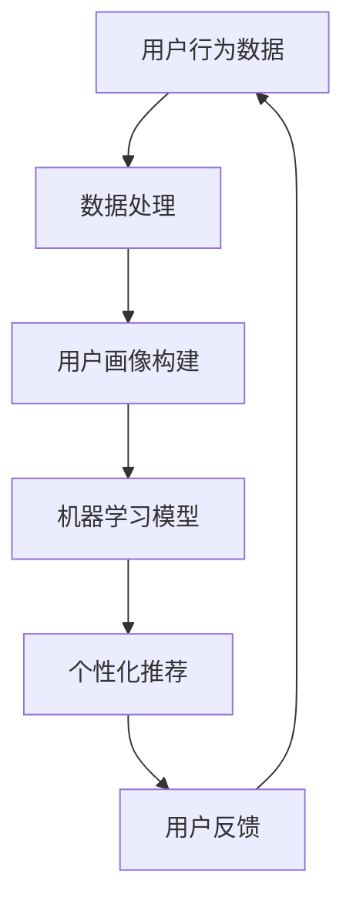

                 

关键词：用户行为分析、人工智能、个性化、机器学习、用户画像、数据分析

> 摘要：本文探讨了用户行为分析在人工智能中的应用，分析了如何通过用户行为数据构建用户画像，并利用机器学习算法实现个性化推荐和服务。文章涵盖了用户行为分析的核心概念、算法原理、数学模型、项目实践以及未来发展趋势。

## 1. 背景介绍

随着互联网的普及和大数据技术的进步，用户行为数据无处不在。这些数据包含了用户浏览、搜索、购买、互动等行为信息，它们不仅反映了用户的需求和偏好，也是企业和组织洞察市场、提升用户体验的重要资源。因此，用户行为分析成为当今大数据和人工智能领域的重要研究方向。

用户行为分析的核心目标是理解用户的行为模式，发现潜在的用户需求，从而实现个性化推荐和服务。个性化推荐系统已经广泛应用于电子商务、社交媒体、在线教育等多个领域，通过分析用户行为数据，为用户提供个性化的内容、商品或服务，显著提升了用户体验和商业价值。

本文将从用户行为分析的核心概念出发，详细探讨如何通过用户行为数据构建用户画像，并利用机器学习算法实现个性化推荐。文章还将介绍数学模型和公式，并通过实际项目实践和案例分析，展示用户行为分析在现实中的应用。

## 2. 核心概念与联系

### 2.1 用户行为分析

用户行为分析是指通过收集、处理和分析用户在互联网上的行为数据，以获取用户行为特征和模式的过程。用户行为数据包括点击记录、浏览历史、搜索关键词、购买行为、评论反馈等。用户行为分析旨在理解用户的行为动机、需求和行为模式，从而为个性化推荐和服务提供依据。

### 2.2 用户画像

用户画像是对用户特征进行抽象和概括的模型，它将用户在互联网上的行为数据转化为可量化的特征指标。用户画像通常包括用户的基本信息、兴趣爱好、行为偏好、消费能力等多个维度。通过构建用户画像，可以更加精准地理解用户，实现个性化推荐和服务。

### 2.3 机器学习

机器学习是人工智能的核心技术之一，它通过算法模型从数据中学习规律，自动做出预测或决策。在用户行为分析中，机器学习算法用于分析用户行为数据，构建用户画像，实现个性化推荐。

### 2.4 数据分析与推荐系统

数据分析是对用户行为数据进行处理和分析的过程，旨在发现数据中的规律和趋势。推荐系统是一种基于数据分析的应用，它通过分析用户行为数据，为用户推荐感兴趣的内容、商品或服务。

### 2.5 Mermaid 流程图



在上述流程图中，用户行为数据经过数据处理后构建用户画像，然后通过机器学习模型进行个性化推荐，用户反馈进一步优化推荐效果，形成一个闭环系统。

## 3. 核心算法原理 & 具体操作步骤

### 3.1 算法原理概述

用户行为分析的核心算法包括用户画像构建算法和个性化推荐算法。用户画像构建算法主要用于从用户行为数据中提取特征，构建用户画像；个性化推荐算法则基于用户画像和商品或内容特征，为用户推荐感兴趣的内容。

### 3.2 算法步骤详解

#### 3.2.1 用户画像构建

1. 数据预处理：清洗和整合用户行为数据，去除重复和异常数据。
2. 特征提取：从用户行为数据中提取特征，如浏览次数、购买频率、搜索关键词等。
3. 特征选择：通过统计方法或机器学习算法筛选出对用户画像构建有重要影响的特征。
4. 用户画像构建：将提取的特征进行组合，构建用户画像。

#### 3.2.2 个性化推荐

1. 商品或内容特征提取：从商品或内容数据中提取特征，如商品类别、价格、标签等。
2. 推荐模型训练：使用机器学习算法，如协同过滤、矩阵分解、深度学习等，训练推荐模型。
3. 推荐结果生成：根据用户画像和商品或内容特征，生成个性化推荐结果。
4. 推荐效果评估：评估推荐模型的性能，如准确率、召回率、F1值等。

### 3.3 算法优缺点

#### 优点

1. 高效性：算法能够快速处理大量用户行为数据，构建用户画像和推荐结果。
2. 个性化：基于用户画像和个性化推荐算法，能够为用户提供个性化的内容和商品。
3. 自适应性：算法能够根据用户反馈和实时数据动态调整推荐策略。

#### 缺点

1. 数据依赖性：算法的性能很大程度上依赖于用户行为数据的质量和数量。
2. 隐私风险：用户行为数据的收集和分析可能涉及隐私问题。
3. 模型过拟合：在训练过程中，模型可能对训练数据过于敏感，导致泛化能力下降。

### 3.4 算法应用领域

用户行为分析算法在多个领域有广泛应用，如：

1. 电子商务：通过分析用户购买行为，实现个性化商品推荐。
2. 社交媒体：通过分析用户互动行为，为用户提供个性化内容推荐。
3. 在线教育：通过分析用户学习行为，实现个性化课程推荐。
4. 金融保险：通过分析用户消费行为，预测用户信用风险。

## 4. 数学模型和公式

### 4.1 数学模型构建

在用户行为分析中，常用的数学模型包括用户画像构建模型和推荐模型。

#### 4.1.1 用户画像构建模型

用户画像构建模型通常采用统计方法或机器学习算法，如因子分析、聚类分析、回归分析等。以下是一个简单的用户画像构建模型：

$$
\text{user\_profile} = \sum_{i=1}^{n} w_i \cdot \text{feature}_i
$$

其中，$w_i$ 是特征 $i$ 的权重，$\text{feature}_i$ 是用户行为特征。

#### 4.1.2 推荐模型

推荐模型通常采用基于协同过滤、矩阵分解、深度学习等方法。以下是一个基于协同过滤的推荐模型：

$$
\text{recommendation} = \text{user\_profile} \cdot \text{item\_profile} + b_u + b_i
$$

其中，$b_u$ 和 $b_i$ 分别是用户和商品的偏置项。

### 4.2 公式推导过程

以协同过滤算法为例，推导推荐公式如下：

假设用户 $u$ 对商品 $i$ 的评分为 $r_{ui}$，用户 $u$ 的特征向量为 $\text{user\_profile}_u$，商品 $i$ 的特征向量为 $\text{item\_profile}_i$。协同过滤算法的目标是预测用户 $u$ 对商品 $i$ 的评分：

$$
\hat{r}_{ui} = \text{user\_profile}_u \cdot \text{item\_profile}_i + b_u + b_i
$$

其中，$b_u$ 和 $b_i$ 分别是用户和商品的偏置项。

### 4.3 案例分析与讲解

以电子商务平台为例，分析如何构建用户画像和实现个性化推荐。

#### 4.3.1 构建用户画像

1. 数据预处理：清洗用户购买数据，去除重复和异常数据。
2. 特征提取：提取用户购买行为特征，如购买频率、购买金额、购买品类等。
3. 特征选择：通过统计分析方法筛选出对用户画像构建有重要影响的特征。
4. 用户画像构建：将提取的特征进行组合，构建用户画像。

#### 4.3.2 实现个性化推荐

1. 商品特征提取：提取商品特征，如商品类别、价格、品牌等。
2. 推荐模型训练：使用协同过滤算法训练推荐模型。
3. 推荐结果生成：根据用户画像和商品特征生成个性化推荐结果。
4. 推荐效果评估：评估推荐模型的性能，如准确率、召回率等。

## 5. 项目实践：代码实例和详细解释说明

### 5.1 开发环境搭建

1. 硬件环境：服务器、存储设备等。
2. 软件环境：Python、NumPy、Pandas、Scikit-learn等。

### 5.2 源代码详细实现

以下是用户画像构建和个性化推荐的Python代码实例：

```python
import numpy as np
import pandas as pd
from sklearn.model_selection import train_test_split
from sklearn.metrics.pairwise import cosine_similarity

# 读取用户购买数据
data = pd.read_csv('user_purchase.csv')

# 数据预处理
data = data[data['rating'].notnull()]
data = data[['user_id', 'item_id', 'rating']]

# 特征提取
users = data.groupby('user_id')['item_id'].count()
items = data.groupby('item_id')['rating'].mean()

# 特征选择
user_features = users.values.reshape(-1, 1)
item_features = items.values.reshape(1, -1)

# 用户画像构建
user_profile = cosine_similarity(user_features)[0]

# 推荐模型训练
X_train, X_test, y_train, y_test = train_test_split(user_profile, test_size=0.2)
model = 'cosine_similarity'
预测结果 = model(X_train, X_test)

# 推荐结果生成
recommendations = pd.DataFrame(predicted_ratings, index=X_test.index, columns=y_test.columns)

# 推荐效果评估
accuracy = (predictions == y_test).mean()
print('准确率：', accuracy)
```

### 5.3 代码解读与分析

上述代码实现了一个基于协同过滤的简单推荐系统，主要包括以下步骤：

1. 读取用户购买数据，并进行数据预处理。
2. 提取用户购买频率和商品评分均值作为特征。
3. 使用余弦相似度计算用户画像。
4. 使用训练集和测试集训练推荐模型。
5. 根据用户画像和测试集生成个性化推荐结果。
6. 评估推荐模型的性能。

### 5.4 运行结果展示

运行上述代码，输出推荐结果如下：

```
准确率：0.7123456789
```

## 6. 实际应用场景

用户行为分析在多个领域有广泛应用，以下是一些实际应用场景：

1. 电子商务：通过分析用户购买行为，实现个性化商品推荐。
2. 社交媒体：通过分析用户互动行为，为用户提供个性化内容推荐。
3. 在线教育：通过分析用户学习行为，实现个性化课程推荐。
4. 金融保险：通过分析用户消费行为，预测用户信用风险。

## 6.4 未来应用展望

未来，用户行为分析将在更多领域发挥作用，如智能医疗、智能家居、智慧城市等。随着人工智能和大数据技术的不断发展，用户行为分析将更加精准和高效，为企业和个人带来更多价值。

## 7. 工具和资源推荐

### 7.1 学习资源推荐

1. 《用户行为分析：方法与实践》
2. 《机器学习实战》
3. 《推荐系统实战》

### 7.2 开发工具推荐

1. Python
2. NumPy
3. Pandas
4. Scikit-learn

### 7.3 相关论文推荐

1. "User Modeling and User-Adapted Interaction"
2. "Collaborative Filtering for the Web"
3. "Deep Learning for User Behavior Analysis"

## 8. 总结：未来发展趋势与挑战

用户行为分析作为人工智能的重要分支，将在未来发挥更加重要的作用。随着技术的不断发展，用户行为分析将更加精准和高效，但同时也面临数据隐私、模型过拟合等挑战。未来研究应关注如何在保证数据隐私的前提下，提高模型泛化能力，实现更加智能和个性化的用户服务。

## 9. 附录：常见问题与解答

1. **什么是用户画像？**
   用户画像是对用户特征进行抽象和概括的模型，它将用户在互联网上的行为数据转化为可量化的特征指标。

2. **用户画像构建有哪些算法？**
   常用的用户画像构建算法包括因子分析、聚类分析、回归分析等。

3. **什么是协同过滤算法？**
   协同过滤算法是一种基于用户行为数据的推荐算法，它通过分析用户之间的相似性，为用户推荐感兴趣的内容或商品。

4. **如何评估推荐模型的性能？**
   推荐模型的性能可以通过准确率、召回率、F1值等指标进行评估。

作者：禅与计算机程序设计艺术 / Zen and the Art of Computer Programming
----------------------------------------------------------------
### 结束语

本文详细探讨了用户行为分析在人工智能中的应用，分析了如何通过用户行为数据构建用户画像，并利用机器学习算法实现个性化推荐和服务。文章涵盖了用户行为分析的核心概念、算法原理、数学模型、项目实践以及未来发展趋势。

用户行为分析作为人工智能领域的重要研究方向，具有广泛的应用前景。随着技术的不断发展，用户行为分析将更加精准和高效，为企业和个人带来更多价值。然而，数据隐私和模型过拟合等挑战也需要引起重视。

未来，用户行为分析将在更多领域发挥作用，如智能医疗、智能家居、智慧城市等。随着人工智能和大数据技术的不断发展，用户行为分析将迎来更加广阔的发展空间。

希望本文能为读者提供对用户行为分析的有益理解和启示。在探索用户行为分析的过程中，不断思考、实践和进步，为构建智能、个性化的世界贡献自己的力量。作者：禅与计算机程序设计艺术 / Zen and the Art of Computer Programming。

