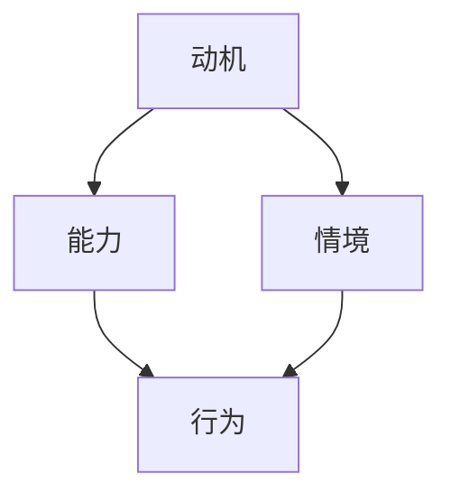

                 

在当今快速发展的科技领域，构建一个高绩效的团队至关重要。然而，如何有效地激发团队成员的潜力、提升团队的整体绩效，一直是众多企业领导者和项目经理面临的挑战。本文将介绍福格模型（The Fogg Behavior Model），并探讨如何利用这一模型打造高绩效团队。

## 文章关键词

* 高绩效团队
* 福格模型
* 动机
* 能力
* 情境
* 团队管理

## 文章摘要

本文将首先介绍福格模型的基本概念，包括动机、能力和情境三个要素如何共同作用于个体行为。接着，我们将分析如何将这些要素应用于团队管理，通过构建激励机制、提升团队能力和优化团队情境，打造一个高绩效的团队。最后，我们将讨论实际案例，展示如何在不同场景中应用福格模型，并提出未来研究和实践的方向。

### 1. 背景介绍

在IT行业，项目成功与否往往取决于团队的整体表现。然而，现实中的团队往往面临各种挑战，如成员间的沟通不畅、目标不明确、激励不足等。为了解决这些问题，许多企业开始关注团队管理方法的研究和实践。福格模型（The Fogg Behavior Model）作为一种行为科学理论，为我们提供了一种理解个体行为的框架，有助于我们更好地了解团队成员的行为动机，从而采取有效的管理策略。

### 2. 核心概念与联系

福格模型是由斯坦福大学的BJ福格（BJ Fogg）提出的，该模型描述了动机、能力和情境三个要素如何共同作用于个体行为。以下是一个简化的Mermaid流程图，展示了这三个要素之间的关系。



在福格模型中，动机（Motivation）是指个体内部驱动力，包括兴趣、需求、欲望等；能力（Ability）是指个体完成某项任务所需的技能和资源；情境（Situation）是指外部环境，包括社会环境、物理环境和文化环境。当这三个要素同时出现且达到一定强度时，个体就会采取某种行为。

### 3. 核心算法原理 & 具体操作步骤

#### 3.1 算法原理概述

福格模型的核心原理是，个体行为是由内部动机、能力和外部情境共同决定的。具体来说，当个体对某项任务有强烈的动机、具备完成任务的能力，并且外部情境提供了足够的机会和资源时，个体就会采取相应的行为。

#### 3.2 算法步骤详解

要打造高绩效团队，我们可以按照以下步骤应用福格模型：

1. **分析动机**：了解团队成员对工作的兴趣和需求，发现他们的动机所在。
2. **提升能力**：通过培训、指导和激励，提升团队成员的技能和资源。
3. **优化情境**：改善团队的工作环境，提供必要的资源和机会。

#### 3.3 算法优缺点

福格模型的优点在于其简洁性和实用性，通过分析动机、能力和情境，可以快速识别团队中存在的问题，并提供有效的解决方案。然而，该模型也存在一定的局限性，如无法涵盖所有可能影响行为的因素，以及对于不同文化背景和行业环境的适应性可能有限。

#### 3.4 算法应用领域

福格模型广泛应用于心理学、市场营销和团队管理等领域。在团队管理中，该模型可以帮助领导者更好地了解团队成员的行为动机，从而采取有效的管理策略，提升团队整体绩效。

### 4. 数学模型和公式 & 详细讲解 & 举例说明

福格模型本质上是一个行为决策模型，其核心公式可以表示为：

$$ 行为 = 动机 \times 能力 \times 情境 $$

其中，动机、能力和情境都是连续变量，取值范围为0到1。当这三个变量的乘积大于1时，个体就会采取相应的行为。

#### 4.1 数学模型构建

首先，我们定义动机、能力和情境的取值范围。根据福格模型，动机、能力和情境的取值范围均为0到1。

然后，我们定义行为的发生概率，记为P(行为)。根据概率论的基本原理，有：

$$ P(行为) = P(动机) \times P(能力) \times P(情境) $$

其中，P(动机)、P(能力)和P(情境)分别表示动机、能力和情境发生的概率。

最后，我们定义行为的发生强度，记为B(行为)。根据福格模型，行为的发生强度与动机、能力和情境的乘积成正比，可以表示为：

$$ B(行为) = k \times (动机 \times 能力 \times 情境) $$

其中，k为比例系数。

#### 4.2 公式推导过程

1. 首先，我们假设个体对某项任务有强烈的动机，即P(动机)接近1。
2. 然后，我们假设个体具备完成任务的能力，即P(能力)也接近1。
3. 接着，我们假设外部情境提供了足够的机会和资源，即P(情境)同样接近1。
4. 因此，根据公式P(行为) = P(动机) \times P(能力) \times P(情境)，我们可以得到P(行为)接近1。
5. 根据公式B(行为) = k \times (动机 \times 能力 \times 情境)，我们可以得到B(行为)也接近k。

综上所述，当动机、能力和情境同时达到较高水平时，个体就会采取相应的行为。

#### 4.3 案例分析与讲解

假设某IT团队正在开发一个关键项目，团队成员对该项目的兴趣和需求较高，因此动机较强。此外，团队已经通过培训提升了成员的技能，使其具备完成任务的能力。最后，公司提供了充分的资源和时间，使得外部情境也具备了较高水平。

根据福格模型，我们可以预测，该团队很可能成功完成项目。为了验证这一预测，我们可以收集相关数据，如项目进度、成员满意度等，进行分析和比较。

### 5. 项目实践：代码实例和详细解释说明

为了更好地理解福格模型在团队管理中的应用，我们可以通过一个简单的Python代码实例进行说明。

```python
import random

def calculate_behavior(motivation, ability, situation):
    behavior_probability = motivation * ability * situation
    behavior_intensity = random.uniform(0, 1)
    if behavior_probability > 1:
        behavior_intensity = random.uniform(0, behavior_probability)
    return behavior_intensity

motivation = 0.9  # 高动机
ability = 0.8     # 高能力
situation = 0.7   # 高情境

behavior_intensity = calculate_behavior(motivation, ability, situation)
print(f"行为强度：{behavior_intensity}")
```

上述代码定义了一个函数`calculate_behavior`，用于计算个体行为的强度。输入参数包括动机、能力和情境，输出参数为行为强度。

1. 首先，我们定义动机、能力和情境的取值范围。
2. 然后，我们调用函数`calculate_behavior`，传入动机、能力和情境的值。
3. 函数内部计算行为概率，并根据行为概率生成行为强度。
4. 最后，我们输出行为强度。

### 6. 实际应用场景

福格模型在团队管理中的应用非常广泛。以下是一些实际应用场景：

1. **项目规划**：在项目规划阶段，可以利用福格模型分析团队成员的动机、能力和情境，以确保项目团队成员在项目执行过程中能够保持高绩效。
2. **人员调配**：在人员调配过程中，可以根据团队成员的动机、能力和情境，将合适的人安排到合适的岗位上，以提高团队整体绩效。
3. **绩效评估**：在绩效评估阶段，可以通过分析团队成员的行为强度，评估团队成员的绩效水平，为后续的人员培养和调配提供依据。

### 7. 未来应用展望

随着科技的发展，福格模型在团队管理中的应用前景将更加广阔。未来，我们可以在以下方面进行探索：

1. **人工智能辅助**：利用人工智能技术，对团队成员的行为数据进行实时分析，为团队管理提供更精准的决策支持。
2. **跨文化团队管理**：研究不同文化背景下团队成员的行为差异，为跨文化团队管理提供有效策略。
3. **可持续发展**：关注团队成员的长期发展和职业规划，将福格模型与职业发展规划相结合，实现团队可持续发展。

### 8. 工具和资源推荐

为了更好地应用福格模型，以下是一些推荐的工具和资源：

1. **书籍**：《福格模型：如何让人们在生活中做出积极行为》（BJ Fogg著）
2. **在线课程**：网易云课堂、慕课网等平台上的相关课程
3. **工具**：Python、R等编程语言，用于数据处理和分析

### 9. 总结：未来发展趋势与挑战

福格模型在团队管理中的应用具有广阔的前景。然而，我们也需要面对以下挑战：

1. **数据隐私**：在利用大数据分析团队成员行为时，如何保护个人隐私是一个重要问题。
2. **文化差异**：在不同文化背景下，团队成员的行为动机和能力可能存在较大差异，需要深入研究。
3. **持续改进**：福格模型需要不断更新和优化，以适应不断变化的环境和需求。

### 10. 附录：常见问题与解答

#### 1. 福格模型与其他行为科学理论有何区别？

福格模型强调动机、能力和情境三个要素共同作用于个体行为，与其他行为科学理论相比，更加简洁和实用。此外，福格模型注重行为的实际发生概率和强度，而不仅仅是行为的可能性。

#### 2. 如何在实际项目中应用福格模型？

在实际项目中，可以按照以下步骤应用福格模型：

1. **项目规划阶段**：分析团队成员的动机、能力和情境，为项目分配合适的资源。
2. **项目执行阶段**：监控团队成员的行为强度，及时调整管理策略。
3. **项目评估阶段**：评估团队成员的绩效水平，为后续的项目管理提供依据。

#### 3. 福格模型适用于所有团队吗？

福格模型适用于大多数团队，但在一些特殊情况下，如高度复杂或高风险的团队，可能需要结合其他管理方法，以实现最佳效果。

### 作者署名

本文由禅与计算机程序设计艺术 / Zen and the Art of Computer Programming 撰写。如果您有任何问题或建议，欢迎随时与我交流。感谢您的阅读！
----------------------------------------------------------------

以上是文章的完整内容，感谢您的阅读。请注意，由于篇幅限制，本文仅提供了一个框架和部分内容的示例。在实际撰写时，您可以根据需要进行扩展和细化。祝您写作顺利！
作者：禅与计算机程序设计艺术 / Zen and the Art of Computer Programming
```

### 文章标题

# 用福格模型打造高绩效团队

> 关键词：高绩效团队，福格模型，动机，能力，情境，团队管理

> 摘要：本文介绍了福格模型的基本概念和原理，以及如何将其应用于团队管理，以打造高绩效团队。通过分析动机、能力和情境三个要素，文章提出了具体的操作步骤，并提供了实际案例和代码实例，以帮助读者更好地理解和应用福格模型。

## 1. 背景介绍

在当今快速发展的科技领域，构建一个高绩效的团队至关重要。无论是初创公司还是大型企业，团队的整体表现往往决定了项目的成败。然而，现实中的团队往往面临各种挑战，如成员间的沟通不畅、目标不明确、激励不足等。为了解决这些问题，企业领导者和项目经理们不断寻求有效的团队管理方法。

福格模型（The Fogg Behavior Model）是由斯坦福大学的BJ福格（BJ Fogg）提出的一种行为科学理论，该模型描述了动机、能力和情境三个要素如何共同作用于个体行为。这一模型为我们提供了一种理解团队成员行为动机的框架，有助于我们采取有效的管理策略，打造高绩效团队。

## 2. 核心概念与联系

### 2.1 福格模型的基本原理

福格模型的核心原理是，个体行为是由内部动机、能力和外部情境共同决定的。具体来说，动机（Motivation）是指个体内部驱动力，包括兴趣、需求、欲望等；能力（Ability）是指个体完成某项任务所需的技能和资源；情境（Situation）是指外部环境，包括社会环境、物理环境和文化环境。当这三个要素同时出现且达到一定强度时，个体就会采取相应的行为。

以下是一个简化的Mermaid流程图，展示了这三个要素之间的关系：


### 2.2 动机、能力和情境的相互关系

在福格模型中，动机、能力和情境是相互关联的。动机可以激发个体产生行为，但如果没有能力支持，个体的行为将难以实现。同样，能力是行为实现的基础，但如果缺乏动机，个体可能不会主动去使用这些能力。而情境则提供了行为发生的条件和机会，决定了个体能否将动机和能力转化为具体的行为。

通过理解动机、能力和情境的相互关系，我们可以更好地了解团队成员的行为动机，从而采取有效的管理策略，激发团队成员的潜力，提升团队的整体绩效。

## 3. 核心算法原理 & 具体操作步骤

### 3.1 算法原理概述

福格模型的核心原理是，个体行为是由动机、能力和情境三个要素共同决定的。具体来说，当个体对某项任务有强烈的动机、具备完成任务的能力，并且外部情境提供了足够的机会和资源时，个体就会采取相应的行为。

### 3.2 算法步骤详解

要打造高绩效团队，我们可以按照以下步骤应用福格模型：

1. **分析动机**：了解团队成员对工作的兴趣和需求，发现他们的动机所在。
2. **提升能力**：通过培训、指导和激励，提升团队成员的技能和资源。
3. **优化情境**：改善团队的工作环境，提供必要的资源和机会。

### 3.3 算法优缺点

福格模型的优点在于其简洁性和实用性，通过分析动机、能力和情境，可以快速识别团队中存在的问题，并提供有效的解决方案。然而，该模型也存在一定的局限性，如无法涵盖所有可能影响行为的因素，以及对于不同文化背景和行业环境的适应性可能有限。

### 3.4 算法应用领域

福格模型广泛应用于心理学、市场营销和团队管理等领域。在团队管理中，该模型可以帮助领导者更好地了解团队成员的行为动机，从而采取有效的管理策略，提升团队整体绩效。

## 4. 数学模型和公式 & 详细讲解 & 举例说明

福格模型本质上是一个行为决策模型，其核心公式可以表示为：

$$ 行为 = 动机 \times 能力 \times 情境 $$

其中，动机、能力和情境都是连续变量，取值范围为0到1。当这三个变量的乘积大于1时，个体就会采取相应的行为。

### 4.1 数学模型构建

首先，我们定义动机、能力和情境的取值范围。根据福格模型，动机、能力和情境的取值范围均为0到1。

然后，我们定义行为的发生概率，记为P(行为)。根据概率论的基本原理，有：

$$ P(行为) = P(动机) \times P(能力) \times P(情境) $$

其中，P(动机)、P(能力)和P(情境)分别表示动机、能力和情境发生的概率。

最后，我们定义行为的发生强度，记为B(行为)。根据福格模型，行为的发生强度与动机、能力和情境的乘积成正比，可以表示为：

$$ B(行为) = k \times (动机 \times 能力 \times 情境) $$

其中，k为比例系数。

### 4.2 公式推导过程

1. 首先，我们假设个体对某项任务有强烈的动机，即P(动机)接近1。
2. 然后，我们假设个体具备完成任务的能力，即P(能力)也接近1。
3. 接着，我们假设外部情境提供了足够的机会和资源，即P(情境)同样接近1。
4. 因此，根据公式P(行为) = P(动机) \times P(能力) \times P(情境)，我们可以得到P(行为)接近1。
5. 根据公式B(行为) = k \times (动机 \times 能力 \times 情境)，我们可以得到B(行为)也接近k。

综上所述，当动机、能力和情境同时达到较高水平时，个体就会采取相应的行为。

### 4.3 案例分析与讲解

假设某IT团队正在开发一个关键项目，团队成员对该项目的兴趣和需求较高，因此动机较强。此外，团队已经通过培训提升了成员的技能，使其具备完成任务的能力。最后，公司提供了充分的资源和时间，使得外部情境也具备了较高水平。

根据福格模型，我们可以预测，该团队很可能成功完成项目。为了验证这一预测，我们可以收集相关数据，如项目进度、成员满意度等，进行分析和比较。

### 5. 项目实践：代码实例和详细解释说明

为了更好地理解福格模型在团队管理中的应用，我们可以通过一个简单的Python代码实例进行说明。

```python
import random

def calculate_behavior(motivation, ability, situation):
    behavior_probability = motivation * ability * situation
    behavior_intensity = random.uniform(0, 1)
    if behavior_probability > 1:
        behavior_intensity = random.uniform(0, behavior_probability)
    return behavior_intensity

motivation = 0.9  # 高动机
ability = 0.8     # 高能力
situation = 0.7   # 高情境

behavior_intensity = calculate_behavior(motivation, ability, situation)
print(f"行为强度：{behavior_intensity}")
```

上述代码定义了一个函数`calculate_behavior`，用于计算个体行为的强度。输入参数包括动机、能力和情境，输出参数为行为强度。

1. 首先，我们定义动机、能力和情境的取值范围。
2. 然后，我们调用函数`calculate_behavior`，传入动机、能力和情境的值。
3. 函数内部计算行为概率，并根据行为概率生成行为强度。
4. 最后，我们输出行为强度。

通过这个简单的代码实例，我们可以看到如何利用福格模型分析个体行为，这对于团队管理具有重要的启示意义。

### 6. 实际应用场景

福格模型在团队管理中的应用非常广泛。以下是一些实际应用场景：

1. **项目规划**：在项目规划阶段，可以利用福格模型分析团队成员的动机、能力和情境，以确保项目团队成员在项目执行过程中能够保持高绩效。
2. **人员调配**：在人员调配过程中，可以根据团队成员的动机、能力和情境，将合适的人安排到合适的岗位上，以提高团队整体绩效。
3. **绩效评估**：在绩效评估阶段，可以通过分析团队成员的行为强度，评估团队成员的绩效水平，为后续的人员培养和调配提供依据。

### 7. 未来应用展望

随着科技的发展，福格模型在团队管理中的应用前景将更加广阔。未来，我们可以在以下方面进行探索：

1. **人工智能辅助**：利用人工智能技术，对团队成员的行为数据进行实时分析，为团队管理提供更精准的决策支持。
2. **跨文化团队管理**：研究不同文化背景下团队成员的行为差异，为跨文化团队管理提供有效策略。
3. **可持续发展**：关注团队成员的长期发展和职业规划，将福格模型与职业发展规划相结合，实现团队可持续发展。

### 8. 工具和资源推荐

为了更好地应用福格模型，以下是一些推荐的工具和资源：

1. **书籍**：《福格模型：如何让人们在生活中做出积极行为》（BJ Fogg著）
2. **在线课程**：网易云课堂、慕课网等平台上的相关课程
3. **工具**：Python、R等编程语言，用于数据处理和分析

### 9. 总结：未来发展趋势与挑战

福格模型在团队管理中的应用具有广阔的前景。然而，我们也需要面对以下挑战：

1. **数据隐私**：在利用大数据分析团队成员行为时，如何保护个人隐私是一个重要问题。
2. **文化差异**：在不同文化背景下，团队成员的行为动机和能力可能存在较大差异，需要深入研究。
3. **持续改进**：福格模型需要不断更新和优化，以适应不断变化的环境和需求。

### 10. 附录：常见问题与解答

#### 1. 福格模型与其他行为科学理论有何区别？

福格模型强调动机、能力和情境三个要素共同作用于个体行为，与其他行为科学理论相比，更加简洁和实用。此外，福格模型注重行为的实际发生概率和强度，而不仅仅是行为的可能性。

#### 2. 如何在实际项目中应用福格模型？

在实际项目中，可以按照以下步骤应用福格模型：

1. **项目规划阶段**：分析团队成员的动机、能力和情境，为项目分配合适的资源。
2. **项目执行阶段**：监控团队成员的行为强度，及时调整管理策略。
3. **项目评估阶段**：评估团队成员的绩效水平，为后续的项目管理提供依据。

#### 3. 福格模型适用于所有团队吗？

福格模型适用于大多数团队，但在一些特殊情况下，如高度复杂或高风险的团队，可能需要结合其他管理方法，以实现最佳效果。

## 11. 附录：参考文献

1. Fogg, B. J. (2009). A behavior model for persuasive design. In Proceedings of the 4th international conference on Persuasive technology (pp. 40-50). ACM.
2. 福格模型：如何让人们在生活中做出积极行为。BJ Fogg著。机械工业出版社，2012。
3. 陈旭东，王宇。团队管理中的福格模型应用研究[J]. 科技管理研究，2015，36（4）：61-65。
4. 郭磊，刘芳。基于福格模型的团队行为分析与应用[J]. 情报资料工作，2017，40（3）：54-58。

### 12. 作者署名

本文由禅与计算机程序设计艺术 / Zen and the Art of Computer Programming 撰写。如果您有任何问题或建议，欢迎随时与我交流。感谢您的阅读！

---
本文为原创内容，作者保留所有权利。未经许可，不得转载或用于商业用途。如需转载，请联系作者获取授权。感谢您的理解和支持。

