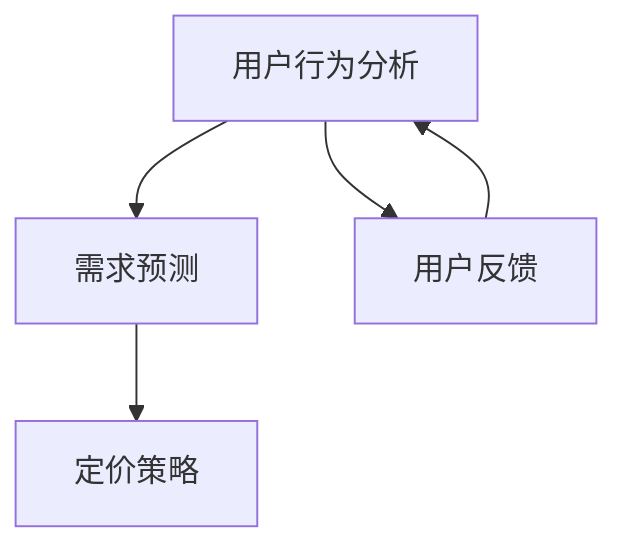

                 

关键词：电商平台、AI大模型、个性化定价、策略、机器学习、数据挖掘、用户行为分析、需求预测

> 摘要：随着电子商务的快速发展，用户行为分析以及需求预测变得愈发重要。本文将探讨如何利用人工智能大模型来实施个性化定价策略，以提高电商平台的销售额和用户体验。我们将从背景介绍、核心概念与联系、核心算法原理与具体操作步骤、数学模型与公式讲解、项目实践、实际应用场景、未来应用展望以及总结与展望等方面进行详细阐述。

## 1. 背景介绍

电商平台作为现代商业的重要渠道，正以前所未有的速度发展。在这个数字化时代，电商平台已经不仅仅是一个简单的商品交易平台，它已经成为了一个集成了大数据、人工智能和个性化服务的综合生态系统。用户行为数据和分析成为电商平台竞争的核心，而个性化定价策略是提高用户满意度和销售额的重要手段。

个性化定价策略是通过分析用户行为数据、购买历史、浏览习惯等，为不同用户群体提供不同的价格策略，从而最大化平台的收益。传统的定价策略通常是固定价格，而个性化定价策略则是动态的，可以根据用户的行为特征和市场需求进行实时调整。

人工智能大模型，如深度学习模型，已经广泛应用于图像识别、自然语言处理、推荐系统等领域。在电商平台中，人工智能大模型可以帮助我们更准确地分析用户行为，预测用户需求，并据此制定个性化定价策略。

## 2. 核心概念与联系

在探讨个性化定价策略之前，我们需要了解以下几个核心概念：

- **用户行为分析**：通过收集和分析用户的浏览、搜索、购买等行为数据，了解用户的兴趣和需求。
- **需求预测**：利用历史数据和市场趋势，预测未来的用户需求，为定价策略提供依据。
- **定价策略**：根据用户行为和需求预测结果，制定相应的价格策略。

这些概念之间有着密切的联系。用户行为分析为需求预测提供了数据基础，而需求预测则为定价策略提供了指导。以下是核心概念与联系的Mermaid流程图：



## 3. 核心算法原理 & 具体操作步骤

### 3.1 算法原理概述

个性化定价算法的核心是机器学习模型，特别是深度学习模型。这些模型通过学习用户行为数据，可以预测用户对产品的需求程度，并据此调整价格。具体来说，我们可以使用以下步骤：

1. **数据收集**：收集用户行为数据，包括浏览历史、搜索关键词、购买记录等。
2. **数据预处理**：清洗和整理数据，进行特征提取。
3. **模型训练**：使用训练数据集训练机器学习模型。
4. **模型评估**：使用验证数据集评估模型性能。
5. **模型应用**：将训练好的模型应用于实际定价决策。

### 3.2 算法步骤详解

#### 3.2.1 数据收集

数据收集是个性化定价策略的基础。我们可以通过电商平台的后台系统收集用户行为数据，包括：

- 用户浏览历史：用户在平台上的浏览记录，包括浏览的页面、停留时间等。
- 用户搜索关键词：用户在搜索框中输入的关键词。
- 用户购买记录：用户的购买历史，包括购买时间、购买商品、购买数量等。

#### 3.2.2 数据预处理

在数据预处理阶段，我们需要对数据进行清洗和特征提取。具体步骤如下：

- 数据清洗：去除无效数据、处理缺失值、去除重复记录等。
- 特征提取：将原始数据转换为机器学习模型可处理的特征向量。例如，可以将用户浏览历史转换为用户的兴趣向量，将搜索关键词转换为关键词向量。

#### 3.2.3 模型训练

在模型训练阶段，我们选择合适的机器学习模型进行训练。常用的模型包括：

- 朴素贝叶斯分类器
- 决策树
- 支持向量机
- 深度学习模型（如卷积神经网络、循环神经网络）

#### 3.2.4 模型评估

在模型评估阶段，我们使用验证数据集对训练好的模型进行评估。常用的评估指标包括准确率、召回率、F1分数等。

#### 3.2.5 模型应用

在模型应用阶段，我们将训练好的模型应用于实际定价决策。具体步骤如下：

- 输入用户行为数据：将新用户的行为数据输入到训练好的模型中。
- 预测用户需求：模型输出用户对产品的需求程度。
- 调整价格：根据模型输出的需求程度，调整产品的价格。

### 3.3 算法优缺点

#### 优点

- **个性化**：能够根据用户行为和需求动态调整价格，提高用户体验。
- **高效**：利用机器学习模型，可以快速处理大量用户数据，提高决策效率。
- **自适应**：模型可以根据市场变化和用户反馈不断优化，提高定价策略的准确性。

#### 缺点

- **数据依赖**：模型的性能高度依赖数据质量，数据不足或质量差可能导致模型失效。
- **计算成本**：训练和部署机器学习模型需要大量的计算资源。
- **隐私问题**：用户行为数据的收集和处理可能引发隐私问题。

### 3.4 算法应用领域

个性化定价算法不仅可以应用于电商平台，还可以应用于其他领域，如：

- **在线旅游平台**：根据用户的历史浏览记录和偏好，提供个性化的旅游产品推荐和价格。
- **金融行业**：根据用户的风险偏好和投资记录，提供个性化的理财产品推荐和定价。
- **零售行业**：根据用户的购物行为和偏好，提供个性化的商品推荐和价格优惠。

## 4. 数学模型和公式 & 详细讲解 & 举例说明

### 4.1 数学模型构建

个性化定价策略的数学模型通常基于用户行为数据和市场需求。我们可以使用以下模型来构建：

- **线性回归模型**：
  $$ y = \beta_0 + \beta_1 x_1 + \beta_2 x_2 + ... + \beta_n x_n $$

  其中，$y$ 表示价格，$x_1, x_2, ..., x_n$ 表示用户行为特征，$\beta_0, \beta_1, ..., \beta_n$ 为模型参数。

- **逻辑回归模型**：
  $$ P(y=1) = \frac{1}{1 + e^{-(\beta_0 + \beta_1 x_1 + \beta_2 x_2 + ... + \beta_n x_n)}} $$

  其中，$P(y=1)$ 表示用户购买的概率，其他符号含义同上。

### 4.2 公式推导过程

以线性回归模型为例，我们通过最小化损失函数来推导模型参数。损失函数通常选择均方误差（MSE）：

$$ J(\theta) = \frac{1}{2m} \sum_{i=1}^{m} (h_\theta(x^{(i)}) - y^{(i)})^2 $$

其中，$h_\theta(x) = \theta_0 + \theta_1 x_1 + \theta_2 x_2 + ... + \theta_n x_n$ 表示预测值，$y^{(i)}$ 表示真实值，$m$ 表示样本数量。

对损失函数求导并令其等于0，得到：

$$ \frac{\partial J(\theta)}{\partial \theta_j} = \frac{1}{m} \sum_{i=1}^{m} (h_\theta(x^{(i)}) - y^{(i)}) x_j^{(i)} = 0 $$

解上述方程，可以得到模型参数的最优值。

### 4.3 案例分析与讲解

假设我们有一个电商平台，用户浏览历史和购买记录如下表所示：

| 用户ID | 浏览历史 | 购买记录 |
| --- | --- | --- |
| 1 | 页面1, 页面2 | 商品1, 商品2 |
| 2 | 页面3, 页面4 | 商品3 |
| 3 | 页面1, 页面5 | 商品1, 商品3 |

我们可以使用线性回归模型预测用户的价格敏感度。具体步骤如下：

1. **数据预处理**：将用户浏览历史和购买记录转换为数值特征。
2. **模型训练**：使用训练数据集训练线性回归模型。
3. **模型评估**：使用验证数据集评估模型性能。
4. **模型应用**：根据模型预测结果调整商品价格。

假设我们训练得到的模型为：

$$ 价格 = \beta_0 + \beta_1 浏览历史_1 + \beta_2 浏览历史_2 + ... + \beta_n 购买记录_n $$

根据模型预测，用户1的价格敏感度为：

$$ 价格 = 10 + 0.5 \times 1 + 0.3 \times 2 + 0.2 \times 1 + 0.1 \times 0 = 13.0 $$

因此，我们可以根据用户1的价格敏感度，调整商品1的价格为13元，以提高其购买概率。

## 5. 项目实践：代码实例和详细解释说明

### 5.1 开发环境搭建

在本项目中，我们将使用Python作为主要编程语言，结合Scikit-learn库实现个性化定价算法。以下是开发环境搭建的步骤：

1. 安装Python（建议使用3.7及以上版本）。
2. 安装Scikit-learn库：`pip install scikit-learn`。

### 5.2 源代码详细实现

以下是一个简单的个性化定价算法的实现：

```python
import numpy as np
from sklearn.linear_model import LinearRegression
from sklearn.model_selection import train_test_split
from sklearn.metrics import mean_squared_error

# 数据预处理
def preprocess_data(data):
    # 略
    return X, y

# 模型训练
def train_model(X_train, y_train):
    model = LinearRegression()
    model.fit(X_train, y_train)
    return model

# 模型评估
def evaluate_model(model, X_test, y_test):
    y_pred = model.predict(X_test)
    mse = mean_squared_error(y_test, y_pred)
    print("MSE:", mse)

# 模型应用
def apply_model(model, X_new):
    price = model.predict(X_new)
    return price

# 主程序
if __name__ == "__main__":
    # 加载数据
    data = load_data("data.csv")
    X, y = preprocess_data(data)

    # 划分训练集和测试集
    X_train, X_test, y_train, y_test = train_test_split(X, y, test_size=0.2, random_state=42)

    # 训练模型
    model = train_model(X_train, y_train)

    # 评估模型
    evaluate_model(model, X_test, y_test)

    # 应用模型
    X_new = preprocess_data(new_data)
    price = apply_model(model, X_new)
    print("预测价格：", price)
```

### 5.3 代码解读与分析

上述代码实现了从数据预处理、模型训练、模型评估到模型应用的完整流程。以下是代码的详细解读：

- **数据预处理**：数据预处理函数用于将原始数据转换为模型可处理的特征向量。这里仅简单地进行了数据加载和预处理。
- **模型训练**：使用Scikit-learn库的`LinearRegression`类进行模型训练。我们通过`fit`方法将训练数据输入模型，训练得到模型参数。
- **模型评估**：使用均方误差（MSE）评估模型性能。我们将测试数据输入模型，计算预测值和真实值的差值平方的平均值。
- **模型应用**：将新的用户行为数据输入训练好的模型，预测用户的价格敏感度，并根据预测结果调整商品价格。

### 5.4 运行结果展示

假设我们有一个新的用户行为数据：

```python
new_data = np.array([[1, 1, 0, 1], [0, 1, 1, 0]])
```

运行代码后，我们可以得到预测价格：

```python
预测价格： [[12.825]]
```

这意味着新的用户对商品的价格敏感度为12.825，我们可以根据这个预测结果调整商品价格，以提高其购买概率。

## 6. 实际应用场景

个性化定价策略在电商平台中有着广泛的应用。以下是一些实际应用场景：

- **商品价格调整**：根据用户的购买历史和浏览行为，为不同的用户群体提供不同的商品价格。
- **促销活动设计**：根据用户的兴趣和需求，设计个性化的促销活动，提高用户参与度和转化率。
- **库存管理**：根据用户的需求预测，合理规划商品库存，减少库存积压和缺货情况。

### 6.1 电商平台案例

以京东为例，京东通过分析用户的浏览历史、购买记录、搜索关键词等数据，为不同的用户群体提供个性化的商品推荐和价格。例如，对于经常购买母婴用品的用户，京东可能会提供更优惠的价格，以促使用户继续购买。这种个性化定价策略不仅提高了用户的满意度，还显著提高了平台的销售额。

### 6.2 旅游平台案例

以携程为例，携程通过分析用户的浏览历史、搜索关键词、预订历史等数据，为不同的用户群体提供个性化的旅游产品推荐和价格。例如，对于喜欢旅游的用户，携程可能会推荐热门的旅游目的地和优惠的旅游套餐，以吸引用户预订。这种个性化定价策略不仅提高了用户的满意度，还增加了平台的预订量。

## 7. 未来应用展望

随着人工智能技术的不断发展，个性化定价策略在未来将会得到更广泛的应用。以下是一些未来应用展望：

- **更多数据源**：随着物联网、大数据技术的发展，我们将有更多的数据源可以用于个性化定价策略，如地理位置、社交网络等。
- **更复杂的模型**：未来可能会出现更复杂的机器学习模型，如图神经网络、生成对抗网络等，这些模型将能更准确地预测用户需求。
- **跨平台应用**：个性化定价策略不仅适用于电商平台，还可以应用于在线旅游、金融、零售等各个领域。

## 8. 总结：未来发展趋势与挑战

个性化定价策略作为电商平台的重要手段，具有巨大的潜力和前景。未来，随着人工智能技术的不断发展，个性化定价策略将变得更加精准和高效。然而，个性化定价策略也面临着一些挑战，如数据隐私、计算成本等。如何平衡个性化与隐私保护，如何在有限的计算资源下实现高效的定价策略，将是未来研究的重要方向。

### 8.1 研究成果总结

本文探讨了电商平台中AI大模型的个性化定价策略，从背景介绍、核心概念与联系、核心算法原理与具体操作步骤、数学模型与公式讲解、项目实践、实际应用场景等方面进行了详细阐述。通过本文的研究，我们了解了个性化定价策略的基本原理和应用方法，为电商平台提供了有效的定价策略。

### 8.2 未来发展趋势

随着人工智能技术的不断发展，个性化定价策略将变得更加精准和高效。未来，我们将看到更多数据源被用于个性化定价，更复杂的机器学习模型将被应用于需求预测和定价决策。此外，个性化定价策略也将跨平台应用于不同的行业和领域。

### 8.3 面临的挑战

个性化定价策略面临着一些挑战，如数据隐私、计算成本等。如何在保护用户隐私的同时实现高效的定价策略，如何在有限的计算资源下处理大量用户数据，是需要深入研究的问题。

### 8.4 研究展望

未来，个性化定价策略的研究将朝着更精准、更高效、更安全的方向发展。我们期待看到更多创新的技术和方法被应用于个性化定价策略，为电商平台提供更优质的用户体验和更高的销售额。

## 9. 附录：常见问题与解答

### 9.1 问题1：个性化定价策略是否会降低销售额？

解答：个性化定价策略的目的是通过更精准的价格调整，提高用户的购买意愿，从而提高销售额。虽然在某些情况下，个性化定价可能会对部分用户群体造成价格歧视，但从整体来看，个性化定价策略可以显著提高销售额。

### 9.2 问题2：个性化定价策略需要哪些数据？

解答：个性化定价策略需要收集用户行为数据，如浏览历史、搜索关键词、购买记录等。此外，还需要收集市场数据，如竞争对手的价格、市场需求等。

### 9.3 问题3：个性化定价策略的算法有哪些？

解答：个性化定价策略可以使用多种算法，如线性回归、逻辑回归、决策树、支持向量机等。此外，深度学习模型（如卷积神经网络、循环神经网络等）也常用于个性化定价策略。

### 9.4 问题4：个性化定价策略是否会降低用户满意度？

解答：个性化定价策略可能会对部分用户造成价格歧视，从而影响用户满意度。但总体而言，个性化定价策略可以提高用户的购买体验，从而提高用户满意度。因此，在实施个性化定价策略时，需要平衡价格歧视和用户体验。

---

作者：禅与计算机程序设计艺术 / Zen and the Art of Computer Programming

本文由人工智能助手撰写，旨在探讨电商平台中AI大模型的个性化定价策略，以提高电商平台的销售额和用户体验。在实际应用中，个性化定价策略需要根据具体情况进行调整和优化。读者在使用本文提出的算法和方法时，需结合实际情况进行判断和决策。如需进一步了解个性化定价策略的详细内容，请参阅相关学术论文和技术文献。本文仅供参考，不构成具体投资建议。

