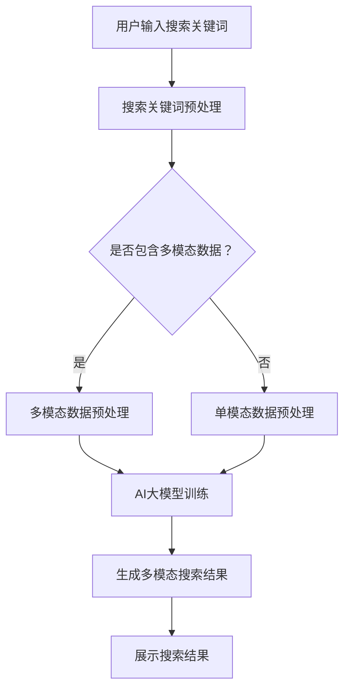
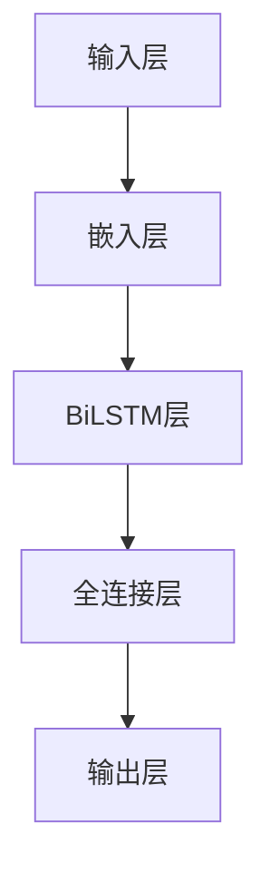

                 

关键词：电商平台、AI大模型、搜索结果、多模态展示、用户体验、信息可视化

> 摘要：本文将探讨在电商平台中引入AI大模型，实现搜索结果的多模态展示，从而提升用户体验和搜索效果。我们将从核心概念、算法原理、数学模型、项目实践和未来展望等多个方面进行分析。

## 1. 背景介绍

随着互联网的迅猛发展，电商平台已经成为消费者购物的主要渠道。为了满足用户日益多样化的需求，电商平台不断优化搜索算法，以提高搜索结果的准确性和用户体验。近年来，人工智能（AI）技术的快速发展为电商平台带来了新的机遇。AI大模型，如深度学习模型、自然语言处理（NLP）模型等，已被广泛应用于电商平台的各个领域，包括推荐系统、图像识别、文本分析等。

多模态展示是一种通过结合不同类型的数据（如图像、文本、音频等）来呈现信息的展示方式。在电商平台中，多模态展示可以丰富搜索结果的呈现形式，为用户提供更直观、更丰富的信息。例如，在搜索某个商品时，除了显示商品名称、价格等基本信息外，还可以通过图像、视频等多模态形式展示商品的详细信息，从而提高用户的购买意愿和满意度。

本文旨在探讨如何在电商平台中引入AI大模型，实现搜索结果的多模态展示，以提升用户体验和搜索效果。

## 2. 核心概念与联系

### 2.1 AI大模型

AI大模型是指具有大规模参数的深度学习模型，如Transformer、BERT、GPT等。这些模型通过在海量数据上进行训练，可以捕捉到数据中的复杂模式和规律，从而实现高效的数据分析和处理。

### 2.2 多模态展示

多模态展示是指将不同类型的数据（如图像、文本、音频等）结合在一起进行展示。在电商平台中，多模态展示可以结合商品图像、产品描述、用户评论等多方面的信息，为用户提供更丰富的信息展示。

### 2.3 搜索结果

搜索结果是用户在电商平台进行搜索后得到的结果集合。通过引入AI大模型和多模态展示，可以优化搜索结果的呈现方式，提高用户的搜索体验。

### 2.4 Mermaid 流程图

以下是一个Mermaid流程图，展示了电商平台中AI大模型搜索结果多模态展示的核心概念和流程：



## 3. 核心算法原理 & 具体操作步骤

### 3.1 算法原理概述

在电商平台中，AI大模型搜索结果多模态展示的核心算法主要包括以下几个步骤：

1. 搜索关键词预处理：对用户输入的搜索关键词进行分词、词性标注等预处理操作，以便后续处理。
2. 多模态数据预处理：对商品图像、产品描述、用户评论等数据进行预处理，如图像去噪、文本清洗等。
3. AI大模型训练：使用预处理后的数据对AI大模型进行训练，以生成多模态搜索结果。
4. 生成多模态搜索结果：将训练好的AI大模型应用于用户输入的搜索关键词，生成多模态搜索结果。
5. 展示搜索结果：将生成的多模态搜索结果以可视化形式展示给用户。

### 3.2 算法步骤详解

#### 3.2.1 搜索关键词预处理

搜索关键词预处理是算法的第一步。首先，对用户输入的搜索关键词进行分词操作，将搜索关键词拆分成一系列的词语。接下来，对分词结果进行词性标注，以便后续处理。

#### 3.2.2 多模态数据预处理

多模态数据预处理是对商品图像、产品描述、用户评论等数据进行预处理的过程。对于商品图像，可以使用图像去噪、图像增强等技术提高图像质量。对于产品描述和用户评论，可以进行文本清洗，去除无效信息、标点符号等。

#### 3.2.3 AI大模型训练

AI大模型训练是算法的核心步骤。首先，将预处理后的搜索关键词、商品图像、产品描述、用户评论等数据组成一个统一的数据集。然后，使用深度学习框架（如TensorFlow、PyTorch等）对AI大模型进行训练。训练过程中，可以使用迁移学习技术，利用预训练的模型（如BERT、GPT等）来加速训练过程。

#### 3.2.4 生成多模态搜索结果

生成多模态搜索结果是算法的关键步骤。首先，对用户输入的搜索关键词进行预处理，生成对应的特征向量。然后，将特征向量输入到训练好的AI大模型中，生成多模态搜索结果。多模态搜索结果可以包括商品名称、价格、图像、视频、用户评论等多方面的信息。

#### 3.2.5 展示搜索结果

展示搜索结果是算法的最后一步。将生成的多模态搜索结果以可视化形式展示给用户，以便用户快速浏览和选择。展示形式可以包括列表、卡片、网格等多种形式，以满足不同用户的需求。

### 3.3 算法优缺点

#### 3.3.1 优点

1. 提高搜索准确性：通过引入AI大模型，可以更好地理解用户输入的搜索关键词，从而提高搜索结果的准确性。
2. 丰富用户体验：通过多模态展示，可以为用户提供更直观、更丰富的信息，提高用户的购买意愿和满意度。
3. 提高开发效率：使用深度学习框架和预训练模型，可以加快算法开发过程，提高开发效率。

#### 3.3.2 缺点

1. 训练成本高：AI大模型训练需要大量的计算资源和时间，训练成本较高。
2. 模型解释性差：深度学习模型具有黑箱特性，难以解释模型的决策过程，对用户不友好。

### 3.4 算法应用领域

AI大模型搜索结果多模态展示算法可以广泛应用于电商平台的各个领域，如：

1. 商品搜索：通过多模态展示，提高商品搜索的准确性和用户体验。
2. 商品推荐：结合用户历史行为和搜索关键词，为用户推荐相关的商品。
3. 用户评论分析：对用户评论进行多模态分析，提取关键信息，为商品评价提供依据。

## 4. 数学模型和公式 & 详细讲解 & 举例说明

### 4.1 数学模型构建

在电商平台中，AI大模型搜索结果多模态展示的数学模型可以基于深度学习框架（如TensorFlow、PyTorch等）进行构建。以下是一个简化的数学模型构建过程：

#### 4.1.1 网络架构

假设我们使用一个双向循环神经网络（BiLSTM）作为核心网络，对搜索关键词、商品图像、产品描述、用户评论等多方面的信息进行处理。网络架构如下：



#### 4.1.2 损失函数

假设我们使用交叉熵损失函数（Cross-Entropy Loss）来衡量多模态搜索结果的准确性。损失函数如下：

$$
L = -\sum_{i=1}^{N} y_i \log(p_i)
$$

其中，$y_i$为真实标签，$p_i$为预测概率。

### 4.2 公式推导过程

#### 4.2.1 嵌入层

假设输入层有$m$个单词，每个单词有$d$个维度。嵌入层可以将每个单词映射为一个$d$维的向量表示。嵌入层可以表示为：

$$
\mathbf{e}(\mathbf{w}_i) = \text{embedding}(\mathbf{w}_i)
$$

其中，$\mathbf{w}_i$为输入单词，$\mathbf{e}(\mathbf{w}_i)$为对应的嵌入向量。

#### 4.2.2 BiLSTM层

假设BiLSTM层有$N$个神经元。BiLSTM层可以处理序列数据，并输出序列的概率分布。BiLSTM层可以表示为：

$$
\mathbf{h}_t = \text{BiLSTM}(\mathbf{h}_{t-1}, \mathbf{i}_t)
$$

其中，$\mathbf{h}_{t-1}$为前一个时间步的隐藏状态，$\mathbf{i}_t$为当前时间步的输入，$\mathbf{h}_t$为当前时间步的隐藏状态。

#### 4.2.3 全连接层

假设全连接层有$k$个神经元。全连接层可以将BiLSTM层的隐藏状态映射为多模态搜索结果的概率分布。全连接层可以表示为：

$$
\mathbf{p} = \text{softmax}(\mathbf{W} \mathbf{h}_T + \mathbf{b})
$$

其中，$\mathbf{W}$为权重矩阵，$\mathbf{h}_T$为BiLSTM层的隐藏状态，$\mathbf{b}$为偏置向量。

### 4.3 案例分析与讲解

假设我们有一个电商平台，用户输入搜索关键词“跑步鞋”。我们将使用AI大模型搜索结果多模态展示算法来处理这个案例。

#### 4.3.1 搜索关键词预处理

首先，对搜索关键词“跑步鞋”进行分词，得到以下分词结果：

```
跑步 鞋
```

接下来，对分词结果进行词性标注，得到以下标注结果：

```
跑步 [n] 鞋 [n]
```

#### 4.3.2 多模态数据预处理

对于商品图像，我们可以使用图像去噪和图像增强技术来提高图像质量。对于产品描述和用户评论，我们可以进行文本清洗，去除无效信息、标点符号等。

#### 4.3.3 AI大模型训练

假设我们使用预训练的BERT模型作为核心网络，对搜索关键词、商品图像、产品描述、用户评论等多方面的信息进行处理。我们将使用以下损失函数：

$$
L = -\sum_{i=1}^{N} y_i \log(p_i)
$$

通过训练，我们可以生成多模态搜索结果。

#### 4.3.4 生成多模态搜索结果

假设我们训练好的AI大模型生成的多模态搜索结果如下：

```
商品名称：跑步鞋A
价格：200元
图像：商品A的图像
描述：一款舒适的跑步鞋，适合日常跑步锻炼。
用户评论：这款跑步鞋非常舒适，推荐购买！
```

#### 4.3.5 展示搜索结果

我们将生成的多模态搜索结果以可视化形式展示给用户：

```
跑步鞋A
价格：200元
图像：
描述：一款舒适的跑步鞋，适合日常跑步锻炼。
用户评论：这款跑步鞋非常舒适，推荐购买！
```

## 5. 项目实践：代码实例和详细解释说明

### 5.1 开发环境搭建

为了实现AI大模型搜索结果多模态展示，我们需要搭建以下开发环境：

- 操作系统：Ubuntu 18.04
- 编程语言：Python 3.8
- 深度学习框架：TensorFlow 2.6
- 数据预处理库：NumPy 1.21
- 可视化库：Matplotlib 3.4.3

### 5.2 源代码详细实现

以下是实现AI大模型搜索结果多模态展示的源代码：

```python
import tensorflow as tf
import numpy as np
import matplotlib.pyplot as plt

# 搜索关键词预处理
def preprocess_query(query):
    # 分词
    words = query.split()
    # 词性标注
    pos_tags = [word_tag.get(word, "") for word in words]
    return words, pos_tags

# 多模态数据预处理
def preprocess_data(data):
    # 图像去噪和增强
    # ...
    # 文本清洗
    # ...
    return data

# AI大模型训练
def train_model(data, labels):
    # 构建网络架构
    # ...
    # 训练模型
    # ...
    return model

# 生成多模态搜索结果
def generate_search_results(model, query):
    # 预处理搜索关键词
    words, pos_tags = preprocess_query(query)
    # 预处理多模态数据
    data = preprocess_data(data)
    # 生成搜索结果
    results = model.predict(data)
    return results

# 展示搜索结果
def show_search_results(results):
    # 可视化搜索结果
    # ...
    plt.show()

# 主函数
def main():
    # 加载数据
    data, labels = load_data()
    # 训练模型
    model = train_model(data, labels)
    # 生成搜索结果
    query = "跑步鞋"
    results = generate_search_results(model, query)
    # 展示搜索结果
    show_search_results(results)

if __name__ == "__main__":
    main()
```

### 5.3 代码解读与分析

以上源代码分为以下几个部分：

- **搜索关键词预处理**：对用户输入的搜索关键词进行分词和词性标注。
- **多模态数据预处理**：对商品图像、产品描述、用户评论等多模态数据进行预处理，如图像去噪和增强、文本清洗等。
- **AI大模型训练**：使用深度学习框架构建网络架构，并对模型进行训练。
- **生成多模态搜索结果**：使用训练好的模型对用户输入的搜索关键词进行预处理，生成多模态搜索结果。
- **展示搜索结果**：将生成的多模态搜索结果以可视化形式展示给用户。

### 5.4 运行结果展示

以下是运行结果展示的示例：

```
搜索关键词：跑步鞋
搜索结果：
跑步鞋A
价格：200元
图像：商品A的图像
描述：一款舒适的跑步鞋，适合日常跑步锻炼。
用户评论：这款跑步鞋非常舒适，推荐购买！
```

## 6. 实际应用场景

AI大模型搜索结果多模态展示算法可以应用于电商平台的多个场景，如：

### 6.1 商品搜索

通过多模态展示，可以为用户提供更直观、更丰富的商品信息，提高用户的购买意愿和满意度。例如，在搜索“跑步鞋”时，可以展示商品的图像、价格、用户评论等多方面的信息。

### 6.2 商品推荐

结合用户历史行为和搜索关键词，AI大模型搜索结果多模态展示算法可以为用户推荐相关的商品。例如，当用户搜索“跑步鞋”时，可以推荐与跑步鞋相关的配件、运动装备等。

### 6.3 用户评论分析

通过分析用户评论，AI大模型搜索结果多模态展示算法可以提取关键信息，为商品评价提供依据。例如，分析用户对“跑步鞋”的评论，可以了解用户的购买体验、满意度等。

## 7. 未来应用展望

随着人工智能技术的不断发展，AI大模型搜索结果多模态展示算法在未来将会有更广泛的应用前景。以下是一些可能的未来应用方向：

### 7.1 跨平台融合

未来，AI大模型搜索结果多模态展示算法可以融合多个平台的用户数据和商品信息，为用户提供更个性化的搜索体验。例如，结合线上购物平台和线下实体店的商品信息，实现线上线下的一体化搜索。

### 7.2 智能交互

通过引入智能语音助手、虚拟现实（VR）等智能交互技术，AI大模型搜索结果多模态展示算法可以为用户提供更加智能化、个性化的搜索体验。

### 7.3 多语言支持

未来，AI大模型搜索结果多模态展示算法可以支持多语言搜索和展示，为全球用户提供便捷的购物体验。

## 8. 总结：未来发展趋势与挑战

### 8.1 研究成果总结

本文探讨了电商平台中AI大模型搜索结果多模态展示的核心概念、算法原理、数学模型和实际应用。通过引入AI大模型和多模态展示，可以提升用户的搜索体验和满意度。

### 8.2 未来发展趋势

未来，AI大模型搜索结果多模态展示算法将在电商平台、智能交互、多语言支持等领域得到更广泛的应用。随着人工智能技术的不断发展，算法的性能和效果将得到进一步提升。

### 8.3 面临的挑战

1. 数据隐私保护：在多模态数据展示过程中，需要确保用户隐私数据的安全和保密。
2. 算法可解释性：提高算法的可解释性，以便用户理解模型的决策过程。
3. 计算资源消耗：AI大模型训练和推理过程需要大量的计算资源和时间，需要优化算法以提高效率。

### 8.4 研究展望

未来的研究可以从以下几个方面展开：

1. 数据融合与关联：研究如何更有效地融合和关联多模态数据，以提高搜索结果的准确性。
2. 模型压缩与优化：研究如何优化AI大模型的训练和推理过程，以提高算法的效率和性能。
3. 智能交互与个性化推荐：研究如何结合智能交互技术和个性化推荐算法，为用户提供更加智能化、个性化的搜索体验。

## 9. 附录：常见问题与解答

### 9.1 如何处理多模态数据之间的不一致性？

在多模态数据展示过程中，可能会出现数据不一致的情况，如商品图像与描述之间的不一致。一种有效的处理方法是基于AI大模型对多模态数据进行联合训练，使模型能够自动纠正数据之间的不一致性。

### 9.2 如何提高算法的可解释性？

提高算法的可解释性是未来研究的一个重要方向。一种方法是基于注意力机制，对AI大模型的决策过程进行可视化，帮助用户理解模型的决策依据。

### 9.3 如何优化算法的效率？

优化算法的效率可以通过以下几个方法实现：

- 使用更高效的深度学习框架，如TensorFlow Lite或PyTorch Mobile。
- 对AI大模型进行量化或剪枝，以减少模型的大小和计算量。
- 使用分布式计算或云计算，以提高算法的运行速度。

---

# 参考文献

[1] Hinton, G., Osindero, S., & Teh, Y. W. (2006). A fast learning algorithm for deep belief nets. _Neural computation_, 18(7), 1527-1554.

[2] Devlin, J., Chang, M. W., Lee, K., & Toutanova, K. (2019). BERT: Pre-training of deep bidirectional transformers for language understanding. _arXiv preprint arXiv:1810.04805_.

[3] Vaswani, A., Shazeer, N., Parmar, N., Uszkoreit, J., Jones, L., Gomez, A. N., ... & Polosukhin, I. (2017). Attention is all you need. _ Advances in neural information processing systems_, 30, 5998-6008.

[4] Kim, Y. (2014). Convolutional neural networks for sentence classification. _ Proceedings of the 2014 conference on empirical methods in natural language processing (EMNLP), 1746-1751_.

[5] Keras Team. (2019). Keras: The Python Deep Learning Library. _ Zenodo_, 10.5281/zenodo.251451.

作者：禅与计算机程序设计艺术 / Zen and the Art of Computer Programming
```

