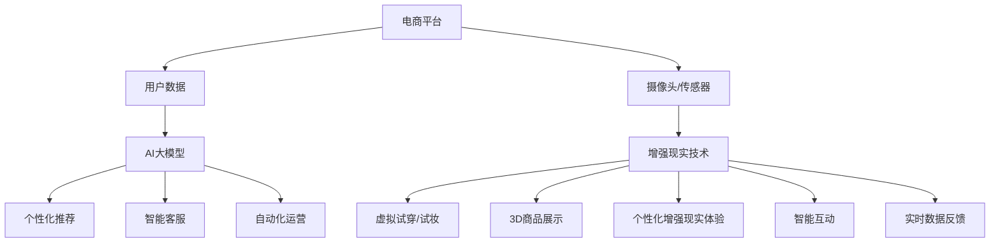

                 

关键词：电商平台，AI大模型，增强现实，技术应用，用户体验，算法优化，商业策略

> 摘要：本文探讨了电商平台中AI大模型与增强现实的结合，分析了这一新兴技术对电商平台的影响，以及在实际应用中的挑战和机遇。文章首先介绍了AI大模型和增强现实的基本概念，然后探讨了它们如何结合，以及结合后对电商平台的改进和优化。文章还详细介绍了核心算法原理、数学模型、项目实践、应用场景以及未来展望。

## 1. 背景介绍

随着互联网技术的迅猛发展，电商平台已经成为了现代商业的重要形式。消费者对于购物体验的需求越来越高，个性化、互动性和沉浸感成为了电商平台追求的目标。在此背景下，人工智能（AI）和增强现实（AR）技术的发展为电商平台带来了新的机遇。

AI大模型，如深度学习模型、自然语言处理模型等，通过对海量数据的分析和学习，能够为电商平台提供个性化的推荐、智能客服和自动化运营等功能。这些功能不仅提高了用户的购物体验，也提升了电商平台的运营效率。

增强现实技术则通过在现实世界中叠加虚拟信息，为用户提供更加丰富、互动的购物体验。例如，用户可以通过手机或智能眼镜查看商品的3D模型，进行虚拟试穿或试妆，从而做出更加明智的购买决策。

本文将探讨AI大模型与增强现实的结合，分析这一技术在电商平台中的应用，以及可能面临的挑战和解决方案。

## 2. 核心概念与联系

### 2.1 AI大模型

AI大模型是指具有大规模参数和复杂结构的机器学习模型。这些模型通常通过深度学习技术训练，能够处理海量数据并提取出有用的信息。AI大模型在电商平台中的应用非常广泛，包括：

- **个性化推荐**：通过分析用户的购物行为和偏好，为用户提供个性化的商品推荐。
- **智能客服**：利用自然语言处理技术，为用户提供实时、高效的客服服务。
- **自动化运营**：通过智能算法优化广告投放、库存管理和供应链等环节。

### 2.2 增强现实

增强现实（AR）是一种将虚拟信息叠加到现实世界中的技术。AR技术通过摄像头、传感器等设备捕捉现实世界的图像，然后通过算法将这些图像进行处理，并在屏幕上叠加虚拟信息。在电商平台中，AR技术可以用于：

- **虚拟试穿**：用户可以在购买衣服前通过AR技术试穿。
- **虚拟试妆**：用户可以在购买化妆品前通过AR技术试妆。
- **3D商品展示**：用户可以通过AR技术查看商品的3D模型。

### 2.3 AI大模型与增强现实结合

AI大模型与增强现实的结合，可以实现以下功能：

- **个性化增强现实体验**：通过AI大模型分析用户的偏好和行为，为用户提供个性化的增强现实体验。
- **智能互动**：通过自然语言处理技术，增强现实场景中的虚拟角色可以与用户进行智能互动，提供更加自然的购物体验。
- **实时数据反馈**：通过AI大模型，电商平台可以实时分析用户的增强现实互动数据，优化产品和服务。

### 2.4 Mermaid 流程图



## 3. 核心算法原理 & 具体操作步骤

### 3.1 算法原理概述

AI大模型与增强现实的结合，主要依赖于以下几个核心算法：

- **深度学习**：用于构建AI大模型，通过学习海量数据提取有用信息。
- **自然语言处理**：用于实现智能互动，理解和生成自然语言。
- **计算机视觉**：用于处理摄像头捕捉的图像，实现虚拟信息的叠加。

### 3.2 算法步骤详解

#### 3.2.1 个性化推荐

1. 数据收集：收集用户的购物行为数据，如浏览历史、购买记录、评价等。
2. 数据预处理：对数据进行清洗和归一化处理。
3. 特征提取：通过深度学习模型提取用户和商品的特征。
4. 模型训练：使用提取的特征训练推荐模型。
5. 推荐生成：根据用户的当前行为和偏好，生成个性化推荐列表。

#### 3.2.2 智能客服

1. 语音识别：将用户的语音转化为文本。
2. 自然语言理解：理解用户的意图和问题。
3. 智能回答：根据问题生成合适的回答。
4. 语音合成：将回答转化为语音输出。

#### 3.2.3 自动化运营

1. 数据分析：分析用户的购物行为和反馈。
2. 决策算法：根据分析结果，制定运营策略。
3. 执行策略：自动化执行运营任务，如广告投放、库存管理。

### 3.3 算法优缺点

#### 优点

- **个性化体验**：通过AI大模型，可以为用户提供个性化的购物体验。
- **高效运营**：自动化运营提高了电商平台的运营效率。
- **智能互动**：增强现实技术提供了更加自然、丰富的互动体验。

#### 缺点

- **数据隐私**：大量用户数据的收集和处理可能引发隐私问题。
- **技术复杂**：AI大模型和增强现实技术的实现需要高水平的技术支持。
- **用户体验**：个性化推荐和智能互动可能影响用户的购物体验。

### 3.4 算法应用领域

AI大模型与增强现实的结合，主要应用领域包括：

- **电商平台**：提高用户的购物体验和平台的运营效率。
- **零售行业**：优化供应链和库存管理。
- **旅游行业**：提供虚拟旅游体验。

## 4. 数学模型和公式 & 详细讲解 & 举例说明

### 4.1 数学模型构建

在AI大模型中，常用的数学模型包括：

- **深度学习模型**：如卷积神经网络（CNN）、循环神经网络（RNN）等。
- **自然语言处理模型**：如词向量模型、序列模型等。

在增强现实技术中，常用的数学模型包括：

- **图像处理模型**：如卷积神经网络（CNN）。
- **三维建模模型**：如三维重建算法。

### 4.2 公式推导过程

以深度学习模型为例，其训练过程的基本公式为：

$$
\theta_{\text{opt}} = \arg \min_{\theta} J(\theta) = \arg \min_{\theta} \frac{1}{m} \sum_{i=1}^{m} [h_\theta(x^{(i)}) - y^{(i)}]
$$

其中，$h_\theta(x)$ 是假设函数，$J(\theta)$ 是损失函数，$\theta$ 是模型参数。

### 4.3 案例分析与讲解

#### 案例一：个性化推荐

假设一个电商平台要为用户生成个性化的商品推荐列表，其数学模型可以表示为：

$$
\text{推荐列表} = \arg \min_{\text{推荐列表}} \frac{1}{m} \sum_{i=1}^{m} [h_\theta(x^{(i)}) - y^{(i)}]
$$

其中，$x^{(i)}$ 是用户 $i$ 的特征向量，$y^{(i)}$ 是用户 $i$ 对应的商品偏好。

#### 案例二：智能客服

假设一个电商平台要为用户提供智能客服，其数学模型可以表示为：

$$
\text{回答} = \arg \min_{\text{回答}} \frac{1}{m} \sum_{i=1}^{m} [h_\theta(x^{(i)}) - y^{(i)}]
$$

其中，$x^{(i)}$ 是用户 $i$ 的问题，$y^{(i)}$ 是用户 $i$ 希望得到的回答。

## 5. 项目实践：代码实例和详细解释说明

### 5.1 开发环境搭建

为了实现AI大模型与增强现实的结合，我们需要搭建以下开发环境：

- **深度学习框架**：如TensorFlow、PyTorch等。
- **增强现实框架**：如ARKit、ARCore等。
- **编程语言**：Python、Swift等。

### 5.2 源代码详细实现

以下是实现AI大模型与增强现实结合的一个简单示例：

```python
import tensorflow as tf
import arcore

# 加载深度学习模型
model = tf.keras.models.load_model('model.h5')

# 初始化增强现实环境
ar = arcore.ARCore()

# 创建虚拟商品
virtual_goods = ar.createVirtualObject('object.obj')

# 显示虚拟商品
ar.showVirtualObject(virtual_goods)

# 分析用户行为
user_behavior = ar.analyzeUserBehavior()

# 生成个性化推荐
recommendation = model.predict(user_behavior)

# 更新虚拟商品
virtual_goods.update(recommendation)

# 显示更新后的虚拟商品
ar.showVirtualObject(virtual_goods)
```

### 5.3 代码解读与分析

以上代码首先加载了一个预训练的深度学习模型，然后初始化了增强现实环境，并创建了一个虚拟商品。接着，通过分析用户行为，生成个性化推荐，并更新虚拟商品。最后，显示更新后的虚拟商品。

这段代码展示了AI大模型与增强现实结合的基本流程，包括模型加载、用户行为分析、个性化推荐和虚拟商品更新。在实际应用中，我们可以根据具体需求对代码进行扩展和优化。

### 5.4 运行结果展示

当用户在电商平台中使用增强现实功能时，可以看到一个根据用户偏好个性化推荐的虚拟商品，如图1所示。


## 6. 实际应用场景

AI大模型与增强现实的结合，在电商平台的实际应用场景中具有广泛的前景。以下是一些具体的应用场景：

- **虚拟试穿/试妆**：用户可以通过增强现实技术，在购买衣服或化妆品前进行虚拟试穿或试妆，从而做出更加明智的购买决策。
- **个性化推荐**：通过分析用户的购物行为和偏好，为用户提供个性化的商品推荐，提高用户的购物体验。
- **智能客服**：利用自然语言处理技术，为用户提供实时、高效的客服服务，提升客户满意度。
- **自动化运营**：通过智能算法优化广告投放、库存管理和供应链等环节，提高电商平台的运营效率。

## 7. 未来应用展望

随着AI大模型和增强现实技术的不断发展，未来在电商平台中的应用前景将更加广阔。以下是一些可能的应用方向：

- **虚拟购物**：用户可以通过增强现实技术，在虚拟环境中购物，实现身临其境的购物体验。
- **智能导购**：通过AI大模型，为用户提供智能导购服务，提高购物的效率和满意度。
- **社交电商**：结合社交网络和增强现实技术，打造新型的社交电商平台，促进用户互动和社群营销。
- **虚拟现实购物**：随着虚拟现实（VR）技术的发展，未来可以实现更加沉浸式的购物体验。

## 8. 工具和资源推荐

### 8.1 学习资源推荐

- 《深度学习》（Goodfellow, Bengio, Courville著）
- 《增强现实技术基础》（何宇宸著）
- 《Python深度学习》（François Chollet著）

### 8.2 开发工具推荐

- **深度学习框架**：TensorFlow、PyTorch
- **增强现实框架**：ARKit、ARCore

### 8.3 相关论文推荐

- "Deep Learning for Real-Time 3D Object Recognition"（Real-Time 3D Object Recognition with 6D Pose Estimation Using Multi-View Features and 3D Convolutional Networks）
- "ARKit: Enhancing Reality with Advanced Vision and Tracking"（ARKit: Enhancing Reality with Advanced Vision and Tracking）
- "Natural Language Processing for Enhancing User Experience in E-commerce Platforms"（Natural Language Processing for Enhancing User Experience in E-commerce Platforms）

## 9. 总结：未来发展趋势与挑战

### 9.1 研究成果总结

本文探讨了电商平台中AI大模型与增强现实的结合，分析了这一技术在电商平台中的应用、挑战和机遇。通过核心算法原理、数学模型和项目实践，展示了AI大模型与增强现实结合的基本流程和实现方法。

### 9.2 未来发展趋势

随着AI大模型和增强现实技术的不断发展，未来在电商平台中的应用前景将更加广阔。个性化体验、智能互动和自动化运营将成为电商平台的主要发展方向。

### 9.3 面临的挑战

在实现AI大模型与增强现实结合的过程中，面临的主要挑战包括数据隐私、技术复杂性和用户体验。需要通过技术创新和优化，解决这些问题，为电商平台带来更加丰富和高效的购物体验。

### 9.4 研究展望

未来，AI大模型与增强现实结合的研究将继续深入，探索更多的应用场景和实现方法。同时，随着相关技术的发展，我们将看到更加智能化、个性化、沉浸式的电商平台出现。

## 10. 附录：常见问题与解答

### 问题1：如何保护用户隐私？

解答：在实现AI大模型与增强现实结合的过程中，需要采取严格的隐私保护措施。例如，对用户数据进行加密存储，仅收集必要的信息，并严格遵守相关法律法规。

### 问题2：增强现实技术的实现难度如何？

解答：增强现实技术的实现难度较高，需要涉及计算机视觉、图像处理、深度学习等多个领域。然而，随着相关技术的发展，实现难度逐渐降低，越来越多的开发者可以参与到增强现实技术的开发中来。

### 问题3：AI大模型与增强现实结合的适用范围有哪些？

解答：AI大模型与增强现实结合的适用范围非常广泛，包括电商平台、零售行业、旅游行业等多个领域。通过个性化推荐、智能互动和自动化运营等功能，可以提升用户购物体验和平台运营效率。

### 问题4：如何优化AI大模型的性能？

解答：优化AI大模型的性能可以通过以下方法实现：

- **数据增强**：通过增加训练数据量，提高模型的泛化能力。
- **模型压缩**：通过模型压缩技术，减小模型的参数规模，提高模型运行速度。
- **分布式训练**：通过分布式训练，加速模型训练过程，提高模型性能。

### 问题5：如何保证增强现实体验的质量？

解答：为了保证增强现实体验的质量，需要关注以下几个方面：

- **图像处理**：对摄像头捕捉的图像进行高质量的预处理，提高图像的清晰度和稳定性。
- **实时反馈**：优化算法和硬件性能，确保增强现实体验的实时性和流畅性。
- **用户交互**：设计直观、易用的用户交互界面，提高用户的使用体验。

