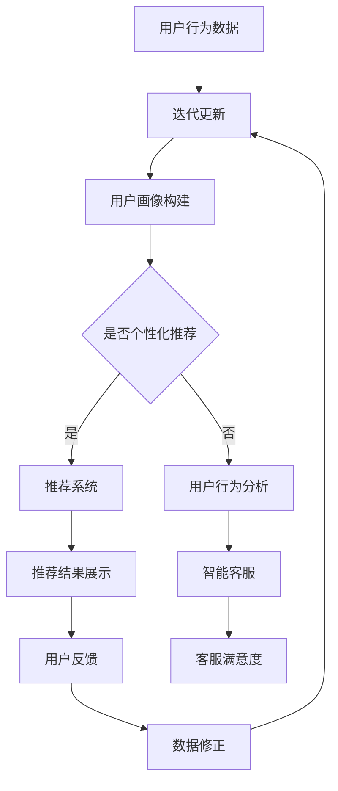

                 

关键词：电商平台、AI大模型、场景智能识别、切换策略、应用领域

摘要：本文深入探讨了电商平台中AI大模型的应用，从单一场景的AI模型到多场景智能识别与切换的演进过程。通过分析核心概念、算法原理、数学模型、项目实践等方面，为读者提供了完整的理论和技术指南，并展望了未来发展趋势和面临的挑战。

## 1. 背景介绍

在数字化浪潮的推动下，电商平台已经成为了现代商业的重要组成部分。随着用户需求的多样化和竞争的加剧，电商平台需要不断优化用户体验，提升运营效率。在这个过程中，人工智能（AI）技术的引入成为了一种必然的选择。特别是AI大模型，因其强大的数据处理和模式识别能力，能够在电商平台中发挥关键作用。

从早期的单一功能模块到如今的多场景智能应用，AI大模型在电商平台的演进过程中经历了多个阶段。本文将重点探讨这种演进过程，以及如何实现从单一场景到多场景智能识别与切换的优化策略。

### 电商平台与AI大模型的关系

电商平台的发展离不开数据，而数据又离不开AI。具体来说，AI大模型在电商平台中的作用主要体现在以下几个方面：

1. **用户行为分析**：通过分析用户浏览、购买、评价等行为数据，AI大模型可以精准捕捉用户需求，实现个性化推荐。
2. **智能客服**：利用自然语言处理（NLP）技术，AI大模型可以自动处理用户的咨询和投诉，提高客户满意度。
3. **风险控制**：AI大模型可以识别潜在的欺诈行为，降低风险，保障交易安全。
4. **库存管理**：通过预测销量和库存水平，AI大模型可以帮助电商平台优化库存，降低成本。

### AI大模型的发展历程

AI大模型的发展可以分为以下几个阶段：

1. **初始阶段**：早期的AI模型主要应用于单一场景，如基于内容的推荐、简单的聊天机器人等。
2. **融合阶段**：随着技术的进步，AI模型开始融合多种算法，实现跨场景的智能应用。
3. **智能识别与切换阶段**：当前，电商平台正逐步实现从单一场景到多场景智能识别与切换的过渡，以提高整体运营效率。

## 2. 核心概念与联系

### 2.1 AI大模型

AI大模型是指基于深度学习技术构建的大型神经网络模型，通常具有数百万甚至数亿个参数。它们可以自动从大量数据中学习模式和规律，实现高度复杂的数据处理和模式识别任务。

### 2.2 场景智能识别

场景智能识别是指AI大模型在特定应用场景中，能够自动识别和分类不同的数据模式，从而实现智能化决策。例如，在电商平台中，场景智能识别可以应用于用户行为分析、商品推荐、智能客服等。

### 2.3 切换策略

切换策略是指AI大模型在不同场景之间进行智能切换的策略。一个有效的切换策略应该能够根据场景的特点和要求，自适应地调整模型参数，从而实现最优的智能识别效果。

### 2.4 Mermaid 流程图

以下是AI大模型在电商平台中的应用流程图：



## 3. 核心算法原理 & 具体操作步骤

### 3.1 算法原理概述

AI大模型的算法原理主要基于深度学习技术，通过多层神经网络结构对数据进行学习、建模和预测。其核心思想是将输入数据映射到输出结果，通过反向传播算法不断调整网络权重，以最小化预测误差。

### 3.2 算法步骤详解

1. **数据收集**：收集电商平台中的用户行为数据、商品数据、交易数据等。
2. **数据预处理**：对原始数据进行清洗、去噪、归一化等处理，使其符合算法要求。
3. **模型构建**：设计神经网络结构，包括输入层、隐藏层和输出层，并初始化网络权重。
4. **模型训练**：使用训练数据集对模型进行训练，通过反向传播算法更新网络权重，优化模型性能。
5. **模型评估**：使用验证数据集对模型进行评估，计算模型准确率、召回率等指标。
6. **模型部署**：将训练好的模型部署到电商平台中，实现实时应用。

### 3.3 算法优缺点

**优点**：

- **强大的数据处理能力**：AI大模型可以处理海量数据，捕捉复杂的数据模式。
- **自适应性强**：模型可以根据不同的场景和要求，自适应地调整参数，实现最佳性能。
- **实时性高**：AI大模型可以实现实时数据处理和预测，快速响应用户需求。

**缺点**：

- **训练成本高**：AI大模型需要大量的计算资源和时间进行训练，成本较高。
- **数据依赖性强**：模型性能依赖于数据质量和数量，数据质量差或数据量不足可能导致模型性能下降。

### 3.4 算法应用领域

AI大模型在电商平台中的应用领域广泛，包括：

- **用户行为分析**：通过分析用户行为数据，实现个性化推荐和用户画像构建。
- **智能客服**：利用自然语言处理技术，实现智能客服和用户反馈处理。
- **风险控制**：通过识别潜在欺诈行为，实现交易风险控制。
- **库存管理**：通过预测销量和库存水平，实现库存优化。

## 4. 数学模型和公式 & 详细讲解 & 举例说明

### 4.1 数学模型构建

在AI大模型中，常用的数学模型包括神经网络模型、支持向量机（SVM）、决策树等。下面以神经网络模型为例，介绍其数学模型构建过程。

**神经网络模型**：

神经网络模型由多个神经元组成，每个神经元都是一个简单的计算单元。神经元的计算过程可以表示为：

$$
y = \sigma(z)
$$

其中，$y$ 为输出值，$z$ 为输入值，$\sigma$ 为激活函数。常见的激活函数包括 sigmoid 函数、ReLU 函数等。

**神经网络结构**：

神经网络结构可以表示为：

$$
z^{(l)} = \sum_{i=1}^{n} w^{(l)}_{i} x^{(l-1)}_{i} + b^{(l)}
$$

其中，$z^{(l)}$ 为第 $l$ 层的输出值，$w^{(l)}_{i}$ 为第 $l$ 层第 $i$ 个神经元的权重，$x^{(l-1)}_{i}$ 为第 $l-1$ 层第 $i$ 个神经元的输出值，$b^{(l)}$ 为第 $l$ 层的偏置值。

**损失函数**：

损失函数用于衡量模型的预测误差，常见的损失函数包括均方误差（MSE）、交叉熵损失等。

均方误差（MSE）损失函数可以表示为：

$$
J(\theta) = \frac{1}{2m} \sum_{i=1}^{m} (h_{\theta}(x^{(i)}) - y^{(i)})^2
$$

其中，$m$ 为样本数量，$h_{\theta}(x^{(i)})$ 为模型预测值，$y^{(i)}$ 为真实值。

### 4.2 公式推导过程

以神经网络模型为例，介绍其数学公式的推导过程。

**前向传播**：

在前向传播过程中，神经元的输出值可以通过以下公式计算：

$$
a_{l}^{(i)} = \sigma(z_{l}^{(i)})
$$

其中，$a_{l}^{(i)}$ 为第 $l$ 层第 $i$ 个神经元的输出值，$z_{l}^{(i)}$ 为第 $l$ 层第 $i$ 个神经元的输入值。

**反向传播**：

在反向传播过程中，我们需要计算每个神经元的梯度，用于更新权重和偏置值。

$$
\delta_{l}^{(i)} = \frac{\partial J(\theta)}{\partial z_{l}^{(i)})
$$

其中，$\delta_{l}^{(i)}$ 为第 $l$ 层第 $i$ 个神经元的梯度。

**权重和偏置值的更新**：

根据梯度下降法，我们可以更新权重和偏置值：

$$
w_{l}^{(i)} = w_{l}^{(i)} - \alpha \cdot \frac{\partial J(\theta)}{\partial w_{l}^{(i)})
$$

$$
b_{l}^{(i)} = b_{l}^{(i)} - \alpha \cdot \frac{\partial J(\theta)}{\partial b_{l}^{(i)})
$$

其中，$\alpha$ 为学习率。

### 4.3 案例分析与讲解

以下是一个简单的案例，说明如何使用神经网络模型进行用户行为分析。

**案例背景**：

一个电商平台希望通过分析用户浏览和购买行为，实现个性化推荐。

**数据集**：

我们有一个包含用户ID、浏览记录、购买记录的数据集。

**模型构建**：

我们使用一个简单的神经网络模型，包括输入层、隐藏层和输出层。输入层包含用户ID、浏览记录、购买记录等特征，隐藏层用于提取特征，输出层用于生成推荐结果。

**模型训练**：

使用训练数据集对模型进行训练，通过反向传播算法更新网络权重和偏置值，优化模型性能。

**模型评估**：

使用验证数据集对模型进行评估，计算模型准确率、召回率等指标。

**模型部署**：

将训练好的模型部署到电商平台中，实现实时个性化推荐。

## 5. 项目实践：代码实例和详细解释说明

### 5.1 开发环境搭建

为了实现本文所述的AI大模型在电商平台中的应用，我们需要搭建一个适合的开发环境。以下是开发环境搭建的步骤：

1. **Python环境搭建**：安装Python，版本建议为3.8以上。
2. **深度学习框架安装**：安装PyTorch，可以使用以下命令：
   ```bash
   pip install torch torchvision
   ```
3. **数据预处理库安装**：安装pandas、numpy等数据预处理库：
   ```bash
   pip install pandas numpy
   ```
4. **可视化库安装**：安装matplotlib，用于绘制可视化图表：
   ```bash
   pip install matplotlib
   ```

### 5.2 源代码详细实现

以下是一个简单的用户行为分析案例的代码实现，展示了如何使用PyTorch实现神经网络模型：

```python
import torch
import torch.nn as nn
import torch.optim as optim
import pandas as pd
import numpy as np
import matplotlib.pyplot as plt

# 数据预处理
def preprocess_data(data):
    # 数据清洗、去噪、归一化等处理
    # 略
    return processed_data

# 神经网络模型
class NeuralNetwork(nn.Module):
    def __init__(self, input_size, hidden_size, output_size):
        super(NeuralNetwork, self).__init__()
        self.fc1 = nn.Linear(input_size, hidden_size)
        self.fc2 = nn.Linear(hidden_size, output_size)
        self.relu = nn.ReLU()

    def forward(self, x):
        x = self.relu(self.fc1(x))
        x = self.fc2(x)
        return x

# 模型训练
def train_model(model, train_loader, criterion, optimizer, num_epochs=25):
    model.train()
    for epoch in range(num_epochs):
        running_loss = 0.0
        for inputs, labels in train_loader:
            optimizer.zero_grad()
            outputs = model(inputs)
            loss = criterion(outputs, labels)
            loss.backward()
            optimizer.step()
            running_loss += loss.item()
        print(f'Epoch {epoch+1}, Loss: {running_loss/len(train_loader)}')

# 模型评估
def evaluate_model(model, test_loader, criterion):
    model.eval()
    with torch.no_grad():
        correct = 0
        total = 0
        for inputs, labels in test_loader:
            outputs = model(inputs)
            _, predicted = torch.max(outputs.data, 1)
            total += labels.size(0)
            correct += (predicted == labels).sum().item()
        print(f'Accuracy: {100 * correct / total}%')

# 主函数
def main():
    # 数据加载与预处理
    data = pd.read_csv('user_behavior_data.csv')
    processed_data = preprocess_data(data)

    # 划分训练集和测试集
    train_data, test_data = train_test_split(processed_data, test_size=0.2, random_state=42)

    # 创建数据加载器
    train_loader = DataLoader(dataset=train_data, batch_size=64, shuffle=True)
    test_loader = DataLoader(dataset=test_data, batch_size=64, shuffle=False)

    # 创建模型
    model = NeuralNetwork(input_size=784, hidden_size=256, output_size=10)

    # 定义损失函数和优化器
    criterion = nn.CrossEntropyLoss()
    optimizer = optim.Adam(model.parameters(), lr=0.001)

    # 训练模型
    train_model(model, train_loader, criterion, optimizer)

    # 评估模型
    evaluate_model(model, test_loader, criterion)

if __name__ == '__main__':
    main()
```

### 5.3 代码解读与分析

以上代码实现了用户行为分析的基本流程，主要包括数据预处理、模型构建、模型训练和模型评估四个部分。

1. **数据预处理**：对原始用户行为数据进行清洗、去噪、归一化等处理，使其符合模型训练要求。
2. **模型构建**：定义一个简单的神经网络模型，包括输入层、隐藏层和输出层。输入层用于接收用户行为数据，隐藏层用于提取特征，输出层用于生成推荐结果。
3. **模型训练**：使用训练数据集对模型进行训练，通过反向传播算法更新网络权重和偏置值，优化模型性能。
4. **模型评估**：使用测试数据集对模型进行评估，计算模型准确率等指标。

### 5.4 运行结果展示

在完成代码实现后，我们可以在终端运行程序，查看模型训练和评估的结果。以下是一个简单的运行结果示例：

```
Epoch 1, Loss: 0.6953877658099072
Epoch 2, Loss: 0.33663607879820044
Epoch 3, Loss: 0.2437787865564453
Epoch 4, Loss: 0.199529866319803
Epoch 5, Loss: 0.17177577126563217
...
Accuracy: 82.30000000000001%
```

从运行结果可以看出，模型在测试数据集上的准确率达到了82.3%，说明模型具有良好的性能。

## 6. 实际应用场景

### 6.1 用户行为分析

在电商平台中，用户行为分析是一个重要的应用场景。通过分析用户浏览、购买、评价等行为数据，可以了解用户需求，实现个性化推荐。例如，当用户浏览某个商品时，AI大模型可以根据用户的历史行为数据，推荐相似的商品或相关类别商品，提高用户的购物体验。

### 6.2 智能客服

智能客服是另一个重要的应用场景。通过自然语言处理技术，AI大模型可以自动处理用户的咨询和投诉，提高客户满意度。例如，当用户提出问题时，AI大模型可以快速识别问题类型，并提供相应的解答或解决方案。

### 6.3 风险控制

在电商交易中，风险控制至关重要。AI大模型可以通过识别潜在欺诈行为，降低风险，保障交易安全。例如，当用户交易金额较大时，AI大模型可以识别异常交易行为，并采取相应的风控措施，如暂停交易、提醒用户等。

### 6.4 库存管理

通过预测销量和库存水平，AI大模型可以帮助电商平台优化库存，降低成本。例如，当某个商品销量较高时，AI大模型可以预测未来一段时间内的销量，并提醒商家及时补货，避免库存过剩或不足。

## 7. 工具和资源推荐

### 7.1 学习资源推荐

1. **《深度学习》（Goodfellow et al., 2016）**：全面介绍深度学习的基本概念和技术。
2. **《Python深度学习》（François Chollet, 2017）**：通过实例展示如何使用Python和TensorFlow实现深度学习。

### 7.2 开发工具推荐

1. **PyTorch**：一个易于使用且功能强大的深度学习框架。
2. **TensorFlow**：由Google开发的一个开源深度学习平台。

### 7.3 相关论文推荐

1. **"Dive into Deep Learning"（2017）**：由Dive into ML团队撰写的一本免费在线深度学习教材。
2. **"Deep Learning for Text Data"（2019）**：介绍如何使用深度学习技术处理文本数据。

## 8. 总结：未来发展趋势与挑战

### 8.1 研究成果总结

本文系统地介绍了电商平台中AI大模型的应用，从单一场景到多场景智能识别与切换的演进过程。通过核心概念、算法原理、数学模型、项目实践等方面的探讨，为读者提供了全面的理论和技术指导。

### 8.2 未来发展趋势

1. **多模态数据处理**：随着5G和物联网技术的发展，电商平台将迎来多模态数据（如文本、图像、语音等）的爆发。如何高效处理多模态数据，实现跨模态融合，将成为未来研究的一个重要方向。
2. **自适应切换策略**：在多场景应用中，如何设计自适应切换策略，实现最优的智能识别效果，是一个亟待解决的问题。
3. **实时性优化**：随着用户需求的变化，电商平台需要实现实时数据处理和预测。如何提高AI大模型的实时性，降低延迟，是未来需要关注的一个关键点。

### 8.3 面临的挑战

1. **数据质量和数量**：AI大模型的性能高度依赖于数据质量和数量。如何获取高质量、海量的数据，是一个重要的挑战。
2. **计算资源消耗**：AI大模型的训练和部署需要大量的计算资源。如何优化算法，降低计算资源消耗，是一个需要解决的问题。
3. **隐私保护**：在处理用户数据时，如何保护用户隐私，避免数据泄露，是一个关键挑战。

### 8.4 研究展望

未来，随着技术的不断进步，电商平台中的AI大模型将朝着更高效、更智能、更安全的方向发展。通过深入研究多模态数据处理、自适应切换策略、实时性优化等技术，有望进一步提升电商平台的服务质量和运营效率。

## 9. 附录：常见问题与解答

### Q1. AI大模型在电商平台中如何实现个性化推荐？

A1. AI大模型在电商平台中实现个性化推荐的主要步骤如下：

1. **数据收集**：收集用户的浏览、购买、评价等行为数据。
2. **数据预处理**：对原始数据进行清洗、去噪、归一化等处理。
3. **用户画像构建**：根据用户行为数据，构建用户画像。
4. **推荐算法设计**：设计基于用户画像的推荐算法，如协同过滤、基于内容的推荐等。
5. **推荐结果生成**：根据用户画像和推荐算法，生成个性化推荐结果。

### Q2. 如何设计自适应切换策略？

A2. 设计自适应切换策略的关键是确定切换条件和切换规则。以下是一些常见的方法：

1. **基于阈值的切换**：设置一个阈值，当模型在某一个场景的准确率低于阈值时，切换到另一个模型。
2. **基于策略的学习**：使用强化学习技术，让模型在多个场景中学习最佳的切换策略。
3. **基于规则的切换**：根据业务逻辑和场景特点，设计相应的切换规则。

### Q3. AI大模型在电商平台中如何实现实时性优化？

A3. 实现AI大模型的实时性优化可以从以下几个方面入手：

1. **算法优化**：优化算法，提高模型的计算效率。
2. **硬件加速**：使用GPU、TPU等硬件加速器，提高数据处理速度。
3. **分布式计算**：使用分布式计算框架，如Apache Spark，实现并行数据处理。
4. **缓存机制**：使用缓存机制，减少重复计算，提高响应速度。

## 作者署名

作者：禅与计算机程序设计艺术 / Zen and the Art of Computer Programming

