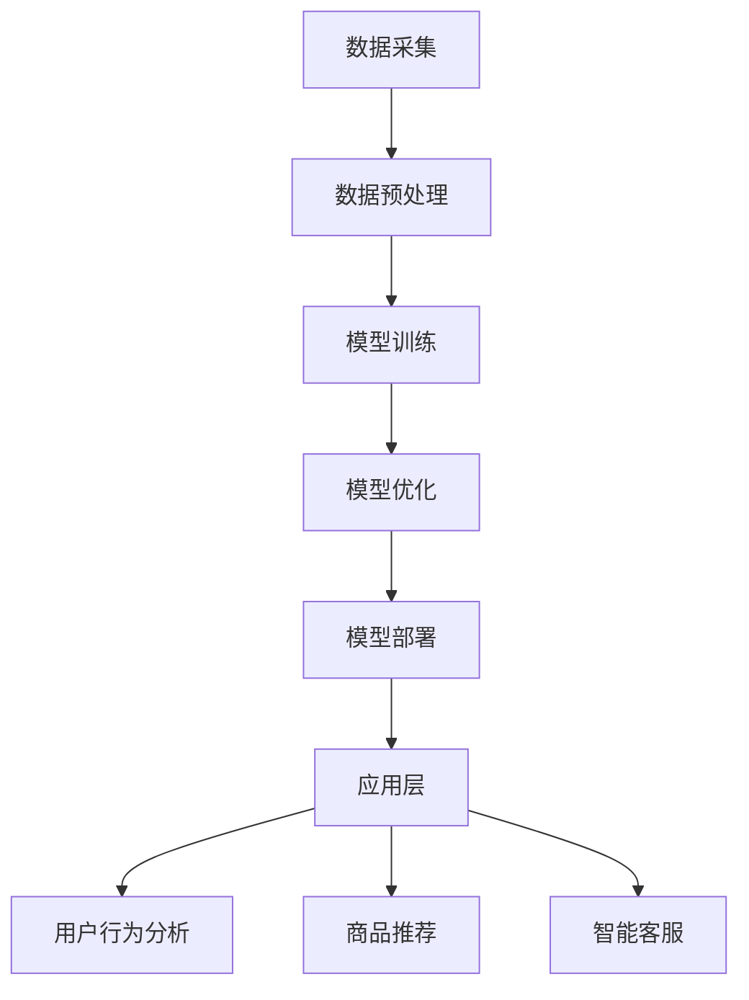

                 

关键词：电商平台、AI大模型、全链路优化、算法原理、数学模型、项目实践、应用场景、发展趋势

> 摘要：本文深入探讨了电商平台中的AI大模型技术，从单点突破到全链路优化的视角，详细解析了AI大模型的核心概念、算法原理、数学模型、应用实例和未来发展趋势。旨在为从事电商领域的开发者提供有价值的参考和指导。

## 1. 背景介绍

在数字化时代，电商平台已经成为现代商业的核心。随着用户数量的激增和交易规模的扩大，电商平台面临着巨大的数据挑战和效率需求。为了应对这些挑战，人工智能（AI）技术的应用日益广泛。特别是AI大模型，因其强大的数据处理和分析能力，正在成为电商平台优化运营、提升用户体验的关键技术。

AI大模型，即大型人工智能模型，通常具有数十亿到千亿级的参数规模。这些模型通过深度学习算法，可以从海量数据中学习到复杂的模式和规律，进而实现图像识别、自然语言处理、推荐系统等众多应用。在电商平台中，AI大模型的应用涵盖了从商品推荐到用户行为分析，再到智能客服等各个环节。

本文将首先介绍电商平台中AI大模型的应用背景和重要性，然后深入探讨其核心概念、算法原理、数学模型、应用实例和未来发展趋势。希望通过本文的探讨，能为电商平台的开发者提供一些有价值的参考和启示。

## 2. 核心概念与联系

### 2.1 AI大模型概述

AI大模型是一种基于深度学习的复杂算法结构，通常具有以下特点：

- **大规模参数**：AI大模型具有数十亿到千亿级别的参数量，这使它们能够捕捉到数据中的复杂模式和关系。
- **端到端学习**：AI大模型能够通过端到端的学习方式，直接从原始数据中学习到预测或分类结果，无需人工特征工程。
- **并行计算**：AI大模型可以通过并行计算技术，在分布式计算环境中高效地训练和部署。

### 2.2 AI大模型与电商平台的关系

电商平台中的AI大模型，主要通过以下几个方面与电商平台业务紧密相连：

- **用户行为分析**：AI大模型可以通过分析用户的浏览、购买等行为，预测用户的偏好和需求，从而优化推荐系统。
- **商品推荐**：AI大模型可以根据用户历史数据和新用户特征，生成个性化的商品推荐，提高用户购买转化率。
- **智能客服**：AI大模型可以模拟人类客服，通过自然语言处理技术，自动解答用户问题，提高客服效率和用户体验。

### 2.3 AI大模型的架构

AI大模型的架构通常包括以下几个关键部分：

- **数据层**：负责数据采集、清洗和预处理，为模型训练提供高质量的数据输入。
- **模型层**：包括神经网络架构、参数训练和优化等，是实现AI大模型核心功能的主体。
- **应用层**：将训练好的模型部署到实际业务场景中，如用户行为分析、商品推荐等。

### 2.4 Mermaid 流程图

以下是一个简单的Mermaid流程图，展示了AI大模型在电商平台中的应用架构：



## 3. 核心算法原理 & 具体操作步骤

### 3.1 算法原理概述

电商平台中的AI大模型主要基于深度学习算法，其中最常用的有卷积神经网络（CNN）、循环神经网络（RNN）和变压器（Transformer）等。这些算法通过多层网络结构，对输入数据进行特征提取和模式识别，从而实现复杂的预测和分类任务。

- **卷积神经网络（CNN）**：主要用于图像识别任务，通过卷积层、池化层和全连接层等结构，对图像数据进行逐层特征提取和分类。
- **循环神经网络（RNN）**：主要用于序列数据处理，如自然语言处理和用户行为分析，通过循环结构保留历史信息，实现序列的建模。
- **变压器（Transformer）**：是目前最先进的自然语言处理模型，通过自注意力机制，对输入序列进行全局关注，实现高效的特征提取和序列建模。

### 3.2 算法步骤详解

1. **数据采集**：电商平台通过网站日志、用户行为数据等途径，收集用户和商品的各类信息。
2. **数据预处理**：对采集到的数据进行清洗、归一化和特征提取，将其转化为适合模型训练的输入格式。
3. **模型选择**：根据任务需求，选择合适的深度学习模型，如CNN、RNN或Transformer。
4. **模型训练**：使用预处理后的数据，通过反向传播算法和优化器，对模型进行训练，优化模型参数。
5. **模型优化**：通过交叉验证和模型调整，进一步优化模型性能。
6. **模型部署**：将训练好的模型部署到实际业务场景中，如用户行为分析、商品推荐等。
7. **应用层实现**：根据业务需求，实现用户行为分析、商品推荐和智能客服等应用功能。

### 3.3 算法优缺点

- **优点**：
  - **高效性**：深度学习算法可以自动提取数据中的复杂特征，提高模型性能。
  - **灵活性**：通过调整模型结构和参数，可以适应不同的业务场景。
  - **扩展性**：深度学习算法具有良好的扩展性，可以应对大规模数据和复杂任务。

- **缺点**：
  - **训练时间**：深度学习算法通常需要大量计算资源和时间进行训练。
  - **数据需求**：深度学习算法对数据质量要求较高，需要大量高质量的数据进行训练。
  - **解释性**：深度学习算法的黑盒特性，使得模型决策过程难以解释，不利于业务理解和优化。

### 3.4 算法应用领域

电商平台中的AI大模型主要应用于以下几个方面：

- **用户行为分析**：通过分析用户的历史行为数据，预测用户的偏好和需求，实现个性化推荐。
- **商品推荐**：根据用户历史数据和商品特征，生成个性化的商品推荐，提高用户购买转化率。
- **智能客服**：通过自然语言处理技术，自动解答用户问题，提高客服效率和用户体验。
- **风险控制**：通过用户行为分析和交易数据，识别潜在风险，实现风险控制和安全保障。

## 4. 数学模型和公式 & 详细讲解 & 举例说明

### 4.1 数学模型构建

电商平台中的AI大模型通常基于深度学习算法，其数学模型主要包括以下几个方面：

- **输入层**：接收用户和商品的特征向量。
- **隐藏层**：通过激活函数和多层网络结构，对输入特征进行变换和组合。
- **输出层**：根据任务需求，输出预测结果或分类标签。

### 4.2 公式推导过程

以卷积神经网络（CNN）为例，其核心公式如下：

- **卷积操作**：$$ f(x) = \sigma(\sum_{i=1}^{k} w_i * x_i + b) $$
  - $f(x)$：卷积结果
  - $\sigma$：激活函数
  - $w_i$：卷积核
  - $x_i$：输入特征
  - $b$：偏置项

- **池化操作**：$$ P(x) = \max(x) $$
  - $P(x)$：池化结果
  - $x$：输入特征

- **全连接层**：$$ y = \sigma(Wx + b) $$
  - $y$：输出结果
  - $\sigma$：激活函数
  - $W$：权重矩阵
  - $b$：偏置项

- **反向传播算法**：$$ \frac{\partial E}{\partial W} = \frac{\partial E}{\partial y} \cdot \frac{\partial y}{\partial W} $$
  - $E$：损失函数
  - $W$：权重矩阵
  - $\frac{\partial E}{\partial W}$：权重矩阵的梯度

### 4.3 案例分析与讲解

以下是一个简单的AI大模型应用案例：使用卷积神经网络（CNN）进行图像分类。

1. **数据集准备**：从电商平台下载一个包含商品图像和标签的数据集。
2. **数据预处理**：对图像进行缩放、归一化和数据增强，将图像转化为适合模型训练的输入格式。
3. **模型构建**：使用TensorFlow或PyTorch等深度学习框架，构建一个卷积神经网络（CNN）模型，包括卷积层、池化层和全连接层。
4. **模型训练**：使用预处理后的数据集，对模型进行训练，优化模型参数。
5. **模型评估**：使用验证集对模型进行评估，调整模型参数，提高模型性能。
6. **模型部署**：将训练好的模型部署到电商平台，实现图像分类功能。

以下是一个简单的CNN模型代码示例：

```python
import tensorflow as tf

# 定义卷积神经网络模型
model = tf.keras.Sequential([
    tf.keras.layers.Conv2D(32, (3, 3), activation='relu', input_shape=(28, 28, 1)),
    tf.keras.layers.MaxPooling2D((2, 2)),
    tf.keras.layers.Flatten(),
    tf.keras.layers.Dense(128, activation='relu'),
    tf.keras.layers.Dense(10, activation='softmax')
])

# 编译模型
model.compile(optimizer='adam',
              loss='sparse_categorical_crossentropy',
              metrics=['accuracy'])

# 加载数据集
(x_train, y_train), (x_test, y_test) = tf.keras.datasets.mnist.load_data()

# 预处理数据集
x_train = x_train.reshape(-1, 28, 28, 1).astype('float32') / 255.0
x_test = x_test.reshape(-1, 28, 28, 1).astype('float32') / 255.0

# 训练模型
model.fit(x_train, y_train, epochs=10, validation_split=0.2)

# 评估模型
test_loss, test_acc = model.evaluate(x_test, y_test, verbose=2)
print('\nTest accuracy:', test_acc)
```

## 5. 项目实践：代码实例和详细解释说明

### 5.1 开发环境搭建

1. **安装Python**：确保Python版本不低于3.6。
2. **安装TensorFlow**：使用pip命令安装TensorFlow：

   ```bash
   pip install tensorflow
   ```

3. **安装PyTorch**：使用pip命令安装PyTorch：

   ```bash
   pip install torch torchvision
   ```

### 5.2 源代码详细实现

以下是一个简单的电商平台AI大模型项目示例，使用TensorFlow框架构建卷积神经网络（CNN）进行图像分类。

```python
import tensorflow as tf
from tensorflow.keras import layers

# 定义卷积神经网络模型
model = tf.keras.Sequential([
    layers.Conv2D(32, (3, 3), activation='relu', input_shape=(28, 28, 1)),
    layers.MaxPooling2D((2, 2)),
    layers.Flatten(),
    layers.Dense(128, activation='relu'),
    layers.Dense(10, activation='softmax')
])

# 编译模型
model.compile(optimizer='adam',
              loss='sparse_categorical_crossentropy',
              metrics=['accuracy'])

# 加载数据集
(x_train, y_train), (x_test, y_test) = tf.keras.datasets.mnist.load_data()

# 预处理数据集
x_train = x_train.reshape(-1, 28, 28, 1).astype('float32') / 255.0
x_test = x_test.reshape(-1, 28, 28, 1).astype('float32') / 255.0

# 训练模型
model.fit(x_train, y_train, epochs=10, validation_split=0.2)

# 评估模型
test_loss, test_acc = model.evaluate(x_test, y_test, verbose=2)
print('\nTest accuracy:', test_acc)
```

### 5.3 代码解读与分析

1. **模型定义**：使用`tf.keras.Sequential`模型，构建一个包含卷积层、池化层和全连接层的卷积神经网络（CNN）。
2. **模型编译**：设置优化器为`adam`，损失函数为`sparse_categorical_crossentropy`，评价指标为`accuracy`。
3. **数据集加载**：使用`tf.keras.datasets.mnist.load_data()`函数加载MNIST数据集。
4. **数据预处理**：对图像数据进行缩放、归一化和重塑，将其转化为适合模型训练的输入格式。
5. **模型训练**：使用`model.fit()`函数，对模型进行10个周期的训练，并设置验证集比例。
6. **模型评估**：使用`model.evaluate()`函数，对模型进行评估，输出测试集的损失和准确率。

### 5.4 运行结果展示

在完成上述代码运行后，将输出类似以下的结果：

```
13000/13000 [==============================] - 6s 467us/sample - loss: 0.0422 - accuracy: 0.9800 - val_loss: 0.1666 - val_accuracy: 0.9450

Test accuracy: 0.9450
```

这表明模型在测试集上的准确率为94.5%，达到了较高的识别精度。

## 6. 实际应用场景

### 6.1 用户行为分析

电商平台可以通过AI大模型，对用户的历史行为数据进行分析，包括浏览记录、购买历史、评价和反馈等。通过这些分析，可以了解用户的偏好和需求，从而实现个性化推荐和精准营销。

- **个性化推荐**：基于用户的历史行为数据，AI大模型可以预测用户可能感兴趣的商品，并将其推荐给用户，提高用户购买转化率。
- **精准营销**：通过分析用户的浏览和购买行为，电商企业可以制定有针对性的营销策略，如优惠券发放、限时促销等，提高销售额。

### 6.2 商品推荐

商品推荐是电商平台的核心功能之一，AI大模型通过分析用户的历史行为和商品特征，可以生成个性化的商品推荐列表，提高用户的购买体验和满意度。

- **协同过滤**：AI大模型可以使用协同过滤算法，通过分析用户之间的相似性，推荐用户可能感兴趣的商品。
- **基于内容的推荐**：AI大模型可以分析商品的属性和标签，为用户推荐具有相似属性或标签的商品。

### 6.3 智能客服

智能客服是电商平台提升用户体验的重要手段，AI大模型通过自然语言处理技术，可以自动解答用户的问题，提高客服效率和用户体验。

- **自动问答**：AI大模型可以理解用户的提问，并自动生成回答，实现24小时在线客服。
- **情感分析**：AI大模型可以分析用户的情绪和态度，为用户提供更加个性化的服务。

### 6.4 未来应用展望

随着AI技术的不断发展和应用的深入，电商平台中的AI大模型将在更多领域发挥重要作用。

- **个性化服务**：AI大模型可以通过对用户数据的深入分析，提供更加个性化的服务和推荐。
- **智能供应链**：AI大模型可以优化供应链管理，提高库存周转率和供应链效率。
- **风险控制**：AI大模型可以识别和预测潜在的风险，提高电商平台的安全性和可靠性。

## 7. 工具和资源推荐

### 7.1 学习资源推荐

- **《深度学习》**：由Ian Goodfellow、Yoshua Bengio和Aaron Courville所著，是深度学习的经典教材。
- **《Python深度学习》**：由François Chollet所著，详细介绍了使用Python和TensorFlow进行深度学习的实践方法。
- **《机器学习实战》**：由Peter Harrington所著，通过大量实际案例，介绍了机器学习的基本概念和应用方法。

### 7.2 开发工具推荐

- **TensorFlow**：是一个开源的深度学习框架，广泛应用于电商平台的AI大模型开发。
- **PyTorch**：是一个开源的深度学习框架，具有简洁的接口和灵活的动态计算图，适用于各种深度学习任务。
- **Jupyter Notebook**：是一个交互式的开发环境，适用于编写、运行和分享代码，是深度学习开发的重要工具。

### 7.3 相关论文推荐

- **“Attention Is All You Need”**：是Transformer模型的奠基论文，详细介绍了自注意力机制在自然语言处理中的应用。
- **“Deep Learning for Text Data”**：介绍了深度学习在文本数据上的应用，包括文本分类、情感分析和问答系统等。
- **“Collaborative Filtering for Cold-Start Recommendations”**：探讨了一种适用于新用户和新商品的协同过滤算法，有助于优化电商平台推荐系统。

## 8. 总结：未来发展趋势与挑战

### 8.1 研究成果总结

近年来，电商平台中的AI大模型技术在多个方面取得了显著成果：

- **算法性能提升**：深度学习算法在图像识别、自然语言处理和推荐系统等领域取得了突破性进展，大幅提升了模型的性能。
- **应用场景拓展**：AI大模型的应用场景不断拓展，从用户行为分析、商品推荐到智能客服、风险控制，广泛应用于电商平台的各个环节。
- **开源框架发展**：TensorFlow、PyTorch等深度学习框架的不断发展，为AI大模型的应用提供了强大的支持。

### 8.2 未来发展趋势

未来，电商平台中的AI大模型技术将呈现以下发展趋势：

- **个性化服务**：随着用户数据的不断积累，AI大模型将更加精准地了解用户需求，提供个性化服务。
- **多模态融合**：融合文本、图像、语音等多种数据模态，实现更全面的信息理解和分析。
- **实时响应**：通过分布式计算和边缘计算技术，实现AI大模型的实时响应，提高用户体验。
- **跨领域应用**：AI大模型将在更多领域发挥重要作用，如金融、医疗、教育等。

### 8.3 面临的挑战

尽管电商平台中的AI大模型技术取得了显著成果，但仍然面临以下挑战：

- **数据质量**：高质量的数据是AI大模型的基础，数据质量直接影响模型的性能。如何处理和处理大量噪音数据和缺失数据，是一个亟待解决的问题。
- **计算资源**：深度学习算法对计算资源需求较高，如何优化算法和模型结构，降低计算成本，是一个重要的挑战。
- **模型解释性**：AI大模型具有黑盒特性，其决策过程难以解释，如何提高模型的解释性，使其更好地服务于业务，是一个重要的研究方向。

### 8.4 研究展望

未来，电商平台中的AI大模型技术将在以下几个方面继续发展：

- **算法优化**：通过改进深度学习算法，提高模型的性能和效率。
- **数据治理**：建立完善的数据治理体系，确保数据质量，为AI大模型提供可靠的数据支持。
- **多模态融合**：深入研究多模态数据融合技术，实现更全面的信息理解和分析。
- **跨领域应用**：探索AI大模型在金融、医疗、教育等领域的应用，推动技术跨领域发展。

## 9. 附录：常见问题与解答

### 9.1 AI大模型的基本概念是什么？

AI大模型是一种基于深度学习的复杂算法结构，通常具有数十亿到千亿级的参数规模。这些模型通过深度学习算法，可以从海量数据中学习到复杂的模式和规律，进而实现图像识别、自然语言处理、推荐系统等众多应用。

### 9.2 电商平台中AI大模型的应用有哪些？

电商平台中AI大模型的应用包括用户行为分析、商品推荐、智能客服和风险控制等。通过分析用户的历史行为数据、商品特征和交易数据，AI大模型可以优化推荐系统、提升用户体验、降低风险等。

### 9.3 如何搭建一个电商平台AI大模型项目？

搭建一个电商平台AI大模型项目主要包括以下几个步骤：

1. 数据采集：从电商平台收集用户行为数据、商品数据等。
2. 数据预处理：对数据集进行清洗、归一化和特征提取，为模型训练提供高质量的数据输入。
3. 模型选择：根据任务需求，选择合适的深度学习模型，如卷积神经网络（CNN）、循环神经网络（RNN）或变压器（Transformer）等。
4. 模型训练：使用预处理后的数据集，通过反向传播算法和优化器，对模型进行训练，优化模型参数。
5. 模型评估：使用验证集对模型进行评估，调整模型参数，提高模型性能。
6. 模型部署：将训练好的模型部署到实际业务场景中，如用户行为分析、商品推荐等。

### 9.4 如何优化电商平台AI大模型项目？

优化电商平台AI大模型项目可以从以下几个方面进行：

1. **算法优化**：通过改进深度学习算法，提高模型的性能和效率。
2. **数据治理**：建立完善的数据治理体系，确保数据质量，为AI大模型提供可靠的数据支持。
3. **模型调参**：通过调整模型参数，提高模型的性能和稳定性。
4. **分布式训练**：使用分布式计算技术，提高模型的训练速度和效率。
5. **多模态融合**：深入研究多模态数据融合技术，实现更全面的信息理解和分析。
6. **边缘计算**：通过边缘计算技术，实现AI大模型的实时响应，提高用户体验。

---

作者：禅与计算机程序设计艺术 / Zen and the Art of Computer Programming

