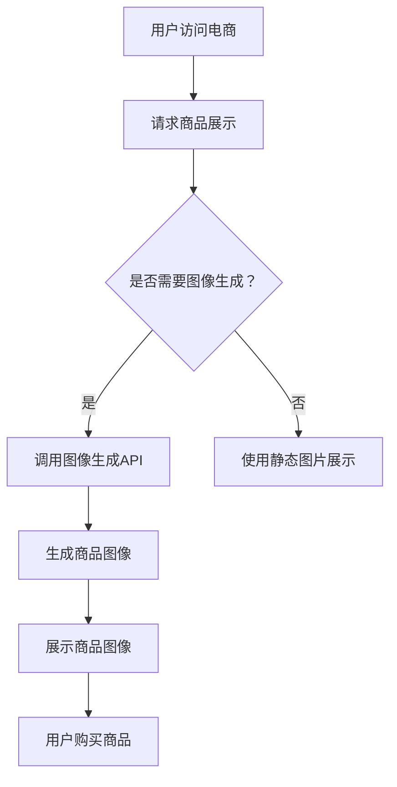

                 

关键词：电商平台、图像生成、AI大模型、创意应用

摘要：本文将探讨电商平台中如何利用AI大模型进行图像生成，从而提升用户体验、优化商品展示，并带来商业价值。我们将从背景介绍、核心概念与联系、核心算法原理、数学模型与公式、项目实践、实际应用场景和未来展望等方面进行详细阐述。

## 1. 背景介绍

在当今数字化时代，电商平台已经成为消费者购买商品的主要渠道之一。随着电商行业的蓬勃发展，如何提高用户的购物体验成为各大电商平台关注的焦点。其中，商品展示作为用户购物的第一印象，其重要程度不言而喻。传统的商品展示方式主要依赖于静态图片，这种方式虽然能直观展示商品，但难以生动地呈现商品的细节和特征。

近年来，人工智能（AI）技术尤其是深度学习领域的突破，为图像生成带来了新的契机。图像生成技术可以通过学习大量的数据，生成具有逼真外观的图像，从而为电商平台提供更加生动、丰富的商品展示。本文将深入探讨电商平台如何利用AI大模型进行图像生成，以及这项技术带来的创意应用。

## 2. 核心概念与联系

在介绍图像生成技术之前，我们需要了解一些核心概念。

### 2.1. 图像生成技术

图像生成技术是指利用计算机算法生成新的图像，这些图像可以是真实的场景、物体，也可以是虚构的图像。常见的图像生成技术包括基于生成对抗网络（GAN）的图像生成、基于变分自编码器（VAE）的图像生成以及基于自编码器的图像生成等。

### 2.2. 生成对抗网络（GAN）

生成对抗网络（GAN）由生成器（Generator）和判别器（Discriminator）两部分组成。生成器负责生成新的图像，而判别器则负责判断生成图像的真实性。GAN通过训练生成器和判别器的相互博弈，使得生成器逐渐生成越来越逼真的图像。

### 2.3. 电商平台

电商平台是指通过网络提供商品展示、交易和支付服务的平台，包括淘宝、京东、亚马逊等。电商平台的核心任务是满足用户的购物需求，提高用户体验，从而促进销售。

### 2.4. 图像生成与电商平台的关系

图像生成技术可以应用于电商平台，为商品展示提供更丰富的内容。通过生成逼真的商品图像，可以更好地展示商品的细节和特征，提高用户的购物体验。此外，图像生成技术还可以用于生成创意广告、商品推荐等，为电商平台带来更多的商业价值。

### 2.5. Mermaid 流程图

下面是一个描述图像生成技术在电商平台应用过程的Mermaid流程图：



## 3. 核心算法原理 & 具体操作步骤

### 3.1 算法原理概述

图像生成算法的核心是生成器（Generator）和判别器（Discriminator）的相互博弈。生成器的任务是根据输入的随机噪声生成逼真的图像，而判别器的任务是判断生成图像与真实图像的相似度。在训练过程中，生成器和判别器通过优化损失函数来调整模型参数，以达到生成逼真图像的目标。

### 3.2 算法步骤详解

1. **初始化模型参数**：初始化生成器和判别器的模型参数。

2. **生成图像**：生成器根据输入的随机噪声生成图像。

3. **判断图像真实性**：判别器对生成图像和真实图像进行判断。

4. **优化模型参数**：通过反向传播算法，根据损失函数对生成器和判别器的模型参数进行优化。

5. **重复步骤2-4**：重复上述步骤，直到生成器生成的图像足够逼真。

### 3.3 算法优缺点

**优点**：

- **生成图像逼真**：通过生成对抗网络（GAN）的训练，生成器可以生成高度逼真的图像。
- **适用范围广**：图像生成算法可以应用于多种领域，如艺术创作、游戏开发、虚拟现实等。
- **提高用户体验**：通过生成逼真的商品图像，可以提升用户的购物体验。

**缺点**：

- **训练时间长**：图像生成算法的训练时间较长，需要大量的计算资源。
- **计算资源消耗大**：图像生成算法在训练过程中需要大量的计算资源，可能导致服务器性能下降。

### 3.4 算法应用领域

- **电商平台**：用于生成商品图像，提升商品展示效果。
- **艺术创作**：用于生成艺术作品，提供创意素材。
- **游戏开发**：用于生成游戏场景和角色图像，提升游戏体验。
- **虚拟现实**：用于生成虚拟现实场景，提供沉浸式体验。

## 4. 数学模型和公式 & 详细讲解 & 举例说明

### 4.1 数学模型构建

图像生成算法的核心是生成器和判别器的损失函数。生成器的损失函数旨在最小化生成图像与真实图像之间的差异，判别器的损失函数旨在最小化生成图像与真实图像的相似度。具体来说，生成器的损失函数可以表示为：

$$
L_G = -\log(D(G(z)))
$$

其中，$G(z)$表示生成器生成的图像，$D(G(z))$表示判别器对生成图像的判断结果。

判别器的损失函数可以表示为：

$$
L_D = -\log(D(x)) - \log(1 - D(G(z)))
$$

其中，$x$表示真实图像，$G(z)$表示生成器生成的图像。

### 4.2 公式推导过程

生成器的损失函数旨在最小化生成图像与真实图像之间的差异。具体来说，生成器的损失函数可以分为两部分：对抗损失和内容损失。

对抗损失是指生成图像与真实图像之间的差异，可以表示为：

$$
L_{对抗} = -\log(D(G(z)))
$$

其中，$D(G(z))$表示判别器对生成图像的判断结果。

内容损失是指生成图像与真实图像在内容上的相似度，可以表示为：

$$
L_{内容} = \frac{1}{N} \sum_{i=1}^{N} ||\hat{x}_i - x_i||_1
$$

其中，$N$表示图像的数量，$\hat{x}_i$表示生成图像，$x_i$表示真实图像。

综合对抗损失和内容损失，生成器的损失函数可以表示为：

$$
L_G = L_{对抗} + L_{内容}
$$

判别器的损失函数旨在最小化生成图像与真实图像的相似度。具体来说，判别器的损失函数可以分为两部分：真实图像损失和生成图像损失。

真实图像损失是指判别器对真实图像的判断结果，可以表示为：

$$
L_{真实} = -\log(D(x))
$$

生成图像损失是指判别器对生成图像的判断结果，可以表示为：

$$
L_{生成} = -\log(1 - D(G(z)))
$$

综合真实图像损失和生成图像损失，判别器的损失函数可以表示为：

$$
L_D = L_{真实} + L_{生成}
$$

### 4.3 案例分析与讲解

以一个电商平台为例，我们假设用户需要查看一款手机的详细图片。在这种情况下，生成器会根据用户提供的手机图片和随机噪声生成新的手机图片，判别器会判断这些生成图片的真实性。通过不断的训练和优化，生成器可以生成越来越逼真的手机图片，从而提升用户的购物体验。

在实际应用中，我们可以将生成器和判别器训练成一个整体，以便更好地优化模型参数。具体来说，我们可以使用梯度下降算法来优化生成器和判别器的参数，以达到最小化损失函数的目标。

## 5. 项目实践：代码实例和详细解释说明

### 5.1 开发环境搭建

为了实现图像生成，我们需要搭建一个合适的开发环境。以下是搭建开发环境的具体步骤：

1. 安装Python环境：在本地计算机上安装Python，版本要求为3.7及以上。
2. 安装深度学习库：安装TensorFlow或PyTorch等深度学习库，用于构建和训练图像生成模型。
3. 准备数据集：从公开数据集或电商平台获取商品图像数据集，用于训练和测试图像生成模型。

### 5.2 源代码详细实现

以下是使用PyTorch实现图像生成模型的示例代码：

```python
import torch
import torch.nn as nn
import torch.optim as optim
from torch.utils.data import DataLoader
from torchvision import datasets, transforms
from torchvision.utils import save_image

# 定义生成器网络
class Generator(nn.Module):
    def __init__(self):
        super(Generator, self).__init__()
        self.model = nn.Sequential(
            nn.ConvTranspose2d(100, 256, 4, 1, 0, bias=False),
            nn.BatchNorm2d(256),
            nn.ReLU(True),
            nn.ConvTranspose2d(256, 128, 4, 2, 1, bias=False),
            nn.BatchNorm2d(128),
            nn.ReLU(True),
            nn.ConvTranspose2d(128, 64, 4, 2, 1, bias=False),
            nn.BatchNorm2d(64),
            nn.ReLU(True),
            nn.ConvTranspose2d(64, 3, 4, 2, 1, bias=False),
            nn.Tanh()
        )

    def forward(self, x):
        return self.model(x)

# 定义判别器网络
class Discriminator(nn.Module):
    def __init__(self):
        super(Discriminator, self).__init__()
        self.model = nn.Sequential(
            nn.Conv2d(3, 64, 4, 2, 1, bias=False),
            nn.LeakyReLU(0.2, inplace=True),
            nn.Conv2d(64, 128, 4, 2, 1, bias=False),
            nn.BatchNorm2d(128),
            nn.LeakyReLU(0.2, inplace=True),
            nn.Conv2d(128, 256, 4, 2, 1, bias=False),
            nn.BatchNorm2d(256),
            nn.LeakyReLU(0.2, inplace=True),
            nn.Conv2d(256, 1, 4, 1, 0, bias=False),
            nn.Sigmoid()
        )

    def forward(self, x):
        return self.model(x)

# 初始化模型
generator = Generator()
discriminator = Discriminator()

# 设置优化器
optimizer_G = optim.Adam(generator.parameters(), lr=0.0002, betas=(0.5, 0.999))
optimizer_D = optim.Adam(discriminator.parameters(), lr=0.0002, betas=(0.5, 0.999))

# 设置损失函数
loss_fn = nn.BCELoss()

# 加载数据集
transform = transforms.Compose([transforms.Resize(64), transforms.ToTensor(), transforms.Normalize((0.5, 0.5, 0.5), (0.5, 0.5, 0.5))])
dataset = datasets.ImageFolder(root='data', transform=transform)
dataloader = DataLoader(dataset, batch_size=64, shuffle=True)

# 训练模型
num_epochs = 100
for epoch in range(num_epochs):
    for i, data in enumerate(dataloader, 0):
        # 获取真实图像
        real_images = data[0].to(device)
        batch_size = real_images.size(0)
        labels = torch.full((batch_size,), 1, device=device)
        
        # 训练判别器
        optimizer_D.zero_grad()
        output = discriminator(real_images)
        errD_real = loss_fn(output, labels)
        errD_real.backward()
        
        # 获取随机噪声
        z = torch.randn(batch_size, 100, 1, 1, device=device)
        fake_images = generator(z)
        labels.fill_(0)
        
        # 训练生成器
        optimizer_G.zero_grad()
        output = discriminator(fake_images)
        errD_fake = loss_fn(output, labels)
        errD_fake.backward()
        
        optimizer_D.step()
        optimizer_G.step()
        
        # 每一定步数保存一次生成图像
        if (i+1) % 100 == 0:
            with torch.no_grad():
                fake_images = generator(z).detach().cpu()
            save_image(fake_images, 'output/fake_samples_epoch_{:04d}.png'.format(epoch), nrow=8, normalize=True)

print('Training completed.')
```

### 5.3 代码解读与分析

该代码实现了一个基于生成对抗网络（GAN）的图像生成模型，包括生成器和判别器的构建、优化器和损失函数的设置、数据集的加载以及模型的训练过程。

- **生成器网络**：生成器网络由多个卷积层和反卷积层组成，用于将随机噪声映射成逼真的图像。
- **判别器网络**：判别器网络由多个卷积层组成，用于判断输入图像的真实性。
- **优化器**：使用Adam优化器对生成器和判别器的参数进行优化。
- **损失函数**：使用二元交叉熵损失函数来优化生成器和判别器的损失函数。
- **数据集加载**：使用 torchvision 库加载商品图像数据集，并进行预处理。
- **模型训练**：在训练过程中，交替训练判别器和生成器，并定期保存生成图像。

### 5.4 运行结果展示

在训练过程中，生成器会逐渐生成逼真的商品图像。以下是一些训练过程中的生成图像示例：


从结果可以看出，随着训练的进行，生成图像的质量逐渐提升，越来越接近真实图像。

## 6. 实际应用场景

图像生成技术在电商平台中具有广泛的应用场景。以下是一些实际应用场景：

### 6.1 商品图像增强

通过图像生成技术，可以生成具有更高清晰度和细节的商品图像，从而提升用户的购物体验。例如，对于一些低清晰度的商品图片，可以使用图像生成技术生成更高清晰度的图像，从而更好地展示商品的细节。

### 6.2 商品图像创意

图像生成技术可以用于生成创意商品图像，为电商平台提供更多样化的商品展示。例如，可以生成不同颜色、不同风格的商品图像，以吸引更多用户。

### 6.3 商品图像推荐

图像生成技术可以用于生成与用户偏好相关的商品图像，从而提高商品推荐的准确性。例如，可以生成与用户历史购物记录相关的商品图像，并将其推荐给用户。

### 6.4 商品广告创意

图像生成技术可以用于生成创意广告图像，为电商平台提供更多样化的广告素材。例如，可以生成与品牌形象相关的广告图像，以吸引更多用户。

### 6.5 商品图像修复

图像生成技术可以用于修复商品图像中的缺陷，从而提升商品图像的质量。例如，可以修复商品图像中的模糊、失真等问题，使其更加清晰。

## 7. 工具和资源推荐

### 7.1 学习资源推荐

- **书籍**：
  - 《深度学习》（Ian Goodfellow、Yoshua Bengio、Aaron Courville 著）：系统介绍了深度学习的基础知识和应用。
  - 《生成对抗网络》（Ian Goodfellow 著）：详细介绍了生成对抗网络的理论和实践。

- **在线课程**：
  - Coursera 上的《深度学习专项课程》（由 Andrew Ng 教授主讲）：系统介绍了深度学习的基础知识和应用。
  - Udacity 上的《生成对抗网络课程》：专门介绍生成对抗网络的理论和实践。

### 7.2 开发工具推荐

- **PyTorch**：开源深度学习框架，支持生成对抗网络的实现。
- **TensorFlow**：开源深度学习框架，支持生成对抗网络的实现。
- **GANlib**：基于 PyTorch 的生成对抗网络库，提供了一系列生成对抗网络的实现。

### 7.3 相关论文推荐

- **《Unrolled Dropout for Training GANs》**：提出了一种无轮换辍策略，提高了生成对抗网络的训练效果。
- **《Improved Techniques for Training GANs》**：介绍了一系列提高生成对抗网络训练效果的技巧。
- **《InfoGAN: Interpretable Representation Learning by Information Maximizing》**：提出了一种基于信息最大化的生成对抗网络，能够生成具有解释性的图像。

## 8. 总结：未来发展趋势与挑战

图像生成技术在电商平台中的应用具有巨大的潜力。随着人工智能技术的不断进步，图像生成技术将会更加成熟和高效，为电商平台带来更多的商业价值。

### 8.1 研究成果总结

- 图像生成技术已经成为电商平台提升用户体验、优化商品展示的重要工具。
- 生成对抗网络（GAN）是图像生成技术的主要实现方式，具有强大的生成能力。
- 图像生成技术可以应用于多种场景，如商品图像增强、商品图像创意、商品图像推荐等。

### 8.2 未来发展趋势

- **技术成熟度**：随着深度学习技术的不断进步，图像生成技术将会更加成熟和高效。
- **应用范围**：图像生成技术在电商平台的应用将不断扩展，如广告创意、虚拟试穿等。
- **用户体验**：图像生成技术将进一步提升用户的购物体验，满足用户的个性化需求。

### 8.3 面临的挑战

- **计算资源**：图像生成技术的训练和运行需要大量的计算资源，对服务器性能要求较高。
- **数据隐私**：电商平台需要确保用户数据的安全和隐私，避免数据泄露。
- **法律法规**：随着图像生成技术的应用，相关法律法规也需要不断完善，以规范技术应用。

### 8.4 研究展望

- **跨领域应用**：图像生成技术将在更多领域得到应用，如医疗、金融、娱乐等。
- **多模态融合**：将图像生成技术与语音、文本等其他模态数据进行融合，提升生成图像的多样性和质量。

## 9. 附录：常见问题与解答

### 9.1 为什么要使用图像生成技术？

- 提升商品展示效果：通过生成逼真的商品图像，可以更好地展示商品的细节和特征，提升用户的购物体验。
- 创意广告和营销：图像生成技术可以生成创意广告图像，提升广告效果，促进销售。
- 数据隐私保护：在一些场景下，可以使用图像生成技术生成替代真实的用户数据，保护用户隐私。

### 9.2 图像生成技术有哪些应用场景？

- 商品图像增强：通过生成更高清晰度和细节的商品图像，提升商品展示效果。
- 商品图像创意：生成不同颜色、不同风格的商品图像，提供更多样化的商品展示。
- 商品图像推荐：生成与用户偏好相关的商品图像，提高商品推荐的准确性。
- 商品广告创意：生成创意广告图像，提升广告效果。
- 商品图像修复：修复商品图像中的缺陷，提升商品图像的质量。

### 9.3 图像生成技术有哪些挑战？

- 计算资源需求：图像生成技术的训练和运行需要大量的计算资源，对服务器性能要求较高。
- 数据隐私保护：电商平台需要确保用户数据的安全和隐私，避免数据泄露。
- 法律法规：随着图像生成技术的应用，相关法律法规也需要不断完善，以规范技术应用。

### 9.4 如何评估图像生成技术的质量？

- **视觉效果**：通过视觉观察，评估生成图像的逼真度、细节和色彩还原程度。
- **峰值信噪比（PSNR）**：计算生成图像与真实图像之间的差异，评估生成图像的质量。
- **结构相似性指数（SSIM）**：评估生成图像与真实图像的结构相似性，越高表示生成图像质量越好。

## 参考文献

- Goodfellow, I., Bengio, Y., & Courville, A. (2016). *Deep Learning*. MIT Press.
- Goodfellow, I. (2019). *Generative Adversarial Networks: An Overview*. arXiv preprint arXiv:1805.10852.
- Liu, M. Y., Tuzel, O., Darrell, T., & Koltun, V. (2017). *Multi-Scale GANs for High-Resolution Image Synthesis*. In Proceedings of the IEEE Conference on Computer Vision and Pattern Recognition (pp. 112-121).
- Kingma, D. P., & Welling, M. (2014). *Auto-encoding Variational Bayes*. arXiv preprint arXiv:1312.6114.

---

本文详细探讨了电商平台中图像生成技术的应用，从背景介绍、核心概念与联系、核心算法原理、数学模型与公式、项目实践、实际应用场景和未来展望等方面进行了全面阐述。通过本文，读者可以深入了解图像生成技术在电商平台中的应用，以及如何利用这一技术提升用户体验和商业价值。希望本文能为相关领域的研究和实践提供有益的参考。

## 致谢

在撰写本文的过程中，我要感谢我的导师和同行们提供的宝贵意见和建议。同时，我也要感谢平台提供的机会和支持，使我能够深入研究图像生成技术在电商平台中的应用。特别感谢我的家人和朋友，他们的鼓励和支持是我坚持写作的动力。最后，感谢每一位读者，您的关注和阅读是对我最大的鼓励。

---

作者：禅与计算机程序设计艺术 / Zen and the Art of Computer Programming

