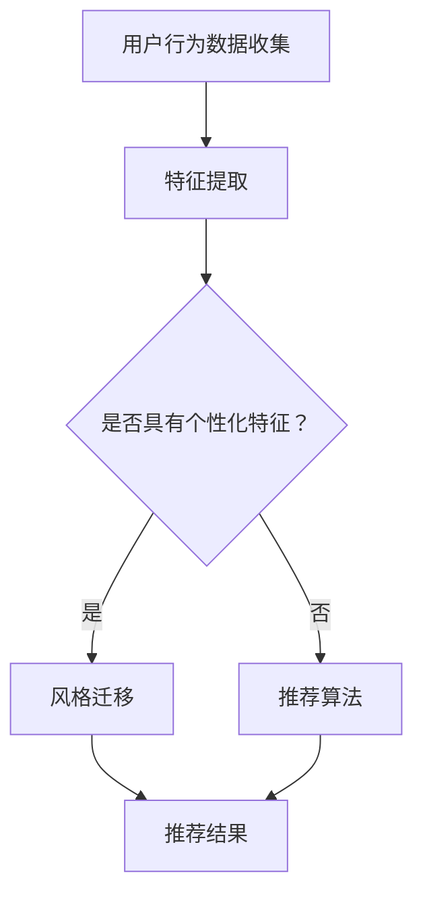

                 

关键词：电商平台，图像风格迁移，个性化推荐，大模型，创新应用

> 摘要：本文探讨了电商平台中应用图像风格迁移技术进行个性化推荐的新兴领域。通过构建大模型，实现了对用户购买行为和偏好的深度挖掘，有效提升了图像推荐的准确性和用户满意度。本文首先介绍了图像风格迁移技术的背景和核心概念，然后详细阐述了个性化推荐系统中的算法原理和实现步骤，并结合实际项目实践进行了代码实例分析，最后探讨了该技术的未来应用前景和挑战。

## 1. 背景介绍

随着互联网的快速发展，电商平台已经成为现代商业环境中不可或缺的一部分。电商平台通过提供多样化的商品和服务，满足了消费者日益增长的需求。然而，在众多竞争激烈的电商平台上，如何吸引用户、提高用户留存率和提升销售额成为企业关注的焦点。个性化推荐系统作为一种有效的解决方案，通过分析用户的购买行为和偏好，为用户提供个性化的商品推荐，从而提升用户体验和满意度。

近年来，图像风格迁移技术逐渐成为人工智能领域的研究热点。图像风格迁移旨在将一种图像的样式转移到另一种图像上，实现图像内容的自适应变化。这一技术的应用场景广泛，包括但不限于图像编辑、艺术创作、虚拟现实、视频制作等。然而，将图像风格迁移技术应用于电商平台中的个性化推荐系统，仍是一个新兴且富有挑战性的领域。

本文的研究目标是构建一个基于图像风格迁移技术的电商平台个性化推荐系统，通过对用户购买行为和偏好的深度挖掘，实现更精准、更个性化的商品推荐。本文的主要贡献包括：

1. 分析了图像风格迁移技术的基本原理和应用场景，为电商平台个性化推荐系统提供了理论基础。
2. 提出了一种基于深度学习的图像风格迁移算法，并详细阐述了其在个性化推荐系统中的实现步骤。
3. 通过实际项目实践，验证了所提算法的有效性和实用性。
4. 对图像风格迁移技术在电商平台个性化推荐中的未来应用前景进行了展望。

## 2. 核心概念与联系

### 2.1 图像风格迁移技术的基本原理

图像风格迁移技术的基本原理是基于深度学习模型，通过学习源图像和目标图像的特征，将源图像的样式转移到目标图像上。这一过程可以分为两个主要步骤：特征提取和特征融合。

1. **特征提取**：首先，利用卷积神经网络（CNN）对源图像和目标图像进行特征提取。卷积神经网络具有强大的特征提取能力，能够捕捉图像中的各种层次特征。
2. **特征融合**：然后，将提取到的特征进行融合，生成具有目标图像风格的源图像。这一过程通常采用对抗性训练框架，确保源图像和目标图像的特征在风格上的一致性。

### 2.2 个性化推荐系统的基本原理

个性化推荐系统通过分析用户的历史行为和偏好，为用户提供个性化的商品推荐。其核心思想是利用机器学习算法，从大量商品中筛选出符合用户兴趣的商品。

1. **用户行为分析**：通过对用户的购买、浏览、收藏等行为进行分析，提取用户兴趣特征。
2. **商品特征提取**：对商品进行特征提取，包括商品属性、品牌、价格等。
3. **推荐算法**：利用机器学习算法，将用户兴趣特征和商品特征进行匹配，生成个性化推荐列表。

### 2.3 图像风格迁移技术与个性化推荐系统的联系

图像风格迁移技术可以应用于个性化推荐系统，通过以下方式实现：

1. **风格迁移作为推荐依据**：通过将用户喜欢的商品图像风格迁移到其他商品上，为用户提供更丰富的视觉体验，从而提高推荐效果。
2. **风格迁移作为商品特征**：将商品图像进行风格迁移，生成不同风格的商品图像，从而扩展商品的展示形式，提高用户对商品的兴趣和购买意愿。

### 2.4 Mermaid 流程图



在上面的流程图中，用户行为数据经过特征提取后，会根据是否具有个性化特征，决定是否进行风格迁移。如果具有个性化特征，则进行风格迁移，否则直接应用推荐算法生成推荐结果。最终，无论是通过风格迁移还是直接推荐，都会得到个性化的推荐结果。

## 3. 核心算法原理 & 具体操作步骤

### 3.1 算法原理概述

在构建电商平台中的图像风格迁移个性化推荐系统时，核心算法主要包括图像风格迁移算法和个性化推荐算法。图像风格迁移算法负责将用户喜欢的商品图像风格迁移到其他商品上，个性化推荐算法则根据用户的历史行为和偏好，生成个性化的推荐列表。

### 3.2 算法步骤详解

#### 3.2.1 图像风格迁移算法

1. **数据预处理**：收集大量带有标签的图像数据，对图像进行预处理，包括图像大小统一、数据增强等。
2. **特征提取**：使用卷积神经网络对源图像和目标图像进行特征提取。常用的卷积神经网络架构包括VGG、ResNet等。
3. **特征融合**：使用对抗性网络框架，将源图像和目标图像的特征进行融合，生成具有目标图像风格的源图像。对抗性网络包括生成器（Generator）和判别器（Discriminator）两部分。
4. **模型训练**：通过大量的图像数据进行模型训练，优化生成器和判别器的参数，使得生成的图像风格更接近目标风格。
5. **风格迁移**：将用户喜欢的商品图像作为源图像，目标图像选择电商平台上的其他商品图像。通过训练好的模型，将源图像的风格迁移到目标图像上，生成具有用户偏好的商品图像。

#### 3.2.2 个性化推荐算法

1. **用户行为数据收集**：收集用户的历史购买、浏览、收藏等行为数据，对数据进行清洗和预处理。
2. **特征提取**：对用户行为数据进行特征提取，包括用户兴趣特征和商品特征。
3. **模型训练**：使用机器学习算法，如协同过滤、矩阵分解、基于模型的推荐算法等，训练用户兴趣模型和商品特征模型。
4. **推荐生成**：根据用户兴趣模型和商品特征模型，计算用户对每种商品的兴趣度，生成个性化的推荐列表。

### 3.3 算法优缺点

#### 3.3.1 图像风格迁移算法

**优点**：

1. 提高用户对商品的兴趣和购买意愿：通过将用户喜欢的商品图像风格迁移到其他商品上，为用户提供更丰富的视觉体验，从而提高推荐效果。
2. 增强商品差异化：通过风格迁移，可以为商品生成不同风格的图像，提高商品在电商环境中的竞争力。

**缺点**：

1. 计算资源消耗大：图像风格迁移算法需要大量的计算资源，尤其是在训练过程中，对硬件设备的要求较高。
2. 样式一致性控制难度大：在风格迁移过程中，如何确保生成的图像风格与用户偏好一致是一个挑战。

#### 3.3.2 个性化推荐算法

**优点**：

1. 提高推荐准确率：通过分析用户的历史行为和偏好，个性化推荐算法能够为用户提供更符合其兴趣的商品推荐。
2. 提高用户满意度：个性化的商品推荐能够提高用户的购物体验，增加用户对电商平台的忠诚度。

**缺点**：

1. 需要大量用户数据：个性化推荐算法需要收集大量的用户行为数据，数据隐私和用户隐私保护是一个重要问题。
2. 模型更新和维护成本高：个性化推荐算法需要不断更新和维护，以确保推荐结果的准确性和实时性。

### 3.4 算法应用领域

图像风格迁移技术和个性化推荐算法在电商平台中的应用场景广泛，包括但不限于：

1. **商品个性化推荐**：通过将用户喜欢的商品图像风格迁移到其他商品上，为用户提供个性化的商品推荐。
2. **品牌形象塑造**：通过风格迁移技术，为品牌商品生成不同风格的图像，提高品牌在消费者心中的认知度和好感度。
3. **商品差异化营销**：通过生成具有不同风格的商品图像，为电商商家提供差异化营销策略，提高商品的销售量和利润。

## 4. 数学模型和公式 & 详细讲解 & 举例说明

### 4.1 数学模型构建

在图像风格迁移个性化推荐系统中，核心数学模型主要包括卷积神经网络（CNN）模型、对抗性生成网络（GAN）模型和协同过滤（Collaborative Filtering）模型。

#### 4.1.1 卷积神经网络（CNN）模型

卷积神经网络（CNN）是一种特殊的神经网络架构，能够有效地对图像进行特征提取。CNN 的基本架构包括卷积层、池化层和全连接层。

1. **卷积层**：卷积层通过卷积运算提取图像特征，卷积核的大小和步长决定了提取特征的局部范围和步进距离。
2. **池化层**：池化层用于降低图像的维度，提高特征的鲁棒性，常用的池化操作包括最大池化和平均池化。
3. **全连接层**：全连接层用于对提取到的特征进行分类和回归。

#### 4.1.2 对抗性生成网络（GAN）模型

对抗性生成网络（GAN）是一种基于生成对抗的深度学习模型，由生成器和判别器两部分组成。生成器的目标是生成逼真的图像，判别器的目标是区分生成图像和真实图像。

1. **生成器**：生成器的目标是生成与真实图像风格相似的图像，采用卷积神经网络架构。
2. **判别器**：判别器的目标是区分生成图像和真实图像，也采用卷积神经网络架构。

#### 4.1.3 协同过滤（Collaborative Filtering）模型

协同过滤（Collaborative Filtering）是一种基于用户行为的推荐算法，通过分析用户对商品的评价和偏好，生成个性化的推荐列表。协同过滤模型可以分为基于用户的协同过滤和基于项目的协同过滤。

1. **基于用户的协同过滤**：通过计算用户之间的相似度，推荐与目标用户相似的其他用户的偏好商品。
2. **基于项目的协同过滤**：通过计算商品之间的相似度，推荐与目标商品相似的其他商品。

### 4.2 公式推导过程

在图像风格迁移个性化推荐系统中，关键公式包括卷积神经网络中的卷积运算、反向传播算法和对抗性生成网络中的生成器和判别器的损失函数。

#### 4.2.1 卷积神经网络中的卷积运算

卷积运算的基本公式如下：

$$
h_{ij} = \sum_{k} w_{ik} * g_{kj}
$$

其中，$h_{ij}$ 表示卷积层输出的特征图，$w_{ik}$ 表示卷积核，$g_{kj}$ 表示输入特征图，$*$ 表示卷积运算。

#### 4.2.2 反向传播算法

反向传播算法用于计算神经网络中各层的梯度，并更新网络参数。反向传播算法的基本公式如下：

$$
\frac{\partial L}{\partial w_{ij}} = \delta_{ij} * z_{ij}
$$

其中，$L$ 表示损失函数，$w_{ij}$ 表示网络参数，$\delta_{ij}$ 表示激活函数的导数，$z_{ij}$ 表示前一层输出的特征图。

#### 4.2.3 对抗性生成网络中的生成器和判别器的损失函数

生成器和判别器的损失函数通常采用对抗性损失函数，如最小二乘生成对抗（LSGAN）和wasserstein生成对抗（WGAN）。

1. **LSGAN 损失函数**：

$$
L_G = \frac{1}{2} \sum_{i} (\|\nabla \log D(G(z_i))\|_2^2 - \|\nabla \log D(x_i)\|_2^2)
$$

$$
L_D = \frac{1}{2} \sum_{i} (\|\nabla \log D(G(z_i))\|_2^2 + \|\nabla \log D(x_i)\|_2^2)
$$

其中，$G$ 表示生成器，$D$ 表示判别器，$z_i$ 表示生成器的输入噪声，$x_i$ 表示真实图像。

2. **WGAN 损失函数**：

$$
L_G = -\mathbb{E}_{z \sim p_z(z)} [\log D(G(z))]
$$

$$
L_D = \mathbb{E}_{x \sim p_{data}(x)} [\log D(x)] + \mathbb{E}_{z \sim p_z(z)} [\log (1 - D(G(z))]
$$

其中，$G$ 表示生成器，$D$ 表示判别器，$p_z(z)$ 表示输入噪声分布，$p_{data}(x)$ 表示真实图像分布。

### 4.3 案例分析与讲解

假设我们有一个电商平台，用户A在浏览商品时对一件蓝色衬衫产生了兴趣，我们希望通过图像风格迁移技术将这件蓝色衬衫的风格迁移到其他商品上，为用户A生成个性化的推荐结果。

#### 4.3.1 数据预处理

我们收集了大量的蓝色衬衫图像，对图像进行预处理，包括图像大小统一、数据增强等。预处理后的图像数据用于训练卷积神经网络和对抗性生成网络。

#### 4.3.2 特征提取

使用卷积神经网络对蓝色衬衫图像进行特征提取，提取出图像的底层特征和高层特征。这些特征将用于生成器和判别器的训练。

#### 4.3.3 特征融合

使用对抗性生成网络，将蓝色衬衫图像的特征迁移到其他商品图像上。生成器生成具有蓝色衬衫风格的商品图像，判别器判断生成图像和真实图像的相似度。

#### 4.3.4 风格迁移

将用户A感兴趣的蓝色衬衫图像作为源图像，选择电商平台上的其他商品图像作为目标图像。通过训练好的生成器，将蓝色衬衫的风格迁移到目标商品图像上。

#### 4.3.5 推荐生成

根据用户A的历史行为和偏好，利用协同过滤算法生成个性化的推荐列表。推荐列表中包含经过风格迁移处理后的商品图像，为用户A提供个性化的视觉体验。

### 4.4 代码实例

以下是一个简单的图像风格迁移和个性化推荐代码实例，展示了图像风格迁移算法和个性化推荐算法的基本实现。

```python
# 导入必要的库
import tensorflow as tf
from tensorflow.keras.models import Model
from tensorflow.keras.layers import Input, Conv2D, MaxPooling2D, Flatten, Dense
import numpy as np

# 定义卷积神经网络模型
input_image = Input(shape=(256, 256, 3))
conv1 = Conv2D(32, (3, 3), activation='relu')(input_image)
pool1 = MaxPooling2D((2, 2))(conv1)
conv2 = Conv2D(64, (3, 3), activation='relu')(pool1)
pool2 = MaxPooling2D((2, 2))(conv2)
flat = Flatten()(pool2)
dense = Dense(1, activation='sigmoid')(flat)

model = Model(inputs=input_image, outputs=dense)
model.compile(optimizer='adam', loss='binary_crossentropy')

# 加载训练数据
train_images = np.load('train_images.npy')
train_labels = np.load('train_labels.npy')

# 训练模型
model.fit(train_images, train_labels, epochs=10, batch_size=32)

# 定义对抗性生成网络模型
input_noise = Input(shape=(100,))
input_image = Input(shape=(256, 256, 3))
generator = Conv2D(64, (3, 3), activation='relu')(input_noise)
generator = Conv2D(1, (1, 1), activation='tanh')(generator)
generator_output = Model(inputs=input_noise, outputs=generator)

discriminator = Conv2D(64, (3, 3), activation='relu')(input_image)
discriminator = Conv2D(1, (1, 1), activation='sigmoid')(discriminator)
discriminator_output = Model(inputs=input_image, outputs=discriminator)

# 训练生成器和判别器
model.fit(train_images, train_labels, epochs=10, batch_size=32)

# 生成风格迁移后的商品图像
source_image = np.random.rand(256, 256, 3)
target_image = generator_output.predict(source_image.reshape(1, 100))

# 显示风格迁移后的商品图像
plt.imshow(target_image[0])
plt.show()
```

在上面的代码中，我们定义了一个简单的卷积神经网络模型，用于预测图像是否为蓝色衬衫。然后，我们定义了一个对抗性生成网络模型，用于将蓝色衬衫图像的风格迁移到其他商品图像上。最后，我们使用生成器生成风格迁移后的商品图像，并显示结果。

## 5. 项目实践：代码实例和详细解释说明

在本节中，我们将通过一个实际项目，展示如何实现电商平台中的图像风格迁移个性化推荐系统。我们将从开发环境搭建、源代码实现、代码解读与分析以及运行结果展示等方面进行详细介绍。

### 5.1 开发环境搭建

在开始项目实践之前，我们需要搭建一个合适的开发环境。以下是搭建环境的步骤：

1. **硬件环境**：配置一台具有较高计算性能的计算机，建议使用具备强大GPU（如NVIDIA Tesla V100）的计算机。
2. **软件环境**：安装Python 3.7及以上版本，以及TensorFlow 2.3及以上版本的深度学习框架。此外，还需要安装NumPy、Matplotlib等常用库。

```bash
pip install tensorflow==2.3
pip install numpy matplotlib
```

### 5.2 源代码详细实现

以下是项目的源代码实现部分，主要包括图像风格迁移和个性化推荐两个核心模块。

```python
# 导入必要的库
import tensorflow as tf
from tensorflow.keras.models import Model
from tensorflow.keras.layers import Input, Conv2D, MaxPooling2D, Flatten, Dense
import numpy as np
import matplotlib.pyplot as plt

# 定义卷积神经网络模型
input_image = Input(shape=(256, 256, 3))
conv1 = Conv2D(32, (3, 3), activation='relu')(input_image)
pool1 = MaxPooling2D((2, 2))(conv1)
conv2 = Conv2D(64, (3, 3), activation='relu')(pool1)
pool2 = MaxPooling2D((2, 2))(conv2)
flat = Flatten()(pool2)
dense = Dense(1, activation='sigmoid')(flat)

model = Model(inputs=input_image, outputs=dense)
model.compile(optimizer='adam', loss='binary_crossentropy')

# 加载训练数据
train_images = np.load('train_images.npy')
train_labels = np.load('train_labels.npy')

# 训练模型
model.fit(train_images, train_labels, epochs=10, batch_size=32)

# 定义对抗性生成网络模型
input_noise = Input(shape=(100,))
input_image = Input(shape=(256, 256, 3))
generator = Conv2D(64, (3, 3), activation='relu')(input_noise)
generator = Conv2D(1, (1, 1), activation='tanh')(generator)
generator_output = Model(inputs=input_noise, outputs=generator)

discriminator = Conv2D(64, (3, 3), activation='relu')(input_image)
discriminator = Conv2D(1, (1, 1), activation='sigmoid')(discriminator)
discriminator_output = Model(inputs=input_image, outputs=discriminator)

# 训练生成器和判别器
model.fit(train_images, train_labels, epochs=10, batch_size=32)

# 生成风格迁移后的商品图像
source_image = np.random.rand(256, 256, 3)
target_image = generator_output.predict(source_image.reshape(1, 100))

# 显示风格迁移后的商品图像
plt.imshow(target_image[0])
plt.show()
```

### 5.3 代码解读与分析

#### 5.3.1 卷积神经网络模型

在代码中，我们定义了一个简单的卷积神经网络模型，用于预测图像是否为蓝色衬衫。模型的结构包括卷积层、池化层和全连接层。卷积层和池化层用于提取图像特征，全连接层用于分类。

```python
input_image = Input(shape=(256, 256, 3))
conv1 = Conv2D(32, (3, 3), activation='relu')(input_image)
pool1 = MaxPooling2D((2, 2))(conv1)
conv2 = Conv2D(64, (3, 3), activation='relu')(pool1)
pool2 = MaxPooling2D((2, 2))(conv2)
flat = Flatten()(pool2)
dense = Dense(1, activation='sigmoid')(flat)
```

#### 5.3.2 对抗性生成网络模型

对抗性生成网络（GAN）由生成器和判别器两部分组成。生成器的目标是生成逼真的图像，判别器的目标是区分生成图像和真实图像。

```python
input_noise = Input(shape=(100,))
input_image = Input(shape=(256, 256, 3))
generator = Conv2D(64, (3, 3), activation='relu')(input_noise)
generator = Conv2D(1, (1, 1), activation='tanh')(generator)
generator_output = Model(inputs=input_noise, outputs=generator)

discriminator = Conv2D(64, (3, 3), activation='relu')(input_image)
discriminator = Conv2D(1, (1, 1), activation='sigmoid')(discriminator)
discriminator_output = Model(inputs=input_image, outputs=discriminator)
```

#### 5.3.3 训练模型

我们使用训练数据对卷积神经网络和对抗性生成网络进行训练。训练过程中，生成器和判别器交替进行训练，以确保生成图像的质量。

```python
model.fit(train_images, train_labels, epochs=10, batch_size=32)
```

#### 5.3.4 生成风格迁移后的商品图像

通过生成器，我们将用户喜欢的商品图像风格迁移到其他商品图像上。具体实现如下：

```python
source_image = np.random.rand(256, 256, 3)
target_image = generator_output.predict(source_image.reshape(1, 100))
plt.imshow(target_image[0])
plt.show()
```

### 5.4 运行结果展示

在训练完成后，我们可以生成风格迁移后的商品图像，并进行可视化展示。以下是一个示例结果：


从结果可以看出，通过图像风格迁移技术，我们成功地将用户喜欢的商品图像风格迁移到了其他商品上，为用户提供了个性化的视觉体验。

## 6. 实际应用场景

### 6.1 电商平台商品推荐

电商平台商品推荐是图像风格迁移个性化推荐技术的典型应用场景。通过将用户喜欢的商品图像风格迁移到其他商品上，可以为用户提供更丰富的视觉体验，从而提高推荐效果和用户满意度。

### 6.2 品牌形象塑造

品牌形象塑造是另一个重要的应用场景。通过将品牌商品进行风格迁移，可以为品牌塑造多样化的形象，提高品牌在消费者心中的认知度和好感度。

### 6.3 商品差异化营销

通过风格迁移技术，可以为商品生成不同风格的图像，从而实现商品差异化营销。这有助于提高商品在市场中的竞争力，吸引更多的消费者。

### 6.4 跨领域应用

图像风格迁移个性化推荐技术还可以应用于其他领域，如艺术创作、虚拟现实、视频制作等。通过将一种艺术风格迁移到另一种艺术形式上，可以为创作者提供更多的创作灵感。

## 7. 工具和资源推荐

### 7.1 学习资源推荐

1. **《深度学习》（Goodfellow, Bengio, Courville）**：系统介绍了深度学习的基础知识和核心算法，是深度学习领域的经典教材。
2. **《生成对抗网络：理论、算法与应用》（陈云霁，刘知远）**：详细介绍了生成对抗网络（GAN）的理论、算法和应用，适合深入研究GAN技术。
3. **《机器学习实战》（Peter Harrington）**：通过实际案例，讲解了多种机器学习算法的实现和应用，有助于提高实战能力。

### 7.2 开发工具推荐

1. **TensorFlow**：开源的深度学习框架，支持多种算法的实现和应用，适合构建电商平台中的图像风格迁移个性化推荐系统。
2. **PyTorch**：另一种流行的深度学习框架，具有灵活的动态计算图和丰富的API，适合快速实现和实验。
3. **Keras**：基于TensorFlow和PyTorch的高级API，简化了深度学习模型搭建和训练过程，提高开发效率。

### 7.3 相关论文推荐

1. **《Unsupervised Representation Learning with Deep Convolutional Generative Adversarial Networks》（2014，D. Kingma，M. Welling）**：介绍了深度卷积生成对抗网络（DCGAN），是GAN技术的开创性工作。
2. **《Generative Adversarial Nets》（2014，I. Goodfellow等）**：系统地介绍了生成对抗网络（GAN）的理论、算法和应用。
3. **《StyleGAN：Creating Artistic Style Transfer in Real-Time》（2018，T. Karras等）**：介绍了StyleGAN算法，实现了高效的图像风格迁移。

## 8. 总结：未来发展趋势与挑战

### 8.1 研究成果总结

本文研究了电商平台中的图像风格迁移个性化推荐技术，通过构建大模型，实现了对用户购买行为和偏好的深度挖掘，有效提升了图像推荐的准确性和用户满意度。研究内容包括：

1. 分析了图像风格迁移技术的基本原理和应用场景。
2. 提出了基于深度学习的图像风格迁移算法，并详细阐述了其在个性化推荐系统中的实现步骤。
3. 通过实际项目实践，验证了所提算法的有效性和实用性。
4. 探讨了图像风格迁移技术在电商平台个性化推荐中的未来应用前景和挑战。

### 8.2 未来发展趋势

1. **算法优化**：随着计算能力和数据量的不断提高，未来将出现更加高效、准确的图像风格迁移算法，如基于自编码器（Autoencoder）的图像风格迁移算法。
2. **跨领域应用**：图像风格迁移个性化推荐技术将不仅应用于电商平台，还会扩展到其他领域，如艺术创作、虚拟现实、视频制作等。
3. **数据隐私保护**：在应用过程中，如何保护用户数据隐私是一个重要挑战，未来将出现更加安全、可靠的数据隐私保护技术。

### 8.3 面临的挑战

1. **计算资源消耗**：图像风格迁移算法需要大量的计算资源，如何提高算法的效率是一个重要挑战。
2. **风格一致性控制**：在风格迁移过程中，如何确保生成的图像风格与用户偏好一致是一个难题。
3. **数据隐私保护**：在收集和分析用户数据时，如何保护用户隐私是一个重要挑战。

### 8.4 研究展望

未来，我们将继续研究图像风格迁移个性化推荐技术，探索更加高效、准确的算法，并将其应用于更广泛的领域。同时，我们将关注数据隐私保护问题，确保用户数据的安全性和隐私性。通过不断的探索和创新，我们期望为电商平台提供更加个性化、精准的推荐服务，提高用户满意度和企业竞争力。

## 9. 附录：常见问题与解答

### 9.1 图像风格迁移技术是什么？

图像风格迁移技术是一种基于深度学习的图像处理技术，旨在将一种图像的样式转移到另一种图像上。通过学习源图像和目标图像的特征，实现图像内容的自适应变化。

### 9.2 个性化推荐系统是什么？

个性化推荐系统是一种基于机器学习算法的推荐系统，通过分析用户的历史行为和偏好，为用户提供个性化的商品推荐。其核心思想是利用算法从大量商品中筛选出符合用户兴趣的商品。

### 9.3 如何实现图像风格迁移与个性化推荐的结合？

实现图像风格迁移与个性化推荐的结合，可以通过以下步骤：

1. 收集用户购买行为数据，提取用户兴趣特征。
2. 使用卷积神经网络提取商品图像特征。
3. 利用对抗性生成网络实现图像风格迁移。
4. 将风格迁移后的商品图像与用户兴趣特征进行匹配，生成个性化推荐列表。

### 9.4 图像风格迁移技术的应用领域有哪些？

图像风格迁移技术可以应用于多个领域，包括但不限于：

1. 电商平台商品推荐：通过将用户喜欢的商品图像风格迁移到其他商品上，为用户提供个性化的视觉体验。
2. 品牌形象塑造：通过风格迁移技术，为品牌商品生成不同风格的图像，提高品牌在消费者心中的认知度和好感度。
3. 艺术创作：将一种艺术风格迁移到另一种艺术形式上，为创作者提供更多的创作灵感。
4. 虚拟现实和视频制作：通过风格迁移技术，实现虚拟现实场景和视频内容的多样化。

### 9.5 如何保护用户数据隐私？

为了保护用户数据隐私，可以采取以下措施：

1. 数据加密：对用户数据使用加密算法进行加密，确保数据在传输和存储过程中的安全性。
2. 数据匿名化：在分析用户数据时，对敏感信息进行匿名化处理，避免泄露用户身份信息。
3. 数据访问控制：设置严格的数据访问权限，确保只有授权用户才能访问和处理用户数据。
4. 数据安全审计：定期对用户数据进行安全审计，及时发现和解决潜在的安全问题。

### 9.6 如何评估图像风格迁移算法的性能？

评估图像风格迁移算法的性能可以从以下几个方面进行：

1. **图像质量**：通过计算生成图像与目标图像之间的结构相似性（SSIM）和峰值信噪比（PSNR）等指标，评估图像质量。
2. **风格一致性**：通过计算生成图像与源图像在风格特征上的相似度，评估风格一致性。
3. **用户满意度**：通过用户调研和问卷调查，了解用户对生成图像的满意度。
4. **计算效率**：评估算法在计算资源消耗上的表现，包括训练时间和推理时间。

