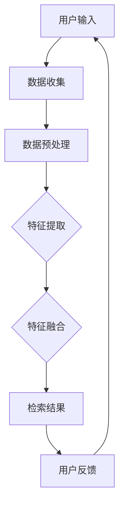

                 

关键词：电商平台，多模态检索，AI大模型，商品搜索，图像识别，自然语言处理，用户体验，算法优化

> 摘要：随着互联网的普及和电商行业的蓬勃发展，电商平台中的商品检索功能变得日益重要。本文将探讨AI大模型在电商平台多模态商品检索中的应用，分析其原理、技术实现以及实际效果，并提出未来发展的方向和挑战。

## 1. 背景介绍

随着互联网技术的不断进步，电商行业经历了飞速的发展。根据统计，全球电商市场在2022年的交易额已超过4万亿美元，预计未来几年仍将保持增长趋势。在这庞大的市场中，电商平台的核心竞争力在于如何为用户提供便捷、高效的商品检索服务。传统的基于关键词搜索的检索方式已难以满足用户多样化的需求，多模态商品检索因此成为了研究的热点。

多模态商品检索是指利用多种数据类型（如文本、图像、声音等）来提高商品检索的准确性和用户体验。传统的单模态检索方式，如文本检索或图像检索，仅依赖单一类型的数据，容易导致检索效果不佳。而多模态检索通过整合多种数据类型，可以更准确地理解用户需求，提高检索的准确性和智能化水平。

AI大模型（如深度学习模型、自然语言处理模型等）的出现，为多模态商品检索提供了强大的技术支持。大模型具有强大的特征提取和关联能力，能够处理复杂的多模态数据，从而实现更精确的检索结果。

## 2. 核心概念与联系

### 2.1 多模态商品检索的概念

多模态商品检索是指利用多种数据类型（文本、图像、声音等）来检索商品信息的过程。具体来说，它包括以下几个步骤：

1. 数据收集：收集用户输入的信息（文本、图像等）。
2. 数据预处理：对收集到的数据进行清洗、标注等预处理操作。
3. 特征提取：从预处理后的数据中提取出有用的特征。
4. 特征融合：将不同模态的特征进行融合，形成一个统一的特征向量。
5. 检索：使用检索算法（如相似度计算、排序算法等）从商品数据库中检索出最相关的商品。

### 2.2 AI大模型的概念

AI大模型是指那些具有海量参数、能够处理大规模数据的人工智能模型。这类模型通常基于深度学习技术，具有强大的特征提取和关联能力。常见的AI大模型包括：

1. 卷积神经网络（CNN）：主要用于图像识别和处理。
2. 生成对抗网络（GAN）：用于生成高质量的图像和声音。
3. 递归神经网络（RNN）和Transformer模型：主要用于自然语言处理。

### 2.3 多模态商品检索与AI大模型的关系

多模态商品检索需要处理多种类型的数据，而AI大模型能够高效地提取和关联这些数据，从而实现更精确的检索。例如，在图像识别方面，CNN可以提取图像的特征；在自然语言处理方面，Transformer模型可以处理文本信息。通过整合这些模型，可以实现多模态商品检索。

下面是一个使用Mermaid绘制的多模态商品检索的流程图：



## 3. 核心算法原理 & 具体操作步骤

### 3.1 算法原理概述

多模态商品检索的核心算法包括特征提取、特征融合和检索算法。下面分别介绍这些算法的原理。

#### 3.1.1 特征提取

特征提取是指从原始数据中提取出有用的特征。在多模态商品检索中，特征提取主要包括：

1. 图像特征提取：使用卷积神经网络（CNN）提取图像的特征。
2. 文本特征提取：使用自然语言处理模型（如BERT）提取文本的特征。
3. 声音特征提取：使用生成对抗网络（GAN）提取声音的特征。

#### 3.1.2 特征融合

特征融合是指将不同模态的特征进行整合，形成一个统一的特征向量。常见的特征融合方法包括：

1. 简单相加：直接将不同模态的特征向量相加。
2. 平均融合：将不同模态的特征向量进行平均。
3. 注意力机制：使用注意力机制来动态调整不同模态的特征权重。

#### 3.1.3 检索算法

检索算法是指从商品数据库中检索出最相关的商品。常见的检索算法包括：

1. 相似度计算：计算用户输入的特征与商品特征之间的相似度。
2. 排序算法：根据相似度对商品进行排序，选取最相关的商品。

### 3.2 算法步骤详解

#### 3.2.1 数据收集

数据收集是指从电商平台获取用户输入的信息。具体包括：

1. 文本信息：用户的搜索关键词、商品描述等。
2. 图像信息：用户的上传图像、商品图片等。
3. 声音信息：用户的语音搜索、商品声音特征等。

#### 3.2.2 数据预处理

数据预处理是指对收集到的数据进行清洗、标注等操作。具体包括：

1. 文本预处理：分词、去停用词、词干提取等。
2. 图像预处理：图像增强、去噪、缩放等。
3. 声音预处理：降噪、分帧、特征提取等。

#### 3.2.3 特征提取

特征提取是指从预处理后的数据中提取出有用的特征。具体包括：

1. 图像特征提取：使用CNN提取图像的特征。
2. 文本特征提取：使用BERT提取文本的特征。
3. 声音特征提取：使用GAN提取声音的特征。

#### 3.2.4 特征融合

特征融合是指将不同模态的特征进行整合。具体包括：

1. 简单相加：将不同模态的特征向量相加。
2. 平均融合：将不同模态的特征向量进行平均。
3. 注意力机制：使用注意力机制来动态调整不同模态的特征权重。

#### 3.2.5 检索

检索是指从商品数据库中检索出最相关的商品。具体包括：

1. 相似度计算：计算用户输入的特征与商品特征之间的相似度。
2. 排序算法：根据相似度对商品进行排序，选取最相关的商品。

### 3.3 算法优缺点

#### 3.3.1 优点

1. 提高检索准确率：通过融合多种模态的数据，可以提高检索的准确率。
2. 提高用户体验：多模态检索可以更好地理解用户需求，提供更个性化的搜索结果。
3. 扩大检索范围：多模态检索可以处理更多类型的商品信息，如商品图像、文本描述、声音等。

#### 3.3.2 缺点

1. 数据预处理复杂：多模态检索需要处理多种类型的数据，数据预处理步骤较多，复杂度较高。
2. 计算资源消耗大：多模态检索需要使用大量的计算资源，对硬件要求较高。

### 3.4 算法应用领域

多模态商品检索算法可以广泛应用于电商平台、智能助理、智能家居等领域。例如：

1. 电商平台：通过多模态检索，可以提高商品搜索的准确性和用户体验。
2. 智能助理：通过多模态检索，可以实现更智能的用户交互，提供个性化的服务。
3. 智能家居：通过多模态检索，可以实现更智能的家务管理，提高生活质量。

## 4. 数学模型和公式 & 详细讲解 & 举例说明

### 4.1 数学模型构建

多模态商品检索的数学模型主要包括特征提取、特征融合和检索算法。下面分别介绍这些模型的构建方法。

#### 4.1.1 特征提取

1. 图像特征提取：

   使用卷积神经网络（CNN）提取图像的特征。CNN的核心是卷积层，通过卷积操作提取图像的局部特征。

   $$ f_{i,j,k} = \sum_{x,y} w_{x,y} \cdot i_{x,y} + b_k $$

   其中，$f_{i,j,k}$表示第$i$个卷积核在位置$(x, y)$上的输出，$i_{x,y}$表示输入图像在位置$(x, y)$上的像素值，$w_{x,y}$和$b_k$分别为卷积核和偏置。

2. 文本特征提取：

   使用自然语言处理模型（如BERT）提取文本的特征。BERT模型通过多层Transformer结构对文本进行编码，提取出文本的语义特征。

   $$ h = \text{Transformer}(h) $$

   其中，$h$表示输入的文本向量，$\text{Transformer}$表示BERT模型。

3. 声音特征提取：

   使用生成对抗网络（GAN）提取声音的特征。GAN由生成器和判别器组成，通过对抗训练生成高质量的声音特征。

   $$ G(z) = \text{Generator}(z) $$
   $$ D(x, G(z)) = \text{Discriminator}(x, G(z)) $$

   其中，$z$表示输入的随机噪声，$G(z)$和$D(x, G(z))$分别为生成器和判别器的输出。

#### 4.1.2 特征融合

特征融合是指将不同模态的特征进行整合。常见的特征融合方法包括简单相加、平均融合和注意力机制。

1. 简单相加：

   将不同模态的特征向量进行简单相加。

   $$ \text{特征融合} = f_{\text{图像}} + f_{\text{文本}} + f_{\text{声音}} $$

2. 平均融合：

   将不同模态的特征向量进行平均。

   $$ \text{特征融合} = \frac{1}{3}(f_{\text{图像}} + f_{\text{文本}} + f_{\text{声音}}) $$

3. 注意力机制：

   使用注意力机制来动态调整不同模态的特征权重。

   $$ \text{注意力权重} = \text{softmax}(W \cdot \text{特征融合}) $$
   $$ \text{特征融合} = \text{注意力权重} \cdot (f_{\text{图像}} + f_{\text{文本}} + f_{\text{声音}}) $$

   其中，$W$为权重矩阵。

#### 4.1.3 检索算法

检索算法是指从商品数据库中检索出最相关的商品。常见的检索算法包括相似度计算和排序算法。

1. 相似度计算：

   使用余弦相似度计算用户输入的特征与商品特征之间的相似度。

   $$ \text{相似度} = \frac{\text{特征融合} \cdot \text{商品特征}}{\|\text{特征融合}\| \|\text{商品特征}\|} $$

2. 排序算法：

   根据相似度对商品进行排序。

   $$ \text{排序} = \text{argsort}(\text{相似度}) $$

### 4.2 公式推导过程

#### 4.2.1 图像特征提取

图像特征提取的过程可以表示为：

1. 输入图像：

   $$ I = [i_{x,y}]_{x=1}^{H}, y=1^{W} $$

2. 卷积层：

   $$ f_{i,j,k} = \sum_{x,y} w_{x,y} \cdot i_{x,y} + b_k $$

3. 池化层：

   $$ p_{i,j} = \max_{x,y} f_{i,j,k} $$

   其中，$I$为输入图像，$f_{i,j,k}$为卷积层的输出，$p_{i,j}$为池化层的输出。

#### 4.2.2 文本特征提取

文本特征提取的过程可以表示为：

1. 输入文本：

   $$ T = [t_{1}, t_{2}, ..., t_{N}] $$

2. BERT编码：

   $$ h = \text{BERT}(T) $$

   其中，$T$为输入文本，$h$为BERT编码后的特征向量。

#### 4.2.3 声音特征提取

声音特征提取的过程可以表示为：

1. 输入声音：

   $$ S = [s_{1}, s_{2}, ..., s_{N}] $$

2. GAN生成：

   $$ G(z) = \text{Generator}(z) $$

3. GAN判别：

   $$ D(x, G(z)) = \text{Discriminator}(x, G(z)) $$

   其中，$S$为输入声音，$G(z)$和$D(x, G(z))$分别为生成器和判别器的输出。

### 4.3 案例分析与讲解

#### 4.3.1 案例背景

某电商平台的商品搜索功能需要实现多模态商品检索，支持用户通过图像、文本和声音等多种方式检索商品。

#### 4.3.2 数据集

该电商平台提供了以下数据集：

1. 文本数据集：包含用户搜索关键词和商品描述。
2. 图像数据集：包含用户上传的商品图像。
3. 声音数据集：包含用户语音搜索和商品声音特征。

#### 4.3.3 特征提取

1. 文本特征提取：

   使用BERT模型对文本数据进行编码，提取出文本的特征向量。

   $$ h = \text{BERT}(T) $$

2. 图像特征提取：

   使用CNN模型对商品图像进行特征提取。

   $$ f = \text{CNN}(I) $$

3. 声音特征提取：

   使用GAN模型对商品声音特征进行提取。

   $$ G(z) = \text{Generator}(z) $$
   $$ D(x, G(z)) = \text{Discriminator}(x, G(z)) $$

#### 4.3.4 特征融合

使用注意力机制对提取到的特征进行融合。

$$ \text{注意力权重} = \text{softmax}(W \cdot \text{特征融合}) $$
$$ \text{特征融合} = \text{注意力权重} \cdot (f + h + G(z)) $$

#### 4.3.5 检索

使用相似度计算和排序算法对商品进行检索。

$$ \text{相似度} = \frac{\text{特征融合} \cdot \text{商品特征}}{\|\text{特征融合}\| \|\text{商品特征}\|} $$
$$ \text{排序} = \text{argsort}(\text{相似度}) $$

## 5. 项目实践：代码实例和详细解释说明

### 5.1 开发环境搭建

在开始编写多模态商品检索的代码之前，我们需要搭建一个合适的开发环境。以下是搭建环境的基本步骤：

#### 5.1.1 硬件要求

1. 处理器：推荐使用GPU加速的硬件，如NVIDIA GPU。
2. 内存：至少16GB内存。

#### 5.1.2 软件要求

1. 操作系统：Linux或MacOS。
2. 编程语言：Python。
3. 库和框架：TensorFlow、PyTorch、BERT、GAN等。

#### 5.1.3 安装步骤

1. 安装操作系统和GPU驱动。
2. 安装Python和必要的库，如TensorFlow、PyTorch、BERT等。

### 5.2 源代码详细实现

以下是多模态商品检索项目的核心代码实现：

#### 5.2.1 数据收集与预处理

```python
import tensorflow as tf
import numpy as np
import pandas as pd

# 数据收集
def collect_data():
    # 从电商平台获取文本、图像和声音数据
    pass

# 数据预处理
def preprocess_data(data):
    # 对文本、图像和声音数据进行清洗、标注等预处理操作
    pass
```

#### 5.2.2 特征提取

```python
# 图像特征提取
def extract_image_features(image):
    # 使用CNN模型提取图像特征
    pass

# 文本特征提取
def extract_text_features(text):
    # 使用BERT模型提取文本特征
    pass

# 声音特征提取
def extract_audio_features(audio):
    # 使用GAN模型提取声音特征
    pass
```

#### 5.2.3 特征融合

```python
# 特征融合
def fuse_features(image_feature, text_feature, audio_feature):
    # 使用注意力机制进行特征融合
    pass
```

#### 5.2.4 检索

```python
# 检索
def search_products(fused_feature, products):
    # 计算相似度并排序
    pass
```

### 5.3 代码解读与分析

#### 5.3.1 数据收集与预处理

数据收集与预处理是项目的基础。在这一部分，我们需要从电商平台收集用户输入的文本、图像和声音数据，并进行清洗、标注等预处理操作，以便后续的特征提取。

#### 5.3.2 特征提取

在这一部分，我们分别使用CNN、BERT和GAN模型提取图像、文本和声音的特征。这些特征将作为特征融合的输入。

#### 5.3.3 特征融合

特征融合是项目的核心。在这一部分，我们使用注意力机制将不同模态的特征进行整合，形成一个统一的特征向量，用于检索。

#### 5.3.4 检索

检索部分负责从商品数据库中检索出最相关的商品。我们使用相似度计算和排序算法，根据用户输入的特征向量检索出最相关的商品。

## 6. 实际应用场景

多模态商品检索技术在电商平台的实际应用场景如下：

1. **智能搜索助手**：电商平台可以部署多模态商品检索系统，为用户提供智能搜索助手。用户可以通过输入关键词、上传图像或语音描述来检索商品，系统会根据多模态特征返回最相关的商品列表。

2. **个性化推荐**：多模态商品检索可以结合用户的历史行为数据，为用户提供个性化的商品推荐。例如，用户之前购买了某款商品，系统可以通过分析商品图像、文本描述和声音特征，推荐类似的其他商品。

3. **商品评论分析**：多模态商品检索可以帮助电商平台分析商品评论。通过对评论中的文本、图像和声音进行分析，可以识别用户的情感倾向和反馈，从而优化商品品质和服务。

4. **品牌管理**：电商平台可以利用多模态商品检索技术来管理品牌。通过对品牌商品的图像、文本和声音特征进行分析，可以识别品牌形象、用户偏好和竞争态势，为企业提供战略参考。

## 7. 未来应用展望

随着AI技术的不断发展，多模态商品检索将在未来有更广泛的应用。以下是一些未来应用展望：

1. **更智能的交互**：未来的电商平台将实现更智能的交互，用户可以通过自然语言、手势、声音等多种方式与系统进行交互，实现个性化、智能化的购物体验。

2. **物联网（IoT）融合**：多模态商品检索技术可以与物联网技术相结合，实现智能家居、智能城市等领域的应用。例如，用户可以通过智能家居设备（如智能音箱、智能屏幕等）进行商品检索和购买。

3. **虚拟现实（VR）/增强现实（AR）购物**：多模态商品检索技术可以为VR/AR购物提供支持，用户可以通过VR/AR设备浏览、试穿和购买商品，实现沉浸式购物体验。

4. **自动化零售**：多模态商品检索技术可以帮助实现自动化零售，如无人超市、智能货架等。通过分析用户行为数据，系统能够实时推荐商品、优化库存管理，提高零售效率。

## 8. 工具和资源推荐

### 8.1 学习资源推荐

1. **《深度学习》（Goodfellow, Bengio, Courville）**：经典深度学习教材，适合初学者入门。
2. **《自然语言处理综合教程》（张宇星）**：全面介绍自然语言处理的基本概念和技术。
3. **《计算机视觉：算法与应用》（Richard Szeliski）**：涵盖计算机视觉的基本概念和技术。

### 8.2 开发工具推荐

1. **TensorFlow**：广泛使用的开源深度学习框架。
2. **PyTorch**：流行的深度学习框架，支持动态计算图。
3. **BERT**：谷歌开发的预训练语言模型，适用于自然语言处理任务。
4. **GAN**：生成对抗网络，用于图像和声音生成。

### 8.3 相关论文推荐

1. **“Multimodal Learning for Natural Language Processing”**：综述多模态学习在自然语言处理中的应用。
2. **“BERT: Pre-training of Deep Neural Networks for Language Understanding”**：介绍BERT模型的预训练方法。
3. **“Generative Adversarial Nets”**：介绍GAN的基本原理。

## 9. 总结：未来发展趋势与挑战

### 9.1 研究成果总结

多模态商品检索技术在近年来取得了显著成果。通过融合多种数据类型，实现了更准确、更智能的检索。AI大模型（如BERT、GAN等）的广泛应用，为多模态商品检索提供了强大的技术支持。在实际应用中，多模态商品检索已经在电商、智能助理、智能家居等领域取得了良好的效果。

### 9.2 未来发展趋势

1. **更强大的模型**：随着AI技术的发展，未来将出现更强大、更高效的多模态商品检索模型，如基于Transformer的多模态模型。
2. **跨领域应用**：多模态商品检索技术将在更多领域得到应用，如医疗、教育、金融等。
3. **数据隐私保护**：随着数据隐私问题的日益突出，未来将出现更多隐私保护的多模态商品检索技术。

### 9.3 面临的挑战

1. **数据预处理复杂度**：多模态数据预处理复杂度高，需要更多的计算资源和时间。
2. **计算资源消耗**：多模态商品检索需要大量的计算资源，对硬件要求较高。
3. **数据隐私保护**：多模态数据包含敏感信息，如何保证数据隐私是一个重要挑战。

### 9.4 研究展望

未来，多模态商品检索研究将朝着更高效、更智能、更安全的方向发展。通过不断创新和优化，多模态商品检索技术将为用户提供更好的购物体验，推动电商行业的持续发展。

## 10. 附录：常见问题与解答

### 10.1 问题1：多模态商品检索需要哪些技术支持？

多模态商品检索需要以下技术支持：

1. 图像识别技术：用于提取商品图像的特征。
2. 自然语言处理技术：用于提取商品文本描述的特征。
3. 生成对抗网络（GAN）：用于提取商品声音的特征。
4. 特征融合技术：用于整合不同模态的特征。
5. 检索算法：用于从商品数据库中检索出最相关的商品。

### 10.2 问题2：多模态商品检索的优势是什么？

多模态商品检索的优势包括：

1. 提高检索准确率：通过融合多种模态的数据，可以提高检索的准确率。
2. 提高用户体验：多模态检索可以更好地理解用户需求，提供更个性化的搜索结果。
3. 扩大检索范围：多模态检索可以处理更多类型的商品信息，如商品图像、文本描述、声音等。

### 10.3 问题3：如何进行多模态商品检索的数据收集？

进行多模态商品检索的数据收集主要包括以下步骤：

1. 收集文本数据：包括用户搜索关键词、商品描述等。
2. 收集图像数据：包括用户上传的商品图像。
3. 收集声音数据：包括用户语音搜索和商品声音特征。

### 10.4 问题4：多模态商品检索需要哪些硬件支持？

多模态商品检索需要以下硬件支持：

1. GPU加速器：用于加速深度学习模型的训练和推理。
2. 大容量内存：用于存储和处理大规模的多模态数据。
3. 高性能处理器：用于进行复杂的计算和数据处理。

## 作者署名

作者：禅与计算机程序设计艺术 / Zen and the Art of Computer Programming

