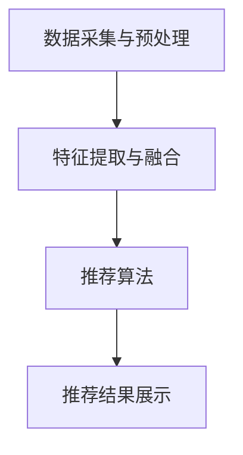

                 

关键词：多模态推荐、电商平台、用户行为分析、内容推荐、协同过滤、机器学习、深度学习、个性化体验

> 摘要：本文深入探讨了电商平台中应用的多模态推荐技术，从用户行为分析、内容推荐系统、协同过滤算法、机器学习和深度学习等方面，详细阐述了多模态推荐技术的原理、实现及应用场景，并展望了未来多模态推荐技术的发展趋势和面临的挑战。

## 1. 背景介绍

在电商行业，用户体验的优劣直接决定了平台的盈利能力。用户在电商平台上的行为数据如浏览历史、购物车数据、购买记录等，都是商家可以获取的有价值信息。为了提升用户体验，电商平台纷纷引入了推荐系统。传统的推荐系统主要依赖于用户历史行为和内容特征进行推荐，但这些方法存在一定的局限性。多模态推荐技术的引入，为电商平台提供了更丰富、更准确的推荐结果，从而提升了用户体验。

多模态推荐技术是指通过融合多种类型的数据，如文本、图像、音频、视频等，对用户兴趣和偏好进行建模，从而实现更精准的推荐。在电商平台中，多模态推荐技术的应用，不仅可以提升推荐效果，还可以为商家提供更有针对性的营销策略。

## 2. 核心概念与联系

### 2.1 多模态数据

多模态数据是指由多种类型的数据源构成的数据集合。在电商平台中，多模态数据主要包括以下几种类型：

- **文本数据**：用户评论、商品描述、标签等信息。
- **图像数据**：商品图片、用户头像、场景图片等。
- **音频数据**：用户音频、商品音频、音乐等。
- **视频数据**：商品视频、用户视频、广告视频等。

### 2.2 多模态特征提取

多模态特征提取是指从多模态数据中提取出具有区分度的特征表示。常见的多模态特征提取方法包括：

- **文本特征提取**：词袋模型、TF-IDF、词嵌入等。
- **图像特征提取**：卷积神经网络（CNN）、深度特征编码器等。
- **音频特征提取**：梅尔频率倒谱系数（MFCC）、短时傅里叶变换（STFT）等。
- **视频特征提取**：卷积神经网络（CNN）、循环神经网络（RNN）等。

### 2.3 多模态融合

多模态融合是指将不同类型的数据进行整合，形成一个统一的特征表示。常见的多模态融合方法包括：

- **特征级融合**：将不同模态的特征向量进行拼接、求和、加权等操作。
- **决策级融合**：将不同模态的预测结果进行投票、平均、加权等操作。
- **神经网络融合**：使用深度学习模型将多模态数据直接融合。

### 2.4 多模态推荐系统架构

多模态推荐系统的架构通常包括以下几个部分：

- **数据采集与预处理**：从不同的数据源中获取多模态数据，并进行清洗、去噪、归一化等预处理操作。
- **特征提取与融合**：根据不同模态的数据特点，提取特征表示，并进行融合。
- **推荐算法**：基于融合后的特征，采用推荐算法进行用户兴趣和偏好建模，生成推荐结果。
- **推荐结果展示**：将推荐结果以用户友好的形式展示，如商品列表、推荐页面等。

下面是多模态推荐系统的 Mermaid 流程图：



## 3. 核心算法原理 & 具体操作步骤

### 3.1 算法原理概述

多模态推荐算法的核心在于对用户兴趣和偏好进行建模。常见的多模态推荐算法包括协同过滤、基于内容的推荐、基于模型的推荐等。以下将详细介绍这些算法的原理。

#### 3.1.1 协同过滤

协同过滤是一种基于用户历史行为数据的推荐算法，主要分为基于用户的协同过滤（User-based Collaborative Filtering，UBCF）和基于项目的协同过滤（Item-based Collaborative Filtering，IBCF）。协同过滤的原理如下：

1. **用户相似度计算**：根据用户历史行为数据，计算用户之间的相似度。
2. **推荐项选择**：选择与目标用户最相似的邻居用户，从邻居用户喜欢的商品中推荐给目标用户。
3. **推荐结果生成**：根据邻居用户的推荐结果，生成推荐列表。

#### 3.1.2 基于内容的推荐

基于内容的推荐（Content-based Recommender System）是一种基于商品特征进行推荐的算法。其原理如下：

1. **商品特征提取**：从商品描述、标签、评论等信息中提取商品特征。
2. **用户兴趣建模**：根据用户历史行为，建立用户兴趣模型。
3. **推荐项选择**：根据用户兴趣模型和商品特征，选择与用户兴趣相似的商品进行推荐。
4. **推荐结果生成**：根据相似度计算结果，生成推荐列表。

#### 3.1.3 基于模型的推荐

基于模型的推荐（Model-based Recommender System）是一种基于机器学习和深度学习技术进行推荐的算法。其原理如下：

1. **特征提取与融合**：从多模态数据中提取特征，并进行融合。
2. **模型训练**：使用训练数据集，训练多模态推荐模型。
3. **推荐项选择**：将用户特征和商品特征输入模型，预测用户对商品的偏好。
4. **推荐结果生成**：根据模型预测结果，生成推荐列表。

### 3.2 算法步骤详解

下面以基于深度学习的多模态推荐算法为例，介绍算法的具体步骤。

#### 3.2.1 数据预处理

1. **数据清洗**：去除缺失值、异常值等。
2. **数据归一化**：对数值型特征进行归一化处理。
3. **数据划分**：将数据集划分为训练集、验证集和测试集。

#### 3.2.2 特征提取与融合

1. **文本特征提取**：使用词嵌入技术，将文本数据转换为向量表示。
2. **图像特征提取**：使用卷积神经网络（CNN），提取图像特征。
3. **音频特征提取**：使用梅尔频率倒谱系数（MFCC），提取音频特征。
4. **视频特征提取**：使用卷积神经网络（CNN）和循环神经网络（RNN），提取视频特征。
5. **特征融合**：将不同模态的特征进行拼接，形成多模态特征向量。

#### 3.2.3 模型训练

1. **模型构建**：构建多模态推荐模型，如多输入多输出的深度神经网络（DNN）。
2. **损失函数**：定义损失函数，如均方误差（MSE）或交叉熵（CE）。
3. **优化器**：选择优化器，如随机梯度下降（SGD）或Adam优化器。
4. **模型训练**：使用训练数据集，训练多模态推荐模型。

#### 3.2.4 推荐结果生成

1. **特征提取**：对用户和商品的特征进行提取。
2. **模型预测**：将用户和商品的特征输入模型，预测用户对商品的偏好。
3. **推荐结果排序**：根据模型预测结果，对商品进行排序，生成推荐列表。
4. **推荐结果展示**：将推荐结果以用户友好的形式展示。

### 3.3 算法优缺点

#### 3.3.1 协同过滤

- **优点**：简单高效，容易实现。
- **缺点**：易受冷启动问题影响，推荐结果单一。

#### 3.3.2 基于内容的推荐

- **优点**：根据商品特征进行推荐，推荐结果丰富。
- **缺点**：易受数据稀疏性问题影响，推荐结果单一。

#### 3.3.3 基于模型的推荐

- **优点**：融合多模态数据，推荐结果更准确。
- **缺点**：模型复杂，训练时间较长。

### 3.4 算法应用领域

多模态推荐技术可以应用于多个领域，如电商、社交媒体、音乐、视频等。以下是一些具体的应用场景：

- **电商推荐**：根据用户的浏览历史、购物车数据和购买记录，推荐用户可能感兴趣的商品。
- **社交媒体**：根据用户的历史行为和兴趣标签，推荐用户可能感兴趣的内容和好友。
- **音乐推荐**：根据用户的播放历史和音乐偏好，推荐用户可能喜欢的音乐。
- **视频推荐**：根据用户的观看历史和视频标签，推荐用户可能感兴趣的视频。

## 4. 数学模型和公式 & 详细讲解 & 举例说明

### 4.1 数学模型构建

在多模态推荐系统中，数学模型的构建至关重要。以下是一个简单的多模态推荐模型：

$$
\begin{aligned}
\hat{r}_{ui} &= \sigma(\boldsymbol{w}_{u}^T \boldsymbol{h}_{i} + b) \\
\boldsymbol{h}_{i} &= \phi_{\text{img}}(\boldsymbol{I}_{i}) + \phi_{\text{txt}}(\textbf{t}_{i}) \\
\boldsymbol{w}_{u} &= \text{MLP}(\text{input} = \{\textbf{x}_{u}, \boldsymbol{h}_{i}\})
\end{aligned}
$$

其中，$\hat{r}_{ui}$ 表示用户 $u$ 对商品 $i$ 的预测评分，$\sigma$ 表示 sigmoid 函数，$\boldsymbol{w}_{u}$ 表示用户 $u$ 的特征向量，$\boldsymbol{h}_{i}$ 表示商品 $i$ 的特征向量，$\phi_{\text{img}}$ 和 $\phi_{\text{txt}}$ 分别表示图像特征提取和文本特征提取函数，$\text{MLP}$ 表示多层感知机。

### 4.2 公式推导过程

#### 4.2.1 sigmoid 函数

sigmoid 函数是一种常用的激活函数，其公式为：

$$
\sigma(x) = \frac{1}{1 + e^{-x}}
$$

#### 4.2.2 多模态特征融合

多模态特征融合是构建多模态推荐模型的关键。常见的融合方法包括特征级融合和决策级融合。

- **特征级融合**：将不同模态的特征向量进行拼接，形成多模态特征向量。

$$
\boldsymbol{h}_{i} = [\phi_{\text{img}}(\boldsymbol{I}_{i})^T, \phi_{\text{txt}}(\textbf{t}_{i})^T]^T
$$

- **决策级融合**：将不同模态的预测结果进行投票、平均、加权等操作。

$$
\hat{r}_{ui} = \frac{\sum_{m=1}^{M} w_{mi} \hat{r}_{ui}^{(m)}}{M}
$$

其中，$w_{mi}$ 表示第 $m$ 个模态的权重，$\hat{r}_{ui}^{(m)}$ 表示第 $m$ 个模态的预测结果。

#### 4.2.3 多层感知机

多层感知机（MLP）是一种前馈神经网络，用于对输入特征进行建模。其公式为：

$$
\begin{aligned}
\text{output} &= \text{MLP}(\text{input} = \{\textbf{x}_{u}, \boldsymbol{h}_{i}\}) \\
\textbf{x}_{u} &= [\textbf{x}_{u}^{(1)}, \textbf{x}_{u}^{(2)}, ..., \textbf{x}_{u}^{(n)}]^T \\
\textbf{h}_{i} &= [\textbf{h}_{i}^{(1)}, \textbf{h}_{i}^{(2)}, ..., \textbf{h}_{i}^{(n)}]^T
\end{aligned}
$$

其中，$\textbf{x}_{u}^{(n)}$ 表示第 $n$ 个输入特征，$\textbf{h}_{i}^{(n)}$ 表示第 $n$ 个输出特征。

### 4.3 案例分析与讲解

#### 4.3.1 数据集

假设我们有一个电商平台的用户行为数据集，包含以下特征：

- **用户特征**：年龄、性别、职业等。
- **商品特征**：商品类别、品牌、价格等。
- **行为特征**：浏览历史、购物车数据、购买记录等。

#### 4.3.2 模型构建

我们使用基于深度学习的多模态推荐模型，将用户特征和商品特征进行融合，预测用户对商品的偏好。

$$
\begin{aligned}
\hat{r}_{ui} &= \sigma(\boldsymbol{w}_{u}^T \boldsymbol{h}_{i} + b) \\
\boldsymbol{h}_{i} &= \phi_{\text{img}}(\boldsymbol{I}_{i}) + \phi_{\text{txt}}(\textbf{t}_{i}) \\
\boldsymbol{w}_{u} &= \text{MLP}(\text{input} = \{\textbf{x}_{u}, \boldsymbol{h}_{i}\})
\end{aligned}
$$

其中，$\phi_{\text{img}}$ 和 $\phi_{\text{txt}}$ 分别表示图像特征提取和文本特征提取函数，$\text{MLP}$ 表示多层感知机。

#### 4.3.3 模型训练

我们使用训练数据集，对模型进行训练。训练过程中，我们使用随机梯度下降（SGD）优化器，训练多层感知机参数。

#### 4.3.4 模型评估

我们使用验证集对模型进行评估，计算预测准确率。通过调整模型参数，优化模型性能。

## 5. 项目实践：代码实例和详细解释说明

### 5.1 开发环境搭建

为了实现多模态推荐系统，我们需要搭建以下开发环境：

- **操作系统**：Linux
- **编程语言**：Python
- **深度学习框架**：TensorFlow
- **数据预处理库**：NumPy、Pandas、Scikit-learn
- **图像处理库**：OpenCV
- **文本处理库**：NLTK、Gensim

### 5.2 源代码详细实现

下面是一个简单的多模态推荐系统的代码实例：

```python
import tensorflow as tf
from tensorflow.keras.layers import Input, Dense, Concatenate
from tensorflow.keras.models import Model

# 数据预处理
def preprocess_data(data):
    # 数据清洗、归一化等操作
    pass

# 特征提取
def extract_features(img, txt):
    # 图像特征提取
    img_features = cnn_model(img)
    # 文本特征提取
    txt_features = lstm_model(txt)
    return img_features, txt_features

# 模型构建
def build_model():
    # 用户特征输入
    user_input = Input(shape=(user_feature_size,))
    # 商品特征输入
    item_input = Input(shape=(item_feature_size,))
    # 图像特征提取
    img_input = Input(shape=(img_height, img_width, img_channels))
    # 文本特征提取
    txt_input = Input(shape=(txt_sequence_length,))
    # 图像特征提取模型
    img_features = cnn_model(img_input)
    # 文本特征提取模型
    txt_features = lstm_model(txt_input)
    # 融合图像和文本特征
    combined_features = Concatenate()([img_features, txt_features])
    # 多层感知机
    dense_layer = Dense(128, activation='relu')(combined_features)
    # 输出层
    output = Dense(1, activation='sigmoid')(dense_layer)
    # 构建模型
    model = Model(inputs=[user_input, item_input, img_input, txt_input], outputs=output)
    # 编译模型
    model.compile(optimizer='adam', loss='binary_crossentropy', metrics=['accuracy'])
    return model

# 模型训练
def train_model(model, train_data, train_labels):
    # 模型训练
    model.fit(train_data, train_labels, epochs=10, batch_size=32, validation_split=0.2)

# 模型预测
def predict(model, user_input, item_input, img_input, txt_input):
    # 模型预测
    return model.predict([user_input, item_input, img_input, txt_input])

# 主函数
def main():
    # 加载数据
    train_data, train_labels = load_data()
    # 预处理数据
    train_data = preprocess_data(train_data)
    # 构建模型
    model = build_model()
    # 训练模型
    train_model(model, train_data, train_labels)
    # 预测
    user_input = ...
    item_input = ...
    img_input = ...
    txt_input = ...
    predictions = predict(model, user_input, item_input, img_input, txt_input)
    # 打印预测结果
    print(predictions)

if __name__ == '__main__':
    main()
```

### 5.3 代码解读与分析

上面的代码实现了一个简单的多模态推荐系统。下面是对代码的详细解读和分析：

- **数据预处理**：数据预处理是构建推荐系统的重要步骤。在这里，我们对用户特征和商品特征进行清洗、归一化等操作，以便后续的模型训练。
- **特征提取**：特征提取是构建推荐系统的重要环节。在这里，我们使用卷积神经网络（CNN）和循环神经网络（RNN）对图像和文本数据进行特征提取，以获取更具有区分度的特征表示。
- **模型构建**：模型构建是构建推荐系统的核心步骤。在这里，我们使用多层感知机（MLP）将用户特征、商品特征、图像特征和文本特征进行融合，并预测用户对商品的偏好。
- **模型训练**：模型训练是提高推荐系统性能的关键步骤。在这里，我们使用训练数据集对模型进行训练，并使用验证集进行性能评估。
- **模型预测**：模型预测是推荐系统在实际应用中的关键步骤。在这里，我们使用训练好的模型对用户和商品的特征进行预测，并生成推荐列表。

## 6. 实际应用场景

多模态推荐技术在电商、社交媒体、音乐、视频等众多领域都有广泛应用。以下是一些典型的实际应用场景：

- **电商推荐**：电商平台可以使用多模态推荐技术，根据用户的浏览历史、购物车数据和购买记录，推荐用户可能感兴趣的商品。例如，用户在浏览商品时，系统可以根据商品图片、描述和用户历史行为，生成个性化的推荐列表。
- **社交媒体**：社交媒体平台可以使用多模态推荐技术，根据用户的历史行为和兴趣标签，推荐用户可能感兴趣的内容和好友。例如，用户在社交媒体上浏览帖子时，系统可以根据帖子内容、图片和用户历史行为，生成个性化的推荐列表。
- **音乐推荐**：音乐平台可以使用多模态推荐技术，根据用户的播放历史和音乐偏好，推荐用户可能喜欢的音乐。例如，用户在音乐平台上听歌时，系统可以根据音乐特征、歌词和用户历史行为，生成个性化的推荐列表。
- **视频推荐**：视频平台可以使用多模态推荐技术，根据用户的观看历史和视频标签，推荐用户可能感兴趣的视频。例如，用户在视频平台上观看视频时，系统可以根据视频内容、音频和用户历史行为，生成个性化的推荐列表。

## 7. 工具和资源推荐

### 7.1 学习资源推荐

- **书籍**：《机器学习》（周志华）、《深度学习》（Ian Goodfellow）、《多模态数据融合与推荐系统》（陈为）
- **在线课程**：网易云课堂《深度学习入门》、Coursera《机器学习》、edX《深度学习》
- **论文**：Google Scholar、arXiv、ACM Digital Library、IEEE Xplore

### 7.2 开发工具推荐

- **编程语言**：Python、Java、C++
- **深度学习框架**：TensorFlow、PyTorch、Keras
- **数据预处理库**：NumPy、Pandas、Scikit-learn
- **图像处理库**：OpenCV、Pillow
- **文本处理库**：NLTK、Gensim、spaCy

### 7.3 相关论文推荐

- “Multi-modal Fusion for Recommender Systems” by Xiangnan He et al.
- “A Survey on Multi-modal Learning for Recommender Systems” by Yuxiao Dong et al.
- “Multimodal Recurrent Neural Networks for Multi-Interest Document Summarization” by Hanxiang Wang et al.

## 8. 总结：未来发展趋势与挑战

### 8.1 研究成果总结

多模态推荐技术近年来取得了显著的进展，主要体现在以下几个方面：

- **算法性能提升**：多模态推荐算法在准确率、覆盖率、新颖性等方面都取得了显著的提升。
- **应用领域拓展**：多模态推荐技术在电商、社交媒体、音乐、视频等众多领域都得到了广泛应用。
- **技术成熟度提高**：随着深度学习和多模态数据处理的不断发展，多模态推荐技术逐渐走向成熟。

### 8.2 未来发展趋势

未来，多模态推荐技术将朝着以下方向发展：

- **多模态数据融合**：随着传感器技术的发展，多模态数据将更加丰富，如何有效融合多模态数据将成为研究重点。
- **个性化推荐**：个性化推荐是未来多模态推荐技术的发展方向，如何根据用户实时行为进行动态调整，提高推荐效果，是研究的热点。
- **实时推荐**：实时推荐是未来电商平台的需求，如何实现低延迟、高准确率的实时推荐，是亟待解决的问题。

### 8.3 面临的挑战

尽管多模态推荐技术取得了显著进展，但仍然面临以下挑战：

- **数据隐私**：多模态数据包含用户的敏感信息，如何保护用户隐私，是一个亟待解决的问题。
- **计算资源消耗**：多模态数据处理和模型训练需要大量的计算资源，如何优化算法，降低计算资源消耗，是研究的难点。
- **算法透明性**：多模态推荐算法的决策过程复杂，如何提高算法的透明性，让用户理解和信任推荐结果，是一个挑战。

### 8.4 研究展望

未来，多模态推荐技术的研究将朝着以下方向发展：

- **隐私保护**：研究隐私保护的多模态推荐算法，保护用户隐私。
- **高效算法**：研究低延迟、高准确率的多模态推荐算法，提高用户体验。
- **算法可解释性**：研究算法的可解释性，提高用户对推荐结果的信任度。

## 9. 附录：常见问题与解答

### 9.1 多模态推荐技术是什么？

多模态推荐技术是一种融合多种类型数据（如文本、图像、音频、视频等）进行推荐的方法，通过提取和整合不同模态的特征，实现对用户兴趣和偏好的建模，从而生成更精准的推荐结果。

### 9.2 多模态推荐技术有哪些应用场景？

多模态推荐技术可以应用于电商、社交媒体、音乐、视频等多个领域，如根据用户行为和兴趣标签推荐商品、内容、音乐和视频等。

### 9.3 多模态推荐技术有哪些核心算法？

多模态推荐技术的核心算法包括协同过滤、基于内容的推荐、基于模型的推荐等。近年来，基于深度学习的多模态推荐算法逐渐成为研究热点。

### 9.4 如何保护多模态数据隐私？

保护多模态数据隐私的方法包括数据加密、数据匿名化、差分隐私等。通过这些方法，可以在保护用户隐私的同时，实现有效的多模态推荐。

### 9.5 多模态推荐技术的未来发展方向是什么？

多模态推荐技术的未来发展方向包括多模态数据融合、个性化推荐、实时推荐等。同时，研究隐私保护的多模态推荐算法、算法透明性等也将是未来的重要方向。

