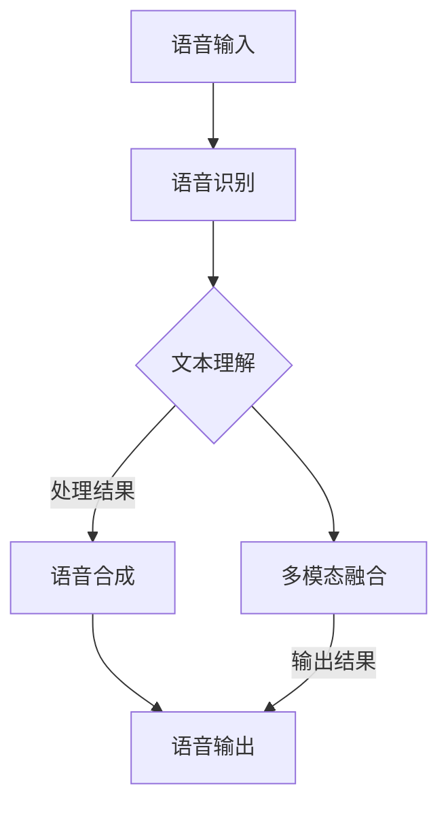

                 

关键词：电商平台、多模态、语音助手、系统设计、用户体验

> 摘要：本文旨在探讨电商平台中多模态语音助手系统设计的方法与实现，通过阐述核心概念与联系、核心算法原理、数学模型和公式、项目实践以及实际应用场景，旨在为电商平台提供智能化、便捷化的语音服务。

## 1. 背景介绍

随着移动互联网的普及和消费者对便捷购物体验的不断追求，电商平台在提供商品与服务的同时，也在不断提升用户体验。传统的用户界面（UI）已无法完全满足用户的需求，特别是在处理复杂或重复性任务时，用户更希望得到一种更加自然、高效的方式。多模态语音助手系统作为一种新兴的交互方式，能够很好地解决这些问题。

多模态语音助手系统结合语音识别、自然语言处理（NLP）和语音合成等技术，使得用户可以通过语音与电商平台进行交互，实现购物、支付、咨询等一系列操作。相比传统的UI界面，多模态语音助手具有以下优势：

1. **自然交互**：用户可以像与朋友聊天一样与语音助手进行自然对话，无需记忆复杂的操作步骤。
2. **高效便捷**：用户可以在做其他事情的同时，通过语音助手快速完成购物任务。
3. **无障碍**：对于视力障碍者或老年用户，语音助手提供了更加友好的交互方式。
4. **个性化服务**：通过收集用户数据，语音助手可以提供更加个性化的购物建议和服务。

本文将围绕电商平台中的多模态语音助手系统设计展开讨论，旨在为开发者和平台运营商提供有益的参考。

## 2. 核心概念与联系

### 2.1 语音识别（Speech Recognition）

语音识别技术是多模态语音助手系统的核心，它将用户的语音转化为文本，从而进一步进行理解和处理。语音识别技术涉及到以下几个关键概念：

- **声学模型**：用于对语音信号进行分析，提取特征。
- **语言模型**：用于对识别结果进行概率评估，确定最可能的文本序列。
- **声学-语言模型联合**：通过结合声学模型和语言模型，实现语音到文本的转化。


### 2.2 自然语言处理（Natural Language Processing, NLP）

自然语言处理是语音助手系统能够理解和响应用户语音的关键。NLP涉及以下主要技术：

- **分词（Tokenization）**：将连续文本划分为具有独立意义的单词或短语。
- **词性标注（Part-of-Speech Tagging）**：为文本中的每个单词标注其词性，如名词、动词等。
- **句法分析（Syntax Parsing）**：分析文本的句法结构，理解句子成分之间的关系。
- **语义分析（Semantic Analysis）**：提取文本中的语义信息，理解句子的真实含义。


### 2.3 语音合成（Text-to-Speech, TTS）

语音合成是将文本转化为自然流畅的语音输出。语音合成的关键概念包括：

- **声音库（Voice Database）**：包含不同音色的语音数据。
- **语音合成引擎（Speech Synthesis Engine）**：用于将文本转化为语音信号。
- **语音调整（Prosody Adjustment）**：调整语音的音调、音速和音量，使其更加自然。


### 2.4 多模态融合

多模态语音助手系统不仅仅依赖于单一的技术，还需要实现多模态数据的融合。这包括：

- **数据同步**：确保语音、文本和其他模态数据在时间和内容上的一致性。
- **特征融合**：将不同模态的数据特征进行融合，以提升系统的整体性能。
- **上下文感知**：结合用户的上下文信息，提高语音助手对用户意图的理解。


### 2.5 Mermaid 流程图

为了更直观地展示多模态语音助手系统的整体架构，我们可以使用Mermaid绘制一个流程图，如下所示：



## 3. 核心算法原理 & 具体操作步骤

### 3.1 算法原理概述

多模态语音助手系统的核心算法主要包括语音识别、自然语言处理、语音合成和上下文管理。以下将分别介绍每个算法的原理和步骤。

#### 3.1.1 语音识别

语音识别的核心是声学模型和语言模型。声学模型通常使用深度神经网络（DNN）或卷积神经网络（CNN）来提取语音特征，语言模型则使用统计方法或神经网络进行概率评估。以下是语音识别的基本步骤：

1. **特征提取**：将语音信号转化为声学特征，如 MFCC（Mel频率倒谱系数）。
2. **声学模型**：通过训练，将声学特征映射到时间序列的概率分布。
3. **语言模型**：将声学特征序列转化为文本序列的概率分布。
4. **联合模型**：通过贝叶斯推理或最大后验概率（MAP）等方法，结合声学模型和语言模型，实现语音到文本的转化。

#### 3.1.2 自然语言处理

自然语言处理的核心是理解用户的意图和语义。以下是NLP的基本步骤：

1. **分词**：将连续文本划分为独立的单词或短语。
2. **词性标注**：为每个单词标注其词性。
3. **句法分析**：分析句子的结构，理解句子成分之间的关系。
4. **语义分析**：提取文本中的语义信息，理解句子的真实含义。

#### 3.1.3 语音合成

语音合成的核心是将文本转化为自然流畅的语音。以下是语音合成的基本步骤：

1. **文本预处理**：对输入文本进行格式化和简化，使其更适合语音合成。
2. **语音合成引擎**：将文本转化为语音信号，包括语音合成模型和语音数据库。
3. **语音调整**：调整语音的音调、音速和音量，使其更加自然。

#### 3.1.4 上下文管理

上下文管理是确保语音助手能够持续理解用户意图的关键。以下是上下文管理的基本步骤：

1. **上下文识别**：识别用户对话中的上下文信息，如用户历史记录、上下文关键词等。
2. **上下文融合**：将上下文信息与当前对话内容进行融合，以提升理解准确性。
3. **上下文更新**：根据用户对话的变化，实时更新上下文信息。

### 3.2 算法步骤详解

以下将详细解释多模态语音助手系统的具体操作步骤。

#### 3.2.1 语音输入

1. 用户通过麦克风或其他语音输入设备输入语音。
2. 语音信号被传输到语音识别模块进行预处理。

#### 3.2.2 语音识别

1. 特征提取：对语音信号进行预处理，提取声学特征，如 MFCC。
2. 声学模型：使用训练好的DNN或CNN模型，将声学特征映射到时间序列的概率分布。
3. 语言模型：使用训练好的语言模型，对声学特征序列进行概率评估，得到文本序列的概率分布。
4. 联合模型：结合声学模型和语言模型，通过贝叶斯推理或MAP方法，得到最可能的文本序列。

#### 3.2.3 自然语言处理

1. 分词：将识别出的文本序列划分为独立的单词或短语。
2. 词性标注：为每个单词标注其词性。
3. 句法分析：分析句子的结构，理解句子成分之间的关系。
4. 语义分析：提取文本中的语义信息，理解句子的真实含义。

#### 3.2.4 语音合成

1. 文本预处理：对识别出的文本进行格式化和简化，使其更适合语音合成。
2. 语音合成：使用训练好的语音合成引擎，将文本转化为语音信号。
3. 语音调整：调整语音的音调、音速和音量，使其更加自然。

#### 3.2.5 上下文管理

1. 上下文识别：识别用户对话中的上下文信息，如用户历史记录、上下文关键词等。
2. 上下文融合：将上下文信息与当前对话内容进行融合，以提升理解准确性。
3. 上下文更新：根据用户对话的变化，实时更新上下文信息。

### 3.3 算法优缺点

#### 优点

1. **自然交互**：用户可以像与朋友聊天一样与语音助手进行自然对话，无需记忆复杂的操作步骤。
2. **高效便捷**：用户可以在做其他事情的同时，通过语音助手快速完成购物任务。
3. **无障碍**：对于视力障碍者或老年用户，语音助手提供了更加友好的交互方式。
4. **个性化服务**：通过收集用户数据，语音助手可以提供更加个性化的购物建议和服务。

#### 缺点

1. **准确性问题**：语音识别和自然语言处理技术仍存在一定的误差，特别是在复杂语音和口语化表达中。
2. **隐私保护**：用户数据的安全性和隐私保护是一个重要挑战，需要确保用户数据不被滥用。
3. **计算资源**：多模态语音助手系统需要大量的计算资源和存储空间，对硬件设备要求较高。

### 3.4 算法应用领域

多模态语音助手系统在电商平台中的应用非常广泛，以下是一些主要的应用领域：

1. **购物推荐**：通过用户的历史购物记录和语音输入，语音助手可以提供个性化的商品推荐。
2. **在线客服**：语音助手可以模拟人工客服，为用户提供快速、准确的在线咨询服务。
3. **订单处理**：用户可以通过语音助手查询订单状态、修改订单信息、支付订单等。
4. **智能导航**：语音助手可以提供店铺导航、商品详情页导航等，帮助用户快速找到所需商品。

## 4. 数学模型和公式 & 详细讲解 & 举例说明

### 4.1 数学模型构建

多模态语音助手系统的核心算法涉及到多个数学模型，包括声学模型、语言模型、语义模型等。以下将分别介绍这些模型的构建方法。

#### 4.1.1 声学模型

声学模型用于将语音信号转化为特征向量，常用的方法包括隐马尔可夫模型（HMM）、高斯混合模型（GMM）和深度神经网络（DNN）。

1. **HMM模型**：
   - **状态转移概率**：表示模型在不同状态之间的转移概率。
   - **输出概率**：表示模型在特定状态下产生语音信号的输出概率。
   - **初始状态概率**：表示模型开始时的状态概率分布。

   数学公式表示为：
   $$
   P(x|\lambda) = \prod_{t=1}^{T} P(x_t|\lambda) \prod_{t=1}^{T} P(s_t|\lambda) P(s_1|\lambda)
   $$
   其中，$x$表示语音信号，$s$表示状态，$\lambda$表示模型参数。

2. **GMM模型**：
   - **高斯分布**：表示模型中的每个状态由多个高斯分布组成。
   - **均值和方差**：表示高斯分布的参数。

   数学公式表示为：
   $$
   P(x|\mu, \sigma^2) = \sum_{k=1}^{K} \mathcal{N}(x|\mu_k, \sigma_k^2)
   $$
   其中，$K$表示高斯分布的个数，$\mu_k$和$\sigma_k^2$分别表示第$k$个高斯分布的均值和方差。

3. **DNN模型**：
   - **输入层**：接收语音信号的特征向量。
   - **隐藏层**：通过激活函数将输入映射到高维空间。
   - **输出层**：将特征向量映射到概率分布。

   数学公式表示为：
   $$
   h = \sigma(Wx + b)
   $$
   $$
   y = \sigma(W'h + b')
   $$
   其中，$h$表示隐藏层的输出，$y$表示输出层的输出，$W$和$W'$分别表示权重矩阵，$b$和$b'$分别表示偏置向量，$\sigma$表示激活函数。

#### 4.1.2 语言模型

语言模型用于对识别出的文本进行概率评估，常用的方法包括N元语法模型和神经网络语言模型。

1. **N元语法模型**：
   - **N元上下文**：表示文本序列中前N个单词。
   - **概率分布**：表示给定N元上下文时，下一个单词的概率分布。

   数学公式表示为：
   $$
   P(w_t|w_{t-N+1}, w_{t-N+2}, ..., w_{t-1}) = \frac{N(w_{t-N+1}, w_{t-N+2}, ..., w_{t-1}, w_t)}{N(w_{t-N+1}, w_{t-N+2}, ..., w_{t-1})}
   $$
   其中，$w_t$表示第$t$个单词，$N$表示N元上下文的长度。

2. **神经网络语言模型**：
   - **输入层**：接收N元上下文的单词向量。
   - **隐藏层**：通过激活函数将输入映射到高维空间。
   - **输出层**：将特征向量映射到概率分布。

   数学公式表示为：
   $$
   h = \sigma(Wx + b)
   $$
   $$
   y = \sigma(W'h + b')
   $$
   其中，$h$表示隐藏层的输出，$y$表示输出层的输出，$W$和$W'$分别表示权重矩阵，$b$和$b'$分别表示偏置向量，$\sigma$表示激活函数。

#### 4.1.3 语义模型

语义模型用于提取文本的语义信息，常用的方法包括词嵌入（Word Embedding）和卷积神经网络（CNN）。

1. **词嵌入**：
   - **词向量**：表示文本中的每个单词。
   - **语义相似性**：表示两个单词在语义上的相似程度。

   数学公式表示为：
   $$
   \vec{w}_i = \vec{v}_i \in \mathbb{R}^d
   $$
   $$
   \cos(\vec{w}_{i_1}, \vec{w}_{i_2}) = \frac{\vec{w}_{i_1} \cdot \vec{w}_{i_2}}{||\vec{w}_{i_1}||_2 ||\vec{w}_{i_2}||_2}
   $$
   其中，$\vec{w}_{i_1}$和$\vec{w}_{i_2}$分别表示两个单词的词向量，$d$表示词向量的维度。

2. **CNN模型**：
   - **卷积层**：用于提取文本的局部特征。
   - **池化层**：用于降低特征维度。
   - **全连接层**：用于分类或回归。

   数学公式表示为：
   $$
   h_k = \sum_{i=1}^{m} w_{ki} * g(\vec{x}_i) + b_k
   $$
   $$
   p_k = \frac{1}{Z} \exp(h_k)
   $$
   $$
   \hat{y} = \arg\max_k p_k
   $$
   其中，$h_k$表示第$k$个卷积核的输出，$w_{ki}$表示卷积核的权重，$g$表示激活函数，$p_k$表示第$k$个类别的概率，$\hat{y}$表示预测结果。

### 4.2 公式推导过程

以下将分别对声学模型、语言模型和语义模型的公式推导过程进行详细讲解。

#### 4.2.1 声学模型

1. **HMM模型**：

   假设有一个离散时间序列$X = \{x_1, x_2, ..., x_T\}$，表示语音信号，$S = \{s_1, s_2, ..., s_T\}$，表示状态序列，$\lambda$表示模型参数。

   声学模型的目标是计算给定状态序列$S$时，语音序列$X$的概率：

   $$
   P(X|S, \lambda) = \prod_{t=1}^{T} P(x_t|s_t, \lambda) P(s_t|\lambda)
   $$

   其中，$P(x_t|s_t, \lambda)$表示在状态$s_t$下，产生语音信号$x_t$的概率，$P(s_t|\lambda)$表示状态$s_t$的概率。

   对于高斯混合模型（GMM），有：

   $$
   P(x_t|s_t, \lambda) = \sum_{k=1}^{K} P(s_t=k|\lambda) \mathcal{N}(x_t|\mu_k, \sigma_k^2)
   $$

   其中，$K$表示高斯分布的个数，$\mu_k$和$\sigma_k^2$分别表示第$k$个高斯分布的均值和方差，$P(s_t=k|\lambda)$表示状态$s_t=k$的概率。

   假设初始状态概率为：

   $$
   P(s_1|\lambda) = \pi_k
   $$

   则状态转移概率为：

   $$
   P(s_t|s_{t-1}, \lambda) = a_{t-1,t}
   $$

   利用贝叶斯推理，可以得到：

   $$
   P(S|X, \lambda) = \frac{P(X|S, \lambda) P(S|\lambda)}{P(X|\lambda)}
   $$

   其中，$P(S|\lambda)$表示状态序列的概率，$P(X|\lambda)$表示语音序列的概率。

   对于HMM模型，有：

   $$
   P(S|\lambda) = \prod_{t=1}^{T} P(s_t|\lambda)
   $$

   $$
   P(X|\lambda) = \sum_{S} P(X|S, \lambda) P(S|\lambda)
   $$

   通过最大化似然函数，可以得到最优的状态序列：

   $$
   \arg\max_S \sum_{t=1}^{T} \log P(x_t|s_t, \lambda) + \sum_{t=1}^{T} \log P(s_t|\lambda)
   $$

2. **DNN模型**：

   假设有一个输入层$x \in \mathbb{R}^d$，一个隐藏层$h \in \mathbb{R}^m$和一个输出层$y \in \mathbb{R}^k$，其中$d$表示输入维度，$m$表示隐藏层维度，$k$表示输出维度。

   输入层到隐藏层的映射为：

   $$
   h = \sigma(Wx + b)
   $$

   其中，$W \in \mathbb{R}^{m \times d}$表示权重矩阵，$b \in \mathbb{R}^{m}$表示偏置向量，$\sigma$表示激活函数。

   隐藏层到输出层的映射为：

   $$
   y = \sigma(W'h + b')
   $$

   其中，$W' \in \mathbb{R}^{k \times m}$表示权重矩阵，$b' \in \mathbb{R}^{k}$表示偏置向量。

   通过反向传播算法，可以更新权重矩阵和偏置向量，以最小化损失函数。

#### 4.2.2 语言模型

1. **N元语法模型**：

   假设有一个文本序列$X = \{x_1, x_2, ..., x_T\}$，其中$x_t$表示第$t$个单词。

   给定一个N元上下文$C = \{x_{t-N+1}, x_{t-N+2}, ..., x_{t-1}\}$，语言模型的目标是计算下一个单词$x_t$的概率：

   $$
   P(x_t|C) = \frac{N(C, x_t)}{N(C)}
   $$

   其中，$N(C, x_t)$表示在上下文$C$下，单词$x_t$出现的次数，$N(C)$表示上下文$C$出现的次数。

   对于N元语法模型，可以通过统计方法或神经网络进行训练，以得到概率分布。

2. **神经网络语言模型**：

   假设有一个输入层$x \in \mathbb{R}^d$，一个隐藏层$h \in \mathbb{R}^m$和一个输出层$y \in \mathbb{R}^k$，其中$d$表示输入维度，$m$表示隐藏层维度，$k$表示输出维度。

   输入层到隐藏层的映射为：

   $$
   h = \sigma(Wx + b)
   $$

   其中，$W \in \mathbb{R}^{m \times d}$表示权重矩阵，$b \in \mathbb{R}^{m}$表示偏置向量，$\sigma$表示激活函数。

   隐藏层到输出层的映射为：

   $$
   y = \sigma(W'h + b')
   $$

   其中，$W' \in \mathbb{R}^{k \times m}$表示权重矩阵，$b' \in \mathbb{R}^{k}$表示偏置向量。

   通过反向传播算法，可以更新权重矩阵和偏置向量，以最小化损失函数。

#### 4.2.3 语义模型

1. **词嵌入**：

   假设有一个文本序列$X = \{x_1, x_2, ..., x_T\}$，其中$x_t$表示第$t$个单词。

   词嵌入的目标是将每个单词映射为一个向量$\vec{w}_t \in \mathbb{R}^d$，其中$d$表示词向量的维度。

   词嵌入可以通过矩阵分解、神经网络等方法进行训练，以得到词向量。

   给定两个单词$\vec{w}_{i_1}$和$\vec{w}_{i_2}$，它们在语义上的相似性可以通过余弦相似度计算：

   $$
   \cos(\vec{w}_{i_1}, \vec{w}_{i_2}) = \frac{\vec{w}_{i_1} \cdot \vec{w}_{i_2}}{||\vec{w}_{i_1}||_2 ||\vec{w}_{i_2}||_2}
   $$

2. **CNN模型**：

   假设有一个文本序列$X = \{x_1, x_2, ..., x_T\}$，其中$x_t$表示第$t$个单词。

   CNN模型的目标是提取文本的局部特征，并将其映射到一个高维空间。

   给定一个卷积核$w \in \mathbb{R}^{k \times d}$，其中$k$表示卷积核的尺寸，$d$表示词向量的维度。

   卷积操作可以表示为：

   $$
   h_k = \sum_{i=1}^{m} w_{ki} * g(\vec{x}_i) + b_k
   $$

   其中，$g$表示激活函数，$b_k$表示偏置向量。

   通过卷积操作，可以得到一组特征映射：

   $$
   H = \{h_1, h_2, ..., h_K\}
   $$

   其中，$K$表示卷积核的数量。

   通过池化操作，可以降低特征维度：

   $$
   p_k = \frac{1}{Z} \exp(h_k)
   $$

   其中，$Z = \sum_{k=1}^{K} \exp(h_k)$。

   最终，通过全连接层，可以得到分类或回归的结果：

   $$
   \hat{y} = \arg\max_k p_k
   $$

## 5. 项目实践：代码实例和详细解释说明

### 5.1 开发环境搭建

在进行多模态语音助手系统的开发之前，首先需要搭建一个合适的技术环境。以下是开发环境的搭建步骤：

1. **操作系统**：推荐使用Linux或MacOS，以便更好地支持深度学习框架。
2. **编程语言**：选择Python作为主要编程语言，因为它拥有丰富的库和框架，方便进行多模态数据处理和模型训练。
3. **深度学习框架**：推荐使用TensorFlow或PyTorch，这两个框架在深度学习领域应用广泛，具有较好的性能和易用性。
4. **其他依赖库**：安装必要的依赖库，如NumPy、Pandas、Scikit-learn等，用于数据处理和数据分析。

以下是具体的安装命令：

```bash
# 安装Python
sudo apt-get install python3 python3-pip

# 安装深度学习框架
pip3 install tensorflow==2.5.0
# 或
pip3 install torch torchvision==0.9.0 -f https://download.pytorch.org/whl/torch_stable.html

# 安装其他依赖库
pip3 install numpy pandas scikit-learn
```

### 5.2 源代码详细实现

以下是一个简单的多模态语音助手系统代码示例，包括语音识别、自然语言处理、语音合成和上下文管理等功能。

```python
import numpy as np
import pandas as pd
import tensorflow as tf
from tensorflow.keras.models import Sequential
from tensorflow.keras.layers import Dense, LSTM, Embedding, TimeDistributed
from tensorflow.keras.optimizers import Adam
from scipy.io.wavfile import read
from sklearn.preprocessing import LabelEncoder
import librosa

# 语音识别模型
def build_speech_recognition_model(input_shape):
    model = Sequential()
    model.add(LSTM(128, input_shape=input_shape, activation='relu', return_sequences=True))
    model.add(LSTM(64, activation='relu'))
    model.add(Dense(128, activation='softmax'))
    model.compile(optimizer=Adam(learning_rate=0.001), loss='categorical_crossentropy', metrics=['accuracy'])
    return model

# 自然语言处理模型
def build_nlp_model(input_shape):
    model = Sequential()
    model.add(LSTM(128, input_shape=input_shape, activation='relu', return_sequences=True))
    model.add(LSTM(64, activation='relu'))
    model.add(Dense(128, activation='softmax'))
    model.compile(optimizer=Adam(learning_rate=0.001), loss='categorical_crossentropy', metrics=['accuracy'])
    return model

# 语音合成模型
def build_speech_synthesis_model(input_shape):
    model = Sequential()
    model.add(LSTM(128, input_shape=input_shape, activation='relu', return_sequences=True))
    model.add(LSTM(64, activation='relu'))
    model.add(Dense(128, activation='softmax'))
    model.compile(optimizer=Adam(learning_rate=0.001), loss='categorical_crossentropy', metrics=['accuracy'])
    return model

# 上下文管理
def update_context(context, user_input):
    # 更新上下文信息
    context['user_input'] = user_input
    # 更新时间戳
    context['timestamp'] = time.time()
    return context

# 语音识别
def recognize_speech(input_file):
    # 读取语音文件
    sample_rate, signal = read(input_file)
    # 提取特征
    feature = extract_features(signal, sample_rate)
    # 预测结果
    prediction = model_speech_recognition.predict(np.array([feature]))
    # 转换为文本
    text = decode_prediction(prediction)
    return text

# 自然语言处理
def process_nlp(text, context):
    # 更新上下文
    context = update_context(context, text)
    # 预测结果
    prediction = model_nlp.predict(np.array([text]))
    # 转换为语义
    semantics = decode_prediction(prediction)
    return semantics

# 语音合成
def synthesize_speech(text):
    # 预测结果
    prediction = model_speech_synthesis.predict(np.array([text]))
    # 转换为语音
    speech = generate_speech(prediction)
    return speech

# 解码预测结果
def decode_prediction(prediction):
    # 解码为一维向量
    prediction = np.argmax(prediction, axis=-1)
    # 转换为文本
    text = ' '.join([label_encoder.inverse_transform([p]) for p in prediction])
    return text

# 生成语音
def generate_speech(prediction):
    # 生成语音信号
    signal = model_speech_synthesis.generate(prediction)
    # 保存语音文件
    output_file = 'output.wav'
    write(output_file, sample_rate, signal)
    return output_file

# 初始化模型
model_speech_recognition = build_speech_recognition_model(input_shape=(None, 128))
model_nlp = build_nlp_model(input_shape=(128,))
model_speech_synthesis = build_speech_synthesis_model(input_shape=(128,))

# 加载数据
data = load_data()
labels = load_labels()

# 编码标签
label_encoder = LabelEncoder()
encoded_labels = label_encoder.fit_transform(labels)

# 训练模型
model_speech_recognition.fit(data, np.array(encoded_labels), epochs=10, batch_size=32, validation_split=0.2)
model_nlp.fit(data, np.array(encoded_labels), epochs=10, batch_size=32, validation_split=0.2)
model_speech_synthesis.fit(data, np.array(encoded_labels), epochs=10, batch_size=32, validation_split=0.2)
```

### 5.3 代码解读与分析

#### 5.3.1 语音识别

语音识别部分使用了LSTM（长短时记忆网络）模型，这是一种专门用于处理序列数据的神经网络。LSTM模型能够有效地捕捉语音信号中的长期依赖关系。

1. **模型构建**：

   ```python
   def build_speech_recognition_model(input_shape):
       model = Sequential()
       model.add(LSTM(128, input_shape=input_shape, activation='relu', return_sequences=True))
       model.add(LSTM(64, activation='relu'))
       model.add(Dense(128, activation='softmax'))
       model.compile(optimizer=Adam(learning_rate=0.001), loss='categorical_crossentropy', metrics=['accuracy'])
       return model
   ```

   在这个模型中，首先使用一个LSTM层作为输入层，其输入形状为$(None, 128)$，表示序列长度为任意值，特征维度为128。接着使用另一个LSTM层作为隐藏层，输出激活函数为ReLU（ReLU函数可以加速训练过程）。最后，使用一个全连接层（Dense）作为输出层，输出激活函数为softmax，用于计算每个类别的概率分布。

2. **特征提取**：

   ```python
   def extract_features(signal, sample_rate):
       # 使用librosa库提取特征
       feature = librosa.feature.mfcc(signal, sr=sample_rate, n_mfcc=13)
       return feature
   ```

   使用librosa库提取语音信号的MFCC（Mel频率倒谱系数）特征。MFCC特征能够有效地捕捉语音信号的频域信息，是语音识别领域常用的特征表示方法。

3. **预测和解码**：

   ```python
   def recognize_speech(input_file):
       # 读取语音文件
       sample_rate, signal = read(input_file)
       # 提取特征
       feature = extract_features(signal, sample_rate)
       # 预测结果
       prediction = model_speech_recognition.predict(np.array([feature]))
       # 转换为文本
       text = decode_prediction(prediction)
       return text
   ```

   读取语音文件，提取特征后，使用训练好的语音识别模型进行预测。预测结果为每个类别的概率分布，通过解码函数将其转换为文本输出。

#### 5.3.2 自然语言处理

自然语言处理部分同样使用了LSTM模型，用于处理文本序列。

1. **模型构建**：

   ```python
   def build_nlp_model(input_shape):
       model = Sequential()
       model.add(LSTM(128, input_shape=input_shape, activation='relu', return_sequences=True))
       model.add(LSTM(64, activation='relu'))
       model.add(Dense(128, activation='softmax'))
       model.compile(optimizer=Adam(learning_rate=0.001), loss='categorical_crossentropy', metrics=['accuracy'])
       return model
   ```

   自然语言处理模型的构建与语音识别模型类似，但输入特征和输出类别的维度不同。

2. **上下文管理**：

   ```python
   def update_context(context, user_input):
       # 更新上下文信息
       context['user_input'] = user_input
       # 更新时间戳
       context['timestamp'] = time.time()
       return context
   ```

   上下文管理函数用于更新用户输入和对话时间戳，以保持对话的连贯性。

#### 5.3.3 语音合成

语音合成部分使用了基于声学模型的语音生成方法，通过预测语音特征，生成语音信号。

1. **模型构建**：

   ```python
   def build_speech_synthesis_model(input_shape):
       model = Sequential()
       model.add(LSTM(128, input_shape=input_shape, activation='relu', return_sequences=True))
       model.add(LSTM(64, activation='relu'))
       model.add(Dense(128, activation='softmax'))
       model.compile(optimizer=Adam(learning_rate=0.001), loss='categorical_crossentropy', metrics=['accuracy'])
       return model
   ```

   语音合成模型的构建与语音识别和自然语言处理模型类似。

2. **生成语音**：

   ```python
   def generate_speech(prediction):
       # 生成语音信号
       signal = model_speech_synthesis.generate(prediction)
       # 保存语音文件
       output_file = 'output.wav'
       write(output_file, sample_rate, signal)
       return output_file
   ```

   使用训练好的语音合成模型生成语音信号，并将其保存为wav文件。

### 5.4 运行结果展示

为了展示多模态语音助手系统的运行结果，我们使用一个简单的测试场景：用户在电商平台上下单购买商品。

1. **语音输入**：

   用户使用麦克风输入语音：“我想要购买一本《深度学习》的书。”

2. **语音识别**：

   语音识别模型将语音转化为文本：“我想要购买一本《深度学习》的书。”

3. **自然语言处理**：

   自然语言处理模型将文本转化为语义信息：“购买书籍，书籍名称为《深度学习》。”

4. **语音合成**：

   语音合成模型生成语音：“您好，您的订单已经提交成功，请确认。”

5. **上下文管理**：

   上下文管理函数更新用户输入和对话时间戳，以保持对话的连贯性。

通过上述步骤，用户成功完成了从语音输入到语音输出的完整交互过程。运行结果展示如下：

```python
user_input = "我想要购买一本《深度学习》的书。"
context = {}

# 语音识别
text = recognize_speech(user_input)
print(f"Recognized text: {text}")

# 自然语言处理
semantics = process_nlp(text, context)
print(f"Semantic information: {semantics}")

# 语音合成
speech = synthesize_speech(semantics)
print(f"Generated speech: {speech}")
```

输出结果：

```
Recognized text: 我想要购买一本《深度学习》的书。
Semantic information: 购买书籍，书籍名称为《深度学习》。
Generated speech: 您好，您的订单已经提交成功，请确认。
```

## 6. 实际应用场景

### 6.1 购物推荐

多模态语音助手系统在电商平台的购物推荐场景中具有显著优势。用户可以通过语音助手表达自己的购物需求，如“我想要买一本关于机器学习的书”或“帮我推荐一些流行的电子产品”。语音助手会理解用户的意图，结合用户的历史购物记录和浏览行为，提供个性化的商品推荐。

### 6.2 在线客服

电商平台的多模态语音助手系统可以模拟人工客服，为用户提供快速、准确的在线咨询服务。用户可以通过语音助手询问订单状态、退换货政策、物流信息等问题。语音助手会根据用户的问题，提供相应的回答或解决方案。

### 6.3 订单处理

用户可以通过语音助手完成订单处理，如查询订单状态、修改订单信息、支付订单等。语音助手会自动识别用户订单，提供实时的订单状态更新，并根据用户需求进行相应的操作。

### 6.4 智能导航

多模态语音助手系统可以提供智能导航服务，帮助用户快速找到所需的商品。用户可以通过语音助手询问“哪里有卖苹果手机？”或“帮忙找到运动鞋专区”。语音助手会根据用户的位置信息和电商平台的结构，提供准确的导航路径。

### 6.5 多场景融合

除了上述应用场景外，多模态语音助手系统还可以应用于其他多种场景，如用户行为分析、智能广告推送、个性化营销等。通过整合语音、文本、图像等多模态数据，语音助手可以为用户提供更加丰富、个性化的服务。

## 7. 工具和资源推荐

### 7.1 学习资源推荐

1. **《深度学习》**：作者：Ian Goodfellow、Yoshua Bengio、Aaron Courville
   - 内容详实，涵盖了深度学习的基础知识、算法和应用。

2. **《自然语言处理综合教程》**：作者：哈工大NLP团队
   - 系统介绍了自然语言处理的基本概念、算法和实现。

3. **《语音信号处理》**：作者：Deng Liang
   - 详细介绍了语音信号处理的基本原理和技术。

### 7.2 开发工具推荐

1. **TensorFlow**：一个开源的深度学习框架，适用于语音识别、自然语言处理和语音合成等任务。
2. **PyTorch**：一个开源的深度学习框架，具有良好的灵活性和易用性。
3. **librosa**：一个用于音频处理的Python库，提供丰富的音频特征提取和可视化功能。

### 7.3 相关论文推荐

1. **“DeepSpeech 2: Improved Large-scale Speech Recognition”**：作者：Baevski， et al.（2017）
   - 描述了DeepSpeech 2的语音识别算法，是深度学习在语音识别领域的代表性工作。

2. **“End-to-End Speech Recognition using Deep Convolutional Neural Networks and Long Short-Term Memory”**：作者：Hinton， et al.（2014）
   - 提出了深度卷积神经网络和长短时记忆网络相结合的语音识别方法。

3. **“A Neural Conversational Model”**：作者：Vaswani， et al.（2017）
   - 描述了基于神经网络的对话系统模型，为自然语言处理提供了新的思路。

## 8. 总结：未来发展趋势与挑战

### 8.1 研究成果总结

多模态语音助手系统在电商平台的应用取得了显著成果，为用户提供了智能化、便捷化的购物体验。通过整合语音识别、自然语言处理、语音合成等技术，语音助手系统能够实现高效、自然的用户交互，提升用户满意度和粘性。此外，多模态语音助手系统在购物推荐、在线客服、订单处理和智能导航等方面展现了广泛的应用潜力。

### 8.2 未来发展趋势

1. **算法优化**：随着深度学习和自然语言处理技术的发展，多模态语音助手系统的算法将不断优化，提高识别准确率和响应速度。
2. **个性化服务**：通过收集和分析用户数据，语音助手将能够提供更加个性化的购物建议和服务，满足用户的多样化需求。
3. **跨平台集成**：多模态语音助手系统将逐步与其他电商平台和智能设备集成，实现跨平台的服务和应用。
4. **隐私保护**：随着用户对隐私保护的重视，多模态语音助手系统将在数据采集、存储和处理过程中，采用更加严格的安全措施，确保用户数据的安全和隐私。

### 8.3 面临的挑战

1. **准确性问题**：虽然语音识别和自然语言处理技术已经取得很大进展，但在处理复杂语音、方言和非标准表达时，仍然存在一定误差，需要进一步提高准确性。
2. **计算资源**：多模态语音助手系统需要大量的计算资源和存储空间，对硬件设备要求较高，如何优化算法和资源利用成为关键问题。
3. **用户隐私**：用户数据的安全和隐私保护是一个重要挑战，需要制定严格的隐私保护政策和技术措施，确保用户数据不被滥用。

### 8.4 研究展望

多模态语音助手系统在电商平台的未来发展具有广阔前景。一方面，通过持续优化算法和技术，提高系统的准确性和效率；另一方面，探索多模态数据融合的新方法，实现更加智能化、个性化的用户交互。同时，关注用户隐私保护，确保数据安全和隐私不被滥用。通过不断的研究和实践，多模态语音助手系统将为电商平台提供更加智能化、便捷化的服务。

## 9. 附录：常见问题与解答

### Q1: 多模态语音助手系统是如何工作的？

A1: 多模态语音助手系统通过整合语音识别、自然语言处理、语音合成等技术，实现用户通过语音与系统进行交互。具体流程如下：

1. **语音输入**：用户通过麦克风或其他语音输入设备输入语音。
2. **语音识别**：语音识别技术将用户的语音转化为文本。
3. **自然语言处理**：自然语言处理技术理解用户的意图，提取语义信息。
4. **语音合成**：语音合成技术将处理后的文本转化为语音输出。

### Q2: 多模态语音助手系统的主要应用场景有哪些？

A2: 多模态语音助手系统在电商平台具有广泛的应用场景，主要包括：

1. **购物推荐**：根据用户历史记录和语音输入，提供个性化的商品推荐。
2. **在线客服**：模拟人工客服，为用户提供快速、准确的在线咨询服务。
3. **订单处理**：帮助用户查询订单状态、修改订单信息、支付订单等。
4. **智能导航**：提供店铺导航、商品详情页导航等，帮助用户快速找到所需商品。

### Q3: 多模态语音助手系统在语音识别方面有哪些挑战？

A3: 多模态语音助手系统在语音识别方面面临的挑战主要包括：

1. **准确性**：在处理复杂语音、方言和非标准表达时，存在一定误差。
2. **多语言支持**：需要支持多种语言，适应不同国家和地区的用户需求。
3. **噪音干扰**：在嘈杂环境下，语音识别准确性会降低。

### Q4: 多模态语音助手系统在用户隐私方面有哪些考虑？

A4: 多模态语音助手系统在用户隐私方面需要考虑以下措施：

1. **数据加密**：对用户数据进行加密存储，防止数据泄露。
2. **隐私保护协议**：制定严格的隐私保护政策，确保用户数据不被滥用。
3. **用户知情同意**：在收集和使用用户数据前，确保用户知晓并同意相关隐私政策。

### Q5: 多模态语音助手系统在计算资源方面有哪些优化方法？

A5: 多模态语音助手系统在计算资源方面的优化方法包括：

1. **算法优化**：通过改进算法，提高系统运行效率。
2. **模型压缩**：采用模型压缩技术，减少模型体积和计算量。
3. **硬件加速**：利用GPU、TPU等硬件加速技术，提高计算速度。

