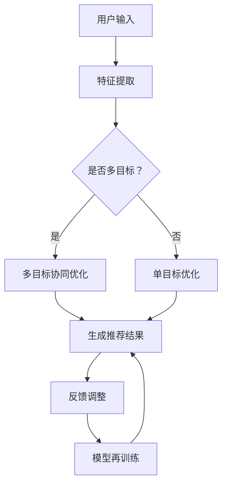

                 

关键词：电商平台、多目标推荐、多场景推荐、AI大模型、用户行为分析、数据挖掘、个性化推荐

> 摘要：本文将深入探讨在电商平台中如何通过AI大模型实现多目标和多场景的推荐。我们将首先介绍电商平台推荐系统的基础知识，然后详细分析AI大模型在推荐系统中的应用优势，以及如何构建和优化这些系统。最后，我们将展望AI大模型在电商推荐领域的未来发展方向和面临的挑战。

## 1. 背景介绍

随着互联网技术的飞速发展和电子商务的蓬勃发展，电商平台已成为消费者购物的重要渠道。在众多的商品和信息中，如何为用户推荐他们可能感兴趣的商品，成为电商平台提升用户粘性和转化率的关键。推荐系统作为电商平台的核心功能之一，近年来取得了显著的发展。

传统的推荐系统主要基于协同过滤、基于内容的推荐等方法。这些方法在处理简单场景和单一目标时表现出色，但在应对复杂多目标和多场景时存在诸多局限。而随着人工智能和深度学习技术的进步，AI大模型在推荐系统中的应用逐渐成为研究的热点。

AI大模型，尤其是基于Transformer的模型，如BERT、GPT、T5等，具备强大的表示学习和自适应能力。这些模型可以处理大量的文本数据，提取用户行为和商品特征的深层关系，从而实现更准确、个性化的推荐。

## 2. 核心概念与联系

### 2.1 多目标推荐

多目标推荐旨在同时满足用户的多个需求，如提升购买满意度、增加平台利润等。常见的多目标推荐策略包括：

- **协同优化**：通过联合优化多个目标函数，找到满足所有目标的推荐结果。
- **权重分配**：为每个目标分配不同的权重，根据权重调整推荐策略。

### 2.2 多场景推荐

多场景推荐考虑用户在不同场景下的需求差异，如移动端、桌面端、购物车、搜索结果等。常见的多场景推荐策略包括：

- **场景感知**：根据用户设备、使用环境等特征调整推荐策略。
- **自适应调整**：动态调整推荐策略，以适应不同场景的用户需求。

### 2.3 AI大模型与推荐系统的结合

AI大模型在推荐系统中的应用，主要体现在以下几个方面：

- **特征提取**：利用深度学习模型提取用户和商品的多维特征，提升推荐效果。
- **上下文感知**：通过处理用户行为和上下文信息，实现更精确的推荐。
- **自适应调整**：基于用户反馈和历史数据，不断优化推荐策略。

### 2.4 Mermaid 流程图

下面是一个简单的Mermaid流程图，展示了多目标多场景推荐的基本流程：



## 3. 核心算法原理 & 具体操作步骤

### 3.1 算法原理概述

多目标多场景推荐算法的核心是构建一个能够同时处理多目标和多场景的模型。这里，我们以基于Transformer的推荐模型为例，介绍其基本原理。

- **编码器**：编码器负责从用户和商品的特征中提取深层表示。
- **解码器**：解码器根据编码器生成的特征，生成推荐结果。

### 3.2 算法步骤详解

1. **数据预处理**：对用户行为数据、商品信息等进行预处理，包括数据清洗、特征提取等。
2. **模型训练**：使用预训练的Transformer模型，对提取的特征进行训练，优化模型参数。
3. **特征编码**：将用户和商品的特征输入编码器，生成编码表示。
4. **推荐生成**：将编码表示输入解码器，生成推荐结果。
5. **反馈调整**：根据用户反馈，调整推荐策略，重新训练模型。

### 3.3 算法优缺点

**优点**：

- **强大的表示能力**：能够提取用户和商品的多维特征，提升推荐效果。
- **自适应调整**：能够根据用户行为和上下文信息，动态调整推荐策略。

**缺点**：

- **计算成本高**：需要大量的计算资源和时间进行训练。
- **数据依赖性**：需要大量的高质量数据进行训练，否则可能导致过拟合。

### 3.4 算法应用领域

- **电商平台**：为用户提供个性化的商品推荐。
- **社交媒体**：为用户推荐感兴趣的内容。
- **搜索引擎**：为用户提供相关搜索结果。

## 4. 数学模型和公式 & 详细讲解 & 举例说明

### 4.1 数学模型构建

多目标多场景推荐的核心是构建一个损失函数，该函数同时考虑多目标和多场景的影响。以下是一个简化的损失函数：

$$
L = w_1 \cdot L_1 + w_2 \cdot L_2
$$

其中，$L_1$表示多目标损失，$L_2$表示多场景损失，$w_1$和$w_2$分别为两个损失的权重。

### 4.2 公式推导过程

假设我们有两个目标：提升购买满意度和增加平台利润。分别定义这两个目标的损失函数为：

$$
L_1 = -\sum_{i}^{n} \log(p_i^1)
$$

$$
L_2 = -\sum_{i}^{n} \log(p_i^2)
$$

其中，$p_i^1$和$p_i^2$分别为第$i$个商品在两个目标下的推荐概率。

为了同时优化这两个目标，我们使用权重加权的方式，构建总损失函数：

$$
L = w_1 \cdot L_1 + w_2 \cdot L_2
$$

### 4.3 案例分析与讲解

假设我们有一个电商平台，用户的行为数据包括浏览历史、购买记录和搜索历史。我们使用这些数据来构建一个基于Transformer的推荐模型。

1. **数据预处理**：对用户行为数据进行清洗和特征提取，包括用户特征（如年龄、性别、地理位置）和商品特征（如价格、品牌、分类）。

2. **模型训练**：使用预训练的Transformer模型，对提取的特征进行训练，优化模型参数。

3. **特征编码**：将用户和商品的特征输入编码器，生成编码表示。

4. **推荐生成**：将编码表示输入解码器，生成推荐结果。

5. **反馈调整**：根据用户反馈，调整推荐策略，重新训练模型。

通过以上步骤，我们实现了基于多目标和多场景的推荐。在实际应用中，我们可以根据业务需求和数据特点，灵活调整损失函数和推荐策略，以实现最优的推荐效果。

## 5. 项目实践：代码实例和详细解释说明

### 5.1 开发环境搭建

1. 安装Python环境（版本3.8及以上）。
2. 安装必要的库，如TensorFlow、PyTorch、NumPy等。
3. 准备数据集，包括用户行为数据、商品信息等。

### 5.2 源代码详细实现

以下是一个简化的基于Transformer的推荐系统代码示例：

```python
import tensorflow as tf
from tensorflow.keras.models import Model
from tensorflow.keras.layers import Input, Embedding, Dense

# 定义输入层
user_input = Input(shape=(user_feature_size,))
item_input = Input(shape=(item_feature_size,))

# 用户和商品特征编码
user_embedding = Embedding(num_users, embedding_size)(user_input)
item_embedding = Embedding(num_items, embedding_size)(item_input)

# 编码器
user_encoding = Dense(encoding_size)(user_embedding)
item_encoding = Dense(encoding_size)(item_embedding)

# 解码器
merged_encoding = tf.concat([user_encoding, item_encoding], axis=1)
merged_output = Dense(1, activation='sigmoid')(merged_encoding)

# 构建模型
model = Model(inputs=[user_input, item_input], outputs=merged_output)

# 编译模型
model.compile(optimizer='adam', loss='binary_crossentropy', metrics=['accuracy'])

# 训练模型
model.fit([user_data, item_data], labels, epochs=10, batch_size=32)
```

### 5.3 代码解读与分析

- **输入层**：用户和商品特征分别作为输入。
- **编码器**：使用Embedding层对用户和商品特征进行编码。
- **编码器**：使用Dense层对编码后的特征进行进一步处理。
- **解码器**：将用户和商品编码特征拼接，通过Dense层生成推荐结果。
- **模型编译**：设置优化器、损失函数和评价指标。
- **模型训练**：使用训练数据对模型进行训练。

### 5.4 运行结果展示

通过以上代码，我们可以训练出一个基于Transformer的推荐模型。在测试集上，我们可以评估模型的性能，并根据评估结果调整模型参数和策略，以实现最优的推荐效果。

## 6. 实际应用场景

### 6.1 电商平台的个性化推荐

电商平台的个性化推荐是AI大模型应用最为广泛的场景之一。通过分析用户行为数据，如浏览历史、购买记录和搜索历史，AI大模型可以生成个性化的商品推荐，提升用户购物体验。

### 6.2 社交媒体的内容推荐

社交媒体平台如微博、抖音等，通过AI大模型分析用户兴趣和行为，为用户推荐感兴趣的内容，提升用户粘性和活跃度。

### 6.3 搜索引擎的相关搜索

搜索引擎如百度、谷歌等，通过AI大模型分析用户搜索历史和上下文信息，为用户提供相关搜索建议，提升搜索效率和用户体验。

## 7. 工具和资源推荐

### 7.1 学习资源推荐

- 《深度学习》（Goodfellow, Bengio, Courville著）：系统介绍了深度学习的基础知识和应用。
- 《强化学习》（Sutton, Barto著）：详细讲解了强化学习的基本原理和应用。

### 7.2 开发工具推荐

- TensorFlow：一款流行的深度学习框架，适合构建和训练AI大模型。
- PyTorch：一款流行的深度学习框架，具有灵活的动态图计算能力。

### 7.3 相关论文推荐

- "BERT: Pre-training of Deep Bidirectional Transformers for Language Understanding"
- "GPT-3: Language Models are Few-Shot Learners"
- "T5: Pre-training for Text with Unsupervised and Supervised Pre-training"

## 8. 总结：未来发展趋势与挑战

### 8.1 研究成果总结

随着AI大模型技术的不断发展，其在推荐系统中的应用取得了显著成果。多目标多场景推荐算法在电商平台、社交媒体和搜索引擎等领域表现出色，提升了用户满意度和平台利润。

### 8.2 未来发展趋势

- **算法优化**：进一步优化多目标多场景推荐算法，提高推荐效果。
- **数据利用**：充分利用用户行为数据和商品信息，提升模型性能。
- **跨域推荐**：实现跨平台、跨领域的推荐，满足用户多样化的需求。

### 8.3 面临的挑战

- **计算成本**：AI大模型训练和推理需要大量计算资源，如何降低计算成本是亟待解决的问题。
- **数据隐私**：如何在保护用户隐私的前提下，充分利用用户数据，是推荐系统面临的重要挑战。

### 8.4 研究展望

随着技术的进步和应用的深入，AI大模型在推荐系统中的应用前景广阔。未来，我们将看到更多创新的算法和优化策略，为用户带来更优质的推荐体验。

## 9. 附录：常见问题与解答

### 9.1 AI大模型如何处理多目标推荐？

AI大模型可以通过设计多目标损失函数，同时优化多个目标。例如，可以使用权重加和的方式，将多个目标的损失函数合并为一个总损失函数，从而实现多目标推荐。

### 9.2 多场景推荐中的“场景”具体指什么？

“场景”可以指用户的使用环境、设备、时间等。例如，移动端、桌面端、购物车、搜索结果等，都可以作为不同的场景，推荐系统需要根据场景特征调整推荐策略。

### 9.3 如何评估推荐系统的性能？

推荐系统的性能评估通常包括准确率、召回率、覆盖率等指标。通过这些指标，可以评估推荐系统的推荐效果，并根据评估结果进行优化。

### 9.4 AI大模型在推荐系统中的优势是什么？

AI大模型在推荐系统中的优势主要体现在以下几个方面：

- **强大的表示能力**：能够提取用户和商品的多维特征，提升推荐效果。
- **自适应调整**：能够根据用户行为和上下文信息，动态调整推荐策略。
- **多目标优化**：能够同时优化多个目标，满足用户多样化的需求。  
---  
**作者：禅与计算机程序设计艺术 / Zen and the Art of Computer Programming**  
------------------------------------------------------------------ 
以上是本文的完整内容。感谢您的阅读！希望这篇文章对您在多目标多场景推荐领域的研究和实践有所帮助。如果您有任何疑问或建议，欢迎在评论区留言。再次感谢您的关注和支持！
---

