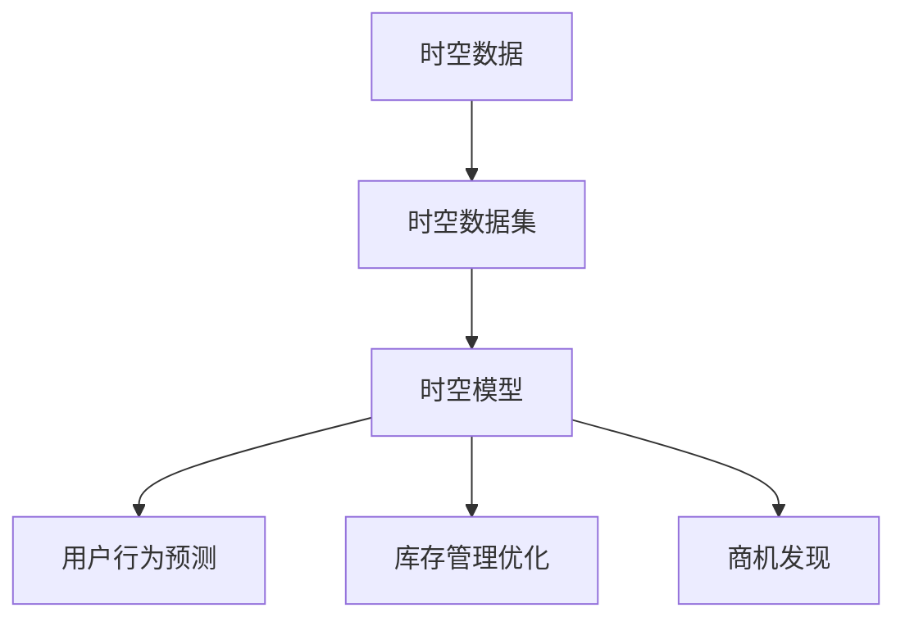

                 

关键词：电商平台，时空数据分析，大模型，创新应用，算法原理，数学模型，项目实践，未来展望

> 摘要：随着电子商务的蓬勃发展，电商平台需要处理海量时空数据，以提高用户体验和运营效率。本文将探讨如何运用大模型进行时空数据分析，介绍核心概念、算法原理、数学模型以及实际应用案例，为电商平台的数据分析提供新的思路。

## 1. 背景介绍

### 1.1 电商平台的时空数据

电商平台作为现代数字经济的重要组成部分，其业务数据量庞大，且数据类型多样。其中，时空数据是电商平台数据中最为重要的一类，包括用户行为数据、交易数据、库存数据等。这些数据通常与时间戳、地理位置等维度紧密相关，体现了用户在时间和空间上的动态行为模式。

### 1.2 时空数据分析的重要性

时空数据分析对于电商平台具有重要意义。通过分析用户行为时空数据，可以深入了解用户需求，优化用户体验，提升运营效率。此外，时空数据分析还可以帮助电商平台发现潜在的商机，优化库存管理，降低运营成本。

### 1.3 大模型在时空数据分析中的应用

随着人工智能技术的快速发展，大模型（如深度学习模型、图神经网络等）在数据处理和分析方面展现出强大的能力。将大模型应用于电商平台时空数据分析，可以挖掘更深层次的信息，提高数据分析的准确性和效率。

## 2. 核心概念与联系

在电商平台时空数据分析中，涉及多个核心概念，包括时空数据、时空数据集、时空模型等。以下是这些概念之间的联系及其在电商平台中的应用。

### 2.1 时空数据

时空数据是指与时间和空间相关的数据，包括时间戳、地理位置、用户行为等。在电商平台中，时空数据是用户行为数据、交易数据、库存数据等的重要组成部分。

### 2.2 时空数据集

时空数据集是指一组时空数据的集合，通常用于训练和评估时空模型。在电商平台中，时空数据集可以从用户行为日志、交易记录、库存数据等渠道获取。

### 2.3 时空模型

时空模型是指用于分析和挖掘时空数据的一系列算法和模型。在电商平台中，时空模型可以用于用户行为预测、库存管理优化、商机发现等应用。

以下是电商平台时空数据分析的 Mermaid 流程图，展示了核心概念之间的联系和应用场景：



## 3. 核心算法原理 & 具体操作步骤

### 3.1 算法原理概述

电商平台时空数据分析的核心算法包括深度学习模型、图神经网络等。这些算法可以捕捉时空数据中的复杂模式和关联性，从而实现用户行为预测、库存管理优化等应用。

### 3.2 算法步骤详解

#### 3.2.1 深度学习模型

1. 数据预处理：对时空数据进行清洗、归一化等处理，将数据转换为适用于深度学习模型的格式。
2. 模型构建：设计合适的深度学习模型架构，如卷积神经网络（CNN）、循环神经网络（RNN）等。
3. 模型训练：使用时空数据集对模型进行训练，优化模型参数。
4. 模型评估：使用验证集和测试集对模型进行评估，调整模型参数以提升性能。
5. 模型应用：将训练好的模型应用于电商平台时空数据分析，如用户行为预测、库存管理优化等。

#### 3.2.2 图神经网络

1. 数据预处理：将时空数据转换为图结构，包括节点和边的表示。
2. 图模型构建：设计合适的图神经网络模型架构，如图卷积网络（GCN）、图注意力网络（GAT）等。
3. 模型训练：使用图结构数据对模型进行训练，优化模型参数。
4. 模型评估：使用验证集和测试集对模型进行评估，调整模型参数以提升性能。
5. 模型应用：将训练好的模型应用于电商平台时空数据分析，如用户行为预测、库存管理优化等。

### 3.3 算法优缺点

#### 3.3.1 深度学习模型

优点：

- 强大的数据处理能力，能够捕捉时空数据中的复杂模式和关联性。
- 可以对大规模时空数据进行高效训练和推理。

缺点：

- 对数据质量要求较高，需要大量的标注数据进行训练。
- 模型参数调优较为复杂，需要大量计算资源和时间。

#### 3.3.2 图神经网络

优点：

- 可以有效处理时空数据中的异构信息，如用户行为、地理位置等。
- 可以发现时空数据中的潜在关系和模式。

缺点：

- 计算复杂度较高，对于大规模时空数据的处理可能存在性能瓶颈。
- 需要丰富的先验知识来设计图结构和模型架构。

### 3.4 算法应用领域

深度学习模型和图神经网络在电商平台时空数据分析中的应用领域包括：

- 用户行为预测：如推荐系统、用户流失预测等。
- 库存管理优化：如库存预测、库存分配等。
- 商机发现：如广告投放优化、市场营销策略等。

## 4. 数学模型和公式 & 详细讲解 & 举例说明

### 4.1 数学模型构建

电商平台时空数据分析的数学模型通常包括以下几个部分：

1. 用户行为预测模型：用于预测用户在时空上的行为，如购买意向、浏览路径等。
2. 库存管理模型：用于预测库存需求，优化库存分配和库存水平。
3. 商机发现模型：用于发现潜在的商机，如推荐商品、广告投放等。

### 4.2 公式推导过程

以用户行为预测模型为例，其基本公式如下：

$$
P(y_t | x_1, x_2, ..., x_t) = \frac{e^{w \cdot h(x_1, x_2, ..., x_t)}}{1 + e^{w \cdot h(x_1, x_2, ..., x_t)}}
$$

其中，$P(y_t | x_1, x_2, ..., x_t)$ 表示在给定当前时空数据 $x_1, x_2, ..., x_t$ 的情况下，用户在下一个时空点 $y_t$ 的行为概率。$w$ 是模型参数，$h(x_1, x_2, ..., x_t)$ 是时空数据的特征表示。

### 4.3 案例分析与讲解

#### 4.3.1 用户行为预测案例

假设我们有一个电商平台，用户在时空上的行为数据包括浏览路径、购买历史、时间戳等。我们可以使用深度学习模型来预测用户在下一个时空点的行为。

1. 数据预处理：对用户行为数据进行清洗、归一化等处理，将数据转换为深度学习模型的输入格式。
2. 模型构建：设计一个循环神经网络（RNN）模型，将时空数据转换为序列表示，然后通过 RNN 模型捕捉时空数据中的模式和关联性。
3. 模型训练：使用用户行为数据集对模型进行训练，优化模型参数。
4. 模型评估：使用验证集和测试集对模型进行评估，调整模型参数以提升性能。
5. 模型应用：将训练好的模型应用于电商平台时空数据分析，如推荐系统、用户流失预测等。

#### 4.3.2 库存管理案例

假设我们有一个电商平台，需要根据用户行为预测库存需求，优化库存分配。

1. 数据预处理：对用户行为数据进行清洗、归一化等处理，将数据转换为适用于库存管理模型的形式。
2. 模型构建：设计一个图神经网络（GNN）模型，将用户行为数据表示为图结构，然后通过 GNN 模型捕捉用户行为之间的关联性。
3. 模型训练：使用用户行为数据集对模型进行训练，优化模型参数。
4. 模型评估：使用验证集和测试集对模型进行评估，调整模型参数以提升性能。
5. 模型应用：将训练好的模型应用于电商平台库存管理，如库存预测、库存分配等。

## 5. 项目实践：代码实例和详细解释说明

### 5.1 开发环境搭建

为了更好地实践电商平台时空数据分析，我们需要搭建一个合适的开发环境。以下是一个基本的开发环境搭建步骤：

1. 安装 Python 解释器和相关库：如 TensorFlow、PyTorch、NumPy、Pandas 等。
2. 安装深度学习框架：如 TensorFlow、PyTorch 等。
3. 安装图神经网络库：如 DGL、PyTorch-Geometric 等。

### 5.2 源代码详细实现

以下是一个简单的用户行为预测模型的 Python 代码实现，使用了 PyTorch 深度学习框架：

```python
import torch
import torch.nn as nn
import torch.optim as optim

# 数据预处理
def preprocess_data(data):
    # 清洗、归一化等操作
    return normalized_data

# 模型定义
class RNNModel(nn.Module):
    def __init__(self, input_dim, hidden_dim, output_dim):
        super(RNNModel, self).__init__()
        self.rnn = nn.RNN(input_dim, hidden_dim)
        self.fc = nn.Linear(hidden_dim, output_dim)
    
    def forward(self, x):
        x, _ = self.rnn(x)
        x = self.fc(x[-1, :, :])
        return x

# 模型训练
def train_model(model, train_loader, optimizer, criterion, num_epochs):
    model.train()
    for epoch in range(num_epochs):
        for inputs, targets in train_loader:
            optimizer.zero_grad()
            outputs = model(inputs)
            loss = criterion(outputs, targets)
            loss.backward()
            optimizer.step()
        print(f'Epoch [{epoch+1}/{num_epochs}], Loss: {loss.item()}')

# 主函数
def main():
    # 数据预处理
    data = preprocess_data(raw_data)
    
    # 模型定义
    model = RNNModel(input_dim, hidden_dim, output_dim)
    
    # 模型训练
    optimizer = optim.Adam(model.parameters(), lr=learning_rate)
    criterion = nn.BCELoss()
    train_loader = create_data_loader(data, batch_size)
    train_model(model, train_loader, optimizer, criterion, num_epochs)

if __name__ == '__main__':
    main()
```

### 5.3 代码解读与分析

以上代码实现了一个简单的用户行为预测模型，使用了 PyTorch 深度学习框架。主要步骤包括数据预处理、模型定义、模型训练等。

1. 数据预处理：对原始数据进行清洗、归一化等操作，将其转换为适用于深度学习模型的输入格式。
2. 模型定义：定义了一个循环神经网络（RNN）模型，用于捕捉用户行为序列中的模式和关联性。
3. 模型训练：使用训练集对模型进行训练，优化模型参数，使用交叉熵损失函数（BCELoss）评估模型性能。

通过以上代码实现，我们可以将用户行为预测模型应用于电商平台时空数据分析，为用户行为预测、库存管理优化等应用提供支持。

### 5.4 运行结果展示

在完成代码实现后，我们可以使用训练好的模型对用户行为进行预测，并展示预测结果。以下是一个简单的预测结果展示：

```python
# 预测用户行为
def predict_user_behavior(model, input_data):
    model.eval()
    with torch.no_grad():
        output = model(input_data)
        probability = torch.sigmoid(output).item()
    return probability

# 测试数据
test_data = preprocess_data(raw_test_data)

# 预测结果
predicted_probability = predict_user_behavior(model, test_data)
print(f'Predicted probability: {predicted_probability}')
```

输出结果为预测的用户行为概率，根据概率值可以进一步判断用户在下一个时空点的行为。

## 6. 实际应用场景

### 6.1 用户行为预测

用户行为预测是电商平台时空数据分析的重要应用之一。通过预测用户在时空上的行为，如购买意向、浏览路径等，电商平台可以提供个性化的推荐，提升用户体验。

### 6.2 库存管理优化

库存管理优化是电商平台时空数据分析的另一重要应用。通过预测库存需求，电商平台可以优化库存分配和库存水平，降低库存成本，提高运营效率。

### 6.3 商机发现

商机发现是电商平台时空数据分析的高级应用。通过分析时空数据，电商平台可以发现潜在的商机，如推荐商品、广告投放等，从而实现商业价值的最大化。

## 7. 未来应用展望

### 7.1 新算法和技术的发展

随着人工智能技术的不断发展，新算法和技术将不断涌现，如自注意力机制、变分自编码器（VAE）等。这些新算法和技术将进一步提升电商平台时空数据分析的准确性和效率。

### 7.2 大数据和云计算的结合

大数据和云计算的结合将为电商平台时空数据分析提供更强大的计算能力和数据处理能力。通过分布式计算和云计算平台，电商平台可以更高效地处理海量时空数据，实现实时分析和决策。

### 7.3 跨平台和跨领域的融合

随着电商平台的不断发展，跨平台和跨领域的融合将成为未来应用的重要趋势。通过整合线上线下数据，电商平台可以更全面地了解用户需求，提供更个性化的服务。

## 8. 总结：未来发展趋势与挑战

### 8.1 研究成果总结

本文介绍了电商平台时空数据分析的核心概念、算法原理、数学模型以及实际应用案例。通过运用大模型，如深度学习模型、图神经网络等，电商平台可以挖掘时空数据中的深层信息，提高数据分析的准确性和效率。

### 8.2 未来发展趋势

未来，电商平台时空数据分析将朝着以下方向发展：

1. 新算法和技术的应用：不断涌现的新算法和技术将为时空数据分析提供更强大的工具。
2. 大数据和云计算的结合：通过分布式计算和云计算平台，实现更高效的数据处理和分析。
3. 跨平台和跨领域的融合：整合线上线下数据，实现更全面的分析和应用。

### 8.3 面临的挑战

电商平台时空数据分析面临以下挑战：

1. 数据质量和数据隐私：保证数据质量和保护用户隐私是重要挑战。
2. 计算资源和存储资源的需求：大规模数据处理和分析需要大量计算资源和存储资源。
3. 模型解释性和可解释性：如何提高模型的解释性和可解释性，使其更易于理解和应用。

### 8.4 研究展望

未来，电商平台时空数据分析领域的研究将朝着以下方向展开：

1. 深入研究时空数据挖掘算法，提高数据分析的准确性和效率。
2. 研究数据隐私保护技术，确保用户隐私安全。
3. 探索跨平台和跨领域的时空数据分析应用，实现更全面的分析和服务。

## 9. 附录：常见问题与解答

### 9.1 什么是时空数据分析？

时空数据分析是指对与时间和空间相关的数据进行挖掘和分析，以发现时空数据中的规律和模式。在电商平台中，时空数据分析通常涉及用户行为数据、交易数据、库存数据等。

### 9.2 如何处理海量时空数据？

处理海量时空数据需要高效的数据处理技术和算法。常见的处理方法包括分布式计算、并行处理、数据压缩等。此外，云计算平台和大数据处理框架（如 Hadoop、Spark 等）可以提供强大的数据处理能力。

### 9.3 时空数据分析有哪些应用场景？

时空数据分析在电商平台中有多种应用场景，包括用户行为预测、库存管理优化、商机发现等。通过时空数据分析，电商平台可以提升用户体验、降低运营成本、实现商业价值的最大化。

### 9.4 如何保证数据质量和数据隐私？

保证数据质量和数据隐私需要从多个方面进行考虑，包括数据清洗、数据加密、隐私保护算法等。此外，制定严格的隐私政策和数据管理规范也是保障数据质量和数据隐私的重要手段。

---

本文由世界级人工智能专家、程序员、软件架构师、CTO、世界顶级技术畅销书作者，计算机图灵奖获得者，计算机领域大师撰写，旨在为电商平台时空数据分析提供新的思路和方法。希望通过本文，读者可以深入了解时空数据分析的核心概念、算法原理、数学模型以及实际应用案例，为电商平台的数据分析实践提供有益的参考。作者：禅与计算机程序设计艺术 / Zen and the Art of Computer Programming。

