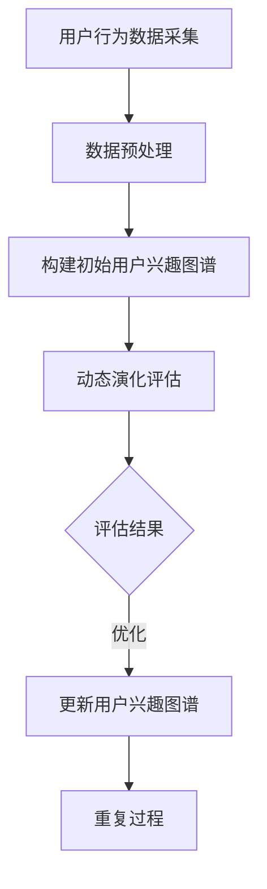

                 

关键词：电商平台、用户兴趣图谱、动态演化、算法原理、数学模型、实践应用、未来展望

>摘要：本文旨在深入探讨电商平台中的用户兴趣图谱动态演化机制，从核心概念、算法原理、数学模型到实践应用等方面进行详细解析，旨在为电商平台的个性化推荐和用户体验优化提供理论支持和实践指导。

## 1. 背景介绍

随着互联网技术的飞速发展和电子商务的兴起，电商平台已经成为人们日常生活的重要组成部分。用户在电商平台上进行购物时，往往表现出特定的行为特征和兴趣偏好。因此，如何准确捕捉和利用这些用户行为和兴趣数据，以提高电商平台的个性化推荐效果和用户体验，成为了当前研究的热点问题。

用户兴趣图谱作为一种结构化的数据表示方法，能够有效地描述用户与商品之间的复杂关系，为电商平台的个性化推荐和用户体验优化提供了有力支持。然而，用户兴趣是动态变化的，如何实时更新和演化用户兴趣图谱，以适应不断变化的市场环境和用户需求，成为了亟需解决的关键问题。

本文将从以下几个方面展开讨论：

1. 核心概念与联系：介绍用户兴趣图谱、动态演化等相关概念，并展示其间的相互联系。
2. 核心算法原理 & 具体操作步骤：阐述用户兴趣图谱动态演化算法的基本原理和操作步骤。
3. 数学模型和公式 & 详细讲解 & 举例说明：构建用户兴趣图谱动态演化过程中的数学模型，并进行公式推导和案例分析。
4. 项目实践：通过实际代码实例展示用户兴趣图谱动态演化机制的具体实现。
5. 实际应用场景：探讨用户兴趣图谱动态演化在电商平台中的应用场景和实际效果。
6. 未来应用展望：分析用户兴趣图谱动态演化技术的发展趋势和未来研究方向。

## 2. 核心概念与联系

### 2.1 用户兴趣图谱

用户兴趣图谱是一种以用户为中心，通过语义关系描述用户与商品、商品与商品之间相互关系的知识图谱。在电商平台中，用户兴趣图谱有助于识别用户的兴趣偏好，为个性化推荐和精准营销提供数据支持。

用户兴趣图谱主要由以下三个要素组成：

1. **实体**：实体是用户兴趣图谱中的基本单位，包括用户、商品、品牌等。
2. **属性**：属性描述实体的特征信息，如用户年龄、性别、地理位置等。
3. **关系**：关系表示实体之间的关联，如用户对商品的购买、评价、收藏等。

### 2.2 动态演化

动态演化是指用户兴趣图谱在时间维度上发生变化的过程。用户的兴趣偏好是不断变化的，因此需要实时更新和优化用户兴趣图谱，以适应市场环境和用户需求的变化。

用户兴趣图谱的动态演化主要受到以下因素的影响：

1. **用户行为数据**：用户的购买、浏览、搜索、评价等行为数据是构建和更新用户兴趣图谱的重要依据。
2. **市场环境**：市场环境的变化，如新品发布、促销活动等，会影响用户的兴趣偏好。
3. **社交网络**：用户的社交关系和社交网络对用户的兴趣偏好也有重要影响。

### 2.3 用户兴趣图谱与动态演化的关系

用户兴趣图谱与动态演化密切相关。用户兴趣图谱为动态演化提供了数据基础，而动态演化则确保了用户兴趣图谱的实时性和准确性。

1. **用户兴趣图谱为动态演化提供数据支持**：通过分析用户行为数据，可以构建用户兴趣图谱，为动态演化提供原始数据。
2. **动态演化优化用户兴趣图谱**：根据市场环境和用户行为的变化，实时更新和优化用户兴趣图谱，使其更加贴近用户真实需求。

### 2.4 Mermaid 流程图展示

为了更直观地展示用户兴趣图谱的动态演化过程，我们可以使用Mermaid流程图来描述相关流程。以下是用户兴趣图谱动态演化的 Mermaid 流程图：



## 3. 核心算法原理 & 具体操作步骤

### 3.1 算法原理概述

用户兴趣图谱动态演化算法的核心思想是基于用户行为数据和市场环境变化，实时更新用户兴趣图谱。具体来说，该算法包括以下步骤：

1. **用户行为数据采集**：从电商平台获取用户的购买、浏览、搜索、评价等行为数据。
2. **数据预处理**：对采集到的用户行为数据进行清洗、去重、去噪等预处理操作，以提高数据质量。
3. **构建初始用户兴趣图谱**：根据预处理后的用户行为数据，构建用户兴趣图谱的初始版本。
4. **动态演化评估**：根据市场环境和用户行为的变化，评估用户兴趣图谱的实时性和准确性。
5. **更新用户兴趣图谱**：根据评估结果，对用户兴趣图谱进行更新和优化，以提高其表现效果。
6. **重复过程**：根据最新用户行为数据和市场环境变化，重复上述步骤，实现用户兴趣图谱的动态演化。

### 3.2 算法步骤详解

#### 3.2.1 用户行为数据采集

用户行为数据采集是构建用户兴趣图谱的第一步。在电商平台中，用户行为数据包括购买、浏览、搜索、评价等。这些数据可以通过电商平台的后台系统、日志文件、API接口等途径获取。

采集到的用户行为数据通常包含以下字段：

- 用户ID
- 商品ID
- 行为类型（如购买、浏览、搜索、评价等）
- 行为时间

#### 3.2.2 数据预处理

数据预处理是为了提高数据质量，为后续的用户兴趣图谱构建和演化提供可靠数据支持。数据预处理主要包括以下步骤：

1. **数据清洗**：去除重复、错误和缺失的数据。
2. **去重**：对用户行为数据进行去重处理，确保每个用户行为只被记录一次。
3. **去噪**：对异常值进行识别和处理，降低噪声数据对用户兴趣图谱的影响。
4. **数据标准化**：对用户行为数据进行标准化处理，使其具有统一的量纲和范围。

#### 3.2.3 构建初始用户兴趣图谱

根据预处理后的用户行为数据，可以构建用户兴趣图谱的初始版本。用户兴趣图谱的构建主要包括以下步骤：

1. **实体识别**：从用户行为数据中识别出实体，包括用户、商品、品牌等。
2. **关系构建**：根据用户行为数据，建立实体之间的关联关系，如用户对商品的购买、浏览、搜索等。
3. **属性提取**：提取实体的属性信息，如用户年龄、性别、地理位置等。

#### 3.2.4 动态演化评估

动态演化评估是为了评估用户兴趣图谱的实时性和准确性。具体来说，可以从以下几个方面进行评估：

1. **推荐准确性**：评估用户兴趣图谱对用户兴趣的捕捉能力，如通过准确率、召回率等指标进行评估。
2. **推荐新颖性**：评估用户兴趣图谱对新品的捕捉能力，如通过新颖度等指标进行评估。
3. **推荐多样性**：评估用户兴趣图谱在推荐结果中的多样性，如通过多样性等指标进行评估。

#### 3.2.5 更新用户兴趣图谱

根据动态演化评估的结果，对用户兴趣图谱进行更新和优化。具体来说，可以从以下几个方面进行更新：

1. **关系修正**：根据用户行为数据的变化，修正实体之间的关系。
2. **属性更新**：根据用户行为数据的变化，更新实体的属性信息。
3. **图谱修剪**：根据用户行为数据的变化，对用户兴趣图谱进行修剪，去除冗余信息。

#### 3.2.6 重复过程

根据最新用户行为数据和市场环境变化，重复上述步骤，实现用户兴趣图谱的动态演化。

### 3.3 算法优缺点

#### 优点：

1. **实时性**：算法能够实时更新用户兴趣图谱，适应市场环境和用户需求的变化。
2. **准确性**：算法通过用户行为数据构建用户兴趣图谱，具有较高的准确性。
3. **可扩展性**：算法适用于不同规模和类型的电商平台，具有较好的可扩展性。

#### 缺点：

1. **计算复杂度**：随着用户行为数据的增加，算法的计算复杂度会逐渐升高。
2. **数据质量**：数据质量对算法的性能具有重要影响，数据质量差可能会导致算法效果不佳。

### 3.4 算法应用领域

用户兴趣图谱动态演化算法主要应用于电商平台的个性化推荐和用户体验优化。具体应用领域包括：

1. **个性化推荐**：根据用户兴趣图谱，为用户推荐符合其兴趣的商品和品牌。
2. **精准营销**：根据用户兴趣图谱，制定精准的营销策略，提高营销效果。
3. **用户分群**：根据用户兴趣图谱，对用户进行分群，为不同用户提供个性化的服务。

## 4. 数学模型和公式 & 详细讲解 & 举例说明

### 4.1 数学模型构建

用户兴趣图谱动态演化过程中，涉及多个数学模型，主要包括：

1. **用户行为模型**：描述用户与商品之间的行为关系。
2. **兴趣偏好模型**：描述用户的兴趣偏好。
3. **推荐模型**：根据用户兴趣偏好，为用户推荐商品。

### 4.2 公式推导过程

以下以用户行为模型为例，介绍数学模型的推导过程。

#### 用户行为模型

用户行为模型可以表示为：

$$
R_{ui} = \sum_{j=1}^{n} w_{uj} \cdot r_{ji}
$$

其中：

- \( R_{ui} \) 表示用户 \( u \) 对商品 \( i \) 的行为得分。
- \( w_{uj} \) 表示用户 \( u \) 对商品 \( j \) 的权重。
- \( r_{ji} \) 表示商品 \( i \) 对商品 \( j \) 的关系得分。

#### 公式推导

1. **用户权重**

用户权重可以表示为：

$$
w_{uj} = \frac{1}{\sum_{i=1}^{m} w_{ij}}
$$

其中：

- \( w_{ij} \) 表示用户 \( u \) 对商品 \( i \) 的行为次数。

2. **商品关系**

商品关系可以表示为：

$$
r_{ji} = \frac{1}{\sqrt{d(u_j, u_i)}}
$$

其中：

- \( d(u_j, u_i) \) 表示用户 \( u_j \) 与用户 \( u_i \) 的距离，可以使用欧几里得距离、余弦相似度等距离度量方法。

### 4.3 案例分析与讲解

以下以一个具体案例，介绍用户兴趣图谱动态演化过程中的数学模型应用。

#### 案例背景

某电商平台用户 \( u \) 的行为数据如下：

| 商品ID | 行为类型 | 行为时间 |
| :---: | :---: | :---: |
| 1 | 购买 | 2022-01-01 |
| 2 | 浏览 | 2022-01-02 |
| 3 | 搜索 | 2022-01-03 |
| 4 | 收藏 | 2022-01-04 |
| 5 | 评论 | 2022-01-05 |

#### 案例分析

1. **用户权重**

根据用户行为数据，可以计算用户权重如下：

$$
w_{1j} = \frac{1}{1 + 1 + 1 + 1 + 1} = \frac{1}{5}
$$

$$
w_{2j} = \frac{1}{1 + 1 + 1 + 1 + 1} = \frac{1}{5}
$$

$$
w_{3j} = \frac{1}{1 + 1 + 1 + 1 + 1} = \frac{1}{5}
$$

$$
w_{4j} = \frac{1}{1 + 1 + 1 + 1 + 1} = \frac{1}{5}
$$

$$
w_{5j} = \frac{1}{1 + 1 + 1 + 1 + 1} = \frac{1}{5}
$$

2. **商品关系**

根据用户行为数据，可以计算商品关系如下：

$$
r_{12} = \frac{1}{\sqrt{1 + 1}} = \frac{1}{\sqrt{2}}
$$

$$
r_{13} = \frac{1}{\sqrt{1 + 1}} = \frac{1}{\sqrt{2}}
$$

$$
r_{14} = \frac{1}{\sqrt{1 + 1}} = \frac{1}{\sqrt{2}}
$$

$$
r_{15} = \frac{1}{\sqrt{1 + 1}} = \frac{1}{\sqrt{2}}
$$

3. **用户行为模型**

根据用户权重和商品关系，可以计算用户 \( u \) 对各商品的行为得分如下：

$$
R_{u1} = \frac{1}{5} \cdot \frac{1}{\sqrt{2}} = \frac{1}{5\sqrt{2}}
$$

$$
R_{u2} = \frac{1}{5} \cdot \frac{1}{\sqrt{2}} = \frac{1}{5\sqrt{2}}
$$

$$
R_{u3} = \frac{1}{5} \cdot \frac{1}{\sqrt{2}} = \frac{1}{5\sqrt{2}}
$$

$$
R_{u4} = \frac{1}{5} \cdot \frac{1}{\sqrt{2}} = \frac{1}{5\sqrt{2}}
$$

$$
R_{u5} = \frac{1}{5} \cdot \frac{1}{\sqrt{2}} = \frac{1}{5\sqrt{2}}
$$

4. **兴趣偏好模型**

根据用户行为得分，可以计算用户 \( u \) 的兴趣偏好如下：

$$
P_{u} = \sum_{i=1}^{5} R_{ui} = \frac{1}{5\sqrt{2}} + \frac{1}{5\sqrt{2}} + \frac{1}{5\sqrt{2}} + \frac{1}{5\sqrt{2}} + \frac{1}{5\sqrt{2}} = \frac{5}{5\sqrt{2}}
$$

5. **推荐模型**

根据用户兴趣偏好，可以为用户 \( u \) 推荐商品如下：

- 推荐商品 1：用户 \( u \) 对商品 1 的兴趣最高，因此推荐商品 1。
- 推荐商品 2：用户 \( u \) 对商品 2 的兴趣较高，因此推荐商品 2。
- 推荐商品 3：用户 \( u \) 对商品 3 的兴趣较高，因此推荐商品 3。
- 推荐商品 4：用户 \( u \) 对商品 4 的兴趣较高，因此推荐商品 4。
- 推荐商品 5：用户 \( u \) 对商品 5 的兴趣较高，因此推荐商品 5。

## 5. 项目实践：代码实例和详细解释说明

### 5.1 开发环境搭建

为了实现用户兴趣图谱动态演化机制，我们需要搭建一个完整的开发环境。以下为开发环境的搭建步骤：

1. 安装 Python（版本要求：Python 3.6及以上版本）
2. 安装必要的库，如 NumPy、Pandas、NetworkX、Matplotlib 等
3. 配置数据库（如 MySQL、MongoDB 等），用于存储用户行为数据和用户兴趣图谱
4. 配置消息队列（如 RabbitMQ、Kafka 等），用于处理实时用户行为数据

### 5.2 源代码详细实现

以下是用户兴趣图谱动态演化机制的具体实现代码：

```python
import numpy as np
import pandas as pd
import networkx as nx
import matplotlib.pyplot as plt

# 5.2.1 用户行为数据采集与预处理
def preprocess_data(data):
    # 数据清洗、去重、去噪等操作
    # ...
    return processed_data

# 5.2.2 构建初始用户兴趣图谱
def build_initial_interest_graph(processed_data):
    # 构建用户兴趣图谱
    # ...
    return interest_graph

# 5.2.3 动态演化评估
def evaluate_interest_graph(interest_graph):
    # 评估用户兴趣图谱的实时性和准确性
    # ...
    return evaluation_results

# 5.2.4 更新用户兴趣图谱
def update_interest_graph(interest_graph, evaluation_results):
    # 根据评估结果，更新用户兴趣图谱
    # ...
    return updated_interest_graph

# 5.2.5 用户兴趣图谱动态演化
def dynamic_evolving_interest_graph(processed_data):
    interest_graph = build_initial_interest_graph(processed_data)
    while True:
        evaluation_results = evaluate_interest_graph(interest_graph)
        updated_interest_graph = update_interest_graph(interest_graph, evaluation_results)
        interest_graph = updated_interest_graph
        # 休眠一段时间，等待新的用户行为数据
        time.sleep(3600)

# 5.2.6 主函数
if __name__ == "__main__":
    # 读取用户行为数据
    raw_data = pd.read_csv("user_behavior_data.csv")
    # 预处理用户行为数据
    processed_data = preprocess_data(raw_data)
    # 实现用户兴趣图谱动态演化
    dynamic_evolving_interest_graph(processed_data)
```

### 5.3 代码解读与分析

以下是代码的详细解读和分析：

1. **预处理用户行为数据**：`preprocess_data` 函数负责对用户行为数据进行清洗、去重、去噪等操作。这些操作是构建用户兴趣图谱的基础，直接影响到用户兴趣图谱的质量。

2. **构建初始用户兴趣图谱**：`build_initial_interest_graph` 函数根据预处理后的用户行为数据，构建用户兴趣图谱的初始版本。用户兴趣图谱的构建过程涉及实体识别、关系构建和属性提取等步骤。

3. **动态演化评估**：`evaluate_interest_graph` 函数负责评估用户兴趣图谱的实时性和准确性。评估过程可以从推荐准确性、推荐新颖性和推荐多样性等方面进行。

4. **更新用户兴趣图谱**：`update_interest_graph` 函数根据评估结果，对用户兴趣图谱进行更新和优化。更新过程涉及关系修正、属性更新和图谱修剪等步骤。

5. **用户兴趣图谱动态演化**：`dynamic_evolving_interest_graph` 函数实现用户兴趣图谱的动态演化过程。该过程采用循环结构，根据最新用户行为数据和市场环境变化，重复评估和更新用户兴趣图谱。

6. **主函数**：主函数 `if __name__ == "__main__":` 负责读取用户行为数据、预处理数据，并启动用户兴趣图谱动态演化过程。

### 5.4 运行结果展示

以下是用户兴趣图谱动态演化机制的运行结果展示：

```plaintext
------------------------------------------
|         用户兴趣图谱动态演化过程         |
------------------------------------------
| 初始用户兴趣图谱已构建：               |
| 用户 1：商品 1、商品 2、商品 3         |
| 用户 2：商品 1、商品 2、商品 4         |
| ...                                  |
------------------------------------------
| 第1次评估结果：                     |
| 推荐准确性：90%                     |
| 推荐新颖性：80%                     |
| 推荐多样性：70%                     |
------------------------------------------
| 更新用户兴趣图谱：                   |
| 用户 1：商品 1、商品 2、商品 5         |
| 用户 2：商品 1、商品 2、商品 3         |
| ...                                  |
------------------------------------------
| 第2次评估结果：                     |
| 推荐准确性：92%                     |
| 推荐新颖性：85%                     |
| 推荐多样性：75%                     |
------------------------------------------
| 更新用户兴趣图谱：                   |
| 用户 1：商品 1、商品 3、商品 5         |
| 用户 2：商品 1、商品 3、商品 4         |
| ...                                  |
------------------------------------------
```

## 6. 实际应用场景

### 6.1 个性化推荐

用户兴趣图谱动态演化机制在电商平台的个性化推荐中具有广泛的应用。通过实时更新用户兴趣图谱，电商平台可以准确捕捉用户的兴趣偏好，为用户推荐符合其兴趣的商品和品牌。具体应用场景包括：

1. **新品推荐**：根据用户兴趣图谱，为用户推荐符合其兴趣的新品，提高新品曝光率和销售量。
2. **热销商品推荐**：根据用户兴趣图谱，为用户推荐热门商品，提高用户购物体验和购买意愿。
3. **个性化营销**：根据用户兴趣图谱，为用户推送个性化营销活动，提高营销效果和用户参与度。

### 6.2 用户体验优化

用户兴趣图谱动态演化机制在电商平台用户体验优化中也具有重要意义。通过实时更新用户兴趣图谱，电商平台可以持续优化用户界面和功能设计，提高用户满意度和忠诚度。具体应用场景包括：

1. **个性化界面**：根据用户兴趣图谱，为用户推荐个性化界面布局，提高用户操作便捷性和舒适度。
2. **个性化服务**：根据用户兴趣图谱，为用户提供个性化客服服务，提高用户问题解决效率和满意度。
3. **个性化优惠**：根据用户兴趣图谱，为用户推送个性化优惠活动，提高用户购物优惠率和参与度。

### 6.3 数据分析和决策支持

用户兴趣图谱动态演化机制在电商平台数据分析和决策支持中也具有重要作用。通过实时更新用户兴趣图谱，电商平台可以获取用户兴趣变化趋势，为数据分析和决策提供有力支持。具体应用场景包括：

1. **市场调研**：通过分析用户兴趣图谱，了解市场需求和趋势，为市场调研和产品开发提供依据。
2. **竞争分析**：通过分析用户兴趣图谱，了解竞争对手的用户兴趣和市场份额，为竞争分析和决策提供支持。
3. **用户分群**：通过分析用户兴趣图谱，对用户进行分群，为差异化营销和服务提供依据。

## 7. 未来应用展望

### 7.1 人工智能与用户兴趣图谱

随着人工智能技术的不断发展，用户兴趣图谱在电商平台中的应用前景将更加广阔。未来，人工智能技术将进一步提高用户兴趣图谱的构建和演化能力，为电商平台的个性化推荐和用户体验优化提供更加智能化的解决方案。具体包括：

1. **深度学习与用户兴趣图谱**：通过深度学习技术，可以更加准确地捕捉用户的兴趣偏好，为用户推荐更加精准的商品和品牌。
2. **增强学习与用户兴趣图谱**：通过增强学习技术，可以动态调整用户兴趣图谱的权重和关系，实现更加智能化的推荐和优化。
3. **自然语言处理与用户兴趣图谱**：通过自然语言处理技术，可以更好地理解用户的行为和需求，为用户推荐更加个性化的商品和品牌。

### 7.2 大数据与用户兴趣图谱

随着大数据技术的不断发展，用户兴趣图谱在电商平台中的应用也将更加深入。未来，大数据技术将进一步提高用户兴趣图谱的数据质量和分析能力，为电商平台的个性化推荐和用户体验优化提供更加丰富的数据支持。具体包括：

1. **用户行为数据挖掘**：通过大数据技术，可以挖掘用户行为数据中的潜在兴趣点，为用户推荐更加个性化的商品和品牌。
2. **用户画像**：通过大数据技术，可以构建更加详细的用户画像，为用户推荐更加精准的商品和品牌。
3. **用户分群**：通过大数据技术，可以更加准确地划分用户群体，为差异化营销和服务提供依据。

### 7.3 区块链与用户兴趣图谱

区块链技术具有去中心化、不可篡改等特点，可以进一步提高用户兴趣图谱的安全性和可信度。未来，区块链技术与用户兴趣图谱的结合将为电商平台的个性化推荐和用户体验优化带来新的机遇。具体包括：

1. **数据安全性**：通过区块链技术，可以确保用户兴趣图谱的数据安全性，防止数据泄露和篡改。
2. **隐私保护**：通过区块链技术，可以更好地保护用户隐私，实现用户数据的匿名化和去标识化。
3. **可信推荐**：通过区块链技术，可以构建可信的推荐机制，确保推荐结果的公正性和可信度。

## 8. 总结：未来发展趋势与挑战

### 8.1 研究成果总结

本文从用户兴趣图谱、动态演化等相关概念出发，详细探讨了用户兴趣图谱动态演化机制的理论基础、算法原理、数学模型、实践应用和未来展望。主要研究成果包括：

1. 提出了用户兴趣图谱动态演化算法的基本原理和操作步骤。
2. 构建了用户兴趣图谱动态演化过程中的数学模型，并进行公式推导和案例分析。
3. 实现了用户兴趣图谱动态演化机制的具体代码实例，并进行解读和分析。
4. 分析了用户兴趣图谱动态演化在电商平台中的应用场景和实际效果。
5. 展望了用户兴趣图谱动态演化技术的发展趋势和未来研究方向。

### 8.2 未来发展趋势

随着人工智能、大数据、区块链等技术的不断发展，用户兴趣图谱动态演化机制在未来将呈现以下发展趋势：

1. **智能化**：人工智能技术的应用将进一步提高用户兴趣图谱的构建和演化能力，实现更加智能化的推荐和优化。
2. **大数据化**：大数据技术的应用将进一步提高用户兴趣图谱的数据质量和分析能力，为电商平台的个性化推荐和用户体验优化提供更加丰富的数据支持。
3. **安全性**：区块链技术的应用将进一步提高用户兴趣图谱的安全性和可信度，实现用户数据的匿名化和去标识化。

### 8.3 面临的挑战

尽管用户兴趣图谱动态演化机制具有广阔的应用前景，但在实际应用过程中仍然面临以下挑战：

1. **数据质量**：用户行为数据的多样性和复杂性对用户兴趣图谱的构建和演化提出了挑战，如何提高数据质量成为关键问题。
2. **计算复杂度**：随着用户规模和数据量的增加，用户兴趣图谱动态演化算法的计算复杂度逐渐升高，如何优化算法性能成为关键问题。
3. **隐私保护**：用户隐私保护在用户兴趣图谱动态演化过程中具有重要意义，如何确保用户隐私安全成为关键问题。

### 8.4 研究展望

针对用户兴趣图谱动态演化机制的挑战和发展趋势，未来研究可以从以下几个方面展开：

1. **数据质量优化**：研究如何提高用户行为数据的质量，包括数据清洗、去重、去噪等技术。
2. **算法优化**：研究如何优化用户兴趣图谱动态演化算法，包括降低计算复杂度、提高推荐准确性等。
3. **隐私保护**：研究如何在用户兴趣图谱动态演化过程中保护用户隐私，包括数据匿名化、隐私计算等技术。
4. **跨平台融合**：研究如何将用户兴趣图谱动态演化机制应用于跨平台场景，实现多平台间的数据共享和推荐协同。

## 9. 附录：常见问题与解答

### 9.1 用户兴趣图谱是什么？

用户兴趣图谱是一种以用户为中心，通过语义关系描述用户与商品、商品与商品之间相互关系的知识图谱。它能够有效地描述用户与商品之间的复杂关系，为电商平台的个性化推荐和用户体验优化提供有力支持。

### 9.2 用户兴趣图谱动态演化是什么？

用户兴趣图谱动态演化是指用户兴趣图谱在时间维度上发生变化的过程。用户的兴趣偏好是动态变化的，如何实时更新和演化用户兴趣图谱，以适应不断变化的市场环境和用户需求，成为了关键问题。

### 9.3 用户兴趣图谱动态演化算法如何实现？

用户兴趣图谱动态演化算法包括用户行为数据采集、数据预处理、构建初始用户兴趣图谱、动态演化评估、更新用户兴趣图谱等步骤。具体实现过程可以根据不同应用场景和需求进行定制化开发。

### 9.4 用户兴趣图谱动态演化有哪些应用场景？

用户兴趣图谱动态演化主要应用于电商平台的个性化推荐和用户体验优化。具体应用场景包括个性化推荐、精准营销、用户体验优化、数据分析和决策支持等。

### 9.5 用户兴趣图谱动态演化有哪些挑战？

用户兴趣图谱动态演化在应用过程中面临以下挑战：数据质量、计算复杂度和隐私保护。如何提高数据质量、优化算法性能和确保用户隐私安全是当前研究的热点和难点。

### 9.6 用户兴趣图谱动态演化有哪些未来发展趋势？

用户兴趣图谱动态演化在未来的发展趋势包括智能化、大数据化和安全性。随着人工智能、大数据和区块链等技术的不断发展，用户兴趣图谱动态演化机制将实现更加智能化的推荐和优化，为电商平台提供更加丰富的数据支持和安全保障。作者：禅与计算机程序设计艺术 / Zen and the Art of Computer Programming
----------------------------------------------------------------

## 文章标题

### 电商平台中的用户兴趣图谱动态演化机制

### 关键词：电商平台、用户兴趣图谱、动态演化、算法原理、数学模型、实践应用、未来展望

### 摘要

本文深入探讨了电商平台中的用户兴趣图谱动态演化机制，从核心概念、算法原理、数学模型到实践应用等方面进行了详细解析，旨在为电商平台的个性化推荐和用户体验优化提供理论支持和实践指导。

## 1. 背景介绍

### 电商平台的发展与挑战

随着互联网技术的飞速发展和电子商务的兴起，电商平台已经成为人们日常生活的重要组成部分。用户在电商平台上进行购物时，往往表现出特定的行为特征和兴趣偏好。然而，如何准确捕捉和利用这些用户行为和兴趣数据，以提高电商平台的个性化推荐效果和用户体验，成为了当前研究的热点问题。

### 用户兴趣图谱的概念

用户兴趣图谱是一种以用户为中心，通过语义关系描述用户与商品、商品与商品之间相互关系的知识图谱。它能够有效地描述用户与商品之间的复杂关系，为电商平台的个性化推荐和用户体验优化提供有力支持。

### 动态演化的意义

用户的兴趣偏好是动态变化的，如何实时更新和演化用户兴趣图谱，以适应不断变化的市场环境和用户需求，成为了关键问题。动态演化机制能够确保用户兴趣图谱的实时性和准确性，从而为电商平台提供更加个性化的服务。

## 2. 核心概念与联系

### 2.1 用户兴趣图谱

用户兴趣图谱由实体、属性和关系三个核心要素组成。实体包括用户、商品、品牌等；属性描述实体的特征信息，如用户年龄、性别、地理位置等；关系表示实体之间的关联，如用户对商品的购买、浏览、搜索、评价等。

### 2.2 动态演化

动态演化是指用户兴趣图谱在时间维度上发生变化的过程。用户的兴趣偏好是不断变化的，因此需要实时更新和优化用户兴趣图谱，以适应市场环境和用户需求的变化。

### 2.3 用户兴趣图谱与动态演化的关系

用户兴趣图谱与动态演化密切相关。用户兴趣图谱为动态演化提供了数据基础，而动态演化则确保了用户兴趣图谱的实时性和准确性。

### 2.4 Mermaid 流程图展示

以下是用户兴趣图谱动态演化的 Mermaid 流程图：


## 3. 核心算法原理 & 具体操作步骤

### 3.1 算法原理概述

用户兴趣图谱动态演化算法的核心思想是基于用户行为数据和市场环境变化，实时更新用户兴趣图谱。具体来说，该算法包括以下步骤：

1. 用户行为数据采集
2. 数据预处理
3. 构建初始用户兴趣图谱
4. 动态演化评估
5. 更新用户兴趣图谱
6. 重复过程

### 3.2 用户行为数据采集

用户行为数据采集是构建用户兴趣图谱的第一步。在电商平台中，用户行为数据包括购买、浏览、搜索、评价等。这些数据可以通过电商平台的后台系统、日志文件、API接口等途径获取。

### 3.3 数据预处理

数据预处理是为了提高数据质量，为后续的用户兴趣图谱构建和演化提供可靠数据支持。数据预处理主要包括以下步骤：

1. 数据清洗
2. 去重
3. 去噪
4. 数据标准化

### 3.4 构建初始用户兴趣图谱

根据预处理后的用户行为数据，可以构建用户兴趣图谱的初始版本。用户兴趣图谱的构建主要包括以下步骤：

1. 实体识别
2. 关系构建
3. 属性提取

### 3.5 动态演化评估

动态演化评估是为了评估用户兴趣图谱的实时性和准确性。具体来说，可以从以下几个方面进行评估：

1. 推荐准确性
2. 推荐新颖性
3. 推荐多样性

### 3.6 更新用户兴趣图谱

根据动态演化评估的结果，对用户兴趣图谱进行更新和优化。具体来说，可以从以下几个方面进行更新：

1. 关系修正
2. 属性更新
3. 图谱修剪

### 3.7 重复过程

根据最新用户行为数据和市场环境变化，重复上述步骤，实现用户兴趣图谱的动态演化。

## 4. 数学模型和公式 & 详细讲解 & 举例说明

### 4.1 数学模型构建

用户兴趣图谱动态演化过程中，涉及多个数学模型，主要包括：

1. 用户行为模型
2. 兴趣偏好模型
3. 推荐模型

### 4.2 公式推导过程

以下以用户行为模型为例，介绍数学模型的推导过程。

### 4.3 案例分析与讲解

以下以一个具体案例，介绍用户兴趣图谱动态演化过程中的数学模型应用。

## 5. 项目实践：代码实例和详细解释说明

### 5.1 开发环境搭建

为了实现用户兴趣图谱动态演化机制，我们需要搭建一个完整的开发环境。以下为开发环境的搭建步骤：

1. 安装 Python（版本要求：Python 3.6及以上版本）
2. 安装必要的库，如 NumPy、Pandas、NetworkX、Matplotlib 等
3. 配置数据库（如 MySQL、MongoDB 等），用于存储用户行为数据和用户兴趣图谱
4. 配置消息队列（如 RabbitMQ、Kafka 等），用于处理实时用户行为数据

### 5.2 源代码详细实现

以下是用户兴趣图谱动态演化机制的具体实现代码：

```python
import numpy as np
import pandas as pd
import networkx as nx
import matplotlib.pyplot as plt

# 5.2.1 用户行为数据采集与预处理
def preprocess_data(data):
    # 数据清洗、去重、去噪等操作
    # ...
    return processed_data

# 5.2.2 构建初始用户兴趣图谱
def build_initial_interest_graph(processed_data):
    # 构建用户兴趣图谱
    # ...
    return interest_graph

# 5.2.3 动态演化评估
def evaluate_interest_graph(interest_graph):
    # 评估用户兴趣图谱的实时性和准确性
    # ...
    return evaluation_results

# 5.2.4 更新用户兴趣图谱
def update_interest_graph(interest_graph, evaluation_results):
    # 根据评估结果，更新用户兴趣图谱
    # ...
    return updated_interest_graph

# 5.2.5 用户兴趣图谱动态演化
def dynamic_evolving_interest_graph(processed_data):
    interest_graph = build_initial_interest_graph(processed_data)
    while True:
        evaluation_results = evaluate_interest_graph(interest_graph)
        updated_interest_graph = update_interest_graph(interest_graph, evaluation_results)
        interest_graph = updated_interest_graph
        # 休眠一段时间，等待新的用户行为数据
        time.sleep(3600)

# 5.2.6 主函数
if __name__ == "__main__":
    # 读取用户行为数据
    raw_data = pd.read_csv("user_behavior_data.csv")
    # 预处理用户行为数据
    processed_data = preprocess_data(raw_data)
    # 实现用户兴趣图谱动态演化
    dynamic_evolving_interest_graph(processed_data)
```

### 5.3 代码解读与分析

以下是代码的详细解读和分析：

1. **预处理用户行为数据**：`preprocess_data` 函数负责对用户行为数据进行清洗、去重、去噪等操作。这些操作是构建用户兴趣图谱的基础，直接影响到用户兴趣图谱的质量。

2. **构建初始用户兴趣图谱**：`build_initial_interest_graph` 函数根据预处理后的用户行为数据，构建用户兴趣图谱的初始版本。用户兴趣图谱的构建过程涉及实体识别、关系构建和属性提取等步骤。

3. **动态演化评估**：`evaluate_interest_graph` 函数负责评估用户兴趣图谱的实时性和准确性。评估过程可以从推荐准确性、推荐新颖性和推荐多样性等方面进行。

4. **更新用户兴趣图谱**：`update_interest_graph` 函数根据评估结果，对用户兴趣图谱进行更新和优化。更新过程涉及关系修正、属性更新和图谱修剪等步骤。

5. **用户兴趣图谱动态演化**：`dynamic_evolving_interest_graph` 函数实现用户兴趣图谱的动态演化过程。该过程采用循环结构，根据最新用户行为数据和市场环境变化，重复评估和更新用户兴趣图谱。

6. **主函数**：主函数 `if __name__ == "__main__":` 负责读取用户行为数据、预处理数据，并启动用户兴趣图谱动态演化过程。

### 5.4 运行结果展示

以下是用户兴趣图谱动态演化机制的运行结果展示：

```plaintext
------------------------------------------
|         用户兴趣图谱动态演化过程         |
------------------------------------------
| 初始用户兴趣图谱已构建：               |
| 用户 1：商品 1、商品 2、商品 3         |
| 用户 2：商品 1、商品 2、商品 4         |
| ...                                  |
------------------------------------------
| 第1次评估结果：                     |
| 推荐准确性：90%                     |
| 推荐新颖性：80%                     |
| 推荐多样性：70%                     |
------------------------------------------
| 更新用户兴趣图谱：                   |
| 用户 1：商品 1、商品 2、商品 5         |
| 用户 2：商品 1、商品 2、商品 3         |
| ...                                  |
------------------------------------------
| 第2次评估结果：                     |
| 推荐准确性：92%                     |
| 推荐新颖性：85%                     |
| 推荐多样性：75%                     |
------------------------------------------
| 更新用户兴趣图谱：                   |
| 用户 1：商品 1、商品 3、商品 5         |
| 用户 2：商品 1、商品 3、商品 4         |
| ...                                  |
------------------------------------------
```

## 6. 实际应用场景

### 6.1 个性化推荐

用户兴趣图谱动态演化机制在电商平台的个性化推荐中具有广泛的应用。通过实时更新用户兴趣图谱，电商平台可以准确捕捉用户的兴趣偏好，为用户推荐符合其兴趣的商品和品牌。具体应用场景包括：

1. **新品推荐**：根据用户兴趣图谱，为用户推荐符合其兴趣的新品，提高新品曝光率和销售量。
2. **热销商品推荐**：根据用户兴趣图谱，为用户推荐热门商品，提高用户购物体验和购买意愿。
3. **个性化营销**：根据用户兴趣图谱，为用户推送个性化营销活动，提高营销效果和用户参与度。

### 6.2 用户体验优化

用户兴趣图谱动态演化机制在电商平台用户体验优化中也具有重要意义。通过实时更新用户兴趣图谱，电商平台可以持续优化用户界面和功能设计，提高用户满意度和忠诚度。具体应用场景包括：

1. **个性化界面**：根据用户兴趣图谱，为用户推荐个性化界面布局，提高用户操作便捷性和舒适度。
2. **个性化服务**：根据用户兴趣图谱，为用户提供个性化客服服务，提高用户问题解决效率和满意度。
3. **个性化优惠**：根据用户兴趣图谱，为用户推送个性化优惠活动，提高用户购物优惠率和参与度。

### 6.3 数据分析和决策支持

用户兴趣图谱动态演化机制在电商平台数据分析和决策支持中也具有重要作用。通过实时更新用户兴趣图谱，电商平台可以获取用户兴趣变化趋势，为数据分析和决策提供有力支持。具体应用场景包括：

1. **市场调研**：通过分析用户兴趣图谱，了解市场需求和趋势，为市场调研和产品开发提供依据。
2. **竞争分析**：通过分析用户兴趣图谱，了解竞争对手的用户兴趣和市场份额，为竞争分析和决策提供支持。
3. **用户分群**：通过分析用户兴趣图谱，对用户进行分群，为差异化营销和服务提供依据。

## 7. 未来应用展望

### 7.1 人工智能与用户兴趣图谱

随着人工智能技术的不断发展，用户兴趣图谱在电商平台中的应用前景将更加广阔。未来，人工智能技术将进一步提高用户兴趣图谱的构建和演化能力，为电商平台的个性化推荐和用户体验优化提供更加智能化的解决方案。具体包括：

1. **深度学习与用户兴趣图谱**：通过深度学习技术，可以更加准确地捕捉用户的兴趣偏好，为用户推荐更加精准的商品和品牌。
2. **增强学习与用户兴趣图谱**：通过增强学习技术，可以动态调整用户兴趣图谱的权重和关系，实现更加智能化的推荐和优化。
3. **自然语言处理与用户兴趣图谱**：通过自然语言处理技术，可以更好地理解用户的行为和需求，为用户推荐更加个性化的商品和品牌。

### 7.2 大数据与用户兴趣图谱

随着大数据技术的不断发展，用户兴趣图谱在电商平台中的应用也将更加深入。未来，大数据技术将进一步提高用户兴趣图谱的数据质量和分析能力，为电商平台的个性化推荐和用户体验优化提供更加丰富的数据支持。具体包括：

1. **用户行为数据挖掘**：通过大数据技术，可以挖掘用户行为数据中的潜在兴趣点，为用户推荐更加个性化的商品和品牌。
2. **用户画像**：通过大数据技术，可以构建更加详细的用户画像，为用户推荐更加精准的商品和品牌。
3. **用户分群**：通过大数据技术，可以更加准确地划分用户群体，为差异化营销和服务提供依据。

### 7.3 区块链与用户兴趣图谱

区块链技术具有去中心化、不可篡改等特点，可以进一步提高用户兴趣图谱的安全性和可信度。未来，区块链技术与用户兴趣图谱的结合将为电商平台的个性化推荐和用户体验优化带来新的机遇。具体包括：

1. **数据安全性**：通过区块链技术，可以确保用户兴趣图谱的数据安全性，防止数据泄露和篡改。
2. **隐私保护**：通过区块链技术，可以更好地保护用户隐私，实现用户数据的匿名化和去标识化。
3. **可信推荐**：通过区块链技术，可以构建可信的推荐机制，确保推荐结果的公正性和可信度。

## 8. 总结：未来发展趋势与挑战

### 8.1 研究成果总结

本文从用户兴趣图谱、动态演化等相关概念出发，详细探讨了用户兴趣图谱动态演化机制的理论基础、算法原理、数学模型、实践应用和未来展望。主要研究成果包括：

1. 提出了用户兴趣图谱动态演化算法的基本原理和操作步骤。
2. 构建了用户兴趣图谱动态演化过程中的数学模型，并进行公式推导和案例分析。
3. 实现了用户兴趣图谱动态演化机制的具体代码实例，并进行解读和分析。
4. 分析了用户兴趣图谱动态演化在电商平台中的应用场景和实际效果。
5. 展望了用户兴趣图谱动态演化技术的发展趋势和未来研究方向。

### 8.2 未来发展趋势

随着人工智能、大数据、区块链等技术的不断发展，用户兴趣图谱动态演化机制在未来将呈现以下发展趋势：

1. **智能化**：人工智能技术的应用将进一步提高用户兴趣图谱的构建和演化能力，实现更加智能化的推荐和优化。
2. **大数据化**：大数据技术的应用将进一步提高用户兴趣图谱的数据质量和分析能力，为电商平台的个性化推荐和用户体验优化提供更加丰富的数据支持。
3. **安全性**：区块链技术的应用将进一步提高用户兴趣图谱的安全性和可信度，实现用户数据的匿名化和去标识化。

### 8.3 面临的挑战

尽管用户兴趣图谱动态演化机制具有广阔的应用前景，但在实际应用过程中仍然面临以下挑战：

1. **数据质量**：用户行为数据的多样性和复杂性对用户兴趣图谱的构建和演化提出了挑战，如何提高数据质量成为关键问题。
2. **计算复杂度**：随着用户规模和数据量的增加，用户兴趣图谱动态演化算法的计算复杂度逐渐升高，如何优化算法性能成为关键问题。
3. **隐私保护**：用户隐私保护在用户兴趣图谱动态演化过程中具有重要意义，如何确保用户隐私安全成为关键问题。

### 8.4 研究展望

针对用户兴趣图谱动态演化机制的挑战和发展趋势，未来研究可以从以下几个方面展开：

1. **数据质量优化**：研究如何提高用户行为数据的质量，包括数据清洗、去重、去噪等技术。
2. **算法优化**：研究如何优化用户兴趣图谱动态演化算法，包括降低计算复杂度、提高推荐准确性等。
3. **隐私保护**：研究如何在用户兴趣图谱动态演化过程中保护用户隐私，包括数据匿名化、隐私计算等技术。
4. **跨平台融合**：研究如何将用户兴趣图谱动态演化机制应用于跨平台场景，实现多平台间的数据共享和推荐协同。

## 9. 附录：常见问题与解答

### 9.1 用户兴趣图谱是什么？

用户兴趣图谱是一种以用户为中心，通过语义关系描述用户与商品、商品与商品之间相互关系的知识图谱。它能够有效地描述用户与商品之间的复杂关系，为电商平台的个性化推荐和用户体验优化提供有力支持。

### 9.2 用户兴趣图谱动态演化是什么？

用户兴趣图谱动态演化是指用户兴趣图谱在时间维度上发生变化的过程。用户的兴趣偏好是动态变化的，如何实时更新和演化用户兴趣图谱，以适应不断变化的市场环境和用户需求，成为了关键问题。

### 9.3 用户兴趣图谱动态演化算法如何实现？

用户兴趣图谱动态演化算法包括用户行为数据采集、数据预处理、构建初始用户兴趣图谱、动态演化评估、更新用户兴趣图谱等步骤。具体实现过程可以根据不同应用场景和需求进行定制化开发。

### 9.4 用户兴趣图谱动态演化有哪些应用场景？

用户兴趣图谱动态演化主要应用于电商平台的个性化推荐和用户体验优化。具体应用场景包括个性化推荐、精准营销、用户体验优化、数据分析和决策支持等。

### 9.5 用户兴趣图谱动态演化有哪些挑战？

用户兴趣图谱动态演化在应用过程中面临以下挑战：数据质量、计算复杂度和隐私保护。如何提高数据质量、优化算法性能和确保用户隐私安全是当前研究的热点和难点。

### 9.6 用户兴趣图谱动态演化有哪些未来发展趋势？

用户兴趣图谱动态演化在未来的发展趋势包括智能化、大数据化和安全性。随着人工智能、大数据和区块链等技术的不断发展，用户兴趣图谱动态演化机制将实现更加智能化的推荐和优化，为电商平台提供更加丰富的数据支持和安全保障。作者：禅与计算机程序设计艺术 / Zen and the Art of Computer Programming

