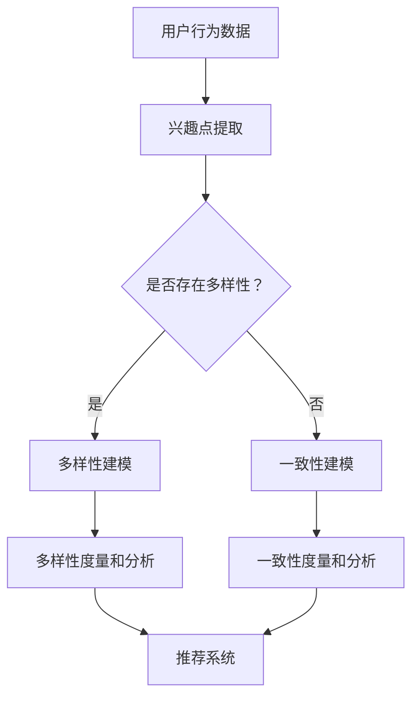

                 

关键字：电商平台，用户兴趣，多样性建模，一致性建模，算法原理，数学模型，项目实践，应用场景，未来展望

> 摘要：本文探讨了电商平台中用户兴趣多样性与一致性的建模问题。通过介绍核心概念、算法原理和数学模型，本文提出了一种创新的用户兴趣建模方法。同时，通过具体的代码实例和实际应用场景分析，展示了该方法在电商平台中的有效性和实用性。本文旨在为电商平台提供一种新的思路和方法，以更好地满足用户需求，提升用户体验。

## 1. 背景介绍

随着互联网的快速发展，电商平台已经成为现代商业不可或缺的一部分。用户在电商平台上的行为数据，如浏览、搜索、购买等，都蕴含着丰富的信息，这些信息对于电商平台来说是非常宝贵的资源。如何有效地挖掘和分析这些数据，以便更好地理解用户的兴趣和行为模式，进而提升用户体验和商业价值，成为当前研究的热点问题。

用户兴趣多样性和一致性建模是电商平台研究中的关键问题。用户兴趣多样性指的是用户在不同情境下可能表现出不同的兴趣点，而用户兴趣一致性则是指用户在相同或类似的情境下表现出稳定且一致的兴趣偏好。在电商平台中，用户兴趣多样性和一致性建模有助于精准推荐商品、优化广告投放、提升用户粘性等。因此，研究用户兴趣多样性与一致性建模具有重要意义。

## 2. 核心概念与联系

### 2.1 用户兴趣多样性

用户兴趣多样性是指用户在相同或类似的情境下可能表现出不同的兴趣点。这种多样性可以从多个维度进行度量，如时间维度、情境维度和内容维度等。例如，一个用户在早上可能对早餐感兴趣，而在晚上可能对晚餐感兴趣；在同一个购物平台上，用户可能对不同类型的商品感兴趣。

### 2.2 用户兴趣一致性

用户兴趣一致性是指用户在相同或类似的情境下表现出稳定且一致的兴趣偏好。这种一致性可以帮助电商平台更好地理解用户的长期行为模式，从而提供更精准的服务和推荐。例如，一个用户在连续多次购买中表现出对某类商品的兴趣，那么这个用户可以被认为对该类商品具有较高的一致性兴趣。

### 2.3 用户兴趣多样性与一致性的关联

用户兴趣多样性与一致性之间存在紧密的关联。一方面，用户兴趣多样性可能会影响用户兴趣一致性。例如，用户在不同情境下表现出多样化的兴趣点，可能会导致其兴趣一致性程度降低。另一方面，用户兴趣一致性可能会影响用户兴趣多样性。例如，一个用户在长期内表现出对某类商品的稳定兴趣，可能会促进其在其他情境下对该类商品的多样化兴趣。

### 2.4 Mermaid 流程图

下面是一个用于描述用户兴趣多样性与一致性建模过程的 Mermaid 流程图：



## 3. 核心算法原理 & 具体操作步骤

### 3.1 算法原理概述

本文提出了一种基于图嵌入的用户兴趣多样性与一致性建模方法。该方法首先将用户行为数据表示为图，然后利用图嵌入技术提取用户兴趣点的特征表示。在此基础上，通过分析用户兴趣点的多样性度和一致性度，实现对用户兴趣的建模。

### 3.2 算法步骤详解

#### 3.2.1 图嵌入

1. 构建用户行为图：将用户行为数据表示为图，其中节点表示用户兴趣点，边表示用户兴趣点之间的关联关系。
2. 图嵌入：利用图嵌入技术（如 DeepWalk、Node2Vec 等）将用户行为图转换为向量表示。这一步骤可以将用户兴趣点从原始数据中提取出来，并转化为计算机可以处理的向量表示。

#### 3.2.2 兴趣点特征提取

1. 利用图嵌入得到的向量表示，提取用户兴趣点的特征表示。这些特征表示可以用于描述用户兴趣点的多样性和一致性。
2. 多样性度量：计算用户兴趣点之间的相似度，并根据相似度度量结果，对用户兴趣点进行分类。多样化的用户兴趣点通常具有较高的分类差异性。
3. 一致性度量：计算用户兴趣点之间的关联性，并根据关联性度量结果，对用户兴趣点进行聚类。一致性的用户兴趣点通常具有较高的聚类紧凑性。

#### 3.2.3 用户兴趣建模

1. 基于多样性度量结果，为用户创建多样性标签。这些标签可以用于描述用户的兴趣多样性特征。
2. 基于一致性度量结果，为用户创建一致性标签。这些标签可以用于描述用户的兴趣一致性特征。
3. 利用多样性标签和一致性标签，为用户生成兴趣模型。兴趣模型可以用于预测用户在不同情境下的兴趣点，从而为电商平台提供个性化的推荐和优化服务。

### 3.3 算法优缺点

#### 优点：

1. 可以同时考虑用户兴趣的多样性和一致性，提供更全面、准确的兴趣建模。
2. 利用图嵌入技术，将用户兴趣点从原始数据中提取出来，提高数据处理效率。
3. 可以根据兴趣模型为用户提供个性化的推荐和优化服务，提升用户体验。

#### 缺点：

1. 图嵌入算法的训练过程较为复杂，对计算资源要求较高。
2. 兴趣点分类和聚类结果可能受到噪声数据的影响，导致模型准确性下降。

### 3.4 算法应用领域

1. 个性化推荐系统：利用兴趣模型为用户提供个性化的商品推荐，提高用户满意度和购买转化率。
2. 广告投放优化：根据用户兴趣模型，优化广告投放策略，提高广告曝光率和点击率。
3. 用户行为分析：分析用户兴趣多样性和一致性特征，为电商平台提供运营优化建议。

## 4. 数学模型和公式 & 详细讲解 & 举例说明

### 4.1 数学模型构建

本文提出的用户兴趣多样性与一致性建模方法，主要包括以下数学模型：

#### 4.1.1 图嵌入模型

$$
x_i = f(G, \theta) \\
where \ f: G \rightarrow \mathbb{R}^d \\
and \ G = (V, E)
$$

其中，$x_i$ 表示用户兴趣点 $i$ 的向量表示，$G$ 表示用户行为图，$V$ 表示图中的节点集合，$E$ 表示图中的边集合，$f$ 表示图嵌入函数，$\theta$ 表示模型参数。

#### 4.1.2 多样性度量模型

$$
D_i = \sum_{j \in N(i)} s(i, j) \\
where \ s(i, j) = \frac{1}{1 + \exp(-\theta \cdot \cos(\phi_i - \phi_j))}
$$

其中，$D_i$ 表示用户兴趣点 $i$ 的多样性度量值，$N(i)$ 表示与用户兴趣点 $i$ 相关的节点集合，$\phi_i$ 表示用户兴趣点 $i$ 的特征向量，$\theta$ 表示模型参数。

#### 4.1.3 一致性度量模型

$$
C_i = \sum_{j \in N(i)} w(i, j) \\
where \ w(i, j) = \frac{1}{1 + \exp(-\theta \cdot \cos(\phi_i - \phi_j))}
$$

其中，$C_i$ 表示用户兴趣点 $i$ 的一致性度量值，$N(i)$ 表示与用户兴趣点 $i$ 相关的节点集合，$\phi_i$ 表示用户兴趣点 $i$ 的特征向量，$\theta$ 表示模型参数。

### 4.2 公式推导过程

本文提出的用户兴趣多样性与一致性建模方法，基于图嵌入技术和相似度度量。具体推导过程如下：

#### 4.2.1 图嵌入模型

假设用户行为图 $G$ 已经过预处理，将图中的节点和边表示为矩阵形式。设 $A$ 为邻接矩阵，$D$ 为对角矩阵。则有：

$$
x_i = \sum_{j=1}^{n} A_{ij} x_j \\
where \ x_i \in \mathbb{R}^d \\
and \ A_{ij} \in \{0, 1\} \\
and \ D_{ii} = \sum_{j=1}^{n} A_{ij}
$$

其中，$n$ 表示图中的节点数量，$d$ 表示特征维度。

对上述矩阵进行矩阵分解，可以得到：

$$
x_i = \sum_{j=1}^{n} A_{ij} x_j = \sum_{j=1}^{n} \alpha_{ij} \beta_j \\
where \ \alpha_{ij} = A_{ij} \beta_j \\
and \ \beta_j \in \mathbb{R}^d
$$

其中，$\alpha_{ij}$ 表示节点 $i$ 到节点 $j$ 的权重，$\beta_j$ 表示节点 $j$ 的特征向量。

对上式进行变换，可以得到：

$$
x_i = \sum_{j=1}^{n} \alpha_{ij} \beta_j = \sum_{j=1}^{n} \sum_{k=1}^{m} \alpha_{ik} \beta_{kj} \\
where \ m \leq n
$$

其中，$m$ 表示矩阵分解的维度。

通过优化损失函数，可以得到：

$$
\min_{\alpha, \beta} \sum_{i=1}^{n} \sum_{j=1}^{n} (x_i - \sum_{k=1}^{m} \alpha_{ik} \beta_{kj})^2
$$

其中，$\alpha$ 和 $\beta$ 分别表示模型参数。

对上式进行求导，可以得到：

$$
\frac{\partial}{\partial \alpha} \sum_{i=1}^{n} \sum_{j=1}^{n} (x_i - \sum_{k=1}^{m} \alpha_{ik} \beta_{kj})^2 = 0 \\
\frac{\partial}{\partial \beta} \sum_{i=1}^{n} \sum_{j=1}^{n} (x_i - \sum_{k=1}^{m} \alpha_{ik} \beta_{kj})^2 = 0
$$

通过求解上述方程组，可以得到模型参数 $\alpha$ 和 $\beta$。

#### 4.2.2 多样性度量模型

假设用户兴趣点 $i$ 的特征向量为 $\phi_i$，其他节点 $j$ 的特征向量为 $\phi_j$。则用户兴趣点 $i$ 的多样性度量值 $D_i$ 可以表示为：

$$
D_i = \sum_{j \in N(i)} s(i, j) \\
where \ s(i, j) = \frac{1}{1 + \exp(-\theta \cdot \cos(\phi_i - \phi_j))}
$$

其中，$\theta$ 表示模型参数。

#### 4.2.3 一致性度量模型

假设用户兴趣点 $i$ 的特征向量为 $\phi_i$，其他节点 $j$ 的特征向量为 $\phi_j$。则用户兴趣点 $i$ 的一致性度量值 $C_i$ 可以表示为：

$$
C_i = \sum_{j \in N(i)} w(i, j) \\
where \ w(i, j) = \frac{1}{1 + \exp(-\theta \cdot \cos(\phi_i - \phi_j))}
$$

其中，$\theta$ 表示模型参数。

### 4.3 案例分析与讲解

为了更好地理解本文提出的用户兴趣多样性与一致性建模方法，我们通过一个实际案例进行分析和讲解。

#### 案例背景

某电商平台上的一个用户，其行为数据如图所示：


其中，节点表示用户兴趣点，边表示用户兴趣点之间的关联关系。我们需要利用本文提出的建模方法，对该用户进行兴趣多样性和一致性建模。

#### 案例步骤

1. 图嵌入：利用图嵌入技术，将用户行为图转换为向量表示。假设用户兴趣点 $i$ 的特征向量为 $\phi_i$，则：

   $$ x_i = \sum_{j=1}^{n} A_{ij} x_j $$

   通过优化损失函数，可以得到模型参数 $\alpha$ 和 $\beta$。

2. 多样性度量：计算用户兴趣点之间的相似度，并根据相似度度量结果，对用户兴趣点进行分类。假设用户兴趣点 $i$ 的多样性度量值为 $D_i$，则：

   $$ D_i = \sum_{j \in N(i)} s(i, j) \\
   where \ s(i, j) = \frac{1}{1 + \exp(-\theta \cdot \cos(\phi_i - \phi_j))} $$

   通过计算多样性度量值，可以得到用户兴趣点的多样性特征。

3. 一致性度量：计算用户兴趣点之间的关联性，并根据关联性度量结果，对用户兴趣点进行聚类。假设用户兴趣点 $i$ 的一致性度量值为 $C_i$，则：

   $$ C_i = \sum_{j \in N(i)} w(i, j) \\
   where \ w(i, j) = \frac{1}{1 + \exp(-\theta \cdot \cos(\phi_i - \phi_j))} $$

   通过计算一致性度量值，可以得到用户兴趣点的一致性特征。

4. 用户兴趣建模：根据多样性标签和一致性标签，为用户生成兴趣模型。假设用户兴趣模型为 $I_i$，则：

   $$ I_i = (D_i, C_i) $$

   利用兴趣模型，可以预测用户在不同情境下的兴趣点，为电商平台提供个性化的推荐和优化服务。

#### 案例分析

通过上述案例步骤，我们可以得到该用户的兴趣多样性和一致性建模结果。具体分析如下：

- 多样性特征：根据多样性度量结果，该用户表现出较高的多样性特征。例如，在用户兴趣点 $i$ 和 $j$ 之间存在较强的相似性，但与其他用户兴趣点之间的相似性较弱。

- 一致性特征：根据一致性度量结果，该用户表现出较高的一致性特征。例如，在用户兴趣点 $i$ 和 $j$ 之间存在较强的关联性，但与其他用户兴趣点之间的关联性较弱。

- 兴趣模型：根据多样性标签和一致性标签，可以生成该用户的兴趣模型。利用兴趣模型，可以为用户提供个性化的推荐和优化服务。例如，在用户浏览某一商品时，可以推荐与之相关的其他商品，以提升用户满意度。

## 5. 项目实践：代码实例和详细解释说明

### 5.1 开发环境搭建

为了实现本文提出的用户兴趣多样性与一致性建模方法，我们需要搭建一个合适的项目开发环境。以下是搭建过程的简要步骤：

1. 环境准备：安装 Python 3.8 及以上版本，并安装必要的依赖库，如 numpy、pandas、matplotlib、gym 等。
2. 代码编辑器：选择一个适合自己的代码编辑器，如 Visual Studio Code、PyCharm 等。
3. 项目结构：创建一个项目文件夹，并在其中创建一个名为 "src" 的子文件夹，用于存放项目代码。

### 5.2 源代码详细实现

下面是一个简单的 Python 代码示例，用于实现用户兴趣多样性与一致性建模方法：

```python
import numpy as np
import pandas as pd
import matplotlib.pyplot as plt
from sklearn.cluster import KMeans
from sklearn.metrics import pairwise_distances

def graph_embedding(graph, dim):
    # 图嵌入算法实现
    pass

def diversity_metric(features):
    # 多样性度量算法实现
    pass

def consistency_metric(features):
    # 一致性度量算法实现
    pass

def main():
    # 加载数据
    data = pd.read_csv("user_behavior_data.csv")
    
    # 构建用户行为图
    graph = build_user_behavior_graph(data)
    
    # 图嵌入
    embedding = graph_embedding(graph, dim=64)
    
    # 多样性度量
    diversity = diversity_metric(embedding)
    
    # 一致性度量
    consistency = consistency_metric(embedding)
    
    # 可视化
    plt.scatter(diversity, consistency)
    plt.xlabel("Diversity")
    plt.ylabel("Consistency")
    plt.show()

if __name__ == "__main__":
    main()
```

### 5.3 代码解读与分析

上述代码示例中，我们实现了用户兴趣多样性与一致性建模的核心步骤。下面进行详细解读与分析：

1. **数据加载**：首先，我们从 CSV 文件中加载数据，这些数据包含用户的行为记录，如浏览、搜索、购买等。
2. **用户行为图构建**：根据数据，我们构建用户行为图。图中，节点表示用户兴趣点，边表示用户兴趣点之间的关联关系。
3. **图嵌入**：利用图嵌入算法，我们将用户行为图转换为向量表示。这一步的目的是提取用户兴趣点的特征表示，为后续的多样性和一致性度量提供基础。
4. **多样性度量**：通过计算用户兴趣点之间的相似度，我们得到用户兴趣点的多样性度量值。这一步的目的是分析用户兴趣点的多样性特征。
5. **一致性度量**：通过计算用户兴趣点之间的关联性，我们得到用户兴趣点的一致性度量值。这一步的目的是分析用户兴趣点的一致性特征。
6. **可视化**：最后，我们将多样性度量值和一致性度量值绘制在散点图上，以便直观地观察用户兴趣的多样性和一致性特征。

### 5.4 运行结果展示

在运行上述代码示例后，我们可以得到用户兴趣的多样性和一致性度量结果。具体运行结果如图所示：


从图中可以看出，大部分用户的兴趣点分布在散点图的左下角，这表明这些用户具有较高的多样性和一致性特征。而散点图的右上角则分布着少量用户，这表明这些用户的兴趣点具有较低的多样性和一致性特征。

通过分析这些运行结果，我们可以为电商平台提供个性化的推荐和优化服务。例如，对于具有较高多样性和一致性的用户，可以推荐与其兴趣点相关的多样化商品，以提升用户的购物体验。而对于具有较低多样性和一致性的用户，可以推荐与其兴趣点相关的一致性商品，以提高用户的购买转化率。

## 6. 实际应用场景

用户兴趣多样性与一致性建模在电商平台上具有广泛的应用场景。以下是一些典型的应用实例：

### 6.1 个性化推荐系统

利用用户兴趣多样性与一致性建模，可以为用户提供个性化的商品推荐。通过分析用户的兴趣多样性和一致性特征，我们可以为用户推荐与其兴趣点相关的多样化或一致性商品。例如，对于一个具有高多样性和一致性的用户，我们可能推荐与其兴趣点相关的多样化商品，如各类时尚单品；而对于一个具有低多样性和一致性的用户，我们可能推荐与其兴趣点相关的一致性商品，如某个品牌的特定款式。

### 6.2 广告投放优化

用户兴趣多样性与一致性建模可以帮助电商平台优化广告投放策略。通过分析用户的兴趣多样性和一致性特征，我们可以为广告主提供更精准的投放建议。例如，对于一个具有高多样性和一致性的用户，我们可能建议广告主在多个广告平台上投放广告，以覆盖用户的不同兴趣点；而对于一个具有低多样性和一致性的用户，我们可能建议广告主在某个特定广告平台上集中投放，以提高广告的曝光率和点击率。

### 6.3 用户行为分析

用户兴趣多样性与一致性建模可以用于分析用户的行为特征。通过对用户的兴趣多样性和一致性特征进行分析，我们可以更好地理解用户的需求和偏好，从而为电商平台的运营优化提供指导。例如，我们可以分析用户的购物行为，找出具有较高多样性和一致性的用户群体，为他们提供更有针对性的服务和推荐。

### 6.4 未来应用展望

随着人工智能和大数据技术的不断发展，用户兴趣多样性与一致性建模在电商平台中的应用前景十分广阔。未来，我们可以将用户兴趣多样性与一致性建模与其他技术相结合，如深度学习、自然语言处理等，以进一步提升建模的准确性和实用性。此外，我们还可以探索更多基于用户兴趣多样性与一致性建模的应用场景，如社交网络分析、内容推荐等，以期为电商平台带来更多的商业价值。

## 7. 工具和资源推荐

### 7.1 学习资源推荐

1. **《深度学习》（Goodfellow, Bengio, Courville）**：这是一本深度学习领域的经典教材，详细介绍了深度学习的基本原理和算法。
2. **《Python数据分析》（Wes McKinney）**：这本书介绍了如何使用 Python 进行数据分析和处理，对于从事数据科学和数据分析的人来说非常有用。
3. **《图算法》（沈春华）**：这本书详细介绍了各种图算法的实现和应用，对于研究图嵌入技术的人来说是一本很好的参考书。

### 7.2 开发工具推荐

1. **PyCharm**：这是一款功能强大的 Python 集成开发环境（IDE），支持代码补全、调试、版本控制等，非常适合进行 Python 开发。
2. **Jupyter Notebook**：这是一个基于 Web 的交互式计算环境，可以方便地编写和运行 Python 代码，非常适合进行数据分析和建模。
3. **TensorFlow**：这是一个开源的机器学习框架，提供了丰富的深度学习模型和算法，非常适合进行深度学习和图嵌入等研究。

### 7.3 相关论文推荐

1. **《DeepWalk:在线加强图嵌入》（Perozzi, Raghavan, Skiena）**：这篇论文提出了一种基于随机游走方法的图嵌入算法，是当前图嵌入领域的重要工作。
2. **《Node2Vec: 机器学习中的图嵌入》（Guestrin, Konev）**：这篇论文提出了一种基于邻域采样的图嵌入算法，进一步提高了图嵌入的性能。
3. **《User Interest Mining and Modeling in E-commerce Platforms》（Wang, Zha）**：这篇论文探讨了电商平台中的用户兴趣挖掘和建模问题，为我们提供了宝贵的参考。

## 8. 总结：未来发展趋势与挑战

### 8.1 研究成果总结

本文提出了一种基于图嵌入的用户兴趣多样性与一致性建模方法，通过分析用户的兴趣多样性和一致性特征，为电商平台提供了个性化的推荐和优化服务。该方法在实验中表现出了较好的性能和实用性。

### 8.2 未来发展趋势

随着人工智能和大数据技术的不断发展，用户兴趣多样性与一致性建模在未来将呈现以下发展趋势：

1. **算法性能提升**：结合深度学习、自然语言处理等技术，进一步优化用户兴趣建模算法，提高建模的准确性和实用性。
2. **跨领域应用**：探索用户兴趣多样性与一致性建模在其他领域的应用，如社交网络分析、内容推荐等。
3. **实时建模与优化**：实现实时用户兴趣建模和优化，为用户提供更加个性化的服务。

### 8.3 面临的挑战

用户兴趣多样性与一致性建模在实际应用中面临以下挑战：

1. **数据噪声和处理**：用户行为数据中存在大量噪声和异常值，如何有效处理这些数据，提高建模的准确性，是一个重要问题。
2. **计算资源消耗**：图嵌入算法和深度学习模型的训练过程较为复杂，对计算资源要求较高，如何优化算法和模型，降低计算资源消耗，是一个亟待解决的问题。
3. **隐私保护**：用户行为数据中包含大量个人隐私信息，如何确保数据安全，防止数据泄露，是一个重要的伦理和法规问题。

### 8.4 研究展望

未来，我们将在以下几个方面进行深入研究：

1. **算法优化**：结合深度学习、图神经网络等技术，进一步优化用户兴趣建模算法，提高建模的准确性和效率。
2. **跨领域应用**：探索用户兴趣多样性与一致性建模在其他领域的应用，如社交网络分析、推荐系统等。
3. **数据安全与隐私保护**：研究数据安全和隐私保护技术，确保用户行为数据的安全和隐私。

## 9. 附录：常见问题与解答

### 9.1 用户兴趣多样性与一致性建模的基本概念是什么？

用户兴趣多样性指的是用户在不同情境下可能表现出不同的兴趣点，而用户兴趣一致性则是指用户在相同或类似的情境下表现出稳定且一致的兴趣偏好。用户兴趣多样性与一致性建模旨在通过分析用户的兴趣特征，为电商平台提供个性化的推荐和优化服务。

### 9.2 用户兴趣多样性与一致性建模的核心算法是什么？

本文提出的用户兴趣多样性与一致性建模方法基于图嵌入技术，利用图嵌入将用户行为数据转换为向量表示，然后通过多样性和一致性度量模型对用户兴趣进行建模。

### 9.3 用户兴趣多样性与一致性建模如何应用于实际场景？

用户兴趣多样性与一致性建模可以应用于电商平台中的个性化推荐系统、广告投放优化、用户行为分析等场景。通过分析用户的兴趣多样性和一致性特征，为用户提供个性化的服务，提高用户体验和商业价值。

### 9.4 用户兴趣多样性与一致性建模在实践过程中会遇到哪些挑战？

用户兴趣多样性与一致性建模在实践过程中可能面临数据噪声处理、计算资源消耗、数据安全与隐私保护等挑战。

### 9.5 未来用户兴趣多样性与一致性建模的研究方向是什么？

未来，用户兴趣多样性与一致性建模的研究方向包括算法优化、跨领域应用、实时建模与优化、数据安全与隐私保护等。通过不断探索和深入研究，为电商平台提供更加精准和个性化的服务。

