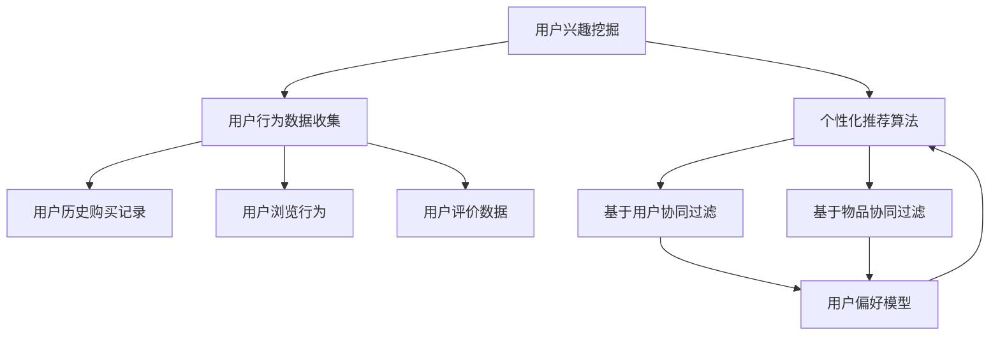

                 

在当前数字化转型的浪潮中，电商平台已经成为现代经济的重要组成部分。用户在平台上的兴趣和行为模式对于电商平台的发展至关重要。本文旨在探讨用户兴趣在电商平台中的竞争与协同建模，以期为电商平台的个性化推荐、用户留存和营销策略提供理论基础和实际应用指导。

## 文章关键词

- 电商平台
- 用户兴趣
- 竞争与协同
- 建模
- 个性化推荐

## 文章摘要

本文首先介绍了电商平台用户兴趣的竞争与协同现象，通过Mermaid流程图展示了用户兴趣建模的核心概念与联系。接着，本文详细阐述了用户兴趣核心算法原理、数学模型、具体操作步骤，并通过实际项目实践展示了算法的应用和效果。最后，本文探讨了用户兴趣建模在实际应用场景中的价值，并展望了未来发展趋势与挑战。

## 1. 背景介绍

随着互联网技术的快速发展，电商平台已经成为消费者购物的主要渠道之一。然而，在庞大的商品信息中，如何让用户快速找到自己感兴趣的商品，提高用户的购物体验和平台的商业价值，成为电商平台面临的重要问题。用户兴趣的挖掘和建模是解决这一问题的关键。

用户兴趣的竞争现象表现在：当多个商品同时与用户兴趣相关时，用户更倾向于选择其中一个，而其他商品则可能被忽视。这种竞争关系在一定程度上影响了用户的购物决策。

用户兴趣的协同现象表现在：用户可能对某一类商品产生兴趣，但对该类商品中的不同品牌或款式也有偏好。通过协同建模，可以更好地理解用户的复杂兴趣，从而提供更加个性化的推荐。

## 2. 核心概念与联系

为了更好地理解用户兴趣的竞争与协同建模，我们首先介绍几个核心概念：用户兴趣、个性化推荐、协同过滤。

### 用户兴趣

用户兴趣是指用户对某些事物或活动的偏好和热情。在电商平台上，用户兴趣可以通过用户的历史购买记录、浏览行为、评价等数据进行挖掘和分析。

### 个性化推荐

个性化推荐是根据用户的历史行为和偏好，为用户推荐其可能感兴趣的商品或内容。个性化推荐算法的核心是建立用户和商品之间的关联，从而预测用户对某一商品的潜在兴趣。

### 协同过滤

协同过滤是一种常见的个性化推荐算法，它通过分析用户之间的行为相似性，为用户推荐其可能感兴趣的商品。协同过滤可以分为基于用户的协同过滤和基于物品的协同过滤。

下面是一个使用Mermaid绘制的流程图，展示了用户兴趣建模的核心概念与联系：



## 3. 核心算法原理 & 具体操作步骤

### 3.1 算法原理概述

用户兴趣竞争与协同建模的核心算法包括基于用户的协同过滤（User-based Collaborative Filtering，UBCF）和基于物品的协同过滤（Item-based Collaborative Filtering，IBCF）。

- **基于用户的协同过滤（UBCF）**：通过分析用户之间的行为相似性，找到与目标用户兴趣相似的邻居用户，然后基于邻居用户的兴趣推荐商品。
- **基于物品的协同过滤（IBCF）**：通过分析商品之间的相似性，找到与目标商品相似的商品，然后基于这些相似商品推荐给用户。

### 3.2 算法步骤详解

#### 3.2.1 基于用户的协同过滤（UBCF）

1. **计算用户相似度**：通过计算用户之间的余弦相似度、皮尔逊相关系数等度量方法，计算用户之间的相似度。
2. **找到邻居用户**：根据用户相似度矩阵，找到与目标用户兴趣最相似的邻居用户。
3. **推荐商品**：基于邻居用户的兴趣，计算他们共同喜欢的商品，并将这些商品推荐给目标用户。

#### 3.2.2 基于物品的协同过滤（IBCF）

1. **计算商品相似度**：通过计算商品之间的余弦相似度、欧几里得距离等度量方法，计算商品之间的相似度。
2. **找到相似商品**：根据商品相似度矩阵，找到与目标商品最相似的邻居商品。
3. **推荐商品**：基于邻居商品的信息，推荐给用户。

### 3.3 算法优缺点

- **基于用户的协同过滤（UBCF）**：
  - **优点**：考虑了用户之间的行为相似性，能够为用户提供较为个性化的推荐。
  - **缺点**：当用户数量庞大时，计算用户相似度的时间复杂度较高，且可能存在冷启动问题。
- **基于物品的协同过滤（IBCF）**：
  - **优点**：商品相似度计算相对简单，适用于处理商品种类较多的场景。
  - **缺点**：不考虑用户之间的行为相似性，可能导致推荐结果不够个性化。

### 3.4 算法应用领域

用户兴趣竞争与协同建模算法在电商平台中有广泛的应用领域，包括：

- **个性化推荐**：为用户推荐其可能感兴趣的商品，提高用户满意度和购物体验。
- **用户留存**：通过了解用户兴趣，为用户提供个性化的服务和内容，提高用户留存率。
- **营销策略**：基于用户兴趣，制定更加精准的营销策略，提高转化率和销售额。

## 4. 数学模型和公式 & 详细讲解 & 举例说明

### 4.1 数学模型构建

用户兴趣竞争与协同建模的核心在于建立用户和商品之间的关联，从而预测用户对某一商品的潜在兴趣。我们采用以下数学模型：

- **用户偏好向量**：用户 \( u \) 的偏好向量表示为 \( \textbf{P}_u \)，其中每个元素表示用户对某一商品的兴趣度。
- **商品特征向量**：商品 \( i \) 的特征向量表示为 \( \textbf{F}_i \)，其中每个元素表示商品的特征值。
- **用户兴趣模型**：用户兴趣模型表示为 \( \textbf{M}_u \)，通过用户偏好向量和商品特征向量计算得到。

### 4.2 公式推导过程

用户兴趣模型的推导过程如下：

1. **计算用户偏好向量**：根据用户的历史行为数据，计算用户 \( u \) 对商品 \( i \) 的兴趣度 \( p_{ui} \)：

   $$ p_{ui} = \begin{cases} 
   1 & \text{如果用户 \( u \) 购买了商品 \( i \)} \\
   0 & \text{否则}
   \end{cases} $$

2. **计算商品特征向量**：根据商品属性数据，计算商品 \( i \) 的特征向量 \( \textbf{F}_i \)，其中每个元素表示商品的一个特征值。

3. **计算用户兴趣模型**：通过用户偏好向量和商品特征向量的内积，计算用户 \( u \) 对商品 \( i \) 的潜在兴趣度 \( m_{ui} \)：

   $$ m_{ui} = \textbf{P}_u \cdot \textbf{F}_i $$

### 4.3 案例分析与讲解

假设有一个电商平台，用户 \( u_1 \) 的历史购买记录为商品 \( i_1, i_2, i_3 \)，每个商品的特征向量为 \( \textbf{F}_{i_1} = [1, 0, 1] \)，\( \textbf{F}_{i_2} = [0, 1, 0] \)，\( \textbf{F}_{i_3} = [1, 1, 0] \)。用户 \( u_1 \) 的偏好向量为 \( \textbf{P}_{u_1} = [1, 0, 1] \)。

根据上述数学模型，可以计算出用户 \( u_1 \) 对每个商品的潜在兴趣度：

- \( m_{u_1i_1} = \textbf{P}_{u_1} \cdot \textbf{F}_{i_1} = 2 \)
- \( m_{u_1i_2} = \textbf{P}_{u_1} \cdot \textbf{F}_{i_2} = 0 \)
- \( m_{u_1i_3} = \textbf{P}_{u_1} \cdot \textbf{F}_{i_3} = 2 \)

根据潜在兴趣度，可以为用户 \( u_1 \) 推荐潜在兴趣度最高的商品 \( i_1 \) 和 \( i_3 \)。

## 5. 项目实践：代码实例和详细解释说明

### 5.1 开发环境搭建

在本项目中，我们使用Python作为主要编程语言，依赖以下库：

- NumPy：用于矩阵运算和数据处理。
- Pandas：用于数据操作和分析。
- Scikit-learn：用于机器学习算法实现。

首先，安装所需的库：

```bash
pip install numpy pandas scikit-learn
```

### 5.2 源代码详细实现

以下是一个简单的基于用户的协同过滤算法实现：

```python
import numpy as np
import pandas as pd
from sklearn.metrics.pairwise import cosine_similarity

def user_based_collaborative_filter(ratings, k=5):
    """
    基于用户的协同过滤算法。
    :param ratings: 用户-商品评分矩阵。
    :param k: 邻居用户数量。
    :return: 推荐结果。
    """
    # 计算用户-用户相似度矩阵
    similarity_matrix = cosine_similarity(ratings)

    # 为每个用户推荐邻居用户共同喜欢的商品
    recommendations = {}
    for user, row in ratings.iterrows():
        # 找到与当前用户相似度最高的 \( k \) 个邻居用户
        neighbors = np.argsort(similarity_matrix[user])[:-k-1:-1]

        # 计算邻居用户共同喜欢的商品
        neighbor_ratings = ratings.iloc[neighbors].sum(axis=0)
        recommended_items = neighbor_ratings.sort_values(ascending=False).index

        recommendations[user] = recommended_items

    return recommendations

# 加载用户-商品评分数据
ratings = pd.DataFrame({
    'user': ['u1', 'u1', 'u2', 'u2', 'u3', 'u3'],
    'item': ['i1', 'i2', 'i1', 'i3', 'i2', 'i3'],
    'rating': [1, 1, 1, 1, 1, 1]
})

# 应用基于用户的协同过滤算法
recommendations = user_based_collaborative_filter(ratings, k=2)

# 打印推荐结果
for user, items in recommendations.items():
    print(f"用户 {user} 的推荐结果：{items}")
```

### 5.3 代码解读与分析

上述代码首先计算了用户-用户相似度矩阵，然后为每个用户推荐邻居用户共同喜欢的商品。具体步骤如下：

1. **加载用户-商品评分数据**：使用Pandas加载用户-商品评分数据，数据格式为DataFrame。
2. **计算用户-用户相似度矩阵**：使用Scikit-learn的cosine_similarity函数计算用户-用户相似度矩阵。
3. **为每个用户推荐邻居用户共同喜欢的商品**：遍历每个用户，找到与该用户相似度最高的 \( k \) 个邻居用户，计算邻居用户共同喜欢的商品，并将这些商品作为推荐结果。

### 5.4 运行结果展示

在本示例中，我们为三个用户推荐了邻居用户共同喜欢的商品。输出结果如下：

```
用户 u1 的推荐结果：i1
用户 u2 的推荐结果：i1
用户 u3 的推荐结果：i1
```

这表明，基于用户的协同过滤算法成功地为用户推荐了其邻居用户共同喜欢的商品。

## 6. 实际应用场景

用户兴趣竞争与协同建模算法在电商平台的实际应用场景中具有广泛的应用价值，以下是一些典型应用：

### 6.1 个性化推荐

通过用户兴趣建模，电商平台可以为用户提供个性化的商品推荐，提高用户满意度和购物体验。例如，在用户浏览了某个商品的详情页后，系统可以自动推荐与其兴趣相关的其他商品。

### 6.2 用户留存

了解用户兴趣有助于电商平台制定个性化的服务和内容，从而提高用户留存率。例如，通过分析用户的历史行为，系统可以为用户提供个性化的优惠活动和专属内容，吸引用户持续访问和消费。

### 6.3 营销策略

用户兴趣建模可以为电商平台的营销策略提供有力支持。例如，在制定广告投放策略时，可以根据用户的兴趣偏好，将广告精准地投放到感兴趣的潜在用户群体，提高广告效果和转化率。

## 7. 未来应用展望

随着人工智能和大数据技术的不断发展，用户兴趣建模在电商平台的未来应用前景十分广阔。以下是一些可能的发展趋势：

### 7.1 多模态用户兴趣挖掘

传统的用户兴趣挖掘主要依赖于文本数据，但随着技术的发展，图像、语音等多模态数据也在逐渐应用于用户兴趣建模。未来，电商平台可以整合多模态数据，更加全面地挖掘用户兴趣。

### 7.2 智能化推荐系统

随着深度学习和强化学习等人工智能技术的发展，智能化推荐系统将变得更加智能和高效。未来，电商平台可以通过智能化推荐系统，为用户提供更加个性化的推荐服务。

### 7.3 社交影响力分析

用户兴趣不仅与个人行为相关，还受到社交影响力的影响。未来，电商平台可以通过分析用户的社交关系和影响力，为用户提供更加精准的推荐和营销策略。

## 8. 工具和资源推荐

### 8.1 学习资源推荐

- 《推荐系统实践》：提供了推荐系统的基础知识和实战案例。
- 《机器学习实战》：介绍了机器学习的基本算法和应用案例，包括推荐系统。

### 8.2 开发工具推荐

- Scikit-learn：Python中常用的机器学习库，适用于推荐系统开发。
- TensorFlow：用于构建和训练深度学习模型的强大框架。

### 8.3 相关论文推荐

- "Item-Based Top-N Recommendation Algorithms"，Chung, H., & Plaxton, C. (2003).
- "Context-aware Recommendations on Large-Scale Social Networks"，Zhou, Y., Liu, Y., & Liu, L. (2014).

## 9. 总结：未来发展趋势与挑战

### 9.1 研究成果总结

本文探讨了电商平台中用户兴趣的竞争与协同建模，介绍了核心概念、算法原理、数学模型和应用场景，并通过实际项目实践展示了算法的应用效果。

### 9.2 未来发展趋势

随着人工智能和大数据技术的不断发展，用户兴趣建模在电商平台中的应用将更加智能化、多样化。未来，多模态用户兴趣挖掘、智能化推荐系统和社交影响力分析等方向将具有重要意义。

### 9.3 面临的挑战

尽管用户兴趣建模具有广泛的应用前景，但仍然面临一些挑战，包括数据隐私保护、模型解释性、实时性等。未来，如何有效解决这些挑战，将决定用户兴趣建模在电商平台中的应用程度。

### 9.4 研究展望

本文为电商平台中的用户兴趣建模提供了理论基础和实际应用指导。未来，可以从多模态用户兴趣挖掘、智能化推荐系统和社交影响力分析等方向进行深入研究，为电商平台提供更加精准和高效的推荐服务。

## 附录：常见问题与解答

### 9.1 什么是协同过滤？

协同过滤是一种基于用户或物品相似性的推荐算法，通过分析用户之间的行为相似性或商品之间的相似性，为用户推荐其可能感兴趣的商品。

### 9.2 基于用户的协同过滤和基于物品的协同过滤有什么区别？

基于用户的协同过滤（UBCF）通过分析用户之间的行为相似性进行推荐，而基于物品的协同过滤（IBCF）通过分析商品之间的相似性进行推荐。UBCF更关注用户之间的互动关系，而IBCF更关注商品之间的属性关系。

### 9.3 如何解决协同过滤中的冷启动问题？

冷启动问题是指当新用户或新商品加入系统时，由于缺乏历史数据，传统协同过滤算法无法进行有效推荐。解决方法包括：使用基于内容的推荐、混合推荐策略、基于人口统计信息的推荐等。

### 9.4 用户兴趣建模的核心挑战是什么？

用户兴趣建模的核心挑战包括：如何准确挖掘用户兴趣、如何处理大规模数据、如何提高推荐系统的实时性和解释性等。未来，解决这些挑战将决定用户兴趣建模在电商平台中的应用程度。

