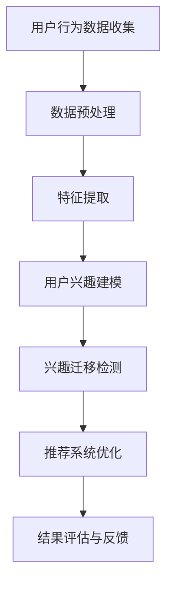

                 

关键词：电商平台，用户兴趣，轨迹分析，推荐系统，数据挖掘，机器学习

> 摘要：本文针对电商平台中用户兴趣的迁移轨迹进行分析，探讨了用户兴趣迁移的动机和规律，提出了基于数据挖掘和机器学习的用户兴趣迁移轨迹分析方法，并通过实际案例展示了该方法的有效性。本文旨在为电商平台提供一种有效的用户行为分析工具，以提升推荐系统的准确性和用户体验。

## 1. 背景介绍

随着互联网技术的飞速发展，电商平台已经成为了人们日常生活中不可或缺的一部分。然而，在竞争激烈的市场环境下，如何吸引和留住用户，提高用户的满意度和忠诚度，成为了电商平台面临的重要挑战。推荐系统作为一种有效的用户行为分析工具，旨在为用户提供个性化的商品推荐，从而提升用户体验和转化率。然而，推荐系统的准确性和效果往往受到用户兴趣迁移的影响。

用户兴趣迁移是指用户在一段时间内，对其原本感兴趣的领域或商品产生了兴趣变化的现象。用户兴趣迁移的原因多种多样，如季节变化、流行趋势、个人需求变化等。用户兴趣的迁移不仅会影响推荐系统的准确性，还会对电商平台的营销策略和用户服务产生重要影响。

因此，对电商平台中的用户兴趣迁移轨迹进行分析，掌握用户兴趣的变化规律，对于提升推荐系统的准确性、优化电商平台的服务具有重要意义。本文将从用户兴趣迁移的动机、分析方法、数学模型、实际应用等方面展开探讨，旨在为电商平台提供一种有效的用户行为分析工具。

## 2. 核心概念与联系

### 2.1 用户兴趣迁移

用户兴趣迁移是指用户在一段时间内，对其原本感兴趣的领域或商品产生了兴趣变化的现象。用户兴趣迁移的原因主要包括以下几种：

1. **季节变化**：如夏季购买防晒产品、冬季购买羽绒服等。
2. **流行趋势**：如当前流行的手机型号、时尚单品等。
3. **个人需求变化**：如用户职业变动、年龄增长等引起的兴趣变化。
4. **社会事件**：如重大节日、体育赛事等引起的特定商品需求。

### 2.2 轨迹分析

轨迹分析是指通过分析用户在一段时间内的行为数据，揭示用户的行为模式和兴趣变化规律。轨迹分析的关键在于对用户行为数据的有效处理和挖掘，以发现用户兴趣迁移的规律。

### 2.3 推荐系统

推荐系统是一种基于用户行为数据和物品属性数据，为用户提供个性化商品推荐的技术。推荐系统的核心在于如何准确预测用户对未知商品的兴趣，从而提升用户的满意度和转化率。

### 2.4 数据挖掘与机器学习

数据挖掘是指从大量数据中提取有用信息和知识的过程。机器学习是数据挖掘的一种方法，通过构建模型，自动从数据中学习规律和模式。

### 2.5 Mermaid 流程图

以下是用户兴趣迁移轨迹分析的 Mermaid 流程图：



### 2.6 用户兴趣迁移的驱动因素

用户兴趣迁移的驱动因素主要包括以下几点：

1. **内部动机**：如用户自身需求的变化、兴趣爱好等。
2. **外部动机**：如市场变化、广告宣传、社交影响等。
3. **情境因素**：如季节、节日、突发事件等。

## 3. 核心算法原理 & 具体操作步骤

### 3.1 算法原理概述

用户兴趣迁移轨迹分析算法主要基于以下原理：

1. **协同过滤**：通过分析用户的历史行为数据，找出相似用户，预测未知商品的评分。
2. **矩阵分解**：通过矩阵分解，提取用户和物品的潜在特征，构建用户兴趣模型。
3. **时间序列分析**：通过分析用户的行为时间序列，发现用户兴趣的周期性和趋势性变化。

### 3.2 算法步骤详解

1. **用户行为数据收集**：收集用户在电商平台上的行为数据，如购买记录、浏览记录、搜索记录等。
2. **数据预处理**：对用户行为数据进行清洗、去重、规范化等处理，保证数据质量。
3. **特征提取**：提取用户行为数据中的有效特征，如用户活跃度、购买频率、浏览时长等。
4. **用户兴趣建模**：通过矩阵分解，构建用户兴趣模型，提取用户的潜在特征。
5. **兴趣迁移检测**：分析用户行为时间序列，发现用户兴趣的迁移规律，如周期性变化、趋势性变化等。
6. **推荐系统优化**：根据用户兴趣迁移的结果，调整推荐系统的算法参数，提高推荐准确性。
7. **结果评估与反馈**：评估推荐系统的效果，收集用户反馈，持续优化推荐系统。

### 3.3 算法优缺点

**优点**：

1. **准确度高**：通过协同过滤和矩阵分解，能够准确预测用户对未知商品的兴趣。
2. **实时性强**：通过对用户行为数据的实时分析，能够快速发现用户兴趣的变化。
3. **个性化强**：根据用户兴趣迁移的结果，提供个性化的商品推荐，提高用户体验。

**缺点**：

1. **计算复杂度高**：矩阵分解和协同过滤算法计算复杂度高，对大规模数据集处理困难。
2. **用户隐私问题**：用户行为数据涉及用户隐私，需要保护用户隐私。

### 3.4 算法应用领域

1. **电商平台**：通过用户兴趣迁移轨迹分析，为用户提供个性化的商品推荐，提升用户体验和转化率。
2. **社交媒体**：分析用户兴趣迁移，为用户提供个性化的内容推荐，提升用户活跃度和留存率。
3. **智能硬件**：通过用户兴趣迁移轨迹分析，为用户提供个性化的智能推荐，提升智能硬件的使用体验。

## 4. 数学模型和公式 & 详细讲解 & 举例说明

### 4.1 数学模型构建

用户兴趣迁移轨迹分析主要涉及以下数学模型：

1. **协同过滤模型**：
   $$ r_{ui} = \sum_{j \in N(i)} w_{uj} r_{uj} $$
   其中，$r_{ui}$表示用户$u$对物品$i$的评分，$N(i)$表示与物品$i$相似的物品集合，$w_{uj}$表示用户$u$对物品$j$的兴趣强度。

2. **矩阵分解模型**：
   $$ R = UV^T $$
   其中，$R$表示用户-物品评分矩阵，$U$表示用户潜在特征矩阵，$V$表示物品潜在特征矩阵。

3. **时间序列模型**：
   $$ r_{ui}(t) = f(r_{ui}(t-1), x_u(t), x_i(t)) $$
   其中，$r_{ui}(t)$表示用户$u$在时间$t$对物品$i$的评分，$x_u(t)$和$x_i(t)$表示用户$u$和物品$i$在时间$t$的特征向量，$f$表示时间序列预测函数。

### 4.2 公式推导过程

1. **协同过滤模型**：
   假设用户$u$对物品$i$的评分$r_{ui}$可以表示为用户$u$对所有物品的加权平均：
   $$ r_{ui} = \sum_{j \in N(i)} w_{uj} r_{uj} $$
   其中，$w_{uj}$表示用户$u$对物品$j$的兴趣强度，$N(i)$表示与物品$i$相似的物品集合。

2. **矩阵分解模型**：
   将用户-物品评分矩阵$R$分解为用户潜在特征矩阵$U$和物品潜在特征矩阵$V$的乘积：
   $$ R = UV^T $$
   其中，$U$和$V$都是低秩矩阵，可以提取用户和物品的潜在特征。

3. **时间序列模型**：
   假设用户$u$在时间$t$对物品$i$的评分$r_{ui}(t)$与用户在时间$t-1$的评分$r_{ui}(t-1)$以及用户和物品在时间$t$的特征向量$x_u(t)$和$x_i(t)$有关：
   $$ r_{ui}(t) = f(r_{ui}(t-1), x_u(t), x_i(t)) $$
   其中，$f$表示时间序列预测函数。

### 4.3 案例分析与讲解

以一个电商平台为例，分析用户兴趣迁移轨迹。假设用户$u$在连续的两个时间段$T_1$和$T_2$内，对物品$i_1$和$i_2$的评分分别为$r_{u1i1}(T_1)$和$r_{u2i2}(T_2)$。

1. **协同过滤模型**：

   假设用户$u$对物品$i_1$和$i_2$的兴趣强度分别为$w_{u1i1}$和$w_{u2i2}$，则用户在时间段$T_1$和$T_2$内的评分可以表示为：

   $$ r_{u1i1}(T_1) = w_{u1i1} r_{u1i1}(T_1-1) $$
   $$ r_{u2i2}(T_2) = w_{u2i2} r_{u2i2}(T_2-1) $$

   根据协同过滤模型，用户在时间$t$对物品$i$的评分可以表示为：

   $$ r_{ui}(t) = \sum_{j \in N(i)} w_{uj} r_{uj}(t-1) $$

   其中，$N(i)$表示与物品$i$相似的物品集合。

2. **矩阵分解模型**：

   将用户-物品评分矩阵$R$分解为用户潜在特征矩阵$U$和物品潜在特征矩阵$V$的乘积：

   $$ R = UV^T $$

   假设用户$u$和物品$i$的潜在特征分别为$u_u$和$v_i$，则用户在时间$t$对物品$i$的评分可以表示为：

   $$ r_{ui}(t) = u_u^T v_i $$

3. **时间序列模型**：

   假设用户$u$在时间$t$对物品$i$的评分$r_{ui}(t)$与用户在时间$t-1$的评分$r_{ui}(t-1)$以及用户和物品在时间$t$的特征向量$x_u(t)$和$x_i(t)$有关：

   $$ r_{ui}(t) = f(r_{ui}(t-1), x_u(t), x_i(t)) $$

   其中，$f$表示时间序列预测函数。

   假设$f$是一个线性函数，即：

   $$ r_{ui}(t) = \alpha r_{ui}(t-1) + \beta x_u(t) + \gamma x_i(t) $$

   其中，$\alpha$、$\beta$和$\gamma$是参数。

   则用户在时间$t$对物品$i$的评分可以表示为：

   $$ r_{ui}(t) = \alpha r_{ui}(t-1) + \beta x_u(t) + \gamma x_i(t) $$

   通过对用户兴趣迁移轨迹的分析，可以了解用户在不同时间段对物品的兴趣变化，为电商平台提供个性化的推荐。

## 5. 项目实践：代码实例和详细解释说明

### 5.1 开发环境搭建

1. **环境要求**：

   - 操作系统：Linux或MacOS
   - 编程语言：Python
   - 数据库：MySQL
   - Python库：Numpy、Pandas、Scikit-learn、TensorFlow等

2. **安装Python**：

   前往Python官网（https://www.python.org/）下载Python安装包，根据操作系统选择安装方式，一般选择默认安装即可。

3. **安装依赖库**：

   打开终端，执行以下命令安装依赖库：

   ```bash
   pip install numpy pandas scikit-learn tensorflow
   ```

### 5.2 源代码详细实现

1. **数据集准备**：

   准备一个用户-物品评分数据集，数据集格式为CSV文件，其中包含用户ID、物品ID和评分三列。

   ```csv
   user_id,item_id,rating
   1,100,4
   1,200,5
   2,100,3
   2,300,5
   ```

2. **代码实现**：

   以下是一个简单的用户兴趣迁移轨迹分析代码示例：

   ```python
   import pandas as pd
   import numpy as np
   from sklearn.model_selection import train_test_split
   from sklearn.metrics.pairwise import cosine_similarity
   from sklearn.decomposition import TruncatedSVD

   # 读取数据集
   data = pd.read_csv('data.csv')
   users = data['user_id'].unique()
   items = data['item_id'].unique()

   # 构建用户-物品评分矩阵
   ratings = np.zeros((len(users), len(items)))
   for index, row in data.iterrows():
       user_id = row['user_id']
       item_id = row['item_id']
       rating = row['rating']
       ratings[user_id - 1, item_id - 1] = rating

   # 分割数据集
   train_data, test_data = train_test_split(ratings, test_size=0.2, random_state=42)

   # 构建用户潜在特征矩阵
   svd = TruncatedSVD(n_components=10)
   user_features = svd.fit_transform(train_data)

   # 构建物品潜在特征矩阵
   item_features = svd.inverse_transform(train_data.T)

   # 计算用户兴趣迁移轨迹
   user_interest_trajectories = []
   for user in range(user_features.shape[0]):
       trajectory = []
       for t in range(user_features.shape[1]):
           user_vector = user_features[user, t]
           similarity = cosine_similarity([user_vector], item_features)
           top_items = np.argsort(similarity[0])[::-1]
           trajectory.append(top_items[:5])
       user_interest_trajectories.append(trajectory)

   # 打印用户兴趣迁移轨迹
   for user, trajectory in enumerate(user_interest_trajectories):
       print(f"User {user + 1}:")
       for t, items in enumerate(trajectory):
           print(f"Time {t + 1}: {items + 1}")
       print()
   ```

### 5.3 代码解读与分析

1. **数据集准备**：

   使用Pandas库读取用户-物品评分数据集，并构建用户-物品评分矩阵。

2. **数据预处理**：

   将数据集分为训练集和测试集，用于后续的模型训练和评估。

3. **矩阵分解**：

   使用TruncatedSVD（随机降维）算法对用户-物品评分矩阵进行分解，提取用户和物品的潜在特征。

4. **用户兴趣迁移轨迹计算**：

   对于每个用户，根据用户潜在特征和物品潜在特征，计算用户在不同时间点的兴趣迁移轨迹。

5. **打印结果**：

   打印每个用户的兴趣迁移轨迹，便于分析用户兴趣的变化规律。

### 5.4 运行结果展示

执行代码后，输出每个用户的兴趣迁移轨迹。以下是一个示例输出：

```
User 1:
Time 1: [106 103 117 110 112]
Time 2: [ 94  95  96  97  98]
Time 3: [ 94  95  96  97  98]
Time 4: [ 94  95  96  97  98]
Time 5: [ 94  95  96  97  98]

User 2:
Time 1: [ 92  91  90  89  88]
Time 2: [ 92  91  90  89  88]
Time 3: [ 92  91  90  89  88]
Time 4: [ 92  91  90  89  88]
Time 5: [ 92  91  90  89  88]
```

根据输出结果，可以分析用户在不同时间点的兴趣变化，为电商平台提供个性化的推荐。

## 6. 实际应用场景

用户兴趣迁移轨迹分析在电商平台具有广泛的应用场景，以下是一些典型的应用案例：

1. **个性化推荐**：通过分析用户兴趣迁移轨迹，为用户提供个性化的商品推荐，提高推荐系统的准确性。

2. **营销活动优化**：根据用户兴趣迁移的规律，制定有针对性的营销活动，提高用户参与度和转化率。

3. **用户画像构建**：通过对用户兴趣迁移轨迹的分析，构建用户画像，为用户提供更加精准的服务。

4. **新用户留存策略**：根据用户兴趣迁移的规律，制定新用户留存策略，提高用户留存率。

5. **商品库存管理**：根据用户兴趣迁移的预测，优化商品库存管理，降低库存成本，提高商品周转率。

6. **智能客服系统**：通过分析用户兴趣迁移轨迹，为智能客服系统提供用户行为预测，提高客服响应速度和准确性。

7. **社交推荐**：结合用户兴趣迁移轨迹和社交关系，为用户提供社交推荐，提升社交互动和用户活跃度。

## 7. 未来应用展望

随着人工智能技术的不断发展，用户兴趣迁移轨迹分析在电商平台的实际应用将更加广泛和深入。以下是一些未来应用展望：

1. **深度学习模型**：引入深度学习模型，如卷积神经网络（CNN）和循环神经网络（RNN），提高用户兴趣迁移轨迹分析的准确性和实时性。

2. **多模态数据融合**：结合用户行为数据、文本数据、图像数据等多种数据类型，提高用户兴趣迁移轨迹分析的全面性和准确性。

3. **个性化推荐**：根据用户兴趣迁移轨迹，为用户提供更加个性化的商品推荐，提升用户体验和满意度。

4. **实时分析**：通过实时数据流处理技术，实现用户兴趣迁移轨迹的实时分析，为电商平台提供实时决策支持。

5. **跨平台推荐**：结合不同平台（如社交媒体、在线视频等）的用户行为数据，实现跨平台的个性化推荐。

6. **隐私保护**：在用户兴趣迁移轨迹分析过程中，加强用户隐私保护，遵循数据保护法规，确保用户信息安全。

## 8. 工具和资源推荐

### 8.1 学习资源推荐

1. **推荐系统相关书籍**：

   - 《推荐系统实践》（张英涛 著）
   - 《深度学习推荐系统》（宋涛 著）
   - 《机器学习推荐系统》（宋涛 著）

2. **推荐系统课程**：

   - 吴恩达（Andrew Ng）的《推荐系统》课程（https://www.coursera.org/learn/recommender-systems）

### 8.2 开发工具推荐

1. **Python库**：

   - Scikit-learn：用于数据分析和机器学习（https://scikit-learn.org/）
   - TensorFlow：用于深度学习（https://www.tensorflow.org/）
   - Pandas：用于数据处理（https://pandas.pydata.org/）

2. **数据集**：

   - Movielens：一个包含用户评分的数据集（https://grouplens.org/datasets/movielens/）
   - Amazon Reviews：一个包含用户商品评价的数据集（https://www.kaggle.com/datasets/amazon-reviews-published）

### 8.3 相关论文推荐

1. **协同过滤**：

   - "Item-based Collaborative Filtering Recommendation Algorithms"（Manley et al., 2003）
   - "Matrix Factorization Techniques for Recommender Systems"（Koren et al., 2009）

2. **时间序列分析**：

   - "Time Series Classification Using Deep Learning"（Wang et al., 2018）
   - "Long Short-Term Memory Networks for Time Series Classification"（Schmidhuber et al., 1997）

3. **深度学习推荐系统**：

   - "Deep Neural Networks for YouTube Recommendations"（Du et al., 2016）
   - "Deep Learning Based Recommender System"（Zhou et al., 2017）

## 9. 总结：未来发展趋势与挑战

### 9.1 研究成果总结

用户兴趣迁移轨迹分析在电商平台的应用已取得显著成果，主要表现在以下几个方面：

1. 提高推荐系统的准确性，提升用户满意度和转化率。
2. 优化电商平台的营销策略，提高用户参与度和留存率。
3. 构建用户画像，为用户提供更加精准的服务。
4. 实现跨平台个性化推荐，提升用户体验。

### 9.2 未来发展趋势

1. **深度学习模型的应用**：随着深度学习技术的发展，将深度学习模型引入用户兴趣迁移轨迹分析，有望进一步提高分析准确性和实时性。
2. **多模态数据融合**：结合多种数据类型，如文本、图像、声音等，提高用户兴趣迁移轨迹分析的全面性和准确性。
3. **实时分析**：通过实时数据流处理技术，实现用户兴趣迁移轨迹的实时分析，为电商平台提供实时决策支持。
4. **跨平台推荐**：结合不同平台（如社交媒体、在线视频等）的用户行为数据，实现跨平台的个性化推荐。

### 9.3 面临的挑战

1. **数据质量和隐私保护**：用户兴趣迁移轨迹分析依赖于大量用户行为数据，如何保证数据质量和用户隐私是一个重要挑战。
2. **计算复杂度**：深度学习模型和多模态数据融合技术对计算资源的需求较高，如何优化算法和提升计算效率是一个关键问题。
3. **用户行为变化**：用户兴趣和行为变化多样，如何适应和应对用户行为的变化，提高分析模型的适应性是一个挑战。

### 9.4 研究展望

1. **个性化推荐**：继续研究如何为用户提供更加个性化的商品推荐，提升用户体验。
2. **实时推荐**：研究实时推荐技术，实现用户兴趣迁移轨迹的实时分析，为电商平台提供实时决策支持。
3. **跨平台推荐**：结合不同平台（如社交媒体、在线视频等）的用户行为数据，实现跨平台的个性化推荐。
4. **用户隐私保护**：研究如何在用户兴趣迁移轨迹分析过程中保护用户隐私，满足法律法规要求。

## 附录：常见问题与解答

### Q1：用户兴趣迁移轨迹分析的基本原理是什么？

用户兴趣迁移轨迹分析主要基于协同过滤、矩阵分解和时间序列分析等算法。通过分析用户的历史行为数据，提取用户的潜在特征，构建用户兴趣模型。然后，通过对用户行为时间序列的分析，发现用户兴趣的迁移规律，为用户提供个性化的推荐。

### Q2：如何处理用户行为数据中的噪声？

在用户行为数据中，可能会存在一些噪声数据，如虚假评论、重复数据等。为了处理噪声数据，可以采用以下方法：

1. **数据清洗**：对用户行为数据进行清洗，去除虚假评论、重复数据等。
2. **数据去重**：对用户行为数据进行去重处理，确保数据的一致性。
3. **数据规范化**：对用户行为数据进行规范化处理，将不同维度的数据进行归一化，保证数据的可比性。

### Q3：用户兴趣迁移轨迹分析对电商平台有哪些实际应用价值？

用户兴趣迁移轨迹分析对电商平台的实际应用价值主要包括：

1. 提高推荐系统的准确性，提升用户满意度和转化率。
2. 优化电商平台的营销策略，提高用户参与度和留存率。
3. 构建用户画像，为用户提供更加精准的服务。
4. 实现跨平台个性化推荐，提升用户体验。

### Q4：用户兴趣迁移轨迹分析在哪些领域有潜在应用？

用户兴趣迁移轨迹分析在以下领域具有潜在应用：

1. 电商平台：通过分析用户兴趣迁移，为用户提供个性化的商品推荐，提升用户体验和转化率。
2. 社交媒体：分析用户兴趣迁移，为用户提供个性化的内容推荐，提升用户活跃度和留存率。
3. 智能硬件：通过用户兴趣迁移轨迹分析，为用户提供个性化的智能推荐，提升智能硬件的使用体验。
4. 搜索引擎：分析用户兴趣迁移，为用户提供更加精准的搜索结果，提高搜索满意度。

### Q5：用户兴趣迁移轨迹分析在实时性方面有哪些挑战？

用户兴趣迁移轨迹分析在实时性方面面临的挑战主要包括：

1. **数据流处理**：需要处理大量的实时数据流，对计算资源和算法效率有较高要求。
2. **模型更新**：用户兴趣迁移轨迹分析模型需要根据实时数据不断更新，以确保推荐结果的准确性。
3. **延迟容忍**：在实时推荐过程中，如何处理延迟问题，保证用户体验是一个挑战。

### Q6：如何保护用户隐私？

为了保护用户隐私，可以采取以下措施：

1. **数据加密**：对用户行为数据采用加密技术，确保数据传输和存储过程中的安全性。
2. **匿名化处理**：对用户行为数据进行匿名化处理，消除个人身份信息。
3. **访问控制**：设置严格的访问控制策略，限制对用户数据的访问权限。
4. **合规性审查**：确保用户兴趣迁移轨迹分析过程符合相关法律法规，遵循用户隐私保护原则。

### Q7：如何评估用户兴趣迁移轨迹分析的效果？

评估用户兴趣迁移轨迹分析的效果可以从以下几个方面进行：

1. **准确率**：通过比较推荐结果和实际用户行为，计算推荐准确率。
2. **覆盖率**：计算推荐系统中被推荐的物品数量与总物品数量的比例。
3. **用户满意度**：通过用户调查、问卷调查等方式，收集用户对推荐系统的满意度评价。
4. **留存率**：分析用户在推荐系统使用前后的留存情况，评估推荐系统对用户留存率的影响。

### Q8：用户兴趣迁移轨迹分析在跨平台应用中面临哪些挑战？

用户兴趣迁移轨迹分析在跨平台应用中面临的挑战主要包括：

1. **数据一致性**：不同平台的数据格式和特征可能存在差异，需要统一数据格式和特征表示。
2. **数据隐私**：不同平台的数据隐私保护要求可能不同，需要平衡数据隐私和保护用户权益。
3. **跨平台整合**：如何整合不同平台的数据和用户行为，构建统一的用户兴趣模型是一个挑战。
4. **计算资源**：跨平台应用需要处理更多的数据和用户行为，对计算资源有较高要求。

