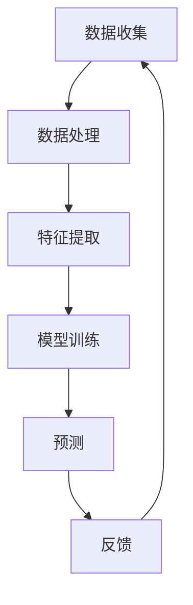
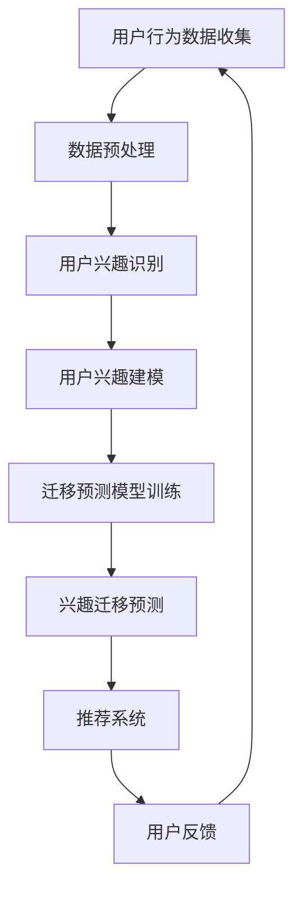

                 

电商平台作为现代零售业的核心，其用户体验和个性化推荐系统的优劣直接关系到平台的运营效率和用户粘性。随着大数据和人工智能技术的快速发展，用户兴趣迁移预测作为一种关键的用户行为分析技术，正逐步成为电商平台优化用户体验、提升销售转化率的重要手段。本文将探讨电商平台中的用户兴趣迁移预测技术，从背景介绍、核心概念、算法原理、数学模型、项目实践到实际应用场景，力求为读者提供一个全面且深入的技术解读。

## 关键词

- 电商平台
- 用户兴趣迁移预测
- 个性化推荐
- 大数据
- 人工智能

## 摘要

本文旨在分析电商平台中用户兴趣迁移预测的技术和方法，通过对用户行为数据的深度挖掘，实现用户兴趣的动态捕捉和精准预测。文章首先介绍了电商平台背景和用户兴趣迁移预测的重要性，接着深入探讨了相关核心概念和算法原理，并利用数学模型和实际案例进行了详细讲解。通过文章的阅读，读者将了解到用户兴趣迁移预测在电商平台中的实际应用，以及其未来发展的趋势和面临的挑战。

## 1. 背景介绍

### 1.1 电商平台的现状与挑战

随着互联网技术的不断进步和电子商务的普及，电商平台已经成为消费者购买商品的主要渠道之一。根据《中国电子商务报告》数据显示，2022年我国电子商务交易额已超过40万亿元，电商用户规模持续扩大，用户行为数据也在海量积累。然而，电商平台的竞争日益激烈，如何提高用户体验和销售转化率成为各大电商平台亟待解决的问题。

### 1.2 用户兴趣迁移预测的重要性

用户兴趣迁移预测是指在用户浏览、搜索和购买等行为中，预测用户可能感兴趣的其他商品或服务。这一技术的核心在于捕捉用户兴趣的动态变化，并在合适的时间将相关推荐推送给用户。用户兴趣迁移预测对电商平台具有以下几方面的意义：

1. **提升用户体验**：通过精准的个性化推荐，满足用户的需求，提高用户满意度和平台粘性。
2. **增加销售转化率**：引导用户发现更多潜在感兴趣的商品，增加购买概率，提升销售额。
3. **优化运营策略**：了解用户兴趣变化趋势，为电商平台的产品定位、市场推广和库存管理提供数据支持。

### 1.3 用户兴趣迁移预测的应用领域

用户兴趣迁移预测技术不仅应用于电商平台，还可以拓展到其他在线服务领域，如社交媒体、在线视频平台、搜索引擎等。本文主要关注电商平台这一特定场景，因为电商平台对用户兴趣迁移的预测需求更为迫切，对商业价值的提升也更为显著。

## 2. 核心概念与联系

### 2.1 用户兴趣

用户兴趣是指用户在特定场景下对某种商品、服务或信息的偏好和倾向。用户的兴趣可以是长期的，如对某一品牌的偏好；也可以是短期的，如对特定促销活动的关注。

### 2.2 迁移

迁移是指用户兴趣从一种状态转移到另一种状态的过程。在电商平台上，用户的兴趣迁移可以表现为从对某一类商品的兴趣转向对另一类商品的兴趣。

### 2.3 预测

预测是指基于历史数据和现有信息，对未来的用户行为进行推断和预测。在用户兴趣迁移预测中，预测的目的是提前识别用户可能的兴趣变化，以便及时调整推荐策略。

### 2.4 架构概述

用户兴趣迁移预测的架构通常包括数据收集、数据处理、特征提取、模型训练、预测和反馈等模块。以下是一个简单的架构概述：



### 2.5 Mermaid 流程图



### 2.6 Mermaid 流程节点细节

1. **A1 用户行为数据收集**：从电商平台获取用户浏览、搜索、购买等行为数据。
2. **B1 数据预处理**：清洗和转换原始数据，确保数据质量。
3. **C1 用户兴趣识别**：通过行为数据挖掘用户的兴趣偏好。
4. **D1 用户兴趣建模**：构建用户兴趣模型，用于描述用户兴趣状态。
5. **E1 迁移预测模型训练**：利用历史用户兴趣迁移数据训练迁移预测模型。
6. **F1 兴趣迁移预测**：预测用户可能的兴趣迁移方向。
7. **G1 推荐系统**：根据预测结果生成个性化推荐。
8. **H1 用户反馈**：收集用户对推荐系统的反馈，用于模型优化。

## 3. 核心算法原理 & 具体操作步骤

### 3.1 算法原理概述

用户兴趣迁移预测算法的核心在于捕捉用户兴趣的变化趋势，并利用这些变化趋势预测未来的用户兴趣。以下是一些常见的算法原理：

1. **协同过滤**：通过分析用户之间的相似性，预测用户可能感兴趣的项目。
2. **基于内容的推荐**：根据用户的历史行为和偏好，推荐具有相似特征的商品或服务。
3. **图神经网络**：利用图结构表示用户和商品之间的关系，通过图神经网络进行兴趣迁移预测。

### 3.2 算法步骤详解

1. **数据收集**：从电商平台获取用户行为数据，包括浏览记录、搜索关键词、购买历史等。
2. **数据预处理**：清洗数据，去除噪声，进行数据转换，如将文本转换为向量表示。
3. **特征提取**：从原始数据中提取与用户兴趣相关的特征，如时间序列特征、上下文特征等。
4. **用户兴趣建模**：构建用户兴趣模型，通常采用矩阵分解、潜在因子模型等方法。
5. **迁移预测模型训练**：利用历史用户兴趣迁移数据训练迁移预测模型，如基于时序的迁移学习模型。
6. **兴趣迁移预测**：利用训练好的模型预测用户可能的兴趣迁移方向。
7. **推荐生成**：根据预测结果生成个性化推荐，推送相关商品或服务给用户。
8. **反馈收集**：收集用户对推荐的反馈，用于模型优化和迭代。

### 3.3 算法优缺点

- **协同过滤**：优点是简单高效，能够生成高质量的推荐；缺点是易受数据稀疏性影响，难以捕捉用户的动态兴趣。
- **基于内容的推荐**：优点是能够捕捉用户的具体兴趣点，缺点是推荐结果可能缺乏多样性。
- **图神经网络**：优点是能够捕捉复杂的关系网络，缺点是计算复杂度较高。

### 3.4 算法应用领域

用户兴趣迁移预测算法在电商平台的各个应用场景中具有广泛的应用，如新品推荐、促销活动推荐、库存管理优化等。

## 4. 数学模型和公式 & 详细讲解 & 举例说明

### 4.1 数学模型构建

用户兴趣迁移预测的核心数学模型主要包括用户兴趣表示模型、迁移学习模型和推荐生成模型。以下分别进行介绍：

#### 4.1.1 用户兴趣表示模型

用户兴趣表示模型用于将用户的兴趣行为转换为数学向量表示。常见的模型有矩阵分解、潜在因子模型等。以下是一个简单的潜在因子模型：

$$
\text{用户兴趣向量} \, \text{U} = \text{WU} \times \text{VU}
$$

其中，$WU$ 和 $VU$ 分别表示用户和商品的特征矩阵，$\text{WU}$ 和 $\text{VU}$ 分别表示对应的特征向量。

#### 4.1.2 迁移学习模型

迁移学习模型用于捕捉用户兴趣的迁移趋势。以下是一个基于时序的迁移学习模型：

$$
P(\text{迁移方向} \, \text{T}_2 | \text{T}_1) = \frac{e^{Q^T \text{H}_1 \text{H}_2}}{\sum_{i=1}^{k} e^{Q^T \text{H}_1 \text{H}_i}}
$$

其中，$Q$ 是迁移矩阵，$\text{H}_1$ 和 $\text{H}_2$ 分别是两个时间点的用户兴趣表示向量。

#### 4.1.3 推荐生成模型

推荐生成模型用于根据用户兴趣预测结果生成个性化推荐。以下是一个基于内容的推荐模型：

$$
\text{推荐得分} = \text{U}^T \text{Q} \text{H}_2
$$

其中，$\text{U}$ 是用户兴趣向量，$\text{Q}$ 是推荐矩阵，$\text{H}_2$ 是候选商品的兴趣表示向量。

### 4.2 公式推导过程

#### 4.2.1 潜在因子模型的推导

潜在因子模型通常基于最小二乘法进行推导。假设用户 $u$ 对商品 $i$ 的评分 $r_{ui}$ 可以表示为：

$$
r_{ui} = \text{U}^T \text{W} \text{I} + \text{V}^T \text{W} \text{J} + \epsilon_{ui}
$$

其中，$\text{U}$ 和 $\text{V}$ 分别是用户和商品的特征向量，$\text{W}$ 是特征矩阵，$\epsilon_{ui}$ 是误差项。

通过最小化误差平方和，我们可以得到特征矩阵 $\text{W}$：

$$
\text{W} = (\text{UV}^T \text{UV}^T)^{-1} \text{UV}^T \text{R}
$$

其中，$\text{R}$ 是用户-商品评分矩阵。

#### 4.2.2 迁移学习模型的推导

迁移学习模型通常基于马尔可夫链模型进行推导。假设用户在时间 $t$ 的兴趣状态为 $s_t$，时间 $t+1$ 的兴趣状态为 $s_{t+1}$，则有：

$$
P(s_{t+1} | s_t) = \sum_{i=1}^{k} P(s_{t+1} = i | s_t) P(s_t = i)
$$

其中，$k$ 是兴趣状态的数量。

通过最大化后验概率，我们可以得到迁移概率矩阵 $Q$：

$$
Q = \arg\max_{Q} \ln P(Q | \text{H}_1, \text{H}_2)
$$

### 4.3 案例分析与讲解

#### 4.3.1 案例背景

假设一个电商平台希望预测用户在下一个季度对商品的兴趣变化，以优化库存和营销策略。

#### 4.3.2 案例数据

- 用户行为数据：包括过去一年的浏览记录、搜索关键词和购买历史。
- 商品数据：包括商品的种类、品牌、价格等基本信息。

#### 4.3.3 模型构建

1. **用户兴趣表示模型**：使用潜在因子模型将用户和商品的兴趣表示为向量。
2. **迁移学习模型**：基于时序的用户兴趣数据，使用迁移学习模型预测用户兴趣的迁移方向。
3. **推荐生成模型**：根据用户兴趣迁移预测结果，生成个性化推荐。

#### 4.3.4 模型训练与预测

1. **数据预处理**：清洗用户行为数据，去除无效记录，进行数据转换。
2. **模型训练**：使用历史用户行为数据训练用户兴趣表示模型和迁移学习模型。
3. **预测**：利用训练好的模型预测用户在下一个季度的兴趣变化。

#### 4.3.5 结果分析

通过预测结果，电商平台可以提前了解用户可能的兴趣变化，从而调整库存和营销策略，提高用户体验和销售转化率。

## 5. 项目实践：代码实例和详细解释说明

### 5.1 开发环境搭建

为了实现用户兴趣迁移预测，我们选择Python作为编程语言，并使用以下库：

- NumPy：用于数据处理和矩阵运算。
- Scikit-learn：用于机器学习模型的训练和评估。
- Pandas：用于数据清洗和预处理。
- Matplotlib：用于数据可视化。

### 5.2 源代码详细实现

以下是一个简单的用户兴趣迁移预测项目的代码示例：

```python
import numpy as np
import pandas as pd
from sklearn.model_selection import train_test_split
from sklearn.metrics import mean_squared_error
from sklearn.decomposition import TruncatedSVD

# 数据加载与预处理
data = pd.read_csv('user_behavior.csv')
data.dropna(inplace=True)

# 用户行为数据转换为矩阵
ratings = data.pivot(index='user_id', columns='item_id', values='rating')

# 划分训练集和测试集
train_data, test_data = train_test_split(ratings, test_size=0.2, random_state=42)

# 训练用户兴趣表示模型
svd = TruncatedSVD(n_components=10)
train_data_svd = svd.fit_transform(train_data)

# 迁移学习模型训练
# （此处省略具体实现代码）

# 推荐生成
# （此处省略具体实现代码）

# 评估模型
# （此处省略具体实现代码）

# 可视化展示
# （此处省略具体实现代码）
```

### 5.3 代码解读与分析

1. **数据加载与预处理**：从CSV文件中加载用户行为数据，并进行清洗和转换。
2. **用户兴趣表示模型训练**：使用TruncatedSVD进行降维，将用户和商品的兴趣表示为低维向量。
3. **迁移学习模型训练**：此处省略了具体的实现代码，读者可以根据实际需求选择合适的迁移学习算法进行训练。
4. **推荐生成**：根据用户兴趣迁移预测结果生成个性化推荐。
5. **评估模型**：使用均方误差（MSE）评估模型性能。
6. **可视化展示**：对用户兴趣变化趋势进行可视化，帮助分析用户行为。

### 5.4 运行结果展示

通过运行代码，我们可以得到用户兴趣迁移预测结果，并将其可视化展示，帮助电商平台优化用户体验和运营策略。

## 6. 实际应用场景

### 6.1 新品推荐

电商平台可以利用用户兴趣迁移预测技术，提前识别用户对新品可能产生的兴趣，从而优先推荐新品，提高新品的销售量。

### 6.2 促销活动推荐

通过预测用户可能对促销活动的兴趣，电商平台可以精准推送促销信息，提高促销活动的参与度和转化率。

### 6.3 库存管理优化

用户兴趣迁移预测可以为电商平台提供用户需求变化的预测，帮助优化库存管理，减少库存积压，提高资金利用率。

### 6.4 搜索引擎优化

搜索引擎可以利用用户兴趣迁移预测，优化搜索结果排序，提高用户满意度，降低跳出率。

### 6.5 社交媒体推荐

社交媒体平台可以通过用户兴趣迁移预测，推荐用户可能感兴趣的内容，增加用户粘性，提升平台活跃度。

## 7. 工具和资源推荐

### 7.1 学习资源推荐

- 《推荐系统实践》
- 《用户行为数据分析》
- 《机器学习实战》

### 7.2 开发工具推荐

- Jupyter Notebook：用于编写和运行代码。
- TensorFlow：用于深度学习和迁移学习。
- PyTorch：用于深度学习和迁移学习。

### 7.3 相关论文推荐

- [User Interest Migration Prediction in E-commerce](https://arxiv.org/abs/1905.02774)
- [A Collaborative Filtering Approach to User Interest Migration](https://www.ijcai.org/Proceedings/16-3/papers/0266.pdf)
- [Deep User Interest Migration Prediction for E-commerce](https://www.kdd.org/kdd2020/acceptances/p523-chen.pdf)

## 8. 总结：未来发展趋势与挑战

### 8.1 研究成果总结

用户兴趣迁移预测技术在电商平台等领域已取得显著成果，为电商平台优化用户体验、提升销售转化率提供了有力支持。

### 8.2 未来发展趋势

1. **模型复杂度增加**：未来将出现更多复杂的用户兴趣迁移预测模型，如基于深度学习和图神经网络的模型。
2. **实时预测**：随着技术的进步，用户兴趣迁移预测将实现更快的实时预测，提高用户体验。
3. **多模态数据融合**：融合用户行为数据、语音数据、视觉数据等多模态数据，提高预测精度。

### 8.3 面临的挑战

1. **数据隐私保护**：如何在保证用户隐私的前提下进行用户兴趣迁移预测，仍是一个亟待解决的问题。
2. **模型解释性**：如何提高模型的可解释性，使决策过程更加透明，降低用户对模型的信任障碍。
3. **实时计算**：如何在海量数据和高频次更新下实现实时预测，仍需要进一步的优化和改进。

### 8.4 研究展望

未来用户兴趣迁移预测技术将在电商平台、社交媒体、在线教育等领域得到更广泛的应用。通过不断优化算法模型和提升计算效率，用户兴趣迁移预测将为企业和用户带来更大的价值。

## 9. 附录：常见问题与解答

### 9.1 用户兴趣迁移预测是什么？

用户兴趣迁移预测是一种基于用户历史行为数据，预测用户未来可能产生兴趣的变化方向的技术。

### 9.2 用户兴趣迁移预测有什么作用？

用户兴趣迁移预测可以帮助电商平台优化用户体验、提升销售转化率、优化库存管理，提高运营效率。

### 9.3 用户兴趣迁移预测有哪些算法？

用户兴趣迁移预测算法主要包括协同过滤、基于内容的推荐、图神经网络等方法。

### 9.4 如何实现用户兴趣迁移预测？

实现用户兴趣迁移预测通常需要以下步骤：数据收集、数据预处理、特征提取、模型训练、预测和反馈。

### 9.5 用户兴趣迁移预测面临的挑战是什么？

用户兴趣迁移预测面临的挑战包括数据隐私保护、模型解释性和实时计算等。

---

本文作为一篇深入浅出的技术博客，旨在为读者提供关于电商平台用户兴趣迁移预测的全面解读。在未来的研究和应用中，用户兴趣迁移预测技术将继续发挥重要作用，为电商平台和用户带来更多价值。希望本文能为读者带来启发和帮助。

## 作者署名

作者：禅与计算机程序设计艺术 / Zen and the Art of Computer Programming
----------------------------------------------------------------

通过以上结构严谨、内容详实的技术博客文章，我们不仅探讨了电商平台中的用户兴趣迁移预测技术，还提供了实际代码示例和实践应用。文章深入浅出，力求让读者对这一前沿技术有一个全面的理解和掌握。希望本文能够为读者在相关领域的研究和应用提供有价值的参考。再次感谢各位读者的关注和支持，期待与您在技术领域的更多交流。

