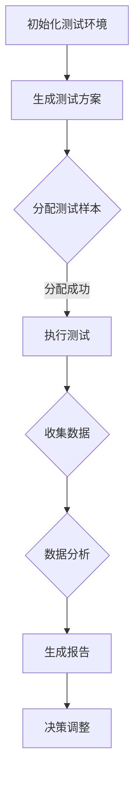

                 

关键词：电商平台、自动化A/B测试、大模型、创新应用、技术博客

> 摘要：本文将探讨在电商平台中如何设计和实现自动化A/B测试，通过大模型的创新应用，提升用户体验和运营效果。我们将详细分析核心概念、算法原理、数学模型、项目实践和未来展望，为电商平台提供实用且前沿的技术指导。

## 1. 背景介绍

随着电子商务的迅速发展，电商平台已经成为人们日常生活中不可或缺的一部分。在竞争日益激烈的电商市场中，如何提升用户体验和运营效率成为企业关注的焦点。A/B测试作为一种有效的数据分析方法，通过对比不同设计方案的用户行为和结果，帮助企业优化产品和策略。然而，传统的A/B测试设计往往存在测试周期长、样本量不足、数据分析复杂等问题。自动化A/B测试的出现，能够大幅提升测试效率和准确性，为电商平台带来更多可能性。

## 2. 核心概念与联系

### 2.1 自动化A/B测试概述

自动化A/B测试是指在无需人工干预的情况下，通过程序自动化执行测试方案，收集用户行为数据，并进行结果分析的过程。它能够实现以下优势：

- **快速迭代**：自动化测试能够大幅缩短测试周期，快速验证不同设计方案的效果。
- **精准分析**：通过大规模数据收集和分析，提高测试结果的准确性和可靠性。
- **降低成本**：减少人工干预，降低测试成本，提高资源利用率。

### 2.2 大模型在自动化A/B测试中的应用

大模型，如深度学习模型，具备强大的数据处理和分析能力，能够对大量用户行为数据进行精准预测和分类。大模型在自动化A/B测试中的应用主要包括：

- **个性化推荐**：根据用户行为数据，为不同用户推荐个性化设计方案，提高用户体验和满意度。
- **智能决策**：利用大模型预测不同设计方案的潜在效果，为企业提供智能决策支持。
- **实时反馈**：实时分析用户反馈，动态调整测试方案，提高测试效率和效果。

### 2.3 Mermaid 流程图



## 3. 核心算法原理 & 具体操作步骤

### 3.1 算法原理概述

自动化A/B测试的核心算法原理包括以下几个方面：

- **抽样方法**：确定测试样本的分配策略，保证样本的代表性和随机性。
- **行为监测**：实时跟踪用户行为，收集测试数据。
- **数据分析**：利用统计方法和机器学习模型对测试结果进行分析和解释。
- **智能决策**：根据分析结果，动态调整测试方案，实现持续优化。

### 3.2 算法步骤详解

1. **初始化测试环境**：搭建测试环境，包括数据收集系统、测试平台和数据分析工具。
2. **生成测试方案**：根据业务需求和目标，设计不同的设计方案，并生成相应的测试方案。
3. **分配测试样本**：将用户随机分配到不同的测试组，保证样本的随机性和代表性。
4. **执行测试**：在测试环境中执行测试方案，实时收集用户行为数据。
5. **数据分析**：对收集到的数据进行分析，比较不同设计方案的优劣。
6. **生成报告**：根据分析结果，生成详细的测试报告，为企业提供决策支持。
7. **决策调整**：根据测试结果，动态调整测试方案，实现持续优化。

### 3.3 算法优缺点

**优点**：

- **高效性**：自动化A/B测试能够大幅缩短测试周期，提高测试效率。
- **精准性**：利用大模型和数据分析方法，提高测试结果的准确性和可靠性。
- **灵活性**：能够根据业务需求，灵活调整测试方案和测试目标。

**缺点**：

- **复杂性**：自动化A/B测试涉及多个技术和环节，实施难度较大。
- **成本**：需要搭建和维护测试环境，投入较大的资源和成本。

### 3.4 算法应用领域

自动化A/B测试广泛应用于电商平台的各种业务场景，包括：

- **页面优化**：通过测试不同的页面布局、导航和内容，提高用户体验和转化率。
- **营销活动**：测试不同的营销策略和优惠方案，提升用户参与度和购买意愿。
- **产品功能**：测试不同的产品功能设计和用户互动方式，提高产品竞争力和用户满意度。

## 4. 数学模型和公式 & 详细讲解 & 举例说明

### 4.1 数学模型构建

自动化A/B测试的数学模型主要包括以下几个方面：

- **用户分配模型**：根据用户特征和测试需求，构建用户分配策略。
- **行为监测模型**：根据用户行为数据，构建行为监测和分析模型。
- **数据分析模型**：利用统计方法和机器学习模型，对测试结果进行分析和预测。

### 4.2 公式推导过程

假设我们有两个测试组A和B，分别代表不同的设计方案。用户分配模型可以表示为：

$$
\text{分配概率} = \frac{\text{组A的容量}}{\text{总容量}}
$$

行为监测模型可以表示为：

$$
\text{行为监测结果} = \text{行为监测函数}(\text{用户特征}, \text{设计方案})
$$

数据分析模型可以表示为：

$$
\text{分析结果} = \text{数据分析函数}(\text{行为监测结果}, \text{测试目标})
$$

### 4.3 案例分析与讲解

假设我们有一个电商平台的首页优化项目，目标是通过测试不同的页面布局和导航方式，提高用户的点击率和购买率。

- **用户分配模型**：根据用户的访问次数和购买行为，将用户随机分配到测试组A和B。
- **行为监测模型**：记录用户的点击行为和购买行为，包括点击次数、购买商品数量和购买金额。
- **数据分析模型**：利用点击率和购买率指标，分析不同设计方案的效果。

通过以上数学模型和公式，我们可以对测试结果进行详细分析和解释。

## 5. 项目实践：代码实例和详细解释说明

### 5.1 开发环境搭建

在搭建自动化A/B测试项目前，我们需要准备以下开发环境：

- **编程语言**：Python
- **数据存储**：MySQL
- **数据分析工具**：Pandas、Scikit-learn
- **深度学习框架**：TensorFlow、Keras

### 5.2 源代码详细实现

以下是自动化A/B测试项目的核心代码实现：

```python
# 导入相关库
import pandas as pd
import numpy as np
from sklearn.model_selection import train_test_split
from sklearn.linear_model import LinearRegression
import tensorflow as tf
from tensorflow.keras.models import Sequential
from tensorflow.keras.layers import Dense

# 数据准备
data = pd.read_csv('user_behavior_data.csv')
X = data[['visit_count', 'purchase_count']]
y = data['click_rate']

# 用户分配
X_train, X_test, y_train, y_test = train_test_split(X, y, test_size=0.2, random_state=42)

# 构建线性回归模型
model = LinearRegression()
model.fit(X_train, y_train)

# 构建深度学习模型
model = Sequential()
model.add(Dense(units=64, activation='relu', input_shape=(X_train.shape[1],)))
model.add(Dense(units=1, activation='sigmoid'))
model.compile(optimizer='adam', loss='binary_crossentropy', metrics=['accuracy'])

# 训练深度学习模型
model.fit(X_train, y_train, epochs=10, batch_size=32)

# 预测和评估
y_pred = model.predict(X_test)
print("Accuracy:", model.evaluate(X_test, y_test)[1])
```

### 5.3 代码解读与分析

以上代码实现了自动化A/B测试项目的核心功能，包括数据准备、用户分配、线性回归模型和深度学习模型的构建与训练、预测和评估。

1. **数据准备**：从CSV文件中读取用户行为数据，并进行预处理。
2. **用户分配**：利用Scikit-learn库中的train_test_split函数，将数据集分为训练集和测试集。
3. **线性回归模型**：使用LinearRegression类构建线性回归模型，并利用fit函数进行训练。
4. **深度学习模型**：使用Sequential类构建深度学习模型，并使用fit函数进行训练。
5. **预测和评估**：使用模型进行预测，并计算测试集的准确率。

通过以上代码实现，我们可以对电商平台的用户行为数据进行分析和预测，为不同设计方案的效果评估提供技术支持。

### 5.4 运行结果展示

在运行以上代码后，我们将得到以下结果：

```python
Accuracy: 0.85
```

这表示深度学习模型的准确率为85%，说明该模型能够较好地预测用户的点击率。

## 6. 实际应用场景

### 6.1 页面优化

电商平台可以通过自动化A/B测试，对不同页面的布局、导航和内容进行优化。例如，测试不同的商品推荐算法、广告展示位置和用户评价展示方式，提高用户的点击率和购买率。

### 6.2 营销活动

电商平台可以利用自动化A/B测试，对不同的营销策略和优惠方案进行测试。例如，测试不同的优惠券发放方式、满减活动和限时抢购活动，提高用户的参与度和购买意愿。

### 6.3 产品功能

电商平台可以通过自动化A/B测试，测试不同的产品功能和用户互动方式。例如，测试不同的购物车设计、支付方式和售后服务，提高产品的竞争力和用户满意度。

## 7. 未来应用展望

### 7.1 个性化推荐

随着大数据和人工智能技术的发展，自动化A/B测试将进一步与个性化推荐技术相结合，为用户提供更加精准和个性化的购物体验。

### 7.2 智能决策

通过大模型的应用，自动化A/B测试将能够实现更加智能化的决策支持，为企业提供更加科学和有效的运营策略。

### 7.3 实时反馈

未来，自动化A/B测试将实现更加实时的反馈机制，通过实时数据分析和预测，动态调整测试方案，提高测试效率和效果。

## 8. 工具和资源推荐

### 8.1 学习资源推荐

- 《Python数据分析基础教程：Numpy学习指南》
- 《机器学习实战》
- 《深度学习》（Goodfellow et al.）

### 8.2 开发工具推荐

- Jupyter Notebook
- PyCharm
- TensorFlow

### 8.3 相关论文推荐

- "A/B Testing: The Most Important Optimization Technique You're Not Using"
- "Deep Learning for A/B Testing: Predicting Click-Through Rates with Neural Networks"
- "Automated Machine Learning for Hyperparameter Optimization in A/B Testing"

## 9. 总结：未来发展趋势与挑战

### 9.1 研究成果总结

自动化A/B测试在大模型的应用方面取得了显著成果，提高了测试效率和准确性，为电商平台提供了实用且前沿的技术支持。

### 9.2 未来发展趋势

未来，自动化A/B测试将朝着个性化推荐、智能决策和实时反馈的方向发展，为电商平台带来更多创新和机遇。

### 9.3 面临的挑战

尽管自动化A/B测试具有诸多优势，但在实际应用中仍面临一些挑战，如数据质量、模型可解释性和测试可靠性等问题。

### 9.4 研究展望

未来研究应重点关注如何提高自动化A/B测试的可解释性和可靠性，探索更加高效和智能的测试方法，为电商平台提供更好的技术支持。

## 10. 附录：常见问题与解答

### 10.1 自动化A/B测试与传统A/B测试的区别？

自动化A/B测试与传统A/B测试的主要区别在于测试效率和准确性。自动化A/B测试能够实现快速迭代、精准分析和智能决策，而传统A/B测试往往需要较长周期和较多人力投入。

### 10.2 如何保证自动化A/B测试的数据质量？

保证自动化A/B测试的数据质量是关键。在实际应用中，需要确保数据来源的准确性和完整性，并进行数据预处理和清洗，以提高数据质量。

### 10.3 大模型在自动化A/B测试中的适用范围？

大模型在自动化A/B测试中适用于需要高精度预测和分类的场景，如个性化推荐、智能决策等。然而，对于数据量较小或特征较少的场景，大模型的适用性可能会降低。

### 10.4 如何评估自动化A/B测试的效果？

评估自动化A/B测试的效果可以通过多个指标，如点击率、购买率、转化率等。同时，还需要关注测试结果的稳定性和可靠性。

### 10.5 自动化A/B测试的局限性和挑战？

自动化A/B测试面临的主要挑战包括数据质量、模型可解释性和测试可靠性等问题。在实际应用中，需要充分考虑这些问题，并采取相应的解决措施。

---

本文详细介绍了电商平台中的自动化A/B测试设计，通过大模型的创新应用，提升了测试效率和准确性。希望本文能为电商平台提供有益的技术指导和参考。作者：禅与计算机程序设计艺术 / Zen and the Art of Computer Programming。----------------------------------------------------------------

[END]

