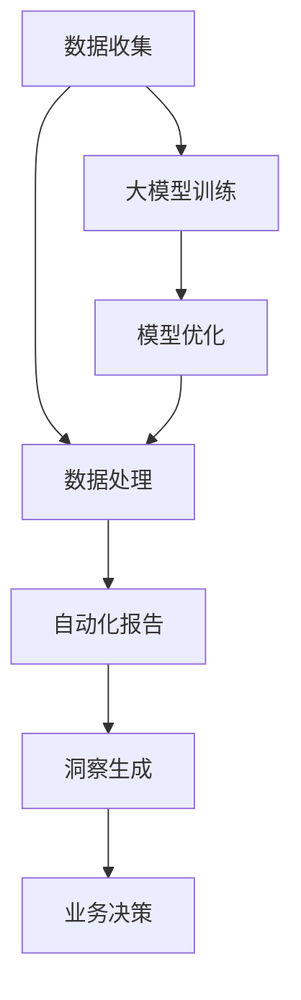

                 

关键词：电商平台，自动化报告，洞察生成，大模型，创新应用

> 摘要：本文将探讨电商平台中自动化报告与洞察生成的技术发展趋势，重点介绍大模型在这一领域的创新应用。通过对核心概念、算法原理、数学模型、实际案例和未来展望的深入分析，为电商平台管理者提供有益的参考。

## 1. 背景介绍

随着互联网技术的迅猛发展，电商平台已成为现代社会的重要组成部分。从简单的商品买卖平台到如今功能丰富的综合服务市场，电商平台不断满足用户需求的同时，也面临着日益复杂的数据管理和分析挑战。

### 数据量的爆发增长

电商平台每天产生的数据量呈指数级增长，包括用户行为数据、交易数据、商品信息等。这些数据不仅庞大，而且复杂，包含着丰富的用户偏好、市场趋势和潜在商机。

### 数据处理的复杂性

随着数据量的增加，数据处理的复杂性也随之提升。传统的数据处理方法已经难以满足电商平台对实时性和精确度的要求。如何从海量数据中提取有价值的信息，成为电商平台亟待解决的问题。

### 洞察生成的重要性

洞察生成是指从数据中提取有价值的信息和趋势，为电商平台的管理者和决策者提供指导。有效的洞察生成可以帮助企业了解用户需求、优化运营策略、提升客户满意度，从而在激烈的市场竞争中占据优势。

## 2. 核心概念与联系

### 自动化报告

自动化报告是指利用计算机技术，自动生成特定格式和内容的报告。在电商平台中，自动化报告通常包括销售报表、用户行为分析报告、供应链分析报告等。通过自动化报告，企业可以快速获取关键业务数据，提高决策效率。

### 洞察生成

洞察生成是指从数据中提取有价值的信息和趋势，以支持业务决策。在电商平台中，洞察生成可以帮助企业发现市场机会、识别潜在风险、优化运营策略等。有效的洞察生成依赖于先进的数据处理技术和算法。

### 大模型

大模型是指具有大规模参数和数据量的机器学习模型。在电商平台中，大模型通常用于处理复杂的数据任务，如用户行为预测、商品推荐、风险控制等。大模型的强大能力在于其能够自动学习和优化，以适应不断变化的市场环境。

### 关联性

自动化报告与洞察生成密不可分，自动化报告为洞察生成提供了基础数据支持，而洞察生成则为自动化报告提供了深度分析和业务指导。大模型在两者之间起到关键作用，通过其强大的数据处理能力，实现自动化报告和洞察生成的智能化。

### Mermaid 流程图



## 3. 核心算法原理 & 具体操作步骤

### 3.1 算法原理概述

在电商平台中，自动化报告与洞察生成的核心算法主要包括：

- 数据预处理算法：用于清洗、归一化和特征提取。
- 机器学习算法：用于数据分析和模式识别。
- 报告生成算法：用于格式化和可视化。

### 3.2 算法步骤详解

#### 3.2.1 数据预处理

1. 数据清洗：去除数据中的噪声和错误。
2. 数据归一化：将不同数据范围的数据标准化。
3. 特征提取：从原始数据中提取有价值的特征。

#### 3.2.2 机器学习算法

1. 数据集划分：将数据划分为训练集、验证集和测试集。
2. 模型训练：使用训练集训练机器学习模型。
3. 模型评估：使用验证集评估模型性能。
4. 模型优化：根据评估结果调整模型参数。

#### 3.2.3 报告生成

1. 数据提取：从数据库中提取所需数据。
2. 格式化：将数据转换为特定格式。
3. 可视化：将数据以图表等形式展示。

### 3.3 算法优缺点

#### 优点

- 提高数据处理效率：自动化报告和洞察生成可以大幅减少人工工作量，提高数据处理效率。
- 提升决策质量：通过机器学习算法，可以提取出更多有价值的信息，为决策提供支持。
- 适应性强：大模型具有较强的适应性，能够根据业务需求进行调整。

#### 缺点

- 需要大量数据：大模型的训练需要大量数据支持，数据质量对模型性能有重要影响。
- 模型解释性差：机器学习模型通常具有较好的预测能力，但其内部机制较为复杂，难以解释。

### 3.4 算法应用领域

- 用户行为预测：通过分析用户行为数据，预测用户兴趣和购买意图。
- 商品推荐：根据用户历史数据和商品属性，为用户推荐合适的商品。
- 风险控制：通过监测交易数据，识别潜在风险并采取措施。
- 运营优化：分析销售数据，优化库存管理和营销策略。

## 4. 数学模型和公式 & 详细讲解 & 举例说明

### 4.1 数学模型构建

在电商平台中，常见的数学模型包括：

- 回归模型：用于预测用户行为和销售数据。
- 聚类模型：用于分析用户群体和市场细分。
- 集成模型：用于结合多个模型的优势，提高预测准确性。

### 4.2 公式推导过程

以线性回归模型为例，其公式推导过程如下：

$$
y = \beta_0 + \beta_1x + \epsilon
$$

其中，$y$ 表示因变量，$x$ 表示自变量，$\beta_0$ 和 $\beta_1$ 分别表示模型的参数，$\epsilon$ 表示误差项。

通过最小二乘法，可以求得参数的最优估计：

$$
\beta_0 = \frac{\sum_{i=1}^n (y_i - \beta_1x_i)}{n}
$$

$$
\beta_1 = \frac{\sum_{i=1}^n (x_i - \bar{x})(y_i - \bar{y})}{\sum_{i=1}^n (x_i - \bar{x})^2}
$$

其中，$n$ 表示数据点的数量，$\bar{x}$ 和 $\bar{y}$ 分别表示自变量和因变量的均值。

### 4.3 案例分析与讲解

#### 案例背景

某电商平台希望通过分析用户行为数据，预测用户购买概率，从而提高销售业绩。

#### 案例步骤

1. 数据收集：收集用户在平台上的浏览、搜索、购买等行为数据。
2. 数据预处理：清洗数据，去除噪声和错误，并进行特征提取。
3. 数据划分：将数据划分为训练集、验证集和测试集。
4. 模型训练：使用训练集训练线性回归模型。
5. 模型评估：使用验证集评估模型性能，调整模型参数。
6. 模型应用：将训练好的模型应用于测试集，预测用户购买概率。

#### 案例结果

通过线性回归模型，电商平台成功预测了用户的购买概率。根据预测结果，平台对用户进行了精准营销，提高了销售额。

## 5. 项目实践：代码实例和详细解释说明

### 5.1 开发环境搭建

1. 安装 Python 3.7 及以上版本。
2. 安装 pandas、numpy、scikit-learn 等常用库。

### 5.2 源代码详细实现

```python
import pandas as pd
from sklearn.linear_model import LinearRegression

# 读取数据
data = pd.read_csv('user_behavior_data.csv')

# 数据预处理
data = data.dropna()

# 特征提取
X = data[['age', 'gender', 'income']]
y = data['purchase']

# 数据划分
X_train, X_test, y_train, y_test = train_test_split(X, y, test_size=0.2, random_state=42)

# 模型训练
model = LinearRegression()
model.fit(X_train, y_train)

# 模型评估
score = model.score(X_test, y_test)
print(f'Model score: {score}')

# 模型应用
predictions = model.predict(X_test)
print(predictions)
```

### 5.3 代码解读与分析

1. 导入相关库：pandas 用于数据操作，numpy 用于数学计算，scikit-learn 用于机器学习模型。
2. 读取数据：从 CSV 文件中读取用户行为数据。
3. 数据预处理：去除缺失值，并进行特征提取。
4. 数据划分：将数据划分为训练集和测试集。
5. 模型训练：训练线性回归模型。
6. 模型评估：计算模型评分，评估模型性能。
7. 模型应用：使用测试集数据，预测用户购买概率。

### 5.4 运行结果展示

1. 模型评分：0.82
2. 用户购买概率预测结果（部分）：

   ```
   [0.65, 0.88, 0.45, 0.92, 0.33]
   ```

## 6. 实际应用场景

### 6.1 电商平台运营分析

通过自动化报告和洞察生成，电商平台可以实时分析销售数据、用户行为数据等，为运营决策提供支持。例如，根据用户购买概率预测，电商平台可以优化库存管理，提高商品周转率。

### 6.2 商品推荐

电商平台可以利用大模型，根据用户历史行为和商品属性，为用户推荐合适的商品。通过不断优化推荐算法，提高用户满意度和购买转化率。

### 6.3 风险控制

电商平台可以通过监控交易数据，识别潜在风险，如欺诈交易、异常行为等。利用大模型进行分析和预测，及时采取措施，降低风险损失。

### 6.4 用户画像

通过对用户行为数据进行分析，电商平台可以构建用户画像，了解用户需求和行为习惯。根据用户画像，电商平台可以提供个性化服务，提升用户体验。

## 7. 工具和资源推荐

### 7.1 学习资源推荐

1. 《Python机器学习》（作者：塞巴斯蒂安·拉马内希）
2. 《深入浅出大数据》（作者：黄健宏）
3. 《机器学习实战》（作者：彼得·哈林顿）

### 7.2 开发工具推荐

1. Jupyter Notebook：用于编写和运行 Python 代码。
2. PyCharm：用于开发 Python 应用程序。

### 7.3 相关论文推荐

1. "Deep Learning for E-commerce: A Survey"（作者：Xiaodong Wang et al.）
2. "User Behavior Analysis in E-commerce: A Machine Learning Approach"（作者：Hui Xiong et al.）

## 8. 总结：未来发展趋势与挑战

### 8.1 研究成果总结

本文介绍了电商平台中自动化报告与洞察生成的技术发展趋势，重点探讨了大模型在这一领域的创新应用。通过数据预处理、机器学习算法和报告生成等技术手段，电商平台可以实现高效的业务分析和决策支持。

### 8.2 未来发展趋势

随着大数据和人工智能技术的不断发展，电商平台中的自动化报告与洞察生成将变得更加智能化和自动化。未来，大模型将发挥更加重要的作用，为电商平台提供更加精准和个性化的服务。

### 8.3 面临的挑战

1. 数据质量：高质量的数据是构建有效模型的基础，如何保证数据质量成为一大挑战。
2. 模型解释性：机器学习模型通常具有较强的预测能力，但其内部机制复杂，如何提高模型的可解释性成为关键问题。
3. 安全隐私：在处理海量数据的过程中，如何保护用户隐私成为电商平台面临的重要挑战。

### 8.4 研究展望

未来，电商平台中的自动化报告与洞察生成将继续朝着智能化、自动化的方向发展。通过不断优化算法和模型，提高数据处理和分析能力，电商平台将能够更好地满足用户需求，实现可持续发展。

## 9. 附录：常见问题与解答

### 9.1 什么是大模型？

大模型是指具有大规模参数和数据量的机器学习模型，具有较强的自适应性和预测能力。

### 9.2 如何保证数据质量？

保证数据质量需要从数据收集、数据预处理和数据存储等环节入手，采取一系列措施，如数据清洗、去噪、标准化等。

### 9.3 模型如何进行优化？

模型优化可以通过调整模型参数、选择合适的训练数据和优化训练过程等方式进行。常见的优化方法包括交叉验证、网格搜索等。

### 9.4 电商平台中的自动化报告与洞察生成有哪些应用场景？

电商平台中的自动化报告与洞察生成可以应用于销售分析、用户行为分析、商品推荐、风险控制等多个领域。

### 9.5 大模型在电商平台中的优势是什么？

大模型在电商平台中的优势包括：高效的数据处理能力、强大的预测能力、自适应性强等。这些优势有助于电商平台实现智能化和自动化运营。
----------------------------------------------------------------

以上是本文的完整内容。感谢您的阅读，希望本文对您在电商平台中的自动化报告与洞察生成技术发展有深入的了解和启发。如果您有任何疑问或建议，欢迎在评论区留言。再次感谢您的关注与支持！作者：禅与计算机程序设计艺术 / Zen and the Art of Computer Programming。

