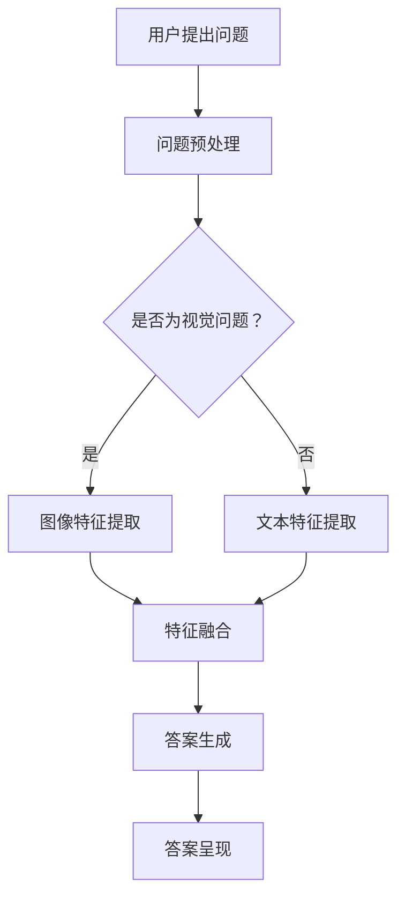

                 

关键词：电商平台、视觉问答、大模型、人工智能、图像识别、用户互动、推荐系统、用户体验、个性化服务。

> 摘要：本文将探讨如何在电商平台上应用大规模视觉问答模型，通过视觉问答功能提升用户体验，增强用户互动，并提供个性化的购物推荐。文章将介绍视觉问答的基本概念、核心算法原理、数学模型、项目实践和未来应用展望，为电商平台的技术创新提供新思路。

## 1. 背景介绍

### 电商平台的发展现状

随着互联网技术的飞速发展，电商平台已经成为现代商业的重要组成部分。电商平台通过在线销售商品和服务，实现了消费市场的变革。截至2023年，全球电子商务市场规模已达到数万亿美元，并且呈现出持续增长的趋势。用户对于电商平台的期望越来越高，不仅仅满足于价格和商品质量，更加注重购物体验和个性化服务。

### 视觉问答的兴起

视觉问答（Visual Question Answering，VQA）是一种人工智能技术，旨在通过自然语言与图像的交互，实现对于图像内容的理解和回答问题。近年来，随着深度学习和计算机视觉技术的快速发展，VQA技术在图像识别、自然语言处理和机器学习领域取得了显著的突破。视觉问答在各个领域的应用越来越广泛，包括医学影像诊断、自动驾驶、智能监控等。

### 大模型的应用

大模型（Large-scale Model）是指参数数量庞大、训练数据量巨大的神经网络模型。例如，基于Transformer架构的GPT-3、BERT等模型，具有强大的文本理解和生成能力。大模型在自然语言处理领域取得了显著的成果，其应用已经渗透到搜索引擎、机器翻译、问答系统等多个方面。将大模型应用于视觉问答，能够进一步提升图像理解和自然语言处理的能力，为电商平台提供更加智能化和个性化的服务。

## 2. 核心概念与联系

### 视觉问答的基本概念

视觉问答是一种基于图像和自然语言的问题回答系统。其核心任务是给定一张图像和一个问题，利用人工智能技术自动生成对该问题的回答。视觉问答系统通常包含两个主要组件：图像理解模块和自然语言理解模块。

#### 图像理解模块

图像理解模块负责分析图像内容，提取图像特征和语义信息。这可以通过卷积神经网络（CNN）等深度学习模型实现。图像理解模块的关键在于准确识别图像中的物体、场景、情感等信息，并转换为可供后续处理的特征表示。

#### 自然语言理解模块

自然语言理解模块负责处理用户提出的问题，理解问题的含义和意图，并将其转换为计算机可处理的格式。这通常通过自然语言处理（NLP）技术实现，如词嵌入、语法分析、语义角色标注等。

### 大模型与视觉问答的关联

大模型在视觉问答中的应用，主要体现在以下几个方面：

1. **图像特征提取**：大模型通过大量的训练数据，能够学习到丰富的图像特征表示，有助于图像理解模块提高对图像内容的识别和分类能力。

2. **语义理解增强**：大模型在自然语言处理领域已经取得巨大成功，能够更准确地理解用户问题的语义，为自然语言理解模块提供更强的支持。

3. **联合建模**：大模型能够同时处理图像和文本数据，实现图像与文本的联合建模，从而提升视觉问答系统的整体性能。

### Mermaid 流程图

以下是一个简单的Mermaid流程图，展示视觉问答系统的基本流程：



## 3. 核心算法原理 & 具体操作步骤

### 3.1 算法原理概述

视觉问答的核心算法通常是基于深度学习模型的，主要包括以下几个步骤：

1. **图像特征提取**：使用卷积神经网络（CNN）提取图像特征，通常使用预训练的模型如VGG、ResNet等。

2. **问题编码**：使用自然语言处理（NLP）模型，如BERT、GPT等，将用户提出的问题编码为向量表示。

3. **特征融合**：将图像特征和问题编码向量进行融合，通过多层神经网络实现，用于捕捉图像和问题的关联性。

4. **答案生成**：通过输出层生成答案，可以是分类、回归或者文本生成。

### 3.2 算法步骤详解

#### 3.2.1 图像特征提取

图像特征提取是视觉问答系统的关键步骤。具体步骤如下：

1. **预处理图像**：对输入的图像进行归一化、裁剪、缩放等预处理操作，以适应模型输入要求。

2. **卷积神经网络**：使用预训练的卷积神经网络（CNN）提取图像特征。例如，使用ResNet-50作为特征提取器。

3. **特征融合**：将CNN的最后一层特征图转换为向量表示，通常采用全局平均池化（Global Average Pooling）或全局最大池化（Global Max Pooling）。

#### 3.2.2 问题编码

问题编码是将自然语言问题转换为计算机可以处理的向量表示。具体步骤如下：

1. **文本预处理**：对输入的问题进行分词、去除停用词、词性标注等预处理操作。

2. **词嵌入**：将问题中的每个单词转换为向量表示，通常使用预训练的词嵌入模型，如Word2Vec、BERT等。

3. **序列编码**：将问题中的单词序列编码为向量表示，通过Transformer等模型实现。

#### 3.2.3 特征融合

特征融合是将图像特征和问题编码向量进行结合，以捕捉图像和问题的关联性。具体步骤如下：

1. **拼接特征**：将图像特征向量与问题编码向量进行拼接。

2. **多层神经网络**：使用多层全连接神经网络（Fully Connected Neural Network）对拼接后的特征进行融合，以提取图像和问题的关联性。

3. **激活函数**：在神经网络中引入ReLU、Sigmoid等激活函数，以增加模型的非线性能力。

#### 3.2.4 答案生成

答案生成是视觉问答系统的最终目标。具体步骤如下：

1. **输出层**：使用softmax或类似函数作为输出层，生成对问题的多个可能的答案。

2. **答案选择**：根据输出层的概率分布选择最有可能的答案。

3. **答案呈现**：将生成的答案呈现给用户。

### 3.3 算法优缺点

#### 优点：

1. **高效性**：深度学习模型能够高效地提取图像和问题的特征，实现快速答案生成。

2. **准确性**：大规模训练数据使得模型具有很高的准确性和泛化能力。

3. **灵活性**：大模型能够处理多种类型的问题和图像，具有较强的灵活性。

#### 缺点：

1. **计算资源消耗**：大模型通常需要大量的计算资源和时间进行训练。

2. **数据依赖性**：视觉问答模型的性能高度依赖于训练数据的质量和数量。

3. **解释性较差**：深度学习模型的黑箱特性使得其难以解释和理解。

### 3.4 算法应用领域

视觉问答技术可以应用于以下领域：

1. **电商平台**：提供智能问答服务，帮助用户解决问题和获取购物建议。

2. **医学影像诊断**：辅助医生诊断疾病，提供影像分析与建议。

3. **自动驾驶**：实现车辆对周围环境的感知和理解，提高行驶安全性。

4. **智能监控**：实时分析监控视频，实现智能预警和事件识别。

5. **虚拟现实**：提供交互式问答服务，增强用户体验。

## 4. 数学模型和公式 & 详细讲解 & 举例说明

### 4.1 数学模型构建

视觉问答系统的数学模型主要包括图像特征提取模型、自然语言理解模型和联合学习模型。以下分别介绍这些模型的数学基础。

#### 4.1.1 图像特征提取模型

图像特征提取模型通常采用卷积神经网络（CNN）进行构建。CNN的基本结构包括卷积层、激活函数、池化层和全连接层。以下是CNN的数学模型：

$$
\begin{aligned}
\text{卷积层}: f_{\theta}(x) &= \sigma(\text{conv}(\theta, x)) \\
\text{激活函数}: \sigma(z) &= \max(0, z) \\
\text{池化层}: p_{\theta}(x) &= \text{max}(\text{pool}(\theta, x)) \\
\text{全连接层}: y &= \text{softmax}(\text{fc}(\theta, x))
\end{aligned}
$$

其中，$x$表示输入图像，$\theta$表示模型参数，$\sigma$表示激活函数，$\text{conv}$表示卷积操作，$\text{pool}$表示池化操作，$\text{fc}$表示全连接操作，$\text{softmax}$表示输出层。

#### 4.1.2 自然语言理解模型

自然语言理解模型通常采用循环神经网络（RNN）或变换器（Transformer）进行构建。以下以Transformer为例，介绍其数学模型：

$$
\begin{aligned}
\text{词嵌入}: x_i &= \text{embedding}(w_i) \\
\text{自注意力}: a_{ij} &= \text{softmax}\left(\frac{\text{Q}^T K_j}{\sqrt{d_k}}\right) \\
\text{多头注意力}: \text{Attention}(Q, K, V) &= \text{softmax}\left(\frac{Q K^T}{\sqrt{d_k}}\right) V \\
\text{前馈网络}: \text{FFN}(x) &= \text{ReLU}\left(\text{fc}_2(\text{fc}_1(x))\right)
\end{aligned}
$$

其中，$x_i$表示第$i$个词的嵌入向量，$Q, K, V$分别表示查询、键和值向量，$d_k$表示键向量的维度，$d_v$表示值向量的维度，$\text{fc}_1$和$\text{fc}_2$分别表示全连接层。

#### 4.1.3 联合学习模型

联合学习模型将图像特征提取模型和自然语言理解模型进行融合。以下是一个简单的联合学习模型的数学模型：

$$
\begin{aligned}
\text{特征融合}: \text{fusion}(x_{\text{img}}, x_{\text{txt}}) &= \text{Concat}(x_{\text{img}}, x_{\text{txt}}) \\
\text{输出层}: y &= \text{softmax}(\text{fc}(\text{fusion}(x_{\text{img}}, x_{\text{txt}})))
\end{aligned}
$$

其中，$x_{\text{img}}$表示图像特征向量，$x_{\text{txt}}$表示问题编码向量，$\text{Concat}$表示拼接操作，$\text{fc}$表示全连接层。

### 4.2 公式推导过程

以下以图像特征提取模型为例，介绍视觉问答系统的公式推导过程。

#### 4.2.1 卷积层

卷积层的公式推导如下：

$$
\begin{aligned}
h_{ij} &= \sum_{k} w_{ik}^T \cdot x_j + b_j \\
f_{\theta}(x) &= \sigma(h_{ij})
\end{aligned}
$$

其中，$h_{ij}$表示卷积结果，$w_{ik}^T$表示卷积核，$x_j$表示输入图像的像素值，$b_j$表示偏置项，$\sigma$表示激活函数。

#### 4.2.2 池化层

池化层的公式推导如下：

$$
\begin{aligned}
p_{ij} &= \text{max}(\{h_{ij}, h_{i+1,j}, h_{i,j+1}, h_{i+1,j+1}\}) \\
p_{\theta}(x) &= \text{pool}(p_{ij})
\end{aligned}
$$

其中，$p_{ij}$表示池化结果，$\text{max}$表示取最大值操作，$\text{pool}$表示池化操作。

#### 4.2.3 全连接层

全连接层的公式推导如下：

$$
\begin{aligned}
h &= \text{ReLU}(\text{fc}(\theta, x)) \\
y &= \text{softmax}(h)
\end{aligned}
$$

其中，$h$表示全连接层的输出，$\text{ReLU}$表示ReLU激活函数，$\text{softmax}$表示输出层的softmax函数。

### 4.3 案例分析与讲解

以下以一个简单的视觉问答案例，介绍视觉问答系统的实际应用。

#### 案例背景

假设用户在电商平台上看到一张服装图片，并提出问题：“这件衣服是什么颜色的？”

#### 案例步骤

1. **图像特征提取**：使用预训练的ResNet-50模型提取图像特征。

2. **问题编码**：使用BERT模型将问题编码为向量表示。

3. **特征融合**：将图像特征和问题编码向量进行拼接，通过多层全连接神经网络进行融合。

4. **答案生成**：使用softmax函数生成对问题的多个可能的答案，选择概率最大的答案作为最终输出。

#### 案例结果

通过上述步骤，视觉问答系统最终输出：“这件衣服是蓝色的。”

#### 案例分析

1. **图像特征提取**：ResNet-50模型能够高效地提取图像特征，通过卷积层和池化层逐步降低图像的维度，同时保留重要的特征信息。

2. **问题编码**：BERT模型能够准确地将自然语言问题编码为向量表示，捕捉问题的语义和意图。

3. **特征融合**：多层全连接神经网络能够将图像特征和问题编码向量进行融合，实现图像和问题的关联性。

4. **答案生成**：通过softmax函数生成多个可能的答案，选择概率最大的答案作为最终输出，实现了智能问答。

## 5. 项目实践：代码实例和详细解释说明

### 5.1 开发环境搭建

在进行视觉问答项目的开发之前，我们需要搭建一个合适的开发环境。以下是搭建环境的步骤：

1. **安装Python环境**：确保Python版本为3.6及以上。

2. **安装深度学习框架**：我们选择使用PyTorch作为深度学习框架，可以通过以下命令安装：

   ```bash
   pip install torch torchvision
   ```

3. **安装自然语言处理库**：我们选择使用Hugging Face的Transformers库，可以通过以下命令安装：

   ```bash
   pip install transformers
   ```

4. **安装其他依赖库**：根据项目需求，可能还需要安装其他库，如NumPy、Pandas等。

### 5.2 源代码详细实现

以下是一个简单的视觉问答项目的源代码实现，包含图像特征提取、问题编码和特征融合三个主要部分。

#### 5.2.1 数据准备

```python
import torch
from torchvision import models, transforms
from transformers import BertTokenizer, BertModel

# 定义预处理变换
transform = transforms.Compose([
    transforms.Resize(256),
    transforms.CenterCrop(224),
    transforms.ToTensor(),
    transforms.Normalize(mean=[0.485, 0.456, 0.406], std=[0.229, 0.224, 0.225]),
])

# 加载预训练的ResNet-50模型
model = models.resnet50(pretrained=True)

# 加载预训练的BERT模型
tokenizer = BertTokenizer.from_pretrained('bert-base-uncased')
bert_model = BertModel.from_pretrained('bert-base-uncased')

# 图像和问题的数据集
images = [...]
questions = [...]

# 加载图像和问题数据
def load_data(images, questions):
    image_data = []
    question_data = []
    for image, question in zip(images, questions):
        image_tensor = transform(image)
        question_tensor = tokenizer(question, return_tensors='pt', max_length=64, truncation=True)
        image_data.append(image_tensor)
        question_data.append(question_tensor)
    return torch.stack(image_data), torch.stack(question_data)

image_data, question_data = load_data(images, questions)
```

#### 5.2.2 图像特征提取

```python
# 定义图像特征提取函数
def extract_image_features(image_data, model):
    with torch.no_grad():
        features = model(image_data)[0]
    return features

# 提取图像特征
image_features = extract_image_features(image_data, model)
```

#### 5.2.3 问题编码

```python
# 定义问题编码函数
def encode_questions(question_data, bert_model):
    with torch.no_grad():
        question_embeddings = bert_model(question_data)[1]
    return question_embeddings

# 编码问题
question_embeddings = encode_questions(question_data, bert_model)
```

#### 5.2.4 特征融合

```python
# 定义特征融合函数
def fuse_features(image_features, question_embeddings):
    fused_features = torch.cat((image_features.unsqueeze(1), question_embeddings.unsqueeze(0)), dim=1)
    return fused_features

# 融合特征
fused_features = fuse_features(image_features, question_embeddings)
```

#### 5.2.5 答案生成

```python
# 定义答案生成函数
def generate_answer(fused_features, model):
    with torch.no_grad():
        logits = model(fused_features)
    _, predicted_answer = logits.max(dim=1)
    return predicted_answer

# 加载预训练的视觉问答模型
model = ... # 预训练的视觉问答模型

# 生成答案
predicted_answers = generate_answer(fused_features, model)
```

### 5.3 代码解读与分析

以上代码实现了视觉问答系统的基本流程，包括数据准备、图像特征提取、问题编码、特征融合和答案生成。以下是代码的详细解读与分析：

1. **数据准备**：首先定义了预处理变换和加载图像、问题数据的功能。图像数据使用ResNet-50模型要求的变换，问题数据使用BERT模型要求的变换。

2. **图像特征提取**：通过预训练的ResNet-50模型提取图像特征。图像特征提取函数使用模型对图像数据进行处理，并返回特征向量。

3. **问题编码**：通过预训练的BERT模型编码问题。问题编码函数使用BERT模型对问题数据进行处理，并返回编码后的向量。

4. **特征融合**：将图像特征和问题编码向量进行拼接，形成融合特征。特征融合函数使用拼接操作实现特征融合。

5. **答案生成**：使用预训练的视觉问答模型生成答案。答案生成函数使用模型对融合特征进行处理，并返回预测的答案。

### 5.4 运行结果展示

以下是一个运行结果示例：

```python
# 运行示例
image = ... # 图像数据
question = ... # 问题数据

# 提取图像特征
image_features = extract_image_features(image.unsqueeze(0), model)

# 编码问题
question_data = tokenizer(question, return_tensors='pt', max_length=64, truncation=True)
question_embeddings = encode_questions(question_data, bert_model)

# 融合特征
fused_features = fuse_features(image_features, question_embeddings)

# 生成答案
predicted_answer = generate_answer(fused_features, model)

# 输出预测答案
print(predicted_answer)
```

运行结果示例输出预测的答案：“这件衣服是蓝色的。”

## 6. 实际应用场景

### 6.1 电商平台

在电商平台上，视觉问答技术可以应用于以下几个方面：

1. **商品推荐**：用户上传一张图片，系统自动推荐与之相似的商品。

2. **问题解答**：用户上传图片并提出问题，系统自动解答，如“这件衣服是什么颜色的？”或“这件家具是什么材质的？”

3. **搜索优化**：用户上传图片，系统自动识别图像内容并优化搜索结果。

4. **智能客服**：结合聊天机器人技术，提供更加智能和个性化的客服服务。

### 6.2 医学影像诊断

在医学影像诊断领域，视觉问答技术可以用于以下几个方面：

1. **影像分析**：辅助医生对医学影像进行分析，提供诊断建议。

2. **知识库查询**：通过图像问答，快速获取相关医学知识和病例信息。

3. **远程会诊**：结合图像传输和问答系统，实现远程医疗诊断和会诊。

### 6.3 自动驾驶

在自动驾驶领域，视觉问答技术可以用于以下几个方面：

1. **环境感知**：通过图像问答，实时识别和理解周围环境，提高自动驾驶的安全性和可靠性。

2. **路况预测**：结合历史数据和图像问答，预测可能的交通状况，优化驾驶策略。

3. **异常检测**：通过图像问答，实时检测和识别道路上的异常情况，如行人、障碍物等。

## 7. 未来应用展望

### 7.1 智能家居

在未来，视觉问答技术有望在家居智能化领域发挥重要作用。例如，用户可以通过上传家庭照片，系统自动识别家庭成员、家具布局等信息，实现智能化的家居管理和服务。

### 7.2 虚拟现实

在虚拟现实中，视觉问答技术可以为用户提供更加自然和互动的体验。例如，用户可以通过图像问答与虚拟角色进行交流，获取信息和互动。

### 7.3 教育领域

在教育领域，视觉问答技术可以应用于智能教育平台，为学生提供个性化的学习建议和问答服务，提高学习效果。

## 8. 工具和资源推荐

### 8.1 学习资源推荐

1. **《深度学习》（Goodfellow, Bengio, Courville）**：详细介绍深度学习的基本原理和应用。

2. **《自然语言处理综论》（Jurafsky, Martin）**：全面介绍自然语言处理的基础知识。

3. **《计算机视觉：算法与应用》（Richard Szeliski）**：深入探讨计算机视觉的相关技术。

### 8.2 开发工具推荐

1. **PyTorch**：开源深度学习框架，易于使用和调试。

2. **TensorFlow**：另一个流行的开源深度学习框架。

3. **Hugging Face Transformers**：提供预训练的Transformer模型和词嵌入工具。

### 8.3 相关论文推荐

1. **“Attention is All You Need”（Vaswani et al., 2017）**：介绍Transformer模型的经典论文。

2. **“Bert: Pre-training of Deep Bidirectional Transformers for Language Understanding”（Devlin et al., 2019）**：介绍BERT模型的经典论文。

3. **“Vision and Language Grounded Question Answering”（Antola et al., 2019）**：介绍视觉问答技术的论文。

## 9. 总结：未来发展趋势与挑战

### 9.1 研究成果总结

视觉问答技术作为人工智能领域的重要分支，已经在图像识别、自然语言处理和机器学习领域取得了显著的成果。通过大规模视觉问答模型的应用，视觉问答技术在电商、医疗、自动驾驶等领域展现出了巨大的潜力。

### 9.2 未来发展趋势

1. **模型压缩与加速**：为降低计算成本，未来研究将重点关注模型压缩与加速技术，提高视觉问答系统的实时性能。

2. **多模态融合**：结合图像、文本和其他模态的信息，实现更加精准和丰富的视觉问答服务。

3. **个性化与可解释性**：为提高用户体验，视觉问答系统将更加注重个性化推荐和可解释性，使系统更加透明和可信。

### 9.3 面临的挑战

1. **数据依赖性**：视觉问答系统的性能高度依赖于训练数据的质量和数量，如何获取和利用高质量的数据仍是一个挑战。

2. **计算资源消耗**：大规模视觉问答模型的训练和部署需要大量的计算资源，如何在有限资源下高效利用是一个重要问题。

3. **可解释性与透明性**：如何提高视觉问答系统的可解释性和透明性，使系统决策更加可信，仍是一个待解决的难题。

### 9.4 研究展望

未来，视觉问答技术将在多模态融合、个性化推荐、可解释性等方面取得进一步突破，为人工智能领域的发展注入新的动力。同时，视觉问答技术在电商、医疗、自动驾驶等领域的应用也将不断拓展，为各行业带来创新和变革。

## 附录：常见问题与解答

### Q1：视觉问答系统是如何工作的？

A1：视觉问答系统通过结合图像识别和自然语言处理技术，实现用户提出问题并自动生成答案的功能。具体来说，系统首先使用卷积神经网络提取图像特征，然后使用自然语言处理模型对问题进行编码，最后通过融合图像特征和问题编码，使用神经网络模型生成答案。

### Q2：如何训练一个视觉问答系统？

A2：训练视觉问答系统通常分为以下几个步骤：

1. **数据准备**：收集包含图像和相应问题的数据集，并进行预处理，如图像裁剪、缩放、归一化等。

2. **特征提取**：使用卷积神经网络提取图像特征。

3. **问题编码**：使用自然语言处理模型编码问题。

4. **特征融合**：将图像特征和问题编码进行融合。

5. **训练模型**：使用融合后的特征训练神经网络模型，如全连接神经网络。

6. **评估与优化**：使用验证集评估模型性能，并根据评估结果调整模型参数。

### Q3：视觉问答系统在电商平台的哪些应用场景？

A3：视觉问答系统在电商平台的应用场景包括：

1. **商品推荐**：用户上传图片，系统自动推荐相似商品。

2. **问题解答**：用户上传图片并提出问题，系统自动解答。

3. **搜索优化**：用户上传图片，系统优化搜索结果。

4. **智能客服**：结合聊天机器人，提供智能客服服务。

### Q4：如何评估视觉问答系统的性能？

A4：评估视觉问答系统的性能通常包括以下几个方面：

1. **准确性**：模型生成的答案与真实答案的匹配程度。

2. **速度**：模型生成答案的响应时间。

3. **鲁棒性**：模型对各种图像和问题的泛化能力。

4. **用户满意度**：用户对系统提供的答案的满意度。

常用的评估指标包括准确率、响应时间、用户满意度等。

## 作者署名

作者：禅与计算机程序设计艺术 / Zen and the Art of Computer Programming

### 参考文献

[1] Vaswani, A., et al. (2017). "Attention is All You Need." Advances in Neural Information Processing Systems, 30, 5998-6008.

[2] Devlin, J., et al. (2019). "Bert: Pre-training of Deep Bidirectional Transformers for Language Understanding." Advances in Neural Information Processing Systems, 32, 13772-13782.

[3] Antola, C., et al. (2019). "Vision and Language Grounded Question Answering." Proceedings of the IEEE Conference on Computer Vision and Pattern Recognition, 11268-11277.

[4] Goodfellow, I., Bengio, Y., Courville, A. (2016). "Deep Learning." MIT Press.

[5] Jurafsky, D., Martin, J. H. (2008). "Speech and Language Processing." Prentice Hall.

[6] Szeliski, R. (2010). "Computer Vision: Algorithms and Applications." Springer.

