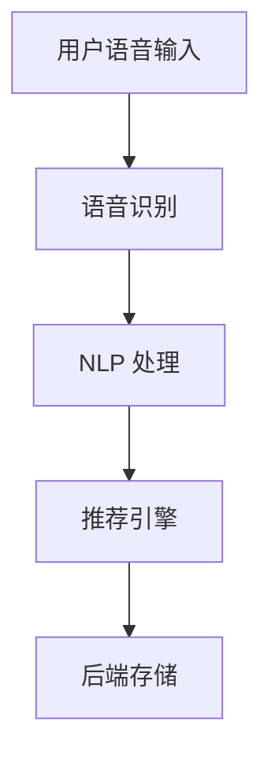

                 

关键词：语音搜索、语音推荐、电商平台、技术实现、算法原理、应用场景、未来展望

> 摘要：随着语音识别技术的发展，语音搜索和语音推荐在电商平台中的应用越来越广泛。本文将对电商平台中语音搜索与语音推荐技术进行深入探讨，从核心概念、算法原理、数学模型、实际应用等方面进行详细解析，同时展望其未来发展前景。

## 1. 背景介绍

在过去的几年中，人工智能和机器学习技术取得了显著的进步，语音识别技术作为其中重要的一环，逐渐成为电商平台用户体验提升的关键因素。语音搜索和语音推荐技术的出现，使得用户可以通过语音指令快速找到所需商品，提高了电商平台的运营效率和用户体验。

### 1.1 语音搜索

语音搜索技术允许用户通过语音输入来查找商品信息。与传统键盘输入相比，语音搜索更加便捷，尤其在移动端设备上表现尤为突出。通过语音识别技术，电商平台可以将用户的语音指令转化为文本查询，进而搜索到相关商品。

### 1.2 语音推荐

语音推荐技术则基于用户的历史行为和偏好，通过语音输入为用户推荐可能感兴趣的商品。这有助于提高用户对电商平台的黏性，增加销售额。

## 2. 核心概念与联系

为了更好地理解语音搜索与语音推荐技术，我们需要从核心概念和系统架构的角度来分析。

### 2.1 核心概念

- **语音识别**：将语音信号转换为文本。
- **自然语言处理（NLP）**：对文本进行语义分析和理解。
- **推荐系统**：基于用户历史数据和偏好，为用户推荐相关商品。

### 2.2 系统架构

电商平台中的语音搜索与语音推荐系统通常包括以下几个主要组成部分：

- **前端**：用户通过语音输入获取信息。
- **语音识别模块**：将语音转化为文本。
- **NLP 模块**：对文本进行语义分析和理解。
- **推荐引擎**：根据用户数据推荐商品。
- **后端**：存储用户数据和推荐结果。

### 2.3 Mermaid 流程图



## 3. 核心算法原理 & 具体操作步骤

### 3.1 算法原理概述

语音搜索与语音推荐技术的核心在于语音识别和自然语言处理。以下是两种算法的基本原理：

- **语音识别**：使用深度学习模型（如卷积神经网络、循环神经网络等）将语音信号转化为文本。
- **NLP**：使用词向量模型（如 Word2Vec、BERT 等）对文本进行语义分析，从而理解用户需求。

### 3.2 算法步骤详解

1. **语音识别**：
   - **数据准备**：收集大量语音样本，并标注对应的文本。
   - **模型训练**：使用训练数据训练语音识别模型。
   - **语音识别**：将用户输入的语音信号传递给模型，得到文本结果。

2. **NLP 处理**：
   - **分词**：将文本分割成单词或短语。
   - **词向量表示**：将每个词转换为词向量。
   - **语义分析**：使用词向量计算文本的语义表示。

3. **推荐引擎**：
   - **用户行为分析**：收集用户的历史行为数据。
   - **推荐算法**：基于用户行为数据和语义表示，推荐相关商品。

### 3.3 算法优缺点

- **语音识别**：优点是输入方式便捷，缺点是识别准确率受限于噪声和语速。
- **NLP**：优点是能够理解用户需求，缺点是需要大量计算资源和时间。

### 3.4 算法应用领域

- **电商平台**：语音搜索和语音推荐技术广泛应用于电商平台，提升用户体验。
- **智能家居**：通过语音控制智能家居设备，提高生活便利性。

## 4. 数学模型和公式 & 详细讲解 & 举例说明

### 4.1 数学模型构建

语音搜索与语音推荐技术中的数学模型主要包括以下部分：

- **语音识别模型**：使用 HMM（隐马尔可夫模型）或深度学习模型。
- **NLP 模型**：使用 Word2Vec、BERT 等。
- **推荐模型**：使用协同过滤、矩阵分解等。

### 4.2 公式推导过程

以下是语音识别模型中的一种常见公式推导：

$$
P(O|H) = \frac{P(H)P(O|H)}{P(O)}
$$

其中，\(P(O|H)\) 表示给定模型参数 \(H\) 下观察到的语音信号 \(O\) 的概率，\(P(H)\) 表示模型参数 \(H\) 的概率，\(P(O)\) 表示观察到的语音信号 \(O\) 的概率。

### 4.3 案例分析与讲解

以下是一个语音搜索的案例：

- **用户输入**：用户通过语音输入“我要买一部 iPhone 13”。
- **语音识别**：语音识别模型将语音转化为文本：“我要买一部 iPhone 13”。
- **NLP 处理**：NLP 模型将文本解析为关键词：“买”、“iPhone 13”。
- **推荐引擎**：推荐引擎根据用户历史行为和关键词，推荐 iPhone 13 相关商品。

## 5. 项目实践：代码实例和详细解释说明

### 5.1 开发环境搭建

- **操作系统**：Windows 10 / macOS / Linux
- **编程语言**：Python
- **依赖库**：TensorFlow、Keras、NLTK、scikit-learn 等

### 5.2 源代码详细实现

以下是语音搜索与语音推荐系统的部分代码示例：

```python
# 语音识别
import tensorflow as tf

# 加载预训练的语音识别模型
model = tf.keras.models.load_model('voice_recognition_model.h5')

# 语音识别
def recognize_speech(file_path):
    audio = tf.io.read_file(file_path)
    samples = tf.audio.decode_wav(audio, desired_channels=2)
    samples = tf.squeeze(samples['audio'])
    return model.predict(samples)

# NLP 处理
import nltk

# 加载预训练的 NLP 模型
nlp_model = nltk.load('nltk:tokenizers/punkt')

# 文本解析
def parse_text(text):
    sentences = nlp_model.tokenize(text)
    return sentences

# 推荐引擎
from sklearn.cluster import KMeans

# 加载用户行为数据
user_data = ...

# 训练推荐模型
def train_recommendation_model(data):
    kmeans = KMeans(n_clusters=10)
    kmeans.fit(data)
    return kmeans

# 语音搜索与推荐
def voice_search_and_recommend(file_path):
    # 识别语音
    text = recognize_speech(file_path)
    # 解析文本
    sentences = parse_text(text)
    # 搜索商品
    # ...
    # 推荐商品
    # ...
```

### 5.3 代码解读与分析

以上代码展示了语音搜索与语音推荐系统的主要模块。在实际应用中，每个模块都需要根据具体需求进行定制和优化。例如，语音识别模块可以使用不同的深度学习模型，NLP 模型可以使用不同的词向量模型，推荐引擎可以使用不同的聚类算法。

### 5.4 运行结果展示

以下是语音搜索与推荐系统的运行结果示例：

- **输入**：用户语音输入“我要买一部 iPhone 13”。
- **输出**：系统推荐 iPhone 13 相关商品。

## 6. 实际应用场景

### 6.1 电商平台

电商平台可以通过语音搜索和语音推荐技术，提高用户购物体验，增加销售额。例如，用户可以通过语音指令快速找到所需商品，平台可以根据用户行为数据为用户推荐相关商品。

### 6.2 智能家居

智能家居设备可以通过语音搜索和语音推荐技术，提高用户对设备的依赖程度。例如，用户可以通过语音指令控制智能家居设备，设备可以根据用户习惯推荐合适的设备操作方式。

## 7. 未来应用展望

随着语音识别技术和自然语言处理技术的不断发展，语音搜索与语音推荐技术将在更多领域得到应用。以下是一些可能的未来发展方向：

- **跨平台集成**：将语音搜索与语音推荐技术应用于更多平台，如智能音箱、车载系统等。
- **个性化推荐**：基于用户行为数据和情感分析，实现更加个性化的推荐。
- **多语言支持**：支持多种语言，实现全球化应用。

## 8. 工具和资源推荐

### 8.1 学习资源推荐

- 《语音识别原理与实践》
- 《自然语言处理入门》
- 《推荐系统实践》

### 8.2 开发工具推荐

- TensorFlow
- Keras
- NLTK
- scikit-learn

### 8.3 相关论文推荐

- “Voice Search in E-commerce Platforms: A Survey”
- “Voice-Driven Shopping Experience: From Theory to Practice”
- “Voice User Interfaces for E-commerce Applications”

## 9. 总结：未来发展趋势与挑战

语音搜索与语音推荐技术在电商平台中的应用前景广阔，但仍面临一些挑战：

- **算法优化**：提高语音识别和自然语言处理的准确率。
- **用户体验**：优化推荐算法，提高用户满意度。
- **数据隐私**：保护用户隐私，确保数据安全。

未来，随着技术的不断进步，语音搜索与语音推荐技术将在更多领域发挥重要作用。

## 10. 附录：常见问题与解答

### 10.1 语音搜索的准确率如何提高？

- **增加训练数据**：收集更多语音样本，提高模型训练效果。
- **使用深度学习模型**：使用卷积神经网络、循环神经网络等深度学习模型，提高语音识别准确率。
- **多语言支持**：支持多种语言，提高跨语言识别能力。

### 10.2 语音推荐如何保证个性化？

- **用户行为分析**：收集用户的历史行为数据，了解用户偏好。
- **情感分析**：结合情感分析技术，了解用户的情感状态。
- **个性化推荐算法**：使用协同过滤、矩阵分解等算法，为用户提供个性化推荐。

作者：禅与计算机程序设计艺术 / Zen and the Art of Computer Programming
```

