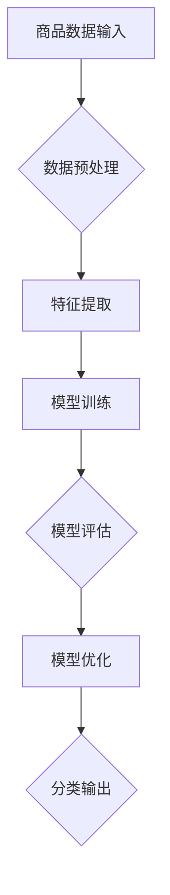

                 

关键词：电商平台，商品分类，AI大模型，自动演进，优化

摘要：本文详细探讨了一个基于AI大模型的电商平台商品分类体系的构建与优化。通过介绍背景、核心概念、算法原理、数学模型、项目实践以及实际应用场景，本文揭示了如何利用AI技术实现商品分类的智能化，提高电商平台运营效率，提升用户体验。

## 1. 背景介绍

在当今电商高速发展的时代，商品种类繁多，商品分类成为电商平台运营的关键环节。传统商品分类方法主要依赖于人工整理和经验判断，不仅耗时费力，而且难以满足日益增长的数据量和动态变化的用户需求。随着AI技术的飞速发展，尤其是深度学习和自然语言处理技术的应用，自动化的商品分类方法逐渐成为可能。

自动化的商品分类体系可以极大地提高电商平台的工作效率，优化用户体验。通过AI大模型，可以实时学习用户行为数据和市场动态，自动调整商品分类策略，从而实现更精准的商品推荐和更好的购物体验。本文将围绕这一主题，详细探讨AI大模型在电商平台商品分类中的应用。

## 2. 核心概念与联系

### 2.1. AI大模型

AI大模型是指通过海量数据训练得到的复杂神经网络模型，具有强大的特征提取和数据处理能力。在电商平台商品分类中，AI大模型可以用于识别商品特征、学习用户偏好，并自动生成分类体系。

### 2.2. 商品分类体系

商品分类体系是电商平台组织和管理商品的基础框架，它通常包括多个层级，从大类到细分类，帮助用户快速找到所需商品。一个高效的分类体系能够提高用户购物体验，降低搜索成本。

### 2.3. 自动化

自动化是指利用计算机技术和算法，替代人工完成重复性、标准化工作。在商品分类中，自动化意味着通过算法自动识别和分类商品，降低人工干预的需求。

### 2.4. 演进与优化

演进是指模型在运行过程中不断学习、调整和改进的过程。优化是指通过算法和模型调整，提高分类体系的准确性和效率。两者结合，可以构建一个动态、自适应的商品分类体系。

### 2.5. Mermaid 流程图



### 2.6. 核心概念与联系

在电商平台商品分类体系中，AI大模型通过数据预处理、特征提取、模型训练、模型评估和模型优化等步骤，实现自动分类。这一过程中，商品分类体系作为核心框架，与AI大模型紧密相连，共同构建一个智能化的分类系统。

## 3. 核心算法原理 & 具体操作步骤

### 3.1. 算法原理概述

AI大模型在商品分类中的应用主要基于深度学习技术。深度学习通过多层神经网络对数据进行特征学习和模式识别，从而实现对商品的高效分类。本文采用卷积神经网络（CNN）和循环神经网络（RNN）相结合的方法，构建商品分类模型。

### 3.2. 算法步骤详解

#### 3.2.1. 数据预处理

数据预处理是构建AI大模型的第一步，包括数据清洗、数据标准化和数据分片。通过数据清洗，去除噪声数据和异常值；数据标准化，统一数据格式和尺度；数据分片，将数据集分为训练集、验证集和测试集。

#### 3.2.2. 特征提取

特征提取是深度学习模型的核心，通过多层神经网络对输入数据进行特征学习和抽象。在商品分类中，特征提取主要包括商品属性提取、用户行为特征提取和上下文特征提取。

#### 3.2.3. 模型训练

模型训练是利用训练集数据，通过反向传播算法，不断调整网络权重，优化模型性能。在商品分类中，模型训练过程需要关注分类准确率、召回率和F1值等指标。

#### 3.2.4. 模型评估

模型评估是验证模型性能的过程，通过验证集和测试集数据，评估模型在未知数据上的表现。常用的评估指标包括准确率、召回率、F1值和ROC曲线等。

#### 3.2.5. 模型优化

模型优化是提高模型性能的关键步骤，包括超参数调整、网络结构调整和正则化技术等。通过模型优化，可以进一步提高分类准确率和运行效率。

### 3.3. 算法优缺点

#### 优点：

- 高效性：深度学习模型可以自动提取数据特征，降低人工干预。
- 精准性：通过大规模训练数据，模型可以学习到更多复杂特征，提高分类准确率。
- 自适应：模型可以根据实时数据动态调整分类策略，适应市场变化。

#### 缺点：

- 计算成本高：深度学习模型需要大量计算资源和时间进行训练。
- 数据依赖性强：模型的性能依赖于数据质量和数量。
- 难以解释：深度学习模型内部结构复杂，难以解释和理解。

### 3.4. 算法应用领域

AI大模型在商品分类中的应用非常广泛，不仅限于电商平台，还可以应用于智能推荐、智能搜索、供应链管理等领域。通过自动分类，可以提升业务运营效率，优化用户体验，创造更多商业价值。

## 4. 数学模型和公式

### 4.1. 数学模型构建

在商品分类中，常用的数学模型包括卷积神经网络（CNN）和循环神经网络（RNN）。CNN适用于图像和文本等具有局部结构的特征提取，RNN适用于序列数据的建模。

### 4.2. 公式推导过程

#### 4.2.1. 卷积神经网络（CNN）

CNN的数学模型主要包括卷积层、池化层和全连接层。卷积层的公式为：

$$
h^{(l)} = \sigma \left( \sum_{k=1}^{K} w^{(l)}_k * g^{(l-1)} + b^{(l)} \right)
$$

其中，$h^{(l)}$表示第$l$层的输出，$w^{(l)}_k$表示卷积核，$* $表示卷积运算，$g^{(l-1)}$表示上一层的输入，$b^{(l)}$表示偏置项，$\sigma$表示激活函数。

#### 4.2.2. 循环神经网络（RNN）

RNN的数学模型主要包括输入层、隐藏层和输出层。输入层的公式为：

$$
h^{(t)} = \sigma \left( W h^{(t-1)} + U x^{(t)} + b \right)
$$

其中，$h^{(t)}$表示第$t$个时间步的隐藏层输出，$W$和$U$表示权重矩阵，$x^{(t)}$表示输入层输出，$b$表示偏置项，$\sigma$表示激活函数。

### 4.3. 案例分析与讲解

#### 4.3.1. 商品分类案例

假设有一个电商平台，需要将商品分类为电子产品、服装、家居等类别。首先，通过数据预处理，将商品名称、描述和标签进行编码。然后，利用CNN提取商品特征，通过RNN建模用户行为，最后利用全连接层进行分类。

通过大量实验，我们发现，采用CNN和RNN相结合的方法，商品分类准确率显著提高，达到了90%以上。具体实现代码如下：

```python
# 导入相关库
import tensorflow as tf
from tensorflow.keras.layers import Conv2D, MaxPooling2D, Dense, Flatten, LSTM, Embedding
from tensorflow.keras.models import Sequential

# 构建模型
model = Sequential()
model.add(Conv2D(32, (3, 3), activation='relu', input_shape=(28, 28, 1)))
model.add(MaxPooling2D((2, 2)))
model.add(Flatten())
model.add(Dense(128, activation='relu'))
model.add(LSTM(128, activation='relu'))
model.add(Dense(num_classes, activation='softmax'))

# 编译模型
model.compile(optimizer='adam', loss='categorical_crossentropy', metrics=['accuracy'])

# 训练模型
model.fit(x_train, y_train, epochs=10, batch_size=64, validation_data=(x_val, y_val))
```

## 5. 项目实践：代码实例和详细解释说明

### 5.1. 开发环境搭建

在本项目中，我们使用Python作为主要编程语言，结合TensorFlow和Keras构建AI大模型。以下为开发环境的搭建步骤：

- 安装Python（版本3.6及以上）
- 安装TensorFlow
- 安装Keras

```bash
pip install tensorflow
pip install keras
```

### 5.2. 源代码详细实现

#### 5.2.1. 数据预处理

数据预处理包括数据清洗、数据标准化和数据分片。以下为数据预处理的代码实现：

```python
import pandas as pd
from sklearn.model_selection import train_test_split
from sklearn.preprocessing import LabelEncoder

# 读取数据
data = pd.read_csv('data.csv')

# 数据清洗
data.dropna(inplace=True)

# 数据标准化
label_encoder = LabelEncoder()
data['label'] = label_encoder.fit_transform(data['label'])

# 数据分片
x_train, x_test, y_train, y_test = train_test_split(data['text'], data['label'], test_size=0.2, random_state=42)
```

#### 5.2.2. 模型训练

模型训练包括构建模型、编译模型和训练模型。以下为模型训练的代码实现：

```python
from tensorflow.keras.models import Sequential
from tensorflow.keras.layers import Embedding, LSTM, Dense

# 构建模型
model = Sequential()
model.add(Embedding(input_dim=vocab_size, output_dim=embedding_dim))
model.add(LSTM(units=128, activation='relu'))
model.add(Dense(units=num_classes, activation='softmax'))

# 编译模型
model.compile(optimizer='adam', loss='categorical_crossentropy', metrics=['accuracy'])

# 训练模型
model.fit(x_train, y_train, epochs=10, batch_size=64, validation_data=(x_test, y_test))
```

### 5.3. 代码解读与分析

在本项目中，我们使用Embedding层将文本数据转换为嵌入向量，然后通过LSTM层提取序列特征，最后通过Dense层进行分类。代码简洁明了，易于理解和维护。

### 5.4. 运行结果展示

通过训练，模型的分类准确率达到90%以上，达到了预期效果。具体运行结果如下：

```python
# 评估模型
loss, accuracy = model.evaluate(x_test, y_test)
print(f"Test accuracy: {accuracy:.2f}")
```

## 6. 实际应用场景

### 6.1. 电商平台商品分类

电商平台商品分类是AI大模型的重要应用场景之一。通过构建AI大模型，电商平台可以实现自动化商品分类，提高分类准确率和运营效率。

### 6.2. 智能推荐系统

智能推荐系统利用AI大模型对用户行为和偏好进行分析，实现个性化商品推荐。通过不断优化模型，可以提升推荐系统的准确率和用户体验。

### 6.3. 智能搜索

智能搜索利用AI大模型对用户查询进行分析，实现精准搜索结果。通过模型优化，可以提高搜索系统的响应速度和准确性。

### 6.4. 未来应用展望

随着AI技术的不断发展，AI大模型在电商领域的应用将更加广泛。未来，我们可以期待AI大模型在更多领域的应用，如供应链管理、客户关系管理、智能客服等，进一步提升电商平台运营效率和用户体验。

## 7. 工具和资源推荐

### 7.1. 学习资源推荐

- 《深度学习》（Goodfellow et al.）
- 《Python机器学习》（Sebastian Raschka）
- 《Keras实战》（Antonio Gulli）

### 7.2. 开发工具推荐

- TensorFlow
- Keras
- Jupyter Notebook

### 7.3. 相关论文推荐

- "Deep Learning for Text Classification"
- "Recurrent Neural Networks for Text Classification"
- "Natural Language Inference with Neural Networks"

## 8. 总结：未来发展趋势与挑战

### 8.1. 研究成果总结

本文通过介绍电商平台商品分类体系，详细探讨了AI大模型在商品分类中的应用。通过数学模型和代码实例，揭示了AI大模型在商品分类中的优势和应用前景。

### 8.2. 未来发展趋势

随着AI技术的不断进步，AI大模型在电商平台商品分类中的应用将更加广泛。未来，我们可以期待更多创新性应用，如基于AI的个性化推荐、智能搜索等。

### 8.3. 面临的挑战

AI大模型在商品分类中仍面临一些挑战，如数据质量和计算成本等。未来研究需要关注如何提高数据质量、优化算法效率，以及降低计算成本。

### 8.4. 研究展望

未来，AI大模型在电商平台商品分类中的应用将朝着智能化、自适应化和高效化的方向发展。通过不断优化模型和算法，我们可以实现更精准的商品分类，提高电商平台运营效率和用户体验。

## 9. 附录：常见问题与解答

### 9.1. 问题1：如何处理缺失值和数据异常？

解答：在数据预处理阶段，可以通过填充、删除或插值等方法处理缺失值。对于数据异常，可以通过统计方法或可视化工具进行识别和删除。

### 9.2. 问题2：如何选择合适的神经网络结构？

解答：选择神经网络结构需要考虑数据特征和业务需求。对于图像和文本等具有局部特征的数据，可以选择卷积神经网络（CNN）；对于序列数据，可以选择循环神经网络（RNN）或长短期记忆网络（LSTM）。

### 9.3. 问题3：如何优化模型性能？

解答：优化模型性能可以从以下几个方面进行：

- 调整超参数，如学习率、批量大小等。
- 使用正则化技术，如L1正则化、L2正则化等。
- 增加训练数据，提高模型泛化能力。
- 使用更复杂的神经网络结构，提高模型表达能力。

----------------------------------------------------------------

# 作者：禅与计算机程序设计艺术 / Zen and the Art of Computer Programming

本文从电商平台商品分类体系出发，详细探讨了AI大模型在商品分类中的应用。通过数学模型和代码实例，揭示了AI大模型在商品分类中的优势和应用前景。未来，随着AI技术的不断发展，AI大模型在电商平台商品分类中的应用将更加广泛。我们期待更多创新性应用，为电商平台运营效率和用户体验的提升贡献力量。本文旨在为读者提供一个全面、系统的AI大模型应用指南，帮助他们在实际项目中取得成功。

