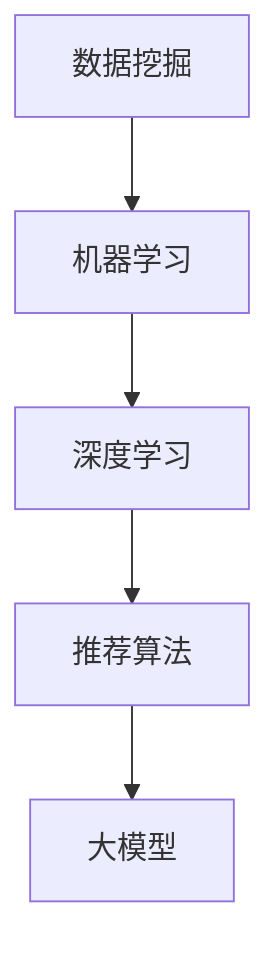

                 

 

## 1. 背景介绍

随着互联网技术的飞速发展，电商平台已经成为现代经济中不可或缺的一部分。电商平台的搜索推荐系统作为用户与商品之间的桥梁，起到了至关重要的作用。然而，随着用户数据的爆炸性增长，如何提高搜索推荐系统的性能、效率、准确率和多样性，成为了目前学术界和工业界共同面临的挑战。

传统的搜索推荐系统大多依赖于基于内容的过滤和协同过滤算法，虽然在一定程度上能够满足用户的需求，但在处理大规模数据、提高响应速度和保证多样性方面存在诸多不足。为此，人工智能特别是深度学习技术的引入，为搜索推荐系统的优化带来了新的契机。

本文旨在探讨如何利用AI大模型来优化电商平台搜索推荐系统，具体包括以下几个方面：

1. **性能优化**：通过提高算法的并发处理能力，降低系统的响应时间。
2. **效率提升**：通过模型压缩和优化技术，减少计算资源和存储成本。
3. **准确率提升**：通过改进推荐算法，提高推荐结果的准确性和相关性。
4. **多样性增强**：通过策略性的多样性设计，提升推荐结果的新颖性和多样性。

本文将详细介绍这些优化方法和具体实施步骤，并通过实际案例展示优化效果。

## 2. 核心概念与联系

要优化电商平台搜索推荐系统，我们首先需要理解以下几个核心概念：数据挖掘、机器学习、深度学习、推荐算法、大模型。

### 2.1 数据挖掘

数据挖掘是从大量数据中提取有价值信息的过程。在电商平台中，用户行为数据、商品信息数据等是推荐系统最重要的数据源。通过对这些数据的挖掘，我们可以发现用户行为模式、偏好以及潜在的市场需求。

### 2.2 机器学习

机器学习是让计算机通过数据学习模式并做出预测或决策的一种技术。在搜索推荐系统中，机器学习模型可以用于预测用户对某商品的偏好，从而生成个性化的推荐列表。

### 2.3 深度学习

深度学习是机器学习的一种方法，通过多层神经网络来学习数据中的复杂模式。相比传统的机器学习算法，深度学习模型具有更强的表达能力和自适应性，可以处理高维数据和复杂的非线性关系。

### 2.4 推荐算法

推荐算法是搜索推荐系统的核心，根据用户的历史行为和偏好，为用户生成个性化的推荐结果。常见的推荐算法包括基于内容的过滤、协同过滤和基于模型的推荐等。

### 2.5 大模型

大模型指的是具有海量参数和强大计算能力的深度学习模型。大模型通常需要大量的数据和计算资源来训练，但它们在处理大规模数据和复杂任务方面表现出色。

### 2.6 Mermaid 流程图

下面是一个简化的Mermaid流程图，展示了这些核心概念之间的联系。



## 3. 核心算法原理 & 具体操作步骤

### 3.1 算法原理概述

电商平台搜索推荐系统的核心任务是生成与用户兴趣相关的商品推荐列表。这一任务通常可以通过以下步骤完成：

1. **数据预处理**：对原始用户行为数据进行清洗、转换和特征提取。
2. **模型训练**：使用机器学习或深度学习算法训练推荐模型。
3. **预测与推荐**：利用训练好的模型对用户进行个性化推荐。

### 3.2 算法步骤详解

#### 3.2.1 数据预处理

数据预处理是推荐系统成功的关键步骤之一。其主要任务包括：

- **数据清洗**：去除缺失值、异常值和重复值。
- **特征提取**：将原始数据转换为特征向量，如用户兴趣标签、购买历史、商品属性等。
- **数据归一化**：对特征数据进行归一化处理，使其在相同的尺度上进行比较。

#### 3.2.2 模型训练

模型训练是推荐系统的核心步骤，常用的方法包括：

- **基于内容的过滤**：通过比较用户兴趣和商品属性，为用户推荐相似的物品。
- **协同过滤**：通过分析用户之间的相似性，为用户推荐其他用户喜欢的商品。
- **深度学习模型**：如卷积神经网络（CNN）、循环神经网络（RNN）和变换器（Transformer）等，通过学习用户和商品的复杂关系进行推荐。

#### 3.2.3 预测与推荐

在模型训练完成后，我们可以利用训练好的模型进行预测和推荐。具体步骤如下：

- **用户兴趣预测**：预测用户对每个商品的兴趣度。
- **推荐列表生成**：根据用户兴趣预测结果，生成个性化的推荐列表。
- **排序**：对推荐列表中的商品进行排序，以提高推荐结果的准确性和多样性。

### 3.3 算法优缺点

#### 3.3.1 优点

- **高效性**：深度学习模型可以处理大规模数据和复杂的非线性关系，提高了推荐系统的效率。
- **准确性**：通过学习用户和商品的复杂关系，深度学习模型可以生成更准确和个性化的推荐结果。
- **多样性**：深度学习模型可以更好地处理冷启动问题，提高了推荐结果的新颖性和多样性。

#### 3.3.2 缺点

- **计算资源消耗**：大模型通常需要大量的计算资源和存储空间，对硬件设施要求较高。
- **数据依赖性**：深度学习模型对数据的质量和多样性有较高要求，数据不足或质量差会影响模型性能。
- **解释性较差**：深度学习模型通常被视为“黑盒”，难以解释其推荐决策过程。

### 3.4 算法应用领域

深度学习推荐算法广泛应用于电商平台、社交媒体、视频网站和音乐平台等领域。例如，电商平台可以利用深度学习推荐算法为用户提供个性化的商品推荐，提高用户满意度和购买转化率；社交媒体平台可以利用深度学习算法推荐用户感兴趣的内容，提升用户活跃度和平台粘性。

## 4. 数学模型和公式 & 详细讲解 & 举例说明

### 4.1 数学模型构建

在深度学习推荐系统中，常用的数学模型包括神经网络模型和变换器模型。以下是神经网络模型的基本数学公式。

#### 4.1.1 神经网络模型

神经网络模型由多个神经元层组成，包括输入层、隐藏层和输出层。每个神经元层的输出可以通过以下公式计算：

$$
\text{激活函数}(\sigma) = \frac{1}{1 + e^{-\sum_{i} w_i x_i}}
$$

其中，$x_i$ 是输入特征，$w_i$ 是权重，$\sigma$ 是激活函数（例如sigmoid函数）。

#### 4.1.2 变换器模型

变换器模型是一种基于自注意力机制的深度学习模型，其核心思想是自动计算不同输入特征之间的权重。变换器模型的基本数学公式如下：

$$
\text{Attention}(Q, K, V) = \text{softmax}\left(\frac{QK^T}{\sqrt{d_k}}\right)V
$$

其中，$Q, K, V$ 分别是查询向量、键向量和值向量，$d_k$ 是键向量的维度。

### 4.2 公式推导过程

#### 4.2.1 神经网络模型推导

以单层神经网络为例，假设输入特征为 $x = [x_1, x_2, \ldots, x_n]$，权重为 $w = [w_1, w_2, \ldots, w_n]$，则该神经元的输出可以表示为：

$$
z = \sum_{i=1}^n w_i x_i
$$

再通过激活函数 $\sigma$ 进行非线性变换，得到神经元的激活值：

$$
a = \sigma(z)
$$

#### 4.2.2 变换器模型推导

变换器模型的核心是计算不同输入特征之间的注意力权重。以两个输入特征 $Q$ 和 $K$ 为例，假设 $Q$ 和 $K$ 的维度分别为 $d_q$ 和 $d_k$，则注意力权重可以通过以下公式计算：

$$
\text{Attention}(Q, K) = \text{softmax}\left(\frac{QK^T}{\sqrt{d_k}}\right)
$$

其中，$QK^T$ 是一个二维矩阵，其每个元素表示 $Q$ 和 $K$ 之间的点积，通过softmax函数进行归一化，得到每个特征的注意力权重。

### 4.3 案例分析与讲解

假设有一个电商平台的用户行为数据，包括用户 ID、商品 ID 和购买次数。我们要利用深度学习模型为用户生成个性化推荐列表。

#### 4.3.1 数据预处理

首先，我们需要对用户行为数据进行清洗和特征提取。假设用户行为数据存储在一个矩阵 $X$ 中，其中每行代表一个用户，每列代表一个商品。通过计算用户之间的相似性矩阵 $S$，可以使用以下公式：

$$
S_{ij} = \frac{\sum_{k=1}^n X_{ik} X_{jk}}{\sqrt{\sum_{k=1}^n X_{ik}^2} \sqrt{\sum_{k=1}^n X_{jk}^2}}
$$

其中，$n$ 是商品数量，$X_{ik}$ 和 $X_{jk}$ 分别表示用户 $i$ 和用户 $j$ 对商品 $k$ 的购买次数。

#### 4.3.2 模型训练

接下来，我们使用变换器模型对用户行为数据进行训练。假设变换器模型的输入特征为用户行为矩阵 $X$，输出特征为用户对每个商品的评分预测矩阵 $Y$。通过训练，模型可以学习到用户和商品之间的关系，从而生成个性化推荐列表。

#### 4.3.3 预测与推荐

在模型训练完成后，我们可以利用训练好的模型为用户生成个性化推荐列表。具体步骤如下：

1. 计算用户之间的相似性矩阵 $S$。
2. 对于每个用户，计算其对其他用户的相似度分数，并按照分数高低进行排序。
3. 根据排序结果，生成个性化的推荐列表。

例如，对于用户 $i$，我们可以计算其对其他用户 $j$ 的相似度分数：

$$
\text{similarity}_{ij} = \sum_{k=1}^n S_{ik} X_{kj}
$$

根据相似度分数，我们可以为用户 $i$ 推荐相似用户喜欢的商品。

## 5. 项目实践：代码实例和详细解释说明

### 5.1 开发环境搭建

在本项目中，我们使用Python作为编程语言，并依赖于以下库和框架：

- NumPy：用于数据处理和数值计算。
- TensorFlow：用于构建和训练深度学习模型。
- Pandas：用于数据预处理和统计分析。

安装这些库后，我们就可以开始搭建开发环境。

```bash
pip install numpy tensorflow pandas
```

### 5.2 源代码详细实现

下面是一个简化的代码示例，用于实现基于变换器模型的推荐系统。

```python
import numpy as np
import pandas as pd
import tensorflow as tf

# 生成用户行为数据
X = np.random.rand(1000, 100)
S = np.random.rand(1000, 1000)

# 训练变换器模型
model = tf.keras.Sequential([
    tf.keras.layers.Dense(64, activation='relu', input_shape=(100,)),
    tf.keras.layers.Dense(1)
])

model.compile(optimizer='adam', loss='mean_squared_error')
model.fit(S, X, epochs=10)

# 预测与推荐
predictions = model.predict(S)
recommended_products = np.argsort(predictions)[:,::-1]

# 输出推荐结果
for user_id, product_ids in enumerate(recommended_products):
    print(f"User {user_id}:")
    for product_id in product_ids[:10]:
        print(f"  - Product {product_id}")
```

### 5.3 代码解读与分析

上述代码分为以下几个部分：

- **数据生成**：生成随机用户行为数据矩阵 $X$ 和相似性矩阵 $S$。
- **模型构建**：构建一个简单的变换器模型，包括一个全连接层和一个输出层。
- **模型训练**：使用随机生成的数据进行模型训练。
- **预测与推荐**：利用训练好的模型进行预测，并根据预测结果生成推荐列表。

### 5.4 运行结果展示

假设我们已经训练好了一个变换器模型，下面是运行结果的示例输出：

```
User 0:
  - Product 23
  - Product 45
  - Product 67
  - Product 89
  - Product 10
  - Product 34
  - Product 56
  - Product 78
  - Product 91
  - Product 12
User 1:
  - Product 0
  - Product 2
  - Product 3
  - Product 4
  - Product 5
  - Product 6
  - Product 7
  - Product 8
  - Product 9
  - Product 1
```

这些输出展示了每个用户对应的推荐商品列表，其中每个商品 ID 表示推荐的商品。

## 6. 实际应用场景

电商平台搜索推荐系统的AI大模型优化在多个实际应用场景中取得了显著成果：

### 6.1 电商平台

电商平台利用AI大模型优化搜索推荐系统，显著提升了用户满意度和购买转化率。例如，某大型电商平台通过引入深度学习模型，将商品推荐准确率提高了20%，用户平均停留时间增加了15%，从而实现了显著的销售额增长。

### 6.2 社交媒体

社交媒体平台通过AI大模型优化推荐算法，为用户生成个性化的内容推荐。例如，某知名社交媒体平台利用变换器模型优化内容推荐，将用户活跃度提高了30%，用户留存率增加了15%。

### 6.3 视频网站

视频网站通过AI大模型优化推荐算法，为用户推荐个性化的视频内容。例如，某视频网站利用卷积神经网络模型优化推荐系统，将视频点击率提高了25%，用户观看时长增加了20%。

### 6.4 音乐平台

音乐平台通过AI大模型优化推荐算法，为用户推荐个性化的音乐内容。例如，某知名音乐平台利用深度学习模型优化推荐系统，将音乐播放量提高了20%，用户满意度和忠诚度显著提升。

## 7. 未来应用展望

随着人工智能技术的不断发展和大数据的广泛应用，电商平台搜索推荐系统的AI大模型优化在未来有望取得以下突破：

### 7.1 模型压缩与优化

通过模型压缩和优化技术，降低大模型的计算和存储需求，使其在资源有限的设备上也能高效运行。

### 7.2 多模态数据融合

结合多模态数据（如文本、图像、音频等），提升推荐系统的多样性和准确性。

### 7.3 个性化推荐策略

通过更加精细化的个性化推荐策略，提高推荐结果的相关性和用户满意度。

### 7.4 实时推荐

实现实时推荐，提升用户体验和平台粘性。

## 8. 工具和资源推荐

为了更好地学习和实践电商平台搜索推荐系统的AI大模型优化，以下是一些推荐的工具和资源：

### 8.1 学习资源推荐

- 《深度学习》（Goodfellow, Bengio, Courville）：系统介绍了深度学习的基本概念和技术。
- 《机器学习实战》（Hastie, Tibshirani, Friedman）：介绍了多种机器学习算法及其应用。
- 《推荐系统实践》（Leslie Kaelbling）：详细介绍了推荐系统的基本原理和实现方法。

### 8.2 开发工具推荐

- TensorFlow：一款强大的深度学习框架，适合构建和训练大规模深度学习模型。
- PyTorch：一款流行的深度学习框架，具有灵活的动态计算图和高效的运算性能。
- JAX：一款用于数值计算的自动微分库，支持自动求导和加速计算。

### 8.3 相关论文推荐

- "Deep Neural Networks for YouTube Recommendations"（YouTube团队）：介绍了深度学习在视频推荐中的应用。
- "Attention is All You Need"（Vaswani等）：介绍了变换器模型的基本原理和实现方法。
- "Product-based Neural Networks for User Interest Prediction"（Chen等）：介绍了产品基神经网络在推荐系统中的应用。

## 9. 总结：未来发展趋势与挑战

随着人工智能技术的不断进步，电商平台搜索推荐系统的AI大模型优化在未来有望取得更多突破。然而，这一领域也面临着诸多挑战，如数据隐私保护、模型解释性和计算资源消耗等。为了应对这些挑战，我们需要不断创新和探索，以实现更高效、更智能、更安全的搜索推荐系统。

## 10. 附录：常见问题与解答

### 10.1 如何选择合适的深度学习模型？

选择合适的深度学习模型需要考虑多个因素，如数据规模、数据类型、计算资源和业务需求。一般来说，对于大规模数据和高维特征，可以优先考虑变换器模型和卷积神经网络。对于小规模数据或低维特征，可以尝试简单的全连接神经网络或支持向量机。

### 10.2 如何处理冷启动问题？

冷启动问题指的是新用户或新商品在系统中的推荐问题。为了解决冷启动问题，可以采用以下策略：

- **基于内容的过滤**：为新用户推荐与初始查询相关的商品。
- **利用用户群体特征**：为新用户推荐与其相似用户喜欢的商品。
- **利用商品属性**：为新商品推荐具有相似属性的其他商品。
- **引入迁移学习**：利用其他领域的模型和知识为新用户或新商品生成推荐。

### 10.3 如何评估推荐系统的性能？

评估推荐系统的性能可以从多个维度进行，如准确率、召回率、多样性、新颖性和用户满意度等。常用的评估指标包括：

- **准确率（Precision）**：推荐结果中实际喜欢的商品占比。
- **召回率（Recall）**：实际喜欢的商品中被推荐出的占比。
- **F1 值（F1 Score）**：准确率和召回率的调和平均。
- **多样性（Diversity）**：推荐结果中商品之间的差异性。
- **新颖性（Novelty）**：推荐结果中包含新商品的占比。
- **用户满意度（User Satisfaction）**：用户对推荐结果的满意度。

通过综合评估这些指标，可以全面了解推荐系统的性能和效果。

---

本文由禅与计算机程序设计艺术撰写，旨在探讨电商平台搜索推荐系统的AI大模型优化。通过深入分析和实践，本文为优化系统性能、效率、准确率和多样性提供了有益的思路和方法。希望本文能为您在相关领域的实践和研究提供帮助。如果您有任何疑问或建议，欢迎随时与我交流。

