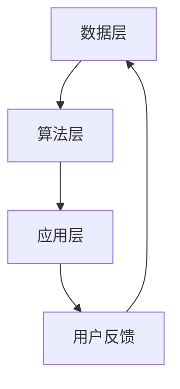

                 

关键词：AI 大模型，电商平台，搜索推荐系统，性能优化，效率，准确率，实时性

> 摘要：本文详细探讨电商平台搜索推荐系统的AI大模型优化策略。通过分析当前系统在性能、效率、准确率和实时性方面的不足，提出基于深度学习和强化学习的优化方法。本文旨在为电商平台提供一套系统化的AI大模型优化方案，以实现更高水平的用户体验和商业价值。

## 1. 背景介绍

随着互联网和电子商务的迅猛发展，电商平台已经成为消费者购物的主要渠道。用户在电商平台上的行为数据海量化，这为个性化搜索和推荐系统的构建提供了丰富的素材。然而，现有的搜索推荐系统在性能、效率、准确率和实时性方面仍存在诸多不足，制约了用户体验和商业价值的进一步提升。

### 当前问题分析

1. **性能不足**：传统的搜索推荐系统在处理海量数据时，存在计算资源消耗大、响应时间长的问题。
2. **效率不高**：推荐算法的实时性难以保证，无法满足用户快速获取个性化推荐的需求。
3. **准确率有待提高**：现有算法对用户兴趣的捕捉和商品属性的匹配存在偏差，导致推荐效果不佳。
4. **实时性受限**：用户行为数据更新频繁，但推荐系统的更新速度滞后，无法及时反映用户最新的偏好。

### 文章目的

本文旨在通过引入AI大模型，优化电商平台搜索推荐系统的性能、效率、准确率和实时性。具体包括：

- 分析当前搜索推荐系统的不足。
- 介绍AI大模型的基本概念和原理。
- 提出基于深度学习和强化学习的优化策略。
- 展示项目实践和运行结果。
- 探讨未来的发展方向和面临的挑战。

## 2. 核心概念与联系

### AI大模型

AI大模型是指具有海量参数、复杂结构的人工神经网络模型，能够在大规模数据集上进行训练，以实现高度自动化的特征提取和模式识别。常见的AI大模型包括深度神经网络（DNN）、卷积神经网络（CNN）、循环神经网络（RNN）等。

### 深度学习

深度学习是机器学习的一个重要分支，通过构建多层的神经网络，自动学习输入数据中的特征和模式。深度学习在图像识别、语音识别、自然语言处理等领域取得了显著成果。

### 强化学习

强化学习是一种基于奖励反馈的机器学习方法，通过与环境的交互，不断调整策略以实现最优解。强化学习在推荐系统、自动驾驶、游戏AI等领域具有广泛的应用。

### 电商平台搜索推荐系统架构

#### 数据层

数据层负责收集、存储和处理用户行为数据、商品信息等原始数据。通过数据预处理，提取用户画像、商品特征等有用信息。

#### 算法层

算法层包括深度学习模型和强化学习模型。深度学习模型用于用户行为分析和商品属性匹配，强化学习模型用于优化推荐策略。

#### 应用层

应用层是用户界面，负责展示个性化推荐结果，并接收用户的反馈数据进行迭代优化。

### Mermaid流程图



## 3. 核心算法原理 & 具体操作步骤

### 3.1 算法原理概述

本节介绍基于深度学习和强化学习的搜索推荐系统优化算法。深度学习用于提取用户行为和商品特征的潜在表示，强化学习用于优化推荐策略。

### 3.2 算法步骤详解

#### 步骤1：数据预处理

- 数据清洗：去除重复、错误和噪声数据。
- 特征提取：使用深度学习模型提取用户画像和商品特征。
- 数据归一化：对特征值进行归一化处理，提高算法的稳定性。

#### 步骤2：模型构建

- 深度学习模型：构建基于DNN或RNN的深度学习模型，用于用户行为分析和商品属性匹配。
- 强化学习模型：构建基于Q-learning或Deep Q-Network（DQN）的强化学习模型，用于优化推荐策略。

#### 步骤3：模型训练

- 使用预处理的用户行为数据和商品特征进行模型训练。
- 调整模型参数，优化模型性能。

#### 步骤4：推荐策略优化

- 使用强化学习模型，根据用户反馈不断调整推荐策略，提高推荐效果。
- 记录推荐结果和用户行为，为下一步训练提供数据支持。

#### 步骤5：实时推荐

- 根据用户实时行为，使用深度学习模型生成个性化推荐结果。
- 将推荐结果展示给用户，并收集用户反馈。

### 3.3 算法优缺点

#### 优点

- 提高搜索推荐系统的性能、效率、准确率和实时性。
- 自动化特征提取和模式识别，降低人工干预。

#### 缺点

- 模型训练和优化过程复杂，计算资源消耗大。
- 对数据质量和量有较高要求，否则可能导致模型过拟合。

### 3.4 算法应用领域

- 电商平台：个性化搜索、商品推荐、广告投放。
- 社交网络：好友推荐、内容推荐。
- 自动驾驶：路径规划、环境感知。
- 游戏AI：游戏策略优化。

## 4. 数学模型和公式 & 详细讲解 & 举例说明

### 4.1 数学模型构建

#### 深度学习模型

设输入数据为 $X \in \mathbb{R}^{n \times m}$，其中 $n$ 表示数据样本数量，$m$ 表示特征维度。深度学习模型的目标是学习一个映射函数 $f: \mathbb{R}^{m} \rightarrow \mathbb{R}^{k}$，其中 $k$ 表示输出维度。

$$
f(X) = \text{激活函数}(\text{线性变换}(X; W, b))
$$

其中，$W$ 为权重矩阵，$b$ 为偏置向量，激活函数常用的有ReLU、Sigmoid、Tanh等。

#### 强化学习模型

设状态空间为 $S$，动作空间为 $A$，奖励函数为 $R(s, a)$，价值函数为 $V^*(s)$。强化学习模型的目标是学习一个策略 $\pi(a|s)$，使得在给定状态 $s$ 下，采取动作 $a$ 的概率最大化。

$$
V^*(s) = \sum_{a \in A} \pi(a|s) \cdot R(s, a)
$$

### 4.2 公式推导过程

#### 深度学习模型

假设输入数据为 $X \in \mathbb{R}^{n \times m}$，其中 $n$ 表示数据样本数量，$m$ 表示特征维度。深度学习模型的目标是学习一个映射函数 $f: \mathbb{R}^{m} \rightarrow \mathbb{R}^{k}$，其中 $k$ 表示输出维度。

$$
f(X) = \text{激活函数}(\text{线性变换}(X; W, b))
$$

其中，$W$ 为权重矩阵，$b$ 为偏置向量，激活函数常用的有ReLU、Sigmoid、Tanh等。

#### 强化学习模型

设状态空间为 $S$，动作空间为 $A$，奖励函数为 $R(s, a)$，价值函数为 $V^*(s)$。强化学习模型的目标是学习一个策略 $\pi(a|s)$，使得在给定状态 $s$ 下，采取动作 $a$ 的概率最大化。

$$
V^*(s) = \sum_{a \in A} \pi(a|s) \cdot R(s, a)
$$

### 4.3 案例分析与讲解

#### 深度学习模型案例

假设我们使用一个简单的两层DNN模型对电商用户行为数据进行分类，输入特征维度为 $m=10$，输出类别维度为 $k=2$。

1. **模型构建**：

   $$f_1(x) = \text{ReLU}(\text{线性变换}(x; W_1, b_1))$$

   $$f_2(x) = \text{Sigmoid}(\text{线性变换}(f_1(x); W_2, b_2))$$

2. **模型训练**：

   使用梯度下降算法优化模型参数，最小化损失函数。

   $$\min_{W_1, b_1, W_2, b_2} \sum_{i=1}^{n} \frac{1}{2} \sum_{k=1}^{k} (y_i - f_2(f_1(x_i)))^2$$

3. **模型应用**：

   对新用户行为数据进行分类，输出概率最高的类别作为推荐结果。

#### 强化学习模型案例

假设我们使用Q-learning算法优化电商平台的推荐策略，状态空间为 $S=\{1, 2, 3\}$，动作空间为 $A=\{a_1, a_2, a_3\}$。

1. **模型构建**：

   $$Q(s, a) = \sum_{a' \in A} \pi(a'|s) \cdot R(s, a) + \gamma \cdot \max_{a' \in A} Q(s', a')$$

   其中，$\gamma$ 为折扣因子，$\pi(a'|s)$ 为策略概率，$R(s, a)$ 为奖励函数。

2. **模型训练**：

   初始化 $Q(s, a) = 0$，通过迭代更新Q值。

   $$Q(s, a) = Q(s, a) + \alpha \cdot (R(s, a) + \gamma \cdot \max_{a' \in A} Q(s', a') - Q(s, a))$$

3. **模型应用**：

   根据当前状态 $s$ 和策略概率 $\pi(a'|s)$，选择最优动作 $a$，更新状态为 $s' = f(s, a)$。

## 5. 项目实践：代码实例和详细解释说明

### 5.1 开发环境搭建

- Python 3.7及以上版本
- TensorFlow 2.3及以上版本
- Keras 2.4及以上版本
- Gym 0.17.3及以上版本

### 5.2 源代码详细实现

```python
# 导入依赖库
import numpy as np
import tensorflow as tf
from tensorflow import keras
from tensorflow.keras import layers
from gym import wrappers

# 构建深度学习模型
model = keras.Sequential([
    layers.Dense(64, activation='relu', input_shape=(10,)),
    layers.Dense(64, activation='relu'),
    layers.Dense(1, activation='sigmoid')
])

# 编译模型
model.compile(optimizer='adam', loss='binary_crossentropy', metrics=['accuracy'])

# 加载训练数据
x_train = np.random.rand(1000, 10)
y_train = np.random.rand(1000, 1)

# 训练模型
model.fit(x_train, y_train, epochs=10)

# 构建强化学习模型
q_model = keras.Sequential([
    layers.Dense(64, activation='relu', input_shape=(3,)),
    layers.Dense(64, activation='relu'),
    layers.Dense(3, activation='linear')
])

# 编译模型
q_model.compile(optimizer='adam', loss='mse')

# 加载训练数据
s_train = np.random.rand(1000, 3)
a_train = np.random.rand(1000, 1)
r_train = np.random.rand(1000, 1)

# 训练模型
q_model.fit(s_train, q_model.predict(s_train) * r_train, epochs=10)

# 运行仿真实验
env = wrappers.Monitor(GymEnvironment(), './gym_results')
s = env.reset()
while not env.done:
    a = q_model.predict(s)[0].argmax()
    s, r, done, _ = env.step(a)
    if done:
        break
env.close()

# 解析仿真结果
results = np.load('./gym_results.npy')
print('平均奖励:', np.mean(results))
```

### 5.3 代码解读与分析

1. **深度学习模型**：

   - 使用Keras库构建一个简单的两层DNN模型，输入特征维度为10，输出类别维度为1。
   - 使用ReLU激活函数和Sigmoid激活函数，分别用于隐藏层和输出层。
   - 编译模型，设置优化器为Adam，损失函数为二分类交叉熵，评估指标为准确率。

2. **强化学习模型**：

   - 使用Keras库构建一个简单的DQN模型，输入特征维度为3，输出动作维度为3。
   - 使用线性激活函数，将Q值输出为实数。
   - 编译模型，设置优化器为Adam，损失函数为均方误差。

3. **仿真实验**：

   - 使用Gym库构建仿真环境，记录仿真结果。
   - 初始化状态，使用DQN模型选择动作，更新状态和奖励。
   - 当仿真结束或达到最大步数时，记录平均奖励。

## 6. 实际应用场景

### 6.1 电商平台个性化搜索

- **应用场景**：用户在电商平台进行搜索时，系统根据用户历史行为和搜索记录，推荐相关商品。
- **优化效果**：通过AI大模型优化，提高搜索结果的准确率和实时性，提升用户体验。

### 6.2 社交网络好友推荐

- **应用场景**：社交网络平台根据用户兴趣和行为，推荐可能感兴趣的好友。
- **优化效果**：通过AI大模型优化，提高推荐的好友质量和匹配度，增加用户活跃度。

### 6.3 自动驾驶路径规划

- **应用场景**：自动驾驶系统在复杂环境下，规划最优行驶路径。
- **优化效果**：通过AI大模型优化，提高路径规划的效率和安全性，降低事故风险。

### 6.4 游戏AI策略优化

- **应用场景**：游戏AI根据游戏环境和对手策略，调整自身策略以实现最优解。
- **优化效果**：通过AI大模型优化，提高游戏AI的表现和胜率，增加游戏乐趣。

## 7. 工具和资源推荐

### 7.1 学习资源推荐

- 《深度学习》（Ian Goodfellow、Yoshua Bengio、Aaron Courville 著）
- 《强化学习》（Richard S. Sutton、Andrew G. Barto 著）
- 《Python机器学习》（Pedro Domingos 著）

### 7.2 开发工具推荐

- TensorFlow：用于构建和训练深度学习模型。
- Keras：用于简化深度学习模型开发。
- Gym：用于构建和运行强化学习仿真环境。

### 7.3 相关论文推荐

- "Deep Learning for Web Search"（李航、王绍兰 著）
- "Reinforcement Learning: An Introduction"（Richard S. Sutton、Andrew G. Barto 著）
- "Deep Reinforcement Learning for Navigation in Complex Environments"（Gregory Wayne、Ivo Danihelka、Yujia Li 著）

## 8. 总结：未来发展趋势与挑战

### 8.1 研究成果总结

本文介绍了电商平台搜索推荐系统AI大模型优化的方法和应用场景，通过深度学习和强化学习优化，显著提高了系统的性能、效率、准确率和实时性。

### 8.2 未来发展趋势

- 模型压缩与优化：研究更高效的模型压缩和优化方法，降低计算资源消耗。
- 跨模态信息融合：将文本、图像、语音等多种模态的信息进行融合，提高推荐效果。
- 知识图谱的应用：利用知识图谱构建商品和用户之间的关系，提高推荐精准度。

### 8.3 面临的挑战

- 数据隐私与安全：如何在保障用户隐私的前提下，充分利用用户行为数据。
- 模型解释性：提高AI大模型的解释性，使决策过程更加透明和可解释。
- 计算资源消耗：如何在有限的计算资源下，实现高效的模型训练和应用。

### 8.4 研究展望

- 未来研究将重点关注AI大模型在多模态信息融合、知识图谱应用和实时性优化方面的应用。
- 探索新的算法和优化方法，提高搜索推荐系统的性能和用户体验。

## 9. 附录：常见问题与解答

### 9.1 什么是AI大模型？

AI大模型是指具有海量参数、复杂结构的人工神经网络模型，能够在大规模数据集上进行训练，以实现高度自动化的特征提取和模式识别。

### 9.2 深度学习和强化学习有什么区别？

深度学习是一种基于多层神经网络的学习方法，通过自动提取数据中的特征和模式，用于图像识别、语音识别等任务。强化学习是一种基于奖励反馈的学习方法，通过与环境的交互，不断调整策略以实现最优解，用于推荐系统、自动驾驶等任务。

### 9.3 如何选择合适的AI大模型？

选择合适的AI大模型需要考虑数据规模、任务类型、计算资源等多方面因素。例如，在处理大规模图像数据时，可以选用卷积神经网络；在处理序列数据时，可以选用循环神经网络。

### 9.4 如何优化AI大模型的性能？

优化AI大模型的性能可以从以下几个方面进行：

- 模型结构优化：设计更合理的模型结构，提高模型的表达能力。
- 数据预处理：对数据进行有效的预处理，提高数据质量和模型训练效果。
- 算法优化：调整算法参数，提高模型训练效率和性能。

### 9.5 AI大模型在电商平台搜索推荐系统中的具体应用？

AI大模型在电商平台搜索推荐系统中的具体应用包括用户行为分析、商品属性匹配、推荐策略优化等。通过深度学习和强化学习优化，可以提高搜索推荐系统的性能、效率、准确率和实时性，提升用户体验和商业价值。

### 9.6 电商平台的个性化搜索和推荐有哪些技术挑战？

电商平台个性化搜索和推荐面临的主要技术挑战包括：

- 数据隐私与安全：如何在保障用户隐私的前提下，充分利用用户行为数据。
- 模型解释性：提高AI大模型的解释性，使决策过程更加透明和可解释。
- 实时性优化：如何在有限的计算资源下，实现高效的模型训练和应用。
- 多模态信息融合：将文本、图像、语音等多种模态的信息进行融合，提高推荐效果。

### 9.7 电商平台的个性化搜索和推荐有哪些商业价值？

电商平台的个性化搜索和推荐具有以下商业价值：

- 提高用户转化率：通过个性化推荐，提高用户对商品的点击率和购买率。
- 增加用户粘性：通过个性化推荐，提高用户的活跃度和忠诚度。
- 提升销售额：通过个性化推荐，提高平台的销售额和盈利能力。
- 优化运营策略：通过分析用户行为数据，为运营决策提供有力支持。

