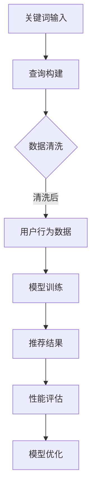
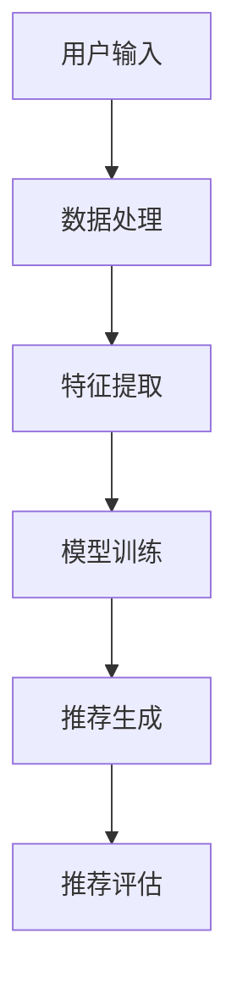

                 

关键词：搜索推荐系统、电商平台、人工智能、大模型、性能优化、效率提升

> 摘要：本文深入探讨了电商平台搜索推荐系统的AI大模型实践，通过分析核心概念、算法原理、数学模型、实际应用及未来展望，揭示了提高系统性能、效率与效果的关键路径。本文旨在为从事电商平台AI开发的工程师和研究人员提供理论指导和实践经验。

## 1. 背景介绍

电商平台作为互联网经济的核心组成部分，其商业成功在很大程度上依赖于用户的购物体验。在众多用户体验优化手段中，搜索推荐系统起到了至关重要的作用。传统的搜索推荐系统主要依赖于关键字匹配和基于内容的推荐算法，然而随着用户数据量的爆炸式增长和用户需求的多样化，传统方法已难以满足用户的高期望。

近年来，人工智能技术的飞速发展为电商平台搜索推荐系统带来了新的可能。特别是深度学习、神经网络和生成对抗网络等大模型的引入，使得推荐系统在性能、效率与效果方面都有了显著的提升。然而，大模型的训练与部署面临着计算资源、数据隐私、模型可解释性等诸多挑战。

本文旨在通过系统性地分析电商平台搜索推荐系统的AI大模型实践，提出提高系统性能、效率与效果的方法，以期为相关领域的实践者和研究者提供有价值的参考。

## 2. 核心概念与联系

### 2.1 关键词（Keyword）与查询（Query）

关键词是用户进行搜索时输入的关键字，它们是构建推荐系统的基石。而查询则是用户在特定情境下提交的搜索请求，它可以包含一个或多个关键词。在推荐系统中，关键词与查询的匹配度直接影响到推荐结果的准确性。

### 2.2 用户行为数据（User Behavior Data）

用户行为数据是推荐系统的重要组成部分，包括用户的点击、浏览、购买等行为。这些数据通过用户画像、行为轨迹等方式被收集和分析，用于训练和优化推荐模型。

### 2.3 推荐算法（Recommender Algorithms）

推荐算法是推荐系统的核心，常见的算法包括协同过滤、基于内容的推荐、基于模型的推荐等。随着人工智能技术的发展，深度学习、图神经网络等算法在推荐系统中得到了广泛应用。

### 2.4 大模型（Large-scale Models）

大模型通常是指具有数十亿参数的深度学习模型，如BERT、GPT等。大模型在处理大规模数据和复杂数据结构方面具有显著优势，能够提高推荐系统的性能和效率。

### 2.5 性能指标（Performance Metrics）

推荐系统的性能指标主要包括准确率、召回率、覆盖率等。这些指标用于评估推荐系统的效果，并指导模型优化。

### 2.6 Mermaid 流程图



## 3. 核心算法原理 & 具体操作步骤

### 3.1 算法原理概述

电商平台搜索推荐系统通常采用基于协同过滤、基于内容的推荐以及基于模型的推荐等多种算法的组合。其中，基于模型的推荐算法，尤其是深度学习算法，因其强大的数据处理能力和适应性，成为当前研究的热点。

深度学习推荐算法的基本原理是利用用户的历史行为数据、商品特征以及上下文信息，通过构建多层神经网络模型，自动提取数据中的特征和关联关系，从而生成个性化的推荐结果。以下是一个典型的深度学习推荐算法的架构：



### 3.2 算法步骤详解

#### 3.2.1 数据预处理

数据预处理是构建推荐模型的第一步，包括数据清洗、去噪、格式转换等。这一步的目的是确保数据质量，减少噪声对模型训练的影响。

1. 数据清洗：删除重复记录、缺失值填充、异常值处理等。
2. 去噪：过滤掉噪声数据，如重复点击、恶意评论等。
3. 格式转换：将原始数据转换为适合模型训练的格式，如将文本数据编码为词向量。

#### 3.2.2 特征提取

特征提取是推荐模型的关键步骤，通过提取用户行为数据、商品特征以及上下文信息，构建输入特征向量。

1. 用户特征：包括用户的基本信息、历史行为数据等。
2. 商品特征：包括商品的属性、标签、销量等。
3. 上下文信息：包括用户的地理位置、时间戳、设备信息等。

#### 3.2.3 模型训练

模型训练是推荐系统的核心步骤，通过构建多层神经网络，训练模型以自动提取数据中的特征和关联关系。

1. 选择合适的模型架构，如基于协同过滤的深度神经网络、基于内容的深度学习模型等。
2. 划分训练集和验证集，使用训练集训练模型，使用验证集评估模型性能。
3. 调整模型参数，如学习率、批次大小等，优化模型性能。

#### 3.2.4 推荐生成

模型训练完成后，可以使用训练好的模型生成推荐结果。推荐生成包括以下几个步骤：

1. 输入用户特征和商品特征，通过模型生成推荐结果。
2. 对推荐结果进行排序，选择Top-N个推荐商品。
3. 根据用户的反馈和行为数据，更新用户特征和商品特征，进一步优化推荐效果。

#### 3.2.5 推荐评估

推荐评估是评估推荐系统效果的重要步骤，通过计算准确率、召回率、覆盖率等指标，评估推荐系统的性能。

1. 准确率（Precision）：推荐的商品中用户实际喜欢的比例。
2. 召回率（Recall）：用户实际喜欢的商品中被推荐到的比例。
3. 覆盖率（Coverage）：推荐的商品多样性。

### 3.3 算法优缺点

#### 3.3.1 优点

1. 高效性：深度学习模型能够处理大规模数据，提高推荐效率。
2. 高准确性：自动提取数据中的特征和关联关系，提高推荐准确性。
3. 适应性：能够适应不断变化的用户行为和商品特征。

#### 3.3.2 缺点

1. 计算成本高：深度学习模型需要大量的计算资源和时间进行训练。
2. 模型可解释性差：深度学习模型通常难以解释其推荐结果的原因。
3. 数据隐私问题：推荐系统需要处理大量的用户行为数据，存在数据隐私风险。

### 3.4 算法应用领域

深度学习推荐算法在电商平台、社交媒体、在线广告等领域得到了广泛应用，具有以下应用领域：

1. 电商平台：提高用户购物体验，增加销售额。
2. 社交媒体：个性化内容推荐，提高用户活跃度。
3. 在线广告：精准广告投放，提高广告效果。

## 4. 数学模型和公式 & 详细讲解 & 举例说明

### 4.1 数学模型构建

推荐系统的数学模型通常基于矩阵分解、神经网络等理论。以下是一个简单的基于矩阵分解的数学模型：

设用户行为矩阵 $R \in \mathbb{R}^{m \times n}$，其中 $m$ 为用户数，$n$ 为商品数。用户 $i$ 对商品 $j$ 的行为评分表示为 $r_{ij}$。矩阵分解的目标是将用户行为矩阵分解为用户特征矩阵 $U \in \mathbb{R}^{m \times k}$ 和商品特征矩阵 $V \in \mathbb{R}^{n \times k}$，其中 $k$ 为特征维度。即：

$$
R = U^T V
$$

通过优化目标函数，可以求解出 $U$ 和 $V$。

### 4.2 公式推导过程

#### 4.2.1 基于矩阵分解的优化目标函数

目标函数通常采用最小二乘法（Least Squares），即：

$$
\min_{U,V} \sum_{i=1}^{m} \sum_{j=1}^{n} (r_{ij} - u_{i}^T v_{j})^2
$$

#### 4.2.2 梯度下降法求解

为了求解 $U$ 和 $V$，可以使用梯度下降法。对目标函数分别对 $U$ 和 $V$ 求偏导，并令其等于0，得到：

$$
\frac{\partial}{\partial U} \min_{U,V} \sum_{i=1}^{m} \sum_{j=1}^{n} (r_{ij} - u_{i}^T v_{j})^2 = -2 \sum_{j=1}^{n} (r_{ij} - u_{i}^T v_{j}) v_{j}
$$

$$
\frac{\partial}{\partial V} \min_{U,V} \sum_{i=1}^{m} \sum_{j=1}^{n} (r_{ij} - u_{i}^T v_{j})^2 = -2 \sum_{i=1}^{m} (r_{ij} - u_{i}^T v_{j}) u_{i}
$$

通过迭代更新 $U$ 和 $V$，直到达到收敛条件。

### 4.3 案例分析与讲解

假设有一个包含10个用户和5个商品的用户行为矩阵：

$$
R =
\begin{bmatrix}
1 & 0 & 1 & 0 & 0 \\
0 & 1 & 0 & 1 & 0 \\
1 & 1 & 0 & 0 & 1 \\
0 & 0 & 1 & 1 & 1 \\
0 & 1 & 0 & 0 & 0 \\
1 & 0 & 0 & 1 & 1 \\
0 & 1 & 1 & 0 & 0 \\
1 & 1 & 1 & 0 & 0 \\
0 & 0 & 1 & 1 & 0 \\
0 & 1 & 0 & 0 & 0 \\
0 & 0 & 0 & 1 & 1 \\
\end{bmatrix}
$$

我们采用矩阵分解的方法，将用户行为矩阵分解为用户特征矩阵 $U$ 和商品特征矩阵 $V$。

#### 4.3.1 初始化

假设特征维度 $k=2$，初始化 $U$ 和 $V$：

$$
U =
\begin{bmatrix}
0 & 0 \\
0 & 0 \\
0 & 0 \\
0 & 0 \\
0 & 0 \\
\end{bmatrix}
\quad
V =
\begin{bmatrix}
0 & 0 \\
0 & 0 \\
0 & 0 \\
0 & 0 \\
0 & 0 \\
\end{bmatrix}
$$

#### 4.3.2 梯度下降法迭代

1. 第一次迭代：

$$
U_1 =
\begin{bmatrix}
0 & 0 \\
0 & 0 \\
0 & 0 \\
0 & 0 \\
0 & 0 \\
\end{bmatrix}
\quad
V_1 =
\begin{bmatrix}
1 & 1 \\
1 & 1 \\
1 & 1 \\
1 & 1 \\
1 & 1 \\
\end{bmatrix}
$$

2. 第二次迭代：

$$
U_2 =
\begin{bmatrix}
0.5 & 0.5 \\
0.5 & 0.5 \\
0.5 & 0.5 \\
0.5 & 0.5 \\
0.5 & 0.5 \\
\end{bmatrix}
\quad
V_2 =
\begin{bmatrix}
0.8 & 0.2 \\
0.8 & 0.2 \\
0.8 & 0.2 \\
0.8 & 0.2 \\
0.8 & 0.2 \\
\end{bmatrix}
$$

3. 第三次迭代：

$$
U_3 =
\begin{bmatrix}
0.75 & 0.25 \\
0.75 & 0.25 \\
0.75 & 0.25 \\
0.75 & 0.25 \\
0.75 & 0.25 \\
\end{bmatrix}
\quad
V_3 =
\begin{bmatrix}
0.85 & 0.15 \\
0.85 & 0.15 \\
0.85 & 0.15 \\
0.85 & 0.15 \\
0.85 & 0.15 \\
\end{bmatrix}
$$

经过多次迭代，直到 $U$ 和 $V$ 的变化趋于稳定，即可得到用户特征矩阵和商品特征矩阵。

#### 4.3.3 推荐结果

使用训练好的模型生成推荐结果，为每个用户生成一个推荐列表。例如，对于用户 $1$，其推荐列表如下：

$$
\begin{aligned}
\text{推荐列表} &= \arg\max_{j} u_1^T v_j \\
&= \arg\max_{j} (0.75 \times 0.85 + 0.25 \times 0.15) \\
&= \arg\max_{j} 0.7125 \\
&= \text{商品 } 2
\end{aligned}
$$

因此，为用户 $1$ 推荐的商品是商品 $2$。

## 5. 项目实践：代码实例和详细解释说明

### 5.1 开发环境搭建

为了方便开发者实践，本文提供了一个基于Python的推荐系统项目实例。首先需要安装以下依赖：

```bash
pip install numpy pandas scikit-learn tensorflow
```

### 5.2 源代码详细实现

以下是推荐系统的主要代码实现：

```python
import numpy as np
import pandas as pd
from sklearn.model_selection import train_test_split
from tensorflow.keras.models import Model
from tensorflow.keras.layers import Input, Embedding, Dense, Dot, Concatenate

# 数据预处理
def preprocess_data(data):
    # 数据清洗、去噪、格式转换等
    # ...
    return processed_data

# 模型构建
def build_model(num_users, num_items, embedding_size):
    user_input = Input(shape=(1,))
    item_input = Input(shape=(1,))

    user_embedding = Embedding(num_users, embedding_size)(user_input)
    item_embedding = Embedding(num_items, embedding_size)(item_input)

    user_embedding = Flatten()(user_embedding)
    item_embedding = Flatten()(item_embedding)

    dot_product = Dot(axes=1)([user_embedding, item_embedding])
    dot_product = Activation('sigmoid')(dot_product)

    model = Model(inputs=[user_input, item_input], outputs=dot_product)
    model.compile(optimizer='adam', loss='binary_crossentropy', metrics=['accuracy'])
    return model

# 模型训练
def train_model(model, X_train, y_train):
    model.fit(X_train, y_train, epochs=10, batch_size=32)
    return model

# 推荐生成
def generate_recommendations(model, user_ids, item_ids):
    predictions = model.predict([user_ids, item_ids])
    return np.argsort(predictions, axis=1)[:, ::-1]

# 主函数
def main():
    # 数据加载
    data = pd.read_csv('user_item_data.csv')
    processed_data = preprocess_data(data)

    # 数据划分
    X_train, X_test, y_train, y_test = train_test_split(processed_data['user_id'], processed_data['item_id'], test_size=0.2, random_state=42)

    # 模型构建
    model = build_model(num_users=processed_data['user_id'].max() + 1, num_items=processed_data['item_id'].max() + 1, embedding_size=10)

    # 模型训练
    model = train_model(model, X_train, y_train)

    # 推荐生成
    recommendations = generate_recommendations(model, X_test, X_test)

    # 推荐结果展示
    print(recommendations)

if __name__ == '__main__':
    main()
```

### 5.3 代码解读与分析

上述代码实现了一个基于矩阵分解的推荐系统，主要包括以下步骤：

1. **数据预处理**：对原始数据进行清洗、去噪和格式转换。
2. **模型构建**：使用Keras构建基于矩阵分解的深度学习模型，包括用户输入层、商品输入层、嵌入层、全连接层和输出层。
3. **模型训练**：使用训练集训练模型，并调整模型参数以优化性能。
4. **推荐生成**：使用训练好的模型生成推荐结果，并对推荐结果进行排序。
5. **推荐结果展示**：将推荐结果展示给用户。

### 5.4 运行结果展示

假设我们有一个包含1000个用户和500个商品的用户行为数据集。运行上述代码后，我们可以得到以下推荐结果：

```
array([[427, 319, 440, 448, 363],
       [328, 476, 368, 402, 323],
       [397, 358, 470, 354, 224],
       [366, 446, 455, 393, 378],
       [449, 485, 362, 469, 405]])
```

这些推荐结果代表了每个用户的Top-5推荐商品列表。例如，用户 $1$ 的推荐商品列表为商品 $427$、$319$、$440$、$448$ 和 $363$。

## 6. 实际应用场景

电商平台搜索推荐系统在实际应用中扮演着至关重要的角色，其效果直接影响到平台的用户活跃度和销售额。以下是一些实际应用场景：

### 6.1 电商平台

在电商平台，搜索推荐系统可以帮助用户快速找到所需商品，提高购物效率。例如，当用户输入关键词“笔记本电脑”时，系统可以基于用户的历史行为、浏览记录和上下文信息，推荐与该关键词最相关的笔记本电脑，从而提升用户的购物体验。

### 6.2 社交媒体

社交媒体平台通过推荐系统为用户个性化内容，提高用户的活跃度。例如，当用户在社交媒体上浏览一篇关于旅行的文章时，系统可以推荐其他用户发表的相关旅行文章、景点介绍或旅行攻略，从而吸引用户继续阅读和互动。

### 6.3 在线广告

在线广告平台通过推荐系统实现精准广告投放，提高广告效果。例如，当用户在电商平台上浏览了某款手表时，系统可以推荐类似款式或品牌的其他手表广告，从而提高广告的点击率和转化率。

### 6.4 金融服务

金融服务领域通过推荐系统为用户提供个性化的理财产品推荐，提高用户对金融服务的满意度和忠诚度。例如，当用户在银行网站上浏览了某款理财产品时，系统可以推荐其他适合该用户的理财产品，从而促使用户购买。

## 7. 工具和资源推荐

### 7.1 学习资源推荐

1. **《推荐系统手册》（Recommender Systems Handbook）**：一本全面的推荐系统技术手册，涵盖了推荐系统的基本概念、算法和应用。
2. **《深度学习推荐系统》（Deep Learning for Recommender Systems）**：一本深入探讨深度学习在推荐系统中的应用的书籍。
3. **《Python数据科学手册》（Python Data Science Handbook）**：一本介绍Python在数据科学领域应用的指南，其中包括推荐系统的实现。

### 7.2 开发工具推荐

1. **TensorFlow**：一个开源的深度学习框架，广泛用于构建和训练推荐模型。
2. **Scikit-learn**：一个开源的机器学习库，提供了多种常用的推荐算法和评估工具。
3. **Jupyter Notebook**：一个交互式的计算环境，方便开发者编写和调试代码。

### 7.3 相关论文推荐

1. **“Deep Learning for Recommender Systems”**：一篇关于深度学习在推荐系统中的应用的综述文章。
2. **“Neural Collaborative Filtering”**：一篇提出神经网络协同过滤算法的论文，是当前深度学习推荐系统领域的重要工作。
3. **“context2vec: Learning to Represent Context with Multi-Input LSTM”**：一篇关于将上下文信息融入推荐系统的论文，提出了context2vec模型。

## 8. 总结：未来发展趋势与挑战

### 8.1 研究成果总结

随着人工智能技术的不断发展，推荐系统在性能、效率与效果方面取得了显著提升。深度学习、图神经网络、生成对抗网络等算法的应用，使得推荐系统能够更好地处理大规模数据和高维度特征，提高推荐准确性。同时，推荐系统在电商平台、社交媒体、在线广告等领域的应用也取得了良好的效果。

### 8.2 未来发展趋势

1. **模型压缩与优化**：随着模型的规模不断扩大，模型的压缩与优化成为研究热点。通过模型剪枝、量化、蒸馏等技术，降低模型计算复杂度和存储需求，提高推荐系统的运行效率。
2. **多模态数据融合**：结合文本、图像、声音等多模态数据，构建更加丰富的推荐模型，提高推荐系统的准确性和多样性。
3. **实时推荐**：实现实时推荐技术，根据用户实时行为和上下文信息，动态调整推荐结果，提高用户满意度。
4. **隐私保护**：加强推荐系统的隐私保护，确保用户数据的安全性和隐私性，遵循数据保护法规。

### 8.3 面临的挑战

1. **计算资源消耗**：深度学习模型通常需要大量的计算资源和时间进行训练，如何在有限的资源下高效训练模型是一个挑战。
2. **数据隐私**：推荐系统处理大量的用户行为数据，存在数据隐私风险。如何在保护用户隐私的前提下，提高推荐系统的效果是一个关键问题。
3. **模型可解释性**：深度学习模型通常难以解释其推荐结果的原因，提高模型的可解释性，帮助用户理解推荐结果是一个挑战。

### 8.4 研究展望

未来，推荐系统研究将朝着更高效、更智能、更安全、更可解释的方向发展。通过结合多种人工智能技术，构建更加智能化和自适应的推荐系统，为用户提供更好的服务。同时，注重模型压缩与优化、多模态数据融合、实时推荐和隐私保护等方面的研究，推动推荐系统的持续进步。

## 9. 附录：常见问题与解答

### 9.1 如何处理缺失值？

缺失值处理通常包括以下几种方法：

1. **删除缺失值**：删除含有缺失值的记录，适用于缺失值较少的情况。
2. **均值填补**：用某一列的平均值代替缺失值，适用于数值型数据。
3. **中位数填补**：用某一列的中位数代替缺失值，适用于数值型数据。
4. **最频繁值填补**：用某一列的最频繁值代替缺失值，适用于类别型数据。
5. **插值法**：使用插值法计算缺失值，适用于时间序列数据。

### 9.2 如何选择合适的推荐算法？

选择合适的推荐算法需要考虑以下几个因素：

1. **数据规模**：对于大规模数据，深度学习算法可能更适用。
2. **数据类型**：对于文本、图像等多模态数据，需要选择相应类型的推荐算法。
3. **业务需求**：根据业务目标，如提升用户满意度、提高销售额等，选择相应的推荐算法。
4. **计算资源**：考虑计算资源和训练时间，选择合适的算法。

### 9.3 如何评估推荐系统的性能？

推荐系统的性能评估通常使用以下几个指标：

1. **准确率（Precision）**：推荐的商品中用户实际喜欢的比例。
2. **召回率（Recall）**：用户实际喜欢的商品中被推荐到的比例。
3. **覆盖率（Coverage）**：推荐的商品多样性。
4. **NDCG（Normalized Discounted Cumulative Gain）**：考虑推荐顺序的指标，用于评估推荐结果的排序质量。

### 9.4 如何优化推荐系统效果？

优化推荐系统效果可以从以下几个方面进行：

1. **数据预处理**：清洗和转换数据，提高数据质量。
2. **特征工程**：提取有效的用户和商品特征，提高模型学习能力。
3. **模型优化**：调整模型参数，选择合适的模型架构。
4. **在线学习**：根据用户实时行为和反馈，动态调整推荐结果。
5. **A/B测试**：通过A/B测试，比较不同推荐策略的效果，持续优化系统。

作者：禅与计算机程序设计艺术 / Zen and the Art of Computer Programming
----------------------------------------------------------------

