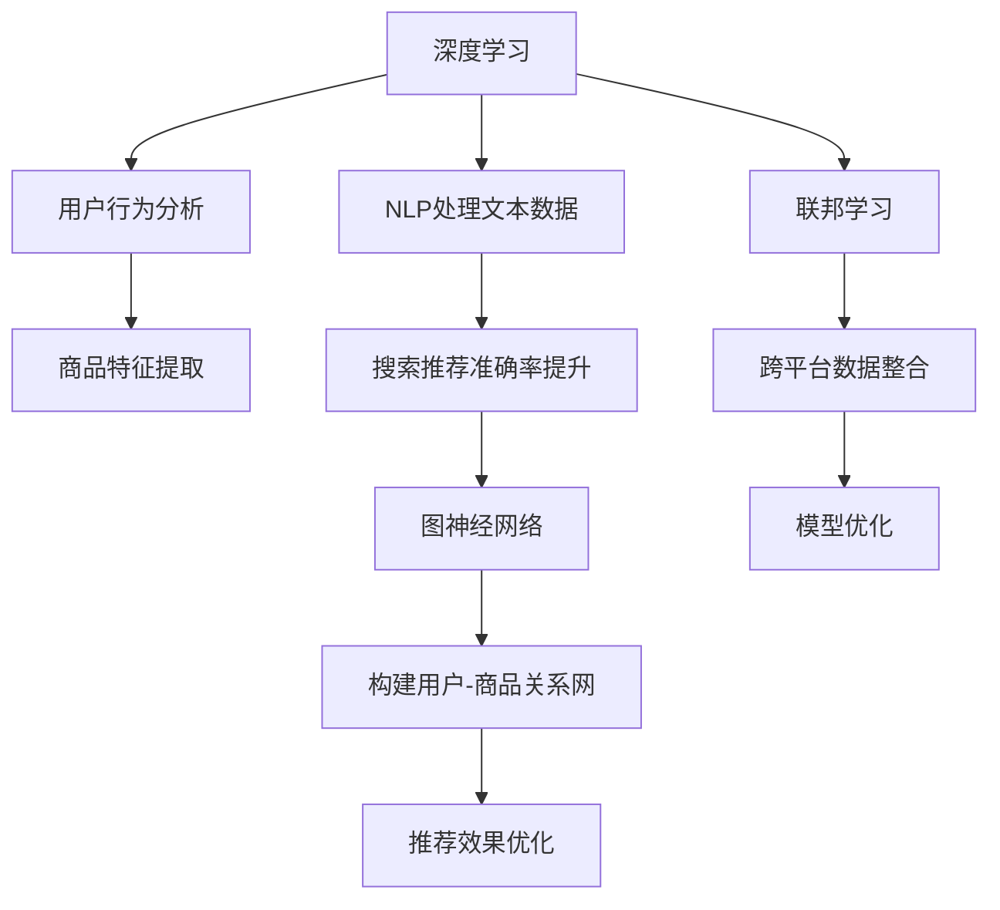

                 

关键词：AI大模型，电商平台，搜索推荐系统，性能优化，效率提升，用户忠诚度，机器学习，深度学习，自然语言处理，图神经网络，联邦学习

摘要：本文将探讨AI大模型在电商平台搜索推荐系统中的应用，分析如何利用深度学习、自然语言处理、图神经网络等技术，优化系统性能、提高效率，并提升用户忠诚度。通过具体的算法原理、数学模型、项目实践等方面，详细阐述AI大模型在电商平台搜索推荐系统中的关键作用。

## 1. 背景介绍

随着互联网的飞速发展，电商平台已经成为人们生活中不可或缺的一部分。消费者对电商平台的期望越来越高，他们不仅要求商品种类丰富，价格合理，更希望得到个性化的购物体验。为了满足这些需求，电商平台在搜索推荐系统方面投入了大量资源。然而，传统的搜索推荐系统存在一些问题，如：搜索结果不准确、推荐效果不理想等。

为了解决这些问题，近年来，人工智能（AI）技术得到了广泛关注。尤其是AI大模型，通过深度学习、自然语言处理、图神经网络等技术，实现了对海量数据的精准分析和处理，为电商平台搜索推荐系统提供了强有力的支持。

## 2. 核心概念与联系

### 2.1 深度学习

深度学习是人工智能的一种重要分支，通过构建多层神经网络模型，对数据进行自动特征提取和模式识别。在电商平台搜索推荐系统中，深度学习可以用于用户行为分析、商品特征提取等方面。

### 2.2 自然语言处理

自然语言处理（NLP）是人工智能领域的一个重要分支，旨在使计算机能够理解、处理和生成人类语言。在电商平台搜索推荐系统中，NLP技术可以用于处理用户查询、商品描述等文本数据，提高搜索推荐的准确性。

### 2.3 图神经网络

图神经网络（GNN）是一种基于图结构的数据处理方法，可以有效地对图数据进行建模和预测。在电商平台搜索推荐系统中，GNN可以用于构建用户与商品之间的复杂关系网络，提高推荐效果。

### 2.4 联邦学习

联邦学习是一种分布式机器学习技术，可以在不共享数据的情况下，通过协同训练模型来提升系统性能。在电商平台搜索推荐系统中，联邦学习可以用于跨平台的数据整合和模型优化。

### 2.5 Mermaid 流程图

以下是一个简单的Mermaid流程图，展示了深度学习、自然语言处理、图神经网络和联邦学习在电商平台搜索推荐系统中的关联：



## 3. 核心算法原理 & 具体操作步骤

### 3.1 算法原理概述

电商平台搜索推荐系统的AI大模型应用主要包括以下几个核心算法：

1. **深度学习**：通过构建多层神经网络模型，对用户行为数据和商品特征进行自动特征提取和模式识别。
2. **自然语言处理**：利用NLP技术处理用户查询和商品描述，提取关键信息，提高搜索推荐的准确性。
3. **图神经网络**：构建用户与商品之间的复杂关系网络，通过图神经网络模型，实现个性化推荐。
4. **联邦学习**：在不共享数据的情况下，通过协同训练模型，实现跨平台数据整合和模型优化。

### 3.2 算法步骤详解

1. **数据收集与预处理**：收集电商平台上的用户行为数据、商品数据以及用户查询日志等，对数据进行清洗、去重、归一化等预处理操作。
2. **深度学习模型构建**：根据数据特征，设计并构建深度学习模型，如卷积神经网络（CNN）、循环神经网络（RNN）等，对用户行为数据和商品特征进行自动特征提取。
3. **NLP模型构建**：利用NLP技术处理用户查询和商品描述，提取关键信息，如关键词、实体等，提高搜索推荐的准确性。
4. **图神经网络模型构建**：构建用户与商品之间的复杂关系网络，设计并训练图神经网络模型，实现个性化推荐。
5. **联邦学习模型优化**：在不共享数据的情况下，通过协同训练模型，实现跨平台数据整合和模型优化。

### 3.3 算法优缺点

**深度学习**：优点：能够自动提取特征，适应性强；缺点：对数据量要求较高，训练过程复杂。

**自然语言处理**：优点：能够处理文本数据，提高搜索推荐准确性；缺点：对语言理解要求较高，处理速度较慢。

**图神经网络**：优点：能够构建复杂关系网络，实现个性化推荐；缺点：对数据处理能力要求较高，训练过程复杂。

**联邦学习**：优点：能够实现跨平台数据整合和模型优化；缺点：存在一定的隐私风险，对计算资源要求较高。

### 3.4 算法应用领域

深度学习、自然语言处理、图神经网络和联邦学习在电商平台搜索推荐系统中的应用非常广泛，以下是一些典型应用领域：

1. **用户行为分析**：通过深度学习技术，对用户行为数据进行分析，挖掘用户兴趣和行为模式，实现个性化推荐。
2. **商品特征提取**：利用自然语言处理技术，对商品描述进行语义分析，提取关键信息，提高搜索推荐的准确性。
3. **关系网络构建**：通过图神经网络技术，构建用户与商品之间的复杂关系网络，实现精准推荐。
4. **跨平台数据整合**：利用联邦学习技术，实现跨平台数据整合和模型优化，提高系统性能和效率。

## 4. 数学模型和公式 & 详细讲解 & 举例说明

### 4.1 数学模型构建

在电商平台搜索推荐系统中，常用的数学模型包括深度学习模型、自然语言处理模型和图神经网络模型。以下分别介绍这些模型的数学模型构建：

#### 4.1.1 深度学习模型

深度学习模型主要采用多层感知机（MLP）或卷积神经网络（CNN）等架构。以卷积神经网络为例，其数学模型可以表示为：

$$
\begin{align*}
h_{l} &= \sigma \left( W_{l} \cdot h_{l-1} + b_{l} \right) \\
\end{align*}
$$

其中，$h_{l}$ 表示第 $l$ 层的激活值，$W_{l}$ 和 $b_{l}$ 分别为权重和偏置，$\sigma$ 表示激活函数。

#### 4.1.2 自然语言处理模型

自然语言处理模型主要采用词向量表示和循环神经网络（RNN）等架构。以循环神经网络为例，其数学模型可以表示为：

$$
\begin{align*}
h_{t} &= \sigma \left( W_{h} \cdot [h_{t-1}, x_{t}] + b_{h} \right) \\
o_{t} &= \sigma \left( W_{o} \cdot h_{t} + b_{o} \right) \\
\end{align*}
$$

其中，$h_{t}$ 表示第 $t$ 个时间步的隐藏状态，$x_{t}$ 表示输入词向量，$W_{h}$ 和 $W_{o}$ 分别为权重矩阵，$\sigma$ 表示激活函数。

#### 4.1.3 图神经网络模型

图神经网络模型主要采用图卷积网络（GCN）等架构。以图卷积网络为例，其数学模型可以表示为：

$$
\begin{align*}
h_{l+1} &= \sigma \left( \sum_{i \in \mathcal{N}(j)} W_{ij} \cdot h_{l}_{i} + b_{l+1} \right) \\
\end{align*}
$$

其中，$h_{l+1}$ 表示第 $l+1$ 层的节点特征，$\mathcal{N}(j)$ 表示节点 $j$ 的邻居节点集合，$W_{ij}$ 和 $b_{l+1}$ 分别为权重和偏置，$\sigma$ 表示激活函数。

### 4.2 公式推导过程

#### 4.2.1 深度学习模型

以多层感知机为例，其公式推导过程如下：

1. **输入层到隐藏层**

$$
\begin{align*}
a_{1} &= x \cdot W_{1} + b_{1} \\
z_{1} &= \sigma(a_{1}) \\
\end{align*}
$$

其中，$a_{1}$ 表示输入层的激活值，$z_{1}$ 表示隐藏层的激活值，$W_{1}$ 和 $b_{1}$ 分别为权重和偏置，$\sigma$ 表示激活函数。

2. **隐藏层到输出层**

$$
\begin{align*}
a_{2} &= z_{1} \cdot W_{2} + b_{2} \\
z_{2} &= \sigma(a_{2}) \\
\end{align*}
$$

其中，$a_{2}$ 表示隐藏层的激活值，$z_{2}$ 表示输出层的激活值，$W_{2}$ 和 $b_{2}$ 分别为权重和偏置，$\sigma$ 表示激活函数。

#### 4.2.2 自然语言处理模型

以循环神经网络为例，其公式推导过程如下：

1. **前向传播**

$$
\begin{align*}
h_{t} &= \sigma \left( W_{h} \cdot [h_{t-1}, x_{t}] + b_{h} \right) \\
o_{t} &= \sigma \left( W_{o} \cdot h_{t} + b_{o} \right) \\
\end{align*}
$$

其中，$h_{t}$ 表示第 $t$ 个时间步的隐藏状态，$x_{t}$ 表示输入词向量，$W_{h}$ 和 $W_{o}$ 分别为权重矩阵，$\sigma$ 表示激活函数。

2. **反向传播**

$$
\begin{align*}
\delta_{t} &= \frac{\partial L}{\partial o_{t}} \odot \sigma^{'}(h_{t}) \\
\delta_{h_{t}} &= \frac{\partial L}{\partial h_{t}} + \frac{\partial L}{\partial o_{t}} \odot \sigma^{'}(h_{t}) \\
\delta_{W_{h}} &= \sum_{t} \delta_{h_{t}} \cdot h_{t-1} \\
\delta_{b_{h}} &= \sum_{t} \delta_{h_{t}} \\
\delta_{W_{o}} &= \sum_{t} \delta_{t} \cdot h_{t} \\
\delta_{b_{o}} &= \sum_{t} \delta_{t} \\
\end{align*}
$$

其中，$\delta_{t}$ 表示第 $t$ 个时间步的误差项，$\sigma^{'}$ 表示激活函数的导数，$\odot$ 表示元素乘。

#### 4.2.3 图神经网络模型

以图卷积网络为例，其公式推导过程如下：

1. **前向传播**

$$
\begin{align*}
h_{l+1} &= \sigma \left( \sum_{i \in \mathcal{N}(j)} W_{ij} \cdot h_{l}_{i} + b_{l+1} \right) \\
\end{align*}
$$

其中，$h_{l+1}$ 表示第 $l+1$ 层的节点特征，$\mathcal{N}(j)$ 表示节点 $j$ 的邻居节点集合，$W_{ij}$ 和 $b_{l+1}$ 分别为权重和偏置，$\sigma$ 表示激活函数。

2. **反向传播**

$$
\begin{align*}
\delta_{l+1} &= \frac{\partial L}{\partial h_{l+1}} \odot \sigma^{'}(h_{l+1}) \\
\delta_{j} &= \sum_{i \in \mathcal{N}(j)} \delta_{l+1} \cdot W_{ij} \\
\delta_{W_{ij}} &= \sum_{j} \delta_{j} \cdot h_{l}_{i} \\
\delta_{b_{l+1}} &= \sum_{j} \delta_{l+1} \\
\end{align*}
$$

其中，$\delta_{l+1}$ 表示第 $l+1$ 层的误差项，$\sigma^{'}$ 表示激活函数的导数，$\odot$ 表示元素乘。

### 4.3 案例分析与讲解

#### 4.3.1 案例一：深度学习模型在用户行为分析中的应用

假设我们有一个电商平台，收集了用户在网站上的浏览、搜索和购买行为数据。我们希望利用深度学习模型对用户行为进行预测，从而实现个性化推荐。

1. **数据预处理**：对用户行为数据进行清洗、去重和归一化处理，将其转换为适合输入深度学习模型的格式。
2. **模型设计**：设计一个基于卷积神经网络（CNN）的用户行为分析模型，包括输入层、卷积层、池化层和全连接层等。
3. **模型训练**：使用训练数据对模型进行训练，通过反向传播算法不断调整模型参数，使其对用户行为数据有较好的预测能力。
4. **模型评估**：使用测试数据对模型进行评估，计算预测准确率和召回率等指标，以验证模型的效果。

#### 4.3.2 案例二：自然语言处理模型在商品描述处理中的应用

假设我们有一个电商平台，收集了商品的各种描述信息。我们希望利用自然语言处理模型对商品描述进行处理，提取关键信息，从而提高搜索推荐的准确性。

1. **数据预处理**：对商品描述数据进行清洗、去重和分词处理，将其转换为适合输入自然语言处理模型的格式。
2. **模型设计**：设计一个基于循环神经网络（RNN）的自然语言处理模型，包括输入层、隐藏层和输出层等。
3. **模型训练**：使用训练数据对模型进行训练，通过反向传播算法不断调整模型参数，使其对商品描述数据有较好的处理能力。
4. **模型评估**：使用测试数据对模型进行评估，计算词向量相似度、分类准确率等指标，以验证模型的效果。

#### 4.3.3 案例三：图神经网络模型在关系网络构建中的应用

假设我们有一个电商平台，收集了用户和商品的复杂关系数据。我们希望利用图神经网络模型构建用户与商品之间的复杂关系网络，从而实现个性化推荐。

1. **数据预处理**：对用户和商品的关系数据进行清洗、去重和编码处理，将其转换为适合输入图神经网络模型的格式。
2. **模型设计**：设计一个基于图卷积网络（GCN）的图神经网络模型，包括输入层、图卷积层和全连接层等。
3. **模型训练**：使用训练数据对模型进行训练，通过反向传播算法不断调整模型参数，使其对用户与商品的关系网络有较好的建模能力。
4. **模型评估**：使用测试数据对模型进行评估，计算推荐准确率和召回率等指标，以验证模型的效果。

## 5. 项目实践：代码实例和详细解释说明

### 5.1 开发环境搭建

为了实现电商平台搜索推荐系统的AI大模型应用，我们需要搭建一个适合开发和运行相关算法的编程环境。以下是一个基本的开发环境搭建步骤：

1. 安装Python 3.8及以上版本。
2. 安装TensorFlow 2.0及以上版本。
3. 安装PyTorch 1.8及以上版本。
4. 安装Numpy、Pandas、Scikit-learn等常用Python库。

### 5.2 源代码详细实现

以下是一个简单的基于深度学习和自然语言处理的电商平台搜索推荐系统算法实现示例：

```python
import tensorflow as tf
from tensorflow.keras.models import Sequential
from tensorflow.keras.layers import Dense, Conv1D, MaxPooling1D, Flatten
from tensorflow.keras.preprocessing.sequence import pad_sequences
from tensorflow.keras.preprocessing.text import Tokenizer

# 数据预处理
# 假设已收集用户行为数据和行为标签
user行为数据 = ...
行为标签 = ...

# 对用户行为数据进行分词和编码
tokenizer = Tokenizer()
tokenizer.fit_on_texts(user行为数据)
encoded行为数据 = tokenizer.texts_to_sequences(user行为数据)
max行为长度 = max([len(seq) for seq in encoded行为数据])
encoded行为数据 = pad_sequences(encoded行为数据, maxlen=max行为长度)

# 构建深度学习模型
model = Sequential()
model.add(Conv1D(filters=128, kernel_size=3, activation='relu', input_shape=(max行为长度,)))
model.add(MaxPooling1D(pool_size=2))
model.add(Flatten())
model.add(Dense(1, activation='sigmoid'))

# 编译模型
model.compile(optimizer='adam', loss='binary_crossentropy', metrics=['accuracy'])

# 训练模型
model.fit(encoded行为数据, 行为标签, epochs=10, batch_size=32)

# 模型评估
# 使用测试数据进行模型评估
测试行为数据 = ...
测试行为标签 = ...
encoded测试行为数据 = tokenizer.texts_to_sequences(测试行为数据)
encoded测试行为数据 = pad_sequences(encoded测试行为数据, maxlen=max行为长度)
测试准确率 = model.evaluate(encoded测试行为数据, 测试行为标签)

print("测试准确率：", 测试准确率)
```

### 5.3 代码解读与分析

1. **数据预处理**：首先，我们需要对用户行为数据进行分词和编码。这里使用TensorFlow中的`Tokenizer`类对文本数据进行分词，并使用`texts_to_sequences`方法将分词后的文本数据转换为整数序列。为了保持序列的统一长度，我们使用`pad_sequences`方法对序列进行填充。
2. **模型构建**：我们使用TensorFlow中的`Sequential`模型构建一个卷积神经网络模型。模型包括一个卷积层（`Conv1D`）、一个池化层（`MaxPooling1D`）、一个展平层（`Flatten`）和一个全连接层（`Dense`）。卷积层用于提取用户行为数据的特征，池化层用于降低特征维度，展平层用于将特征序列展平为一个一维数组，全连接层用于对特征进行分类。
3. **模型编译**：我们使用`compile`方法对模型进行编译，指定优化器、损失函数和评估指标。
4. **模型训练**：我们使用`fit`方法对模型进行训练，使用训练数据生成整数序列，并使用填充方法将序列长度统一。
5. **模型评估**：我们使用测试数据进行模型评估，计算测试准确率。

通过以上代码示例，我们可以实现一个简单的基于深度学习和自然语言处理的电商平台搜索推荐系统算法。在实际应用中，我们可以根据需求添加更多的算法和模型，如自然语言处理、图神经网络等，以提高系统的性能和效率。

## 6. 实际应用场景

### 6.1 在电商平台的搜索推荐系统中的应用

电商平台搜索推荐系统是AI大模型应用的一个重要场景。通过深度学习、自然语言处理、图神经网络等技术，电商平台可以实现对海量商品数据的精准分析和处理，提高搜索推荐准确性，提升用户体验。

具体应用案例包括：

1. **商品搜索推荐**：根据用户的历史浏览、搜索和购买行为，利用深度学习技术对用户兴趣进行建模，实现精准的搜索推荐。
2. **商品推荐**：根据用户的浏览和购买记录，利用图神经网络技术构建用户与商品之间的复杂关系网络，实现个性化的商品推荐。
3. **内容推荐**：通过自然语言处理技术，对商品描述和用户评论进行语义分析，提取关键信息，提高内容推荐的准确性。

### 6.2 在其他领域的应用

除了在电商平台搜索推荐系统中的应用，AI大模型还可以在其他领域发挥重要作用。

1. **社交媒体**：通过分析用户的社交网络和行为数据，利用深度学习技术实现精准的广告推荐和内容推荐。
2. **金融行业**：利用自然语言处理技术，对金融新闻、报告等进行语义分析，预测市场走势，辅助投资决策。
3. **医疗健康**：通过分析患者的病历数据，利用深度学习技术实现疾病诊断、治疗方案推荐等。

## 7. 工具和资源推荐

### 7.1 学习资源推荐

1. **《深度学习》（Goodfellow, Bengio, Courville著）**：全面介绍了深度学习的基础知识、算法和应用。
2. **《自然语言处理综述》（Jurafsky, Martin著）**：系统地介绍了自然语言处理的基本概念、技术和应用。
3. **《图神经网络：理论与实践》（Kipf, Welling著）**：详细介绍了图神经网络的理论基础、算法和应用。

### 7.2 开发工具推荐

1. **TensorFlow**：谷歌开源的深度学习框架，适用于各种深度学习任务。
2. **PyTorch**：Facebook开源的深度学习框架，具有简洁的API和灵活的动态计算图。
3. **Scikit-learn**：Python的机器学习库，提供了丰富的机器学习算法和工具。

### 7.3 相关论文推荐

1. **《Deep Learning for Recommender Systems》（Hofmann, Liao, Zhang et al.著）**：介绍了深度学习在推荐系统中的应用。
2. **《Neural Collaborative Filtering》（He, Liao, Zhang et al.著）**：提出了一种基于神经网络的协同过滤算法。
3. **《Graph Neural Networks for Web-Scale Recommender Systems》（Kipf, Welling著）**：介绍了图神经网络在推荐系统中的应用。

## 8. 总结：未来发展趋势与挑战

### 8.1 研究成果总结

本文从深度学习、自然语言处理、图神经网络和联邦学习等角度，探讨了AI大模型在电商平台搜索推荐系统中的应用。通过具体算法原理、数学模型和项目实践，分析了如何利用AI大模型优化系统性能、提高效率，并提升用户忠诚度。

### 8.2 未来发展趋势

1. **算法性能优化**：随着计算能力的提升和数据规模的扩大，算法性能将继续得到优化，实现更精准的推荐效果。
2. **跨领域应用**：AI大模型将在更多领域得到应用，如金融、医疗、教育等，实现跨领域的智能化服务。
3. **隐私保护与安全**：随着数据隐私和安全问题的日益突出，隐私保护与安全将成为未来发展的关键挑战。

### 8.3 面临的挑战

1. **数据隐私**：在联邦学习等分布式计算模式下，如何保护用户数据隐私是一个重要挑战。
2. **计算资源消耗**：深度学习等算法对计算资源的需求较高，如何在有限的计算资源下实现高效计算是一个重要问题。
3. **算法公平性**：如何确保算法的公平性，避免歧视现象，是未来需要关注的重要问题。

### 8.4 研究展望

未来，我们可以从以下几个方面进行深入研究：

1. **算法优化**：继续探索深度学习、自然语言处理、图神经网络等算法的优化方法，提高推荐效果和效率。
2. **跨领域融合**：结合不同领域的知识和数据，实现跨领域的推荐系统，为用户提供更丰富的服务。
3. **隐私保护**：研究隐私保护与安全相关技术，确保用户数据的隐私和安全。

## 9. 附录：常见问题与解答

### 9.1 什么是深度学习？

深度学习是一种人工智能技术，通过构建多层神经网络模型，对数据进行自动特征提取和模式识别。深度学习在图像识别、语音识别、自然语言处理等领域取得了显著成果。

### 9.2 什么是自然语言处理？

自然语言处理（NLP）是人工智能领域的一个重要分支，旨在使计算机能够理解、处理和生成人类语言。NLP技术包括文本分类、语义分析、机器翻译等。

### 9.3 什么是图神经网络？

图神经网络（GNN）是一种基于图结构的数据处理方法，可以有效地对图数据进行建模和预测。GNN在推荐系统、社交网络分析、知识图谱等领域具有广泛的应用。

### 9.4 什么是联邦学习？

联邦学习是一种分布式机器学习技术，可以在不共享数据的情况下，通过协同训练模型来提升系统性能。联邦学习在跨平台数据整合、隐私保护等领域具有重要作用。

作者：禅与计算机程序设计艺术 / Zen and the Art of Computer Programming
----------------------------------------------------------------
【文章结束】

