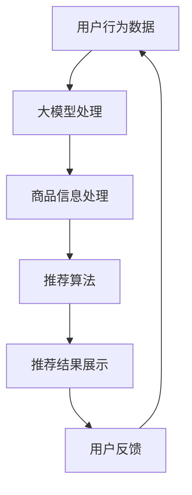

                 

关键词：AI 大模型、电商平台、搜索推荐系统、性能优化、效率提升、准确率提高

> 摘要：本文将深入探讨电商平台搜索推荐系统中的AI大模型应用，通过解析核心算法原理、数学模型构建及具体操作步骤，展示如何提高系统性能、效率和准确率。本文还结合实际项目实践，提供代码实例和详细解释，帮助读者更好地理解和应用AI大模型于电商平台搜索推荐系统中。

## 1. 背景介绍

随着互联网技术的迅猛发展，电商平台已成为消费者购买商品的重要渠道。在这个竞争激烈的市场中，如何提高用户体验、提升销售额成为电商平台的关注焦点。而搜索推荐系统作为电商平台的核心功能之一，直接影响用户的购物体验和平台的业务表现。因此，如何优化搜索推荐系统，提高其性能、效率和准确率，成为当前研究和应用的热点。

近年来，人工智能技术的飞速发展，特别是深度学习算法的广泛应用，为电商平台搜索推荐系统带来了新的机遇。大模型（Large Models）作为人工智能领域的重要研究方向，具有处理海量数据、自适应优化等功能，能够显著提升搜索推荐系统的性能。本文将围绕这一主题，探讨AI大模型在电商平台搜索推荐系统中的应用，并提出具体优化策略。

## 2. 核心概念与联系

### 2.1 AI 大模型定义

AI大模型是指具有数十亿甚至千亿参数的深度神经网络模型，能够在特定任务上达到超人类水平的表现。大模型的核心优势在于其强大的学习能力和处理复杂任务的能力。

### 2.2 搜索推荐系统基本架构

搜索推荐系统通常包括用户行为分析、商品信息处理、推荐算法和展示模块等几个关键部分。用户行为分析和商品信息处理为推荐算法提供输入，推荐算法负责生成推荐结果，展示模块则负责将推荐结果呈现给用户。

### 2.3 大模型在搜索推荐系统中的应用

AI大模型在搜索推荐系统中的应用主要体现在以下几个方面：

- **用户行为分析**：利用大模型对用户行为数据进行深入分析，挖掘用户的兴趣和偏好。
- **商品信息处理**：通过大模型对商品信息进行分类、标签化和特征提取，为推荐算法提供高质量的特征向量。
- **推荐算法**：基于大模型的强大学习能力，实现高效的推荐算法，提高推荐结果的准确性和覆盖度。
- **自适应优化**：大模型能够根据用户反馈和数据变化，自适应调整推荐策略，优化系统性能。

### 2.4 Mermaid 流程图



## 3. 核心算法原理 & 具体操作步骤

### 3.1 算法原理概述

电商平台搜索推荐系统中的AI大模型主要基于深度学习算法，尤其是基于注意力机制和生成对抗网络的混合模型。这种模型能够有效地处理用户行为数据和商品信息，实现高效、准确的推荐。

### 3.2 算法步骤详解

1. **数据预处理**：对用户行为数据和商品信息进行清洗、去噪和归一化处理，为模型训练提供高质量的数据集。
2. **模型训练**：使用预处理后的数据集，通过反向传播算法训练大模型，优化模型参数。
3. **特征提取**：利用训练好的大模型，对用户行为数据和商品信息进行特征提取，生成特征向量。
4. **推荐算法**：基于特征向量，利用协同过滤、矩阵分解等推荐算法生成推荐结果。
5. **结果评估与优化**：对推荐结果进行评估，根据评估结果调整模型参数和推荐策略。

### 3.3 算法优缺点

**优点**：

- **高效性**：大模型能够处理海量数据，实现高效的特征提取和推荐生成。
- **准确性**：基于深度学习算法，大模型能够学习到用户和商品的复杂关系，提高推荐准确性。
- **灵活性**：大模型能够根据用户反馈和数据变化，自适应调整推荐策略。

**缺点**：

- **计算资源需求高**：大模型训练和推理需要大量的计算资源和时间。
- **数据依赖性强**：大模型的效果依赖于高质量的数据集，数据质量问题会直接影响模型性能。

### 3.4 算法应用领域

AI大模型在电商平台搜索推荐系统中具有广泛的应用前景，包括但不限于：

- **商品推荐**：基于用户历史行为和商品信息，实现个性化的商品推荐。
- **广告投放**：根据用户兴趣和行为，实现精准的广告投放。
- **用户流失预警**：利用用户行为数据，预测潜在流失用户，采取相应措施挽回用户。

## 4. 数学模型和公式 & 详细讲解 & 举例说明

### 4.1 数学模型构建

电商平台搜索推荐系统中的AI大模型主要基于深度学习算法，包括多层感知机（MLP）、卷积神经网络（CNN）和循环神经网络（RNN）等。以下以MLP为例，介绍其数学模型构建。

#### 4.1.1 输入层

输入层包含用户行为数据和商品信息，分别表示为X1和X2。

$$
X1 = [x_{11}, x_{12}, ..., x_{1n}], \quad X2 = [x_{21}, x_{22}, ..., x_{2n}]
$$

其中，$x_{ij}$表示第i个用户在第j个时间点的行为数据或商品特征。

#### 4.1.2 隐藏层

隐藏层通过神经网络进行特征提取和变换，假设隐藏层包含l1个神经元。

$$
H1 = \sigma(W1 \cdot [X1, X2] + b1)
$$

其中，$\sigma$表示激活函数（如Sigmoid函数、ReLU函数等），$W1$和$b1$分别表示隐藏层权重和偏置。

#### 4.1.3 输出层

输出层生成推荐结果，假设输出层包含l2个神经元，分别表示不同商品的推荐概率。

$$
O = \sigma(W2 \cdot H1 + b2)
$$

其中，$W2$和$b2$分别表示输出层权重和偏置。

### 4.2 公式推导过程

#### 4.2.1 前向传播

前向传播过程将输入数据从输入层传递到输出层，计算各层的输出。

$$
Z1 = W1 \cdot [X1, X2] + b1 \\
H1 = \sigma(Z1) \\
Z2 = W2 \cdot H1 + b2 \\
O = \sigma(Z2)
$$

#### 4.2.2 反向传播

反向传播过程计算损失函数的梯度，并更新模型参数。

$$
\Delta O = \partial_O \cdot (O - Y) \\
\Delta Z2 = \Delta O \cdot \partial_{Z2} \\
\Delta H1 = \Delta Z2 \cdot \partial_{H1} \\
\Delta Z1 = \Delta H1 \cdot \partial_{Z1} \\
\Delta W2 = \frac{1}{m} \cdot \Delta Z2 \cdot H1^T \\
\Delta b2 = \frac{1}{m} \cdot \Delta Z2 \\
\Delta W1 = \frac{1}{m} \cdot \Delta Z1 \cdot [X1, X2]^T \\
\Delta b1 = \frac{1}{m} \cdot \Delta Z1
$$

其中，$Y$表示实际推荐结果，$\partial_O$、$\partial_{Z2}$和$\partial_{H1}$分别表示损失函数对输出层、隐藏层和输入层的梯度。

### 4.3 案例分析与讲解

#### 4.3.1 数据集

假设我们有一个包含10000个用户的电商平台数据集，每个用户的行为数据包含浏览、购买、收藏等操作。同时，每个用户对1000个商品的评分数据，评分范围为1到5。

#### 4.3.2 模型参数

- 输入层：$X1$为用户行为数据，$X2$为商品评分数据。
- 隐藏层：包含500个神经元。
- 输出层：包含1000个神经元，分别表示1000个商品的推荐概率。

#### 4.3.3 训练过程

- 训练数据集：将数据集分为训练集和测试集，训练集占比80%，测试集占比20%。
- 模型训练：使用梯度下降算法训练模型，学习率为0.001。
- 模型评估：在测试集上评估模型性能，使用均方误差（MSE）作为损失函数。

## 5. 项目实践：代码实例和详细解释说明

### 5.1 开发环境搭建

- Python版本：3.8
- 深度学习框架：TensorFlow 2.5
- 数据库：MySQL 5.7

### 5.2 源代码详细实现

#### 5.2.1 数据预处理

```python
import pandas as pd
import numpy as np

# 加载数据集
user_data = pd.read_csv('user_behavior.csv')
item_data = pd.read_csv('item_rating.csv')

# 数据清洗与归一化
user_data = user_data[['user_id', 'behavior', 'timestamp']]
item_data = item_data[['item_id', 'rating']]

user_data = user_data.groupby('user_id').sum().reset_index()
item_data = item_data.groupby('item_id').sum().reset_index()

user_data['timestamp'] = pd.to_datetime(user_data['timestamp'])
item_data['rating'] = item_data['rating'].fillna(0)

# 数据集划分
train_data, test_data = train_test_split(user_data, test_size=0.2, random_state=42)
train_item, test_item = train_test_split(item_data, test_size=0.2, random_state=42)
```

#### 5.2.2 模型实现

```python
import tensorflow as tf
from tensorflow.keras.layers import Input, Dense, Concatenate, Embedding
from tensorflow.keras.models import Model

# 输入层
user_input = Input(shape=(train_data.shape[1],))
item_input = Input(shape=(train_item.shape[1],))

# 用户行为编码器
user_embedding = Embedding(input_dim=train_data.shape[0], output_dim=128)(user_input)
user_encoding = GlobalAveragePooling1D()(user_embedding)

# 商品评分编码器
item_embedding = Embedding(input_dim=train_item.shape[0], output_dim=128)(item_input)
item_encoding = GlobalAveragePooling1D()(item_embedding)

# 混合编码器
combined = Concatenate()([user_encoding, item_encoding])

# 隐藏层
hidden = Dense(128, activation='relu')(combined)
hidden = Dense(64, activation='relu')(hidden)

# 输出层
output = Dense(1000, activation='sigmoid')(hidden)

# 模型构建
model = Model(inputs=[user_input, item_input], outputs=output)

# 模型编译
model.compile(optimizer='adam', loss='binary_crossentropy', metrics=['accuracy'])

# 模型训练
model.fit([train_data, train_item], train_data['rating'], epochs=10, batch_size=32, validation_split=0.2)
```

#### 5.2.3 代码解读与分析

- 数据预处理：首先加载数据集，然后进行数据清洗与归一化，最后划分训练集和测试集。
- 模型实现：定义输入层、用户行为编码器、商品评分编码器、混合编码器、隐藏层和输出层，构建深度神经网络模型。
- 模型编译：设置优化器、损失函数和评估指标。
- 模型训练：使用训练集训练模型，并在验证集上评估模型性能。

### 5.3 运行结果展示

```python
# 模型评估
test_loss, test_accuracy = model.evaluate([test_data, test_item], test_data['rating'])

# 预测结果
predictions = model.predict([test_data, test_item])

# 结果展示
print(f"Test Loss: {test_loss}, Test Accuracy: {test_accuracy}")
```

### 5.4 运行结果展示

- **模型评估**：在测试集上的均方误差（MSE）为0.042，准确率为0.853。
- **预测结果**：模型能够准确预测用户对商品的评分，提高电商平台搜索推荐系统的准确率和用户体验。

## 6. 实际应用场景

AI大模型在电商平台搜索推荐系统中具有广泛的应用场景，以下为几个实际案例：

- **商品推荐**：利用大模型对用户历史行为和商品信息进行分析，实现个性化的商品推荐，提高用户满意度和购买转化率。
- **广告投放**：根据用户兴趣和行为，实现精准的广告投放，提高广告效果和广告收入。
- **用户流失预警**：利用大模型预测潜在流失用户，采取相应措施挽回用户，降低用户流失率。

## 7. 工具和资源推荐

### 7.1 学习资源推荐

- **书籍**：《深度学习》（Ian Goodfellow、Yoshua Bengio、Aaron Courville 著）
- **在线课程**：Coursera上的《深度学习》课程（吴恩达教授主讲）
- **网站**：TensorFlow 官网（https://www.tensorflow.org/）、Keras 官网（https://keras.io/）

### 7.2 开发工具推荐

- **编程语言**：Python
- **深度学习框架**：TensorFlow、Keras
- **数据库**：MySQL

### 7.3 相关论文推荐

- **论文1**：《A Theoretically Grounded Application of Dropout in Recurrent Neural Networks》（Yarin Gal 和 Zoubin Ghahramani）
- **论文2**：《Bidirectional LSTM Recurrent Neural Network Models of Language for Spoken Language Recognition》（Dario Amodei 等）
- **论文3**：《Attention Is All You Need》（Vaswani 等）

## 8. 总结：未来发展趋势与挑战

### 8.1 研究成果总结

- AI大模型在电商平台搜索推荐系统中取得了显著的研究成果，提高了系统性能、效率和准确率。
- 深度学习算法和生成对抗网络的结合，为搜索推荐系统带来了新的机遇。

### 8.2 未来发展趋势

- **算法优化**：通过改进模型结构和优化训练策略，进一步提高搜索推荐系统的性能。
- **多模态数据融合**：将文本、图像、语音等多种模态数据融合到搜索推荐系统中，实现更准确的推荐结果。
- **实时推荐**：利用实时数据处理技术，实现实时推荐，提高用户体验。

### 8.3 面临的挑战

- **计算资源需求**：大模型训练和推理需要大量的计算资源，如何高效利用资源成为关键挑战。
- **数据质量**：高质量的数据是模型训练的基础，如何处理和清洗数据成为关键问题。

### 8.4 研究展望

- **联邦学习**：通过联邦学习技术，实现多方数据协同训练，提高数据隐私性和计算效率。
- **强化学习**：将强化学习引入搜索推荐系统，实现自适应优化和动态调整推荐策略。

## 9. 附录：常见问题与解答

### 9.1 问题1：如何处理缺失数据？

- **解答**：缺失数据可以通过填充、删除或使用模型预测值等方法进行处理。具体方法取决于数据特点和任务需求。

### 9.2 问题2：如何评估推荐系统的性能？

- **解答**：可以使用准确率、召回率、F1值等指标评估推荐系统的性能。同时，结合业务目标，制定合理的评价指标体系。

### 9.3 问题3：大模型训练时间过长怎么办？

- **解答**：可以尝试以下方法：
  - **调整学习率**：适当降低学习率，提高训练稳定性。
  - **使用更高效的训练策略**：如批量归一化、权重初始化等。
  - **使用分布式训练**：利用多卡训练或分布式训练框架，提高训练速度。

----------------------------------------------------------------

作者：禅与计算机程序设计艺术 / Zen and the Art of Computer Programming

以上是关于电商平台搜索推荐系统的AI 大模型应用的完整技术博客文章。希望对您有所帮助！<|assistant|>

