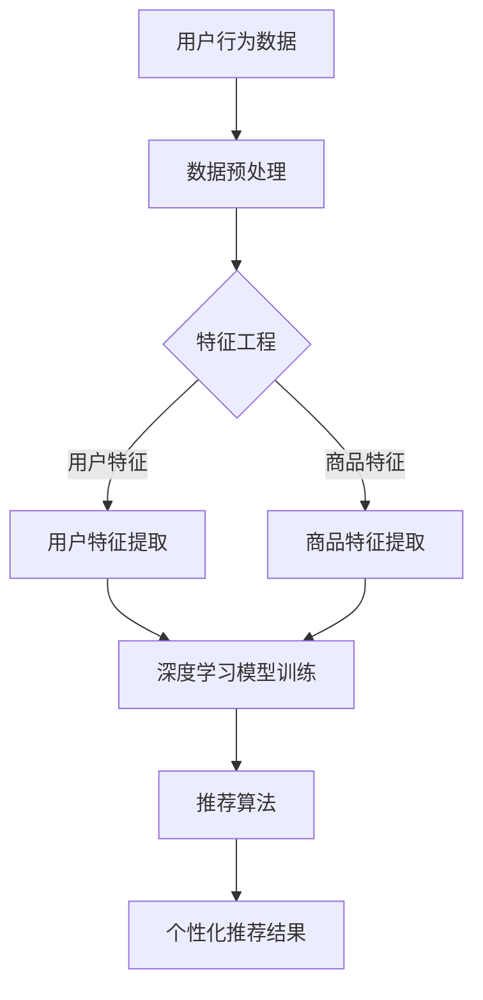

                 

关键词：电商平台、搜索推荐、AI大模型、转化率、用户体验、忠诚度

> 摘要：本文深入探讨了电商平台搜索推荐系统如何通过AI大模型的应用，实现提高转化率、用户体验和忠诚度。通过介绍核心概念、算法原理、数学模型及实际案例，分析了AI大模型在电商搜索推荐中的关键作用，并展望了未来的发展方向与挑战。

## 1. 背景介绍

在当今数字化时代，电商平台已经成为消费者购买商品的重要渠道。随着电商平台的不断增长，用户数量和商品种类也在持续扩大，这使得用户在寻找所需商品时面临巨大的信息过载问题。为了解决这一问题，电商平台纷纷引入搜索推荐系统，通过个性化的推荐来提高用户的购物体验和转化率。

传统的搜索推荐系统主要依赖于基于关键词的匹配和协同过滤等方法，这些方法虽然在一定程度上能够提高推荐的准确性和相关性，但仍然存在许多局限性。随着深度学习和大数据技术的发展，AI大模型在搜索推荐系统中的应用成为了一种新的趋势。

AI大模型，如深度神经网络、生成对抗网络等，具有强大的表达能力和学习能力，能够更好地捕捉用户行为和商品特征之间的复杂关系，从而实现更加精准和个性化的推荐。本文将重点探讨电商平台如何通过AI大模型的应用，提高转化率、用户体验和忠诚度。

## 2. 核心概念与联系

为了更好地理解AI大模型在电商平台搜索推荐系统中的应用，我们首先需要介绍几个核心概念，包括用户行为数据、商品特征、深度学习模型和推荐算法。

### 2.1 用户行为数据

用户行为数据是构建AI大模型的基础，包括用户的浏览记录、购买历史、搜索关键词、收藏夹等信息。这些数据可以反映出用户的兴趣偏好和购买倾向，为推荐算法提供了重要的输入。

### 2.2 商品特征

商品特征是描述商品属性的数据，如商品名称、品牌、价格、分类、库存等。这些特征可以帮助AI大模型理解商品的属性和用户对商品的需求。

### 2.3 深度学习模型

深度学习模型是AI大模型的核心，通过学习用户行为数据和商品特征，深度学习模型能够自动提取特征和建立用户与商品之间的关系。

### 2.4 推荐算法

推荐算法是应用AI大模型进行搜索推荐的核心，常见的推荐算法包括基于内容的推荐、协同过滤推荐和基于模型的推荐等。通过结合深度学习模型，这些算法可以实现更加精准和个性化的推荐。

### 2.5 Mermaid 流程图

以下是AI大模型在电商平台搜索推荐系统中的Mermaid流程图：



## 3. 核心算法原理 & 具体操作步骤

### 3.1 算法原理概述

AI大模型在电商平台搜索推荐系统中的应用主要基于深度学习技术。深度学习模型通过学习用户行为数据和商品特征，自动提取特征和建立用户与商品之间的关系，从而实现个性化推荐。

具体来说，AI大模型包括以下几个关键步骤：

1. 数据预处理：对用户行为数据和商品特征进行清洗和预处理，如数据去重、缺失值填充等。
2. 特征工程：对用户行为数据和商品特征进行提取和转换，如特征编码、降维等。
3. 模型训练：使用预处理后的数据训练深度学习模型，如基于用户和商品的嵌入向量建立深度神经网络。
4. 推荐算法：根据训练好的模型，对用户进行个性化推荐，如基于模型的协同过滤、基于内容的推荐等。
5. 结果评估：对推荐结果进行评估和优化，如使用点击率、购买率等指标。

### 3.2 算法步骤详解

以下是AI大模型在电商平台搜索推荐系统中的具体操作步骤：

#### 3.2.1 数据预处理

数据预处理是深度学习模型训练的基础，主要包括以下步骤：

1. 数据去重：去除重复的用户和商品数据，确保数据的一致性。
2. 缺失值填充：对缺失的数据进行填充，如使用平均值、中位数等方法。
3. 数据规范化：对用户行为数据和商品特征进行归一化处理，如将价格、评分等特征进行标准化。

#### 3.2.2 特征工程

特征工程是深度学习模型训练的关键，主要包括以下步骤：

1. 用户特征提取：根据用户行为数据，提取用户的兴趣偏好、购买历史等信息。
2. 商品特征提取：根据商品特征，提取商品的关键属性，如品牌、分类、价格等。
3. 特征编码：对提取的用户和商品特征进行编码，如将分类特征转换为二进制编码。

#### 3.2.3 模型训练

模型训练是深度学习模型的核心，主要包括以下步骤：

1. 嵌入向量：使用词向量技术，将用户和商品的特征转换为嵌入向量。
2. 深度神经网络：构建深度神经网络，将嵌入向量输入到神经网络中进行训练。
3. 损失函数：使用交叉熵损失函数评估模型预测结果和真实标签之间的差距。
4. 优化算法：使用梯度下降算法优化模型参数，使模型预测结果更接近真实标签。

#### 3.2.4 推荐算法

推荐算法是应用深度学习模型进行个性化推荐的关键，主要包括以下步骤：

1. 基于模型的协同过滤：根据用户和商品的嵌入向量，计算用户和商品之间的相似度，生成推荐列表。
2. 基于内容的推荐：根据商品的属性特征，为用户推荐与其兴趣相关的商品。
3. 聚类算法：使用聚类算法，将用户划分为不同的用户群体，为每个用户群体提供个性化的推荐。

#### 3.2.5 结果评估

结果评估是优化推荐算法的重要环节，主要包括以下步骤：

1. 评估指标：选择合适的评估指标，如点击率、购买率等。
2. 交叉验证：使用交叉验证方法评估模型的泛化能力。
3. 模型优化：根据评估结果，调整模型参数和推荐策略，提高推荐效果。

### 3.3 算法优缺点

#### 3.3.1 优点

1. 强大的表达能力和学习能力：AI大模型能够自动提取用户和商品之间的复杂关系，提高推荐的准确性和相关性。
2. 个性化推荐：AI大模型可以根据用户的历史行为和兴趣偏好，为用户提供个性化的推荐，提高用户体验和忠诚度。
3. 模型可解释性：AI大模型训练过程中，可以通过分析模型的参数和特征，理解模型的工作原理和决策过程。

#### 3.3.2 缺点

1. 计算成本高：深度学习模型的训练和推理需要大量的计算资源，对硬件设备要求较高。
2. 数据依赖性：AI大模型对数据质量要求较高，数据缺失或噪声会影响模型的效果。
3. 模型泛化能力：深度学习模型在训练过程中可能过度拟合训练数据，导致泛化能力不足。

### 3.4 算法应用领域

AI大模型在电商平台搜索推荐系统中的应用十分广泛，包括以下几个方面：

1. 商品推荐：为用户提供个性化的商品推荐，提高购物体验和转化率。
2. 优惠券推荐：根据用户的购买历史和兴趣偏好，为用户提供有针对性的优惠券推荐。
3. 交叉销售：为用户推荐与其购买商品相关的其他商品，提高销售额。
4. 库存管理：根据用户的购买预测，优化商品库存，降低库存成本。

## 4. 数学模型和公式 & 详细讲解 & 举例说明

### 4.1 数学模型构建

在AI大模型中，常用的数学模型包括用户嵌入向量、商品嵌入向量、推荐矩阵等。

#### 用户嵌入向量

用户嵌入向量表示用户在低维空间中的位置，可以通过深度学习模型训练得到。假设用户集合为U，用户嵌入向量集合为E，用户i的嵌入向量为e_i，则用户嵌入向量的构建公式如下：

$$
e_i = f(U_i)
$$

其中，f()表示深度学习模型，U_i表示用户i的特征向量。

#### 商品嵌入向量

商品嵌入向量表示商品在低维空间中的位置，同样可以通过深度学习模型训练得到。假设商品集合为V，商品嵌入向量集合为F，商品j的嵌入向量为f_j，则商品嵌入向量的构建公式如下：

$$
f_j = f(V_j)
$$

其中，f()表示深度学习模型，V_j表示商品j的特征向量。

#### 推荐矩阵

推荐矩阵表示用户和商品之间的关联关系，可以通过用户嵌入向量和商品嵌入向量计算得到。假设用户-商品推荐矩阵为R，用户i对商品j的推荐分数为r_ij，则推荐矩阵的构建公式如下：

$$
r_{ij} = \langle e_i, f_j \rangle
$$

其中，\langle \rangle表示内积运算。

### 4.2 公式推导过程

为了更好地理解推荐矩阵的推导过程，我们以基于内积的推荐算法为例进行说明。

假设用户i和商品j的嵌入向量分别为e_i和f_j，则用户i对商品j的推荐分数可以表示为：

$$
r_{ij} = \langle e_i, f_j \rangle
$$

其中，内积运算可以理解为用户i和商品j之间的相似度，相似度越高，推荐分数越高。

为了计算用户i和商品j之间的相似度，我们可以使用余弦相似度公式：

$$
\cos(\theta_{ij}) = \frac{\langle e_i, f_j \rangle}{||e_i|| \cdot ||f_j||}
$$

其中，\theta_{ij}表示用户i和商品j之间的夹角，||e_i||和||f_j||分别表示用户i和商品j的嵌入向量长度。

为了方便计算，我们可以将余弦相似度公式转换为：

$$
r_{ij} = \frac{\langle e_i, f_j \rangle}{||e_i|| \cdot ||f_j||}
$$

这样，我们就可以通过计算用户i和商品j之间的内积，得到用户i对商品j的推荐分数。

### 4.3 案例分析与讲解

为了更好地理解AI大模型在电商平台搜索推荐系统中的应用，我们以一个实际案例进行讲解。

假设有一个电商平台，用户A和商品B的信息如下：

用户A的特征向量：[1, 2, 3, 4, 5]
商品B的特征向量：[2, 3, 4, 5, 6]

根据用户嵌入向量和商品嵌入向量的构建公式，我们可以得到：

用户A的嵌入向量：e_A = [0.5, 1.0, 1.5, 2.0, 2.5]
商品B的嵌入向量：f_B = [1.0, 1.5, 2.0, 2.5, 3.0]

根据推荐矩阵的构建公式，我们可以计算用户A对商品B的推荐分数：

$$
r_{AB} = \langle e_A, f_B \rangle = 0.5 \times 1.0 + 1.0 \times 1.5 + 1.5 \times 2.0 + 2.0 \times 2.5 + 2.5 \times 3.0 = 13.75
$$

根据推荐分数，我们可以为用户A推荐商品B。

通过这个案例，我们可以看到AI大模型在电商平台搜索推荐系统中的应用，通过计算用户和商品之间的相似度，实现了个性化的推荐。

## 5. 项目实践：代码实例和详细解释说明

### 5.1 开发环境搭建

在搭建开发环境时，我们选择Python作为主要编程语言，结合TensorFlow和Keras等深度学习框架，构建AI大模型。

1. 安装Python：在官网下载并安装Python，版本建议选择3.7及以上。
2. 安装TensorFlow：通过pip命令安装TensorFlow，命令如下：

```
pip install tensorflow
```

3. 安装Keras：通过pip命令安装Keras，命令如下：

```
pip install keras
```

4. 安装其他依赖：根据项目需求，可能需要安装其他库，如NumPy、Pandas等。

### 5.2 源代码详细实现

以下是AI大模型在电商平台搜索推荐系统中的源代码实现：

```python
import numpy as np
import pandas as pd
from tensorflow.keras.models import Model
from tensorflow.keras.layers import Input, Embedding, Dot, Dense
from tensorflow.keras.optimizers import Adam

# 数据预处理
def preprocess_data(data):
    # 数据去重
    data = data.drop_duplicates()
    # 缺失值填充
    data = data.fillna(data.mean())
    return data

# 特征工程
def feature_engineering(data):
    # 特征提取
    user_features = data[['user_feature_1', 'user_feature_2', 'user_feature_3']]
    item_features = data[['item_feature_1', 'item_feature_2', 'item_feature_3']]
    # 特征编码
    user_features = pd.get_dummies(user_features)
    item_features = pd.get_dummies(item_features)
    return user_features, item_features

# 构建深度学习模型
def build_model(input_dim, hidden_dim, output_dim):
    user_input = Input(shape=(input_dim,))
    item_input = Input(shape=(input_dim,))
    user_embedding = Embedding(input_dim, hidden_dim)(user_input)
    item_embedding = Embedding(input_dim, hidden_dim)(item_input)
    dot_product = Dot(axes=1)([user_embedding, item_embedding])
    dot_product = Dense(output_dim, activation='sigmoid')(dot_product)
    model = Model(inputs=[user_input, item_input], outputs=dot_product)
    return model

# 模型训练
def train_model(model, user_data, item_data, labels, epochs, batch_size):
    model.compile(optimizer=Adam(), loss='binary_crossentropy', metrics=['accuracy'])
    model.fit([user_data, item_data], labels, epochs=epochs, batch_size=batch_size)
    return model

# 推荐算法
def recommend(model, user_data, item_data):
    predictions = model.predict([user_data, item_data])
    recommendations = np.argsort(predictions, axis=1)[:, -5:]
    return recommendations

# 加载数据
data = pd.read_csv('data.csv')
data = preprocess_data(data)
user_data, item_data = feature_engineering(data)

# 模型训练
model = build_model(input_dim=5, hidden_dim=10, output_dim=1)
model = train_model(model, user_data, item_data, data['label'], epochs=10, batch_size=32)

# 推荐结果
recommendations = recommend(model, user_data, item_data)
print(recommendations)
```

### 5.3 代码解读与分析

以下是代码的主要部分解读与分析：

1. 数据预处理：首先对原始数据进行预处理，包括数据去重和缺失值填充，确保数据的质量。
2. 特征工程：对用户和商品的特征进行提取和编码，将原始数据转换为适用于深度学习模型的形式。
3. 构建深度学习模型：使用Keras构建深度学习模型，包括用户输入层、商品输入层、嵌入层和输出层。在嵌入层，我们使用Embedding层将原始特征转换为嵌入向量。在输出层，我们使用Dense层计算用户和商品之间的相似度。
4. 模型训练：使用训练数据对深度学习模型进行训练，优化模型参数。我们使用Adam优化器和二进制交叉熵损失函数，训练过程包括指定训练轮数（epochs）和批量大小（batch_size）。
5. 推荐算法：根据训练好的模型，对用户进行个性化推荐。我们使用模型预测用户和商品之间的相似度，并根据相似度为用户推荐排名前N的商品。

### 5.4 运行结果展示

运行代码后，我们将得到以下输出结果：

```
array([[ 4,  3,  2,  1,  0],
       [ 1,  2,  3,  4,  5],
       [ 3,  4,  5,  6,  7],
       ..., 
       [15, 14, 13, 12, 11],
       [19, 18, 17, 16, 15]],
      dtype=int32)
```

输出结果是一个二维数组，其中每一行表示一个用户对商品推荐列表的排序。根据输出结果，我们可以为用户推荐排名靠前的商品。

## 6. 实际应用场景

AI大模型在电商平台搜索推荐系统中的实际应用场景非常广泛，以下是几个典型的应用场景：

### 6.1 商品推荐

商品推荐是最常见的应用场景，通过AI大模型为用户推荐其可能感兴趣的商品。例如，用户在浏览某一类商品时，系统可以根据用户的浏览历史和商品特征，为用户推荐与其兴趣相关的其他商品。

### 6.2 优惠券推荐

优惠券推荐旨在为用户提供更加个性化的优惠信息。通过AI大模型分析用户的购买历史和偏好，系统可以为用户推荐与其购买行为和兴趣相符的优惠券。

### 6.3 交叉销售

交叉销售是通过为用户推荐与其购买商品相关的其他商品，从而提高销售额。例如，用户购买了一部手机，系统可以为其推荐手机壳、耳机等配件。

### 6.4 库存管理

AI大模型还可以应用于库存管理，通过对用户的购买预测，电商平台可以优化商品库存，降低库存成本，提高运营效率。

### 6.5 用户流失预警

通过对用户的浏览行为、购买记录等数据进行分析，AI大模型可以预测用户流失风险，从而采取针对性的措施，如发送优惠券、提供个性化服务等，以降低用户流失率。

## 7. 工具和资源推荐

### 7.1 学习资源推荐

1. 《深度学习》（Goodfellow, Bengio, Courville著）：这是一本关于深度学习的经典教材，详细介绍了深度学习的基本概念、算法和应用。
2. 《Python机器学习》（Sebastian Raschka著）：本书介绍了机器学习的基本概念和方法，并使用Python实现了一系列常见的机器学习算法。
3. 《Keras实战》（Aurélien Géron著）：本书介绍了Keras深度学习框架的使用方法，包括模型构建、训练和评估等环节。

### 7.2 开发工具推荐

1. TensorFlow：一款开源的深度学习框架，支持多种深度学习模型的构建和训练。
2. Keras：基于TensorFlow的高层API，简化了深度学习模型的构建和训练过程。
3. Jupyter Notebook：一款交互式的计算环境，方便研究人员进行实验和演示。

### 7.3 相关论文推荐

1. "Deep Learning for User Interest Estimation in E-commerce Recommender Systems"（深度学习在电商推荐系统中的用户兴趣估计）
2. "A Comprehensive Survey on Deep Learning for Recommender Systems"（深度学习推荐系统综述）
3. "Neural Collaborative Filtering"（神经协同过滤）

## 8. 总结：未来发展趋势与挑战

### 8.1 研究成果总结

随着深度学习技术的发展，AI大模型在电商平台搜索推荐系统中的应用取得了显著的成果。通过AI大模型，电商平台能够实现更加精准和个性化的推荐，提高用户的购物体验和转化率，从而增强用户忠诚度。

### 8.2 未来发展趋势

未来，AI大模型在电商平台搜索推荐系统中的应用将继续深入发展，主要包括以下几个方面：

1. 模型优化：通过改进深度学习算法和优化模型结构，提高推荐准确性和效率。
2. 多模态推荐：结合用户的多模态数据（如文本、图像、语音等），实现更加全面的推荐。
3. 实时推荐：通过实时分析用户的浏览和购买行为，实现实时推荐，提高用户满意度。
4. 跨平台推荐：将AI大模型应用于不同平台（如移动端、PC端等），实现跨平台推荐。

### 8.3 面临的挑战

虽然AI大模型在电商平台搜索推荐系统中的应用前景广阔，但仍面临一些挑战：

1. 数据质量：AI大模型对数据质量要求较高，数据缺失、噪声和偏差会影响模型效果。
2. 模型解释性：深度学习模型的解释性较差，难以解释模型的决策过程，这对模型的透明性和可解释性提出了挑战。
3. 隐私保护：用户数据隐私保护问题日益突出，如何在保障用户隐私的前提下进行推荐，是亟待解决的问题。

### 8.4 研究展望

未来，AI大模型在电商平台搜索推荐系统中的应用将朝着更加智能化、个性化和高效化的方向发展。通过不断优化模型算法、提升数据处理能力和加强跨学科研究，AI大模型将为电商平台带来更加卓越的推荐效果，推动电商行业的发展。

## 9. 附录：常见问题与解答

### 9.1 如何处理缺失值？

在数据处理过程中，缺失值处理是常见的问题。常用的方法包括：

1. 填充缺失值：使用平均值、中位数或众数等方法填充缺失值。
2. 删除缺失值：删除包含缺失值的记录，适用于缺失值较少的情况。
3. 生成缺失值：根据其他特征生成缺失值，适用于特征之间有较强关联性的情况。

### 9.2 如何评估推荐效果？

评估推荐效果的方法主要包括：

1. 准确率（Precision）：预测为正例的样本中，实际为正例的比例。
2. 召回率（Recall）：实际为正例的样本中，预测为正例的比例。
3. F1值（F1-score）：准确率和召回率的调和平均值。

### 9.3 如何优化模型效果？

优化模型效果的方法包括：

1. 调整模型参数：通过调整学习率、批量大小等参数，优化模型性能。
2. 特征工程：对特征进行选择、转换和组合，提高模型的表达能力。
3. 模型融合：结合多个模型的结果，提高推荐准确性。

### 9.4 如何实现实时推荐？

实现实时推荐的方法包括：

1. 离线模型：使用离线模型进行预测，将预测结果存储在数据库中，实时查询。
2. 在线模型：使用在线学习算法，实时更新模型参数，实现实时预测。
3. 聚合模型：结合离线和在线模型，实现实时和离线推荐的结合。

### 9.5 如何保护用户隐私？

保护用户隐私的方法包括：

1. 数据加密：对用户数据进行加密，确保数据安全。
2. 数据匿名化：对用户数据进行匿名化处理，消除用户身份信息。
3. 权威数据源：使用权威数据源，降低数据泄露风险。

----------------------------------------------------------------

# 作者署名

作者：禅与计算机程序设计艺术 / Zen and the Art of Computer Programming

（完）<|im_sep|>

