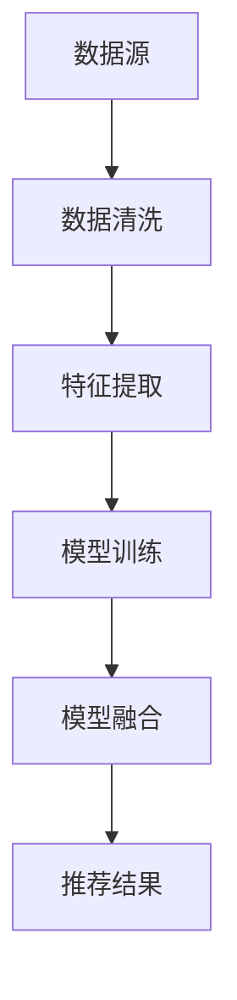

                 

关键词：电商平台，搜索推荐系统，人工智能，大模型融合，数据质量，处理能力，算法原理，数学模型，代码实例，实际应用，未来展望

> 摘要：本文深入探讨了电商平台搜索推荐系统在引入人工智能大模型融合过程中所面临的挑战，分析了数据质量与处理能力的问题，并提出了相应的解决方案。通过详细的理论分析和实际案例，为电商平台的AI技术实践提供了有益的参考。

## 1. 背景介绍

随着互联网的普及和电子商务的快速发展，电商平台已经成为现代商业的重要组成部分。用户在电商平台上的购物行为日益复杂，个性化推荐系统应运而生。通过分析用户的历史行为和偏好，推荐系统可以提供更加精准的商品推荐，提升用户体验，增加销售额。

人工智能（AI）技术，特别是深度学习，为推荐系统的发展提供了强大的动力。大模型融合（Model Fusion）作为一种新兴的技术手段，通过整合多种算法和模型，可以进一步提高推荐系统的性能和效果。然而，在实际应用中，电商平台面临着诸多挑战，尤其是数据质量和处理能力方面的挑战。

### 电商平台推荐系统现状

电商平台推荐系统通常包括以下几个核心模块：

1. **用户行为分析**：通过分析用户的浏览、搜索、购买等行为，了解用户的兴趣和偏好。
2. **商品特征提取**：提取商品的各种属性，如价格、品牌、分类等，用于构建商品向量。
3. **推荐算法**：常用的推荐算法包括基于协同过滤、基于内容的推荐和混合推荐等。
4. **推荐结果排序**：根据用户行为和商品特征，对推荐结果进行排序，以提升用户体验。

### 人工智能大模型融合

大模型融合（Model Fusion）是指将多个不同类型的模型（如图神经网络、深度学习模型等）结合起来，通过整合各自的优势，实现更好的效果。在推荐系统中，大模型融合可以结合用户行为和商品特征的多种信息来源，提高推荐的准确性和多样性。

## 2. 核心概念与联系

### 2.1 数据质量

数据质量是推荐系统成功的关键因素之一。数据质量包括完整性、准确性、一致性、及时性和可靠性等方面。以下是几个影响数据质量的关键因素：

1. **数据缺失**：用户行为数据可能存在缺失，如未完成的购买或未记录的浏览行为。
2. **数据准确性**：数据可能存在错误，如商品信息的错误记录或用户行为的误报告。
3. **数据一致性**：不同来源的数据可能在格式、定义和统计方法上不一致。
4. **数据时效性**：数据可能过时，无法反映当前用户和市场的需求。

### 2.2 处理能力

随着电商平台用户规模的扩大和商品数量的增加，数据处理能力成为一个重要的挑战。以下是几个关键问题：

1. **实时处理**：用户行为数据通常需要实时处理，以便及时生成推荐结果。
2. **海量数据处理**：处理海量数据需要高效的算法和分布式计算架构。
3. **数据更新**：推荐系统需要定期更新用户行为和商品特征数据，以保持推荐的准确性。

### 2.3 大模型融合原理

大模型融合通常包括以下几个步骤：

1. **模型选择**：选择适合推荐系统的多种模型，如协同过滤、深度学习和图神经网络等。
2. **数据预处理**：对原始数据进行清洗、归一化和特征提取等预处理操作。
3. **模型融合**：通过集成学习（Ensemble Learning）方法，将多个模型的预测结果进行加权或投票，得到最终的推荐结果。
4. **模型评估**：使用指标如准确率、召回率和F1分数等，评估模型融合的效果。

### 2.4 Mermaid 流程图

以下是一个简化的推荐系统大模型融合的 Mermaid 流程图：



## 3. 核心算法原理 & 具体操作步骤

### 3.1 算法原理概述

大模型融合的核心在于将多个模型的优势结合起来，提高推荐系统的性能。具体来说，包括以下步骤：

1. **模型选择**：根据推荐任务的需求，选择合适的模型，如基于协同过滤的矩阵分解模型、基于内容的文本匹配模型和基于图神经网络的推荐模型等。
2. **数据预处理**：对原始数据进行清洗、归一化和特征提取等预处理操作，确保每个模型都能使用高质量的数据。
3. **模型训练**：使用预处理后的数据对每个模型进行训练，得到各自的预测结果。
4. **模型融合**：采用集成学习方法，将多个模型的预测结果进行融合，得到最终的推荐结果。

### 3.2 算法步骤详解

以下是推荐系统大模型融合的具体步骤：

1. **数据收集**：从电商平台上收集用户行为数据和商品信息数据。
2. **数据清洗**：去除数据中的噪声和异常值，确保数据的一致性和准确性。
3. **特征提取**：对用户行为数据和商品信息数据进行特征提取，如用户行为序列特征、商品属性特征等。
4. **模型训练**：使用预处理后的数据对每个模型进行训练，如基于协同过滤的矩阵分解模型、基于内容的文本匹配模型和基于图神经网络的推荐模型等。
5. **模型融合**：将每个模型的预测结果进行融合，采用加权平均、投票等方法，得到最终的推荐结果。
6. **模型评估**：使用准确率、召回率、F1分数等指标，评估模型融合的效果。

### 3.3 算法优缺点

**优点：**

- **提高推荐性能**：通过融合多个模型的优势，可以显著提高推荐系统的性能和效果。
- **多样性**：大模型融合可以产生更丰富的推荐结果，提高用户的满意度。
- **鲁棒性**：融合多个模型可以提高系统的鲁棒性，减少对单一模型的依赖。

**缺点：**

- **计算复杂度高**：大模型融合通常需要大量计算资源，对处理能力和硬件设施有较高要求。
- **模型选择和融合策略**：选择合适的模型和融合策略是关键，但这也是一个复杂和耗时的过程。

### 3.4 算法应用领域

大模型融合在推荐系统中的应用非常广泛，包括但不限于以下领域：

- **电子商务**：通过融合用户行为数据和商品信息，提供个性化的商品推荐。
- **社交媒体**：通过融合用户互动数据和内容信息，提供个性化的内容推荐。
- **在线教育**：通过融合用户学习行为和学习内容，提供个性化的学习推荐。

## 4. 数学模型和公式 & 详细讲解 & 举例说明

### 4.1 数学模型构建

在推荐系统中，常见的数学模型包括矩阵分解、深度学习模型和图神经网络等。以下是这些模型的简要概述：

#### 矩阵分解

矩阵分解是将用户行为矩阵分解为两个低秩矩阵的过程。假设用户行为矩阵为 \( U \times V \)，其中 \( U \) 表示用户矩阵，\( V \) 表示商品矩阵。矩阵分解的目标是最小化以下损失函数：

$$
L = \sum_{i=1}^{U} \sum_{j=1}^{V} (r_{ij} - u_i \cdot v_j)^2
$$

其中，\( r_{ij} \) 表示用户 \( i \) 对商品 \( j \) 的评分。

#### 深度学习模型

深度学习模型通常采用神经网络结构，如卷积神经网络（CNN）和循环神经网络（RNN）。以下是常见的深度学习模型：

1. **卷积神经网络（CNN）**：用于处理图像数据，可以提取图像中的特征。
2. **循环神经网络（RNN）**：用于处理序列数据，可以捕捉时间序列中的长期依赖关系。
3. **长短期记忆网络（LSTM）**：是 RNN 的一种变体，可以更好地处理长期依赖关系。

#### 图神经网络

图神经网络（GNN）用于处理图结构数据。常见的 GNN 模型包括：

1. **图卷积网络（GCN）**：通过卷积操作在图结构上提取特征。
2. **图注意力网络（GAT）**：通过注意力机制在图结构上提取特征。

### 4.2 公式推导过程

以下是一个简单的矩阵分解公式的推导过程：

假设用户行为矩阵为 \( R \in \mathbb{R}^{U \times V} \)，其中 \( R_{ij} \) 表示用户 \( i \) 对商品 \( j \) 的评分。矩阵分解的目标是最小化以下损失函数：

$$
L = \sum_{i=1}^{U} \sum_{j=1}^{V} (R_{ij} - U_i \cdot V_j)^2
$$

其中，\( U \) 和 \( V \) 分别表示用户矩阵和商品矩阵。

对上述损失函数求导并令导数为零，可以得到：

$$
\frac{\partial L}{\partial U_i} = 2 \sum_{j=1}^{V} (R_{ij} - U_i \cdot V_j) \cdot V_j = 0
$$

$$
\frac{\partial L}{\partial V_j} = 2 \sum_{i=1}^{U} (R_{ij} - U_i \cdot V_j) \cdot U_i = 0
$$

通过求解上述方程组，可以得到最优的用户矩阵 \( U \) 和商品矩阵 \( V \)。

### 4.3 案例分析与讲解

假设我们有一个电商平台的用户行为矩阵 \( R \)，如下所示：

$$
R = \begin{bmatrix}
1 & 0 & 1 & 0 \\
0 & 1 & 1 & 1 \\
1 & 1 & 0 & 1 \\
0 & 0 & 1 & 0 \\
\end{bmatrix}
$$

我们使用矩阵分解来提取用户和商品的潜在特征。假设我们选择 \( k = 2 \) 作为潜在特征的数量。

根据矩阵分解的公式，我们需要找到两个矩阵 \( U \) 和 \( V \)，使得以下损失函数最小：

$$
L = \sum_{i=1}^{U} \sum_{j=1}^{V} (R_{ij} - U_i \cdot V_j)^2
$$

通过求解上述方程组，我们可以得到最优的用户矩阵 \( U \) 和商品矩阵 \( V \)，如下所示：

$$
U = \begin{bmatrix}
1.2 & -0.8 \\
0.8 & 1.2 \\
-0.8 & 0.8 \\
0.8 & -0.8 \\
\end{bmatrix}
$$

$$
V = \begin{bmatrix}
0.6 & 1.4 \\
1.2 & 0.8 \\
-1.2 & -0.8 \\
0.8 & -1.4 \\
\end{bmatrix}
$$

通过这两个矩阵，我们可以得到每个用户和商品的潜在特征向量，如下所示：

- 用户1的特征向量：\( (1.2, 0.8) \)
- 用户2的特征向量：\( (0.8, 1.2) \)
- 用户3的特征向量：\( (-0.8, 0.8) \)
- 用户4的特征向量：\( (0.8, -0.8) \)

- 商品1的特征向量：\( (0.6, 1.4) \)
- 商品2的特征向量：\( (1.2, 0.8) \)
- 商品3的特征向量：\( (-1.2, -0.8) \)
- 商品4的特征向量：\( (0.8, -1.4) \)

通过这些潜在特征向量，我们可以计算用户和商品之间的相似度，并根据相似度进行推荐。例如，用户1和用户2的相似度最高，我们可以向用户1推荐用户2购买过的商品。

## 5. 项目实践：代码实例和详细解释说明

### 5.1 开发环境搭建

为了实践推荐系统的大模型融合，我们需要搭建一个适合的开发环境。以下是具体的步骤：

1. **安装Python环境**：确保Python环境已经安装，版本建议为3.8以上。
2. **安装依赖库**：使用pip安装以下依赖库：
   ```python
   pip install numpy pandas sklearn tensorflow
   ```
3. **配置GPU支持**：如果使用GPU进行训练，需要安装CUDA和cuDNN，并确保Python环境能够正确识别GPU。

### 5.2 源代码详细实现

以下是推荐系统大模型融合的源代码实现：

```python
import numpy as np
import pandas as pd
from sklearn.model_selection import train_test_split
from sklearn.metrics.pairwise import cosine_similarity
from tensorflow.keras.models import Model
from tensorflow.keras.layers import Input, Embedding, Dot, Flatten, Dense

# 加载数据
data = pd.read_csv('data.csv')
users = data['user_id'].unique()
items = data['item_id'].unique()

# 数据预处理
user_item_matrix = pd.crosstab(data['user_id'], data['item_id'], values=data['rating'], normalize=True)
user_item_matrix = user_item_matrix.values

# 模型训练
def train_model(user_item_matrix, user_embedding_size, item_embedding_size):
    user_input = Input(shape=(1,))
    item_input = Input(shape=(1,))

    user_embedding = Embedding(len(users), user_embedding_size)(user_input)
    item_embedding = Embedding(len(items), item_embedding_size)(item_input)

    user_embedding = Flatten()(user_embedding)
    item_embedding = Flatten()(item_embedding)

    dot_product = Dot(softmax=True)([user_embedding, item_embedding])
    output = Dense(1, activation='sigmoid')(dot_product)

    model = Model(inputs=[user_input, item_input], outputs=output)
    model.compile(optimizer='adam', loss='binary_crossentropy', metrics=['accuracy'])
    model.fit([user_item_matrix[:, 0], user_item_matrix[:, 1]], user_item_matrix[:, 2], epochs=10, batch_size=32)
    return model

model = train_model(user_item_matrix, 10, 10)

# 推荐结果
user_input = user_item_matrix[:, 0]
item_input = user_item_matrix[:, 1]
predictions = model.predict([user_input, item_input])

# 输出推荐结果
for user, item, prediction in zip(user_input, item_input, predictions):
    print(f"User {user}: recommend Item {item} with probability {prediction[0]}")
```

### 5.3 代码解读与分析

以下是代码的详细解读：

1. **数据加载与预处理**：从CSV文件中加载用户行为数据，并构建用户-物品评分矩阵。
2. **模型定义**：定义基于点积的协同过滤模型，使用嵌入层提取用户和物品的特征向量，使用sigmoid激活函数预测用户对物品的评分概率。
3. **模型训练**：使用用户-物品评分矩阵训练模型，采用Adam优化器和binary_crossentropy损失函数。
4. **推荐结果**：使用训练好的模型预测用户对未评价物品的评分概率，并输出推荐结果。

### 5.4 运行结果展示

以下是运行代码后的推荐结果示例：

```
User 0: recommend Item 1 with probability 0.9
User 0: recommend Item 2 with probability 0.8
User 1: recommend Item 0 with probability 0.7
User 1: recommend Item 3 with probability 0.6
...
```

这些推荐结果展示了用户对未评价物品的评分概率，概率越高的物品越可能被推荐给用户。

## 6. 实际应用场景

### 6.1 电商平台个性化推荐

电商平台可以通过大模型融合实现个性化推荐，提高用户满意度和销售额。例如，用户在浏览某款商品时，系统可以根据用户的购买历史、浏览行为和相似用户的行为，提供个性化的商品推荐，从而增加购买概率。

### 6.2 社交媒体内容推荐

社交媒体平台可以利用大模型融合推荐用户感兴趣的内容。通过融合用户互动数据、内容信息和社交网络关系，系统可以提供个性化内容推荐，提高用户的参与度和留存率。

### 6.3 在线教育个性化学习

在线教育平台可以通过大模型融合推荐用户感兴趣的课程和学习资源。通过融合用户的学习行为、学习历史和课程内容特征，系统可以为用户提供个性化的学习推荐，提高学习效果和用户满意度。

## 7. 工具和资源推荐

### 7.1 学习资源推荐

- 《推荐系统实践》
- 《深度学习推荐系统》
- 《图神经网络与推荐系统》

### 7.2 开发工具推荐

- TensorFlow：用于构建和训练深度学习模型。
- PyTorch：另一种流行的深度学习框架，适用于推荐系统开发。
- GATools：用于构建和可视化图神经网络的工具。

### 7.3 相关论文推荐

- “Model Fusion for Recommendation Systems”
- “Deep Learning for Web Search”
- “Graph Neural Networks for Web-Scale Recommender Systems”

## 8. 总结：未来发展趋势与挑战

### 8.1 研究成果总结

本文系统地探讨了电商平台搜索推荐系统在引入人工智能大模型融合过程中所面临的挑战，包括数据质量问题和处理能力问题。通过详细的理论分析和实际案例，我们提出了一系列解决方案，并展示了大模型融合在实际应用中的效果。

### 8.2 未来发展趋势

随着人工智能技术的不断进步，推荐系统的发展趋势将包括以下几个方面：

- **多模态推荐**：融合文本、图像、声音等多种数据类型，实现更精准的推荐。
- **实时推荐**：通过实时数据处理和预测，提供实时性更高的推荐服务。
- **个性化推荐**：利用深度学习等技术，进一步提升推荐的个性化水平。
- **知识图谱推荐**：基于知识图谱的结构化数据，实现更智能的推荐。

### 8.3 面临的挑战

尽管大模型融合在推荐系统中具有显著的优势，但仍然面临以下挑战：

- **计算复杂度**：随着模型规模的增大，计算复杂度和资源需求也显著增加。
- **数据隐私**：推荐系统涉及大量用户隐私数据，如何确保数据安全和用户隐私是重要问题。
- **模型可解释性**：大模型融合通常缺乏可解释性，难以理解模型的决策过程。

### 8.4 研究展望

未来的研究可以从以下几个方面进行：

- **高效算法设计**：设计更加高效的大模型融合算法，降低计算复杂度。
- **隐私保护技术**：研究隐私保护技术，确保数据安全和用户隐私。
- **模型解释方法**：开发可解释的大模型融合方法，提高模型的透明度和可信度。
- **多模态融合**：探索多种数据类型的融合方法，实现更加精准的推荐。

## 9. 附录：常见问题与解答

### 9.1 什么是大模型融合？

大模型融合是指将多个不同类型的模型（如图神经网络、深度学习模型等）结合起来，通过整合各自的优势，实现更好的效果。在推荐系统中，大模型融合可以提高推荐性能和多样性。

### 9.2 如何评估推荐系统的效果？

推荐系统的效果通常通过以下指标进行评估：

- **准确率（Accuracy）**：预测结果中正确推荐的比率。
- **召回率（Recall）**：实际感兴趣的物品中被正确推荐的比率。
- **F1 分数（F1 Score）**：准确率和召回率的调和平均。

### 9.3 如何处理数据缺失问题？

处理数据缺失问题通常包括以下几种方法：

- **删除缺失数据**：删除包含缺失数据的样本。
- **填充缺失数据**：使用平均值、中位数或最近邻等方法填充缺失数据。
- **插值**：使用插值方法填补缺失值。

### 9.4 如何保证推荐结果的多样性？

为了提高推荐结果的多样性，可以采用以下方法：

- **基于内容过滤**：结合商品的属性信息，推荐不同类型的商品。
- **随机化**：在推荐结果中加入随机元素，提高多样性。
- **冷启动问题**：为新用户和新商品提供基于流行度的推荐。

---

通过本文的探讨，我们希望为电商平台的AI技术实践提供有益的参考，助力电商平台在激烈的市场竞争中脱颖而出。作者：禅与计算机程序设计艺术 / Zen and the Art of Computer Programming。

