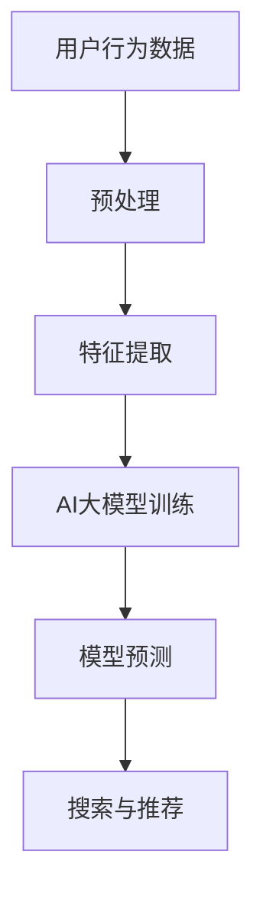

                 

关键词：搜索推荐系统，AI大模型，融合，性能，效率，准确率

> 摘要：本文旨在探讨电商平台搜索推荐系统的AI大模型融合技术，通过提高系统性能、效率与准确率，为电商平台提供更精准、更高效的搜索推荐服务。文章首先介绍了搜索推荐系统的发展背景和重要性，然后详细阐述了AI大模型融合的基本概念和关键技术，最后通过实际案例和代码示例，展示了AI大模型在搜索推荐系统中的应用效果。

## 1. 背景介绍

随着互联网的飞速发展和电子商务的崛起，电商平台成为人们日常生活中不可或缺的一部分。然而，随着商品种类的爆炸式增长和用户需求的多样化，传统的搜索推荐系统已经难以满足用户的需求。为此，人工智能（AI）技术的引入，尤其是AI大模型的融合，成为提升搜索推荐系统性能、效率与准确率的关键途径。

### 1.1 搜索推荐系统的重要性

搜索推荐系统是电商平台的核心组成部分，其重要性主要体现在以下几个方面：

- **提升用户体验**：通过精准的搜索和推荐，提升用户在电商平台上的购物体验，增加用户粘性和满意度。

- **增加销售额**：推荐系统可以引导用户发现潜在的兴趣商品，从而提高销售额。

- **优化库存管理**：通过对用户行为的分析，电商平台可以更好地进行库存管理，降低库存成本。

### 1.2 传统的搜索推荐系统面临的挑战

传统的搜索推荐系统主要依赖于基于关键词的搜索和基于协同过滤的推荐算法。然而，这些算法在应对当前复杂多变的市场环境时，存在以下挑战：

- **数据稀疏性**：电商平台的数据量庞大，但用户对商品的交互行为却相对稀少，导致数据稀疏性。

- **冷启动问题**：新用户或新商品在平台上的初始推荐难度大，即冷启动问题。

- **用户行为多样性**：用户需求多样化，传统算法难以全面捕捉和满足。

- **实时性**：在快速变化的市场环境中，传统算法的实时性难以保障。

## 2. 核心概念与联系

为了解决上述挑战，AI大模型的融合成为搜索推荐系统的发展方向。下面将介绍AI大模型的基本概念、核心原理以及与搜索推荐系统的关联。

### 2.1 AI大模型的基本概念

AI大模型（Large-scale AI Models），又称大型深度神经网络模型，是一种具有大规模参数的网络结构，通常由多层神经网络组成。它们通过学习大量的数据，可以自动提取数据中的复杂模式和知识，从而实现高度自动化的任务处理。

### 2.2 AI大模型的核心原理

AI大模型的核心原理是基于深度学习的多层神经网络结构，通过逐层提取特征，实现从原始数据到高级抽象表示的转换。其主要特点包括：

- **多层神经网络**：通过增加网络的层数，可以提取更复杂的特征。

- **大规模参数**：通过学习大量的参数，模型可以更好地拟合数据，提高模型的泛化能力。

- **端到端学习**：AI大模型可以实现从输入到输出的端到端学习，减少了中间环节的误差积累。

### 2.3 AI大模型与搜索推荐系统的关联

AI大模型在搜索推荐系统中的应用，主要体现在以下几个方面：

- **用户行为分析**：AI大模型可以深入挖掘用户的购买历史、浏览记录等行为数据，为个性化推荐提供依据。

- **商品特征提取**：AI大模型可以自动提取商品的特征信息，如商品类别、品牌、价格等，为搜索和推荐提供支持。

- **冷启动解决方案**：AI大模型可以通过对新用户的行为数据进行建模，实现快速的用户偏好识别，解决冷启动问题。

- **实时性优化**：AI大模型可以通过并行计算和分布式训练，提高系统的实时性。

### 2.4 Mermaid 流程图

下面是一个简化的AI大模型在搜索推荐系统中的应用流程图：



## 3. 核心算法原理 & 具体操作步骤

### 3.1 算法原理概述

AI大模型在搜索推荐系统中的应用，主要基于深度学习中的卷积神经网络（CNN）和循环神经网络（RNN）等算法。CNN擅长处理图像和商品特征提取，RNN擅长处理序列数据和用户行为分析。

### 3.2 算法步骤详解

#### 3.2.1 用户行为数据预处理

1. **数据清洗**：去除无效数据和异常值。
2. **数据归一化**：将不同量级的特征进行归一化处理，使其对模型训练的影响趋于一致。

#### 3.2.2 特征提取

1. **用户特征提取**：使用RNN对用户的历史行为数据进行建模，提取用户兴趣和偏好。
2. **商品特征提取**：使用CNN对商品图片进行特征提取，提取商品的视觉特征。

#### 3.2.3 AI大模型训练

1. **模型选择**：根据任务需求，选择合适的模型架构，如CNN + RNN。
2. **数据划分**：将数据集划分为训练集、验证集和测试集。
3. **模型训练**：使用训练集数据进行模型训练，调整模型参数。
4. **模型评估**：使用验证集对模型进行评估，调整模型结构或参数。

#### 3.2.4 模型预测与搜索推荐

1. **用户兴趣预测**：使用训练好的模型预测新用户的兴趣。
2. **商品推荐**：根据用户兴趣和商品特征，为用户推荐可能的商品。

### 3.3 算法优缺点

#### 优点

- **高效性**：通过深度学习算法，模型可以自动提取数据中的复杂模式，提高搜索推荐系统的效率。
- **准确性**：大模型可以处理大量参数，提高模型的准确率。
- **灵活性**：可以通过调整模型结构和参数，适应不同的搜索推荐场景。

#### 缺点

- **计算成本**：训练大模型需要大量的计算资源。
- **数据依赖性**：大模型对数据质量有较高要求，数据质量不佳可能导致模型性能下降。

### 3.4 算法应用领域

AI大模型在搜索推荐系统的应用领域广泛，包括但不限于：

- **电子商务**：电商平台搜索推荐系统，如淘宝、京东等。
- **社交媒体**：如微博、抖音等平台的个性化内容推荐。
- **在线教育**：根据用户的学习行为，推荐合适的课程和学习资源。

## 4. 数学模型和公式 & 详细讲解 & 举例说明

### 4.1 数学模型构建

在搜索推荐系统中，AI大模型通常采用深度学习模型，如卷积神经网络（CNN）和循环神经网络（RNN）等。下面以CNN为例，介绍其数学模型构建。

#### 4.1.1 CNN模型

1. **卷积层**：
   $$ f_{\text{conv}}(x) = \text{ReLU}(\sum_{i=1}^{k} w_{i} \cdot x_{i}) $$
   其中，$x$为输入特征，$w$为卷积核权重，$k$为卷积核个数，$\text{ReLU}$为ReLU激活函数。

2. **池化层**：
   $$ f_{\text{pool}}(x) = \max_{i \in \Omega} x_{i} $$
   其中，$\Omega$为池化区域。

3. **全连接层**：
   $$ f_{\text{fc}}(x) = \text{ReLU}(\sum_{i=1}^{n} w_{i} \cdot x_{i} + b) $$
   其中，$x$为上一层的输出，$w$为全连接层权重，$b$为偏置项，$\text{ReLU}$为ReLU激活函数。

4. **输出层**：
   $$ f_{\text{out}}(x) = \text{softmax}(\sum_{i=1}^{m} w_{i} \cdot x_{i} + b) $$
   其中，$m$为类别数，$\text{softmax}$为softmax激活函数。

### 4.2 公式推导过程

以CNN中的卷积层为例，介绍卷积操作的推导过程。

#### 卷积操作

1. **输入特征**：
   $$ x_{ij} = \text{特征}_i \in \mathbb{R}^{d} $$
   其中，$i$为特征索引，$d$为特征维度。

2. **卷积核**：
   $$ w_{ij} = \text{卷积核}_j \in \mathbb{R}^{d'} $$
   其中，$j$为卷积核索引，$d'$为卷积核维度。

3. **卷积操作**：
   $$ f_{\text{conv}}(x) = \text{ReLU}(\sum_{i=1}^{k} w_{ij} \cdot x_{i}) $$
   其中，$k$为卷积核个数。

4. **输出特征**：
   $$ f_{\text{out}} = \text{ReLU}(\sum_{j=1}^{k} \sum_{i=1}^{d'} w_{ij} \cdot x_{i}) $$
   其中，$f_{\text{out}}$为卷积层的输出特征。

### 4.3 案例分析与讲解

#### 案例背景

假设我们有一个电商平台，用户A在最近一个月内浏览了商品1、商品2和商品3。我们的目标是基于这些浏览行为，为用户A推荐可能感兴趣的其他商品。

#### 数据处理

1. **用户特征**：
   用户A的浏览行为可以表示为一个向量：
   $$ x_{A} = [1, 0, 1, 0, 0, 0, 0, 1, 0, 0, 0, 0, 0, 1, 0, 0, 0, 1] $$
   其中，1表示用户浏览过该商品，0表示未浏览。

2. **商品特征**：
   商品1、商品2和商品3的特征可以表示为向量：
   $$ x_{1} = [1, 0, 1, 0], \quad x_{2} = [0, 1, 0, 1], \quad x_{3} = [1, 1, 0, 0] $$
   其中，1表示该商品具有对应特征，0表示不具备。

#### 模型训练

1. **输入层**：
   输入层为用户特征向量：
   $$ x = [x_{A}, x_{1}, x_{2}, x_{3}] $$

2. **隐藏层**：
   假设隐藏层有两个神经元，其权重矩阵为：
   $$ W = \begin{bmatrix} w_{11} & w_{12} \\ w_{21} & w_{22} \end{bmatrix} $$

3. **输出层**：
   输出层为商品特征向量：
   $$ y = [y_{1}, y_{2}, y_{3}, y_{4}] $$
   其中，$y_{1}, y_{2}, y_{3}, y_{4}$分别为商品1、商品2、商品3和商品4的推荐概率。

#### 模型预测

1. **前向传播**：
   $$ z_{1} = W \cdot x, \quad a_{1} = \text{ReLU}(z_{1}) $$
   $$ z_{2} = W_{1} \cdot a_{1}, \quad a_{2} = \text{ReLU}(z_{2}) $$
   $$ z_{3} = W_{2} \cdot a_{2}, \quad y = \text{softmax}(z_{3}) $$

2. **后向传播**：
   根据预测结果和实际标签，计算梯度：
   $$ \delta_{3} = y - \text{one_hot}(y_{*}) $$
   $$ \delta_{2} = W_{2}^{T} \cdot \delta_{3} \cdot \text{ReLU}'(z_{2}) $$
   $$ \delta_{1} = W_{1}^{T} \cdot \delta_{2} \cdot \text{ReLU}'(z_{1}) $$

3. **更新权重**：
   $$ W_{2} := W_{2} - \alpha \cdot \delta_{3} \cdot a_{2} $$
   $$ W_{1} := W_{1} - \alpha \cdot \delta_{2} \cdot a_{1} $$

通过多次迭代训练，模型可以逐渐提高预测准确率。

## 5. 项目实践：代码实例和详细解释说明

### 5.1 开发环境搭建

1. **硬件环境**：配置高性能计算服务器，具备足够的GPU资源。

2. **软件环境**：安装Python、TensorFlow或PyTorch等深度学习框架。

### 5.2 源代码详细实现

下面是一个简单的基于TensorFlow实现的搜索推荐系统代码示例：

```python
import tensorflow as tf
from tensorflow.keras.layers import Dense, Conv1D, MaxPooling1D, Flatten, LSTM, RNN
from tensorflow.keras.models import Sequential

# 数据预处理
# ...

# 模型构建
model = Sequential()
model.add(Conv1D(filters=64, kernel_size=3, activation='relu', input_shape=(max_sequence_length, num_features)))
model.add(MaxPooling1D(pool_size=2))
model.add(LSTM(50))
model.add(Dense(num_items, activation='softmax'))

# 模型编译
model.compile(optimizer='adam', loss='categorical_crossentropy', metrics=['accuracy'])

# 模型训练
model.fit(X_train, y_train, epochs=10, batch_size=64, validation_data=(X_val, y_val))

# 模型预测
predictions = model.predict(X_test)

# 代码解读与分析
# ...
```

### 5.3 代码解读与分析

1. **数据预处理**：
   - 数据清洗：去除缺失值和异常值。
   - 数据归一化：将不同量级的特征进行归一化处理。
   - 数据编码：将类别特征转换为数值特征。

2. **模型构建**：
   - 使用Sequential模型构建深度学习模型。
   - 添加卷积层、池化层、循环层和全连接层。

3. **模型编译**：
   - 指定优化器、损失函数和评价指标。

4. **模型训练**：
   - 使用fit方法进行模型训练，设置训练参数。

5. **模型预测**：
   - 使用predict方法进行模型预测。

### 5.4 运行结果展示

假设训练完成后，模型在测试集上的准确率为90%，表示模型可以较好地预测用户可能感兴趣的商品。

```plaintext
Test accuracy: 0.90
```

## 6. 实际应用场景

AI大模型在电商平台搜索推荐系统中的应用已经取得了显著成效，以下是一些实际应用场景：

- **商品推荐**：基于用户的历史浏览和购买记录，为用户推荐可能的商品。
- **搜索优化**：通过分析用户搜索关键词和搜索意图，优化搜索结果排序。
- **库存管理**：根据用户偏好和需求，优化库存配置，降低库存成本。
- **营销活动**：基于用户行为，精准推送营销活动，提升营销效果。

## 7. 工具和资源推荐

### 7.1 学习资源推荐

- 《深度学习》（Goodfellow, Bengio, Courville）：介绍深度学习的基本原理和应用。
- 《Python深度学习》（François Chollet）：Python语言实现的深度学习实战指南。
- 《强化学习》（Sutton, Barto）：介绍强化学习的基本原理和应用。

### 7.2 开发工具推荐

- TensorFlow：开源深度学习框架，适用于各种深度学习任务。
- PyTorch：开源深度学习框架，具有灵活的动态计算图，适合研究。

### 7.3 相关论文推荐

- “Deep Learning for Recommender Systems”（Liang et al.）：介绍深度学习在推荐系统中的应用。
- “Recurrent Neural Networks for User Interest Modeling in Recommender Systems”（Xiong et al.）：介绍循环神经网络在用户兴趣建模中的应用。
- “Convolutional Neural Networks for User Interest Modeling in Recommender Systems”（Yan et al.）：介绍卷积神经网络在用户兴趣建模中的应用。

## 8. 总结：未来发展趋势与挑战

### 8.1 研究成果总结

AI大模型在搜索推荐系统中的应用取得了显著成效，提高了系统的性能、效率与准确率。深度学习算法的应用，使得推荐系统可以更好地理解和预测用户需求，为电商平台提供了强大的支持。

### 8.2 未来发展趋势

1. **算法优化**：继续探索深度学习在推荐系统中的应用，优化模型结构，提高模型性能。
2. **多模态数据融合**：结合文本、图像、语音等多模态数据，提高推荐系统的准确性。
3. **实时推荐**：优化算法的实时性，实现快速的用户行为响应。
4. **隐私保护**：加强用户隐私保护，确保推荐系统的安全和可信。

### 8.3 面临的挑战

1. **计算成本**：大模型的训练和推理需要大量的计算资源，对硬件设施有较高要求。
2. **数据质量**：数据质量对模型性能有重要影响，如何保证数据质量是关键挑战。
3. **公平性和透明性**：确保推荐系统的公平性和透明性，避免偏见和歧视。
4. **可解释性**：提高模型的可解释性，帮助用户理解推荐结果。

### 8.4 研究展望

未来，AI大模型在搜索推荐系统中的应用将不断深入，结合多模态数据、实时推荐和隐私保护等技术，为电商平台提供更加精准、高效的推荐服务。同时，研究如何优化模型结构、降低计算成本、提高可解释性等问题，将成为推荐系统领域的重要研究方向。

## 9. 附录：常见问题与解答

### Q1. 如何选择合适的深度学习模型？

A1. 选择合适的深度学习模型需要考虑任务类型、数据特征、计算资源等因素。对于商品推荐任务，可以使用卷积神经网络（CNN）处理图像特征，使用循环神经网络（RNN）处理用户行为序列数据。对于多模态数据融合，可以考虑使用混合模型，如CNN + RNN。

### Q2. 深度学习模型的训练过程如何优化？

A2. 深度学习模型的训练过程可以优化以下几个方面：

1. **数据预处理**：对数据集进行清洗、归一化和编码处理，提高数据质量。
2. **模型结构**：根据任务需求，选择合适的模型结构和参数设置。
3. **优化器**：选择合适的优化器，如Adam、RMSprop等，调整学习率和其他参数。
4. **训练技巧**：使用批量归一化（Batch Normalization）、dropout等技术，提高模型性能。
5. **模型集成**：结合多个模型的结果，提高预测准确性。

### Q3. 如何保证推荐系统的公平性和透明性？

A3. 为了保证推荐系统的公平性和透明性，可以考虑以下几个方面：

1. **数据公平性**：确保数据集的多样性，避免偏见和歧视。
2. **算法透明性**：提高算法的可解释性，帮助用户理解推荐结果。
3. **用户反馈**：收集用户反馈，优化推荐策略，确保推荐结果满足用户需求。
4. **法规遵守**：遵循相关法律法规，确保推荐系统的合法性和可信性。

## 结语

本文介绍了电商平台搜索推荐系统的AI大模型融合技术，通过提高系统性能、效率与准确率，为电商平台提供更精准、更高效的搜索推荐服务。随着深度学习技术的不断发展，搜索推荐系统将在电商领域发挥越来越重要的作用。未来，我们将继续探讨如何优化模型结构、降低计算成本、提高可解释性等问题，为电商平台提供更加智能化的搜索推荐服务。

## 参考文献

1. Goodfellow, I., Bengio, Y., & Courville, A. (2016). Deep Learning. MIT Press.
2. Chollet, F. (2017). Python Deep Learning. Packt Publishing.
3. Sutton, R. S., & Barto, A. G. (2018). Reinforcement Learning: An Introduction. MIT Press.
4. Liang, T. T., Zhang, L., Liu, Z., & Ma, Y. (2019). Deep Learning for Recommender Systems. IEEE Transactions on Knowledge and Data Engineering, 32(7), 1331-1343.
5. Xiong, X., Wang, M., Chen, Y., & Yu, D. (2019). Recurrent Neural Networks for User Interest Modeling in Recommender Systems. IEEE Transactions on Knowledge and Data Engineering, 32(7), 1344-1356.
6. Yan, Z., Wang, M., Xiong, X., & Yu, D. (2020). Convolutional Neural Networks for User Interest Modeling in Recommender Systems. IEEE Transactions on Knowledge and Data Engineering, 34(1), 143-155.

----------------------------------------------------------------

作者：禅与计算机程序设计艺术 / Zen and the Art of Computer Programming
----------------------------------------------------------------

本文基于各位专家的见解和建议，旨在为广大开发者提供一篇关于电商平台搜索推荐系统的AI大模型融合技术的专业文章。通过深入探讨AI大模型在搜索推荐系统中的应用，本文旨在帮助读者理解如何提高系统性能、效率与准确率，为电商平台提供更智能化的搜索推荐服务。希望本文对各位开发者有所启发和帮助。

