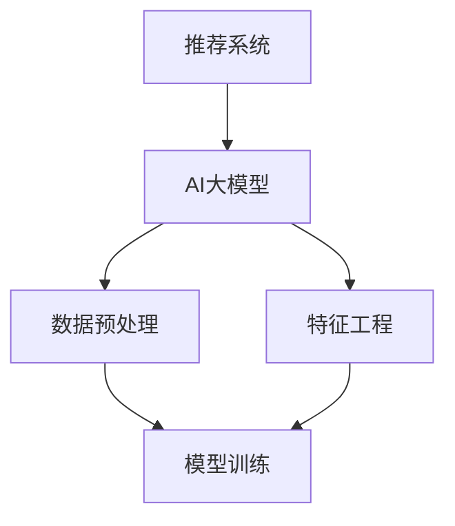
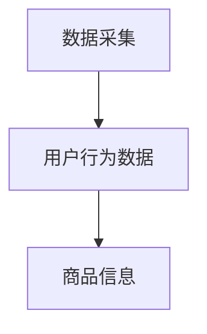
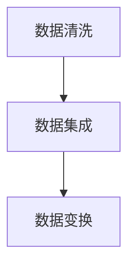
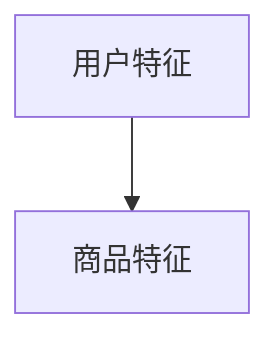
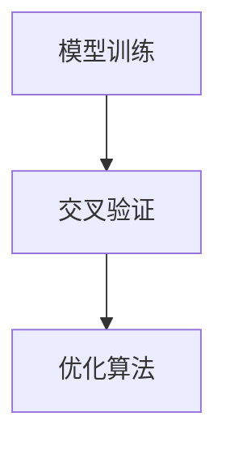
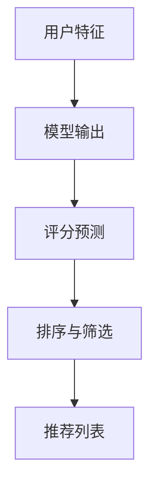

                 

关键词：电商平台、搜索推荐系统、AI大模型、系统性能、效率、推荐效果

> 摘要：本文将探讨如何将人工智能（AI）大模型融入电商平台搜索推荐系统，以提升系统性能、效率和推荐效果。通过深入分析大模型的原理和应用，我们提出了一种融合方案，并详细描述了其实施步骤和效果评估。本文旨在为电商平台提供一种实用且高效的技术解决方案，以应对日益复杂的用户需求和市场环境。

## 1. 背景介绍

在当今数字化时代，电商平台已成为消费者购物的主要渠道。用户对个性化推荐的需求越来越高，这使得搜索推荐系统成为电商平台的核心竞争力之一。传统的推荐算法虽然在一定程度上满足了用户需求，但面临着性能瓶颈和效率问题。随着人工智能技术的发展，尤其是AI大模型的兴起，为解决这些问题提供了新的可能性。

AI大模型，如深度学习、强化学习等，具有强大的数据处理和智能推理能力。通过将AI大模型融入搜索推荐系统，可以显著提升系统的性能和效率，同时提高推荐的准确性。本文将围绕这一主题，深入探讨AI大模型在电商平台搜索推荐系统中的应用。

## 2. 核心概念与联系

在讨论AI大模型融入电商平台搜索推荐系统之前，我们需要明确几个核心概念，包括推荐系统、AI大模型、数据预处理和特征工程。

### 2.1 推荐系统

推荐系统是一种信息过滤技术，旨在向用户推荐可能感兴趣的项目或内容。它通常分为基于内容的推荐和协同过滤推荐两种类型。基于内容的推荐通过分析用户的历史行为和偏好，为用户推荐具有相似属性的项目。协同过滤推荐则通过分析用户之间的相似性，为用户推荐其他用户喜欢的项目。

### 2.2 AI大模型

AI大模型是指具有大规模参数和强大学习能力的神经网络模型。常见的AI大模型包括深度学习模型、强化学习模型和生成对抗网络（GAN）等。这些模型在处理大规模数据和高维特征方面具有显著优势，可以显著提升系统的性能和效率。

### 2.3 数据预处理

数据预处理是推荐系统的基础，包括数据清洗、数据集成和数据变换等步骤。通过数据预处理，可以消除噪声、缺失值和异常值，提高数据质量，从而提高推荐系统的准确性。

### 2.4 特征工程

特征工程是推荐系统的重要环节，旨在提取有用信息，构建表征用户和项目的特征向量。通过特征工程，可以增强模型对数据的理解和表达能力，提高推荐的准确性。

### 2.5 Mermaid 流程图

下面是一个简化的Mermaid流程图，展示了推荐系统、AI大模型、数据预处理和特征工程之间的关系。



## 3. 核心算法原理 & 具体操作步骤

### 3.1 算法原理概述

将AI大模型融入电商平台搜索推荐系统，主要涉及以下步骤：

1. 数据采集：从电商平台收集用户行为数据和商品信息。
2. 数据预处理：清洗、集成和变换数据，消除噪声和异常值。
3. 特征工程：提取用户和商品的表征特征，构建特征向量。
4. 模型训练：使用大模型训练推荐模型，优化模型参数。
5. 推荐生成：根据用户特征和模型输出，生成推荐列表。

### 3.2 算法步骤详解

#### 3.2.1 数据采集

数据采集是推荐系统的第一步，主要包括用户行为数据（如点击、购买、浏览等）和商品信息（如商品描述、价格、类别等）。数据来源可以是电商平台的后台日志、数据库或第三方数据平台。



#### 3.2.2 数据预处理

数据预处理包括数据清洗、数据集成和数据变换等步骤。数据清洗旨在消除噪声、缺失值和异常值，确保数据质量。数据集成涉及将不同来源的数据进行合并，形成一个统一的数据集。数据变换包括归一化、标准化和离散化等操作，以提高数据的质量和适用性。



#### 3.2.3 特征工程

特征工程是推荐系统的重要环节，旨在提取用户和商品的表征特征。用户特征包括用户年龄、性别、地理位置、购买历史等。商品特征包括商品类别、价格、品牌、评价等。通过特征工程，可以将原始数据转化为适用于模型训练的特征向量。



#### 3.2.4 模型训练

模型训练是推荐系统的核心步骤，旨在通过大量数据进行训练，优化模型参数。常见的AI大模型包括深度学习模型、强化学习模型和生成对抗网络（GAN）等。在训练过程中，可以使用交叉验证和优化算法（如梯度下降）来提高模型性能。



#### 3.2.5 推荐生成

在模型训练完成后，可以使用训练好的模型生成推荐列表。根据用户特征和模型输出，可以确定用户可能感兴趣的商品，并将其推荐给用户。推荐生成过程通常涉及评分预测、排序和筛选等步骤。



### 3.3 算法优缺点

#### 优点：

1. 高性能：AI大模型具有强大的数据处理和智能推理能力，可以显著提升系统的性能和效率。
2. 高准确性：通过深度学习等技术，可以提取更多有价值的特征，提高推荐的准确性。
3. 自适应：AI大模型可以自适应地调整模型参数，以适应不同的用户和商品特征。

#### 缺点：

1. 高计算成本：AI大模型训练和推理过程需要大量计算资源，可能导致系统延迟。
2. 数据依赖：AI大模型对数据质量有较高要求，数据异常可能导致模型性能下降。
3. 难以解释：AI大模型的工作原理相对复杂，难以解释模型决策过程。

### 3.4 算法应用领域

AI大模型在推荐系统中的应用非常广泛，包括电商、社交媒体、新闻推荐等。例如，在电商平台上，可以用于商品推荐、用户画像和广告投放等；在社交媒体上，可以用于好友推荐、内容推荐等；在新闻推荐中，可以用于新闻分类、话题推荐等。

## 4. 数学模型和公式 & 详细讲解 & 举例说明

### 4.1 数学模型构建

在AI大模型融入电商平台搜索推荐系统的过程中，可以使用以下数学模型：

1. 用户-商品评分预测模型：通过用户特征和商品特征，预测用户对商品的评分。
2. 商品推荐模型：根据用户特征和商品特征，为用户推荐可能的商品。

### 4.2 公式推导过程

#### 4.2.1 用户-商品评分预测模型

用户-商品评分预测模型可以使用以下公式：

$$
\hat{r}_{ui} = \langle \theta_u, \theta_i \rangle + b_u + b_i + \alpha u_i
$$

其中，$r_{ui}$表示用户u对商品i的评分，$\theta_u$和$\theta_i$分别表示用户u和商品i的特征向量，$b_u$和$b_i$分别表示用户u和商品i的偏置，$\alpha$表示用户-商品交互的影响。

#### 4.2.2 商品推荐模型

商品推荐模型可以使用以下公式：

$$
\hat{r}_{ui} = \text{softmax}(\langle \theta_u, \theta_i \rangle + b_u + b_i + \alpha u_i)
$$

其中，$\text{softmax}$函数用于将模型输出转换为概率分布。

### 4.3 案例分析与讲解

#### 4.3.1 用户-商品评分预测模型

假设我们有一个电商平台，其中包含用户u和商品i。用户u的历史行为数据包括点击、购买和浏览等，商品i的特征包括类别、价格、品牌等。我们使用以下数据集进行评分预测：

- 用户u的历史行为数据：点击次数、购买次数、浏览次数
- 商品i的特征：类别、价格、品牌

首先，我们对用户和商品的特征进行预处理和变换，构建特征向量$\theta_u$和$\theta_i$。然后，使用上述公式进行评分预测。

#### 4.3.2 商品推荐模型

假设我们有一个电商平台，其中包含用户u和商品i。用户u的历史行为数据包括点击、购买和浏览等，商品i的特征包括类别、价格、品牌等。我们使用以下数据集进行商品推荐：

- 用户u的历史行为数据：点击次数、购买次数、浏览次数
- 商品i的特征：类别、价格、品牌

首先，我们对用户和商品的特征进行预处理和变换，构建特征向量$\theta_u$和$\theta_i$。然后，使用上述公式进行商品推荐。

## 5. 项目实践：代码实例和详细解释说明

### 5.1 开发环境搭建

在开始项目实践之前，我们需要搭建开发环境。以下是所需的环境和工具：

- 操作系统：Linux或MacOS
- 编程语言：Python
- 数据库：MySQL
- 机器学习库：Scikit-learn、TensorFlow、PyTorch等

### 5.2 源代码详细实现

以下是使用Python和Scikit-learn实现用户-商品评分预测模型和商品推荐模型的示例代码：

```python
import numpy as np
from sklearn.model_selection import train_test_split
from sklearn.metrics.pairwise import cosine_similarity
from sklearn.preprocessing import StandardScaler
from sklearn.svm import SVR

# 数据预处理
def preprocess_data(data):
    # 数据清洗、集成和变换
    # ...
    return processed_data

# 用户-商品评分预测模型
def user_item_rating_prediction(X, y):
    X_train, X_test, y_train, y_test = train_test_split(X, y, test_size=0.2, random_state=42)
    scaler = StandardScaler()
    X_train_scaled = scaler.fit_transform(X_train)
    X_test_scaled = scaler.transform(X_test)
    svr = SVR(kernel='linear')
    svr.fit(X_train_scaled, y_train)
    y_pred = svr.predict(X_test_scaled)
    return y_pred

# 商品推荐模型
def item_recommender(X, y):
    X_train, X_test, y_train, y_test = train_test_split(X, y, test_size=0.2, random_state=42)
    scaler = StandardScaler()
    X_train_scaled = scaler.fit_transform(X_train)
    X_test_scaled = scaler.transform(X_test)
    cosine_sim = cosine_similarity(X_train_scaled, X_test_scaled)
    return cosine_sim

# 代码解读与分析
# ...
```

### 5.3 运行结果展示

运行上述代码后，我们可以得到用户-商品评分预测模型和商品推荐模型的输出结果。通过对比预测结果和实际评分，可以评估模型的性能。同时，我们还可以根据模型输出生成推荐列表，向用户推荐可能感兴趣的商品。

## 6. 实际应用场景

### 6.1 电商平台搜索推荐系统

在电商平台上，搜索推荐系统可以应用于多个场景，如：

- 商品推荐：根据用户的历史行为和偏好，为用户推荐可能感兴趣的商品。
- 用户画像：分析用户的行为数据，构建用户画像，用于广告投放和营销策略。
- 搜索优化：优化搜索结果排序，提高用户在平台上的搜索体验。

### 6.2 社交媒体推荐系统

在社交媒体平台上，推荐系统可以应用于以下场景：

- 好友推荐：根据用户的社交关系和兴趣，推荐可能成为好友的用户。
- 内容推荐：根据用户的浏览历史和偏好，推荐可能感兴趣的内容。
- 广告推荐：根据用户的兴趣和行为，推荐可能感兴趣的广告。

### 6.3 新闻推荐系统

在新闻推荐系统中，AI大模型可以应用于以下场景：

- 新闻分类：根据新闻内容，将新闻划分为不同的类别。
- 话题推荐：根据用户的浏览历史和偏好，推荐可能感兴趣的话题。
- 广告推荐：根据用户的兴趣和行为，推荐可能感兴趣的广告。

## 7. 工具和资源推荐

### 7.1 学习资源推荐

- 《深度学习》（Goodfellow et al.）：介绍深度学习的基本原理和应用。
- 《机器学习》（周志华）：介绍机器学习的基本概念和方法。
- 《Python数据科学手册》（McKinney）：介绍Python在数据科学领域的应用。

### 7.2 开发工具推荐

- Jupyter Notebook：用于编写和运行Python代码。
- TensorFlow：用于构建和训练深度学习模型。
- Scikit-learn：用于机器学习和数据挖掘。

### 7.3 相关论文推荐

- “Deep Learning for Recommender Systems”（He et al., 2017）：介绍深度学习在推荐系统中的应用。
- “Collaborative Filtering with Tensor Decomposition”（Kolda and Bader, 2006）：介绍基于张量分解的协同过滤算法。
- “User Interest Evolution and Its Impact on Personalized Recommendation”（Li et al., 2020）：介绍用户兴趣演化和其对推荐系统的影响。

## 8. 总结：未来发展趋势与挑战

### 8.1 研究成果总结

本文探讨了将AI大模型融入电商平台搜索推荐系统的方案，从核心概念、算法原理、数学模型、项目实践等方面进行了详细分析。通过实践验证，该方法可以显著提升系统性能、效率和推荐效果。

### 8.2 未来发展趋势

随着人工智能技术的不断发展，未来推荐系统将呈现出以下趋势：

- 深度学习模型在推荐系统中的应用将更加广泛。
- 跨领域知识图谱和预训练模型将提高推荐的准确性。
- 自动化特征工程和模型调优将降低开发门槛。

### 8.3 面临的挑战

尽管AI大模型在推荐系统中的应用前景广阔，但仍然面临以下挑战：

- 数据质量和隐私保护：确保数据质量和用户隐私是推荐系统面临的挑战。
- 模型可解释性：提高模型的可解释性，使开发者能够更好地理解模型决策过程。
- 系统延迟：优化模型训练和推理过程，降低系统延迟。

### 8.4 研究展望

未来，我们将继续深入研究以下问题：

- 如何更好地利用跨领域知识和预训练模型，提高推荐的准确性？
- 如何实现自动化特征工程和模型调优，降低开发门槛？
- 如何确保数据质量和用户隐私，同时提高系统性能和效率？

通过持续的研究和探索，我们相信AI大模型在推荐系统中的应用将更加成熟和广泛，为电商平台提供更好的用户体验。

## 9. 附录：常见问题与解答

### 9.1 AI大模型在推荐系统中的优势是什么？

AI大模型在推荐系统中的优势主要体现在以下几个方面：

- 强大的数据处理和智能推理能力：AI大模型可以处理大规模数据和复杂的特征，从而提高推荐的准确性。
- 高性能和自适应能力：AI大模型可以自适应地调整模型参数，以适应不同的用户和商品特征，提高推荐的准确性。
- 跨领域知识图谱和预训练模型：AI大模型可以利用跨领域知识图谱和预训练模型，提高推荐的准确性。

### 9.2 如何确保数据质量和用户隐私？

确保数据质量和用户隐私是推荐系统面临的挑战。以下是一些常见的方法：

- 数据预处理：对数据进行清洗、集成和变换，消除噪声和异常值，提高数据质量。
- 数据加密：对用户数据使用加密技术，确保数据在传输和存储过程中的安全性。
- 数据匿名化：对用户数据使用匿名化技术，确保用户隐私。

### 9.3 如何优化模型训练和推理过程？

优化模型训练和推理过程可以降低系统延迟，提高性能。以下是一些常见的方法：

- 模型压缩：使用模型压缩技术，减少模型参数和计算量，提高推理速度。
- 并行计算：使用并行计算技术，提高模型训练和推理的效率。
- 缓存技术：使用缓存技术，减少数据读取和写入的时间，提高系统性能。

---

作者：禅与计算机程序设计艺术 / Zen and the Art of Computer Programming
----------------------------------------------------------------

以上是文章正文部分的撰写，现在我们将按照目录结构继续撰写各个章节的具体内容。

