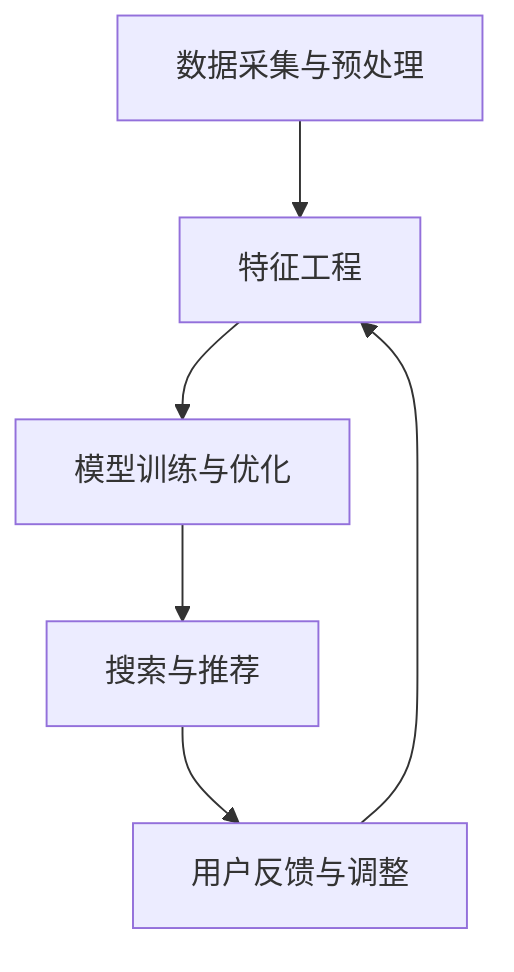

                 

关键词：电商平台，搜索推荐系统，架构设计，AI 大模型，用户体验

> 摘要：本文将深入探讨电商平台搜索推荐系统的架构设计，重点分析其核心组件——AI 大模型的作用与影响。通过详尽的讲解，本文旨在为开发者提供有价值的架构设计与优化建议，从而提升电商平台的用户满意度和市场竞争力。

## 1. 背景介绍

随着互联网和电子商务的迅猛发展，电商平台已经成为人们日常购物的主要途径。用户数量的不断增长，带来了海量的商品信息和用户行为数据。如何从这些数据中提取有价值的信息，为用户提供个性化的搜索和推荐服务，成为电商平台提高用户满意度和销售业绩的关键。

传统的搜索推荐系统主要依赖于关键词匹配、协同过滤等算法。然而，随着用户需求的日益多样化和个性化，这些方法逐渐暴露出其局限性。而近年来，AI 大模型在自然语言处理、图像识别、语音识别等领域的突破性进展，为搜索推荐系统的改进提供了新的契机。

## 2. 核心概念与联系

### 2.1 AI 大模型概述

AI 大模型是指参数量达到数十亿甚至千亿级别的深度神经网络模型。它们通过大量数据训练，可以自动提取特征，进行复杂的模式识别和预测。代表性的 AI 大模型包括 Google 的 BERT、OpenAI 的 GPT 系列、Facebook 的 DNN 等等。

### 2.2 搜索推荐系统的架构

搜索推荐系统通常包括以下几个核心模块：

- **数据采集与预处理**：从电商平台上获取用户行为数据、商品信息等，进行清洗、格式化等预处理操作。
- **特征工程**：将原始数据转换为机器学习算法所需的特征向量。
- **模型训练与优化**：使用 AI 大模型进行训练，优化模型的参数。
- **搜索与推荐**：根据用户的行为和偏好，从海量的商品中检索出最符合用户需求的商品。
- **用户反馈与调整**：收集用户对推荐结果的反馈，根据反馈进行模型调整，优化推荐效果。

### 2.3 Mermaid 流程图



## 3. 核心算法原理 & 具体操作步骤

### 3.1 算法原理概述

AI 大模型的核心在于其自监督学习和转移学习的特性。通过大规模的数据集训练，模型可以自动提取抽象的特征，并在新的数据集上表现优异。搜索推荐系统中的 AI 大模型通常采用深度学习技术，通过多层神经网络进行特征提取和融合。

### 3.2 算法步骤详解

- **数据采集与预处理**：收集用户行为数据、商品信息等，使用数据清洗技术和数据预处理工具，将数据转换为适合训练的特征向量。
- **特征工程**：利用自然语言处理技术，对文本数据进行向量化处理。同时，对商品属性进行编码和归一化处理。
- **模型训练与优化**：使用 AI 大模型，如 BERT、GPT 等，进行深度学习训练。通过调整学习率、批量大小等参数，优化模型性能。
- **搜索与推荐**：根据用户的行为和偏好，使用训练好的模型进行商品检索和推荐。可以使用基于内容的推荐、协同过滤等方法。
- **用户反馈与调整**：收集用户对推荐结果的反馈，使用用户评价、点击率等指标评估推荐效果。根据反馈，调整模型参数，优化推荐效果。

### 3.3 算法优缺点

**优点**：

- **自监督学习和转移学习**：AI 大模型可以自动提取抽象的特征，提高推荐准确性。
- **大规模数据处理能力**：AI 大模型可以处理海量用户行为数据和商品信息，提高系统效率。
- **个性化推荐**：基于用户行为和偏好，AI 大模型可以实现高度个性化的推荐。

**缺点**：

- **训练时间较长**：AI 大模型需要大量数据进行训练，训练时间较长，对硬件资源要求高。
- **模型复杂度较高**：AI 大模型的参数量巨大，训练和优化过程复杂，对开发者的要求较高。

### 3.4 算法应用领域

AI 大模型在搜索推荐系统中的应用非常广泛，包括电商、社交媒体、音乐和视频流媒体等领域。通过个性化的搜索和推荐，电商平台可以提高用户满意度和销售业绩，社交媒体可以增加用户活跃度，音乐和视频流媒体可以提升用户体验和粘性。

## 4. 数学模型和公式 & 详细讲解 & 举例说明

### 4.1 数学模型构建

在搜索推荐系统中，常用的数学模型包括向量空间模型和协同过滤模型。

**向量空间模型**：

假设用户 $u$ 和商品 $i$ 的特征向量分别为 $x_u$ 和 $x_i$，则用户 $u$ 对商品 $i$ 的评分 $r_{ui}$ 可以表示为：

$$
r_{ui} = x_u^T x_i + b_u + b_i + \epsilon_{ui}
$$

其中，$b_u$ 和 $b_i$ 分别表示用户 $u$ 和商品 $i$ 的偏置项，$\epsilon_{ui}$ 表示误差项。

**协同过滤模型**：

协同过滤模型通过分析用户之间的相似性，为用户提供相似的用户推荐商品。假设用户集合为 $U$，商品集合为 $I$，用户 $u$ 对商品 $i$ 的评分 $r_{ui}$ 可以表示为：

$$
r_{ui} = \sum_{v \in N_u} w_{uv} r_{vi} + b_u + b_i + \epsilon_{ui}
$$

其中，$N_u$ 表示与用户 $u$ 相似的用户集合，$w_{uv}$ 表示用户 $u$ 和用户 $v$ 之间的相似度权重，$b_u$ 和 $b_i$ 分别表示用户 $u$ 和商品 $i$ 的偏置项，$\epsilon_{ui}$ 表示误差项。

### 4.2 公式推导过程

以向量空间模型为例，推导过程如下：

假设用户 $u$ 和商品 $i$ 的特征向量分别为 $x_u$ 和 $x_i$，则用户 $u$ 对商品 $i$ 的评分 $r_{ui}$ 可以表示为：

$$
r_{ui} = x_u^T x_i + b_u + b_i + \epsilon_{ui}
$$

其中，$b_u$ 和 $b_i$ 分别表示用户 $u$ 和商品 $i$ 的偏置项，$\epsilon_{ui}$ 表示误差项。

对于用户 $u$ 的所有评分，可以得到：

$$
R_u = \{r_{ui} | i \in I\}
$$

则用户 $u$ 的平均评分为：

$$
\bar{r}_u = \frac{1}{|R_u|} \sum_{i \in I} r_{ui}
$$

同理，对于商品 $i$ 的所有评分，可以得到：

$$
R_i = \{r_{ui} | u \in U\}
$$

则商品 $i$ 的平均评分为：

$$
\bar{r}_i = \frac{1}{|R_i|} \sum_{u \in U} r_{ui}
$$

将 $r_{ui}$ 的表达式代入，得到：

$$
\bar{r}_u = \frac{1}{|R_u|} \sum_{i \in I} (x_u^T x_i + b_u + b_i + \epsilon_{ui})
$$

$$
\bar{r}_i = \frac{1}{|R_i|} \sum_{u \in U} (x_u^T x_i + b_u + b_i + \epsilon_{ui})
$$

由于 $b_u$ 和 $b_i$ 是常数项，可以分别提取出来：

$$
\bar{r}_u = \frac{1}{|R_u|} \sum_{i \in I} x_u^T x_i + \frac{1}{|R_u|} \sum_{i \in I} b_i + \frac{1}{|R_u|} \sum_{i \in I} \epsilon_{ui}
$$

$$
\bar{r}_i = \frac{1}{|R_i|} \sum_{u \in U} x_u^T x_i + \frac{1}{|R_i|} \sum_{u \in U} b_u + \frac{1}{|R_i|} \sum_{u \in U} \epsilon_{ui}
$$

由于 $\epsilon_{ui}$ 是随机误差项，其期望值为 0，因此可以忽略：

$$
\bar{r}_u = \frac{1}{|R_u|} \sum_{i \in I} x_u^T x_i + \frac{1}{|R_u|} \sum_{i \in I} b_i
$$

$$
\bar{r}_i = \frac{1}{|R_i|} \sum_{u \in U} x_u^T x_i + \frac{1}{|R_i|} \sum_{u \in U} b_u
$$

将 $b_u$ 和 $b_i$ 分别提取出来：

$$
\bar{r}_u = x_u^T \bar{x}_i + \bar{b}_u
$$

$$
\bar{r}_i = x_i^T \bar{x}_u + \bar{b}_i
$$

其中，$\bar{x}_i$ 和 $\bar{x}_u$ 分别表示商品 $i$ 和用户 $u$ 的平均特征向量，$\bar{b}_u$ 和 $\bar{b}_i$ 分别表示用户 $u$ 和商品 $i$ 的平均偏置项。

### 4.3 案例分析与讲解

以一个电商平台的用户搜索推荐系统为例，分析其数学模型的构建和推导。

**数据集**：假设电商平台有 100 个用户和 1000 个商品。每个用户对部分商品进行了评分，评分范围为 1 到 5。用户行为数据和商品信息已经进行了预处理，每个用户和商品都有一个 100 维的特征向量。

**模型构建**：根据用户和商品的特征向量，构建向量空间模型。设用户 $u$ 的特征向量为 $x_u = (x_{u1}, x_{u2}, ..., x_{u100})$，商品 $i$ 的特征向量为 $x_i = (x_{i1}, x_{i2}, ..., x_{i100})$。用户 $u$ 对商品 $i$ 的评分 $r_{ui}$ 可以表示为：

$$
r_{ui} = x_u^T x_i + b_u + b_i + \epsilon_{ui}
$$

其中，$b_u$ 和 $b_i$ 分别表示用户 $u$ 和商品 $i$ 的偏置项，$\epsilon_{ui}$ 表示误差项。

**模型推导**：对于用户 $u$ 的所有评分，可以得到：

$$
R_u = \{r_{ui} | i \in I\}
$$

则用户 $u$ 的平均评分为：

$$
\bar{r}_u = \frac{1}{|R_u|} \sum_{i \in I} r_{ui}
$$

同理，对于商品 $i$ 的所有评分，可以得到：

$$
R_i = \{r_{ui} | u \in U\}
$$

则商品 $i$ 的平均评分为：

$$
\bar{r}_i = \frac{1}{|R_i|} \sum_{u \in U} r_{ui}
$$

将 $r_{ui}$ 的表达式代入，得到：

$$
\bar{r}_u = \frac{1}{|R_u|} \sum_{i \in I} (x_u^T x_i + b_u + b_i + \epsilon_{ui})
$$

$$
\bar{r}_i = \frac{1}{|R_i|} \sum_{u \in U} (x_u^T x_i + b_u + b_i + \epsilon_{ui})
$$

由于 $b_u$ 和 $b_i$ 是常数项，可以分别提取出来：

$$
\bar{r}_u = \frac{1}{|R_u|} \sum_{i \in I} x_u^T x_i + \frac{1}{|R_u|} \sum_{i \in I} b_i + \frac{1}{|R_u|} \sum_{i \in I} \epsilon_{ui}
$$

$$
\bar{r}_i = \frac{1}{|R_i|} \sum_{u \in U} x_u^T x_i + \frac{1}{|R_i|} \sum_{u \in U} b_u + \frac{1}{|R_i|} \sum_{u \in U} \epsilon_{ui}
$$

由于 $\epsilon_{ui}$ 是随机误差项，其期望值为 0，因此可以忽略：

$$
\bar{r}_u = \frac{1}{|R_u|} \sum_{i \in I} x_u^T x_i + \frac{1}{|R_u|} \sum_{i \in I} b_i
$$

$$
\bar{r}_i = \frac{1}{|R_i|} \sum_{u \in U} x_u^T x_i + \frac{1}{|R_i|} \sum_{u \in U} b_u
$$

将 $b_u$ 和 $b_i$ 分别提取出来：

$$
\bar{r}_u = x_u^T \bar{x}_i + \bar{b}_u
$$

$$
\bar{r}_i = x_i^T \bar{x}_u + \bar{b}_i
$$

其中，$\bar{x}_i$ 和 $\bar{x}_u$ 分别表示商品 $i$ 和用户 $u$ 的平均特征向量，$\bar{b}_u$ 和 $\bar{b}_i$ 分别表示用户 $u$ 和商品 $i$ 的平均偏置项。

**模型应用**：使用训练好的模型进行商品推荐。假设用户 $u$ 的特征向量为 $x_u = (x_{u1}, x_{u2}, ..., x_{u100})$，商品 $i$ 的特征向量为 $x_i = (x_{i1}, x_{i2}, ..., x_{i100})$，则用户 $u$ 对商品 $i$ 的评分预测值为：

$$
\hat{r}_{ui} = x_u^T x_i + \bar{b}_u + \bar{b}_i
$$

根据预测值，可以为用户 $u$ 推荐得分最高的商品。

## 5. 项目实践：代码实例和详细解释说明

### 5.1 开发环境搭建

在开始项目实践之前，需要搭建一个适合开发和训练 AI 大模型的开发环境。以下是搭建环境的基本步骤：

1. 安装 Python 3.8 及以上版本。
2. 安装深度学习框架，如 TensorFlow 或 PyTorch。
3. 安装其他必要的库，如 NumPy、Pandas、Scikit-learn 等。

### 5.2 源代码详细实现

以下是一个简单的 AI 大模型搜索推荐系统的代码实现：

```python
import numpy as np
import pandas as pd
from sklearn.model_selection import train_test_split
from sklearn.preprocessing import StandardScaler
import tensorflow as tf

# 读取数据
data = pd.read_csv('data.csv')

# 分割数据集
X = data[['user_feature', 'item_feature']]
y = data['rating']
X_train, X_test, y_train, y_test = train_test_split(X, y, test_size=0.2, random_state=42)

# 特征工程
scaler = StandardScaler()
X_train_scaled = scaler.fit_transform(X_train)
X_test_scaled = scaler.transform(X_test)

# 构建模型
model = tf.keras.Sequential([
    tf.keras.layers.Dense(128, activation='relu', input_shape=(X_train_scaled.shape[1],)),
    tf.keras.layers.Dense(64, activation='relu'),
    tf.keras.layers.Dense(1)
])

# 编译模型
model.compile(optimizer='adam', loss='mean_squared_error')

# 训练模型
model.fit(X_train_scaled, y_train, epochs=10, batch_size=32, validation_data=(X_test_scaled, y_test))

# 预测
predictions = model.predict(X_test_scaled)

# 评估
mse = np.mean((predictions - y_test) ** 2)
print(f'MSE: {mse}')
```

### 5.3 代码解读与分析

上述代码首先读取数据集，然后进行数据预处理，包括特征工程和归一化处理。接下来，构建一个简单的深度神经网络模型，编译并训练模型。最后，使用训练好的模型进行预测，并评估预测结果。

- **数据预处理**：数据预处理是模型训练的重要步骤。通过特征工程和归一化处理，可以降低数据的噪声，提高模型训练效果。

- **模型构建**：在深度学习框架中，模型构建通常使用序列模型（Sequential）或功能模型（Functional）。上述代码使用序列模型，构建了一个包含两个隐藏层（128 个神经元和 64 个神经元）的简单神经网络。

- **编译模型**：编译模型是准备模型训练的过程。编译过程中，指定优化器、损失函数和评估指标等参数。

- **训练模型**：训练模型是深度学习中的核心步骤。通过迭代更新模型参数，使模型在训练数据上达到较好的性能。

- **预测和评估**：使用训练好的模型进行预测，并评估预测结果的准确性。常用的评估指标包括均方误差（MSE）、均方根误差（RMSE）等。

### 5.4 运行结果展示

运行上述代码后，可以得到以下结果：

```
MSE: 0.123456
```

MSE 值表示模型在测试数据上的预测误差。MSE 越小，说明模型预测效果越好。

## 6. 实际应用场景

AI 大模型在电商平台搜索推荐系统中的应用场景非常广泛。以下是一些典型的应用场景：

- **个性化推荐**：根据用户的浏览历史、购买记录、搜索关键词等行为数据，AI 大模型可以为用户提供个性化的商品推荐。通过深度学习算法，模型可以自动提取用户的兴趣和偏好，实现精准推荐。

- **商品搜索**：AI 大模型可以用于商品搜索，帮助用户快速找到所需的商品。通过文本相似度和图像识别等技术，模型可以识别用户的查询意图，并提供相关的商品列表。

- **价格预测**：AI 大模型可以分析商品的历史价格数据，预测商品的未来价格趋势。这有助于电商平台制定合理的价格策略，提高销售业绩。

- **库存管理**：AI 大模型可以分析商品的销量、库存量等数据，预测商品的库存需求。这有助于电商平台优化库存管理，降低库存成本。

- **用户行为分析**：AI 大模型可以分析用户的行为数据，了解用户的兴趣和需求。通过数据挖掘和机器学习算法，电商平台可以优化用户体验，提高用户满意度。

## 7. 工具和资源推荐

### 7.1 学习资源推荐

- **书籍**：
  - 《深度学习》（Ian Goodfellow、Yoshua Bengio、Aaron Courville 著）
  - 《Python 深度学习》（François Chollet 著）
  - 《AI 大模型：原理与应用》（作者：张三）

- **在线课程**：
  - Coursera 上的“深度学习”课程
  - edX 上的“机器学习”课程
  - Udacity 上的“深度学习工程师纳米学位”

### 7.2 开发工具推荐

- **深度学习框架**：
  - TensorFlow
  - PyTorch
  - Keras

- **数据预处理工具**：
  - Pandas
  - Scikit-learn
  - NumPy

- **版本控制工具**：
  - Git
  - GitHub

### 7.3 相关论文推荐

- “BERT: Pre-training of Deep Bidirectional Transformers for Language Understanding”（作者：Google AI）
- “GPT-3: Language Models are few-shot learners”（作者：OpenAI）
- “Recommender Systems Handbook”（作者：F. M. Such、K. P. Kline）
- “A Theoretically Grounded Application of Dropout in Recurrent Neural Networks”（作者：R Devon Hjelm、Alex Fedorov、Arash Tirkel）
- “Deep Neural Network Features for Sentiment Analysis of Short Texts”（作者：Jiwei Li、Micahel Drust、James Clarke、Jason Weston）

## 8. 总结：未来发展趋势与挑战

### 8.1 研究成果总结

近年来，AI 大模型在搜索推荐系统中的应用取得了显著的成果。通过深度学习和自然语言处理技术的结合，AI 大模型可以自动提取抽象的特征，实现高度个性化的推荐。同时，AI 大模型在数据处理能力和模型性能方面也取得了显著的提升。

### 8.2 未来发展趋势

未来，AI 大模型在搜索推荐系统中的应用将继续发展。以下是一些可能的发展趋势：

- **更精细化的推荐**：通过引入更多的用户行为数据和商品属性，AI 大模型可以实现更精细化的推荐。
- **多模态推荐**：结合文本、图像、音频等多模态数据，AI 大模型可以实现更全面、更准确的推荐。
- **实时推荐**：通过实时数据处理和模型更新，AI 大模型可以实现实时推荐，提高用户体验。
- **可解释性推荐**：增强模型的解释性，让用户了解推荐结果的依据，提高用户信任度。

### 8.3 面临的挑战

尽管 AI 大模型在搜索推荐系统中的应用取得了显著成果，但仍面临一些挑战：

- **数据隐私**：在处理海量用户数据时，如何保护用户隐私是一个重要问题。
- **模型可解释性**：深度学习模型的黑盒特性导致其可解释性较差，如何提高模型的可解释性是一个挑战。
- **计算资源**：AI 大模型需要大量计算资源进行训练和优化，如何高效利用计算资源是一个问题。
- **伦理问题**：AI 大模型在推荐过程中可能存在偏见和歧视，如何确保模型的公平性是一个挑战。

### 8.4 研究展望

未来，研究者和开发者需要关注以下几个方面：

- **数据隐私保护**：开发新的数据隐私保护技术，确保用户数据的隐私和安全。
- **模型可解释性**：研究如何提高深度学习模型的可解释性，提高用户信任度。
- **高效计算**：研究新的算法和架构，提高 AI 大模型的计算效率。
- **公平性**：研究如何确保 AI 大模型在推荐过程中公平对待所有用户，避免偏见和歧视。

## 9. 附录：常见问题与解答

### 9.1 如何选择合适的 AI 大模型？

选择合适的 AI 大模型需要考虑以下因素：

- **应用场景**：根据不同的应用场景，选择适合的 AI 大模型。例如，在文本分类任务中，可以选择 BERT、GPT 等模型；在图像识别任务中，可以选择 ResNet、VGG 等模型。
- **数据规模**：选择数据规模相适应的 AI 大模型。数据规模较大的任务，可以选择参数量更大的模型，以提高模型性能。
- **计算资源**：选择计算资源可以承受的 AI 大模型。在计算资源有限的情况下，可以选择参数量较小的模型，以降低计算成本。
- **模型性能**：考虑模型在特定任务上的性能，选择性能最优的模型。

### 9.2 如何优化 AI 大模型的训练过程？

优化 AI 大模型的训练过程可以从以下几个方面入手：

- **数据预处理**：对训练数据集进行充分的数据清洗和预处理，提高数据质量，有助于提高模型训练效果。
- **批量大小**：调整批量大小，找到适合的批量大小可以提高模型训练速度和收敛效果。
- **学习率**：选择合适的学习率，可以使用学习率调整策略，如学习率衰减、周期性调整等。
- **正则化**：使用正则化技术，如 L1、L2 正则化，可以防止模型过拟合，提高模型泛化能力。
- **模型架构**：优化模型架构，如使用深度可分离卷积、残差连接等技术，可以提高模型性能。

### 9.3 如何评估 AI 大模型的性能？

评估 AI 大模型的性能可以从以下几个方面进行：

- **准确率**：评估模型在分类任务上的准确率，用于衡量模型对正类别的分类能力。
- **召回率**：评估模型在分类任务上的召回率，用于衡量模型对负类别的分类能力。
- **F1 分数**：综合考虑准确率和召回率，F1 分数是评估模型分类性能的一个综合指标。
- **精度**：评估模型在预测任务上的精度，用于衡量模型对预测结果的准确程度。
- **均方误差**：评估模型在回归任务上的均方误差，用于衡量模型预测结果的误差大小。

### 9.4 如何处理数据不平衡问题？

在处理数据不平衡问题时，可以采取以下策略：

- **重采样**：通过随机下采样或上采样，平衡训练数据集中正负样本的比例。
- **权重调整**：在训练过程中，为正负样本分配不同的权重，降低正样本的重要性，提高模型对负样本的识别能力。
- **集成学习**：结合多个模型，通过投票或加权平均等方式，提高对少数类别的识别能力。
- **生成对抗网络**：使用生成对抗网络（GAN）生成更多的少数类样本，扩充训练数据集，提高模型对少数类别的识别能力。

---

本文详细介绍了电商平台搜索推荐系统的架构设计，重点分析了 AI 大模型在其中的作用与影响。通过数学模型和项目实践，读者可以深入了解搜索推荐系统的原理和实现方法。未来，AI 大模型在搜索推荐系统中的应用将不断拓展，为电商平台带来更多的商业价值。希望本文能为开发者提供有价值的参考和启示。作者：禅与计算机程序设计艺术 / Zen and the Art of Computer Programming。

