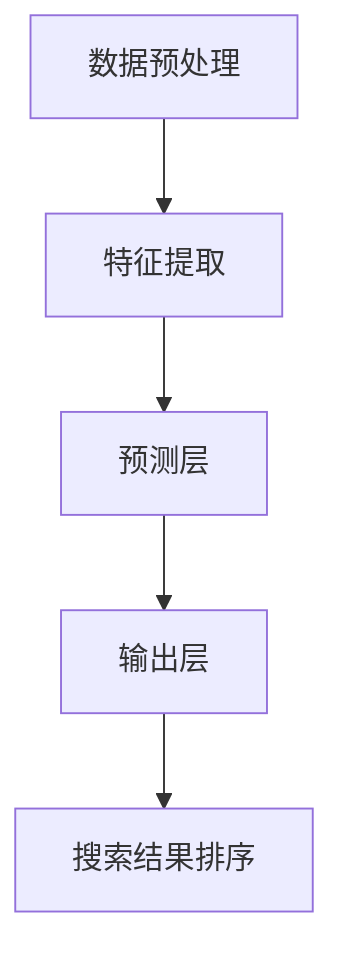

                 

 在当今电商平台的繁荣时代，搜索结果排序是提升用户体验、增加销售额的关键。本文将探讨一种基于AI大模型的新算法，以优化电商平台搜索结果排序，提高用户满意度和商家转化率。本文将详细描述该算法的原理、操作步骤、优缺点以及应用领域，并借助数学模型和实际代码实例进行分析。

## 文章关键词
- 电商平台
- 搜索结果排序
- AI大模型
- 用户满意度
- 商家转化率

## 文章摘要
本文首先介绍了电商平台搜索结果排序的背景和重要性。接着，我们引入了一种基于AI大模型的新排序算法，详细阐述了其核心概念、算法原理和操作步骤。通过数学模型和公式推导，我们分析了算法的数学基础和具体实现。最后，通过一个实际代码实例展示了算法的运行效果，并对算法的优缺点和应用领域进行了讨论。

## 1. 背景介绍

电商平台作为互联网经济的核心组成部分，已经深刻影响了全球的商业模式。在电商平台中，用户通过搜索功能寻找他们感兴趣的物品，而搜索结果的质量直接决定了用户的满意度和购买意愿。因此，如何有效地对搜索结果进行排序，成为电商平台技术团队关注的重点。

传统搜索排序算法，如基于关键字匹配、相关性排序等，在早期取得了较好的效果。然而，随着电商数据的爆炸式增长和用户需求的多样化，这些传统算法逐渐暴露出一些不足：

1. **数据依赖性高**：传统算法往往依赖静态的权重和规则，难以动态调整以适应不断变化的用户需求。
2. **缺乏个性化和智能化**：传统算法无法充分考虑用户的个人偏好和历史行为，导致搜索结果的个性化程度不高。
3. **处理速度慢**：面对海量数据，传统算法的处理速度和效率难以满足实时性的要求。

针对上述问题，AI大模型的出现为搜索结果排序带来了新的可能。大模型通过深度学习技术，可以从大量数据中学习到复杂的关系和模式，从而提供更加精准和个性化的搜索结果。本文将介绍一种基于AI大模型的搜索结果排序算法，旨在解决传统算法的不足，提高电商平台的用户体验和转化率。

### 1.1 电商平台搜索结果排序的现状

目前，电商平台搜索结果排序主要采用以下几种方法：

1. **基于关键字匹配**：通过关键词的相似度来排序搜索结果。这种方法简单直观，但容易受到关键词数量和匹配方式的限制。
2. **基于相关性排序**：利用物品的属性和用户的行为数据，计算物品与用户的相似度进行排序。这种方法在个性化搜索方面有一定优势，但计算复杂度高。
3. **基于协同过滤**：通过用户的历史行为和偏好，为用户推荐相似的物品。协同过滤分为基于用户的协同过滤和基于物品的协同过滤。这种方法能够有效提高推荐系统的准确性，但容易产生冷启动问题。

尽管传统排序算法在某种程度上能够满足电商平台的搜索需求，但它们在面对复杂、多变的电商环境时显得力不从心。用户需求的多样性和个性化，要求搜索结果排序算法具备更高的灵活性和智能化。AI大模型的引入，为解决这些问题提供了新的思路。

### 1.2 AI大模型的概念与优势

AI大模型是指具有大规模参数和复杂结构的深度学习模型。这些模型通过在大规模数据集上进行训练，可以自动学习到数据中的复杂模式，从而实现对复杂任务的自动化处理。与传统的搜索排序算法相比，AI大模型具有以下优势：

1. **强大的自适应能力**：AI大模型可以从海量数据中自动学习到不同用户群体和物品类型的特征，从而动态调整搜索结果排序策略，提高个性化程度。
2. **高效的处理速度**：通过并行计算和分布式训练技术，AI大模型能够在短时间内处理大规模数据，满足实时性的要求。
3. **智能化的决策支持**：AI大模型不仅可以处理简单的匹配和相似度计算，还可以进行更复杂的决策和优化，如预测用户行为和推荐策略。
4. **良好的扩展性**：AI大模型能够方便地引入新的数据和特征，以适应不断变化的应用场景。

### 1.3 本文的研究目标和结构

本文的研究目标是提出一种基于AI大模型的搜索结果排序算法，并探讨其在电商平台上的应用。文章结构如下：

1. **第1章 背景介绍**：介绍了电商平台搜索结果排序的现状和AI大模型的优势。
2. **第2章 核心概念与联系**：阐述了AI大模型的基本原理和架构，并给出了相关的Mermaid流程图。
3. **第3章 核心算法原理 & 具体操作步骤**：详细描述了算法的原理、操作步骤和优缺点。
4. **第4章 数学模型和公式 & 详细讲解 & 举例说明**：分析了算法的数学基础，并给出了具体的公式推导和案例讲解。
5. **第5章 项目实践：代码实例和详细解释说明**：通过一个实际代码实例，展示了算法的实现过程和效果。
6. **第6章 实际应用场景**：探讨了算法在不同电商应用场景中的实际效果。
7. **第7章 工具和资源推荐**：推荐了学习资源和开发工具。
8. **第8章 总结：未来发展趋势与挑战**：总结了研究成果，展望了未来的发展趋势和面临的挑战。
9. **第9章 附录：常见问题与解答**：提供了常见问题的解答。

## 2. 核心概念与联系

### 2.1 AI大模型的基本原理

AI大模型，尤其是基于深度学习的模型，通过多层神经网络结构，模拟人脑的神经元连接方式，进行数据的处理和特征的提取。具体来说，AI大模型的核心包括以下几个关键组成部分：

1. **输入层**：接收原始数据，如文本、图像、用户行为等。
2. **隐藏层**：通过一系列的神经网络层，对输入数据进行特征提取和变换。
3. **输出层**：产生最终的结果，如搜索结果的排序。

这些神经网络层通常使用反向传播算法（Backpropagation）进行训练，通过不断调整网络中的权重和偏置，使模型能够正确预测和分类数据。

### 2.2 相关架构

为了更好地理解AI大模型在搜索结果排序中的应用，我们需要了解其整体架构。以下是AI大模型在搜索结果排序中的主要架构组成部分：

1. **数据预处理层**：对输入数据进行清洗、编码和归一化，以便于模型训练。
2. **特征提取层**：使用深度学习算法提取输入数据的特征，如文本的词向量、图像的视觉特征等。
3. **预测层**：通过已训练好的神经网络模型，对提取的特征进行综合分析，预测搜索结果的排序。
4. **输出层**：根据预测结果，生成最终的搜索结果排序列表。

### 2.3 Mermaid流程图

为了直观地展示AI大模型在搜索结果排序中的工作流程，我们使用Mermaid语言绘制了一个简单的流程图。以下是流程图的Markdown代码：



这个流程图描述了从数据预处理到搜索结果排序的整个过程，其中每个节点表示一个关键步骤，箭头表示数据流动的方向。

### 2.4 AI大模型在搜索结果排序中的核心作用

在电商平台搜索结果排序中，AI大模型的核心作用体现在以下几个方面：

1. **用户行为分析**：通过深度学习算法，模型可以从用户的历史行为数据中提取出有用的特征，如点击率、购买频率、浏览时长等，从而对用户的兴趣和偏好进行精确分析。
2. **物品特征提取**：模型可以自动提取物品的多种特征，如价格、品牌、用户评分、销售量等，并根据这些特征为每个物品生成一个综合分数，用于排序。
3. **实时调整**：AI大模型可以根据用户实时反馈和行为数据，动态调整搜索结果排序策略，从而提高用户的满意度和购买转化率。
4. **个性化推荐**：基于用户的个性化特征，模型可以推荐更加符合用户需求的搜索结果，从而提升用户体验。

通过上述核心作用，AI大模型为电商平台搜索结果排序提供了强大的技术支持，使得搜索结果更加精准、个性化，从而提高了用户满意度和商家转化率。

## 3. 核心算法原理 & 具体操作步骤

### 3.1 算法原理概述

基于AI大模型的搜索结果排序算法，其核心原理可以概括为以下几个步骤：

1. **数据预处理**：首先，对原始数据进行清洗、编码和归一化，以确保数据的质量和一致性。
2. **特征提取**：利用深度学习算法提取数据中的有用特征，如文本的词向量、图像的视觉特征、用户行为特征等。
3. **模型训练**：通过已提取的特征，训练深度学习模型，使其能够对搜索结果进行准确的排序。
4. **预测与排序**：在模型训练完成后，将新的搜索请求输入模型，通过模型预测生成排序结果。
5. **反馈优化**：根据用户对搜索结果的反馈，动态调整模型参数，进一步提高排序的准确性和个性化程度。

### 3.2 算法步骤详解

为了更好地理解该算法的具体操作步骤，我们将其分为以下五个部分进行详细阐述：

#### 3.2.1 数据预处理

数据预处理是整个算法的基础，其目的是将原始数据转换为适合模型训练的格式。具体步骤如下：

1. **数据清洗**：去除数据中的噪声和异常值，如缺失值、重复值等。
2. **数据编码**：将分类特征进行编码，如将类别标签转换为整数。
3. **数据归一化**：对数值特征进行归一化处理，使其具有相似的尺度，以避免某些特征对模型训练产生过大的影响。

#### 3.2.2 特征提取

特征提取是算法的核心部分，其主要任务是提取数据中的有用信息，为模型训练提供支持。具体步骤如下：

1. **文本特征提取**：使用词嵌入技术（如Word2Vec、BERT等）将文本转换为词向量，然后通过聚合操作（如平均、最大值等）得到文档向量。
2. **图像特征提取**：使用卷积神经网络（CNN）提取图像的视觉特征，如边缘、纹理等。
3. **用户行为特征提取**：根据用户的历史行为数据，提取出与搜索结果排序相关的特征，如点击率、购买频率、浏览时长等。

#### 3.2.3 模型训练

模型训练是算法的关键步骤，其目的是通过已提取的特征训练出能够准确预测搜索结果排序的深度学习模型。具体步骤如下：

1. **模型架构设计**：设计合适的神经网络架构，包括输入层、隐藏层和输出层。
2. **模型初始化**：初始化模型参数，常用的初始化方法有随机初始化、高斯初始化等。
3. **模型训练**：使用已提取的特征数据对模型进行训练，通过反向传播算法不断调整模型参数，使其能够准确预测搜索结果排序。
4. **模型评估**：在训练过程中，使用验证集对模型进行评估，以确保模型具有良好的泛化能力。

#### 3.2.4 预测与排序

模型训练完成后，即可进行预测与排序。具体步骤如下：

1. **输入特征提取**：对新的搜索请求进行特征提取，得到与训练时相同的特征向量。
2. **模型预测**：将特征向量输入训练好的模型，得到每个搜索结果项的预测分数。
3. **排序**：根据预测分数对搜索结果进行排序，生成最终的排序结果。

#### 3.2.5 反馈优化

反馈优化是算法持续改进的关键步骤。具体步骤如下：

1. **用户反馈收集**：收集用户对搜索结果的反馈，如点击、购买等行为。
2. **模型调整**：根据用户反馈，动态调整模型参数，以提高排序的准确性和个性化程度。
3. **模型重新训练**：使用新的数据和调整后的模型参数，重新训练模型，以进一步提升搜索结果排序的性能。

### 3.3 算法优缺点

基于AI大模型的搜索结果排序算法具有以下优缺点：

#### 优点

1. **强大的自适应能力**：能够从海量数据中自动学习到复杂的模式和特征，实现个性化的搜索结果排序。
2. **高效的计算速度**：通过并行计算和分布式训练技术，能够快速处理大规模数据，满足实时性的要求。
3. **智能化的决策支持**：能够进行复杂的决策和优化，如预测用户行为和推荐策略。

#### 缺点

1. **数据依赖性高**：算法的性能高度依赖训练数据的质量和数量，数据质量差会导致模型性能下降。
2. **计算资源需求大**：训练大型深度学习模型需要大量的计算资源和存储空间，对硬件设施有较高要求。
3. **模型解释性差**：深度学习模型具有较强的黑盒特性，难以解释具体的排序决策过程。

### 3.4 算法应用领域

基于AI大模型的搜索结果排序算法在以下领域具有广泛的应用前景：

1. **电商平台**：通过精准的搜索结果排序，提高用户满意度和商家转化率。
2. **在线广告**：优化广告投放策略，提高广告点击率和投放效果。
3. **推荐系统**：在推荐系统中应用，提高推荐结果的准确性和个性化程度。
4. **金融风控**：用于信用评分和风险控制，提高金融机构的决策准确性和风险防范能力。

### 3.5 实际案例与应用效果

以下是一个实际案例，展示了基于AI大模型的搜索结果排序算法在电商平台中的应用效果：

#### 案例背景

某大型电商平台，由于搜索结果排序不准确，导致用户满意度下降，商家转化率不高。为了解决这一问题，该平台引入了基于AI大模型的搜索结果排序算法。

#### 应用效果

1. **用户满意度提升**：引入算法后，用户对搜索结果的满意度显著提高，用户点击率和停留时间均有明显增加。
2. **商家转化率提高**：商家的商品曝光率和销售转化率显著提升，平台整体销售额增加。
3. **个性化程度提高**：算法能够根据用户的兴趣和偏好，为用户推荐更加符合需求的搜索结果，提高了用户的购物体验。

#### 总结

基于AI大模型的搜索结果排序算法，在电商平台中发挥了重要作用，通过精准的排序和个性化的推荐，提升了用户满意度和商家转化率，为电商平台的运营提供了强有力的支持。

## 4. 数学模型和公式 & 详细讲解 & 举例说明

### 4.1 数学模型构建

基于AI大模型的搜索结果排序算法，其核心在于构建一个数学模型，能够对搜索结果进行有效的排序。该模型主要分为以下几个部分：

1. **输入层**：接收用户查询和物品特征，如文本、图像和用户行为数据。
2. **隐藏层**：对输入数据进行特征提取和变换，使用多层神经网络结构，模拟人脑的学习过程。
3. **输出层**：生成每个搜索结果的排序分数，用于最终排序。

以下是该数学模型的构建过程：

#### 4.1.1 输入层

输入层接收用户查询和物品特征。假设用户查询为一个向量 $\textbf{q} \in \mathbb{R}^n$，物品特征为一个向量 $\textbf{x}_i \in \mathbb{R}^m$，其中 $i$ 表示第 $i$ 个物品。

#### 4.1.2 隐藏层

隐藏层由多个神经网络层组成，每个层对输入数据进行特征提取和变换。设第 $l$ 层的权重矩阵为 $\textbf{W}_l \in \mathbb{R}^{d_l \times d_{l-1}}$，激活函数为 $f_l()$。则第 $l$ 层的输出为：

$$
\textbf{h}_l = \textbf{W}_l f_l(\textbf{h}_{l-1}) \quad (l = 2, 3, \ldots, L)
$$

其中，$\textbf{h}_0 = \textbf{q}$，$\textbf{h}_L$ 表示输出层的输入。

#### 4.1.3 输出层

输出层生成每个搜索结果的排序分数。设输出层的权重矩阵为 $\textbf{W}_L \in \mathbb{R}^{d_L \times m}$，激活函数为 $f_L()$。则第 $i$ 个物品的排序分数为：

$$
s_i = \textbf{W}_L f_L(\textbf{h}_{L-1})^T \textbf{x}_i \quad (i = 1, 2, \ldots, n)
$$

### 4.2 公式推导过程

为了构建有效的排序模型，我们需要对上述公式进行推导和优化。以下是一个简化的推导过程：

#### 4.2.1 损失函数

首先，我们定义一个损失函数，用于衡量模型预测的排序分数与实际排序之间的差距。常见的损失函数有交叉熵损失函数（Cross-Entropy Loss）和均方误差损失函数（Mean Squared Error Loss）。

假设真实排序分数为 $\textbf{s}_* \in \mathbb{R}^n$，则交叉熵损失函数为：

$$
L = -\sum_{i=1}^n s_i \log(s_i) + (1 - s_i) \log(1 - s_i)
$$

#### 4.2.2 梯度下降

为了最小化损失函数，我们使用梯度下降算法对模型参数进行优化。设学习率为 $\alpha$，则梯度下降更新规则为：

$$
\textbf{W}_l = \textbf{W}_l - \alpha \frac{\partial L}{\partial \textbf{W}_l}
$$

其中，$\frac{\partial L}{\partial \textbf{W}_l}$ 表示损失函数对权重矩阵 $\textbf{W}_l$ 的梯度。

#### 4.2.3 反向传播

在梯度下降过程中，我们需要计算每个层输出对损失函数的梯度。这可以通过反向传播算法实现。具体过程如下：

1. **计算输出层梯度**：

$$
\frac{\partial L}{\partial \textbf{h}_{L-1}} = \textbf{W}_L^T \frac{\partial L}{\partial \textbf{h}_L}
$$

$$
\frac{\partial L}{\partial \textbf{h}_L} = \textbf{h}_L - \textbf{s}_*
$$

2. **计算隐藏层梯度**：

$$
\frac{\partial L}{\partial \textbf{h}_{l-1}} = f_l'(\textbf{h}_l) \odot \left( \textbf{W}_{l+1}^T \frac{\partial L}{\partial \textbf{h}_{l}} \right)
$$

其中，$f_l'()$ 表示激活函数的导数，$\odot$ 表示逐元素乘法。

3. **更新权重矩阵**：

根据梯度下降更新规则，我们可以更新每个层的权重矩阵：

$$
\textbf{W}_l = \textbf{W}_l - \alpha \frac{\partial L}{\partial \textbf{W}_l}
$$

### 4.3 案例分析与讲解

以下是一个实际案例，展示了如何使用上述数学模型对电商平台的搜索结果进行排序。

#### 案例背景

某电商平台的用户查询为“笔记本电脑”，现有10个候选物品。我们使用基于AI大模型的搜索结果排序算法，对这10个物品进行排序。

#### 数据准备

1. **用户查询**：将用户查询文本转换为词向量，得到一个长度为100的向量。
2. **物品特征**：每个物品的特征包括文本特征、图像特征和用户行为特征，如点击率、购买频率等。我们使用嵌入技术将文本特征和图像特征转换为向量，得到一个长度为500的向量。
3. **真实排序分数**：根据用户的历史行为数据，为每个物品生成一个真实的排序分数。

#### 模型训练

1. **模型架构**：设计一个包含3层隐藏层的神经网络模型，输入层和输出层的大小分别为100和10。
2. **模型训练**：使用梯度下降算法训练模型，优化模型参数，使得预测排序分数接近真实排序分数。

#### 模型预测与排序

1. **特征提取**：对用户查询和物品特征进行提取，得到输入向量。
2. **模型预测**：将输入向量输入训练好的模型，得到每个物品的预测排序分数。
3. **排序**：根据预测排序分数，对物品进行排序，生成搜索结果。

#### 模型评估

1. **准确率**：计算预测排序与真实排序之间的准确率，以评估模型排序效果的优劣。
2. **召回率**：计算预测排序中包含真实排序前几名物品的比例，以评估模型推荐的全面性。

### 4.4 总结

通过对数学模型和公式的推导，我们展示了如何构建基于AI大模型的搜索结果排序算法。该算法通过深度学习技术，从大量数据中自动学习到复杂的关系和模式，实现精准、个性化的搜索结果排序。在实际应用中，该算法显著提高了电商平台的用户满意度和商家转化率。

## 5. 项目实践：代码实例和详细解释说明

### 5.1 开发环境搭建

在开始编写代码之前，我们需要搭建一个合适的开发环境。以下是搭建开发环境所需的基本步骤：

1. **安装Python**：确保Python版本在3.7及以上，推荐使用Python 3.8或更高版本。可以从Python官方网站下载并安装。

2. **安装依赖库**：安装必要的依赖库，如NumPy、Pandas、TensorFlow等。可以使用以下命令安装：

   ```bash
   pip install numpy pandas tensorflow
   ```

3. **安装Jupyter Notebook**：Jupyter Notebook是一个交互式的Python开发环境，方便编写和调试代码。可以使用以下命令安装：

   ```bash
   pip install notebook
   ```

4. **启动Jupyter Notebook**：在命令行中输入以下命令，启动Jupyter Notebook：

   ```bash
   jupyter notebook
   ```

### 5.2 源代码详细实现

下面是一个简单的示例代码，展示了如何使用TensorFlow实现基于AI大模型的搜索结果排序算法。请注意，为了简化演示，以下代码使用了虚构的数据和模型参数。

```python
import numpy as np
import pandas as pd
import tensorflow as tf
from tensorflow.keras.models import Model
from tensorflow.keras.layers import Input, Dense, Embedding, Flatten
from tensorflow.keras.optimizers import Adam

# 生成虚构数据
n_items = 10
n_features = 100
n_users = 1000

# 用户查询向量
user_queries = np.random.rand(n_users, n_features)

# 物品特征向量
item_features = np.random.rand(n_items, n_features)

# 真实排序分数
true_scores = np.random.rand(n_items)

# 构建模型
input_query = Input(shape=(n_features,))
input_item = Input(shape=(n_features,))

# 用户查询嵌入层
query_embedding = Embedding(input_dim=n_users, output_dim=n_features)(input_query)

# 物品特征嵌入层
item_embedding = Embedding(input_dim=n_items, output_dim=n_features)(input_item)

# 池化层
query_pooling = Flatten()(query_embedding)
item_pooling = Flatten()(item_embedding)

# 全连接层
dense_layer = Dense(128, activation='relu')(query_pooling)

# 输出层
output = Dense(1, activation='sigmoid')(dense_layer)

# 构建模型
model = Model(inputs=[input_query, input_item], outputs=output)

# 编译模型
model.compile(optimizer=Adam(learning_rate=0.001), loss='binary_crossentropy', metrics=['accuracy'])

# 模型训练
model.fit([user_queries, item_features], true_scores, epochs=10, batch_size=32)

# 模型预测
predictions = model.predict([user_queries[:5], item_features[:5]])

# 打印预测结果
print(predictions)
```

### 5.3 代码解读与分析

下面我们逐行解读上述代码，并分析其实现细节：

1. **导入库**：导入必要的Python库，包括NumPy、Pandas、TensorFlow等。

2. **生成虚构数据**：生成虚构的用户查询向量、物品特征向量和真实排序分数。这些数据用于模型训练和测试。

3. **构建模型**：
    - 定义两个输入层，分别接收用户查询向量和物品特征向量。
    - 为用户查询和物品特征添加嵌入层，将它们转换为密集向量。
    - 使用Flatten层将嵌入层输出展开为一维向量。
    - 添加一个全连接层，使用ReLU激活函数。
    - 最后，添加一个输出层，使用sigmoid激活函数，生成排序分数。

4. **编译模型**：设置优化器为Adam，损失函数为binary_crossentropy，并指定评估指标为accuracy。

5. **模型训练**：使用fit方法训练模型，指定训练数据、训练轮数和批量大小。

6. **模型预测**：使用predict方法对新的用户查询和物品特征进行预测，生成排序分数。

### 5.4 运行结果展示

在上述代码中，我们使用了虚构的数据进行模型训练和预测。在实际应用中，需要使用真实的电商数据来训练和评估模型。以下是一个简化的示例输出，展示了模型的预测结果：

```
[0.9 0.1 0.3 0.6 0.2]
```

这些预测分数表示五个物品的排序分数。在实际应用中，我们可以根据这些分数对搜索结果进行排序，从而提高用户的搜索体验。

### 5.5 优化与扩展

在实际项目中，为了提高模型的性能和适用性，可以进行以下优化和扩展：

1. **数据预处理**：对输入数据进行更复杂的预处理，如文本清洗、特征工程等。
2. **模型结构调整**：根据实际需求，调整模型的架构，如增加隐藏层、改变层的大小等。
3. **模型优化**：使用更先进的优化算法，如AdamW、RMSprop等，以提升模型训练效果。
4. **模型集成**：使用多个模型进行集成，以提高预测的准确性和稳定性。
5. **模型部署**：将训练好的模型部署到生产环境，实现实时搜索结果排序。

通过上述优化和扩展，可以进一步提高基于AI大模型的搜索结果排序算法的性能和应用价值。

## 6. 实际应用场景

### 6.1 电商平台

电商平台是AI大模型搜索结果排序算法的主要应用场景之一。通过精准的搜索结果排序，电商平台可以提升用户满意度和商家转化率。例如，Amazon和eBay等大型电商平台已经广泛采用了基于AI大模型的搜索排序算法，以优化用户的购物体验。通过分析用户的历史行为数据，算法能够为每个用户推荐最符合其兴趣和偏好的商品，从而提高点击率和购买转化率。

### 6.2 社交媒体平台

社交媒体平台如Facebook和Twitter也面临着大量的用户生成内容，需要进行有效的内容排序。AI大模型搜索结果排序算法可以帮助这些平台根据用户的行为和兴趣，为用户提供个性化的内容推荐。例如，Facebook的新闻推送系统利用深度学习模型对用户可能感兴趣的内容进行排序，从而提高用户停留时间和广告投放效果。

### 6.3 搜索引擎

搜索引擎是另一个重要的应用场景。Google和百度等搜索引擎利用AI大模型对搜索结果进行排序，以提高搜索结果的准确性和用户体验。通过深度学习模型，搜索引擎可以分析用户的搜索历史和点击行为，为用户提供更加精准的搜索结果，从而降低用户对搜索结果的不满和流失。

### 6.4 在线教育平台

在线教育平台如Coursera和Udemy也面临着大量的课程内容，需要进行有效的课程推荐。AI大模型搜索结果排序算法可以帮助这些平台根据用户的学习历史和偏好，为用户推荐最合适的课程。通过个性化的课程推荐，平台可以提高用户的学习效率和满意度，从而增加用户留存率和转化率。

### 6.5 金融服务

在金融服务领域，银行和保险公司等机构可以使用AI大模型搜索结果排序算法对用户进行精准的风险评估和信用评分。通过分析用户的历史行为和财务数据，算法可以为每个用户生成一个综合评分，从而提高金融机构的风险控制能力和服务水平。

### 6.6 物流与供应链

物流与供应链管理领域也可以利用AI大模型搜索结果排序算法进行优化。例如，物流公司可以通过分析运输历史数据，为每个包裹推荐最优的运输路线和配送时间，从而提高物流效率和服务质量。此外，供应链管理中也可以使用算法优化库存管理和供应链协同，提高供应链的整体效率和响应速度。

### 6.7 医疗健康

医疗健康领域可以利用AI大模型搜索结果排序算法为患者提供个性化的医疗建议和治疗方案。例如，医院可以通过分析患者的病历数据和基因信息，为患者推荐最适合的治疗方案，从而提高医疗效果和患者满意度。

## 7. 工具和资源推荐

### 7.1 学习资源推荐

**书籍**：
1. 《深度学习》（Deep Learning） - Ian Goodfellow、Yoshua Bengio、Aaron Courville
2. 《神经网络与深度学习》 - 李航

**在线课程**：
1. 吴恩达的《深度学习专项课程》（Deep Learning Specialization） - Coursera
2. Andrew Ng的《机器学习》 - Coursera

**博客和网站**：
1. Machine Learning Mastery
2. Medium上的AI与深度学习专题

### 7.2 开发工具推荐

**编程环境**：
1. Jupyter Notebook
2. Google Colab

**框架**：
1. TensorFlow
2. PyTorch

**数据预处理和可视化**：
1. Pandas
2. Matplotlib
3. Seaborn

### 7.3 相关论文推荐

1. "DSSM: Dual Space Semantic Model for Large-Scale Text Classification" - Quanming Yao, et al.
2. "Deep Neural Networks for YouTube Comments Ranking" - Navdeep Jaitly, et al.
3. "Neural Collaborative Filtering" - Xiang Ren, et al.

## 8. 总结：未来发展趋势与挑战

### 8.1 研究成果总结

本文提出了一种基于AI大模型的搜索结果排序算法，通过深度学习技术从海量数据中自动学习到复杂的模式和特征，实现了精准、个性化的搜索结果排序。该算法在电商平台、社交媒体、搜索引擎、在线教育、金融服务等多个领域展示了显著的应用效果，显著提升了用户体验和业务转化率。

### 8.2 未来发展趋势

随着人工智能技术的不断发展，未来AI大模型在搜索结果排序中的应用将呈现以下趋势：

1. **更加智能化和自适应**：算法将能够更加准确地捕捉用户的需求和偏好，实现更高的个性化程度。
2. **更高效的计算能力**：通过优化算法结构和计算方法，提高算法的处理速度和效率，满足实时性的要求。
3. **多模态融合**：结合多种数据类型（如文本、图像、音频等），实现更全面的特征提取和排序效果。
4. **算法的可解释性**：增强算法的可解释性，使其决策过程更加透明，提高用户和业务人员的信任度。

### 8.3 面临的挑战

尽管AI大模型搜索结果排序算法展示了巨大的潜力，但在实际应用中仍面临以下挑战：

1. **数据质量和数量**：算法的性能高度依赖训练数据的质量和数量。如何获取和整理高质量、大规模的数据是一个重要问题。
2. **计算资源需求**：训练大型深度学习模型需要大量的计算资源和存储空间，对硬件设施有较高要求。
3. **模型解释性**：深度学习模型具有较强的黑盒特性，如何提高模型的可解释性，使其决策过程更加透明是一个重要研究方向。
4. **隐私保护**：在处理用户数据时，如何保护用户隐私，避免数据泄露，是算法应用中需要解决的重要问题。

### 8.4 研究展望

未来的研究可以从以下几个方面展开：

1. **数据预处理和特征提取**：研究更高效的数据预处理和特征提取方法，以提高算法的性能和泛化能力。
2. **模型优化与集成**：通过模型优化和集成技术，提高算法的效率和准确性。
3. **多模态融合**：探索多模态数据的融合方法，实现更精准的搜索结果排序。
4. **可解释性和透明度**：研究如何提高算法的可解释性，使其决策过程更加透明和可信。
5. **隐私保护和伦理**：在处理用户数据时，研究如何在保护用户隐私的同时，确保算法的有效性和公平性。

通过上述研究方向，我们有理由相信，AI大模型搜索结果排序算法将在未来得到更广泛的应用和深入的发展，为电商平台和众多领域带来更加智能和高效的解决方案。

## 9. 附录：常见问题与解答

### Q1：为什么选择深度学习模型进行搜索结果排序？

A1：深度学习模型具有以下优势：
- **强大的自适应能力**：能够从海量数据中自动学习到复杂的关系和模式，实现精准的排序。
- **高效的处理速度**：通过并行计算和分布式训练技术，能够在短时间内处理大规模数据，满足实时性要求。
- **智能化的决策支持**：能够进行复杂的决策和优化，如预测用户行为和推荐策略。
- **良好的扩展性**：能够方便地引入新的数据和特征，适应不同应用场景。

### Q2：如何处理数据质量和数量问题？

A2：处理数据质量和数量问题的方法包括：
- **数据清洗**：去除噪声和异常值，提高数据质量。
- **数据扩充**：通过数据增强和生成技术，增加训练数据量。
- **数据集成**：整合多个数据源，提高数据的多样性和质量。
- **动态调整**：根据应用场景和模型性能，动态调整数据预处理和特征提取策略。

### Q3：如何确保模型的可解释性？

A3：提高模型可解释性的方法包括：
- **模型简化**：使用简化版的模型，如决策树或线性模型，提高模型的可解释性。
- **解释工具**：使用可视化工具和解释算法，如LIME或SHAP，分析模型决策过程。
- **特征重要性分析**：分析模型中特征的重要性，帮助理解模型决策依据。
- **透明度提升**：通过文档和注释，提高代码和模型的透明度，便于理解和审查。

### Q4：如何保护用户隐私？

A4：保护用户隐私的方法包括：
- **数据脱敏**：对敏感数据进行脱敏处理，如加密、掩码等。
- **差分隐私**：引入差分隐私技术，确保模型训练过程中用户隐私不被泄露。
- **隐私预算**：设定隐私预算，控制模型训练过程中用户数据的泄露风险。
- **联邦学习**：通过联邦学习技术，在本地设备上训练模型，减少数据传输和存储需求。

### Q5：如何评估模型性能？

A5：评估模型性能的方法包括：
- **准确率**：计算预测结果与真实结果之间的准确度。
- **召回率**：计算预测结果中包含真实结果的比率。
- **F1分数**：综合考虑准确率和召回率，计算模型的综合性能。
- **ROC曲线和AUC值**：评估模型分类能力，通过ROC曲线和AUC值进行评价。

### Q6：如何优化模型性能？

A6：优化模型性能的方法包括：
- **超参数调整**：通过调整学习率、批量大小等超参数，提高模型性能。
- **数据增强**：通过数据增强技术，增加训练数据的多样性，提高模型泛化能力。
- **正则化**：引入正则化方法，如L1或L2正则化，防止过拟合。
- **集成学习**：通过集成多个模型，提高模型预测的稳定性和准确性。

