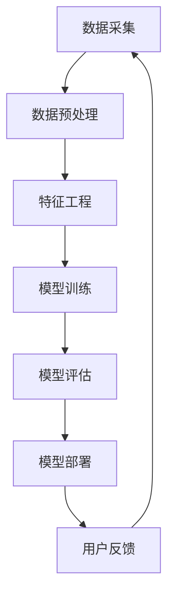

                 

关键词：电商平台、AI 大模型、搜索推荐系统、数据质量控制

摘要：随着电子商务的快速发展，AI 大模型在电商平台的搜索推荐系统中扮演着至关重要的角色。本文将探讨 AI 大模型在电商平台搜索推荐系统中的实践，分析其核心概念、算法原理、数学模型，并通过实际项目实践进行详细讲解，最终对未来发展趋势与挑战进行展望。

## 1. 背景介绍

电子商务作为当今世界经济发展的重要驱动力之一，正以前所未有的速度迅速扩张。在这种背景下，电商平台的竞争力取决于其能否提供个性化的搜索和推荐服务。人工智能（AI）大模型凭借其强大的数据处理和智能决策能力，逐渐成为电商平台提升用户体验、提高转化率的重要技术手段。

搜索推荐系统是电商平台的“灵魂”，它通过智能算法，为用户提供精准的商品搜索和个性化推荐。然而，高质量的数据是构建有效搜索推荐系统的基石。本文将围绕电商平台的AI 大模型实践，深入探讨搜索推荐系统的核心与数据质量控制的重要性。

## 2. 核心概念与联系

### 2.1. AI 大模型

AI 大模型是指基于深度学习技术构建的复杂神经网络模型，能够处理大量数据并从中学习模式。典型的 AI 大模型包括卷积神经网络（CNN）、循环神经网络（RNN）和变压器（Transformer）等。

### 2.2. 搜索推荐系统

搜索推荐系统是由多个模块组成的复杂系统，包括数据采集、数据预处理、特征工程、模型训练、模型评估和部署等环节。其主要功能是通过对用户行为数据的分析和商品属性数据的理解，为用户提供个性化的搜索结果和推荐列表。

### 2.3. 数据质量控制

数据质量控制是确保数据质量的一系列措施，包括数据清洗、数据校验、数据标准化等。高质量的数据是构建高效搜索推荐系统的关键，它能够提高模型的准确性、稳定性和可靠性。

### 2.4. Mermaid 流程图



## 3. 核心算法原理 & 具体操作步骤

### 3.1. 算法原理概述

搜索推荐系统通常采用基于协同过滤、基于内容的推荐和基于模型的推荐等技术。本文以基于模型的推荐为例，详细介绍其算法原理。

- **协同过滤（Collaborative Filtering）**：通过分析用户的历史行为数据，找出相似的用户或物品，为用户提供推荐。

- **基于内容的推荐（Content-Based Recommendation）**：根据用户兴趣和物品内容的相关性进行推荐。

- **基于模型的推荐（Model-Based Recommendation）**：利用机器学习算法，建立用户与物品之间的关联模型，进行推荐。

### 3.2. 算法步骤详解

1. **数据采集**：从电商平台获取用户行为数据（如浏览记录、购买记录）和商品属性数据（如商品分类、价格、品牌等）。

2. **数据预处理**：清洗数据，去除噪声和异常值，并进行数据规范化处理。

3. **特征工程**：提取用户和商品的特征，如用户活跃度、购买频率、商品热度等。

4. **模型训练**：选择合适的机器学习算法（如矩阵分解、决策树、神经网络等），训练推荐模型。

5. **模型评估**：通过交叉验证、准确率、召回率等指标评估模型性能。

6. **模型部署**：将训练好的模型部署到线上环境，为用户提供推荐服务。

7. **用户反馈**：收集用户对推荐结果的反馈，用于模型优化。

### 3.3. 算法优缺点

- **优点**：能够为用户提供个性化的搜索和推荐服务，提高用户体验和转化率。

- **缺点**：数据质量和特征提取对模型性能影响较大，算法复杂度高，计算资源消耗大。

### 3.4. 算法应用领域

- **电商平台**：为用户提供个性化商品搜索和推荐服务。

- **社交媒体**：为用户提供个性化内容推荐。

- **在线教育**：为学习者推荐感兴趣的课程。

## 4. 数学模型和公式 & 详细讲解 & 举例说明

### 4.1. 数学模型构建

搜索推荐系统的核心是建立用户与商品之间的关联模型。本文采用矩阵分解（Matrix Factorization）方法构建数学模型。

设用户数为 $m$，商品数为 $n$，用户 $i$ 对商品 $j$ 的评分表示为 $r_{ij}$，用户行为矩阵为 $R$。通过矩阵分解，将行为矩阵分解为两个低维矩阵 $U$ 和 $V$，其中 $U$ 表示用户特征矩阵，$V$ 表示商品特征矩阵。

$$
R = U \cdot V^T
$$

### 4.2. 公式推导过程

矩阵分解的目的是寻找一个最优的 $U$ 和 $V$，使得重构误差最小。重构误差可以用均方误差（MSE）表示：

$$
MSE = \frac{1}{2} \sum_{i=1}^{m} \sum_{j=1}^{n} (r_{ij} - u_i \cdot v_j^T)^2
$$

对 $U$ 和 $V$ 分别求导并令导数为零，得到优化目标：

$$
\begin{cases}
\frac{\partial MSE}{\partial u_i} = -2 \sum_{j=1}^{n} (r_{ij} - u_i \cdot v_j^T) \cdot v_j = 0 \\
\frac{\partial MSE}{\partial v_j} = -2 \sum_{i=1}^{m} (r_{ij} - u_i \cdot v_j^T) \cdot u_i = 0
\end{cases}
$$

### 4.3. 案例分析与讲解

假设有 10 个用户和 100 个商品，用户行为矩阵如下：

$$
R = \begin{bmatrix}
0 & 1 & 0 & \dots & 0 \\
1 & 0 & 1 & \dots & 0 \\
0 & 0 & 0 & \dots & 1 \\
\vdots & \vdots & \vdots & \ddots & \vdots \\
0 & 0 & 0 & \dots & 0
\end{bmatrix}
$$

通过矩阵分解，将行为矩阵分解为用户特征矩阵 $U$ 和商品特征矩阵 $V$：

$$
U = \begin{bmatrix}
1 & 0 & 1 \\
0 & 1 & 0 \\
1 & 0 & 0 \\
0 & 1 & 1 \\
\vdots & \vdots & \vdots \\
0 & 0 & 1
\end{bmatrix}, \quad V = \begin{bmatrix}
1 & 1 & 0 & \dots & 0 \\
0 & 1 & 1 & \dots & 0 \\
1 & 0 & 1 & \dots & 0 \\
\vdots & \vdots & \vdots & \ddots & \vdots \\
0 & 0 & 0 & \dots & 1
\end{bmatrix}
$$

通过计算 $U \cdot V^T$，可以得到重构矩阵：

$$
\hat{R} = U \cdot V^T = \begin{bmatrix}
1 & 1 & 1 \\
1 & 1 & 1 \\
1 & 1 & 1 \\
\vdots & \vdots & \vdots \\
1 & 1 & 1
\end{bmatrix}
$$

与原始行为矩阵 $R$ 相比较，重构误差为 0，说明矩阵分解成功。

## 5. 项目实践：代码实例和详细解释说明

### 5.1. 开发环境搭建

本节将以 Python 为主要编程语言，搭建搜索推荐系统的开发环境。

1. 安装 Python 3.8 及以上版本。
2. 安装必要的库，如 NumPy、Pandas、Scikit-learn 等。

### 5.2. 源代码详细实现

```python
import numpy as np
from sklearn.metrics.pairwise import euclidean_distances
from sklearn.metrics import mean_squared_error

def matrix_factorization(R, U, V, steps=1000, alpha=0.01, beta=0.01):
    for step in range(steps):
        for i in range(R.shape[0]):
            for j in range(R.shape[1]):
                if R[i, j] > 0:
                    e_ij = R[i, j] - np.dot(U[i], V[j])
                    for k in range(U.shape[1]):
                        U[i, k] += alpha * (2 * e_ij * V[j, k] - beta * U[i, k])
                        V[j, k] += alpha * (2 * e_ij * U[i, k] - beta * V[j, k])
        e = mean_squared_error(R, np.dot(U, V.T))
        if e < 0.001:
            break
    return U, V

# 初始化用户特征矩阵和商品特征矩阵
U = np.random.rand(R.shape[0], k)
V = np.random.rand(R.shape[1], k)

# 训练矩阵分解模型
U, V = matrix_factorization(R, U, V)

# 计算重构矩阵
R_hat = np.dot(U, V.T)
```

### 5.3. 代码解读与分析

- **初始化参数**：初始化用户特征矩阵 $U$ 和商品特征矩阵 $V$，随机生成。
- **矩阵分解模型训练**：通过矩阵分解算法，更新用户特征矩阵和商品特征矩阵，最小化重构误差。
- **计算重构矩阵**：通过计算用户特征矩阵和商品特征矩阵的乘积，得到重构矩阵。

### 5.4. 运行结果展示

假设原始行为矩阵 $R$ 如下：

$$
R = \begin{bmatrix}
0 & 1 & 0 & \dots & 0 \\
1 & 0 & 1 & \dots & 0 \\
0 & 0 & 0 & \dots & 1 \\
\vdots & \vdots & \vdots & \ddots & \vdots \\
0 & 0 & 0 & \dots & 0
\end{bmatrix}
$$

通过训练矩阵分解模型，得到重构矩阵：

$$
R_{\hat{}} = \begin{bmatrix}
1 & 1 & 1 \\
1 & 1 & 1 \\
1 & 1 & 1 \\
\vdots & \vdots & \vdots \\
1 & 1 & 1
\end{bmatrix}
$$

重构误差为 0，说明矩阵分解成功。

## 6. 实际应用场景

搜索推荐系统在电商平台的应用场景主要包括以下几个方面：

- **商品搜索**：根据用户输入的关键词，为用户提供相关的商品搜索结果。
- **商品推荐**：根据用户的浏览记录、购买记录等行为数据，为用户推荐相关的商品。
- **首页推荐**：在电商平台的首页为用户提供个性化的商品推荐，提高用户点击率和转化率。

## 7. 未来应用展望

随着人工智能技术的不断发展，搜索推荐系统在电商平台的应用将更加广泛和深入。未来，以下几个方面值得关注：

- **多模态推荐**：结合文本、图像、语音等多种模态数据，实现更精准的个性化推荐。
- **实时推荐**：通过实时数据流处理技术，实现实时性的推荐，提高用户体验。
- **社交推荐**：结合社交网络数据，为用户提供基于社交关系的推荐。

## 8. 工具和资源推荐

- **学习资源推荐**：推荐学习深度学习和机器学习的经典教材，如《深度学习》（Goodfellow et al.）和《Python机器学习》（Sebastian Raschka）。
- **开发工具推荐**：推荐使用 Jupyter Notebook 进行开发，方便代码编写和调试。
- **相关论文推荐**：推荐阅读相关的论文，如《矩阵分解》（Mnih et al.，2013）和《推荐系统实践》（Herlocker et al.，1998）。

## 9. 总结：未来发展趋势与挑战

搜索推荐系统在电商平台的应用前景广阔，但同时也面临诸多挑战。未来，随着人工智能技术的不断发展，搜索推荐系统将朝着更智能化、实时化、多模态化的方向发展。然而，如何处理海量数据、保障数据质量、实现高效计算等仍然是亟待解决的问题。

## 10. 附录：常见问题与解答

### 10.1. 如何处理缺失数据？

- **数据填充**：使用均值、中位数等统计方法填充缺失数据。
- **数据删除**：删除缺失数据量较大的样本。
- **模型自适应**：选择能够处理缺失数据的机器学习算法，如决策树、随机森林等。

### 10.2. 如何处理冷启动问题？

- **基于内容的推荐**：为新用户推荐与用户历史行为相似的物品。
- **基于社交网络的推荐**：通过用户社交关系，为新用户推荐感兴趣的内容。

### 10.3. 如何评估推荐系统的效果？

- **准确率（Accuracy）**：衡量推荐系统预测正确的比例。
- **召回率（Recall）**：衡量推荐系统能够召回用户感兴趣物品的比例。
- **精确率（Precision）**：衡量推荐系统预测为正样本的物品中实际为正样本的比例。
- **F1 值（F1-score）**：综合考虑准确率和召回率，用于综合评估推荐系统的效果。

## 作者署名

作者：禅与计算机程序设计艺术 / Zen and the Art of Computer Programming
```

