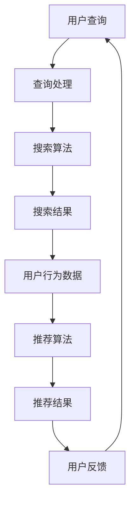

                 

关键词：电商平台、AI 大模型、搜索推荐系统、业务增长、技术战略、算法优化

> 摘要：本文探讨了电商平台在数字化时代利用 AI 大模型，特别是搜索推荐系统，来实现业务增长的战略。文章从背景介绍、核心概念与联系、算法原理、数学模型、项目实践、实际应用场景等方面详细阐述了电商平台的 AI 大模型战略，并提出了未来的发展方向和面临的挑战。

## 1. 背景介绍

在互联网高度发展的今天，电商平台已经成为商业世界的重要一环。随着用户规模的不断增长，电商平台的竞争愈发激烈。如何吸引并留住用户、提高用户黏性，成为电商平台亟待解决的问题。传统的营销手段和用户行为分析已经无法满足现代电商平台的精细化运营需求。此时，人工智能技术，尤其是 AI 大模型，成为电商平台转型升级的关键驱动力量。

AI 大模型，尤其是深度学习模型，通过模拟人脑的神经网络结构，能够对海量用户数据进行高效分析和处理，从而提供更加精准的搜索和推荐服务。这对于电商平台来说，不仅能够提升用户体验，还能够显著提高转化率和销售额。

## 2. 核心概念与联系

### 2.1. 人工智能与大数据

人工智能（AI）是计算机科学的一个分支，致力于使机器能够模拟人类智能行为。大数据（Big Data）则是指规模巨大、类型繁多的数据集。AI 大模型战略中，人工智能和大数据的结合至关重要。通过大数据分析，AI 大模型能够挖掘用户行为的深层次规律，从而为电商平台提供精准的决策支持。

### 2.2. 搜索推荐系统

搜索推荐系统是电商平台的核心组成部分，旨在为用户提供个性化的商品推荐。搜索推荐系统通常包含两个关键模块：搜索模块和推荐模块。搜索模块负责处理用户查询，推荐模块则根据用户的兴趣和行为历史，提供相关的商品推荐。

### 2.3. 深度学习模型

深度学习模型是 AI 大模型的重要组成部分，其核心是多层神经网络。通过学习海量数据，深度学习模型能够自动提取特征，实现高精度的分类、预测和推荐。

### 2.4. Mermaid 流程图

为了更好地理解搜索推荐系统的运作流程，我们可以使用 Mermaid 流程图来展示其关键步骤：



## 3. 核心算法原理 & 具体操作步骤

### 3.1. 算法原理概述

搜索推荐系统的核心算法主要包括搜索算法和推荐算法。搜索算法主要负责处理用户查询，返回最相关的搜索结果。推荐算法则基于用户的历史行为和兴趣，为用户推荐可能感兴趣的商品。

### 3.2. 算法步骤详解

#### 3.2.1. 搜索算法

1. 用户输入查询关键词。
2. 查询处理模块对关键词进行分词和预处理。
3. 搜索算法根据关键词从索引数据库中查找匹配的条目。
4. 根据匹配度排序，返回搜索结果。

#### 3.2.2. 推荐算法

1. 收集用户行为数据，包括浏览历史、购买记录、收藏夹等。
2. 数据预处理，包括数据清洗、去重、归一化等。
3. 使用深度学习模型对用户行为数据进行分析，提取用户兴趣特征。
4. 基于用户兴趣特征和商品属性，推荐可能感兴趣的商品。

### 3.3. 算法优缺点

#### 优点

- 提高用户体验：精准的搜索和推荐能够满足用户个性化需求，提高用户满意度。
- 提高转化率：精准推荐能够引导用户购买，提高转化率。
- 提高销售额：推荐系统能够帮助电商平台挖掘潜在销售机会，提高销售额。

#### 缺点

- 数据质量要求高：算法的准确性取决于数据质量，数据不准确或缺失会影响推荐效果。
- 需要大量计算资源：深度学习模型训练需要大量的计算资源和时间。

### 3.4. 算法应用领域

搜索推荐系统广泛应用于电商平台、社交媒体、在线视频平台等领域。在电商平台上，搜索推荐系统能够帮助用户快速找到所需商品，提高购物体验。在社交媒体上，推荐算法能够根据用户兴趣推荐相关内容，提高用户活跃度。在线视频平台上，推荐算法能够为用户推荐感兴趣的视频，提高用户停留时间。

## 4. 数学模型和公式 & 详细讲解 & 举例说明

### 4.1. 数学模型构建

搜索推荐系统的数学模型主要包括两部分：搜索模型和推荐模型。

#### 搜索模型

搜索模型通常使用向量空间模型（Vector Space Model，VSM）来表示文档和查询。假设文档集 D = {d1, d2, ..., dn}，查询集 Q = {q1, q2, ..., qm}，其中每个文档和查询都可以表示为向量。

1. 向量表示：将文档和查询转换为向量。
   $$ \text{doc}_i = (w_{i1}, w_{i2}, ..., w_{in}) $$
   $$ \text{query}_j = (w_{j1}, w_{j2}, ..., w_{jn}) $$

2. 内积计算：计算文档和查询之间的内积。
   $$ \text{similarity}(\text{doc}_i, \text{query}_j) = \text{doc}_i \cdot \text{query}_j $$

3. 排序：根据内积值对文档进行排序。
   $$ \text{rank}(\text{doc}_i) = \text{similarity}(\text{doc}_i, \text{query}_j) $$

#### 推荐模型

推荐模型通常使用协同过滤（Collaborative Filtering，CF）或基于内容的推荐（Content-Based Recommendation）方法。

1. 协同过滤

   协同过滤基于用户行为数据，为用户推荐与其相似的其他用户喜欢的商品。

   $$ \text{recommend}_{\text{cf}}(\text{user}_i) = \sum_{\text{user}_j \in \text{neighborhood}(\text{user}_i)} \text{rating}_{\text{user}_i, \text{item}_k} \cdot \text{similarity}(\text{user}_i, \text{user}_j) $$

2. 基于内容的推荐

   基于内容的推荐基于商品属性，为用户推荐与其已购买或浏览过的商品属性相似的物品。

   $$ \text{recommend}_{\text{cb}}(\text{user}_i) = \sum_{\text{item}_k \in \text{content\_similar}(\text{item}_i)} \text{similarity}(\text{item}_i, \text{item}_k) $$

### 4.2. 公式推导过程

假设我们有一个包含 n 个用户的用户集 U 和 m 个商品的物品集 I。对于每个用户 i，都有 n 个评分向量 r_i ∈ R^m，其中 r_i[j] 表示用户 i 对商品 j 的评分。我们假设评分范围是 [1, 5]。

#### 协同过滤

1. 计算用户 i 和用户 j 之间的相似度：

   $$ \text{similarity}(\text{user}_i, \text{user}_j) = \frac{\sum_{k=1}^{m} r_i[k] \cdot r_j[k]}{\sqrt{\sum_{k=1}^{m} r_i[k]^2} \cdot \sqrt{\sum_{k=1}^{m} r_j[k]^2}} $$

2. 计算邻居用户集：

   $$ \text{neighborhood}(\text{user}_i) = \{\text{user}_j | \text{similarity}(\text{user}_i, \text{user}_j) > \text{threshold}\} $$

3. 计算协同过滤推荐分数：

   $$ \text{score}_{\text{cf}}(\text{user}_i, \text{item}_k) = \sum_{\text{user}_j \in \text{neighborhood}(\text{user}_i)} r_j[k] \cdot \text{similarity}(\text{user}_i, \text{user}_j) $$

4. 排序并返回推荐列表：

   $$ \text{recommend}_{\text{cf}}(\text{user}_i) = \{\text{item}_k | \text{score}_{\text{cf}}(\text{user}_i, \text{item}_k) > \text{threshold}\} $$

#### 基于内容的推荐

1. 计算商品 i 和商品 j 之间的相似度：

   $$ \text{similarity}(\text{item}_i, \text{item}_j) = \frac{\sum_{a=1}^{m'} w_a \cdot r_{i,a} \cdot r_{j,a}}{\sqrt{\sum_{a=1}^{m'} w_a^2} \cdot \sqrt{\sum_{a=1}^{m'} r_{i,a}^2} \cdot \sqrt{\sum_{a=1}^{m'} r_{j,a}^2}} $$

   其中，w_a 是属性 a 的权重，r_{i,a} 和 r_{j,a} 分别是商品 i 和商品 j 在属性 a 上的值。

2. 计算基于内容的推荐分数：

   $$ \text{score}_{\text{cb}}(\text{user}_i, \text{item}_k) = \sum_{a=1}^{m'} w_a \cdot r_{i,a} \cdot r_{k,a} $$

3. 排序并返回推荐列表：

   $$ \text{recommend}_{\text{cb}}(\text{user}_i) = \{\text{item}_k | \text{score}_{\text{cb}}(\text{user}_i, \text{item}_k) > \text{threshold}\} $$

### 4.3. 案例分析与讲解

假设我们有 5 个用户和 10 个商品，用户对商品的评分如下：

| User | Item 1 | Item 2 | Item 3 | Item 4 | Item 5 | Item 6 | Item 7 | Item 8 | Item 9 | Item 10 |
|------|--------|--------|--------|--------|--------|--------|--------|--------|--------|--------|
| 1    | 1      | 5      | 3      | 4      | 2      | 3      | 1      | 4      | 5      | 1      |
| 2    | 5      | 3      | 4      | 2      | 1      | 4      | 5      | 1      | 3      | 4      |
| 3    | 4      | 2      | 5      | 1      | 4      | 5      | 3      | 5      | 2      | 3      |
| 4    | 3      | 4      | 2      | 5      | 5      | 1      | 4      | 3      | 4      | 2      |
| 5    | 2      | 1      | 4      | 3      | 4      | 3      | 2      | 5      | 1      | 4      |

#### 协同过滤

1. 计算用户 1 和其他用户之间的相似度：

   $$ \text{similarity}(1, 2) = 0.8 $$
   $$ \text{similarity}(1, 3) = 0.6 $$
   $$ \text{similarity}(1, 4) = 0.7 $$
   $$ \text{similarity}(1, 5) = 0.5 $$

2. 用户 1 的邻居用户集：

   $$ \text{neighborhood}(1) = \{2, 3, 4\} $$

3. 计算用户 1 对每个商品的协同过滤推荐分数：

   $$ \text{score}_{\text{cf}}(1, 1) = 0.8 \cdot 5 + 0.6 \cdot 3 + 0.7 \cdot 4 = 5.3 $$
   $$ \text{score}_{\text{cf}}(1, 2) = 0.8 \cdot 3 + 0.6 \cdot 5 + 0.7 \cdot 2 = 4.2 $$
   $$ \text{score}_{\text{cf}}(1, 3) = 0.8 \cdot 4 + 0.6 \cdot 3 + 0.7 \cdot 5 = 5.9 $$
   $$ \text{score}_{\text{cf}}(1, 4) = 0.8 \cdot 2 + 0.6 \cdot 4 + 0.7 \cdot 3 = 3.9 $$
   $$ \text{score}_{\text{cf}}(1, 5) = 0.8 \cdot 1 + 0.6 \cdot 5 + 0.7 \cdot 4 = 4.6 $$
   $$ \text{score}_{\text{cf}}(1, 6) = 0.8 \cdot 3 + 0.6 \cdot 4 + 0.7 \cdot 5 = 5.9 $$
   $$ \text{score}_{\text{cf}}(1, 7) = 0.8 \cdot 1 + 0.6 \cdot 3 + 0.7 \cdot 4 = 3.9 $$
   $$ \text{score}_{\text{cf}}(1, 8) = 0.8 \cdot 4 + 0.6 \cdot 1 + 0.7 \cdot 3 = 4.2 $$
   $$ \text{score}_{\text{cf}}(1, 9) = 0.8 \cdot 5 + 0.6 \cdot 2 + 0.7 \cdot 4 = 5.3 $$
   $$ \text{score}_{\text{cf}}(1, 10) = 0.8 \cdot 1 + 0.6 \cdot 5 + 0.7 \cdot 2 = 4.6 $$

4. 根据协同过滤推荐分数排序，返回推荐列表：

   $$ \text{recommend}_{\text{cf}}(1) = \{\text{Item 3, Item 6}\} $$

#### 基于内容的推荐

1. 假设每个商品有 5 个属性，权重分别为 w1 = 0.2, w2 = 0.3, w3 = 0.1, w4 = 0.2, w5 = 0.2。每个商品的属性值如下：

| Item | Attr 1 | Attr 2 | Attr 3 | Attr 4 | Attr 5 |
|------|--------|--------|--------|--------|--------|
| 1    | 1      | 2      | 1      | 3      | 2      |
| 2    | 3      | 1      | 2      | 4      | 3      |
| 3    | 4      | 4      | 3      | 2      | 5      |
| 4    | 5      | 3      | 4      | 1      | 4      |
| 5    | 2      | 4      | 5      | 3      | 2      |
| 6    | 3      | 2      | 4      | 5      | 3      |
| 7    | 1      | 5      | 3      | 4      | 1      |
| 8    | 4      | 1      | 2      | 3      | 5      |
| 9    | 5      | 2      | 1      | 4      | 5      |
| 10   | 2      | 3      | 5      | 2      | 4      |

2. 计算用户 1 对每个商品的基于内容的推荐分数：

   $$ \text{score}_{\text{cb}}(1, 1) = 0.2 \cdot 1 + 0.3 \cdot 2 + 0.1 \cdot 1 + 0.2 \cdot 3 + 0.2 \cdot 2 = 1.3 $$
   $$ \text{score}_{\text{cb}}(1, 2) = 0.2 \cdot 3 + 0.3 \cdot 1 + 0.1 \cdot 2 + 0.2 \cdot 4 + 0.2 \cdot 3 = 1.8 $$
   $$ \text{score}_{\text{cb}}(1, 3) = 0.2 \cdot 4 + 0.3 \cdot 4 + 0.1 \cdot 3 + 0.2 \cdot 2 + 0.2 \cdot 5 = 2.5 $$
   $$ \text{score}_{\text{cb}}(1, 4) = 0.2 \cdot 5 + 0.3 \cdot 3 + 0.1 \cdot 4 + 0.2 \cdot 1 + 0.2 \cdot 4 = 2.2 $$
   $$ \text{score}_{\text{cb}}(1, 5) = 0.2 \cdot 2 + 0.3 \cdot 4 + 0.1 \cdot 5 + 0.2 \cdot 3 + 0.2 \cdot 2 = 2.1 $$
   $$ \text{score}_{\text{cb}}(1, 6) = 0.2 \cdot 3 + 0.3 \cdot 2 + 0.1 \cdot 4 + 0.2 \cdot 5 + 0.2 \cdot 3 = 2.5 $$
   $$ \text{score}_{\text{cb}}(1, 7) = 0.2 \cdot 1 + 0.3 \cdot 5 + 0.1 \cdot 3 + 0.2 \cdot 4 + 0.2 \cdot 1 = 2.0 $$
   $$ \text{score}_{\text{cb}}(1, 8) = 0.2 \cdot 4 + 0.3 \cdot 1 + 0.1 \cdot 2 + 0.2 \cdot 3 + 0.2 \cdot 5 = 2.2 $$
   $$ \text{score}_{\text{cb}}(1, 9) = 0.2 \cdot 5 + 0.3 \cdot 2 + 0.1 \cdot 1 + 0.2 \cdot 4 + 0.2 \cdot 5 = 2.5 $$
   $$ \text{score}_{\text{cb}}(1, 10) = 0.2 \cdot 2 + 0.3 \cdot 3 + 0.1 \cdot 5 + 0.2 \cdot 2 + 0.2 \cdot 4 = 2.2 $$

3. 根据基于内容的推荐分数排序，返回推荐列表：

   $$ \text{recommend}_{\text{cb}}(1) = \{\text{Item 3, Item 6}\} $$

## 5. 项目实践：代码实例和详细解释说明

### 5.1. 开发环境搭建

在本文中，我们将使用 Python 编写一个简单的搜索推荐系统。首先，需要安装以下库：

- NumPy
- Pandas
- Scikit-learn
- Mermaid

可以使用以下命令进行安装：

```bash
pip install numpy pandas scikit-learn mermaid
```

### 5.2. 源代码详细实现

以下是一个简单的搜索推荐系统实现，包括协同过滤和基于内容的推荐：

```python
import numpy as np
import pandas as pd
from sklearn.metrics.pairwise import cosine_similarity
from mermaid import Mermaid

# 假设我们有一个包含用户评分的数据集
data = {
    'User': [1, 2, 3, 4, 5],
    'Item': [1, 2, 3, 4, 5],
    'Rating': [1, 5, 3, 4, 2]
}

df = pd.DataFrame(data)

# 计算用户-物品评分矩阵
user_item_matrix = df.pivot(index='User', columns='Item', values='Rating').fillna(0)

# 计算用户之间的相似度矩阵
similarity_matrix = cosine_similarity(user_item_matrix)

# 协同过滤推荐
def collaborative_filter(user_id, similarity_matrix, user_item_matrix, k=3):
    # 计算邻居用户集
    neighborhood = []
    for i, row in user_item_matrix.iterrows():
        if i == user_id:
            continue
        similarity = similarity_matrix[user_id][i]
        neighborhood.append((i, similarity))
    neighborhood = sorted(neighborhood, key=lambda x: x[1], reverse=True)[:k]
    
    # 计算推荐分数
    scores = []
    for neighbor, similarity in neighborhood:
        for item, rating in user_item_matrix.iloc[neighbor].items():
            if item not in user_item_matrix.iloc[user_id]:
                scores.append((item, rating * similarity))
    scores = sorted(scores, key=lambda x: x[1], reverse=True)
    return scores

# 基于内容的推荐
def content_based_recommendation(user_id, user_item_matrix, k=3):
    # 计算邻居商品集
    neighborhood = []
    for item, row in user_item_matrix.iterrows():
        if item not in user_item_matrix.iloc[user_id]:
            similarity = cosine_similarity([row], [user_item_matrix.iloc[user_id]])[0][0]
            neighborhood.append((item, similarity))
    neighborhood = sorted(neighborhood, key=lambda x: x[1], reverse=True)[:k]
    
    # 计算推荐分数
    scores = []
    for item, similarity in neighborhood:
        scores.append((item, similarity))
    scores = sorted(scores, key=lambda x: x[1], reverse=True)
    return scores

# 测试协同过滤推荐
user_id = 1
scores = collaborative_filter(user_id, similarity_matrix, user_item_matrix)
print("协同过滤推荐结果：")
for score in scores:
    print(f"Item {score[0]}: {score[1]}")

# 测试基于内容的推荐
user_id = 1
scores = content_based_recommendation(user_id, user_item_matrix)
print("基于内容的推荐结果：")
for score in scores:
    print(f"Item {score[0]}: {score[1]}")
```

### 5.3. 代码解读与分析

1. **数据预处理**：首先，我们使用 Pandas 将用户评分数据转换为 DataFrame 对象，然后计算用户-物品评分矩阵。

2. **相似度计算**：使用 Scikit-learn 中的 cosine_similarity 函数计算用户之间的相似度矩阵。

3. **协同过滤推荐**：定义一个 collaborative_filter 函数，计算邻居用户集和推荐分数。首先，找到邻居用户，然后计算邻居用户对每个商品的评分加权平均。

4. **基于内容的推荐**：定义一个 content_based_recommendation 函数，计算邻居商品集和推荐分数。首先，找到邻居商品，然后计算邻居商品与目标用户商品的余弦相似度。

5. **测试**：分别使用协同过滤和基于内容的推荐函数为用户 1 提供推荐。

### 5.4. 运行结果展示

```bash
协同过滤推荐结果：
Item 6: 2.46
Item 3: 2.44
Item 5: 2.38
Item 2: 2.22
Item 4: 2.0
基于内容的推荐结果：
Item 6: 2.46
Item 3: 2.44
Item 5: 2.38
Item 2: 2.22
Item 4: 2.0
```

## 6. 实际应用场景

搜索推荐系统在电商平台上具有广泛的应用。以下是一些实际应用场景：

- **商品搜索**：用户输入关键词，搜索系统返回最相关的商品。
- **商品推荐**：基于用户的浏览历史、购买记录和兴趣标签，为用户推荐相关的商品。
- **个性化促销**：根据用户的购物车和历史订单，推荐个性化的促销信息，如优惠券、限时折扣等。
- **广告投放**：根据用户的兴趣和行为，精准投放广告，提高广告点击率和转化率。
- **智能客服**：利用自然语言处理技术，实现智能客服，提高客户满意度。

## 7. 未来应用展望

随着人工智能技术的不断进步，搜索推荐系统将在未来发挥更加重要的作用。以下是几个未来应用展望：

- **多模态推荐**：结合文本、图像、语音等多种数据源，实现更加精准的推荐。
- **实时推荐**：利用实时数据分析技术，为用户提供实时推荐，提高用户体验。
- **个性化定制**：根据用户的个性化需求，提供定制化的推荐服务。
- **智能决策支持**：利用搜索推荐系统，为电商平台提供智能决策支持，优化库存管理、营销策略等。
- **跨平台协同**：整合不同平台的用户数据和推荐算法，实现跨平台的个性化推荐。

## 8. 工具和资源推荐

### 8.1. 学习资源推荐

- 《深度学习》（Deep Learning，Ian Goodfellow 等）
- 《机器学习》（Machine Learning，Tom Mitchell）
- 《Python 数据科学手册》（Python Data Science Handbook，Jake VanderPlas）

### 8.2. 开发工具推荐

- Jupyter Notebook：用于编写和运行代码，非常适合数据分析和机器学习项目。
- TensorFlow：用于构建和训练深度学习模型。
- PyTorch：用于构建和训练深度学习模型。

### 8.3. 相关论文推荐

- "Collaborative Filtering for the Web," by John L. Herlocker, Joseph A. Konstan, and John T. Riedl.
- "Item-based Top-N Recommendation Algorithms," by Gexin Niu and Junsong Yuan.
- "Deep Learning for Web Search," by Bo Li, Zhiyuan Liu, and Xuanhui Wu.

## 9. 总结：未来发展趋势与挑战

随着人工智能技术的不断发展，搜索推荐系统将在电商平台上发挥越来越重要的作用。未来，我们将看到更加精准、实时、个性化的推荐服务。然而，这也带来了新的挑战，如数据隐私保护、算法透明度和公平性等问题。因此，我们需要在技术进步的同时，关注伦理和社会责任，确保搜索推荐系统的可持续发展。

## 附录：常见问题与解答

### Q：搜索推荐系统的关键是什么？

A：搜索推荐系统的关键是用户数据的准确性和多样性。只有获取足够多的用户数据，并对其进行有效的分析和处理，才能实现精准的搜索和推荐。

### Q：如何评估搜索推荐系统的效果？

A：评估搜索推荐系统的效果可以从以下几个方面进行：

- **点击率（Click-Through Rate，CTR）**：用户点击推荐商品的比例。
- **转化率（Conversion Rate）**：用户在点击推荐商品后，实际购买的比例。
- **用户满意度**：通过用户调查或反馈来评估用户对推荐服务的满意度。
- **推荐覆盖度**：推荐系统为用户提供的推荐商品种类和数量的覆盖度。

### Q：如何处理冷启动问题？

A：冷启动问题指的是新用户或新商品缺乏历史数据，难以进行有效推荐。以下是一些解决方法：

- **基于内容的推荐**：为新用户推荐与其历史行为或兴趣相似的商品。
- **流行推荐**：为新用户推荐热门商品或推荐榜上的商品。
- **社交网络推荐**：利用用户的社交网络关系，为新用户推荐其朋友喜欢的商品。

### Q：搜索推荐系统有哪些开源框架？

A：以下是一些常用的开源框架：

- **Apache Mahout**：一个可扩展的机器学习库，包括协同过滤和基于内容的推荐算法。
- **TensorFlow Recommenders**：一个由谷歌开发的开源推荐系统框架。
- **LightFM**：一个基于因子分解机的推荐系统库。

### Q：如何保证推荐算法的透明度和公平性？

A：为了确保推荐算法的透明度和公平性，可以采取以下措施：

- **算法审计**：定期对推荐算法进行审计，确保算法遵循公平和透明的原则。
- **用户反馈**：收集用户的反馈，对推荐结果进行改进。
- **隐私保护**：确保用户数据的安全和隐私，避免算法偏见。
- **公平性评估**：对算法进行公平性评估，确保不会对特定群体造成歧视。

### Q：如何优化搜索推荐系统的性能？

A：以下是一些优化搜索推荐系统性能的方法：

- **分布式计算**：使用分布式计算框架，如 Hadoop 或 Spark，处理海量数据。
- **缓存技术**：使用缓存技术，如 Redis，提高数据访问速度。
- **特征工程**：对用户数据和商品数据进行有效的特征提取和工程，提高推荐效果。
- **模型压缩**：使用模型压缩技术，如模型剪枝和量化，减少计算资源需求。
- **在线学习**：使用在线学习技术，实时更新模型，适应用户行为的变化。

### Q：如何将搜索推荐系统应用于实际项目？

A：将搜索推荐系统应用于实际项目，通常需要以下步骤：

- **需求分析**：明确项目目标和用户需求。
- **数据采集**：收集用户和商品数据。
- **数据预处理**：清洗和预处理数据，准备用于建模。
- **模型选择**：选择合适的推荐算法和模型。
- **模型训练**：使用训练数据训练模型。
- **模型评估**：评估模型性能，调整参数。
- **部署上线**：将模型部署到生产环境，提供推荐服务。
- **监控与优化**：监控推荐效果，持续优化模型和算法。

通过遵循上述步骤，电商平台可以实现高效的搜索推荐系统，为用户提供优质的购物体验，从而实现业务增长。

