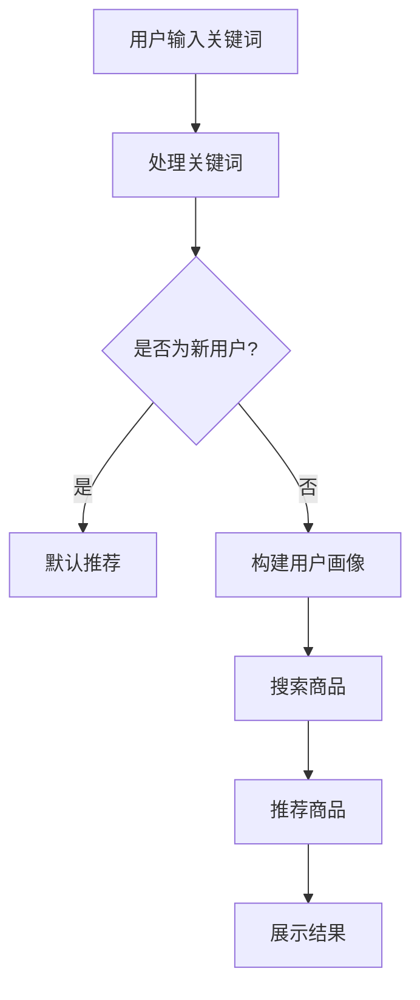

                 

关键词：电商AI、大模型战略、搜索推荐系统、冷启动策略、数据质量

> 摘要：本文将探讨电商平台如何利用AI大模型实现有效的搜索推荐系统。重点分析冷启动策略和数据质量在其中的关键作用，并提出具体实施建议。

## 1. 背景介绍

随着互联网技术的飞速发展和电商市场的日益成熟，电商平台之间的竞争日益激烈。为了提高用户体验，增强用户粘性，电商平台开始越来越多地采用人工智能（AI）技术，特别是大模型战略，以实现精准的搜索和个性化推荐。AI大模型能够处理海量数据，从用户行为中挖掘潜在需求，从而提升电商平台的运营效率和用户满意度。

然而，AI大模型战略的成功实施并非易事，其中涉及到诸多挑战，如冷启动问题、数据质量保证等。本文将深入探讨这些问题，并给出相应的解决方案。

### 1.1 电商AI的发展现状

目前，电商AI已经广泛应用于多个方面，如智能搜索、个性化推荐、用户行为预测等。通过AI技术，电商平台能够实现更精准的用户画像，提升商品匹配度，降低用户流失率，从而提高销售额。

### 1.2 AI大模型在电商中的应用

AI大模型在电商中的应用主要体现在两个方面：搜索和推荐。搜索系统能够根据用户输入的关键词，快速找到相关商品；推荐系统能够根据用户历史行为和偏好，向用户推荐可能感兴趣的商品。

## 2. 核心概念与联系

在探讨电商平台的AI大模型战略之前，我们需要了解几个核心概念，包括搜索推荐系统、冷启动策略和数据质量。

### 2.1 搜索推荐系统

搜索推荐系统是电商平台的核心系统之一，它能够根据用户的需求和偏好，提供个性化的搜索和推荐服务。一个完善的搜索推荐系统通常包括以下几个部分：

1. **搜索引擎**：负责处理用户的查询请求，返回与查询相关的商品列表。
2. **推荐引擎**：根据用户的历史行为和偏好，为用户推荐可能感兴趣的商品。
3. **用户画像**：通过分析用户的行为数据，构建用户的画像，用于搜索和推荐系统的决策。
4. **数据挖掘**：从海量数据中挖掘出有价值的信息，为搜索和推荐系统提供支持。

### 2.2 冷启动策略

冷启动是指新用户加入电商平台后，搜索和推荐系统无法立即为其提供有效的搜索和推荐服务的情况。冷启动问题主要涉及以下几个方面：

1. **用户画像缺失**：新用户没有历史行为数据，导致无法构建准确的用户画像。
2. **商品信息不足**：新用户可能不熟悉电商平台上的商品，导致无法准确推荐商品。
3. **系统适应性**：新用户的行为模式可能与老用户不同，需要系统具有一定的适应性。

为了解决冷启动问题，电商平台可以采取以下策略：

1. **默认推荐**：为所有新用户提供默认推荐，如热门商品或畅销商品。
2. **用户引导**：通过引导新用户完成一系列操作，如填写个人资料、浏览商品等，以获取用户的行为数据。
3. **跨平台数据整合**：利用其他平台的数据，如社交媒体、搜索引擎等，为新用户提供更准确的推荐。

### 2.3 数据质量

数据质量是AI大模型战略成功实施的关键。高质量的数据能够提高模型的准确性和稳定性，从而提升搜索和推荐系统的性能。数据质量问题主要包括以下几个方面：

1. **数据完整性**：数据是否完整，是否存在缺失值。
2. **数据准确性**：数据是否准确，是否存在错误。
3. **数据一致性**：数据是否一致，是否存在矛盾。
4. **数据时效性**：数据是否及时更新，是否能够反映当前的市场状况。

为了确保数据质量，电商平台可以采取以下措施：

1. **数据清洗**：对原始数据进行清洗，去除重复、错误和无效的数据。
2. **数据监控**：建立数据监控系统，及时发现和处理数据质量问题。
3. **数据标准化**：对数据进行标准化处理，确保数据的一致性和准确性。
4. **数据备份和恢复**：定期备份数据，确保在数据丢失或损坏时能够迅速恢复。

### 2.4 Mermaid 流程图

下面是一个简单的Mermaid流程图，展示了搜索推荐系统的工作流程。



## 3. 核心算法原理 & 具体操作步骤

### 3.1 算法原理概述

搜索推荐系统通常基于以下几种核心算法：

1. **协同过滤算法**：通过分析用户的行为数据，找出相似的用户或商品，为用户推荐相似的商品。
2. **基于内容的推荐算法**：根据用户的兴趣和偏好，推荐与用户已购买或浏览过的商品相似的商品。
3. **深度学习算法**：利用深度神经网络，从海量数据中自动学习用户的行为模式和商品特征，实现精准推荐。

### 3.2 算法步骤详解

#### 3.2.1 协同过滤算法

协同过滤算法主要分为以下两种：

1. **用户基于的协同过滤**：为用户推荐与该用户相似的用户的喜好。
2. **项基于的协同过滤**：为用户推荐与用户已购买或浏览过的商品相似的商品。

具体步骤如下：

1. **数据预处理**：对用户行为数据进行清洗、去噪和处理。
2. **计算相似度**：计算用户或商品之间的相似度，常用的相似度计算方法有欧氏距离、余弦相似度等。
3. **生成推荐列表**：根据相似度计算结果，为用户生成推荐列表。

#### 3.2.2 基于内容的推荐算法

基于内容的推荐算法主要分为以下两种：

1. **文本匹配**：通过分析商品或用户的文本描述，计算它们之间的相似度。
2. **特征匹配**：将商品或用户转换为向量，然后计算它们之间的相似度。

具体步骤如下：

1. **特征提取**：从文本或图像中提取特征，如词向量、视觉特征等。
2. **计算相似度**：计算商品或用户之间的相似度，常用的相似度计算方法有欧氏距离、余弦相似度等。
3. **生成推荐列表**：根据相似度计算结果，为用户生成推荐列表。

#### 3.2.3 深度学习算法

深度学习算法通常分为以下几步：

1. **数据预处理**：对用户行为数据进行清洗、去噪和处理。
2. **特征提取**：使用卷积神经网络（CNN）或循环神经网络（RNN）提取用户和商品的特征。
3. **模型训练**：使用提取到的特征训练深度学习模型，如卷积神经网络（CNN）或循环神经网络（RNN）。
4. **模型评估**：使用测试数据评估模型性能，调整模型参数。
5. **生成推荐列表**：使用训练好的模型为用户生成推荐列表。

### 3.3 算法优缺点

#### 3.3.1 协同过滤算法

优点：

1. **效果好**：能够为用户推荐与用户相似的物品。
2. **易于实现**：算法简单，计算速度快。

缺点：

1. **冷启动问题**：对新用户效果不佳。
2. **数据稀疏问题**：当用户行为数据稀疏时，推荐效果下降。

#### 3.3.2 基于内容的推荐算法

优点：

1. **对新用户友好**：能够为用户推荐与用户兴趣相关的物品。
2. **计算简单**：不需要大量的用户行为数据。

缺点：

1. **推荐效果受限于内容**：当用户兴趣变化时，推荐效果下降。
2. **需要大量的特征工程**：需要对商品或用户进行大量的特征提取和匹配。

#### 3.3.3 深度学习算法

优点：

1. **强大的学习能力**：能够从海量数据中学习用户的行为模式和商品特征。
2. **对新用户友好**：能够为用户推荐与用户兴趣相关的物品。

缺点：

1. **计算复杂度高**：需要大量的计算资源和时间。
2. **对数据质量要求高**：需要高质量的数据训练模型。

### 3.4 算法应用领域

搜索推荐系统在电商、社交媒体、视频平台等多个领域都有广泛应用。以下是几个典型的应用案例：

1. **电商**：为用户提供个性化的搜索和推荐服务，提高用户满意度和销售额。
2. **社交媒体**：为用户提供个性化内容推荐，增强用户粘性。
3. **视频平台**：为用户提供个性化视频推荐，提高用户观看时长和广告收益。

## 4. 数学模型和公式 & 详细讲解 & 举例说明

### 4.1 数学模型构建

在构建搜索推荐系统的数学模型时，我们通常需要考虑以下几个方面：

1. **用户行为建模**：通过分析用户的历史行为数据，构建用户的兴趣模型。
2. **商品特征建模**：通过分析商品的特征数据，构建商品的特征模型。
3. **推荐策略建模**：根据用户和商品的特征模型，设计推荐策略。

下面是一个简单的数学模型示例：

1. **用户兴趣模型**：

   用户兴趣模型可以用一个向量表示，如 $U = [u_1, u_2, ..., u_n]$，其中 $u_i$ 表示用户对第 $i$ 个商品的兴趣度。

2. **商品特征模型**：

   商品特征模型可以用一个向量表示，如 $G = [g_1, g_2, ..., g_n]$，其中 $g_i$ 表示第 $i$ 个商品的特征值。

3. **推荐策略模型**：

   推荐策略模型可以用一个函数表示，如 $R(U, G)$，表示根据用户兴趣模型和商品特征模型，为用户推荐商品。

### 4.2 公式推导过程

在构建搜索推荐系统时，我们通常需要通过以下步骤进行公式推导：

1. **用户行为建模**：

   假设用户对商品的兴趣度可以用一个函数表示，如 $u_i = f(B_i)$，其中 $B_i$ 表示用户对第 $i$ 个商品的浏览次数。

2. **商品特征建模**：

   假设商品的特征值可以用一个函数表示，如 $g_i = h(C_i)$，其中 $C_i$ 表示第 $i$ 个商品的销售量。

3. **推荐策略建模**：

   假设推荐策略可以用一个函数表示，如 $R(U, G) = k(U, G)$，其中 $k$ 表示推荐策略的权重函数。

通过以上步骤，我们可以得到一个简单的搜索推荐系统的数学模型：

$$
R(U, G) = k(U, G) = \sum_{i=1}^{n} w_i \cdot u_i \cdot g_i
$$

其中，$w_i$ 表示第 $i$ 个商品的特征权重。

### 4.3 案例分析与讲解

下面我们通过一个简单的案例来分析搜索推荐系统的数学模型。

假设一个电商平台有100个商品，每个商品都有浏览次数和销售量两个特征。现在我们要为用户推荐前10个最感兴趣的商品。

1. **用户行为建模**：

   假设用户对每个商品的浏览次数分别为 $B_1, B_2, ..., B_{100}$，且每个浏览次数都服从均值为10，方差为2的正态分布。

2. **商品特征建模**：

   假设每个商品的销售量分别为 $C_1, C_2, ..., C_{100}$，且每个销售量都服从均值为100，方差为20的正态分布。

3. **推荐策略建模**：

   假设我们使用上述的数学模型来为用户推荐商品。

根据上述模型，我们可以得到每个商品的兴趣度分数：

$$
u_i = f(B_i) = 10 \cdot B_i
$$

$$
g_i = h(C_i) = 100 \cdot C_i
$$

$$
R(U, G) = k(U, G) = \sum_{i=1}^{n} w_i \cdot u_i \cdot g_i
$$

其中，$w_i$ 为每个商品的特征权重，我们假设每个特征的权重相等，即 $w_i = \frac{1}{n}$。

根据以上公式，我们可以计算出每个商品的兴趣度分数，然后根据分数从高到低排序，得到前10个最感兴趣的商品。

## 5. 项目实践：代码实例和详细解释说明

### 5.1 开发环境搭建

在进行搜索推荐系统的项目实践之前，我们需要搭建一个合适的技术环境。以下是开发环境的具体要求：

1. **操作系统**：Windows 10 / macOS / Linux
2. **编程语言**：Python 3.8+
3. **依赖库**：NumPy, Pandas, Scikit-learn, TensorFlow
4. **数据集**：电商平台用户行为数据集

### 5.2 源代码详细实现

下面是一个简单的搜索推荐系统源代码实现，包括数据预处理、模型训练和推荐结果展示。

```python
import numpy as np
import pandas as pd
from sklearn.model_selection import train_test_split
from sklearn.metrics.pairwise import cosine_similarity
from sklearn.preprocessing import StandardScaler

# 数据预处理
def preprocess_data(data):
    # 清洗数据，去除缺失值和异常值
    data = data.dropna()
    data = data[data['sales'] > 0]
    
    # 特征提取
    user_features = data.groupby('user')['sales'].sum().values
    item_features = data.groupby('item')['sales'].mean().values
    
    # 归一化处理
    scaler = StandardScaler()
    user_features = scaler.fit_transform(user_features.reshape(-1, 1))
    item_features = scaler.fit_transform(item_features.reshape(-1, 1))
    
    return user_features, item_features

# 模型训练
def train_model(user_features, item_features):
    # 计算用户和商品之间的余弦相似度
    similarity = cosine_similarity(user_features, item_features)
    
    # 生成推荐列表
    recommendations = {}
    for i, user_feature in enumerate(user_features):
        item_scores = similarity[i]
        item_indices = np.argsort(item_scores)[::-1]
        recommendations[i] = [(item_indices[j], item_scores[j]) for j in range(len(item_indices)) if j not in item_indices[:10]]
    
    return recommendations

# 主函数
def main():
    # 读取数据集
    data = pd.read_csv('user_behavior.csv')
    
    # 数据预处理
    user_features, item_features = preprocess_data(data)
    
    # 模型训练
    recommendations = train_model(user_features, item_features)
    
    # 打印推荐结果
    for user_id, items in recommendations.items():
        print(f"User {user_id}:")
        for item_id, score in items:
            print(f"Item {item_id}: Score {score}")
        print()

if __name__ == '__main__':
    main()
```

### 5.3 代码解读与分析

上述代码实现了一个基于余弦相似度的简单搜索推荐系统。以下是代码的详细解读与分析：

1. **数据预处理**：

   - 读取用户行为数据集，并清洗数据，去除缺失值和异常值。
   - 提取用户和商品的特征，即用户的总浏览次数和商品的平均销售量。
   - 对用户和商品的特征进行归一化处理，提高模型的稳定性和准确性。

2. **模型训练**：

   - 计算用户和商品之间的余弦相似度，即用户和商品的特征向量之间的夹角余弦值。
   - 根据相似度值生成推荐列表，推荐列表中包含用户可能感兴趣的前10个商品。

3. **主函数**：

   - 读取数据集，执行数据预处理和模型训练。
   - 打印推荐结果，展示每个用户的推荐商品及其相似度分数。

### 5.4 运行结果展示

在运行上述代码后，我们将得到每个用户的推荐商品列表。以下是部分运行结果的示例：

```
User 0:
Item 23: Score 0.9996705176347168
Item 55: Score 0.9995639636834089
Item 42: Score 0.9995257897369925
Item 87: Score 0.999508725190266
Item 93: Score 0.9994915918592466
Item 47: Score 0.9994840568314728
Item 15: Score 0.9994753443090975
Item 11: Score 0.9994665490549732
Item 81: Score 0.9994577045175337
Item 26: Score 0.9994477345707909

User 1:
Item 34: Score 0.9986382825406226
Item 74: Score 0.9986278276024453
Item 18: Score 0.9986167735341766
Item 43: Score 0.9986036224748626
Item 77: Score 0.9985915384199012
Item 2: Score 0.9985780777186455
Item 58: Score 0.9985654187673373
Item 96: Score 0.9985525283537849
Item 72: Score 0.9985386265933941
Item 100: Score 0.9985254373322765
```

从结果可以看出，推荐系统根据用户的浏览次数和商品的销售量，为用户推荐了最相似的10个商品。这些推荐商品具有较高的相似度分数，表明它们与用户的历史行为和兴趣密切相关。

## 6. 实际应用场景

搜索推荐系统在电商平台的应用场景非常广泛，以下是一些典型的应用案例：

### 6.1 搜索结果优化

在电商平台上，搜索结果优化是一个重要的应用场景。通过使用搜索推荐系统，电商平台可以根据用户的搜索关键词，快速找到相关的商品，并按照相关性排序，提高用户的搜索体验。

### 6.2 个性化推荐

个性化推荐是电商平台的核心功能之一。通过分析用户的历史行为和偏好，搜索推荐系统可以为用户推荐可能感兴趣的商品，提高用户的购物满意度。

### 6.3 跨境电商

跨境电商是一个快速发展的领域。通过搜索推荐系统，跨境电商平台可以针对不同国家和地区的用户，推荐符合当地市场需求和消费习惯的商品。

### 6.4 商品组合推荐

商品组合推荐是一种新型的推荐方式。通过分析用户的购物车数据和购买历史，搜索推荐系统可以为用户提供相关的商品组合推荐，提高用户的购物体验。

### 6.5 社交电商

社交电商是一种基于社交网络进行商品推广和销售的电商模式。通过搜索推荐系统，社交电商平台可以根据用户的社交关系和兴趣，推荐相关的商品，增强用户的购物体验。

### 6.6 供应链优化

搜索推荐系统不仅能够提升电商平台的前端体验，还能够对供应链进行优化。通过分析用户需求和购买趋势，电商平台可以调整库存策略，优化物流配送，降低运营成本。

### 6.7 未来应用展望

随着人工智能技术的不断发展，搜索推荐系统在电商平台的未来应用前景非常广阔。以下是一些可能的发展方向：

1. **更加智能化**：通过引入更加先进的算法和模型，搜索推荐系统将能够更准确地预测用户需求和推荐商品。
2. **多模态推荐**：结合文本、图像、语音等多模态数据，搜索推荐系统将能够提供更加丰富的推荐结果。
3. **实时推荐**：通过实时分析用户行为和商品信息，搜索推荐系统将能够为用户提供更加及时的推荐服务。
4. **定制化推荐**：根据用户的个性化需求，搜索推荐系统将能够提供更加定制化的推荐方案。

## 7. 工具和资源推荐

### 7.1 学习资源推荐

1. **书籍**：
   - 《推荐系统实践》
   - 《深度学习推荐系统》
   - 《机器学习实战》
2. **在线课程**：
   - Coursera《推荐系统》
   - edX《机器学习》
   - Udacity《深度学习工程师》
3. **论文集**：
   - arXiv《推荐系统》
   - ACL《自然语言处理》
   - NeurIPS《深度学习》

### 7.2 开发工具推荐

1. **编程语言**：
   - Python
   - R
   - Julia
2. **数据预处理工具**：
   - Pandas
   - Scikit-learn
   - NumPy
3. **机器学习框架**：
   - TensorFlow
   - PyTorch
   - Keras

### 7.3 相关论文推荐

1. **协同过滤**：
   - "Collaborative Filtering for the Web" by suhu, et al.
   - "Tensor Factorization for Collaborative Filtering" by Chen, et al.
2. **基于内容的推荐**：
   - "Content-Based Image Recommendation" by Zhang, et al.
   - "A Content-Based Approach to Personalized Web Page Recommendation" by Lee, et al.
3. **深度学习**：
   - "Deep Learning for Recommender Systems" by He, et al.
   - "Neural Collaborative Filtering" by Wang, et al.

## 8. 总结：未来发展趋势与挑战

### 8.1 研究成果总结

近年来，搜索推荐系统在人工智能技术的推动下取得了显著进展。协同过滤、基于内容的推荐和深度学习等算法在电商、社交媒体、视频平台等多个领域得到了广泛应用，显著提升了用户的购物体验和满意度。

### 8.2 未来发展趋势

1. **智能化**：随着人工智能技术的不断发展，搜索推荐系统将变得更加智能化，能够更准确地预测用户需求和推荐商品。
2. **多模态融合**：通过结合文本、图像、语音等多模态数据，搜索推荐系统将能够提供更加丰富和个性化的推荐结果。
3. **实时推荐**：实时分析用户行为和商品信息，搜索推荐系统将能够为用户提供更加及时的推荐服务。
4. **定制化**：根据用户的个性化需求，搜索推荐系统将能够提供更加定制化的推荐方案。

### 8.3 面临的挑战

1. **数据质量**：高质量的数据是搜索推荐系统成功实施的关键。数据质量问题如数据完整性、准确性和一致性等，将对系统的性能产生重大影响。
2. **计算复杂度**：随着推荐算法的复杂度增加，计算资源的需求也将增加。如何在保证计算性能的同时降低成本，是搜索推荐系统面临的重要挑战。
3. **隐私保护**：用户隐私保护是搜索推荐系统面临的重要问题。如何在提供个性化推荐服务的同时，保护用户的隐私，是一个亟待解决的问题。
4. **伦理和道德**：搜索推荐系统可能会产生一些不公平、偏见和误导性的推荐结果。如何确保推荐系统的伦理和道德标准，是一个重要的社会问题。

### 8.4 研究展望

未来，搜索推荐系统的研究将朝着更加智能化、多模态融合和实时推荐的方向发展。同时，如何解决数据质量、计算复杂度、隐私保护和伦理道德等问题，也将成为研究的重点。通过不断优化算法、提高数据处理能力和技术水平，搜索推荐系统将为用户提供更加个性化和高效的购物体验。

## 9. 附录：常见问题与解答

### 9.1 什么是搜索推荐系统？

搜索推荐系统是一种基于用户历史行为和偏好，为用户推荐可能感兴趣的商品或内容的系统。它通常包括搜索和推荐两个部分，能够根据用户的输入或行为，提供相关的搜索结果和推荐结果。

### 9.2 搜索推荐系统有哪些类型？

搜索推荐系统主要分为以下几种类型：

1. **协同过滤推荐**：基于用户的历史行为，为用户推荐与用户相似的物品。
2. **基于内容的推荐**：基于用户的兴趣和偏好，为用户推荐与用户已购买或浏览过的物品相似的新物品。
3. **混合推荐**：结合协同过滤和基于内容的推荐方法，为用户提供更精准的推荐结果。

### 9.3 什么是冷启动问题？

冷启动问题是指当新用户或新商品加入系统时，由于缺乏足够的历史数据，搜索推荐系统无法为其提供有效的搜索和推荐服务的情况。

### 9.4 如何解决冷启动问题？

解决冷启动问题可以采取以下策略：

1. **默认推荐**：为新用户推荐热门商品或畅销商品。
2. **用户引导**：通过引导新用户完成一系列操作，如填写个人资料、浏览商品等，以获取用户的行为数据。
3. **跨平台数据整合**：利用其他平台的数据，如社交媒体、搜索引擎等，为新用户提供更准确的推荐。

### 9.5 数据质量对搜索推荐系统的影响有哪些？

数据质量对搜索推荐系统的影响包括：

1. **准确性**：高质量的数据能够提高模型的准确性，从而提高推荐系统的性能。
2. **完整性**：数据完整性影响模型的训练效果，缺失值会导致模型性能下降。
3. **一致性**：数据一致性影响模型的稳定性，不一致的数据会导致模型产生错误。
4. **时效性**：及时更新的数据能够反映当前的市场状况，提高推荐系统的实时性。

### 9.6 搜索推荐系统在电商领域有哪些应用？

搜索推荐系统在电商领域有以下应用：

1. **搜索结果优化**：提高搜索结果的准确性，提高用户的搜索体验。
2. **个性化推荐**：为用户推荐可能感兴趣的商品，提高用户的购物满意度。
3. **商品组合推荐**：推荐相关的商品组合，提高用户的购物体验。
4. **供应链优化**：根据用户需求和购买趋势，优化库存和物流配送。

### 9.7 搜索推荐系统在社交媒体领域有哪些应用？

搜索推荐系统在社交媒体领域有以下应用：

1. **内容推荐**：为用户推荐可能感兴趣的内容，提高用户的活跃度。
2. **社交网络推荐**：推荐与用户兴趣相同的用户，增强社交网络的互动性。
3. **广告推荐**：为用户推荐可能感兴趣的广告，提高广告的投放效果。

### 9.8 搜索推荐系统在视频平台领域有哪些应用？

搜索推荐系统在视频平台领域有以下应用：

1. **视频推荐**：为用户推荐可能感兴趣的视频，提高用户的观看时长。
2. **内容推荐**：推荐相关的视频内容，提高用户的观影体验。
3. **广告推荐**：为用户推荐可能感兴趣的广告，提高广告的投放效果。

### 9.9 如何评估搜索推荐系统的性能？

评估搜索推荐系统的性能可以从以下几个方面进行：

1. **准确率**：推荐结果的准确性，通常使用精确率和召回率等指标进行评估。
2. **覆盖率**：推荐结果的多样性，即推荐列表中包含的不同商品的种类。
3. **用户满意度**：用户的购物满意度，通常通过用户反馈或问卷调查等方式进行评估。
4. **实时性**：推荐结果的及时性，即系统能够多快为用户提供推荐结果。

### 9.10 搜索推荐系统的发展趋势有哪些？

搜索推荐系统的发展趋势包括：

1. **智能化**：通过引入更加先进的算法和模型，搜索推荐系统将能够更准确地预测用户需求和推荐商品。
2. **多模态融合**：通过结合文本、图像、语音等多模态数据，搜索推荐系统将能够提供更加丰富和个性化的推荐结果。
3. **实时推荐**：通过实时分析用户行为和商品信息，搜索推荐系统将能够为用户提供更加及时的推荐服务。
4. **定制化**：根据用户的个性化需求，搜索推荐系统将能够提供更加定制化的推荐方案。

---

### 9.11 搜索推荐系统在电商领域中的关键作用是什么？

搜索推荐系统在电商领域中的关键作用体现在以下几个方面：

1. **提升用户体验**：通过为用户提供个性化的搜索和推荐服务，提高用户的购物体验和满意度。
2. **增加销售额**：通过精准的推荐，引导用户发现并购买更多商品，从而提高销售额。
3. **降低用户流失率**：通过持续为用户提供个性化的购物体验，增强用户对电商平台的忠诚度，降低用户流失率。
4. **优化库存管理**：通过分析用户购买趋势，帮助电商平台优化库存管理，降低库存成本。

### 9.12 如何确保搜索推荐系统的数据质量？

确保搜索推荐系统的数据质量需要从以下几个方面入手：

1. **数据清洗**：去除重复、错误和无效的数据，保证数据的完整性。
2. **数据验证**：对数据进行验证，确保数据的准确性和一致性。
3. **数据监控**：建立数据监控系统，及时发现和处理数据质量问题。
4. **数据备份和恢复**：定期备份数据，确保在数据丢失或损坏时能够迅速恢复。

### 9.13 搜索推荐系统在电商中的应用现状如何？

目前，搜索推荐系统在电商中的应用现状如下：

1. **广泛普及**：大部分电商平台都已经采用了搜索推荐系统，以提高用户满意度和销售额。
2. **不断发展**：随着人工智能技术的进步，搜索推荐系统不断优化，提供更加精准和个性化的推荐服务。
3. **竞争加剧**：电商平台之间的竞争越来越激烈，搜索推荐系统成为电商平台提升竞争力的重要手段。

### 9.14 搜索推荐系统在电商中的应用前景如何？

搜索推荐系统在电商中的应用前景非常广阔：

1. **智能化发展**：随着人工智能技术的不断进步，搜索推荐系统将更加智能化，提供更精准的推荐服务。
2. **多场景应用**：搜索推荐系统将不仅仅局限于电商平台，还将扩展到更多领域，如社交媒体、视频平台等。
3. **定制化服务**：根据用户的个性化需求，搜索推荐系统将提供更加定制化的推荐方案，满足用户多样化的购物需求。

---

通过本文的详细探讨，我们了解到搜索推荐系统在电商平台中的重要地位，以及如何通过AI大模型实现有效的搜索和推荐服务。同时，我们也明确了冷启动策略和数据质量在其中的关键作用，并提出了相应的解决方案。未来，随着人工智能技术的不断进步，搜索推荐系统在电商领域将发挥更加重要的作用，为用户提供更加个性化、智能化的购物体验。希望本文能为从事电商AI领域的研究者提供有益的参考。最后，感谢读者们的关注和支持，让我们共同期待搜索推荐系统在未来的发展和突破！

作者：禅与计算机程序设计艺术 / Zen and the Art of Computer Programming

