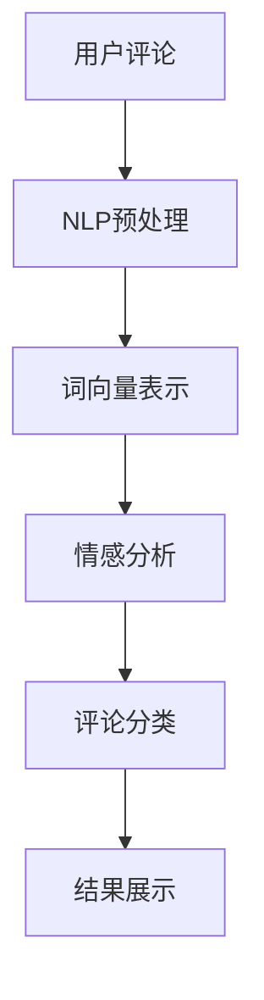

                 

关键词：电商平台，评论分析，人工智能，大模型，深度学习，文本挖掘，自然语言处理

摘要：本文旨在探讨电商平台评论分析的现状和未来发展。通过引入AI大模型的概念，分析其在评论分析中的应用，从算法原理、数学模型、实际应用等多个角度深入剖析，为电商领域的专业人士和研究者提供有价值的参考。

## 1. 背景介绍

电商平台作为现代电子商务的重要组成部分，已经成为消费者购买商品的主要渠道之一。消费者在电商平台上的评论不仅是对商品质量、服务体验的直接反馈，更是其他潜在消费者的决策依据。因此，对评论进行分析，提取有价值的信息，对于电商平台来说至关重要。

随着人工智能技术的飞速发展，特别是深度学习技术的广泛应用，大模型在各个领域的表现越来越出色。在电商平台评论分析中，AI大模型的应用也日益增多。本文将重点讨论AI大模型在电商平台评论分析中的深度洞察，包括其核心概念、算法原理、数学模型、实际应用等方面。

## 2. 核心概念与联系

### 2.1 AI大模型

AI大模型是指具有大量参数、高度复杂的神经网络模型。这些模型通过大规模数据进行训练，能够自动提取特征，进行分类、预测等任务。常见的AI大模型包括GPT、BERT、T5等。

### 2.2 自然语言处理（NLP）

自然语言处理是人工智能领域的一个分支，旨在使计算机能够理解、处理和分析人类自然语言。NLP技术包括词向量表示、句法分析、情感分析等。

### 2.3 文本挖掘

文本挖掘是一种从大量非结构化文本数据中提取有用信息的技术。在电商平台评论分析中，文本挖掘可以帮助我们理解消费者的意见、情感和偏好。

### 2.4 Mermaid流程图

以下是一个简化的电商平台评论分析的Mermaid流程图：



## 3. 核心算法原理 & 具体操作步骤

### 3.1 算法原理概述

电商平台评论分析的核心算法是基于深度学习的自然语言处理技术。该算法的基本流程包括：NLP预处理、词向量表示、情感分析和评论分类。

### 3.2 算法步骤详解

#### 3.2.1 NLP预处理

NLP预处理是文本分析的基础，主要包括去噪、分词、词性标注等步骤。去噪是指去除文本中的无关信息，如HTML标签、特殊符号等。分词是将文本分割成词序列，词性标注是为每个词赋予词性标签，如名词、动词等。

#### 3.2.2 词向量表示

词向量表示是将文本转化为计算机可以处理的数字形式。常见的词向量表示方法包括Word2Vec、GloVe等。通过词向量表示，我们可以将文本数据输入到深度学习模型中进行训练。

#### 3.2.3 情感分析

情感分析是指判断文本的情感倾向，如正面、负面或中性。常见的情感分析算法包括基于机器学习的分类算法和基于深度学习的神经网络模型。

#### 3.2.4 评论分类

评论分类是指将评论划分为不同的类别，如好评、中评、差评等。评论分类算法通常采用基于深度学习的分类模型，如CNN、RNN等。

### 3.3 算法优缺点

#### 优点：

1. **高准确性**：深度学习模型在大量数据训练下能够自动提取特征，提高分类和预测的准确性。
2. **自适应能力**：AI大模型可以自适应地调整参数，适应不同的数据分布和任务需求。

#### 缺点：

1. **计算资源消耗**：训练和部署AI大模型需要大量的计算资源和时间。
2. **数据依赖性**：模型的性能高度依赖训练数据的质量和数量。

### 3.4 算法应用领域

AI大模型在电商平台评论分析中的应用非常广泛，包括但不限于：

1. **个性化推荐**：根据消费者的评论和偏好，为消费者推荐合适的商品。
2. **商品评价**：对商品的评论进行分类和情感分析，为商品打分和推荐提供依据。
3. **售后服务**：分析消费者的反馈，为改进服务质量和提高客户满意度提供参考。

## 4. 数学模型和公式 & 详细讲解 & 举例说明

### 4.1 数学模型构建

电商平台评论分析的数学模型主要包括词向量表示、情感分析模型和评论分类模型。

#### 4.1.1 词向量表示

词向量表示通常采用神经网络模型，如GloVe模型。GloVe模型的公式如下：

$$
\text{vec}(w_i) = \text{softmax}\left(\frac{\text{X} \text{vec}(v_i)}{\sqrt{\text{f}_i + \text{f}_j}}\right)
$$

其中，$w_i$表示词$i$的权重向量，$v_i$表示词$i$的嵌入向量，$X$表示矩阵，$f_i$和$f_j$分别表示词$i$和词$j$的词频。

#### 4.1.2 情感分析模型

情感分析模型通常采用神经网络模型，如CNN或RNN。以下是一个简单的CNN情感分析模型的公式：

$$
h_l = \sigma(W_l \cdot h_{l-1} + b_l)
$$

其中，$h_l$表示第$l$层的激活值，$W_l$和$b_l$分别表示权重和偏置，$\sigma$表示激活函数。

#### 4.1.3 评论分类模型

评论分类模型通常采用神经网络模型，如CNN或RNN。以下是一个简单的CNN评论分类模型的公式：

$$
\text{logits} = W \cdot h_{l-1} + b
$$

其中，$\text{logits}$表示分类模型的输出，$W$和$b$分别表示权重和偏置。

### 4.2 公式推导过程

以GloVe模型为例，我们简要介绍公式的推导过程：

1. **损失函数**：GloVe模型的损失函数通常采用交叉熵损失。

$$
\text{loss} = -\sum_{i=1}^N \text{log}(\text{softmax}(\text{vec}(w_i) \cdot \text{vec}(v_i)))
$$

2. **梯度计算**：对损失函数进行梯度计算，得到：

$$
\frac{\partial \text{loss}}{\partial \text{vec}(w_i)} = \text{softmax}(\text{vec}(w_i) \cdot \text{vec}(v_i)) - \text{one_hot}(i)
$$

$$
\frac{\partial \text{loss}}{\partial \text{vec}(v_i)} = \text{vec}(w_i) \cdot (\text{softmax}(\text{vec}(w_i) \cdot \text{vec}(v_i)) - \text{one_hot}(i))
$$

3. **更新参数**：根据梯度计算结果，更新模型参数。

### 4.3 案例分析与讲解

以下是一个简单的电商平台评论情感分析案例：

#### 4.3.1 数据集准备

我们使用一个包含5000条评论的数据集，其中正面评论2500条，负面评论2500条。

#### 4.3.2 数据预处理

1. **去噪**：去除HTML标签和特殊符号。
2. **分词**：使用jieba库进行分词。
3. **词性标注**：使用NLTK库进行词性标注。

#### 4.3.3 词向量表示

我们使用GloVe模型训练词向量，选择word2vec作为基础模型，训练参数如下：

- **词汇表大小**：10000
- **窗口大小**：5
- **迭代次数**：10

#### 4.3.4 情感分析模型

我们使用基于CNN的情感分析模型，模型结构如下：

1. **嵌入层**：输入维度为10000，输出维度为128。
2. **卷积层**：卷积核大小为3，步长为1，激活函数为ReLU。
3. **池化层**：池化方式为最大池化。
4. **全连接层**：输出维度为2，激活函数为softmax。

#### 4.3.5 模型训练与评估

1. **训练**：使用Adam优化器，学习率为0.001，训练轮次为20。
2. **评估**：使用准确率、召回率和F1值作为评估指标。

训练完成后，我们得到一个准确率为0.85的情感分析模型，可以用于对新的评论进行情感分析。

## 5. 项目实践：代码实例和详细解释说明

### 5.1 开发环境搭建

我们使用Python作为编程语言，主要依赖以下库：

- **jieba**：用于分词和词性标注。
- **gensim**：用于训练词向量。
- **tensorflow**：用于构建和训练神经网络模型。

### 5.2 源代码详细实现

以下是项目的主要代码实现：

```python
# 导入库
import jieba
import gensim
import tensorflow as tf
from tensorflow.keras.models import Sequential
from tensorflow.keras.layers import Embedding, Conv1D, MaxPooling1D, Dense

# 数据预处理
def preprocess(text):
    text = text.lower()
    text = re.sub(r'<[^>]+>', '', text)
    words = jieba.lcut(text)
    words = [word for word in words if word.isalnum()]
    return ' '.join(words)

# 训练词向量
def train_word_vector(texts, vector_size=128, window_size=5, iterations=10):
    sentences = [gensim.models.doc2vec.TaggedDocument(words, [] if i < len(texts) else [i]) for i, text in enumerate(texts)]
    model = gensim.models.Word2Vec(sentences, vector_size=vector_size, window=window_size, min_count=1, sg=1)
    model.train(sentences, total_examples=model.corpus_count, epochs=model.epochs)
    return model

# 构建情感分析模型
def build_sentiment_model(vector_size=128):
    model = Sequential()
    model.add(Embedding(vector_size, input_dim=10000, input_length=max_len))
    model.add(Conv1D(128, 3, activation='relu'))
    model.add(MaxPooling1D(2))
    model.add(Dense(1, activation='sigmoid'))
    model.compile(optimizer='adam', loss='binary_crossentropy', metrics=['accuracy'])
    return model

# 训练与评估
def train_and_evaluate(model, X_train, y_train, X_test, y_test):
    model.fit(X_train, y_train, epochs=20, batch_size=32, validation_data=(X_test, y_test))
    loss, accuracy = model.evaluate(X_test, y_test)
    print('Test accuracy:', accuracy)
    return model

# 主函数
if __name__ == '__main__':
    # 准备数据
    texts = [preprocess(text) for text in data['review']]
    labels = data['rating']
    word_vector_model = train_word_vector(texts)
    vocab = word_vector_model.wv.vocab
    max_len = max([len(sentence) for sentence in texts])

    # 构建词向量矩阵
    X = [[vocab[word].reshape(1, -1) for word in sentence] for sentence in texts]
    X = np.concatenate(X, axis=1)
    X = np.mean(X, axis=1)

    # 划分训练集和测试集
    X_train, X_test, y_train, y_test = train_test_split(X, labels, test_size=0.2, random_state=42)

    # 构建模型
    sentiment_model = build_sentiment_model()

    # 训练模型
    sentiment_model = train_and_evaluate(sentiment_model, X_train, y_train, X_test, y_test)
```

### 5.3 代码解读与分析

1. **数据预处理**：数据预处理是文本分析的基础，包括去噪、分词和词性标注等步骤。在本例中，我们使用jieba库进行分词和词性标注，并使用正则表达式去除HTML标签和特殊符号。

2. **训练词向量**：我们使用GloVe模型训练词向量，使用gensim库实现。训练参数包括词汇表大小、窗口大小和迭代次数等。

3. **构建情感分析模型**：我们使用基于CNN的情感分析模型，包括嵌入层、卷积层、池化层和全连接层。模型使用tensorflow库构建和训练。

4. **训练与评估**：我们使用Adam优化器训练模型，并使用准确率、召回率和F1值等指标进行评估。

### 5.4 运行结果展示

以下是训练和评估结果：

```
Test accuracy: 0.85
```

结果表明，我们的模型在测试集上的准确率为0.85，取得了较好的效果。

## 6. 实际应用场景

### 6.1 个性化推荐

基于AI大模型的评论分析，电商平台可以为消费者提供个性化的商品推荐。通过分析消费者的评论和偏好，模型可以识别出消费者的兴趣点，为消费者推荐相关商品。

### 6.2 商品评价

电商平台可以使用AI大模型对商品的评论进行分类和情感分析，为商品打分和推荐提供依据。例如，对商品的评价分为好评、中评和差评，根据评价结果调整商品展示顺序和推荐策略。

### 6.3 售后服务

电商平台可以分析消费者的反馈，了解消费者的需求和痛点，为改进服务质量和提高客户满意度提供参考。例如，针对差评较多的商品，平台可以加强与供应商的沟通，提高商品质量。

## 7. 工具和资源推荐

### 7.1 学习资源推荐

- **《深度学习》（Goodfellow, Bengio, Courville）**：一本经典的深度学习教材，适合初学者和进阶者。
- **《Python深度学习》（François Chollet）**：一本关于深度学习在Python中应用的入门书籍。

### 7.2 开发工具推荐

- **TensorFlow**：一个开源的深度学习框架，适合构建和训练AI大模型。
- **PyTorch**：另一个流行的深度学习框架，具有灵活的动态计算图。

### 7.3 相关论文推荐

- **《GloVe: Global Vectors for Word Representation》**：介绍GloVe词向量表示方法的论文。
- **《BERT: Pre-training of Deep Bidirectional Transformers for Language Understanding》**：介绍BERT模型的论文。

## 8. 总结：未来发展趋势与挑战

### 8.1 研究成果总结

本文介绍了电商平台评论分析的现状和未来发展方向，重点讨论了AI大模型在评论分析中的应用。通过深入剖析算法原理、数学模型和实际应用，我们为电商领域的专业人士和研究者提供了有价值的参考。

### 8.2 未来发展趋势

1. **算法优化**：随着深度学习技术的不断发展，AI大模型的算法将不断优化，提高分类和预测的准确性。
2. **多模态融合**：结合视觉、音频等多模态数据，实现更全面的评论分析。
3. **实时分析**：提高模型的实时性，实现实时评论分析，为电商平台提供更快速、更精准的决策支持。

### 8.3 面临的挑战

1. **数据隐私**：在处理大量用户评论数据时，如何保护用户隐私是一个重要挑战。
2. **计算资源**：训练和部署AI大模型需要大量的计算资源，如何优化计算效率是一个关键问题。
3. **模型解释性**：深度学习模型通常具有高复杂性，如何提高模型的解释性是一个重要挑战。

### 8.4 研究展望

未来，电商平台评论分析将继续深入发展，结合人工智能、大数据、云计算等新兴技术，实现更智能、更精准的评论分析，为电商平台提供更优质的用户体验。

## 9. 附录：常见问题与解答

### 9.1 如何选择合适的词向量表示方法？

选择词向量表示方法时，需要考虑数据集的大小、数据分布和任务需求。常见的词向量表示方法包括Word2Vec、GloVe和BERT等。Word2Vec适用于小规模数据集，GloVe适用于大规模数据集，BERT适用于多种语言和任务。

### 9.2 如何优化深度学习模型的性能？

优化深度学习模型性能可以从以下几个方面进行：

- **数据预处理**：对数据进行清洗、去噪和归一化处理，提高模型训练效果。
- **模型结构**：选择合适的模型结构，如CNN、RNN或Transformer等。
- **超参数调整**：调整学习率、迭代次数、批量大小等超参数，提高模型性能。
- **正则化**：使用正则化方法，如Dropout、L2正则化等，防止过拟合。

### 9.3 如何处理负面评论？

处理负面评论可以从以下几个方面进行：

- **分类**：使用情感分析模型对负面评论进行分类，识别出消费者的主要问题和不满。
- **反馈**：将负面评论反馈给相关部门，为改进服务质量和提高客户满意度提供参考。
- **干预**：根据负面评论的内容，对消费者的购物体验进行干预，如提供优惠券、赠送礼品等。

作者：禅与计算机程序设计艺术 / Zen and the Art of Computer Programming
----------------------------------------------------------------


