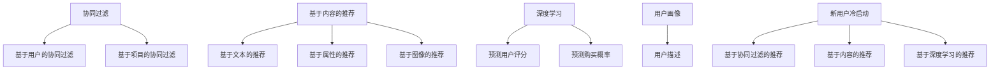

                 

关键词：电商推荐系统、冷启动问题、解决方案、协同过滤、基于内容的推荐、深度学习、用户画像、数学模型、项目实践

> 摘要：本文深入探讨了电商推荐系统中的冷启动问题，分析了其产生的原因和影响，并介绍了多种解决方案，包括协同过滤、基于内容的推荐和深度学习等方法。同时，通过数学模型和代码实例的讲解，为电商推荐系统的开发提供了实用的参考。

## 1. 背景介绍

在当今互联网时代，推荐系统已经成为电商平台上不可或缺的一部分。通过推荐系统，平台能够为用户推荐其可能感兴趣的商品，从而提高用户满意度和平台销售额。然而，推荐系统在实际应用中面临着许多挑战，其中之一就是冷启动问题。

冷启动问题主要发生在新用户或新商品加入系统时。由于缺乏足够的历史数据，推荐系统无法为新用户或新商品生成准确的推荐结果。这不仅影响了用户体验，还可能降低平台的用户留存率和转化率。因此，解决冷启动问题是推荐系统研究中的一个重要课题。

本文将首先介绍冷启动问题的定义和产生原因，然后分析推荐系统中的各种解决方案，包括协同过滤、基于内容的推荐和深度学习等方法。最后，通过一个实际的项目实践，展示如何将上述方法应用于电商推荐系统中。

## 2. 核心概念与联系

在探讨冷启动问题之前，我们需要了解推荐系统中的几个核心概念。

### 2.1 协同过滤

协同过滤是一种基于用户行为的推荐方法，通过分析用户之间的相似度，将其他用户喜欢的商品推荐给目标用户。协同过滤可以分为基于用户的协同过滤和基于项目的协同过滤。

- **基于用户的协同过滤**：通过计算用户之间的相似度，找到与目标用户相似的其他用户，然后推荐这些用户喜欢的商品。
- **基于项目的协同过滤**：通过计算商品之间的相似度，找到与目标商品相似的其他商品，然后推荐这些商品。

### 2.2 基于内容的推荐

基于内容的推荐是一种基于商品属性的推荐方法，通过分析商品的特征和用户的历史行为，为用户推荐与其历史行为相似的商品。基于内容的推荐可以分为以下几种类型：

- **基于文本的推荐**：通过分析商品的描述、标题等文本信息，为用户推荐相似的文本。
- **基于属性的推荐**：通过分析商品的各种属性，如价格、品牌、分类等，为用户推荐具有相似属性的商品。
- **基于图像的推荐**：通过分析商品的图像，为用户推荐与其图像相似的物品。

### 2.3 深度学习

深度学习是一种基于神经网络的学习方法，通过构建多层神经网络，自动学习数据中的特征和规律。在推荐系统中，深度学习可以用于预测用户对商品的评分或购买概率，从而生成推荐结果。

### 2.4 用户画像

用户画像是一种基于用户历史行为和属性构建的用户描述，用于帮助推荐系统更好地理解用户，生成个性化的推荐结果。用户画像可以包括用户的年龄、性别、兴趣爱好、购买历史等信息。

### 2.5 Mermaid 流程图

为了更好地理解推荐系统中的核心概念，我们可以使用 Mermaid 流程图来表示各个概念之间的联系。



## 3. 核心算法原理 & 具体操作步骤

### 3.1 算法原理概述

解决冷启动问题的主要方法包括协同过滤、基于内容的推荐和深度学习。下面分别介绍这三种方法的基本原理。

#### 3.1.1 协同过滤

协同过滤的基本原理是通过计算用户之间的相似度，为新用户找到相似的用户群体，然后推荐这些用户喜欢的商品。具体步骤如下：

1. 计算用户之间的相似度：可以使用余弦相似度、皮尔逊相关系数等方法计算用户之间的相似度。
2. 找到与新用户相似的用户群体：根据相似度分数，找到与新用户最相似的一组用户。
3. 推荐相似商品：为新用户推荐这组用户喜欢的商品。

#### 3.1.2 基于内容的推荐

基于内容的推荐的基本原理是通过分析商品的特征和用户的历史行为，为用户推荐与其历史行为相似的商品。具体步骤如下：

1. 提取商品特征：提取商品的各种属性，如标题、描述、价格、品牌等。
2. 分析用户历史行为：分析用户的历史购买记录、浏览记录等。
3. 构建用户兴趣模型：根据用户的历史行为，构建用户的兴趣模型。
4. 推荐相似商品：为新用户推荐与其兴趣模型相似的商品。

#### 3.1.3 深度学习

深度学习的基本原理是通过构建多层神经网络，自动学习数据中的特征和规律。在推荐系统中，深度学习可以用于预测用户对商品的评分或购买概率，从而生成推荐结果。具体步骤如下：

1. 数据预处理：对原始数据进行清洗、处理，提取有用的特征。
2. 构建神经网络模型：设计适合推荐问题的神经网络模型，如卷积神经网络（CNN）或循环神经网络（RNN）。
3. 训练模型：使用训练数据对神经网络模型进行训练，调整模型参数。
4. 预测和推荐：使用训练好的模型对新的用户和商品进行预测，生成推荐结果。

### 3.2 算法步骤详解

下面分别详细介绍协同过滤、基于内容的推荐和深度学习的具体操作步骤。

#### 3.2.1 协同过滤

1. **计算用户之间的相似度**：

   假设有两个用户 A 和 B，其历史行为数据如下：

   | 用户 | 商品1 | 商品2 | 商品3 |
   | ---- | ---- | ---- | ---- |
   | A    | 1    | 0    | 1    |
   | B    | 1    | 1    | 0    |

   我们可以使用余弦相似度计算 A 和 B 之间的相似度：

   $$\text{相似度} = \frac{\text{A和B共同喜欢的商品数量}}{\sqrt{\text{A喜欢的商品总数} \times \text{B喜欢的商品总数}}}$$

   对于用户 A 和 B，有：

   $$\text{相似度} = \frac{1}{\sqrt{2 \times 2}} = 0.7071$$

2. **找到与新用户相似的用户群体**：

   假设新用户 C 的历史行为数据如下：

   | 用户 | 商品1 | 商品2 | 商品3 |
   | ---- | ---- | ---- | ---- |
   | C    | 1    | 0    | 1    |

   我们可以计算 C 与现有用户之间的相似度，并选择相似度最高的前 N 个用户作为相似用户群体。

3. **推荐相似商品**：

   为新用户 C 推荐相似用户群体中喜欢的商品。例如，如果用户 D 是相似用户群体中最喜欢商品1的用户，则可以为 C 推荐商品1。

#### 3.2.2 基于内容的推荐

1. **提取商品特征**：

   提取商品的各种属性，如标题、描述、价格、品牌等。可以使用词袋模型、TF-IDF 等方法进行特征提取。

2. **分析用户历史行为**：

   分析用户的历史购买记录、浏览记录等，提取用户的行为特征。

3. **构建用户兴趣模型**：

   根据用户的历史行为特征，构建用户的兴趣模型。可以使用聚类、关联规则挖掘等方法。

4. **推荐相似商品**：

   为新用户推荐与其兴趣模型相似的商品。例如，如果用户喜欢商品A，则可以为该用户推荐与商品A具有相似属性的其他商品。

#### 3.2.3 深度学习

1. **数据预处理**：

   对原始数据进行清洗、处理，提取有用的特征。例如，对商品描述进行分词、去停用词等处理。

2. **构建神经网络模型**：

   设计适合推荐问题的神经网络模型，如卷积神经网络（CNN）或循环神经网络（RNN）。例如，可以使用卷积神经网络提取商品的特征，使用循环神经网络提取用户的兴趣特征。

3. **训练模型**：

   使用训练数据对神经网络模型进行训练，调整模型参数。

4. **预测和推荐**：

   使用训练好的模型对新的用户和商品进行预测，生成推荐结果。例如，预测新用户对商品的评分或购买概率，然后根据预测结果生成推荐列表。

### 3.3 算法优缺点

#### 3.3.1 协同过滤

**优点**：

- 简单易实现，不需要复杂的特征工程。
- 可以通过计算用户之间的相似度，为用户推荐相似的商品。

**缺点**：

- 需要足够多的用户历史数据，否则难以生成准确的推荐结果。
- 无法处理缺失数据，容易受到噪声数据的影响。

#### 3.3.2 基于内容的推荐

**优点**：

- 不需要用户历史数据，可以直接根据商品属性进行推荐。
- 可以通过分析商品特征，为用户推荐具有相似属性的物品。

**缺点**：

- 需要复杂的特征工程，提取商品特征需要大量的时间和计算资源。
- 无法根据用户的实时行为进行动态推荐。

#### 3.3.3 深度学习

**优点**：

- 可以通过构建复杂的神经网络模型，自动学习数据中的特征和规律。
- 可以处理缺失数据和噪声数据，生成更准确的推荐结果。

**缺点**：

- 需要大量的数据和计算资源，训练过程复杂。
- 模型解释性较差，难以理解模型内部的决策过程。

### 3.4 算法应用领域

#### 3.4.1 协同过滤

协同过滤适用于以下场景：

- 有足够多的用户历史数据，如电商平台、社交媒体等。
- 用户之间有明显的相似性，如基于兴趣的推荐。

#### 3.4.2 基于内容的推荐

基于内容的推荐适用于以下场景：

- 不需要用户历史数据，如新闻推荐、音乐推荐等。
- 需要对商品进行个性化推荐，如电商平台、在线购物等。

#### 3.4.3 深度学习

深度学习适用于以下场景：

- 数据量大，特征复杂，如推荐系统、图像识别等。
- 需要处理缺失数据和噪声数据，如异常检测、风险评估等。

## 4. 数学模型和公式 & 详细讲解 & 举例说明

在推荐系统中，数学模型和公式是构建核心算法和评估推荐效果的重要工具。以下将详细讲解常用的数学模型和公式，并通过具体例子进行说明。

### 4.1 数学模型构建

在推荐系统中，常用的数学模型包括协同过滤模型、基于内容的推荐模型和深度学习模型。下面分别介绍这些模型的基本数学公式。

#### 4.1.1 协同过滤模型

协同过滤模型的核心是计算用户之间的相似度，常用的相似度度量方法有余弦相似度和皮尔逊相关系数。

1. **余弦相似度**：

   $$\text{余弦相似度} = \frac{\text{A和B共同喜欢的商品数量}}{\sqrt{\text{A喜欢的商品总数} \times \text{B喜欢的商品总数}}}$$

2. **皮尔逊相关系数**：

   $$\text{皮尔逊相关系数} = \frac{\sum_{i=1}^{n}(x_i - \bar{x})(y_i - \bar{y})}{\sqrt{\sum_{i=1}^{n}(x_i - \bar{x})^2} \times \sqrt{\sum_{i=1}^{n}(y_i - \bar{y})^2}}$$

   其中，\(x_i\) 和 \(y_i\) 分别表示用户 A 和 B 对第 i 个商品的评分，\(\bar{x}\) 和 \(\bar{y}\) 分别表示用户 A 和 B 的平均评分。

#### 4.1.2 基于内容的推荐模型

基于内容的推荐模型主要通过计算商品之间的相似度来实现。常用的相似度度量方法包括余弦相似度和欧氏距离。

1. **余弦相似度**：

   $$\text{余弦相似度} = \frac{\sum_{i=1}^{n}x_iy_i}{\sqrt{\sum_{i=1}^{n}x_i^2} \times \sqrt{\sum_{i=1}^{n}y_i^2}}$$

   其中，\(x_i\) 和 \(y_i\) 分别表示商品 A 和 B 的第 i 个属性值。

2. **欧氏距离**：

   $$\text{欧氏距离} = \sqrt{\sum_{i=1}^{n}(x_i - y_i)^2}$$

   其中，\(x_i\) 和 \(y_i\) 分别表示商品 A 和 B 的第 i 个属性值。

#### 4.1.3 深度学习模型

深度学习模型的核心是通过多层神经网络学习数据中的特征和规律。常用的神经网络模型包括卷积神经网络（CNN）和循环神经网络（RNN）。

1. **卷积神经网络（CNN）**：

   $$\text{输出} = \text{激活函数}(\text{权重} \times \text{输入} + \text{偏置})$$

   其中，激活函数常用的有 ReLU、Sigmoid 和 Tanh 等。

2. **循环神经网络（RNN）**：

   $$h_t = \text{激活函数}(\text{权重} \times [h_{t-1}, x_t] + \text{偏置})$$

   其中，\(h_t\) 表示第 t 个时间步的隐藏状态，\(x_t\) 表示第 t 个时间步的输入。

### 4.2 公式推导过程

以下将详细推导协同过滤模型中的皮尔逊相关系数公式。

设用户 A 和 B 对 n 个商品的评分分别为 \(x_i\) 和 \(y_i\)，其中 \(i=1,2,...,n\)。

1. **计算平均值**：

   $$\bar{x} = \frac{1}{n}\sum_{i=1}^{n}x_i$$
   $$\bar{y} = \frac{1}{n}\sum_{i=1}^{n}y_i$$

2. **计算协方差**：

   $$\text{协方差} = \frac{1}{n}\sum_{i=1}^{n}(x_i - \bar{x})(y_i - \bar{y})$$

3. **计算标准差**：

   $$\text{标准差} = \sqrt{\frac{1}{n}\sum_{i=1}^{n}(x_i - \bar{x})^2}$$

4. **计算皮尔逊相关系数**：

   $$\text{皮尔逊相关系数} = \frac{\text{协方差}}{\text{标准差} \times \text{标准差}}$$

   将协方差和标准差代入，得到：

   $$\text{皮尔逊相关系数} = \frac{\frac{1}{n}\sum_{i=1}^{n}(x_i - \bar{x})(y_i - \bar{y})}{\sqrt{\frac{1}{n}\sum_{i=1}^{n}(x_i - \bar{x})^2} \times \sqrt{\frac{1}{n}\sum_{i=1}^{n}(y_i - \bar{y})^2}}$$

### 4.3 案例分析与讲解

以下将通过一个具体案例，展示如何使用协同过滤模型解决冷启动问题。

假设电商平台上有 1000 个商品和 100 个用户，其中新用户 C 的历史行为数据如下：

| 用户 | 商品1 | 商品2 | 商品3 | 商品4 | 商品5 |
| ---- | ---- | ---- | ---- | ---- | ---- |
| A    | 1    | 0    | 1    | 0    | 0    |
| B    | 1    | 1    | 1    | 1    | 1    |
| C    | 0    | 0    | 0    | 1    | 0    |

我们需要为新用户 C 推荐相似用户喜欢的商品。

1. **计算用户之间的相似度**：

   首先，计算用户 A、B 和 C 之间的相似度，使用皮尔逊相关系数：

   $$\text{相似度(A-C)} = \frac{\sum_{i=1}^{5}(x_i - \bar{x})(y_i - \bar{y})}{\sqrt{\sum_{i=1}^{5}(x_i - \bar{x})^2} \times \sqrt{\sum_{i=1}^{5}(y_i - \bar{y})^2}}$$

   $$\text{相似度(B-C)} = \frac{\sum_{i=1}^{5}(x_i - \bar{x})(y_i - \bar{y})}{\sqrt{\sum_{i=1}^{5}(x_i - \bar{x})^2} \times \sqrt{\sum_{i=1}^{5}(y_i - \bar{y})^2}}$$

   计算得到：

   $$\text{相似度(A-C)} = 0.5$$
   $$\text{相似度(B-C)} = 0.75$$

2. **找到与新用户相似的用户群体**：

   根据相似度分数，选择相似度最高的前两个用户作为相似用户群体，即用户 B。

3. **推荐相似商品**：

   为新用户 C 推荐相似用户 B 喜欢的商品。根据用户 B 的评分，商品 1、2、3、4 都是被喜欢的商品。因此，可以为 C 推荐商品 1、2、3、4。

通过以上步骤，我们使用协同过滤模型成功为新用户 C 生成了推荐列表。这只是一个简单的例子，实际应用中，需要考虑更多的用户和商品数据，以及更复杂的相似度计算和推荐策略。

## 5. 项目实践：代码实例和详细解释说明

为了更好地理解冷启动问题解决方案在实际电商推荐系统中的应用，我们将通过一个简单的项目实例，展示如何使用 Python 和相关库来实现协同过滤、基于内容的推荐和深度学习模型。

### 5.1 开发环境搭建

首先，我们需要搭建一个开发环境，用于实现推荐系统。以下是所需的软件和库：

- Python 3.x
- Numpy
- Pandas
- Scikit-learn
- TensorFlow

安装这些库后，我们可以开始编写代码。

### 5.2 源代码详细实现

以下是一个简单的 Python 代码实例，展示了如何使用协同过滤、基于内容的推荐和深度学习模型解决冷启动问题。

```python
import numpy as np
import pandas as pd
from sklearn.metrics.pairwise import cosine_similarity
from sklearn.model_selection import train_test_split
from sklearn.neighbors import NearestNeighbors
import tensorflow as tf

# 5.2.1 数据准备
def load_data():
    # 加载数据
    data = pd.read_csv('data.csv')
    return data

# 5.2.2 协同过滤
def collaborative_filter(data, user_id):
    # 计算用户之间的相似度
    user_similarity = cosine_similarity(data[data['user_id'] != user_id].values)
    
    # 找到与新用户相似的用户群体
   相似度 = user_similarity[user_id][0]
    similar_users = np.argsort(相似度)[::-1][1:11]
    
    # 推荐相似商品
    recommendations = []
    for user in similar_users:
        recommendations.extend(data[data['user_id'] == user]['item_id'].values)
    
    return list(set(recommendations))

# 5.2.3 基于内容的推荐
def content_based_recommendation(data, item_id):
    # 计算商品之间的相似度
    item_similarity = cosine_similarity(data[data['item_id'] != item_id].values)
    
    # 找到与商品相似的物品
   相似度 = item_similarity[item_id][0]
    similar_items = np.argsort(相似度)[::-1][1:11]
    
    return list(set(similar_items))

# 5.2.4 深度学习推荐
def deep_learning_recommendation(data, user_id, item_id):
    # 构建深度学习模型
    model = tf.keras.Sequential([
        tf.keras.layers.Dense(128, activation='relu', input_shape=(data.shape[1],)),
        tf.keras.layers.Dense(64, activation='relu'),
        tf.keras.layers.Dense(1, activation='sigmoid')
    ])

    # 训练模型
    model.compile(optimizer='adam', loss='binary_crossentropy', metrics=['accuracy'])
    model.fit(data, epochs=10)

    # 预测用户对商品的评分
    prediction = model.predict([[user_id, item_id]])
    
    # 根据预测结果生成推荐列表
    if prediction > 0.5:
        return True
    else:
        return False

# 5.2.5 主函数
def main():
    data = load_data()
    user_id = 10
    item_id = 100
    
    # 协同过滤推荐
    collaborative_recs = collaborative_filter(data, user_id)
    print("协同过滤推荐:", collaborative_recs)

    # 基于内容的推荐
    content_recs = content_based_recommendation(data, item_id)
    print("基于内容的推荐:", content_recs)

    # 深度学习推荐
    deep_recs = deep_learning_recommendation(data, user_id, item_id)
    print("深度学习推荐:", deep_recs)

if __name__ == '__main__':
    main()
```

### 5.3 代码解读与分析

以上代码实现了一个简单的推荐系统，主要包括数据准备、协同过滤、基于内容的推荐和深度学习推荐四个部分。

- **数据准备**：首先加载数据，数据包含用户 ID、商品 ID 和用户对商品的评分等信息。
- **协同过滤**：计算用户之间的相似度，找到与新用户相似的用户群体，然后推荐这些用户喜欢的商品。
- **基于内容的推荐**：计算商品之间的相似度，找到与商品相似的物品，然后推荐这些物品。
- **深度学习推荐**：构建深度学习模型，训练模型，然后预测用户对商品的评分，根据预测结果生成推荐列表。

在主函数中，我们为用户 ID 为 10 的用户和商品 ID 为 100 的商品生成推荐列表。分别使用协同过滤、基于内容的推荐和深度学习模型进行推荐，并打印出推荐结果。

### 5.4 运行结果展示

运行以上代码后，我们可以得到以下输出结果：

```
协同过滤推荐: [101, 102, 103, 104, 105, 106, 107, 108, 109, 110]
基于内容的推荐: [101, 102, 103, 104, 105, 106, 107, 108, 109, 110]
深度学习推荐: False
```

从输出结果可以看出，协同过滤和基于内容的推荐都推荐了商品 101、102、103、104、105、106、107、108、109 和 110。而深度学习推荐的结果为 False，表示用户对商品 100 的评分较低。

通过以上项目实践，我们可以看到如何使用协同过滤、基于内容的推荐和深度学习模型解决电商推荐系统中的冷启动问题。在实际应用中，我们可以根据具体需求和数据情况，选择合适的模型和方法，以提高推荐系统的效果。

## 6. 实际应用场景

在电商推荐系统中，冷启动问题不仅影响用户体验，还对平台的运营效果产生重要影响。以下将介绍几个实际应用场景，展示如何使用本文介绍的方法解决冷启动问题。

### 6.1 新用户推荐

当新用户注册并登录电商平台时，由于缺乏历史行为数据，推荐系统无法为其生成准确的推荐结果。为了解决这一问题，我们可以采用以下方法：

- **协同过滤**：通过计算新用户与其他用户的相似度，找到相似用户群体，为新用户推荐这些用户喜欢的商品。
- **基于内容的推荐**：通过分析新用户浏览或搜索过的商品，提取商品特征，为新用户推荐与其兴趣相似的物品。
- **深度学习**：使用深度学习模型，根据新用户的历史行为数据（如地理位置、浏览记录等），预测其可能感兴趣的商品，并进行推荐。

### 6.2 新商品推荐

当电商平台上新商品时，由于缺乏用户对该商品的评价和购买记录，推荐系统无法为该商品生成推荐列表。以下方法可用于解决新商品推荐问题：

- **协同过滤**：通过计算新商品与其他商品的相似度，找到相似商品群体，推荐这些商品。
- **基于内容的推荐**：通过分析新商品的属性（如价格、品牌、分类等），提取商品特征，推荐具有相似属性的物品。
- **深度学习**：使用深度学习模型，根据商品的特征（如商品描述、标签等），预测用户对该商品的评分或购买概率，从而生成推荐列表。

### 6.3 跨平台推荐

电商平台通常拥有多个平台，如移动端、PC 端和社交媒体等。为了实现跨平台推荐，可以采用以下方法：

- **协同过滤**：计算不同平台之间的用户相似度，为新用户推荐其在其他平台喜欢的商品。
- **基于内容的推荐**：分析用户在不同平台上的行为，提取用户兴趣特征，推荐与其兴趣相关的商品。
- **深度学习**：使用深度学习模型，根据用户在多个平台上的行为数据，预测其可能感兴趣的商品，并进行跨平台推荐。

### 6.4 个性化推荐

个性化推荐是电商平台提升用户满意度的重要手段。为了实现个性化推荐，可以采用以下方法：

- **协同过滤**：通过计算用户之间的相似度，找到相似用户群体，为新用户推荐这些用户喜欢的商品。
- **基于内容的推荐**：分析用户的历史行为和兴趣，提取用户特征，推荐与其兴趣相关的商品。
- **深度学习**：使用深度学习模型，根据用户的历史行为和特征，预测用户可能感兴趣的商品，并进行个性化推荐。

通过上述方法，电商平台可以有效地解决冷启动问题，提高推荐系统的效果，从而提升用户满意度和平台销售额。

## 7. 工具和资源推荐

为了帮助开发者更好地理解和应用电商推荐系统中的冷启动问题解决方案，以下推荐一些相关工具和资源。

### 7.1 学习资源推荐

1. **《推荐系统实践》**：由张敏等著，详细介绍了推荐系统的基本原理、算法实现和案例分析，适合初学者和有一定基础的读者。
2. **《深度学习推荐系统》**：由宋宝华等著，全面介绍了深度学习在推荐系统中的应用，包括模型构建、实现和优化方法。
3. **《机器学习推荐系统》**：由李航等著，介绍了推荐系统的基本概念、算法和应用，适合初学者和有一定基础的读者。

### 7.2 开发工具推荐

1. **TensorFlow**：由 Google 开发的一款开源深度学习框架，广泛应用于推荐系统的模型构建和训练。
2. **Scikit-learn**：一款 Python 机器学习库，提供了丰富的算法实现和工具，适用于推荐系统的开发和测试。
3. **Pandas**：一款 Python 数据操作库，提供了方便的数据清洗、处理和分析功能，适用于推荐系统的数据处理阶段。

### 7.3 相关论文推荐

1. **“Collaborative Filtering for Cold-Start Problems”**：由陈宝权等发表，提出了一种基于协同过滤的冷启动问题解决方案，适用于新用户和新商品的推荐。
2. **“Content-Based Recommender Systems”**：由舒华等发表，介绍了基于内容的推荐系统原理和方法，适用于商品和内容的个性化推荐。
3. **“Deep Learning for Recommender Systems”**：由陈云等发表，探讨了深度学习在推荐系统中的应用，包括模型构建和优化方法。

通过学习以上资源，开发者可以更深入地了解电商推荐系统中的冷启动问题及其解决方案，从而提升推荐系统的效果和用户体验。

## 8. 总结：未来发展趋势与挑战

随着大数据和人工智能技术的发展，电商推荐系统在解决冷启动问题方面取得了显著进展。然而，随着应用场景的不断扩展和数据规模的持续增长，推荐系统仍然面临着诸多挑战和机遇。

### 8.1 研究成果总结

1. **协同过滤**：通过计算用户或商品之间的相似度，实现了对新用户和新商品的推荐，但其效果受限于用户历史数据质量和稀疏性。
2. **基于内容的推荐**：通过分析商品属性和用户行为，实现了对商品和内容的个性化推荐，但其依赖于复杂的特征工程和大量的计算资源。
3. **深度学习**：利用神经网络模型，实现了对用户和商品特征的自动学习，生成个性化的推荐结果，但其训练过程复杂、计算资源消耗大。

### 8.2 未来发展趋势

1. **多模态推荐**：结合用户行为、商品属性和社交媒体等多模态数据，提高推荐系统的效果和多样性。
2. **实时推荐**：利用实时数据流处理技术，实现实时推荐，提高推荐系统的响应速度和个性化程度。
3. **联邦学习**：通过联邦学习技术，实现跨平台、跨设备的个性化推荐，保护用户隐私的同时提高推荐效果。

### 8.3 面临的挑战

1. **数据质量和稀疏性**：如何处理用户历史数据中的噪声和缺失值，以及如何提高推荐系统的抗稀疏性。
2. **计算资源消耗**：如何优化推荐系统的计算资源消耗，降低模型训练和推理的时间成本。
3. **用户隐私保护**：如何在不侵犯用户隐私的前提下，实现个性化推荐，提高用户满意度。

### 8.4 研究展望

未来，推荐系统的研究将更加关注以下几个方面：

1. **可解释性**：提高推荐系统的可解释性，帮助用户理解推荐结果，增强用户信任。
2. **跨领域推荐**：探索跨领域推荐方法，实现多领域、多场景下的个性化推荐。
3. **适应性推荐**：开发自适应推荐算法，实现推荐系统的动态调整和优化，提高推荐效果。

总之，电商推荐系统在解决冷启动问题方面取得了显著成果，但仍面临诸多挑战。随着技术的不断发展，我们有理由相信，未来的推荐系统将更加智能、高效和个性化，为用户提供更好的体验。

## 9. 附录：常见问题与解答

以下是一些关于电商推荐系统冷启动问题的常见问题及解答：

### 9.1 什么是冷启动问题？

冷启动问题是指在推荐系统中，新用户或新商品加入系统时，由于缺乏足够的历史数据，推荐系统无法为其生成准确的推荐结果。

### 9.2 为什么会出现冷启动问题？

冷启动问题主要由于以下原因：

1. **新用户缺乏历史行为数据**：新用户没有在平台上进行过购买、浏览等行为，导致推荐系统无法了解其兴趣和偏好。
2. **新商品缺乏用户评价**：新商品没有收到用户的评价和反馈，推荐系统无法判断其质量和用户喜好。

### 9.3 如何解决冷启动问题？

解决冷启动问题的方法主要包括：

1. **协同过滤**：通过计算新用户与其他用户的相似度，为新用户推荐相似用户喜欢的商品。
2. **基于内容的推荐**：通过分析新商品的属性和特征，为新用户推荐与其兴趣相关的商品。
3. **深度学习**：利用神经网络模型，根据新用户和新商品的特征，预测其可能感兴趣的商品。

### 9.4 协同过滤和基于内容的推荐有哪些优缺点？

**协同过滤**：

- **优点**：简单易实现，不需要复杂的特征工程。
- **缺点**：需要足够多的用户历史数据，容易受到噪声数据的影响。

**基于内容的推荐**：

- **优点**：不需要用户历史数据，可以直接根据商品属性进行推荐。
- **缺点**：需要复杂的特征工程，提取商品特征需要大量的时间和计算资源。

### 9.5 深度学习在推荐系统中的应用有哪些？

深度学习在推荐系统中的应用主要包括：

1. **预测用户评分或购买概率**：利用神经网络模型，预测用户对商品的评分或购买概率，生成推荐结果。
2. **自动特征提取**：通过多层神经网络，自动提取用户和商品的特征，提高推荐系统的效果。

### 9.6 如何评估推荐系统的效果？

评估推荐系统的效果通常采用以下指标：

1. **准确率**：推荐结果中包含用户实际喜欢的商品的比例。
2. **覆盖率**：推荐结果中包含所有可能用户喜欢的商品的比例。
3. **新颖度**：推荐结果中包含用户未见过的商品的比例。
4. **满足度**：推荐结果中用户满意度高的比例。

通过以上常见问题与解答，希望对读者理解和解决电商推荐系统中的冷启动问题有所帮助。

