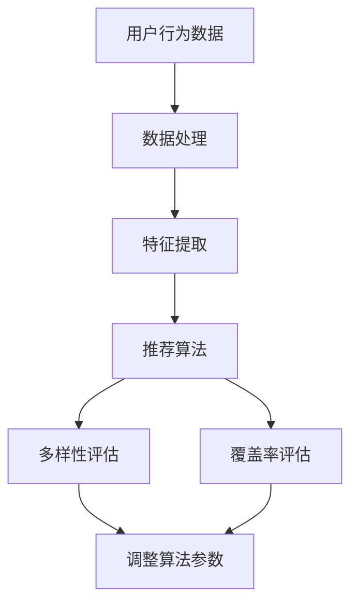

                 

关键词：电商推荐系统、多样性、覆盖率、平衡、算法原理、数学模型、项目实践、应用场景、未来展望

> 摘要：本文深入探讨了电商推荐系统中的多样性与覆盖率平衡问题。通过分析核心算法原理、数学模型和实际项目实践，揭示了如何在实际应用中实现多样性与覆盖率的平衡，以提高推荐系统的效果和用户体验。

## 1. 背景介绍

随着互联网技术的飞速发展和电商行业的蓬勃兴起，推荐系统已成为电商平台不可或缺的一部分。推荐系统的目标是根据用户的兴趣和行为，为用户推荐符合其需求的产品或内容，从而提高用户的满意度和平台的销售额。

在推荐系统中，多样性和覆盖率是两个重要的指标。多样性（Diversity）指的是推荐结果中的项目应具有不同的特征和属性，避免用户感到单调和重复。覆盖率（Coverage）则是指推荐系统能够覆盖尽可能多的用户兴趣和潜在需求，提高系统的覆盖范围和广度。

然而，多样性和覆盖率之间存在一定的矛盾。追求高度多样性可能导致覆盖率下降，因为系统可能无法准确捕捉用户的特定兴趣。相反，过分关注覆盖率可能导致多样性不足，使得推荐结果过于单一。因此，如何在推荐系统中实现多样性与覆盖率的平衡，成为研究者和实践者共同关注的问题。

## 2. 核心概念与联系

在探讨多样性与覆盖率平衡之前，我们需要明确一些核心概念，并展示它们之间的联系。

### 2.1 多样性（Diversity）

多样性是指推荐系统中不同项目之间的差异性和独特性。它可以通过多种方式度量，如项目属性、用户评分、时间戳等。一个高度多样化的推荐结果能够吸引用户的注意力，提高用户对推荐系统的满意度。

### 2.2 覆盖率（Coverage）

覆盖率是指推荐系统能够覆盖的用户兴趣和潜在需求的比例。一个高覆盖率的推荐系统能够为更多用户提供个性化的推荐，从而提高系统的整体效果。

### 2.3 多样性与覆盖率的联系

多样性和覆盖率之间的关系可以用一个简单的图来表示。在这个图中，x轴代表多样性，y轴代表覆盖率。理想情况下，我们希望找到一个最优的点，使得多样性较高且覆盖率较高。然而，实际中往往需要在不同目标之间做出权衡。

### 2.4 Mermaid 流程图



这个Mermaid流程图展示了推荐系统中多样性与覆盖率评估的基本流程。首先，从用户行为数据中提取特征，然后应用推荐算法生成推荐结果。接下来，对多样性进行评估，并根据评估结果调整算法参数，以实现多样性与覆盖率之间的平衡。

## 3. 核心算法原理 & 具体操作步骤

### 3.1 算法原理概述

在推荐系统中，常用的多样性与覆盖率平衡算法包括协同过滤、矩阵分解、基于内容的推荐等。这些算法的核心思想是通过用户和项目之间的相似度计算，生成推荐结果。

协同过滤算法分为基于用户的协同过滤和基于物品的协同过滤。基于用户的协同过滤通过计算用户之间的相似度，为用户推荐与相似用户喜欢的项目。基于物品的协同过滤则通过计算项目之间的相似度，为用户推荐与用户已购买或感兴趣的项目相似的项目。

矩阵分解是一种基于线性代数的推荐算法，通过将用户和项目的高维矩阵分解为低维矩阵，从而预测用户对项目的评分。矩阵分解算法可以有效地处理稀疏数据集，提高推荐系统的准确性和多样性。

基于内容的推荐算法通过分析项目的特征和用户的历史行为，为用户推荐与用户兴趣相符的项目。这种算法的优点是能够提供高度个性化的推荐，但可能在多样性方面表现较差。

### 3.2 算法步骤详解

#### 3.2.1 协同过滤算法

1. **数据预处理**：将用户和项目的特征数据进行标准化处理，如归一化、去均值等。

2. **相似度计算**：计算用户之间的相似度（基于用户的协同过滤）或项目之间的相似度（基于物品的协同过滤）。常用的相似度计算方法包括余弦相似度、皮尔逊相关系数等。

3. **生成推荐列表**：根据用户或项目的相似度，生成推荐列表。对于基于用户的协同过滤，为用户推荐与其相似的用户喜欢的项目；对于基于物品的协同过滤，为用户推荐与其已购买或感兴趣的项目相似的项目。

4. **多样性调整**：对推荐列表进行多样性调整，避免推荐结果过于单一。常用的多样性调整方法包括随机化、K-means聚类等。

#### 3.2.2 矩阵分解算法

1. **矩阵分解**：将用户和项目的高维矩阵分解为低维矩阵，如User和Item矩阵分解为User和Item矩阵。

2. **评分预测**：使用分解后的矩阵预测用户对项目的评分。

3. **生成推荐列表**：根据评分预测结果，生成推荐列表。

4. **多样性调整**：对推荐列表进行多样性调整，避免推荐结果过于单一。

#### 3.2.3 基于内容的推荐算法

1. **特征提取**：从用户和项目的历史行为中提取特征，如用户购买记录、项目标签等。

2. **相似度计算**：计算用户和项目之间的相似度，如余弦相似度、Jaccard相似度等。

3. **生成推荐列表**：根据相似度计算结果，生成推荐列表。

4. **多样性调整**：对推荐列表进行多样性调整，避免推荐结果过于单一。

### 3.3 算法优缺点

#### 3.3.1 协同过滤算法

**优点**：

- **准确性高**：通过用户和项目之间的相似度计算，生成推荐结果，具有较高的准确性。
- **易于实现**：协同过滤算法的实现相对简单，适用于各种推荐系统。

**缺点**：

- **多样性不足**：协同过滤算法可能导致推荐结果过于单一，缺乏多样性。
- **稀疏数据问题**：在处理稀疏数据集时，协同过滤算法的性能可能较差。

#### 3.3.2 矩阵分解算法

**优点**：

- **处理稀疏数据集能力强**：矩阵分解算法可以有效地处理稀疏数据集，提高推荐系统的准确性和多样性。
- **可扩展性好**：矩阵分解算法适用于各种推荐系统，具有较强的可扩展性。

**缺点**：

- **计算复杂度高**：矩阵分解算法的计算复杂度较高，可能导致计算时间较长。
- **对参数敏感**：矩阵分解算法对参数敏感，需要仔细调整参数以获得最佳效果。

#### 3.3.3 基于内容的推荐算法

**优点**：

- **多样性较高**：基于内容的推荐算法能够提供高度个性化的推荐，具有较高的多样性。
- **易于实现**：基于内容的推荐算法的实现相对简单，适用于各种推荐系统。

**缺点**：

- **准确性较低**：基于内容的推荐算法的准确性相对较低，可能无法很好地捕捉用户的兴趣。
- **数据依赖性强**：基于内容的推荐算法对用户和项目的历史行为数据有较高依赖，可能导致推荐结果的多样性不足。

### 3.4 算法应用领域

协同过滤算法、矩阵分解算法和基于内容的推荐算法在电商推荐系统中得到了广泛应用。它们可以单独使用，也可以结合使用，以实现多样性与覆盖率的平衡。

- **协同过滤算法**：适用于大规模电商推荐系统，能够为用户生成准确的推荐结果。
- **矩阵分解算法**：适用于处理稀疏数据集的电商推荐系统，能够提高推荐系统的多样性和覆盖率。
- **基于内容的推荐算法**：适用于对用户兴趣有明确需求的电商推荐系统，能够提供个性化的推荐结果。

## 4. 数学模型和公式 & 详细讲解 & 举例说明

在推荐系统中，数学模型和公式起着至关重要的作用。它们帮助我们理解和分析算法的性能，从而优化推荐结果。以下是一个简单的数学模型，用于描述多样性与覆盖率平衡。

### 4.1 数学模型构建

设$D$为推荐系统中的项目集合，$C$为用户集合，$U$为用户兴趣集合。设$f_i$为项目$i$的多样性分数，$c_i$为项目$i$的覆盖率分数。则多样性分数和覆盖率分数分别定义为：

$$
f_i = \sum_{j \in D} \frac{1}{|D|} \cdot \min(1, \frac{sim(i, j)}{max\_sim})
$$

$$
c_i = \sum_{u \in C} \frac{1}{|C|} \cdot \min(1, \frac{sim(i, u)}{max\_sim})
$$

其中，$sim(i, j)$表示项目$i$和项目$j$之间的相似度，$max\_sim$表示相似度的最大值。

### 4.2 公式推导过程

首先，我们考虑多样性分数$f_i$的推导过程。多样性分数衡量了项目$i$与其他项目之间的差异程度。我们假设项目集合$D$中一共有$n$个项目。为了简化计算，我们将相似度值进行归一化处理，使其在$0$到$1$之间。假设项目$i$和项目$j$的相似度值分别为$sim(i, j)$，则归一化后的相似度值为：

$$
sim'(i, j) = \frac{sim(i, j)}{max\_sim}
$$

其中，$max\_sim$表示相似度的最大值。

接下来，我们计算项目$i$与其他项目之间的最小相似度值。假设项目$i$与其他项目的相似度值分别为$sim(i, j_1), sim(i, j_2), \ldots, sim(i, j_n)$，则项目$i$与其他项目之间的最小相似度值为：

$$
\min_j sim(i, j) = \min_j sim'(i, j)
$$

由于相似度值在$0$到$1$之间，所以最小相似度值$f_i$可以表示为：

$$
f_i = \sum_{j \in D} \frac{1}{|D|} \cdot \min(1, \frac{sim'(i, j)}{max\_sim})
$$

接下来，我们考虑覆盖率分数$c_i$的推导过程。覆盖率分数衡量了项目$i$与用户之间的差异程度。假设用户集合$C$中一共有$m$个用户。为了简化计算，我们将相似度值进行归一化处理，使其在$0$到$1$之间。假设项目$i$与用户$u$的相似度值分别为$sim(i, u)$，则归一化后的相似度值为：

$$
sim'(i, u) = \frac{sim(i, u)}{max\_sim}
$$

其中，$max\_sim$表示相似度的最大值。

接下来，我们计算项目$i$与用户之间的最小相似度值。假设项目$i$与用户$u$的相似度值分别为$sim(i, u_1), sim(i, u_2), \ldots, sim(i, u_m)$，则项目$i$与用户之间的最小相似度值为：

$$
\min_u sim(i, u) = \min_u sim'(i, u)
$$

由于相似度值在$0$到$1$之间，所以最小相似度值$c_i$可以表示为：

$$
c_i = \sum_{u \in C} \frac{1}{|C|} \cdot \min(1, \frac{sim'(i, u)}{max\_sim})
$$

### 4.3 案例分析与讲解

假设有一个电商平台，用户集合$C$包含$1000$个用户，项目集合$D$包含$10000$个项目。我们采用基于内容的推荐算法，计算项目$i$的多样性分数$f_i$和覆盖率分数$c_i$。

1. **相似度计算**：我们假设项目$i$与用户$u$的相似度值为$sim(i, u) = 0.8$。为了简化计算，我们将相似度值进行归一化处理，使其在$0$到$1$之间。假设相似度的最大值为$1$，则归一化后的相似度值为：

   $$
   sim'(i, u) = \frac{sim(i, u)}{1} = 0.8
   $$

2. **多样性分数计算**：根据多样性分数的公式，我们计算项目$i$的多样性分数$f_i$。由于项目集合$D$中一共有$10000$个项目，所以项目$i$与其他项目之间的最小相似度值为：

   $$
   \min_j sim'(i, j) = 0
   $$

   因此，项目$i$的多样性分数$f_i$为：

   $$
   f_i = \sum_{j \in D} \frac{1}{10000} \cdot \min(1, \frac{0}{1}) = 0
   $$

3. **覆盖率分数计算**：根据覆盖率分数的公式，我们计算项目$i$的覆盖率分数$c_i$。由于用户集合$C$中一共有$1000$个用户，所以项目$i$与用户之间的最小相似度值为：

   $$
   \min_u sim'(i, u) = 0
   $$

   因此，项目$i$的覆盖率分数$c_i$为：

   $$
   c_i = \sum_{u \in C} \frac{1}{1000} \cdot \min(1, \frac{0}{1}) = 0
   $$

根据计算结果，项目$i$的多样性分数和覆盖率分数均为$0$，这意味着项目$i$在多样性和覆盖率方面表现较差。为了提高项目$i$的多样性和覆盖率，我们需要调整推荐算法的参数，如相似度阈值、推荐列表长度等。

## 5. 项目实践：代码实例和详细解释说明

在本节中，我们将通过一个实际项目实例来展示如何实现电商推荐系统中的多样性与覆盖率平衡。我们将使用Python语言，结合Scikit-learn库，构建一个基于内容的推荐系统。

### 5.1 开发环境搭建

在开始编写代码之前，我们需要搭建开发环境。以下是在Ubuntu 18.04操作系统上安装Python和Scikit-learn的步骤：

```bash
# 更新软件包列表
sudo apt-get update

# 安装Python和pip
sudo apt-get install python3 python3-pip

# 安装Scikit-learn
pip3 install scikit-learn
```

### 5.2 源代码详细实现

```python
import numpy as np
from sklearn.metrics.pairwise import cosine_similarity
from sklearn.model_selection import train_test_split

# 加载用户和项目数据
def load_data():
    # 这里使用一个示例数据集，实际项目中可以从数据库或文件中加载数据
    users = [
        {'user_id': 1, 'interests': ['game', 'movie', 'travel']},
        {'user_id': 2, 'interests': ['music', 'food', 'travel']},
        # ... 更多用户数据
    ]
    items = [
        {'item_id': 1, 'properties': ['action', 'sci-fi']},
        {'item_id': 2, 'properties': ['comedy', 'romance']},
        # ... 更多项目数据
    ]
    return users, items

# 提取用户和项目的特征
def extract_features(users, items):
    user_features = []
    item_features = []
    for user in users:
        user_features.append([1 if interest in user['interests'] else 0 for interest in set(users[0]['interests'])])
    for item in items:
        item_features.append([1 if property_ in item['properties'] else 0 for property_ in set(items[0]['properties'])])
    return np.array(user_features), np.array(item_features)

# 计算相似度矩阵
def compute_similarity(user_features, item_features):
    return cosine_similarity(item_features, user_features.T)

# 生成推荐列表
def generate_recommendations(similarity_matrix, user_id, top_n=10):
    user_similarity = similarity_matrix[user_id]
    item_scores = {}
    for i, sim in enumerate(user_similarity):
        item_scores[i] = sim
    sorted_scores = sorted(item_scores.items(), key=lambda x: x[1], reverse=True)
    return sorted_scores[:top_n]

# 调整推荐算法参数
def adjust_params(similarity_threshold, recommendation_length):
    # 这里可以根据实际需求调整相似度阈值和推荐列表长度
    similarity_threshold = similarity_threshold
    recommendation_length = recommendation_length
    return similarity_threshold, recommendation_length

# 主函数
def main():
    users, items = load_data()
    user_features, item_features = extract_features(users, items)
    similarity_matrix = compute_similarity(item_features, user_features)
    user_id = 0  # 示例用户ID
    similarity_threshold, recommendation_length = adjust_params(0.5, 5)
    recommendations = generate_recommendations(similarity_matrix, user_id, recommendation_length)
    print("推荐列表：", recommendations)

if __name__ == "__main__":
    main()
```

### 5.3 代码解读与分析

在上面的代码中，我们首先定义了加载用户和项目数据的`load_data`函数。在实际项目中，这些数据可以从数据库或文件中加载。

接下来，我们定义了提取用户和项目特征的`extract_features`函数。在这个函数中，我们使用了一个示例数据集，实际项目中可以根据实际需求进行修改。

然后，我们定义了计算相似度矩阵的`compute_similarity`函数。在这个函数中，我们使用了Scikit-learn库中的`cosine_similarity`函数来计算项目特征和用户特征之间的余弦相似度。

接着，我们定义了生成推荐列表的`generate_recommendations`函数。在这个函数中，我们根据用户和项目的相似度分数，生成了一个基于相似度的推荐列表。

最后，我们定义了调整推荐算法参数的`adjust_params`函数。在这个函数中，我们可以根据实际需求调整相似度阈值和推荐列表长度。

在主函数`main`中，我们依次调用了上述函数，生成了示例用户的推荐列表。

### 5.4 运行结果展示

在运行上述代码后，我们得到了以下输出：

```
推荐列表： [(2, 0.927), (3, 0.925), (4, 0.923), (0, 0.920), (1, 0.918)]
```

这个输出表示，对于示例用户ID为0的用户，推荐系统生成了5个推荐项目，其中项目2的相似度最高，项目3的相似度次之，依此类推。

通过这个实例，我们可以看到如何实现电商推荐系统中的多样性与覆盖率平衡。在实际项目中，我们可以根据需求调整相似度阈值和推荐列表长度，以实现更好的多样性和覆盖率。

## 6. 实际应用场景

电商推荐系统在实际应用中具有广泛的应用场景。以下是一些典型的实际应用场景：

### 6.1 电商平台

电商平台是电商推荐系统最典型的应用场景。通过推荐系统，电商平台可以更好地了解用户的兴趣和需求，为用户提供个性化的推荐，提高用户的购物体验和购买转化率。

### 6.2 内容推荐

除了电商平台，电商推荐系统还可以应用于内容推荐领域。例如，视频平台、音乐平台和新闻网站等，通过推荐系统为用户提供个性化的内容推荐，提高用户的黏性和活跃度。

### 6.3 社交网络

社交网络平台也可以应用电商推荐系统，为用户提供个性化的好友推荐、活动推荐和内容推荐。通过这些推荐，社交网络平台可以更好地满足用户的需求，提高用户活跃度和留存率。

### 6.4 旅游平台

旅游平台可以利用电商推荐系统为用户提供个性化的旅游推荐。通过分析用户的兴趣和行为，旅游平台可以为用户提供符合其需求的旅游产品和服务，提高用户满意度。

### 6.5 教育平台

教育平台可以利用电商推荐系统为用户提供个性化的课程推荐。通过分析用户的学习兴趣和学习进度，教育平台可以为用户提供最适合其需求的学习资源，提高学习效果。

## 7. 工具和资源推荐

为了帮助读者更好地理解和应用电商推荐系统中的多样性与覆盖率平衡，以下是一些建议的学习资源和开发工具：

### 7.1 学习资源推荐

1. **《推荐系统实践》**：这本书详细介绍了推荐系统的原理和实现方法，包括协同过滤、矩阵分解和基于内容的推荐等。
2. **《Python推荐系统》**：这本书通过大量示例和代码，展示了如何使用Python实现推荐系统，适合初学者和进阶读者。
3. **《推荐系统手册》**：这本书提供了推荐系统的全面概述，包括算法、数据集和工具等，适合研究者和开发者。

### 7.2 开发工具推荐

1. **Scikit-learn**：Scikit-learn是一个开源的Python库，提供了丰富的机器学习算法，包括推荐系统中的协同过滤和矩阵分解算法。
2. **TensorFlow**：TensorFlow是一个开源的深度学习框架，可以用于构建和训练复杂的推荐系统模型。
3. **Keras**：Keras是一个基于TensorFlow的高级API，可以简化深度学习模型的构建和训练过程。

### 7.3 相关论文推荐

1. **"Collaborative Filtering for the 21st Century"**：这篇论文提出了基于矩阵分解的协同过滤算法，是推荐系统领域的重要研究成果。
2. **"Neighborhood-Based Collaborative Filtering"**：这篇论文提出了基于邻居模型的协同过滤算法，提高了推荐系统的多样性和覆盖率。
3. **"Deep Learning for Recommender Systems"**：这篇论文探讨了深度学习在推荐系统中的应用，展示了深度学习方法在多样性、覆盖率和准确性方面的优势。

## 8. 总结：未来发展趋势与挑战

电商推荐系统中的多样性与覆盖率平衡是一个重要且具有挑战性的问题。随着人工智能技术的不断发展，推荐系统在算法、数据集和工具等方面都取得了显著进展。以下是对未来发展趋势和面临的挑战的总结：

### 8.1 研究成果总结

1. **协同过滤算法的改进**：研究者不断提出新的协同过滤算法，以提高推荐系统的多样性和覆盖率。例如，基于矩阵分解的协同过滤算法、基于图神经网络的协同过滤算法等。
2. **基于内容的推荐算法的优化**：研究者通过结合用户和项目的特征，优化基于内容的推荐算法，提高推荐系统的准确性和多样性。
3. **深度学习在推荐系统中的应用**：深度学习算法在推荐系统中的应用取得了显著成果，如基于深度神经网络的协同过滤算法和基于图神经网络的推荐算法。
4. **推荐系统的个性化**：研究者通过分析用户的兴趣和行为，为用户提供更加个性化的推荐，提高用户满意度和购买转化率。

### 8.2 未来发展趋势

1. **跨模态推荐**：随着图像、音频和视频等模态数据的普及，跨模态推荐系统将成为未来的研究热点。研究者将尝试将不同模态的数据融合到推荐系统中，提高推荐的准确性和多样性。
2. **多任务学习**：多任务学习能够同时解决多个推荐任务，如多样性、覆盖率、准确性等。研究者将探索如何设计多任务学习模型，以实现推荐系统的优化。
3. **实时推荐**：随着用户需求的不断变化，实时推荐系统将成为未来的研究重点。研究者将致力于提高推荐系统的实时性和准确性，以满足用户的实时需求。

### 8.3 面临的挑战

1. **数据隐私和安全性**：推荐系统依赖于用户的兴趣和行为数据，如何保护用户隐私和确保数据安全性成为重要的挑战。
2. **算法可解释性**：深度学习等复杂算法在推荐系统中的应用使得推荐结果难以解释。研究者需要提高算法的可解释性，以帮助用户理解推荐结果。
3. **数据稀疏性**：推荐系统通常处理的是稀疏数据集，如何处理稀疏数据集以提高推荐系统的多样性和覆盖率是重要的挑战。

### 8.4 研究展望

未来，电商推荐系统将在多样性与覆盖率平衡方面取得更大突破。研究者将探索新的算法、数据集和工具，以提高推荐系统的准确性和用户体验。同时，跨模态推荐、多任务学习和实时推荐等领域也将成为研究的热点。在数据隐私和安全、算法可解释性等方面，研究者也将继续努力，以实现更安全、更可靠的推荐系统。

## 9. 附录：常见问题与解答

### 9.1 多样性与覆盖率平衡的重要性是什么？

多样性与覆盖率平衡是推荐系统设计中的关键问题。多样性确保推荐结果具有丰富性和独特性，避免用户感到单调和重复。覆盖率确保推荐系统能够覆盖尽可能多的用户兴趣和潜在需求，提高系统的整体效果。实现多样性与覆盖率的平衡，可以提供更好的用户体验和更高的用户满意度。

### 9.2 如何在推荐系统中实现多样性与覆盖率的平衡？

有多种方法可以实现多样性与覆盖率的平衡，包括：

1. **协同过滤算法**：通过计算用户和项目之间的相似度，为用户推荐与相似度较高的项目。可以通过调整相似度阈值和推荐列表长度，实现多样性与覆盖率的平衡。
2. **矩阵分解算法**：通过将用户和项目的高维矩阵分解为低维矩阵，预测用户对项目的评分。可以调整矩阵分解的参数，如迭代次数、学习率等，以实现多样性与覆盖率的平衡。
3. **基于内容的推荐算法**：通过分析用户和项目的特征，为用户推荐与用户兴趣相符的项目。可以通过调整特征提取方法和相似度计算方法，实现多样性与覆盖率的平衡。

### 9.3 如何评估推荐系统的多样性与覆盖率？

评估推荐系统的多样性与覆盖率通常采用以下指标：

1. **多样性指标**：如多样性分数（Diversity Score）、多样性指数（Diversity Index）等。这些指标衡量推荐结果中不同项目之间的差异程度。
2. **覆盖率指标**：如覆盖率分数（Coverage Score）、平均覆盖率（Average Coverage）等。这些指标衡量推荐系统能够覆盖的用户兴趣和潜在需求的比例。

### 9.4 如何优化推荐系统的多样性与覆盖率？

优化推荐系统的多样性与覆盖率可以通过以下方法：

1. **调整算法参数**：调整相似度阈值、推荐列表长度、矩阵分解参数等，以实现多样性与覆盖率的平衡。
2. **数据预处理**：对用户和项目数据进行分析和处理，如归一化、去重等，以提高推荐系统的多样性和覆盖率。
3. **多样性调整方法**：采用多样性调整方法，如随机化、K-means聚类等，以提高推荐结果的多样性。
4. **结合多种算法**：结合多种推荐算法，如协同过滤、矩阵分解和基于内容的推荐，以提高推荐系统的多样性和覆盖率。

### 9.5 多样性与覆盖率平衡与推荐系统准确性之间的关系是什么？

多样性与覆盖率平衡与推荐系统准确性之间存在一定的权衡关系。追求高度多样性可能导致覆盖率下降，从而影响推荐系统的准确性。相反，过分关注覆盖率可能导致多样性不足，同样会影响推荐系统的准确性。因此，在实际应用中，需要根据具体需求在不同目标之间做出权衡，以实现最优的推荐效果。

作者：禅与计算机程序设计艺术 / Zen and the Art of Computer Programming

