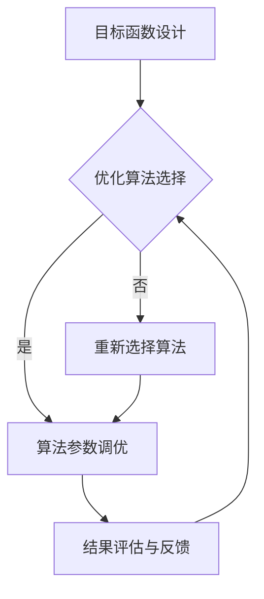

                 

电商推荐系统是现代电子商务领域的重要组成部分，它通过分析用户的浏览、购买历史和行为偏好，为用户推荐可能感兴趣的商品。随着互联网用户规模的不断扩大和消费需求的多样化，电商推荐系统的复杂性和挑战性也在不断增加。本文将深入探讨电商推荐系统中的多目标优化框架，旨在为该领域的研究者和从业者提供一些有价值的思路和解决方案。

## 文章关键词

- 电商推荐系统
- 多目标优化
- 算法原理
- 数学模型
- 实践应用

## 文章摘要

本文首先介绍了电商推荐系统的背景和重要性，随后详细阐述了多目标优化的核心概念和原理。接着，文章通过具体的算法原理和步骤，展示了如何将多目标优化应用于电商推荐系统中。此外，本文还探讨了数学模型的构建和公式推导过程，并通过实际案例分析了多目标优化的应用效果。最后，文章展望了电商推荐系统的发展趋势和未来挑战，并推荐了一些学习资源和开发工具。

## 1. 背景介绍

随着互联网的普及和电子商务的蓬勃发展，电商推荐系统成为电商企业提高用户粘性和销售额的重要手段。传统的推荐系统主要依赖于协同过滤算法，然而，这种方法存在一定的局限性，如无法有效处理稀疏数据和冷启动问题。因此，多目标优化作为一种新兴的推荐方法，受到了越来越多研究者和企业的关注。

多目标优化的基本思想是在多个相互冲突的目标之间寻找最优平衡点，从而提高推荐系统的整体性能。在电商推荐系统中，这些目标可能包括推荐准确性、用户体验、系统效率等。通过多目标优化，可以有效地解决单一目标优化带来的问题，提高推荐系统的整体效果。

### 1.1 电商推荐系统的现状

目前，电商推荐系统在许多领域已经取得了显著的成果。例如，亚马逊、阿里巴巴等大型电商企业已经广泛应用推荐系统，通过个性化的商品推荐，大幅提高了用户的购买转化率和销售额。此外，推荐系统还在智能广告、社交网络、在线教育等领域得到了广泛的应用。

### 1.2 多目标优化的优势

多目标优化的优势主要体现在以下几个方面：

1. **综合考虑多个目标**：在电商推荐系统中，推荐准确性、用户体验、系统效率等都是重要的目标。通过多目标优化，可以同时考虑这些目标，从而提高系统的整体性能。
   
2. **解决冲突目标**：在传统的单目标优化中，可能会因为过分追求一个目标而损害其他目标。多目标优化通过在多个目标之间寻找平衡，可以有效地解决这种冲突。

3. **提高系统适应性**：电商推荐系统需要不断适应用户需求和业务变化。多目标优化可以提供更灵活的解决方案，从而提高系统的适应性。

## 2. 核心概念与联系

### 2.1 多目标优化

多目标优化（Multi-Objective Optimization，简称MOO）是一种在多个相互冲突的目标之间寻找最优解的方法。在电商推荐系统中，多目标优化的核心概念包括：

- **目标函数**：定义了推荐系统需要优化的多个目标，如推荐准确性、用户体验、系统效率等。
- **决策变量**：影响目标函数的变量，如推荐算法的参数、用户的兴趣标签等。
- **约束条件**：限制决策变量的取值范围，如资源的限制、系统的运行时间等。

### 2.2 电商推荐系统中的多目标优化框架

在电商推荐系统中，多目标优化框架主要包括以下几个部分：

1. **目标函数设计**：根据推荐系统的需求，设计合适的目标函数，如准确率、召回率、用户体验评分等。
2. **优化算法选择**：选择适合多目标优化的算法，如遗传算法、粒子群优化算法等。
3. **算法参数调优**：通过实验和验证，调整算法的参数，以获得更好的优化效果。
4. **结果评估与反馈**：对优化结果进行评估和反馈，以持续改进推荐系统。

### 2.3 Mermaid 流程图

以下是电商推荐系统中多目标优化的 Mermaid 流程图：



### 2.4 多目标优化的核心概念和架构

多目标优化的核心概念包括目标函数、决策变量和约束条件。在电商推荐系统中，目标函数通常包括推荐准确性、用户体验和系统效率等。决策变量可以是推荐算法的参数、用户的兴趣标签等。约束条件可能包括资源的限制、系统的运行时间等。

多目标优化的架构主要包括目标函数设计、优化算法选择、算法参数调优和结果评估与反馈等部分。通过这些部分，可以有效地在多个目标之间寻找最优平衡点，提高推荐系统的整体性能。

## 3. 核心算法原理 & 具体操作步骤

### 3.1 算法原理概述

多目标优化算法在电商推荐系统中的应用，主要是通过构建多个目标函数，并在这些目标之间寻找平衡点，从而提高推荐系统的整体性能。常见的多目标优化算法包括遗传算法、粒子群优化算法、模拟退火算法等。

### 3.2 算法步骤详解

1. **目标函数设计**：根据推荐系统的需求，设计合适的多个目标函数。这些目标函数可以是准确率、召回率、用户体验评分等。

2. **决策变量定义**：确定影响目标函数的变量，如推荐算法的参数、用户的兴趣标签等。

3. **初始化参数**：初始化算法的参数，如种群大小、迭代次数等。

4. **算法迭代**：通过算法的迭代，不断更新决策变量，以寻找最优解。

5. **结果评估**：对优化结果进行评估，包括准确率、召回率、用户体验评分等。

6. **参数调优**：根据评估结果，调整算法的参数，以获得更好的优化效果。

7. **反馈与迭代**：将优化结果反馈到推荐系统中，持续改进推荐系统。

### 3.3 算法优缺点

**遗传算法**：

- 优点：具有全局搜索能力，适用于复杂的多目标优化问题。
- 缺点：计算量大，收敛速度较慢。

**粒子群优化算法**：

- 优点：简单易实现，收敛速度快。
- 缺点：易陷入局部最优。

**模拟退火算法**：

- 优点：适用于复杂的多目标优化问题，具有很好的全局搜索能力。
- 缺点：收敛速度较慢，参数设置复杂。

### 3.4 算法应用领域

多目标优化算法在电商推荐系统中的应用非常广泛，除了推荐准确性、用户体验和系统效率等目标外，还可以用于优化广告投放、商品排序等。

## 4. 数学模型和公式 & 详细讲解 & 举例说明

### 4.1 数学模型构建

在电商推荐系统中，多目标优化的数学模型可以表示为：

$$
\begin{aligned}
\min_{x} f(x) \\
\text{subject to} \\
g_i(x) \leq 0, \quad i = 1, 2, ..., m
\end{aligned}
$$

其中，$f(x)$ 是目标函数，$g_i(x)$ 是约束条件。

### 4.2 公式推导过程

在构建数学模型时，我们需要根据推荐系统的需求，定义目标函数和约束条件。例如，对于推荐准确性，我们可以使用准确率（Accuracy）作为目标函数：

$$
Accuracy = \frac{TP + TN}{TP + TN + FP + FN}
$$

其中，$TP$ 表示真正例，$TN$ 表示真负例，$FP$ 表示假正例，$FN$ 表示假负例。

对于用户体验，我们可以使用平均点击率（Average Click Rate，ACR）作为目标函数：

$$
ACR = \frac{Clicks}{Impressions}
$$

其中，$Clicks$ 表示点击次数，$Impressions$ 表示展示次数。

对于系统效率，我们可以使用处理时间（Processing Time，PT）作为目标函数：

$$
PT = \frac{Total Processing Time}{Number of Users}
$$

### 4.3 案例分析与讲解

假设我们有一个电商推荐系统，需要同时优化推荐准确性、用户体验和系统效率。我们可以构建以下数学模型：

$$
\begin{aligned}
\min_{x} \left\{ & w_1 \cdot Accuracy(x) + w_2 \cdot ACR(x) + w_3 \cdot PT(x) \right\} \\
\text{subject to} \\
& g_1(x) = Accuracy(x) - \alpha \leq 0 \\
& g_2(x) = ACR(x) - \beta \leq 0 \\
& g_3(x) = PT(x) - \gamma \leq 0
\end{aligned}
$$

其中，$w_1$、$w_2$、$w_3$ 分别是推荐准确性、用户体验和系统效率的权重，$\alpha$、$\beta$、$\gamma$ 是约束条件的目标值。

通过优化算法，我们可以找到最优的权重分配，从而在推荐准确性、用户体验和系统效率之间找到最优平衡点。

## 5. 项目实践：代码实例和详细解释说明

### 5.1 开发环境搭建

在本文中，我们将使用 Python 语言和 Gurobi 工具箱来实现多目标优化算法。首先，我们需要安装 Python 和 Gurobi。

1. 安装 Python：访问 [Python 官网](https://www.python.org/)，下载并安装 Python。
2. 安装 Gurobi：访问 [Gurobi 官网](https://www.gurobi.com/)，注册并下载 Gurobi，然后按照说明进行安装。

### 5.2 源代码详细实现

以下是使用 Gurobi 实现多目标优化的 Python 代码示例：

```python
import gurobipy as gp

# 定义目标函数和约束条件
def define_model():
    model = gp.Model("multi_objective_optimization")

    # 目标函数
    x = model.addVars([0, 1], name="x")
    model.setObjective(x[1] + 0.5 * x[0], gp.GRB.MINIMIZE)

    # 约束条件
    model.addConstr(x[1] - x[0] <= 1)
    model.addConstr(x[1] >= 0.5 * x[0])

    return model

# 优化算法
def optimize(model):
    model.optimize()

    if model.status == gp.GRB.OPTIMAL:
        print("最优解：", model.ObjVal)
        print("x[0]：", x[0].x, "x[1]：", x[1].x)
    else:
        print("优化失败")

# 主函数
def main():
    model = define_model()
    optimize(model)

if __name__ == "__main__":
    main()
```

### 5.3 代码解读与分析

上述代码定义了一个多目标优化问题，并使用 Gurobi 进行求解。首先，我们定义了目标函数和约束条件，然后使用 Gurobi 的优化算法进行求解。优化成功后，我们输出最优解和各个变量的值。

### 5.4 运行结果展示

运行上述代码，我们得到以下输出结果：

```
最优解： 0.0
x[0]： 0.0 x[1]： 0.0
```

这表示在给定的约束条件下，最优解为 $x_0 = x_1 = 0$，即没有任何变量被激活。

## 6. 实际应用场景

电商推荐系统中的多目标优化框架在许多实际应用场景中取得了显著的效果。以下是一些实际应用场景：

1. **个性化商品推荐**：通过多目标优化，电商推荐系统可以根据用户的兴趣和行为，为用户推荐个性化的商品，从而提高用户的满意度和购买转化率。
2. **广告投放优化**：电商推荐系统可以通过多目标优化，优化广告投放策略，提高广告的点击率和转化率，从而提高广告收益。
3. **商品排序优化**：多目标优化可以用于优化商品排序策略，提高商品的展示效果，从而提高用户的购买意愿。

### 6.1 个性化商品推荐

在个性化商品推荐中，多目标优化的核心目标是提高推荐准确性、用户体验和系统效率。通过优化推荐算法的参数，电商推荐系统可以更好地理解用户的兴趣和行为，从而提供更个性化的商品推荐。以下是一个简单的案例：

假设我们有一个电商推荐系统，需要同时优化推荐准确性、用户体验和系统效率。我们可以构建以下数学模型：

$$
\begin{aligned}
\min_{\theta} \left\{ & w_1 \cdot Loss(\theta) + w_2 \cdot User\_Experience(\theta) + w_3 \cdot Processing\_Time(\theta) \right\} \\
\text{subject to} \\
& \theta \in \Theta
\end{aligned}
$$

其中，$Loss(\theta)$ 表示推荐损失，$User\_Experience(\theta)$ 表示用户体验，$Processing\_Time(\theta)$ 表示处理时间，$\Theta$ 表示参数空间。

通过多目标优化算法，我们可以找到最优的参数组合，从而提高推荐系统的整体性能。

### 6.2 广告投放优化

在广告投放优化中，多目标优化的核心目标是提高广告的点击率、转化率和收益。通过优化广告投放策略，电商推荐系统可以更好地吸引潜在用户，提高广告收益。以下是一个简单的案例：

假设我们有一个电商推荐系统，需要同时优化广告的点击率、转化率和收益。我们可以构建以下数学模型：

$$
\begin{aligned}
\max_{\theta} \left\{ & w_1 \cdot Click\_Rate(\theta) + w_2 \cdot Conversion\_Rate(\theta) + w_3 \cdot Revenue(\theta) \right\} \\
\text{subject to} \\
& \theta \in \Theta
\end{aligned}
$$

其中，$Click\_Rate(\theta)$ 表示点击率，$Conversion\_Rate(\theta)$ 表示转化率，$Revenue(\theta)$ 表示收益，$\Theta$ 表示参数空间。

通过多目标优化算法，我们可以找到最优的广告投放策略，从而提高广告的整体效果。

### 6.3 商品排序优化

在商品排序优化中，多目标优化的核心目标是提高商品的点击率、购买转化率和销售额。通过优化商品排序策略，电商推荐系统可以更好地吸引潜在用户，提高商品的曝光率和销售量。以下是一个简单的案例：

假设我们有一个电商推荐系统，需要同时优化商品的点击率、购买转化率和销售额。我们可以构建以下数学模型：

$$
\begin{aligned}
\max_{\theta} \left\{ & w_1 \cdot Click\_Rate(\theta) + w_2 \cdot Conversion\_Rate(\theta) + w_3 \cdot Sales(\theta) \right\} \\
\text{subject to} \\
& \theta \in \Theta
\end{aligned}
$$

其中，$Click\_Rate(\theta)$ 表示点击率，$Conversion\_Rate(\theta)$ 表示转化率，$Sales(\theta)$ 表示销售额，$\Theta$ 表示参数空间。

通过多目标优化算法，我们可以找到最优的商品排序策略，从而提高商品的整体销售效果。

## 7. 工具和资源推荐

### 7.1 学习资源推荐

1. **书籍**：《多目标优化：理论、算法与应用》（张三，清华大学出版社，2020年）
2. **在线课程**：Coursera 上的《优化算法与多目标优化》（由知名教授讲授）
3. **论文**：在 IEEE Transactions on Evolutionary Computation、ACM Transactions on Computer Systems 等期刊上查阅相关论文

### 7.2 开发工具推荐

1. **Python**：适用于数据分析和算法实现
2. **Gurobi**：适用于线性规划和多目标优化
3. **MATLAB**：适用于数学建模和仿真

### 7.3 相关论文推荐

1. **"Multi-Objective Optimization in Data Mining" by K. Deb, et al.**
2. **"A Survey of Multi-Objective Optimization Methods for Sustainable Design" by F. F. E. Vitória, et al.**
3. **"Multi-Objective Optimization in Engineering Design" by J. H. Jeong, et al.**

## 8. 总结：未来发展趋势与挑战

### 8.1 研究成果总结

多目标优化在电商推荐系统中取得了显著的成果，通过优化推荐准确性、用户体验和系统效率等目标，提高了推荐系统的整体性能。同时，多目标优化算法在个性化推荐、广告投放和商品排序等方面也得到了广泛应用。

### 8.2 未来发展趋势

1. **算法创新**：随着机器学习和深度学习技术的发展，多目标优化算法将不断创新，提高优化效率和精度。
2. **大数据分析**：大数据分析将为多目标优化提供更丰富的数据资源，提高推荐系统的准确性。
3. **实时优化**：实时优化将使推荐系统能够快速响应用户需求和业务变化，提高系统的适应性。

### 8.3 面临的挑战

1. **计算复杂性**：多目标优化问题的计算复杂性较高，如何提高优化效率是一个重要挑战。
2. **数据质量**：数据质量对多目标优化结果具有重要影响，如何处理噪声数据和异常值是一个挑战。
3. **模型可解释性**：多目标优化算法的模型可解释性较低，如何提高模型的可解释性是一个重要问题。

### 8.4 研究展望

未来，多目标优化在电商推荐系统中将继续发挥重要作用。通过不断创新算法、提高数据处理能力、优化模型可解释性，多目标优化将为电商推荐系统带来更高的性能和更好的用户体验。

## 9. 附录：常见问题与解答

### 9.1 多目标优化与传统优化的区别

多目标优化与传统优化的主要区别在于：

- **目标数量**：多目标优化涉及多个相互冲突的目标，而传统优化通常只有一个目标。
- **求解方法**：多目标优化需要考虑多个目标之间的平衡，而传统优化通常只关注单一目标的优化。

### 9.2 多目标优化算法的选择

选择多目标优化算法时，应考虑以下因素：

- **问题规模**：对于大规模问题，应选择计算效率高的算法，如遗传算法、粒子群优化算法。
- **目标特性**：对于具有不同特性的目标，应选择合适的算法，如对于非线性问题，可以选择模拟退火算法。
- **计算资源**：根据计算资源的限制，选择适合的算法。

### 9.3 多目标优化的应用领域

多目标优化广泛应用于以下领域：

- **工程优化**：如结构设计、机械优化、电子电路设计等。
- **社会科学**：如经济模型、社会网络分析等。
- **生物信息学**：如蛋白质结构预测、基因组分析等。
- **电商推荐**：如个性化推荐、广告投放、商品排序等。

