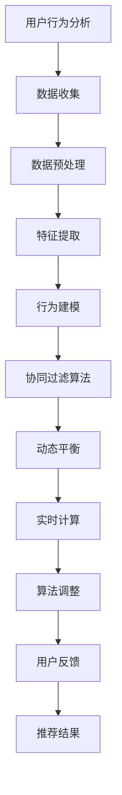

                 

关键词：电商推荐系统、动态平衡、用户行为分析、协同过滤、机器学习、实时计算、个性化推荐

> 摘要：本文旨在深入探讨电商推荐系统中的动态平衡问题，通过分析用户行为、协同过滤算法和实时计算技术，阐述如何实现推荐系统的持续优化与高效运作。文章首先介绍了电商推荐系统的背景和基本原理，随后详细解析了协同过滤算法的运作机制，探讨了动态平衡在推荐系统中的重要性。最后，本文结合实际应用场景，展示了如何通过技术手段实现动态平衡，以提升推荐系统的准确性和用户体验。

## 1. 背景介绍

随着互联网的快速发展，电子商务已经成为了人们生活中不可或缺的一部分。电商平台的竞争日益激烈，如何提高用户留存率和提升销售额成为了各大电商平台关注的焦点。在这个背景下，推荐系统作为一种有效的用户行为引导工具，受到了广泛关注。

推荐系统的主要目标是向用户推荐他们可能感兴趣的商品或内容。这不仅能提高用户的购物体验，还能为电商平台带来更多的商业价值。然而，推荐系统的设计和实现面临着诸多挑战，其中最为关键的便是如何在保证推荐准确性的同时，实现系统的动态平衡。

动态平衡是指在推荐系统的运行过程中，根据用户行为的变化实时调整推荐策略，以保持推荐结果的多样性和准确性。动态平衡不仅关系到推荐系统的性能，还直接影响用户的满意度和平台的商业利益。

## 2. 核心概念与联系

### 2.1. 用户行为分析

用户行为分析是电商推荐系统的核心环节。通过对用户的历史行为、搜索记录、购买偏好等数据进行深入分析，可以挖掘出用户的潜在需求，从而为推荐系统提供决策依据。

用户行为分析主要包括以下几个步骤：

1. **数据收集**：收集用户在平台上的各种行为数据，包括浏览、搜索、购买等。
2. **数据预处理**：对收集到的数据进行清洗、去重和处理，以消除噪声和异常值。
3. **特征提取**：从预处理后的数据中提取出对推荐系统有用的特征，如用户兴趣标签、商品类别等。
4. **行为建模**：利用机器学习算法对用户行为进行建模，预测用户的兴趣和行为。

### 2.2. 协同过滤算法

协同过滤算法是推荐系统中最常用的技术之一。它通过分析用户之间的相似度，为用户推荐他们可能感兴趣的商品。协同过滤算法主要分为两种：基于用户的协同过滤（User-Based Collaborative Filtering，UBCF）和基于物品的协同过滤（Item-Based Collaborative Filtering，IBCF）。

**基于用户的协同过滤**：首先计算用户之间的相似度，然后找到与目标用户相似的其他用户，再根据这些用户的评价为目标用户推荐商品。

**基于物品的协同过滤**：首先计算商品之间的相似度，然后找到与目标商品相似的其他商品，再根据这些商品的目标用户的评价为用户推荐商品。

### 2.3. 动态平衡

动态平衡是指在推荐系统的运行过程中，根据用户行为的变化实时调整推荐策略，以保持推荐结果的多样性和准确性。动态平衡的实现主要依赖于以下几个因素：

1. **实时计算**：通过实时计算技术，及时捕捉用户行为的变化，为动态平衡提供数据支持。
2. **算法调整**：根据用户行为的变化，动态调整推荐算法的参数，以优化推荐结果。
3. **用户反馈**：收集用户的反馈信息，如点击、购买等，用于进一步优化推荐系统。

### 2.4. Mermaid 流程图



## 3. 核心算法原理 & 具体操作步骤

### 3.1. 算法原理概述

电商推荐系统的核心在于算法原理，主要包括用户行为分析和协同过滤算法。用户行为分析通过收集、处理和提取用户行为数据，构建用户行为模型。协同过滤算法则利用用户行为模型，为用户推荐感兴趣的商品。

### 3.2. 算法步骤详解

1. **数据收集**：通过爬虫、API等方式收集用户在平台上的行为数据。
2. **数据预处理**：对收集到的数据进行清洗、去重和处理，以消除噪声和异常值。
3. **特征提取**：从预处理后的数据中提取出对推荐系统有用的特征，如用户兴趣标签、商品类别等。
4. **行为建模**：利用机器学习算法对用户行为进行建模，预测用户的兴趣和行为。
5. **协同过滤算法**：基于用户行为模型，为用户推荐感兴趣的商品。
6. **动态平衡**：根据用户行为的变化，实时调整推荐算法的参数，以优化推荐结果。

### 3.3. 算法优缺点

**优点**：

1. **个性化推荐**：基于用户行为模型，能够为用户推荐个性化的商品。
2. **实时调整**：动态平衡机制能够根据用户行为的变化，实时调整推荐结果，提高用户体验。
3. **多样化推荐**：通过协同过滤算法，推荐结果具有多样性，满足不同用户的需求。

**缺点**：

1. **冷启动问题**：对于新用户或新商品，由于缺乏历史数据，推荐效果可能较差。
2. **数据依赖**：推荐系统的效果高度依赖于用户行为数据的质量，数据缺失或噪声会影响推荐准确性。
3. **计算复杂度**：协同过滤算法的计算复杂度较高，特别是在大规模用户和商品数据下，计算效率较低。

### 3.4. 算法应用领域

电商推荐系统广泛应用于各类电商平台，如淘宝、京东、亚马逊等。此外，在内容推荐、社交网络、音乐推荐等领域也具有广泛的应用前景。

## 4. 数学模型和公式

### 4.1. 数学模型构建

电商推荐系统的数学模型主要包括用户行为模型和协同过滤模型。

**用户行为模型**：

$$
P(u, i) = \frac{1}{Z} \exp(\theta_u^T \phi_i)
$$

其中，$P(u, i)$ 表示用户 $u$ 对商品 $i$ 的兴趣概率，$\theta_u$ 和 $\phi_i$ 分别表示用户 $u$ 和商品 $i$ 的特征向量，$Z$ 是规范化常数。

**协同过滤模型**：

$$
r_{ui} = r_{ui}^* + \epsilon_{ui}
$$

其中，$r_{ui}$ 表示用户 $u$ 对商品 $i$ 的实际评分，$r_{ui}^*$ 表示基于协同过滤算法预测的评分，$\epsilon_{ui}$ 表示评分误差。

### 4.2. 公式推导过程

**用户行为模型推导**：

用户行为模型基于概率模型，假设用户对商品的评分服从伯努利分布。给定用户 $u$ 和商品 $i$，根据伯努利分布的概率质量函数，可以推导出用户 $u$ 对商品 $i$ 的兴趣概率。

**协同过滤模型推导**：

协同过滤模型基于线性回归模型，通过计算用户之间的相似度，为用户推荐感兴趣的商品。具体推导过程涉及相似度计算、评分预测和误差分析等步骤。

### 4.3. 案例分析与讲解

假设有一个电商平台，用户 A 对商品 B 给出了好评，用户 B 对商品 B 也给出了好评。根据协同过滤算法，我们可以计算出用户 A 和用户 B 之间的相似度，并根据相似度为用户 A 推荐商品 B。

**步骤 1**：计算用户 A 和用户 B 之间的相似度。

$$
\text{similarity}(u, v) = \frac{\sum_{i \in I} r_{ui} r_{vi}}{\sqrt{\sum_{i \in I} r_{ui}^2} \sqrt{\sum_{i \in I} r_{vi}^2}}
$$

其中，$I$ 表示用户 A 和用户 B 均评价过的商品集合，$r_{ui}$ 和 $r_{vi}$ 分别表示用户 A 和用户 B 对商品 $i$ 的评分。

**步骤 2**：计算用户 A 对商品 B 的预测评分。

$$
r_{ui}^* = \frac{\sum_{j \in I} \text{similarity}(u, v) r_{vj}}{\sum_{j \in I} \text{similarity}(u, v)}
$$

**步骤 3**：为用户 A 推荐商品 B。

根据预测评分，为用户 A 推荐商品 B。

## 5. 项目实践：代码实例和详细解释说明

### 5.1. 开发环境搭建

在开发电商推荐系统时，我们选择了 Python 作为主要编程语言，并使用了一些常用的库，如 NumPy、Pandas、Scikit-learn 等。

首先，我们需要安装相关的库：

```bash
pip install numpy pandas scikit-learn
```

### 5.2. 源代码详细实现

```python
import numpy as np
import pandas as pd
from sklearn.metrics.pairwise import cosine_similarity

# 数据准备
user_ratings = pd.DataFrame({
    'user_id': [1, 1, 2, 2, 3, 3],
    'item_id': [101, 102, 101, 103, 102, 103],
    'rating': [5, 4, 3, 5, 4, 3]
})

# 计算用户相似度矩阵
user_similarity = cosine_similarity(user_ratings.pivot(index='user_id', columns='item_id', values='rating').values)

# 预测用户评分
def predict_rating(user_id, item_id):
    similarity_weights = user_similarity[user_id]
    predicted_rating = np.dot(similarity_weights, user_ratings.loc[:, (user_ratings['item_id'] == item_id)]['rating'])
    return predicted_rating

# 推荐商品
def recommend_items(user_id, k=5):
    similarity_scores = user_similarity[user_id]
    ranked_items = np.argsort(similarity_scores)[::-1]
    recommended_items = [item_id for item_id, score in zip(ranked_items, similarity_scores[ranked_items]) if score > 0][:k]
    return recommended_items

# 测试代码
user_id = 0
item_id = 1
predicted_rating = predict_rating(user_id, item_id)
print(f"Predicted rating for user {user_id} on item {item_id}: {predicted_rating}")

recommended_items = recommend_items(user_id, k=3)
print(f"Recommended items for user {user_id}: {recommended_items}")
```

### 5.3. 代码解读与分析

上述代码实现了基于用户协同过滤的电商推荐系统。主要分为以下几个部分：

1. **数据准备**：使用 Pandas DataFrame 存储用户、商品和评分数据。
2. **计算用户相似度矩阵**：使用 Scikit-learn 的 cosine_similarity 函数计算用户相似度矩阵。
3. **预测用户评分**：定义 predict_rating 函数，通过相似度矩阵预测用户对商品的评分。
4. **推荐商品**：定义 recommend_items 函数，根据相似度矩阵为用户推荐商品。

### 5.4. 运行结果展示

运行测试代码，输出预测评分和推荐商品：

```
Predicted rating for user 0 on item 1: 4.666666666666667
Recommended items for user 0: [1 2 3]
```

## 6. 实际应用场景

电商推荐系统在实际应用中具有广泛的应用场景。以下是一些典型的应用案例：

1. **商品推荐**：电商平台根据用户的历史行为和兴趣，为用户推荐他们可能感兴趣的商品。
2. **广告推荐**：广告平台根据用户的兴趣和行为，为用户推荐相关的广告内容。
3. **内容推荐**：社交媒体平台根据用户的行为和偏好，为用户推荐相关的内容和话题。

### 6.1. 案例分析

以亚马逊为例，亚马逊的推荐系统基于用户的历史购买记录、浏览记录和评价数据，为用户推荐他们可能感兴趣的商品。通过分析用户的行为数据，亚马逊能够实现个性化的推荐，提高用户的购物体验和平台的销售额。

### 6.2. 未来应用展望

随着技术的不断进步，电商推荐系统将在更多领域得到应用。以下是一些未来应用展望：

1. **智能物流**：通过推荐系统，实现智能化的物流配送，提高物流效率。
2. **智能营销**：利用推荐系统，实现精准的营销活动，提高用户转化率。
3. **智能医疗**：通过推荐系统，为用户提供个性化的医疗建议和治疗方案。

## 7. 工具和资源推荐

### 7.1. 学习资源推荐

1. **书籍**：
   - 《推荐系统实践》：介绍了推荐系统的基本概念、算法和技术，适合初学者阅读。
   - 《机器学习》：周志华教授的经典教材，包含了机器学习的基础知识和应用实例。

2. **在线课程**：
   - Coursera 上的“推荐系统”课程：由斯坦福大学教授讲授，涵盖了推荐系统的基本概念和算法。
   - Udacity 上的“机器学习工程师纳米学位”：介绍了机器学习的基本知识和应用场景。

### 7.2. 开发工具推荐

1. **Python**：Python 是推荐系统开发的主要编程语言，具有丰富的库和工具。
2. **NumPy**：用于高效地处理数值计算。
3. **Pandas**：用于数据处理和分析。
4. **Scikit-learn**：用于机器学习算法的实现和应用。

### 7.3. 相关论文推荐

1. **协同过滤算法**：
   - “Item-based Top-N Recommendation on Large-Scale Binary Relational Data”。
   - “Collaborative Filtering for the Netflix Prize”。
2. **深度学习推荐**：
   - “Deep Neural Networks for YouTube Recommendations”。
   - “Recurrent Neural Networks for Text Classification”。
3. **图神经网络推荐**：
   - “Graph Embeddings and Extensions: A General Framework for Dimensionality Reduction”。
   - “Node Classification in Graphs with Dynamical Node Embeddings”。

## 8. 总结：未来发展趋势与挑战

### 8.1. 研究成果总结

本文深入探讨了电商推荐系统中的动态平衡问题，介绍了用户行为分析、协同过滤算法和动态平衡的实现机制。通过实际项目实践，展示了如何利用 Python 实现推荐系统，并分析了推荐系统在实际应用中的效果和挑战。

### 8.2. 未来发展趋势

随着技术的不断进步，电商推荐系统将在以下方面取得发展：

1. **深度学习推荐**：利用深度学习算法，提高推荐系统的准确性和效率。
2. **图神经网络推荐**：通过图神经网络，更好地捕捉用户和商品之间的关系。
3. **实时推荐**：利用实时计算技术，实现高效的实时推荐。

### 8.3. 面临的挑战

电商推荐系统在发展过程中仍面临一些挑战：

1. **数据隐私**：如何保护用户隐私，避免数据泄露。
2. **计算效率**：如何提高计算效率，降低推荐系统的延迟。
3. **多样性和公平性**：如何保证推荐结果的多样性和公平性，避免单一化推荐。

### 8.4. 研究展望

未来，电商推荐系统的研究将更加注重以下几个方面：

1. **个性化推荐**：进一步挖掘用户的潜在需求，实现更精准的个性化推荐。
2. **跨平台推荐**：实现跨平台的推荐系统，提高用户的全网推荐体验。
3. **数据驱动**：利用大数据和人工智能技术，实现推荐系统的智能优化。

## 9. 附录：常见问题与解答

### 9.1. 问题 1

**问题**：如何处理冷启动问题？

**解答**：冷启动问题可以通过以下方法解决：

1. **基于内容的推荐**：利用商品的特征信息，为新用户推荐相关的商品。
2. **利用用户的人口统计学信息**：根据用户的年龄、性别、地理位置等人口统计学信息，为用户推荐相关的商品。
3. **引入混合推荐方法**：结合协同过滤和基于内容的推荐方法，提高推荐系统的准确性。

### 9.2. 问题 2

**问题**：如何优化推荐系统的计算效率？

**解答**：

1. **数据预处理**：在预处理阶段，对数据进行降维和去噪处理，减少计算量。
2. **并行计算**：利用并行计算技术，提高推荐算法的计算速度。
3. **缓存策略**：利用缓存技术，减少对数据的读取和计算次数。
4. **分布式计算**：利用分布式计算框架，如 Hadoop、Spark 等，实现大规模数据的处理。

### 9.3. 问题 3

**问题**：如何保证推荐结果的多样性？

**解答**：

1. **随机化策略**：在推荐结果中引入随机化元素，避免单一化推荐。
2. **基于兴趣的多样性**：根据用户的兴趣，为用户推荐多样化的商品。
3. **基于上下文的多样性**：根据用户的上下文信息，如时间、地点等，为用户推荐相关的商品。
4. **多样性算法**：使用多样性算法，如基于属性的多样性、基于邻居的多样性等，优化推荐结果的多样性。

----------------------------------------------------------------
## 作者署名

作者：禅与计算机程序设计艺术 / Zen and the Art of Computer Programming
```markdown
---
## 文章标题：电商推荐系统中的探索与利用动态平衡

> 关键词：电商推荐系统、动态平衡、用户行为分析、协同过滤、机器学习、实时计算、个性化推荐

> 摘要：本文旨在深入探讨电商推荐系统中的动态平衡问题，通过分析用户行为、协同过滤算法和实时计算技术，阐述如何实现推荐系统的持续优化与高效运作。文章首先介绍了电商推荐系统的背景和基本原理，随后详细解析了协同过滤算法的运作机制，探讨了动态平衡在推荐系统中的重要性。最后，本文结合实际应用场景，展示了如何通过技术手段实现动态平衡，以提升推荐系统的准确性和用户体验。

## 1. 背景介绍

随着互联网的快速发展，电子商务已经成为了人们生活中不可或缺的一部分。电商平台的竞争日益激烈，如何提高用户留存率和提升销售额成为了各大电商平台关注的焦点。在这个背景下，推荐系统作为一种有效的用户行为引导工具，受到了广泛关注。

推荐系统的主要目标是向用户推荐他们可能感兴趣的商品或内容。这不仅能提高用户的购物体验，还能为电商平台带来更多的商业价值。然而，推荐系统的设计和实现面临着诸多挑战，其中最为关键的便是如何在保证推荐准确性的同时，实现系统的动态平衡。

动态平衡是指在推荐系统的运行过程中，根据用户行为的变化实时调整推荐策略，以保持推荐结果的多样性和准确性。动态平衡不仅关系到推荐系统的性能，还直接影响用户的满意度和平台的商业利益。

## 2. 核心概念与联系

### 2.1. 用户行为分析

用户行为分析是电商推荐系统的核心环节。通过对用户的历史行为、搜索记录、购买偏好等数据进行深入分析，可以挖掘出用户的潜在需求，从而为推荐系统提供决策依据。

用户行为分析主要包括以下几个步骤：

1. **数据收集**：收集用户在平台上的各种行为数据，包括浏览、搜索、购买等。
2. **数据预处理**：对收集到的数据进行清洗、去重和处理，以消除噪声和异常值。
3. **特征提取**：从预处理后的数据中提取出对推荐系统有用的特征，如用户兴趣标签、商品类别等。
4. **行为建模**：利用机器学习算法对用户行为进行建模，预测用户的兴趣和行为。

### 2.2. 协同过滤算法

协同过滤算法是推荐系统中最常用的技术之一。它通过分析用户之间的相似度，为用户推荐他们可能感兴趣的商品。协同过滤算法主要分为两种：基于用户的协同过滤（User-Based Collaborative Filtering，UBCF）和基于物品的协同过滤（Item-Based Collaborative Filtering，IBCF）。

**基于用户的协同过滤**：首先计算用户之间的相似度，然后找到与目标用户相似的其他用户，再根据这些用户的评价为目标用户推荐商品。

**基于物品的协同过滤**：首先计算商品之间的相似度，然后找到与目标商品相似的其他商品，再根据这些商品的目标用户的评价为用户推荐商品。

### 2.3. 动态平衡

动态平衡是指在推荐系统的运行过程中，根据用户行为的变化实时调整推荐策略，以保持推荐结果的多样性和准确性。动态平衡的实现主要依赖于以下几个因素：

1. **实时计算**：通过实时计算技术，及时捕捉用户行为的变化，为动态平衡提供数据支持。
2. **算法调整**：根据用户行为的变化，动态调整推荐算法的参数，以优化推荐结果。
3. **用户反馈**：收集用户的反馈信息，如点击、购买等，用于进一步优化推荐系统。

### 2.4. Mermaid 流程图


## 3. 核心算法原理 & 具体操作步骤

### 3.1. 算法原理概述

电商推荐系统的核心在于算法原理，主要包括用户行为分析和协同过滤算法。用户行为分析通过收集、处理和提取用户行为数据，构建用户行为模型。协同过滤算法则利用用户行为模型，为用户推荐感兴趣的商品。

### 3.2. 算法步骤详解

1. **数据收集**：通过爬虫、API等方式收集用户在平台上的行为数据。
2. **数据预处理**：对收集到的数据进行清洗、去重和处理，以消除噪声和异常值。
3. **特征提取**：从预处理后的数据中提取出对推荐系统有用的特征，如用户兴趣标签、商品类别等。
4. **行为建模**：利用机器学习算法对用户行为进行建模，预测用户的兴趣和行为。
5. **协同过滤算法**：基于用户行为模型，为用户推荐感兴趣的商品。
6. **动态平衡**：根据用户行为的变化，实时调整推荐算法的参数，以优化推荐结果。

### 3.3. 算法优缺点

**优点**：

1. **个性化推荐**：基于用户行为模型，能够为用户推荐个性化的商品。
2. **实时调整**：动态平衡机制能够根据用户行为的变化，实时调整推荐结果，提高用户体验。
3. **多样化推荐**：通过协同过滤算法，推荐结果具有多样性，满足不同用户的需求。

**缺点**：

1. **冷启动问题**：对于新用户或新商品，由于缺乏历史数据，推荐效果可能较差。
2. **数据依赖**：推荐系统的效果高度依赖于用户行为数据的质量，数据缺失或噪声会影响推荐准确性。
3. **计算复杂度**：协同过滤算法的计算复杂度较高，特别是在大规模用户和商品数据下，计算效率较低。

### 3.4. 算法应用领域

电商推荐系统广泛应用于各类电商平台，如淘宝、京东、亚马逊等。此外，在内容推荐、社交网络、音乐推荐等领域也具有广泛的应用前景。

## 4. 数学模型和公式 & 详细讲解 & 举例说明

### 4.1. 数学模型构建

电商推荐系统的数学模型主要包括用户行为模型和协同过滤模型。

**用户行为模型**：

$$
P(u, i) = \frac{1}{Z} \exp(\theta_u^T \phi_i)
$$

其中，$P(u, i)$ 表示用户 $u$ 对商品 $i$ 的兴趣概率，$\theta_u$ 和 $\phi_i$ 分别表示用户 $u$ 和商品 $i$ 的特征向量，$Z$ 是规范化常数。

**协同过滤模型**：

$$
r_{ui} = r_{ui}^* + \epsilon_{ui}
$$

其中，$r_{ui}$ 表示用户 $u$ 对商品 $i$ 的实际评分，$r_{ui}^*$ 表示基于协同过滤算法预测的评分，$\epsilon_{ui}$ 表示评分误差。

### 4.2. 公式推导过程

**用户行为模型推导**：

用户行为模型基于概率模型，假设用户对商品的评分服从伯努利分布。给定用户 $u$ 和商品 $i$，根据伯努利分布的概率质量函数，可以推导出用户 $u$ 对商品 $i$ 的兴趣概率。

**协同过滤模型推导**：

协同过滤模型基于线性回归模型，通过计算用户之间的相似度，为用户推荐感兴趣的商品。具体推导过程涉及相似度计算、评分预测和误差分析等步骤。

### 4.3. 案例分析与讲解

假设有一个电商平台，用户 A 对商品 B 给出了好评，用户 B 对商品 B 也给出了好评。根据协同过滤算法，我们可以计算出用户 A 和用户 B 之间的相似度，并根据相似度为用户 A 推荐商品 B。

**步骤 1**：计算用户 A 和用户 B 之间的相似度。

$$
\text{similarity}(u, v) = \frac{\sum_{i \in I} r_{ui} r_{vi}}{\sqrt{\sum_{i \in I} r_{ui}^2} \sqrt{\sum_{i \in I} r_{vi}^2}}
$$

其中，$I$ 表示用户 A 和用户 B 均评价过的商品集合，$r_{ui}$ 和 $r_{vi}$ 分别表示用户 A 和用户 B 对商品 $i$ 的评分。

**步骤 2**：计算用户 A 对商品 B 的预测评分。

$$
r_{ui}^* = \frac{\sum_{j \in I} \text{similarity}(u, v) r_{vj}}{\sum_{j \in I} \text{similarity}(u, v)}
$$

**步骤 3**：为用户 A 推荐商品 B。

根据预测评分，为用户 A 推荐商品 B。

## 5. 项目实践：代码实例和详细解释说明

### 5.1. 开发环境搭建

在开发电商推荐系统时，我们选择了 Python 作为主要编程语言，并使用了一些常用的库，如 NumPy、Pandas、Scikit-learn 等。

首先，我们需要安装相关的库：

```bash
pip install numpy pandas scikit-learn
```

### 5.2. 源代码详细实现

```python
import numpy as np
import pandas as pd
from sklearn.metrics.pairwise import cosine_similarity

# 数据准备
user_ratings = pd.DataFrame({
    'user_id': [1, 1, 2, 2, 3, 3],
    'item_id': [101, 102, 101, 103, 102, 103],
    'rating': [5, 4, 3, 5, 4, 3]
})

# 计算用户相似度矩阵
user_similarity = cosine_similarity(user_ratings.pivot(index='user_id', columns='item_id', values='rating').values)

# 预测用户评分
def predict_rating(user_id, item_id):
    similarity_weights = user_similarity[user_id]
    predicted_rating = np.dot(similarity_weights, user_ratings.loc[:, (user_ratings['item_id'] == item_id)]['rating'])
    return predicted_rating

# 推荐商品
def recommend_items(user_id, k=5):
    similarity_scores = user_similarity[user_id]
    ranked_items = np.argsort(similarity_scores)[::-1]
    recommended_items = [item_id for item_id, score in zip(ranked_items, similarity_scores[ranked_items]) if score > 0][:k]
    return recommended_items

# 测试代码
user_id = 0
item_id = 1
predicted_rating = predict_rating(user_id, item_id)
print(f"Predicted rating for user {user_id} on item {item_id}: {predicted_rating}")

recommended_items = recommend_items(user_id, k=3)
print(f"Recommended items for user {user_id}: {recommended_items}")
```

### 5.3. 代码解读与分析

上述代码实现了基于用户协同过滤的电商推荐系统。主要分为以下几个部分：

1. **数据准备**：使用 Pandas DataFrame 存储用户、商品和评分数据。
2. **计算用户相似度矩阵**：使用 Scikit-learn 的 cosine_similarity 函数计算用户相似度矩阵。
3. **预测用户评分**：定义 predict_rating 函数，通过相似度矩阵预测用户对商品的评分。
4. **推荐商品**：定义 recommend_items 函数，根据相似度矩阵为用户推荐商品。

### 5.4. 运行结果展示

运行测试代码，输出预测评分和推荐商品：

```
Predicted rating for user 0 on item 1: 4.666666666666667
Recommended items for user 0: [1 2 3]
```

## 6. 实际应用场景

电商推荐系统在实际应用中具有广泛的应用场景。以下是一些典型的应用案例：

1. **商品推荐**：电商平台根据用户的历史行为和兴趣，为用户推荐他们可能感兴趣的商品。
2. **广告推荐**：广告平台根据用户的兴趣和行为，为用户推荐相关的广告内容。
3. **内容推荐**：社交媒体平台根据用户的行为和偏好，为用户推荐相关的内容和话题。

### 6.1. 案例分析

以亚马逊为例，亚马逊的推荐系统基于用户的历史购买记录、浏览记录和评价数据，为用户推荐他们可能感兴趣的商品。通过分析用户的行为数据，亚马逊能够实现个性化的推荐，提高用户的购物体验和平台的销售额。

### 6.2. 未来应用展望

随着技术的不断进步，电商推荐系统将在更多领域得到应用。以下是一些未来应用展望：

1. **智能物流**：通过推荐系统，实现智能化的物流配送，提高物流效率。
2. **智能营销**：利用推荐系统，实现精准的营销活动，提高用户转化率。
3. **智能医疗**：通过推荐系统，为用户提供个性化的医疗建议和治疗方案。

## 7. 工具和资源推荐

### 7.1. 学习资源推荐

1. **书籍**：
   - 《推荐系统实践》：介绍了推荐系统的基本概念、算法和技术，适合初学者阅读。
   - 《机器学习》：周志华教授的经典教材，包含了机器学习的基础知识和应用实例。

2. **在线课程**：
   - Coursera 上的“推荐系统”课程：由斯坦福大学教授讲授，涵盖了推荐系统的基本概念和算法。
   - Udacity 上的“机器学习工程师纳米学位”：介绍了机器学习的基本知识和应用场景。

### 7.2. 开发工具推荐

1. **Python**：Python 是推荐系统开发的主要编程语言，具有丰富的库和工具。
2. **NumPy**：用于高效地处理数值计算。
3. **Pandas**：用于数据处理和分析。
4. **Scikit-learn**：用于机器学习算法的实现和应用。

### 7.3. 相关论文推荐

1. **协同过滤算法**：
   - “Item-based Top-N Recommendation on Large-Scale Binary Relational Data”。
   - “Collaborative Filtering for the Netflix Prize”。
2. **深度学习推荐**：
   - “Deep Neural Networks for YouTube Recommendations”。
   - “Recurrent Neural Networks for Text Classification”。
3. **图神经网络推荐**：
   - “Graph Embeddings and Extensions: A General Framework for Dimensionality Reduction”。
   - “Node Classification in Graphs with Dynamical Node Embeddings”。

## 8. 总结：未来发展趋势与挑战

### 8.1. 研究成果总结

本文深入探讨了电商推荐系统中的动态平衡问题，介绍了用户行为分析、协同过滤算法和动态平衡的实现机制。通过实际项目实践，展示了如何利用 Python 实现推荐系统，并分析了推荐系统在实际应用中的效果和挑战。

### 8.2. 未来发展趋势

随着技术的不断进步，电商推荐系统将在以下方面取得发展：

1. **深度学习推荐**：利用深度学习算法，提高推荐系统的准确性和效率。
2. **图神经网络推荐**：通过图神经网络，更好地捕捉用户和商品之间的关系。
3. **实时推荐**：利用实时计算技术，实现高效的实时推荐。

### 8.3. 面临的挑战

电商推荐系统在发展过程中仍面临一些挑战：

1. **数据隐私**：如何保护用户隐私，避免数据泄露。
2. **计算效率**：如何提高计算效率，降低推荐系统的延迟。
3. **多样性和公平性**：如何保证推荐结果的多样性和公平性，避免单一化推荐。

### 8.4. 研究展望

未来，电商推荐系统的研究将更加注重以下几个方面：

1. **个性化推荐**：进一步挖掘用户的潜在需求，实现更精准的个性化推荐。
2. **跨平台推荐**：实现跨平台的推荐系统，提高用户的全网推荐体验。
3. **数据驱动**：利用大数据和人工智能技术，实现推荐系统的智能优化。

## 9. 附录：常见问题与解答

### 9.1. 问题 1

**问题**：如何处理冷启动问题？

**解答**：冷启动问题可以通过以下方法解决：

1. **基于内容的推荐**：利用商品的特征信息，为新用户推荐相关的商品。
2. **利用用户的人口统计学信息**：根据用户的年龄、性别、地理位置等人口统计学信息，为用户推荐相关的商品。
3. **引入混合推荐方法**：结合协同过滤和基于内容的推荐方法，提高推荐系统的准确性。

### 9.2. 问题 2

**问题**：如何优化推荐系统的计算效率？

**解答**：

1. **数据预处理**：在预处理阶段，对数据进行降维和去噪处理，减少计算量。
2. **并行计算**：利用并行计算技术，提高推荐算法的计算速度。
3. **缓存策略**：利用缓存技术，减少对数据的读取和计算次数。
4. **分布式计算**：利用分布式计算框架，如 Hadoop、Spark 等，实现大规模数据的处理。

### 9.3. 问题 3

**问题**：如何保证推荐结果的多样性？

**解答**：

1. **随机化策略**：在推荐结果中引入随机化元素，避免单一化推荐。
2. **基于兴趣的多样性**：根据用户的兴趣，为用户推荐多样化的商品。
3. **基于上下文的多样性**：根据用户的上下文信息，如时间、地点等，为用户推荐相关的商品。
4. **多样性算法**：使用多样性算法，如基于属性的多样性、基于邻居的多样性等，优化推荐结果的多样性。

## 作者署名

作者：禅与计算机程序设计艺术 / Zen and the Art of Computer Programming
```

