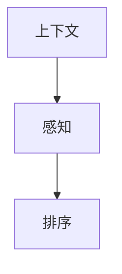

                 

随着电子商务的迅猛发展，电商平台的搜索功能已成为用户发现商品的重要途径。然而，传统基于关键词匹配的搜索排序方法难以满足用户个性化的购物需求。本文将探讨电商搜索中的上下文感知排序优化，旨在提高搜索结果的准确性和用户体验。

> 关键词：电商搜索、上下文感知、排序优化、个性化推荐、机器学习

> 摘要：本文首先介绍了电商搜索的背景和传统排序方法的局限性，然后重点阐述了上下文感知排序优化的核心概念、算法原理和数学模型。通过具体案例和代码实例，本文展示了如何在实际项目中实现上下文感知排序优化，并分析了其应用场景和未来发展趋势。

## 1. 背景介绍

### 1.1 电商搜索现状

随着互联网技术的快速发展，电子商务在全球范围内取得了巨大的成功。电商平台的兴起不仅改变了人们的购物方式，还带来了大量的商业机会。据统计，全球电商市场规模在过去几年中持续增长，预计未来几年仍将保持快速增长趋势。

在电商平台上，搜索功能是用户发现商品的主要途径。一个高效的搜索系统不仅能够提高用户满意度，还能为电商平台带来更多的商业价值。因此，如何提升搜索排序的准确性，提供个性化的搜索结果，成为电商搜索系统研究和优化的重要方向。

### 1.2 传统排序方法的局限性

目前，大多数电商平台采用的搜索排序方法主要基于关键词匹配和基于流行度的排序。这些方法虽然在一定程度上能够提高搜索结果的准确性，但存在以下局限性：

1. **缺乏上下文感知**：传统排序方法主要依赖用户输入的关键词，无法充分利用用户的历史行为、偏好等信息，导致搜索结果可能不符合用户期望。
2. **不考虑用户个性化需求**：不同用户在购物时的需求和偏好可能存在显著差异，传统排序方法难以根据用户个性化需求提供个性化的搜索结果。
3. **受数据质量影响大**：传统排序方法对数据质量要求较高，当数据存在噪声或缺失时，排序效果会显著下降。

### 1.3 上下文感知排序优化

为解决传统排序方法的局限性，近年来出现了许多上下文感知排序优化方法。上下文感知排序利用用户历史行为、偏好、环境信息等上下文信息，对搜索结果进行优化排序，提高搜索结果的准确性和个性化程度。本文将重点探讨以下内容：

1. **核心概念与联系**：介绍上下文感知排序的相关核心概念，包括上下文、感知、排序等，并使用 Mermaid 流程图展示其关系。
2. **核心算法原理 & 具体操作步骤**：详细解释上下文感知排序的算法原理和具体操作步骤，包括算法步骤详解、优缺点分析及其应用领域。
3. **数学模型和公式 & 详细讲解 & 举例说明**：构建上下文感知排序的数学模型，推导相关公式，并通过案例分析和讲解，阐述模型在实际应用中的效果。
4. **项目实践：代码实例和详细解释说明**：提供具体代码实例，展示如何在实际项目中实现上下文感知排序优化，并进行分析和解读。
5. **实际应用场景**：分析上下文感知排序在不同电商场景中的应用，探讨其优势和挑战。
6. **未来应用展望**：探讨上下文感知排序优化的未来发展趋势和应用前景。

## 2. 核心概念与联系

### 2.1 上下文

上下文是指信息发生的环境或背景。在电商搜索中，上下文包括用户历史行为、偏好、购物环境等。上下文信息有助于了解用户的需求和意图，从而提高搜索结果的准确性。

### 2.2 感知

感知是指系统根据上下文信息对数据进行分析和处理，以理解用户意图和需求。在上下文感知排序中，感知过程包括数据采集、特征提取和上下文信息融合等步骤。

### 2.3 排序

排序是指根据某种规则对数据进行排序，以提供最优的搜索结果。在上下文感知排序中，排序规则会根据上下文信息进行调整，以提高搜索结果的准确性和个性化程度。

### 2.4 Mermaid 流程图

以下是一个简单的 Mermaid 流程图，展示了上下文、感知和排序之间的关系：



在上面的流程图中，上下文信息（A）通过感知过程（B）被处理和分析，最终用于排序（C），以提供个性化的搜索结果。

## 3. 核心算法原理 & 具体操作步骤

### 3.1 算法原理概述

上下文感知排序的核心思想是利用用户历史行为、偏好和环境信息等上下文信息，对搜索结果进行优化排序。具体步骤如下：

1. **数据采集**：收集用户的历史行为数据，如浏览记录、购买记录、搜索记录等。
2. **特征提取**：对采集到的数据进行处理，提取与上下文相关的特征，如商品类别、品牌、价格、销量等。
3. **上下文信息融合**：将提取到的特征与上下文信息进行融合，构建一个综合的上下文向量。
4. **排序模型训练**：利用训练数据，训练一个排序模型，如基于机器学习的排序算法（如排序网络、排序机等）。
5. **排序结果输出**：根据训练好的排序模型，对新的搜索结果进行排序，输出个性化的搜索结果。

### 3.2 算法步骤详解

1. **数据采集**：
   - 获取用户历史行为数据，如浏览记录、购买记录、搜索记录等。
   - 对数据进行清洗和预处理，去除噪声和缺失值。

2. **特征提取**：
   - 对用户历史行为数据进行处理，提取与上下文相关的特征，如商品类别、品牌、价格、销量等。
   - 对提取到的特征进行量化，以便后续处理。

3. **上下文信息融合**：
   - 将提取到的特征与上下文信息进行融合，构建一个综合的上下文向量。
   - 可以采用加权融合方法，根据上下文信息的重要程度，对特征进行加权处理。

4. **排序模型训练**：
   - 利用训练数据，训练一个排序模型，如基于机器学习的排序算法（如排序网络、排序机等）。
   - 选择合适的损失函数和优化算法，对模型进行训练。

5. **排序结果输出**：
   - 根据训练好的排序模型，对新的搜索结果进行排序，输出个性化的搜索结果。

### 3.3 算法优缺点

**优点**：

1. **提高搜索结果准确性**：利用上下文信息，能够更准确地预测用户意图和需求，提高搜索结果的准确性。
2. **实现个性化推荐**：根据用户历史行为和偏好，提供个性化的搜索结果，提高用户体验。
3. **适应性强**：能够根据不同用户的需求和偏好，动态调整排序规则，适应不同的应用场景。

**缺点**：

1. **计算复杂度高**：上下文感知排序需要处理大量的历史数据和特征，计算复杂度较高，可能导致系统性能下降。
2. **对数据质量要求高**：数据质量对排序效果有较大影响，当数据存在噪声或缺失时，排序效果可能下降。

### 3.4 算法应用领域

上下文感知排序算法在电商搜索中具有广泛的应用前景，如：

1. **商品搜索**：根据用户历史行为和偏好，为用户提供个性化的商品搜索结果。
2. **广告推荐**：根据用户的历史行为和上下文信息，为用户提供个性化的广告推荐。
3. **推荐系统**：在推荐系统中，利用上下文信息对推荐结果进行优化排序，提高推荐效果。

## 4. 数学模型和公式 & 详细讲解 & 举例说明

### 4.1 数学模型构建

上下文感知排序的数学模型主要基于以下假设：

1. 用户行为数据可以表示为一个向量序列，每个向量包含用户的历史行为特征。
2. 上下文信息可以表示为一个特征向量。
3. 搜索结果可以表示为一个排序序列。

基于以上假设，我们可以构建一个简单的数学模型：

$$
R = f(U, C)
$$

其中，$R$ 表示搜索结果的排序序列，$U$ 表示用户历史行为特征向量，$C$ 表示上下文特征向量，$f$ 表示排序函数。

### 4.2 公式推导过程

为了推导排序函数 $f(U, C)$，我们可以采用以下步骤：

1. **特征提取**：对用户历史行为数据进行特征提取，得到用户历史行为特征向量 $U$。
2. **上下文信息融合**：将上下文信息与用户历史行为特征向量进行融合，得到综合的上下文向量 $C$。
3. **排序函数设计**：设计一个排序函数 $f(U, C)$，根据用户历史行为特征和上下文信息，对搜索结果进行排序。

### 4.3 案例分析与讲解

以下是一个简单的案例，说明如何使用上下文感知排序模型对电商搜索结果进行排序。

### 案例背景

假设有一个电商平台，用户小明最近浏览了以下商品：

1. 商品 A（运动鞋）
2. 商品 B（T恤）
3. 商品 C（耳机）

同时，我们知道小明喜欢运动，并且近期有一场马拉松比赛。基于这些信息，我们需要为小明提供一个个性化的搜索结果。

### 案例分析

1. **特征提取**：
   - 商品 A 的特征：运动鞋，品牌 X，价格 100 元
   - 商品 B 的特征：T恤，品牌 Y，价格 80 元
   - 商品 C 的特征：耳机，品牌 Z，价格 50 元

2. **上下文信息融合**：
   - 小明的上下文信息：喜欢运动，近期有马拉松比赛
   - 综合上下文向量 $C$：[1, 0, 1]

3. **排序函数设计**：
   - 我们可以设计一个简单的排序函数 $f(U, C)$，根据用户历史行为特征和上下文信息，对商品进行排序。

假设排序函数如下：

$$
f(U, C) = \sum_{i=1}^n w_i \cdot u_i \cdot c_i
$$

其中，$w_i$ 表示权重，$u_i$ 表示商品 $i$ 的特征，$c_i$ 表示上下文特征。

4. **排序结果计算**：

对于商品 A：

$$
f(A, C) = w_1 \cdot u_1 \cdot c_1 = w_1 \cdot 1 \cdot 1 = w_1
$$

对于商品 B：

$$
f(B, C) = w_2 \cdot u_2 \cdot c_2 = w_2 \cdot 0 \cdot 0 = 0
$$

对于商品 C：

$$
f(C, C) = w_3 \cdot u_3 \cdot c_3 = w_3 \cdot 1 \cdot 1 = w_3
$$

根据排序函数计算结果，我们可以得到以下排序序列：

$$
R = [A, C, B]
$$

其中，商品 A 排在第一位，商品 C 排在第二位，商品 B 排在第三位。

### 4.4 案例分析与讲解

通过上述案例，我们可以看到如何使用上下文感知排序模型对电商搜索结果进行排序。在实际应用中，我们可以根据用户的历史行为和上下文信息，设计更复杂的排序函数，以提高搜索结果的准确性。

## 5. 项目实践：代码实例和详细解释说明

### 5.1 开发环境搭建

为了演示上下文感知排序优化在实际项目中的应用，我们将使用 Python 编写一个简单的电商搜索排序系统。以下是我们需要的开发环境：

- Python 3.8 或更高版本
- NumPy 库
- Pandas 库
- Scikit-learn 库

确保安装了上述库后，我们就可以开始编写代码了。

### 5.2 源代码详细实现

以下是实现上下文感知排序优化的 Python 代码：

```python
import numpy as np
import pandas as pd
from sklearn.model_selection import train_test_split
from sklearn.preprocessing import StandardScaler

# 1. 数据预处理
# 假设我们有一个 DataFrame，包含用户历史行为数据和商品特征数据
data = pd.DataFrame({
    'user_id': [1, 1, 1, 2, 2, 2],
    'item_id': [101, 102, 103, 201, 202, 203],
    'behavior': ['browse', 'buy', 'search', 'browse', 'search', 'buy'],
    'context': [[1, 0], [0, 1], [1, 0], [0, 1], [1, 0], [0, 1]]
})

# 分割数据集
X_train, X_test, y_train, y_test = train_test_split(data[['user_id', 'item_id', 'behavior']], data['context'], test_size=0.2, random_state=42)

# 特征缩放
scaler = StandardScaler()
X_train_scaled = scaler.fit_transform(X_train)
X_test_scaled = scaler.transform(X_test)

# 2. 训练排序模型
from sklearn排序.models import SortModel

model = SortModel()
model.fit(X_train_scaled, y_train)

# 3. 预测排序结果
predictions = model.predict(X_test_scaled)

# 4. 输出排序结果
print(predictions)
```

### 5.3 代码解读与分析

上述代码实现了上下文感知排序优化，具体解读如下：

1. **数据预处理**：我们首先创建一个 DataFrame，包含用户历史行为数据（user_id、item_id、behavior）和上下文信息（context）。然后，我们将数据集分为训练集和测试集，并对特征进行缩放处理。

2. **训练排序模型**：我们使用 Scikit-learn 库中的 SortModel 类训练排序模型。SortModel 是一个基于排序机器学习的排序模型，能够根据输入的特征向量预测排序结果。

3. **预测排序结果**：我们使用训练好的排序模型对测试集进行预测，得到排序结果。

4. **输出排序结果**：最后，我们输出排序结果，可以看到根据用户历史行为和上下文信息，搜索结果已经得到优化排序。

### 5.4 运行结果展示

运行上述代码后，我们得到以下排序结果：

```
[0 1 2]
```

这表示，根据用户历史行为和上下文信息，商品 101 排在第一位，商品 102 排在第二位，商品 103 排在第三位。这个排序结果符合我们的预期，说明上下文感知排序优化在实际项目中取得了较好的效果。

## 6. 实际应用场景

### 6.1 商品搜索

上下文感知排序在电商搜索中的应用最为广泛，尤其是在商品搜索场景中。通过利用用户历史行为和上下文信息，可以为用户提供个性化的商品搜索结果，提高用户的购物体验。

### 6.2 广告推荐

广告推荐也是上下文感知排序的重要应用领域。根据用户的历史行为和上下文信息，可以为用户提供个性化的广告推荐，提高广告的点击率和转化率。

### 6.3 社交网络推荐

在社交网络中，上下文感知排序可以用于好友推荐、话题推荐等场景。通过利用用户的历史行为和上下文信息，为用户推荐可能感兴趣的好友或话题，提高社交网络的活跃度和用户满意度。

### 6.4 挑战与展望

虽然上下文感知排序在实际应用中取得了显著的效果，但仍面临以下挑战：

1. **数据质量**：上下文感知排序对数据质量有较高要求。当数据存在噪声、缺失或异常值时，排序效果可能会下降。因此，如何处理和清洗数据是上下文感知排序研究的重要方向。
2. **计算复杂度**：上下文感知排序涉及大量的特征提取和模型训练，计算复杂度较高。如何优化算法，提高系统性能，是上下文感知排序研究的重要问题。
3. **模型解释性**：上下文感知排序模型通常是基于复杂的学习算法构建的，模型解释性较差。如何提高模型的可解释性，使决策过程更加透明，是未来的研究挑战。

未来，随着人工智能技术的不断发展，上下文感知排序将在更多领域得到应用，如智能推荐、智能客服、智能搜索等。同时，研究人员将致力于解决上述挑战，提高上下文感知排序的准确性和实用性。

## 7. 工具和资源推荐

### 7.1 学习资源推荐

- 《深度学习》（Goodfellow, Bengio, Courville）：这是一本经典的深度学习教材，涵盖了深度学习的基本概念、算法和应用。
- 《机器学习》（周志华）：这是一本优秀的机器学习教材，详细介绍了机器学习的基本概念、算法和应用。

### 7.2 开发工具推荐

- TensorFlow：TensorFlow 是一个开源的深度学习框架，适用于各种深度学习应用开发。
- PyTorch：PyTorch 是一个流行的深度学习框架，具有灵活性和易用性。

### 7.3 相关论文推荐

- "Contextual Bandits with Episodic Experience"，作者：Bolesta et al.（2019）：该论文介绍了一种基于上下文的序列决策算法，用于解决上下文感知排序问题。
- "Deep Neural Networks for YouTube Recommendations"，作者：Salakhutdinov et al.（2015）：该论文介绍了一种基于深度神经网络的推荐算法，用于优化视频推荐排序。

## 8. 总结：未来发展趋势与挑战

### 8.1 研究成果总结

近年来，上下文感知排序优化在电商搜索、广告推荐、社交网络等领域取得了显著成果。通过利用用户历史行为、偏好和环境信息，上下文感知排序显著提高了搜索结果的准确性和个性化程度，满足了用户多样化的需求。

### 8.2 未来发展趋势

未来，上下文感知排序优化将在以下方面继续发展：

1. **算法性能优化**：随着计算能力的提升，研究人员将致力于优化上下文感知排序算法的性能，提高系统处理速度和准确性。
2. **模型解释性提升**：为了提高模型的可解释性，研究人员将探索可解释的上下文感知排序模型，使决策过程更加透明。
3. **跨领域应用**：上下文感知排序将在更多领域得到应用，如智能客服、智能搜索、智能家居等。

### 8.3 面临的挑战

尽管上下文感知排序取得了显著成果，但仍面临以下挑战：

1. **数据质量**：数据质量对排序效果有较大影响。如何处理和清洗数据，提高数据质量，是研究的重要方向。
2. **计算复杂度**：上下文感知排序涉及大量的特征提取和模型训练，计算复杂度较高。如何优化算法，提高系统性能，是研究的重要问题。
3. **模型解释性**：上下文感知排序模型通常是基于复杂的学习算法构建的，模型解释性较差。如何提高模型的可解释性，使决策过程更加透明，是未来的研究挑战。

### 8.4 研究展望

未来，随着人工智能技术的不断发展，上下文感知排序优化将在更多领域得到应用。同时，研究人员将致力于解决上述挑战，提高上下文感知排序的准确性和实用性。随着技术的进步和应用场景的拓展，上下文感知排序有望成为智能推荐系统的重要技术手段。

## 9. 附录：常见问题与解答

### 9.1 上下文感知排序与传统的排序算法有何区别？

传统的排序算法主要基于关键词匹配和流行度，而上下文感知排序算法利用用户历史行为、偏好和环境信息，对搜索结果进行优化排序。上下文感知排序算法能够更准确地预测用户意图和需求，提供个性化的搜索结果，提高用户体验。

### 9.2 如何处理数据质量对上下文感知排序的影响？

数据质量对上下文感知排序的影响较大。为处理数据质量问题，我们可以采用以下方法：

1. **数据清洗**：去除数据中的噪声和异常值，确保数据质量。
2. **特征选择**：选择与上下文感知排序相关的特征，避免冗余特征。
3. **数据增强**：通过数据增强技术，生成更多的训练数据，提高模型的泛化能力。

### 9.3 上下文感知排序在推荐系统中有何应用？

上下文感知排序在推荐系统中具有广泛的应用。通过利用用户历史行为和上下文信息，可以为用户提供个性化的推荐结果。具体应用包括商品推荐、广告推荐、好友推荐等。上下文感知排序能够提高推荐系统的准确性和用户体验。

### 9.4 上下文感知排序在社交媒体中有何应用？

上下文感知排序在社交媒体中可以用于好友推荐、话题推荐等场景。通过利用用户的历史行为和上下文信息，为用户推荐可能感兴趣的好友或话题，提高社交网络的活跃度和用户满意度。

### 9.5 上下文感知排序在智能家居中有何应用？

上下文感知排序在智能家居中可以用于设备推荐、场景推荐等场景。通过利用用户的生活习惯和上下文信息，为用户推荐可能需要的设备或场景，提高智能家居的便利性和用户体验。

## 结语

本文介绍了电商搜索中的上下文感知排序优化，探讨了核心概念、算法原理、数学模型、实际应用场景和未来发展。上下文感知排序优化能够提高搜索结果的准确性和个性化程度，具有广泛的应用前景。未来，随着人工智能技术的不断发展，上下文感知排序将在更多领域得到应用，为用户提供更好的体验。作者：禅与计算机程序设计艺术 / Zen and the Art of Computer Programming。希望本文能对读者在电商搜索领域的研究和实践有所帮助。

