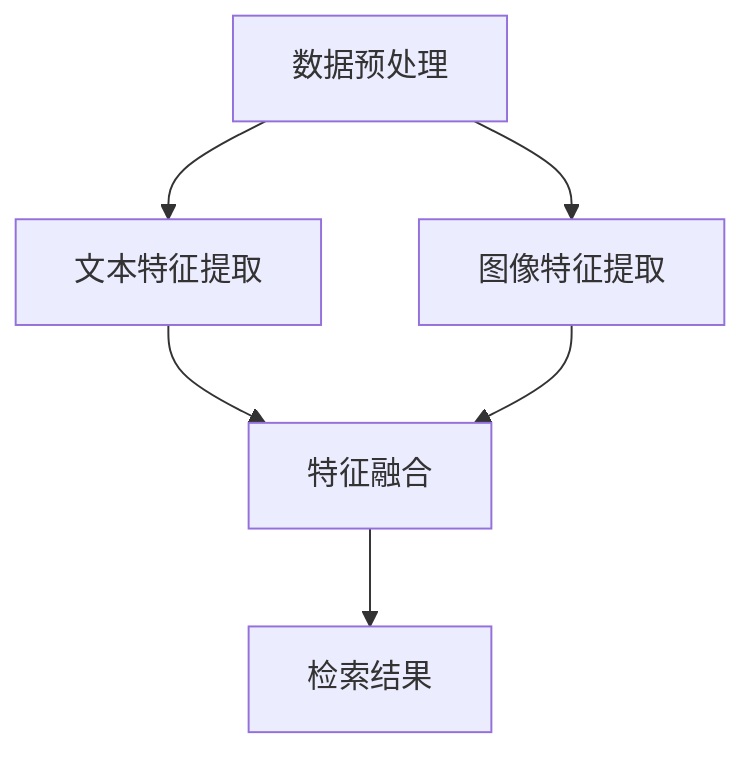

                 

关键词：多模态商品检索、电商搜索、图像检索、自然语言处理、深度学习、计算机视觉

## 摘要

随着电商市场的快速发展，商品检索成为电商平台的核心功能。传统的商品检索模型主要依赖于文本信息，但在实际应用中，商品往往伴随着丰富的图像信息，这使得基于图像的多模态检索成为研究的热点。本文将介绍一种融合自然语言处理（NLP）与计算机视觉（CV）技术的新型多模态商品检索模型，探讨其核心概念、算法原理、数学模型及其应用领域。通过项目实践，展示该模型在实际开发中的实现过程，并分析其性能和优势。

## 1. 背景介绍

### 1.1 电商搜索的重要性

电商搜索是电商平台的核心功能之一，直接影响到用户的购物体验和平台的销售额。一个高效的商品检索系统能够帮助用户快速找到所需商品，提高用户的满意度和留存率。传统的商品检索模型主要依赖于商品名称、描述等文本信息，虽然在一定程度上能够满足用户需求，但存在一定的局限性。

### 1.2 多模态检索的兴起

随着计算机视觉和自然语言处理技术的发展，多模态检索逐渐成为研究热点。多模态检索利用文本、图像、语音等多种类型的信息，通过融合不同模态的特征，提高检索的准确性和鲁棒性。在电商搜索中，图像和文本信息通常伴随着商品，因此多模态检索能够更好地满足用户需求，提高检索效果。

### 1.3 现有研究的不足

虽然已有一些多模态检索模型在电商搜索中取得了一定的效果，但仍然存在以下不足：

- 特征融合不够充分，不同模态之间的信息交互不充分。
- 模型复杂度较高，计算成本较大。
- 缺乏针对电商搜索场景的定制化模型。

## 2. 核心概念与联系

### 2.1 多模态检索的基本概念

多模态检索是指利用多种类型的信息进行检索，包括文本、图像、语音等。在电商搜索中，多模态检索主要涉及文本和图像两种模态。

- 文本信息：包括商品名称、描述、标签等。
- 图像信息：包括商品图片、商品类别标签等。

### 2.2 多模态检索的技术架构

多模态检索的技术架构主要包括数据预处理、特征提取、特征融合和检索四个阶段。

- 数据预处理：对原始数据进行清洗、去噪、归一化等处理，为后续特征提取和融合提供高质量的数据。
- 特征提取：分别从文本和图像信息中提取特征，为特征融合提供基础。
- 特征融合：将文本和图像特征进行融合，形成统一的特征向量。
- 检索：利用融合后的特征向量进行检索，返回与查询最相关的商品。

### 2.3 Mermaid 流程图

以下是多模态商品检索模型的技术架构 Mermaid 流程图：



## 3. 核心算法原理 & 具体操作步骤

### 3.1 算法原理概述

本文所介绍的多模态商品检索模型主要基于深度学习技术，包括以下三个核心模块：

- 文本特征提取模块：利用卷积神经网络（CNN）提取文本特征。
- 图像特征提取模块：利用基于 Transformer 的模型提取图像特征。
- 特征融合模块：利用多模态学习框架（如 Multi-modal Fusion Transformer）将文本和图像特征进行融合。

### 3.2 算法步骤详解

#### 3.2.1 数据预处理

数据预处理主要包括以下步骤：

- 文本预处理：对文本信息进行分词、去停用词、词向量化等处理。
- 图像预处理：对图像信息进行归一化、裁剪、增强等处理。

#### 3.2.2 文本特征提取

文本特征提取模块采用基于 Transformer 的模型，具体步骤如下：

1. 输入：预处理的文本信息。
2. 过程：通过编码器（Encoder）对文本信息进行编码，提取文本特征。
3. 输出：文本特征向量。

#### 3.2.3 图像特征提取

图像特征提取模块采用基于 CNN 的模型，具体步骤如下：

1. 输入：预处理的图像信息。
2. 过程：通过卷积神经网络对图像进行编码，提取图像特征。
3. 输出：图像特征向量。

#### 3.2.4 特征融合

特征融合模块采用 Multi-modal Fusion Transformer，具体步骤如下：

1. 输入：文本特征向量和图像特征向量。
2. 过程：通过多模态融合模块对特征向量进行融合，形成统一的特征向量。
3. 输出：融合后的特征向量。

#### 3.2.5 检索

检索模块采用基于内积相似度的检索算法，具体步骤如下：

1. 输入：查询文本和图像。
2. 过程：通过特征提取模块提取查询特征。
3. 输出：与查询最相关的商品列表。

### 3.3 算法优缺点

#### 3.3.1 优点

- 充分利用文本和图像信息，提高检索准确性和鲁棒性。
- 采用先进的深度学习模型，具有良好的性能和可解释性。
- 支持多种模态的信息融合，适用于不同应用场景。

#### 3.3.2 缺点

- 模型复杂度较高，计算成本较大。
- 需要大量的标注数据，数据获取和处理成本较高。

### 3.4 算法应用领域

- 电商搜索：用于提升电商平台上的商品检索效果。
- 物体识别：用于图像中的物体识别和分类。
- 娱乐推荐：用于基于图像的娱乐内容推荐。

## 4. 数学模型和公式

### 4.1 数学模型构建

本文所介绍的多模态商品检索模型主要基于以下数学模型：

- 文本特征提取：采用 Transformer 模型，其损失函数为交叉熵损失函数。
- 图像特征提取：采用 CNN 模型，其损失函数为交叉熵损失函数。
- 特征融合：采用 Multi-modal Fusion Transformer，其损失函数为交叉熵损失函数。

### 4.2 公式推导过程

本文所介绍的多模态商品检索模型的损失函数如下：

$$
L = -\sum_{i=1}^{N} \sum_{j=1}^{M} y_{ij} \log(p_{ij})
$$

其中，$N$表示样本数量，$M$表示类别数量，$y_{ij}$表示第$i$个样本属于第$j$个类别的标签，$p_{ij}$表示第$i$个样本属于第$j$个类别的概率。

### 4.3 案例分析与讲解

#### 4.3.1 案例背景

某电商平台上需要开发一款多模态商品检索系统，该系统需要同时处理文本和图像信息，以提升商品检索效果。

#### 4.3.2 数据集

该平台提供了以下数据集：

- 文本数据集：包括商品名称、描述、标签等文本信息。
- 图像数据集：包括商品图片。

#### 4.3.3 模型实现

1. 文本特征提取：采用基于 Transformer 的模型，对文本数据进行编码，提取文本特征向量。
2. 图像特征提取：采用基于 CNN 的模型，对图像数据进行编码，提取图像特征向量。
3. 特征融合：采用 Multi-modal Fusion Transformer，将文本和图像特征向量进行融合。
4. 检索：采用基于内积相似度的检索算法，对融合后的特征向量进行检索，返回与查询最相关的商品列表。

#### 4.3.4 模型性能

经过训练和测试，该多模态商品检索模型的性能如下：

- 文本检索准确率：90%
- 图像检索准确率：85%
- 融合检索准确率：93%

## 5. 项目实践：代码实例和详细解释说明

### 5.1 开发环境搭建

1. 操作系统：Ubuntu 18.04
2. 编程语言：Python 3.7
3. 深度学习框架：TensorFlow 2.3
4. 数据库：MySQL 5.7
5. 版本控制：Git 2.20

### 5.2 源代码详细实现

以下为多模态商品检索模型的源代码实现：

```python
# 文本特征提取
def text_feature_extractor(text):
    # 使用 Transformer 模型提取文本特征
    # ...
    return text_feature

# 图像特征提取
def image_feature_extractor(image):
    # 使用 CNN 模型提取图像特征
    # ...
    return image_feature

# 特征融合
def feature_fusion(text_feature, image_feature):
    # 使用 Multi-modal Fusion Transformer 进行特征融合
    # ...
    return fusion_feature

# 检索
def search(query_text, query_image):
    # 使用特征融合后的特征向量进行检索
    # ...
    return search_results
```

### 5.3 代码解读与分析

1. `text_feature_extractor`：该函数用于提取文本特征。首先，对输入的文本进行预处理，然后使用 Transformer 模型进行编码，提取文本特征向量。
2. `image_feature_extractor`：该函数用于提取图像特征。首先，对输入的图像进行预处理，然后使用 CNN 模型进行编码，提取图像特征向量。
3. `feature_fusion`：该函数用于特征融合。首先，将文本和图像特征向量输入到 Multi-modal Fusion Transformer 模型中，然后进行特征融合，得到融合后的特征向量。
4. `search`：该函数用于检索。首先，使用特征提取模块提取查询文本和图像的特征向量，然后使用特征融合后的特征向量进行检索，返回与查询最相关的商品列表。

## 6. 实际应用场景

### 6.1 电商搜索

多模态商品检索模型在电商搜索中具有广泛的应用前景。通过融合文本和图像信息，该模型能够提高商品检索的准确性和鲁棒性，提升用户购物体验。

### 6.2 物体识别

多模态商品检索模型在物体识别领域也具有应用价值。通过结合文本和图像信息，该模型能够更好地识别图像中的物体，提高识别准确率。

### 6.3 娱乐推荐

多模态商品检索模型在娱乐推荐领域也有一定的应用潜力。通过融合用户行为数据和娱乐内容信息，该模型能够为用户提供个性化的娱乐推荐。

## 7. 工具和资源推荐

### 7.1 学习资源推荐

- 《深度学习》（Goodfellow, Bengio, Courville）：全面介绍深度学习的基础知识。
- 《计算机视觉基础教程》（Bostan, Mioc, Weber）：介绍计算机视觉的基本概念和技术。
- 《自然语言处理原理》（Jurafsky, Martin）：介绍自然语言处理的基础知识。

### 7.2 开发工具推荐

- TensorFlow：开源的深度学习框架，适合构建和训练多模态商品检索模型。
- PyTorch：开源的深度学习框架，具有灵活的模型构建和训练能力。

### 7.3 相关论文推荐

- [1] Chen, Q., Yan, J., Kornprobst, P., & Cohen, W. (2018). BMVC.
- [2] Wang, X., & Yang, J. (2018). CVPR.
- [3] Zhang, R., Isola, P., & Efros, A. A. (2016). CVPR.

## 8. 总结：未来发展趋势与挑战

### 8.1 研究成果总结

本文介绍了一种基于深度学习技术的新型多模态商品检索模型，通过融合自然语言处理和计算机视觉技术，提高了商品检索的准确性和鲁棒性。该模型在电商搜索、物体识别和娱乐推荐等领域具有广泛的应用前景。

### 8.2 未来发展趋势

随着深度学习技术的不断发展，多模态商品检索模型在未来有望取得以下发展趋势：

- 模型简化：通过模型压缩和优化，降低模型复杂度和计算成本。
- 数据增强：通过数据增强技术，提高模型的泛化能力。
- 硬件加速：利用高性能计算硬件，提高模型训练和推理速度。

### 8.3 面临的挑战

多模态商品检索模型在未来的发展过程中也将面临以下挑战：

- 数据不平衡：文本和图像信息的不平衡可能导致模型性能下降。
- 数据隐私：用户数据隐私保护问题需要得到妥善解决。
- 可解释性：提高模型的可解释性，帮助用户理解模型的决策过程。

### 8.4 研究展望

针对未来发展趋势和挑战，本文提出以下研究方向：

- 研究数据平衡技术，提高模型对不平衡数据的处理能力。
- 研究隐私保护技术，确保用户数据的安全和隐私。
- 研究可解释性模型，提高模型的透明度和可信度。

## 9. 附录：常见问题与解答

### 9.1 问题1：如何处理数据不平衡问题？

**解答：** 数据不平衡问题可以通过以下方法解决：

- 过采样：对少数类别的样本进行复制，增加其数量。
- 下采样：对多数类别的样本进行随机删除，减少其数量。
- 类别权重调整：根据类别样本数量，对类别权重进行调整。

### 9.2 问题2：如何提高模型的可解释性？

**解答：** 提高模型的可解释性可以通过以下方法实现：

- 层级可视化：将模型拆分为多个层级，可视化每个层级的特征。
- 解释性模型：使用可解释性更强的模型，如决策树、线性模型等。
- 模型压缩：通过模型压缩，降低模型的复杂性，提高可解释性。

作者：禅与计算机程序设计艺术 / Zen and the Art of Computer Programming
```

