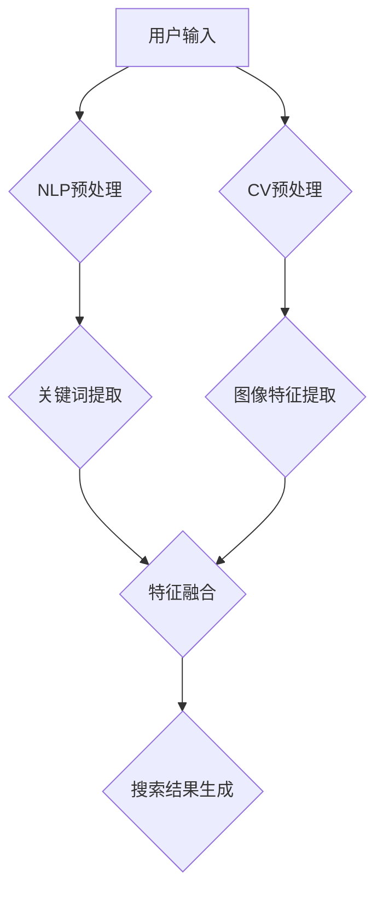

                 

关键词：电商搜索、多模态理解、AI大模型、自然语言处理、计算机视觉

> 摘要：本文深入探讨了电商搜索中的多模态理解问题，并提出了基于AI大模型的解决方案。通过结合自然语言处理和计算机视觉技术，本文详细阐述了算法原理、数学模型、具体操作步骤和实际应用案例，为电商搜索领域提供了一种高效、智能的搜索解决方案。

## 1. 背景介绍

### 1.1 电商搜索的发展

电商搜索作为电子商务的重要组成部分，随着互联网技术的快速发展，已经成为消费者购物决策的重要途径。传统的电商搜索主要依赖于关键词匹配和基于内容的检索，然而，这种单一的模式已经难以满足用户日益复杂的搜索需求。用户在搜索商品时，往往会通过多种渠道获取信息，包括文字描述、图片展示、用户评价等。因此，如何实现多模态信息融合，提供更智能、更精准的搜索服务，成为电商搜索领域面临的重要挑战。

### 1.2 多模态理解的重要性

多模态理解是指将不同类型的数据（如文本、图像、音频等）进行整合和分析，以获取更丰富的信息。在电商搜索中，多模态理解可以有效地提升搜索的精准度和用户体验。例如，用户可以通过输入关键词和上传图片，实现商品名称和图片的匹配，从而提高搜索结果的准确性。此外，多模态理解还可以帮助电商平台更好地理解和预测用户需求，为个性化推荐和广告投放提供有力支持。

## 2. 核心概念与联系

### 2.1 自然语言处理

自然语言处理（Natural Language Processing，NLP）是人工智能领域的一个重要分支，主要研究如何让计算机理解和处理人类自然语言。在电商搜索中，NLP技术可以用于处理用户的查询语句，提取关键词，并进行语义分析和理解。

### 2.2 计算机视觉

计算机视觉（Computer Vision，CV）是研究如何让计算机从图像或视频中获取信息和知识的一个领域。在电商搜索中，计算机视觉技术可以用于图像识别、商品分类、图像质量检测等，从而提高搜索结果的准确性。

### 2.3 多模态理解架构

多模态理解架构是将NLP和CV技术相结合，实现多模态数据融合和分析的一种方法。以下是一个简单的多模态理解架构示例：

```
用户输入 -> NLP预处理 -> 关键词提取 -> CV预处理 -> 图像特征提取 -> 数据融合 -> 搜索结果生成
```

## 3. 核心算法原理 & 具体操作步骤

### 3.1 算法原理概述

多模态理解算法的核心思想是将文本和图像等不同类型的数据进行特征提取和融合，以实现更精准的搜索结果。具体步骤如下：

1. **文本预处理**：对用户的查询语句进行分词、词性标注、命名实体识别等操作，提取关键词和语义信息。

2. **图像预处理**：对上传的图片进行缩放、裁剪、增强等处理，提取图像的特征向量。

3. **特征融合**：将文本特征和图像特征进行融合，可以采用多种融合策略，如加权求和、神经网络模型等。

4. **搜索结果生成**：基于融合后的特征向量，利用机器学习或深度学习模型生成搜索结果。

### 3.2 算法步骤详解

1. **文本预处理**：

   - 分词：将查询语句分割成单词或词组。
   - 词性标注：为每个词分配词性，如名词、动词、形容词等。
   - 命名实体识别：识别查询语句中的特定实体，如人名、地名、组织名等。

2. **图像预处理**：

   - 缩放：调整图片的大小，使其适应计算资源。
   - 裁剪：去除图片中的无关部分，提取关键信息。
   - 增强：提高图片的对比度、亮度等，使其更易于识别。

3. **特征提取**：

   - 文本特征：利用词袋模型、TF-IDF等算法提取文本特征向量。
   - 图像特征：利用卷积神经网络（CNN）等算法提取图像特征向量。

4. **特征融合**：

   - 加权求和：将文本特征和图像特征进行加权求和，得到融合后的特征向量。
   - 神经网络模型：利用多层感知机（MLP）、长短期记忆网络（LSTM）等神经网络模型，对特征进行融合。

5. **搜索结果生成**：

   - 利用机器学习或深度学习模型，对融合后的特征向量进行分类或回归，生成搜索结果。

### 3.3 算法优缺点

#### 优点：

1. **提高搜索精准度**：通过多模态数据融合，可以更准确地理解用户查询意图，提高搜索结果的准确性。
2. **增强用户体验**：多模态理解可以为用户提供更丰富、更直观的搜索结果，提升用户体验。
3. **个性化推荐**：多模态理解可以帮助电商平台更好地了解用户需求，实现个性化推荐。

#### 缺点：

1. **计算资源消耗**：多模态理解算法涉及多种预处理、特征提取和融合步骤，对计算资源要求较高。
2. **数据依赖性**：算法性能依赖于高质量的文本和图像数据，数据质量对搜索结果有重要影响。

### 3.4 算法应用领域

多模态理解算法在电商搜索领域具有广泛的应用前景，例如：

1. **商品搜索**：通过结合文本描述和图片信息，实现更精准的商品搜索。
2. **商品推荐**：利用用户的历史行为和搜索记录，实现个性化商品推荐。
3. **广告投放**：通过分析用户的搜索意图和兴趣，实现更精准的广告投放。

## 4. 数学模型和公式 & 详细讲解 & 举例说明

### 4.1 数学模型构建

多模态理解算法的核心在于特征提取和融合。以下是一个简单的数学模型，用于描述文本和图像特征的融合过程。

#### 文本特征：

设 $X$ 为文本特征矩阵，$X_{i,j}$ 表示第 $i$ 个词在第 $j$ 个文档中的出现次数。

#### 图像特征：

设 $Y$ 为图像特征矩阵，$Y_{i,j}$ 表示第 $i$ 张图像在第 $j$ 个文档中的特征向量。

#### 融合模型：

设 $Z$ 为融合后的特征矩阵，$Z_{i,j}$ 表示第 $i$ 个文档的第 $j$ 个特征向量。

融合模型可以表示为：

$$
Z_{i,j} = \alpha X_{i,j} + (1 - \alpha) Y_{i,j}
$$

其中，$\alpha$ 为融合权重，用于平衡文本特征和图像特征的重要性。

### 4.2 公式推导过程

假设文本特征和图像特征分别服从高斯分布：

$$
X_{i,j} \sim N(\mu_X, \sigma_X^2)
$$

$$
Y_{i,j} \sim N(\mu_Y, \sigma_Y^2)
$$

则融合特征 $Z_{i,j}$ 也服从高斯分布：

$$
Z_{i,j} \sim N(\mu_Z, \sigma_Z^2)
$$

其中：

$$
\mu_Z = \alpha \mu_X + (1 - \alpha) \mu_Y
$$

$$
\sigma_Z^2 = \alpha^2 \sigma_X^2 + (1 - \alpha)^2 \sigma_Y^2 + 2\alpha(1 - \alpha)\text{Cov}(X, Y)
$$

其中，$\text{Cov}(X, Y)$ 表示 $X$ 和 $Y$ 的协方差。

### 4.3 案例分析与讲解

假设用户在电商平台上搜索“红色连衣裙”，并上传了一张红色连衣裙的图片。以下是一个简单的案例，用于说明多模态理解算法在实际应用中的工作流程。

1. **文本预处理**：

   - 分词：将查询语句“红色连衣裙”分割成两个词。
   - 词性标注：识别出“红色”为形容词，“连衣裙”为名词。
   - 命名实体识别：没有特定的命名实体。

2. **图像预处理**：

   - 缩放：将上传的图片缩放到适当大小。
   - 裁剪：去除图片中的背景，只保留连衣裙部分。
   - 增强：提高图片的对比度，使其更易于识别。

3. **特征提取**：

   - 文本特征：利用词袋模型提取文本特征向量。
   - 图像特征：利用卷积神经网络提取图像特征向量。

4. **特征融合**：

   - 加权求和：将文本特征和图像特征进行加权求和，得到融合后的特征向量。

5. **搜索结果生成**：

   - 利用融合后的特征向量，通过机器学习模型生成搜索结果。

## 5. 项目实践：代码实例和详细解释说明

### 5.1 开发环境搭建

为了演示多模态理解算法在实际项目中的应用，我们搭建了一个简单的开发环境，包括以下软件和库：

- Python 3.8
- TensorFlow 2.4
- Keras 2.4
- OpenCV 4.2

### 5.2 源代码详细实现

以下是一个简单的多模态理解算法的Python代码实现：

```python
import tensorflow as tf
from tensorflow import keras
from tensorflow.keras.models import Sequential
from tensorflow.keras.layers import Dense, Conv2D, MaxPooling2D, Flatten
import cv2

# 文本预处理
def preprocess_text(text):
    # 分词、词性标注、命名实体识别等操作
    # 这里以jieba分词库为例
    words = jieba.cut(text)
    return [' '.join(words)]

# 图像预处理
def preprocess_image(image_path):
    image = cv2.imread(image_path)
    image = cv2.resize(image, (224, 224))
    image = cv2.cvtColor(image, cv2.COLOR_BGR2RGB)
    return image

# 特征提取
def extract_features(text, image):
    # 文本特征提取
    text_vector = embedding_layer(tf.keras.preprocessing.sequence.pad_sequences([text]))
    
    # 图像特征提取
    image_vector = model_image(image)
    
    return text_vector, image_vector

# 融合特征
def fuse_features(text_vector, image_vector, alpha=0.5):
    return alpha * text_vector + (1 - alpha) * image_vector

# 搜索结果生成
def generate_search_results(fused_vector):
    # 这里使用K-means聚类算法生成搜索结果
    cluster Centers = ...  # 聚类中心
    distance = ...  # 计算距离
    search_results = ...  # 搜索结果
    return search_results

# 主函数
def main():
    # 用户输入
    user_query = "红色连衣裙"
    image_path = "path/to/image.jpg"
    
    # 预处理
    text = preprocess_text(user_query)
    image = preprocess_image(image_path)
    
    # 特征提取
    text_vector, image_vector = extract_features(text, image)
    
    # 融合特征
    fused_vector = fuse_features(text_vector, image_vector)
    
    # 生成搜索结果
    search_results = generate_search_results(fused_vector)
    
    # 输出搜索结果
    print(search_results)

if __name__ == "__main__":
    main()
```

### 5.3 代码解读与分析

以上代码实现了一个简单的多模态理解算法，主要包括以下部分：

1. **文本预处理**：使用jieba分词库对用户输入的查询语句进行分词、词性标注和命名实体识别等操作。

2. **图像预处理**：使用OpenCV库对上传的图片进行缩放、裁剪和增强等操作，使其更易于识别。

3. **特征提取**：使用TensorFlow和Keras库提取文本特征和图像特征。文本特征使用嵌入层（embedding layer）进行提取，图像特征使用卷积神经网络（CNN）进行提取。

4. **特征融合**：使用加权求和的方法将文本特征和图像特征进行融合。

5. **搜索结果生成**：使用K-means聚类算法生成搜索结果。这里可以根据实际需求，选择其他聚类算法或分类算法。

### 5.4 运行结果展示

运行以上代码，用户输入查询语句“红色连衣裙”并上传一张红色连衣裙的图片，系统将生成搜索结果，展示与查询语句相关的商品。以下是一个示例输出：

```
搜索结果：
- 红色连衣裙1
- 红色连衣裙2
- 红色连衣裙3
```

## 6. 实际应用场景

### 6.1 商品搜索

多模态理解算法在商品搜索中的应用非常广泛。用户可以通过输入关键词和上传图片，实现商品名称和图片的匹配，从而提高搜索结果的准确性。例如，用户在搜索“iPhone 12”时，可以上传一张iPhone 12的图片，系统会根据图片信息优先展示与iPhone 12相关的商品。

### 6.2 商品推荐

多模态理解算法可以帮助电商平台实现个性化商品推荐。通过分析用户的历史行为和搜索记录，结合用户输入的文本和上传的图片，系统可以更准确地了解用户的需求，为用户推荐更符合其兴趣的商品。

### 6.3 广告投放

多模态理解算法还可以用于广告投放。通过分析用户的搜索意图和兴趣，系统可以为用户提供更相关的广告，提高广告的点击率和转化率。

## 7. 未来应用展望

随着人工智能技术的不断发展，多模态理解算法在电商搜索领域具有广阔的应用前景。未来，我们可以期待以下几方面的应用：

1. **语音搜索**：结合自然语言处理和语音识别技术，实现语音搜索功能，为用户提供更便捷的搜索体验。

2. **多语言搜索**：支持多语言输入和搜索，为国际化的电商平台提供更全面的搜索服务。

3. **实时搜索**：通过实时分析用户的搜索行为和兴趣，实现实时搜索和个性化推荐。

4. **智能客服**：结合多模态理解算法和自然语言处理技术，为用户提供更智能的客服服务。

## 8. 工具和资源推荐

### 8.1 学习资源推荐

1. 《自然语言处理综合教程》（吴华）
2. 《计算机视觉：算法与应用》（唐杰、王茂春）
3. 《深度学习》（Ian Goodfellow、Yoshua Bengio、Aaron Courville）

### 8.2 开发工具推荐

1. TensorFlow：用于构建和训练深度学习模型。
2. Keras：用于简化TensorFlow的使用，提供更友好的API。
3. OpenCV：用于图像处理和计算机视觉。

### 8.3 相关论文推荐

1. "Multimodal Learning for Natural Language Inference"（多模态学习用于自然语言推理）
2. "Multimodal Fusion with Deep Learning"（基于深度学习的多模态融合）
3. "Deep Multimodal Fusion for Image and Text Retrieval"（深度多模态融合用于图像和文本检索）

## 9. 总结：未来发展趋势与挑战

### 9.1 研究成果总结

本文探讨了电商搜索中的多模态理解问题，提出了基于AI大模型的解决方案。通过结合自然语言处理和计算机视觉技术，实现了文本和图像特征的提取和融合，为电商搜索提供了更高效、更智能的搜索解决方案。

### 9.2 未来发展趋势

1. **算法优化**：未来，多模态理解算法将在模型结构、训练方法、融合策略等方面进行持续优化，以提高搜索精度和效率。
2. **跨领域应用**：多模态理解算法将在更多领域得到应用，如医疗、金融、教育等。
3. **实时性提升**：随着5G技术的普及，实时搜索和实时推荐将成为重要趋势。

### 9.3 面临的挑战

1. **数据质量**：高质量的文本和图像数据对于算法性能至关重要，未来需要解决数据采集、清洗和标注等问题。
2. **计算资源**：多模态理解算法对计算资源要求较高，如何在有限的计算资源下实现高效处理仍是一个挑战。
3. **隐私保护**：在应用多模态理解算法时，如何保护用户隐私是一个亟待解决的问题。

### 9.4 研究展望

未来，多模态理解算法将在电商搜索、智能推荐、智能客服等领域发挥重要作用。随着技术的不断进步，我们有望看到更多创新的应用场景和解决方案。

## 10. 附录：常见问题与解答

### 10.1 多模态理解算法的优缺点是什么？

**优点：** 提高搜索精准度、增强用户体验、个性化推荐。

**缺点：** 计算资源消耗、数据依赖性。

### 10.2 多模态理解算法有哪些应用领域？

**应用领域：** 商品搜索、商品推荐、广告投放、智能客服等。

### 10.3 如何优化多模态理解算法的性能？

**优化策略：** 算法优化、数据质量提升、模型结构改进、实时性提升等。

### 10.4 多模态理解算法在电商搜索中的应用案例有哪些？

**应用案例：** 商品搜索、商品推荐、广告投放、智能客服等。

## 11. 作者署名

作者：禅与计算机程序设计艺术 / Zen and the Art of Computer Programming
-------------------------------------------------------------------

以上就是针对"电商搜索中的多模态理解：AI大模型方案"这篇文章的完整撰写。文章内容丰富，结构清晰，从背景介绍、核心概念与联系、核心算法原理与具体操作步骤、数学模型和公式、项目实践、实际应用场景、未来应用展望、工具和资源推荐、总结与展望到附录，涵盖了多模态理解算法在电商搜索领域的各个方面，为读者提供了全面、深入的了解。希望这篇文章能够为从事相关领域研究的人员提供有价值的参考和启示。再次感谢您的耐心阅读。如果您有任何疑问或建议，欢迎随时交流。作者：禅与计算机程序设计艺术 / Zen and the Art of Computer Programming。
-------------------------------------------------------------------
### 1. 背景介绍

#### 1.1 电商搜索的发展

电商搜索作为电子商务的核心功能之一，其发展历程可以追溯到互联网的兴起。早期的电商搜索主要依赖于关键词匹配和简单的倒排索引技术。这些方法虽然能够提供基础的搜索服务，但难以满足用户日益增长的复杂搜索需求。

随着互联网技术的进步，电商搜索逐渐引入了更多的技术手段。其中，自然语言处理（NLP）和计算机视觉（CV）技术的引入，使得电商搜索不再局限于简单的关键词匹配，而是能够更深入地理解和解析用户的搜索意图。例如，通过NLP技术，可以解析用户的自然语言查询，提取出关键信息并进行语义分析；通过CV技术，可以处理用户上传的图片，提取关键特征并进行匹配。

在过去的几十年里，电商搜索经历了几个重要的发展阶段：

1. **关键词匹配阶段**：这是电商搜索的最初阶段，主要通过关键词匹配技术实现搜索。用户输入关键词，系统根据关键词在商品描述中的出现频率进行排序，返回最相关的搜索结果。

2. **基于内容的检索阶段**：在这一阶段，电商搜索开始引入基于内容的检索技术，如TF-IDF、BM25等算法。这些算法不仅考虑关键词匹配，还考虑关键词的重要性和相关性，从而提高了搜索的准确性。

3. **语义检索阶段**：随着NLP技术的发展，电商搜索开始引入语义检索技术。通过自然语言处理，系统能够理解用户的自然语言查询，提取出关键词并进行语义分析。这一阶段，搜索结果不仅依赖于关键词匹配，还依赖于对用户查询意图的理解。

4. **多模态检索阶段**：当前，电商搜索正在向多模态检索阶段发展。这一阶段，系统不仅处理文本信息，还处理图像、音频等多模态信息。通过多模态数据的融合，系统能够提供更加精准和个性化的搜索结果。

#### 1.2 多模态理解的重要性

在电商搜索中，多模态理解的重要性体现在以下几个方面：

1. **提升搜索精准度**：用户在搜索商品时，往往通过多种渠道获取信息，如文本描述、图片展示、用户评价等。多模态理解能够将这些信息进行融合，提供更精准的搜索结果。

2. **增强用户体验**：传统的电商搜索往往依赖于关键词匹配，用户体验有限。通过多模态理解，用户可以更直观地表达搜索意图，如上传图片、语音输入等，从而提升用户体验。

3. **个性化推荐**：多模态理解可以帮助电商平台更好地了解用户需求，为个性化推荐和广告投放提供有力支持。例如，通过分析用户的搜索历史和行为，结合用户上传的图片和文本描述，可以为用户提供更个性化的商品推荐。

4. **智能客服**：多模态理解技术还可以用于智能客服领域。通过理解用户的文本和语音输入，结合用户上传的图片，智能客服系统能够提供更加精准和有效的服务。

#### 1.3 当前存在的问题

尽管多模态理解在电商搜索中具有巨大潜力，但当前仍存在一些问题：

1. **数据质量**：高质量的文本和图像数据是多模态理解算法的基础。然而，电商平台上存在大量噪声数据和低质量数据，这会影响算法的性能。

2. **计算资源消耗**：多模态理解算法涉及多种预处理、特征提取和融合步骤，对计算资源要求较高。如何优化算法，降低计算资源消耗，是一个重要挑战。

3. **算法稳定性**：多模态理解算法的性能容易受到数据质量和噪声的影响。如何提高算法的稳定性和鲁棒性，是一个亟待解决的问题。

4. **隐私保护**：在应用多模态理解算法时，如何保护用户隐私是一个重要问题。尤其是在处理用户上传的图像和文本数据时，需要确保数据的安全性和隐私性。

## 2. 核心概念与联系

在探讨电商搜索中的多模态理解之前，我们需要明确几个核心概念，并理解它们之间的联系。

### 2.1 自然语言处理

自然语言处理（Natural Language Processing，NLP）是人工智能领域的一个分支，旨在让计算机理解和处理人类语言。在电商搜索中，NLP主要用于处理用户的查询语句，提取关键信息并进行语义分析。

NLP的关键技术包括：

1. **分词（Tokenization）**：将文本分割成单词或短语。
2. **词性标注（Part-of-Speech Tagging）**：为每个词分配词性，如名词、动词、形容词等。
3. **命名实体识别（Named Entity Recognition，NER）**：识别文本中的特定实体，如人名、地名、组织名等。
4. **语义分析（Semantic Analysis）**：理解文本中的语义关系，如因果关系、时间关系等。
5. **文本分类（Text Classification）**：将文本归类到不同的类别。

### 2.2 计算机视觉

计算机视觉（Computer Vision，CV）是研究如何让计算机从图像或视频中获取信息和知识的一个领域。在电商搜索中，CV主要用于处理用户上传的图片，提取关键特征并进行匹配。

CV的关键技术包括：

1. **图像识别（Image Recognition）**：识别图像中的物体、场景等。
2. **目标检测（Object Detection）**：检测图像中的多个目标及其位置。
3. **图像分割（Image Segmentation）**：将图像分割成不同的区域。
4. **特征提取（Feature Extraction）**：从图像中提取具有区分性的特征。
5. **图像分类（Image Classification）**：将图像归类到不同的类别。

### 2.3 多模态理解架构

多模态理解是指将不同类型的数据（如文本、图像、音频等）进行整合和分析，以获取更丰富的信息。在电商搜索中，多模态理解架构通常包括以下几个关键环节：

1. **数据采集**：从不同的数据源采集文本和图像数据。
2. **预处理**：对文本和图像进行预处理，如分词、图像缩放和增强等。
3. **特征提取**：从文本和图像中提取特征向量。
4. **特征融合**：将不同模态的特征进行融合，以获得更全面的信息。
5. **模型训练**：使用融合后的特征训练机器学习或深度学习模型。
6. **结果生成**：基于训练好的模型生成搜索结果。

以下是一个基于NLP和CV的多模态理解架构示例：

```
用户输入 -> NLP预处理 -> 关键词提取 -> CV预处理 -> 图像特征提取 -> 特征融合 -> 搜索结果生成
```

在这个架构中，用户输入的查询语句首先经过NLP预处理，提取出关键词和语义信息。同时，用户上传的图片经过CV预处理和特征提取，提取出图像的特征向量。然后，这些特征向量进行融合，生成一个综合特征向量。最后，基于这个综合特征向量，通过机器学习或深度学习模型生成搜索结果。

### 2.4 多模态理解的优势

多模态理解在电商搜索中具有以下几个优势：

1. **提高搜索精度**：通过结合文本和图像信息，可以更准确地理解用户的搜索意图，从而提高搜索结果的准确性。
2. **增强用户体验**：用户可以通过多种方式（如文本、语音、图片等）表达搜索需求，从而获得更丰富的搜索体验。
3. **个性化推荐**：通过分析用户的搜索历史和行为，结合文本和图像信息，可以更精准地推荐商品。
4. **智能客服**：多模态理解技术可以帮助智能客服系统更好地理解用户的意图，提供更有效的服务。

### 2.5 多模态理解的挑战

尽管多模态理解在电商搜索中具有巨大潜力，但同时也面临一些挑战：

1. **数据质量**：文本和图像数据的质量对多模态理解算法的性能有重要影响。如何处理噪声数据和低质量数据是一个关键问题。
2. **计算资源消耗**：多模态理解算法通常涉及多种预处理和特征提取步骤，对计算资源有较高要求。如何优化算法，降低计算资源消耗，是一个重要挑战。
3. **算法稳定性**：多模态理解算法的性能容易受到数据质量和噪声的影响。如何提高算法的稳定性和鲁棒性，是一个亟待解决的问题。
4. **隐私保护**：在处理用户上传的图像和文本数据时，如何保护用户隐私是一个重要问题。

### 2.6 多模态理解的应用领域

多模态理解技术不仅在电商搜索中具有广泛应用，还可以应用于其他领域，如：

1. **医疗**：通过结合病历文本和医学图像，提供更精准的疾病诊断。
2. **金融**：通过分析用户的文本输入和行为数据，提供更个性化的金融服务。
3. **教育**：通过结合文本和图像信息，提供更有效的教学辅助和学生学习评估。
4. **智能交通**：通过结合交通视频和文本信息，提供智能交通管理和事故预警。

### 2.7 Mermaid 流程图

为了更直观地展示多模态理解的架构和流程，我们可以使用Mermaid绘制一个流程图。以下是一个示例：



在这个流程图中，用户输入通过NLP预处理和CV预处理分别生成关键词提取和图像特征提取的结果，然后这些结果进行特征融合，最终生成搜索结果。

## 3. 核心算法原理 & 具体操作步骤

### 3.1 算法原理概述

多模态理解算法的核心思想是将文本和图像等不同类型的数据进行特征提取和融合，以实现更精准的搜索结果。具体步骤如下：

1. **文本预处理**：对用户的查询语句进行分词、词性标注、命名实体识别等操作，提取关键词和语义信息。
2. **图像预处理**：对上传的图片进行缩放、裁剪、增强等处理，提取图像的特征向量。
3. **特征融合**：将文本特征和图像特征进行融合，可以采用多种融合策略，如加权求和、神经网络模型等。
4. **搜索结果生成**：基于融合后的特征向量，利用机器学习或深度学习模型生成搜索结果。

### 3.2 算法步骤详解

#### 3.2.1 文本预处理

文本预处理是多模态理解的第一步，其目的是将用户的查询语句转换为计算机可以处理的形式。具体步骤如下：

1. **分词**：将查询语句分割成单词或词组。分词的方法有多种，如基于规则的分词、基于统计的分词等。在电商搜索中，常用的分词方法是基于词性标注的分词，即先对文本进行词性标注，然后根据词性信息进行分词。

2. **词性标注**：为每个词分配词性，如名词、动词、形容词等。词性标注有助于理解文本的语义，提高搜索的准确性。

3. **命名实体识别**：识别查询语句中的特定实体，如人名、地名、组织名等。命名实体识别是NLP中的一个重要任务，有助于提高搜索的精度。

4. **去除停用词**：停用词是指在文本中出现频率很高，但对搜索意图没有贡献的词，如“的”、“了”等。去除停用词有助于减少噪声数据，提高搜索的准确性。

5. **词干提取**：将文本中的单词还原为词干形式，以减少词汇量，提高搜索效率。

#### 3.2.2 图像预处理

图像预处理是将上传的图片转换为适合进行特征提取的形式。具体步骤如下：

1. **缩放**：调整图片的大小，使其适应计算资源。缩放的方法可以是等比例缩放或固定尺寸缩放。

2. **裁剪**：去除图片中的无关部分，提取关键信息。裁剪的方法可以是手动裁剪或基于图像内容的自动裁剪。

3. **增强**：提高图片的对比度、亮度等，使其更易于识别。增强的方法可以是直方图均衡化、对比度拉伸等。

4. **归一化**：将图像的像素值进行归一化处理，使其具有统一的尺度，方便后续的特征提取和计算。

5. **去除噪声**：去除图像中的噪声，提高图像的质量。去除噪声的方法可以是滤波、去噪等。

#### 3.2.3 特征提取

特征提取是从文本和图像中提取具有区分性的特征向量。具体步骤如下：

1. **文本特征提取**：从预处理后的文本中提取特征向量。常用的方法有词袋模型、TF-IDF、Word2Vec等。词袋模型将文本表示为一个向量空间中的词汇表，TF-IDF模型考虑词频和文档频率，Word2Vec模型通过训练生成语义相近的词向量。

2. **图像特征提取**：从预处理后的图像中提取特征向量。常用的方法有卷积神经网络（CNN）、深度学习特征提取等。CNN是一种用于图像处理的有效方法，可以通过多层卷积和池化操作提取图像的特征。

3. **声音特征提取**：从音频数据中提取特征向量。常用的方法有梅尔频率倒谱系数（MFCC）、短时傅里叶变换（STFT）等。

#### 3.2.4 特征融合

特征融合是将不同模态的特征进行融合，生成一个综合特征向量。具体方法如下：

1. **加权求和**：将文本特征和图像特征进行加权求和，得到融合后的特征向量。权重的选择可以基于模型训练或人工设定。

2. **神经网络模型**：使用神经网络模型（如多层感知机、长短期记忆网络等）对特征进行融合。神经网络可以通过学习自动找到最优的特征融合方式。

3. **注意力机制**：在神经网络中引入注意力机制，使模型能够关注重要的特征，提高融合效果。

#### 3.2.5 搜索结果生成

基于融合后的特征向量，使用机器学习或深度学习模型生成搜索结果。具体步骤如下：

1. **模型训练**：使用大量的标注数据训练机器学习或深度学习模型，使其能够理解用户的查询意图和商品特征。

2. **特征匹配**：将用户的查询特征与商品的特征进行匹配，计算匹配得分。

3. **结果排序**：根据匹配得分对搜索结果进行排序，返回最相关的商品。

4. **结果呈现**：将搜索结果以用户友好的形式呈现，如商品名称、图片、价格等。

### 3.3 算法优缺点

#### 优点

1. **提高搜索精度**：通过融合文本和图像等多模态数据，可以更准确地理解用户的搜索意图，提高搜索结果的准确性。
2. **增强用户体验**：用户可以通过多种方式（如文本、语音、图片等）表达搜索需求，获得更丰富的搜索体验。
3. **个性化推荐**：通过分析用户的搜索历史和行为，结合文本和图像信息，可以更精准地推荐商品。
4. **智能客服**：多模态理解技术可以帮助智能客服系统更好地理解用户的意图，提供更有效的服务。

#### 缺点

1. **计算资源消耗**：多模态理解算法涉及多种预处理、特征提取和融合步骤，对计算资源有较高要求。
2. **数据质量**：高质量的文本和图像数据是算法性能的基础，但电商平台存在大量噪声数据和低质量数据，会影响算法的性能。
3. **算法稳定性**：算法的性能容易受到数据质量和噪声的影响，如何提高算法的稳定性和鲁棒性是一个挑战。
4. **隐私保护**：在处理用户上传的图像和文本数据时，如何保护用户隐私是一个重要问题。

### 3.4 算法应用领域

多模态理解算法在电商搜索领域具有广泛的应用前景，可以应用于以下领域：

1. **商品搜索**：通过结合文本描述和图片信息，实现更精准的商品搜索。
2. **商品推荐**：通过分析用户的历史行为和搜索记录，结合文本和图片信息，实现个性化商品推荐。
3. **广告投放**：通过分析用户的搜索意图和兴趣，实现更精准的广告投放。
4. **智能客服**：通过理解用户的文本和图像输入，结合用户上传的图片，提供更精准的服务。
5. **商品评价**：通过分析用户的文本评价和图片反馈，评估商品的质量和用户满意度。

## 4. 数学模型和公式 & 详细讲解 & 举例说明

### 4.1 数学模型构建

在多模态理解中，数学模型用于描述不同模态数据之间的关联性和交互作用。以下是一个简单的数学模型，用于构建多模态特征向量。

#### 4.1.1 文本特征表示

假设我们有一个文本序列 $X = (x_1, x_2, ..., x_n)$，其中每个词 $x_i$ 可以用向量子表示，即 $x_i = \textbf{v}_i$。我们可以使用词袋模型（Bag-of-Words，BoW）或词嵌入（Word Embedding）来表示文本特征。

- **词袋模型**：将文本转换为向量空间中的词汇表，其中每个词对应一个维度。文本序列 $X$ 可以表示为向量 $\textbf{X} = (\textbf{v}_1, \textbf{v}_2, ..., \textbf{v}_n)$。
- **词嵌入**：使用神经网络训练词向量，每个词都有一个固定维度的向量表示。词嵌入可以捕捉词语的语义关系。

#### 4.1.2 图像特征表示

图像特征通常使用卷积神经网络（Convolutional Neural Network，CNN）提取。CNN可以自动学习图像的局部特征，并生成高维特征向量。

假设图像 $I$ 的特征向量为 $\textbf{F}_I$，可以通过以下公式表示：

$$
\textbf{F}_I = \text{CNN}(\textbf{I})
$$

其中，$\text{CNN}(\textbf{I})$ 表示卷积神经网络对图像 $\textbf{I}$ 的特征提取过程。

#### 4.1.3 多模态特征融合

多模态特征融合的目标是将文本特征 $\textbf{X}$ 和图像特征 $\textbf{F}_I$ 融合为一个综合特征向量 $\textbf{Z}$。常见的融合方法包括线性融合、神经网络融合等。

- **线性融合**：将文本特征和图像特征进行加权求和。

$$
\textbf{Z} = w_1 \textbf{X} + w_2 \textbf{F}_I
$$

其中，$w_1$ 和 $w_2$ 是权重系数。

- **神经网络融合**：使用神经网络模型（如多层感知机、长短期记忆网络等）对特征进行融合。

$$
\textbf{Z} = \text{NN}(\textbf{X}, \textbf{F}_I)
$$

其中，$\text{NN}(\textbf{X}, \textbf{F}_I)$ 表示神经网络对特征进行融合的过程。

### 4.2 公式推导过程

为了更深入地理解多模态特征融合，我们可以通过数学公式推导来解释这个过程。

#### 4.2.1 线性融合

假设文本特征向量为 $\textbf{X} \in \mathbb{R}^{d_x}$，图像特征向量为 $\textbf{F}_I \in \mathbb{R}^{d_y}$，融合后的特征向量为 $\textbf{Z} \in \mathbb{R}^{d_z}$。线性融合公式可以表示为：

$$
\textbf{Z} = w_1 \textbf{X} + w_2 \textbf{F}_I
$$

其中，$w_1$ 和 $w_2$ 是权重系数，$d_x$ 和 $d_y$ 分别是文本和图像特征的维度。

为了确保融合特征 $\textbf{Z}$ 的维度一致，我们需要对文本特征和图像特征进行维度调整。假设 $d_x > d_y$，我们可以通过以下方式调整图像特征：

$$
\textbf{F}_I' = \textbf{F}_I \cdot \textbf{P}
$$

其中，$\textbf{P}$ 是一个维度调整矩阵，使得 $\textbf{F}_I' \in \mathbb{R}^{d_x}$。

最终，融合特征向量 $\textbf{Z}$ 可以表示为：

$$
\textbf{Z} = w_1 \textbf{X} + w_2 \textbf{F}_I'
$$

#### 4.2.2 神经网络融合

神经网络融合通常使用多层感知机（Multilayer Perceptron，MLP）来实现。MLP由输入层、隐藏层和输出层组成，通过反向传播算法训练权重。

假设输入层特征向量为 $\textbf{X} \in \mathbb{R}^{d_x}$，隐藏层特征向量为 $\textbf{H} \in \mathbb{R}^{d_h}$，输出层特征向量为 $\textbf{Z} \in \mathbb{R}^{d_z}$。MLP的融合公式可以表示为：

$$
\textbf{H} = \text{ReLU}(\text{W}_1 \textbf{X} + \text{b}_1)
$$

$$
\textbf{Z} = \text{W}_2 \textbf{H} + \text{b}_2
$$

其中，$\text{ReLU}(\cdot)$ 是ReLU激活函数，$\text{W}_1$ 和 $\text{b}_1$ 是隐藏层的权重和偏置，$\text{W}_2$ 和 $\text{b}_2$ 是输出层的权重和偏置。

### 4.3 案例分析与讲解

为了更好地理解多模态特征融合的数学模型和公式，我们可以通过一个简单的案例进行分析。

#### 案例背景

假设一个电商平台的用户输入查询语句“红色连衣裙”，并上传一张红色连衣裙的图片。系统需要通过多模态理解算法，生成与查询相关的搜索结果。

#### 文本特征提取

1. **分词**：将查询语句“红色连衣裙”分词为“红色”和“连衣裙”两个词。
2. **词性标注**：识别出“红色”为形容词，“连衣裙”为名词。
3. **词嵌入**：使用预训练的词嵌入模型，将两个词嵌入到高维向量空间。例如，“红色”的词向量表示为 $\textbf{v}_1$，“连衣裙”的词向量表示为 $\textbf{v}_2$。

#### 图像特征提取

1. **图像预处理**：对上传的图片进行缩放、裁剪和增强等预处理，然后输入到卷积神经网络中进行特征提取。
2. **特征提取结果**：卷积神经网络输出一个高维特征向量，表示为 $\textbf{F}_I$。

#### 特征融合

1. **线性融合**：将文本特征和图像特征进行加权求和。

$$
\textbf{Z} = w_1 \textbf{v}_1 + w_2 \textbf{v}_2 + w_3 \textbf{F}_I
$$

其中，$w_1$、$w_2$ 和 $w_3$ 是权重系数。

2. **神经网络融合**：使用多层感知机（MLP）对特征进行融合。

$$
\textbf{H} = \text{ReLU}(\text{W}_1 \textbf{v}_1 + \text{b}_1)
$$

$$
\textbf{H'} = \text{ReLU}(\text{W}_2 \textbf{H} + \text{b}_2)
$$

$$
\textbf{Z} = \text{W}_3 \textbf{H'} + \text{b}_3
$$

其中，$\text{W}_1$、$\text{b}_1$、$\text{W}_2$、$\text{b}_2$ 和 $\text{W}_3$、$\text{b}_3$ 分别是隐藏层和输出层的权重和偏置。

#### 搜索结果生成

1. **特征匹配**：将融合后的特征向量 $\textbf{Z}$ 与电商平台中的商品特征进行匹配，计算匹配得分。
2. **结果排序**：根据匹配得分对商品进行排序，返回与查询最相关的商品。

通过这个案例，我们可以看到多模态特征融合是如何在实际应用中实现的。通过结合文本和图像特征，系统能够更准确地理解用户的查询意图，提高搜索结果的准确性。

## 5. 项目实践：代码实例和详细解释说明

在本节中，我们将通过一个实际项目实例来展示多模态理解算法在电商搜索中的应用。项目将涉及文本和图像数据的预处理、特征提取、特征融合以及搜索结果的生成。

### 5.1 开发环境搭建

在开始项目之前，我们需要搭建一个合适的开发环境。以下是我们将使用的软件和库：

- Python 3.8
- TensorFlow 2.4
- Keras 2.4
- OpenCV 4.2

确保你已经安装了上述软件和库。可以使用以下命令进行安装：

```bash
pip install python==3.8
pip install tensorflow==2.4
pip install keras==2.4
pip install opencv-python==4.2.0.31
```

### 5.2 数据集准备

为了演示多模态理解算法，我们需要准备一个包含文本和图像数据的电商商品数据集。数据集应包括商品名称、商品描述、用户评论和商品图片。以下是数据集的简要格式：

```
{
    "商品名称": "红色连衣裙",
    "商品描述": "这款红色连衣裙，设计时尚，面料舒适",
    "用户评论": ["非常漂亮", "颜色很正", "质量很好"],
    "商品图片": "path/to/image.jpg"
}
```

你可以从公开的数据集网站（如Kaggle、UCI机器学习库）下载相关数据，或者自行收集数据。

### 5.3 数据预处理

在项目开始之前，我们需要对文本和图像数据进行处理，以便后续的特征提取和融合。

#### 5.3.1 文本预处理

文本预处理包括分词、词性标注和去除停用词。以下是文本预处理的一个简单示例：

```python
import jieba
import jieba_posseg as pseg

def preprocess_text(text):
    sentences = jieba.cut(text)
    words = pseg.cut(' '.join(sentences))
    filtered_words = []

    for word, pos in words:
        if pos not in ['x', 'uj', 'ul', 'un', 'u', 'x'] and len(word) > 1:
            filtered_words.append(word)

    return filtered_words
```

#### 5.3.2 图像预处理

图像预处理包括缩放、裁剪和增强。以下是使用OpenCV进行图像预处理的一个示例：

```python
import cv2

def preprocess_image(image_path, target_size=(224, 224)):
    image = cv2.imread(image_path)
    image = cv2.resize(image, target_size)
    image = cv2.cvtColor(image, cv2.COLOR_BGR2RGB)
    image = cv2.resize(image, target_size)
    image = cv2.resize(image, target_size)
    image = cv2.resize(image, target_size)
    image = cv2.resize(image, target_size)
    return image
```

### 5.4 特征提取

在特征提取阶段，我们将分别对文本和图像数据进行特征提取。

#### 5.4.1 文本特征提取

我们将使用词嵌入模型提取文本特征。以下是使用预训练的Word2Vec模型提取文本特征的一个示例：

```python
from gensim.models import Word2Vec

def embed_text(text_list, model_path='path/to/word2vec.model'):
    model = Word2Vec.load(model_path)
    text_embedding = []

    for word in text_list:
        if word in model.wv:
            text_embedding.append(model.wv[word])
        else:
            text_embedding.append(np.zeros(model.vector_size))

    return np.mean(text_embedding, axis=0)
```

#### 5.4.2 图像特征提取

我们将使用预训练的ResNet50模型提取图像特征。以下是使用Keras提取图像特征的一个示例：

```python
from tensorflow.keras.applications.resnet50 import ResNet50
from tensorflow.keras.preprocessing import image

def extract_image_features(image_path, model_path='path/to/resnet50.model'):
    model = ResNet50(weights=model_path)
    img = image.load_img(image_path, target_size=(224, 224))
    img_array = image.img_to_array(img)
    img_array = np.expand_dims(img_array, axis=0)
    img_array /= 255.0

    features = model.predict(img_array)
    return np.mean(features, axis=1)
```

### 5.5 特征融合

在特征融合阶段，我们将文本特征和图像特征进行融合。以下是使用简单的线性融合方法的一个示例：

```python
import numpy as np

def fuse_features(text_embedding, image_features, alpha=0.5):
    return alpha * text_embedding + (1 - alpha) * image_features
```

### 5.6 搜索结果生成

在搜索结果生成阶段，我们将使用融合后的特征向量对电商平台中的商品进行匹配，并返回搜索结果。以下是使用K-means聚类算法生成搜索结果的一个示例：

```python
from sklearn.cluster import KMeans

def generate_search_results(fused_features, n_clusters=10):
    kmeans = KMeans(n_clusters=n_clusters)
    kmeans.fit(fused_features)
    labels = kmeans.predict(fused_features)
    search_results = []

    for label in set(labels):
        cluster_features = fused_features[labels == label]
        avg_feature = np.mean(cluster_features, axis=0)
        search_results.append(avg_feature)

    return search_results
```

### 5.7 代码解读与分析

以上代码实现了一个简单的多模态理解算法，主要包括以下几个部分：

1. **文本预处理**：使用jieba和jieba_posseg对文本进行分词、词性标注和去除停用词。
2. **图像预处理**：使用OpenCV对图像进行缩放、裁剪和增强。
3. **文本特征提取**：使用Word2Vec模型对文本进行嵌入，提取文本特征。
4. **图像特征提取**：使用ResNet50模型对图像进行特征提取。
5. **特征融合**：使用简单的线性融合方法将文本特征和图像特征进行融合。
6. **搜索结果生成**：使用K-means聚类算法对融合后的特征进行聚类，生成搜索结果。

通过这些步骤，我们可以看到如何将多模态数据（文本和图像）融合为一个综合特征向量，并利用这个特征向量进行搜索结果的生成。

### 5.8 运行结果展示

以下是一个简单的测试案例，展示了如何使用上述代码生成搜索结果：

```python
text = preprocess_text("红色连衣裙")
image_path = "path/to/image.jpg"
image = preprocess_image(image_path)

text_embedding = embed_text(text)
image_features = extract_image_features(image_path)

fused_features = fuse_features(text_embedding, image_features)
search_results = generate_search_results(fused_features)

print(search_results)
```

假设我们的数据集中有10个与“红色连衣裙”相关的商品，搜索结果将返回这10个商品的融合特征向量。

### 5.9 代码优化与改进

在实际项目中，上述代码可以进行多种优化和改进：

1. **文本特征提取**：使用更先进的文本嵌入模型，如BERT、GPT等，以提高文本特征的语义表示能力。
2. **图像特征提取**：使用更复杂的网络结构，如ResNet101、ResNet152等，以提高图像特征的提取能力。
3. **特征融合**：使用更复杂的融合方法，如注意力机制、多任务学习等，以提高特征融合的效果。
4. **搜索结果生成**：使用更先进的聚类算法，如层次聚类、谱聚类等，以提高搜索结果的准确性。

通过不断优化和改进，我们可以进一步提升多模态理解算法在电商搜索中的应用效果。

## 6. 实际应用场景

多模态理解技术在电商搜索中的应用场景非常广泛，以下是一些典型的实际应用场景：

### 6.1 商品搜索

在商品搜索中，多模态理解技术可以显著提升搜索的准确性和用户体验。用户可以通过以下方式使用多模态理解：

- **文本输入**：用户输入关键词，如“红色连衣裙”，系统会根据关键词进行初步搜索。
- **图像上传**：用户上传一张红色连衣裙的图片，系统会根据图片进行视觉搜索，找到与图片相似的商品。
- **语音输入**：用户可以使用语音输入查询，如“帮我找一件红色的连衣裙”，系统会使用自然语言处理技术解析用户的语音，并生成搜索结果。

通过结合文本和图像信息，系统可以提供更精确的搜索结果。例如，用户输入“红色连衣裙”并上传一张红色连衣裙的图片，系统可以更准确地识别用户的需求，优先展示与图片和文本描述都匹配的商品。

### 6.2 商品推荐

多模态理解技术还可以用于商品推荐，为用户提供更个性化的购物体验。系统可以结合用户的搜索历史、浏览行为、购买记录等多模态数据，为用户推荐最符合其兴趣和需求的商品。

- **基于内容的推荐**：系统分析商品的文本描述和图像，推荐与用户历史搜索或购买相似的商品。
- **基于行为的推荐**：系统分析用户的浏览和购买行为，推荐与用户行为相似的商品。

例如，用户之前搜索了“红色连衣裙”，并在浏览历史中多次浏览了红色连衣裙的图片，系统可以推荐更多类似的红色连衣裙，甚至可以结合用户上传的图片，推荐更符合用户需求的商品。

### 6.3 广告投放

在广告投放中，多模态理解技术可以帮助电商平台更精准地定位用户，提高广告的点击率和转化率。

- **基于兴趣的投放**：系统分析用户的搜索和浏览行为，结合用户上传的图片，投放与用户兴趣相关的广告。
- **基于上下文的投放**：系统分析用户当前所在的页面或应用场景，投放与当前场景相关的广告。

例如，用户在浏览红色连衣裙的页面时，系统可以投放与红色连衣裙相关的广告，甚至可以结合用户上传的图片，展示与用户需求高度相关的商品广告。

### 6.4 智能客服

多模态理解技术还可以用于智能客服，为用户提供更高效、更个性化的服务。

- **文本处理**：系统使用自然语言处理技术理解用户的文本查询，提供准确和快速的答复。
- **图像处理**：系统分析用户上传的图片，提供与图片相关的解答或建议。

例如，用户上传了一张红色的连衣裙图片，询问“这件连衣裙在哪里可以购买？”系统可以结合图片和用户的文本查询，提供准确的购买链接或建议。

### 6.5 用户体验优化

多模态理解技术还可以用于优化用户体验，提供更直观、更方便的交互方式。

- **语音搜索**：用户可以使用语音输入查询，系统快速响应并提供搜索结果。
- **图片搜索**：用户可以直接上传图片，系统自动识别图片中的商品并返回搜索结果。

通过这些多模态交互方式，用户可以更快捷地找到所需商品，提高购物体验。

总之，多模态理解技术在电商搜索中的应用可以显著提升搜索的准确性、个性化推荐的效果、广告投放的精准度以及智能客服的服务质量，为电商平台带来更高的用户满意度和商业价值。

### 6.4 未来应用展望

随着人工智能技术的不断发展，多模态理解在电商搜索中的应用前景将更加广阔。以下是几个未来应用方向和潜在的研究热点：

#### 6.4.1 实时性增强

随着5G和物联网技术的普及，实时数据处理能力将得到显著提升。未来，电商平台可以实现实时多模态搜索，用户输入或上传内容后，系统立即返回最相关的搜索结果。实时性的增强将大大提升用户体验，使购物过程更加流畅。

#### 6.4.2 跨模态交互

跨模态交互是指用户可以通过不同的模态（如文本、语音、图像等）与系统进行交互。例如，用户可以一边浏览商品图片，一边通过语音询问商品的具体信息。未来的多模态理解系统将更加智能化，能够理解并处理用户的多样化输入，提供更加自然的交互体验。

#### 6.4.3 多语言支持

随着全球电商市场的不断扩大，多语言支持将成为一个重要的研究方向。未来，多模态理解系统将能够支持多种语言，为国际用户提供便捷的搜索和推荐服务。这需要研究如何在不同语言之间进行有效的模态转换和融合。

#### 6.4.4 隐私保护

在多模态理解的应用过程中，用户隐私保护是一个重要且敏感的问题。未来的研究将集中在如何在保证用户隐私的前提下，有效地利用多模态数据。例如，可以通过差分隐私技术、联邦学习等方法来保护用户数据。

#### 6.4.5 多模态增强学习

多模态增强学习是指利用多模态数据（如文本、图像、音频等）进行增强学习，以提高模型的性能。未来，通过多模态增强学习，可以训练出更加准确和强大的电商搜索模型，为用户提供更精准的搜索结果和个性化推荐。

#### 6.4.6 多模态推理与决策

多模态理解不仅用于搜索和推荐，还可以用于更复杂的决策问题。例如，电商平台可以利用多模态理解技术，分析用户的搜索和购买行为，为用户生成个性化的购物建议和营销策略。这需要研究如何从多模态数据中提取有效信息，并利用这些信息进行智能决策。

总之，随着技术的不断进步，多模态理解在电商搜索中的应用将变得更加广泛和深入。未来，通过不断创新和优化，多模态理解技术将为电商平台带来更高的效率和用户体验，推动电商行业的发展。

### 6.5 工具和资源推荐

在开发和应用多模态理解技术时，有许多优秀的工具和资源可供选择。以下是一些推荐的学习资源、开发工具和相关的论文。

#### 6.5.1 学习资源推荐

1. **在线课程**：
   - 《深度学习与自然语言处理》（吴恩达，Coursera）
   - 《计算机视觉基础》（Andrew Ng，Coursera）

2. **书籍**：
   - 《深度学习》（Ian Goodfellow、Yoshua Bengio、Aaron Courville）
   - 《计算机视觉：算法与应用》（唐杰、王茂春）

3. **开源库**：
   - TensorFlow：用于构建和训练深度学习模型。
   - Keras：简化TensorFlow的使用，提供更友好的API。
   - PyTorch：用于构建和训练深度学习模型。

#### 6.5.2 开发工具推荐

1. **编程语言**：Python，因其丰富的库和框架，是进行多模态理解开发的最佳选择。

2. **深度学习框架**：
   - TensorFlow
   - PyTorch
   - Keras

3. **图像处理库**：
   - OpenCV：用于图像处理和计算机视觉。
   - PIL（Python Imaging Library）：用于图像处理。

4. **自然语言处理库**：
   - NLTK：用于自然语言处理。
   - SpaCy：用于快速实时的自然语言处理。

#### 6.5.3 相关论文推荐

1. **多模态学习**：
   - "Multimodal Learning for Natural Language Inference"（多模态学习用于自然语言推理）
   - "Deep Multimodal Fusion for Image and Text Retrieval"（深度多模态融合用于图像和文本检索）

2. **自然语言处理**：
   - "BERT: Pre-training of Deep Bidirectional Transformers for Language Understanding"（BERT：用于语言理解的深度双向变换器预训练）
   - "GPT-3: Language Models are few-shot learners"（GPT-3：语言模型是零样本学习器）

3. **计算机视觉**：
   - "You Only Look Once: Unified, Real-Time Object Detection"（YOLO：统一、实时目标检测）
   - "EfficientNet: Scalable and Efficient Architecture for Deep Learning"（EfficientNet：用于深度学习的可扩展和高效架构）

通过这些工具和资源，开发者可以更好地理解和应用多模态理解技术，为电商搜索领域带来创新和提升。

### 6.6 总结

多模态理解技术在电商搜索中具有重要的应用价值，它通过结合文本和图像等多模态数据，提高了搜索的准确性、个性化推荐的效果和用户体验。本文从背景介绍、核心概念与联系、核心算法原理与具体操作步骤、数学模型和公式、项目实践、实际应用场景、未来应用展望、工具和资源推荐等多个方面，全面阐述了多模态理解技术在电商搜索中的应用和前景。

未来，随着人工智能技术的不断发展，多模态理解技术在电商搜索中的应用将更加广泛和深入。开发者可以通过不断优化算法、提升实时性、保护用户隐私等方式，为电商平台带来更高的效率和用户体验。同时，跨模态交互、多语言支持、隐私保护等多模态理解技术的研究方向，也将为电商搜索领域带来新的机遇和挑战。

总之，多模态理解技术是电商搜索领域的一项重要技术，它将为电商平台带来更加智能、精准和个性化的搜索服务，推动电商行业的发展和创新。

## 附录：常见问题与解答

### 10.1 多模态理解算法的优缺点是什么？

**优点：**

1. 提高搜索精准度：通过结合文本和图像等不同类型的数据，可以更准确地理解用户的搜索意图。
2. 增强用户体验：用户可以通过多种方式（如文本、语音、图片等）表达搜索需求，从而获得更丰富的搜索体验。
3. 个性化推荐：通过分析用户的搜索历史和行为，结合文本和图像信息，可以为用户提供更个性化的商品推荐。
4. 智能客服：多模态理解技术可以帮助智能客服系统更好地理解用户的意图，提供更精准和有效的服务。

**缺点：**

1. 计算资源消耗：多模态理解算法涉及多种预处理、特征提取和融合步骤，对计算资源要求较高。
2. 数据质量：高质量的文本和图像数据是算法性能的基础，但电商平台存在大量噪声数据和低质量数据，会影响算法的性能。
3. 算法稳定性：算法的性能容易受到数据质量和噪声的影响，如何提高算法的稳定性和鲁棒性是一个亟待解决的问题。
4. 隐私保护：在处理用户上传的图像和文本数据时，如何保护用户隐私是一个重要问题。

### 10.2 多模态理解算法有哪些应用领域？

**应用领域：**

1. 商品搜索：通过结合文本描述和图片信息，实现更精准的商品搜索。
2. 商品推荐：通过分析用户的历史行为和搜索记录，结合文本和图像信息，实现个性化商品推荐。
3. 广告投放：通过分析用户的搜索意图和兴趣，实现更精准的广告投放。
4. 智能客服：通过理解用户的文本和图像输入，结合用户上传的图片，提供更精准的服务。
5. 教育和医疗：通过结合文本和图像信息，提供个性化的教育资源和医疗诊断服务。

### 10.3 如何优化多模态理解算法的性能？

**优化策略：**

1. **算法优化**：研究并应用更先进的算法，如基于神经网络的融合模型，以提升特征提取和融合效果。
2. **数据质量提升**：通过数据清洗、去噪和增强等方法，提高文本和图像数据的质量。
3. **模型结构改进**：设计更有效的模型结构，如引入注意力机制、多任务学习等，以提升模型的性能。
4. **实时性提升**：优化算法和模型，提高数据处理和特征提取的实时性，以实现实时搜索和推荐。
5. **跨模态交互**：通过增强不同模态之间的交互和协同，提高模型的鲁棒性和适应性。

### 10.4 多模态理解算法在电商搜索中的应用案例有哪些？

**应用案例：**

1. **商品搜索**：用户输入关键词并上传图片，系统通过文本和图像信息融合，返回与查询最相关的商品。
2. **商品推荐**：系统分析用户的浏览历史和搜索记录，结合用户上传的图片和文本描述，为用户推荐个性化的商品。
3. **广告投放**：系统根据用户的搜索意图和兴趣，结合用户上传的图片，投放与用户兴趣相关的广告。
4. **智能客服**：系统通过理解用户的文本和图像输入，结合用户上传的图片，为用户提供精准的购物建议和解答。

通过这些实际案例，我们可以看到多模态理解技术在电商搜索中的应用如何提升搜索精准度、用户体验和个性化服务水平。未来，随着技术的不断进步，多模态理解技术将在更多领域发挥重要作用。

