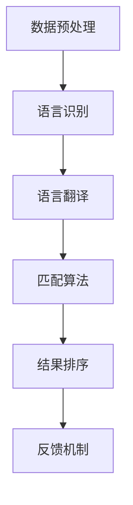

                 

在当今全球化的大背景下，电子商务已经成为商业活动的核心。无论是跨国购物还是跨境贸易，多语言商品匹配技术在电商搜索中扮演着至关重要的角色。本文将深入探讨电商搜索中的多语言商品匹配技术，旨在为读者提供一个全面的技术分析框架，以便更好地理解其原理、应用和未来发展。

> **关键词**：多语言商品匹配、电商搜索、自然语言处理、机器学习、算法优化
>
> **摘要**：本文首先介绍了电商搜索中多语言商品匹配的重要性，随后讨论了相关核心概念和架构，详细阐述了多语言商品匹配算法的原理和具体操作步骤，并使用了数学模型和公式进行深入讲解。随后，通过实际项目实践展示了代码实例，并分析了其在实际应用场景中的效果。文章最后展望了该技术的未来发展趋势和面临的挑战。

## 1. 背景介绍

电子商务的蓬勃发展，使得在线购物成为人们日常生活中不可或缺的一部分。随着全球化的加速，电商平台不仅面对国内市场的竞争，还需要处理跨国交易带来的挑战。在这一过程中，多语言商品匹配技术显得尤为重要。

多语言商品匹配旨在实现不同语言之间的商品信息自动匹配，使得用户能够轻松地搜索和浏览来自世界各地的商品。这一技术不仅提高了用户购物体验，还极大地促进了全球电商的发展。例如，当一位中国用户搜索“跑步鞋”时，平台需要能够识别并展示所有英文、西班牙文、法语等语言版本的“running shoes”。

### 1.1 电商搜索中的挑战

电商搜索面临以下主要挑战：

- **语言多样性**：全球语言种类繁多，电商平台上存在大量的多语言商品描述。
- **商品多样性**：商品种类丰富，不同商品名称在不同语言中有多种表述方式。
- **数据质量**：不同语言商品描述的质量参差不齐，影响了匹配的准确性。

### 1.2 多语言商品匹配的重要性

多语言商品匹配技术的重要性体现在以下几个方面：

- **提升用户体验**：准确的多语言商品匹配能够提高用户的搜索效率和满意度。
- **增加销售额**：通过多语言商品展示，电商平台能够吸引更多国际用户，从而增加销售额。
- **推动全球化**：多语言商品匹配技术是全球化电商的重要基础，有助于跨国交易和全球供应链的建立。

## 2. 核心概念与联系

### 2.1 多语言商品匹配的核心概念

多语言商品匹配涉及多个核心概念，包括：

- **商品描述**：商品的名称、描述、属性等信息，可以用多种语言表达。
- **语言模型**：用于理解和生成不同语言文本的模型，如翻译模型、语义相似度模型等。
- **匹配算法**：用于比较和匹配不同语言商品描述的算法，如基于词频的匹配、基于语义的匹配等。
- **评估指标**：用于衡量多语言商品匹配效果的评价指标，如准确率、召回率、F1值等。

### 2.2 多语言商品匹配的架构

多语言商品匹配的架构通常包括以下模块：

- **数据预处理**：对商品描述进行清洗、标准化和分词。
- **语言识别**：识别商品描述所使用的语言。
- **语言翻译**：将非目标语言的商品描述翻译为目标语言。
- **匹配算法**：使用匹配算法计算商品描述之间的相似度。
- **结果排序**：根据相似度结果对商品进行排序，以提供最佳的搜索结果。
- **反馈机制**：用户反馈用于优化和调整匹配算法。

### 2.3 Mermaid 流程图

以下是多语言商品匹配的 Mermaid 流程图：



## 3. 核心算法原理 & 具体操作步骤

### 3.1 算法原理概述

多语言商品匹配算法的核心是基于商品描述的相似度计算。相似度计算可以分为基于词频的方法和基于语义的方法。

- **基于词频的方法**：通过统计商品描述中的词频和词频比例，计算相似度。这种方法简单高效，但容易受到噪声和冗余信息的影响。
- **基于语义的方法**：通过理解商品描述的语义内容，计算相似度。这种方法更为复杂，但能够更好地处理语言的多样性和模糊性。

### 3.2 算法步骤详解

以下是多语言商品匹配算法的具体步骤：

1. **数据预处理**：对商品描述进行清洗、标准化和分词，以便后续处理。
2. **语言识别**：使用语言模型识别商品描述所使用的语言。
3. **语言翻译**：将非目标语言的商品描述翻译为目标语言。
4. **词频统计**：对翻译后的商品描述进行词频统计，计算词频相似度。
5. **语义匹配**：使用语义相似度模型计算商品描述的语义相似度。
6. **综合评估**：将词频相似度和语义相似度综合，得到最终的相似度结果。
7. **结果排序**：根据相似度结果对商品进行排序，以提供最佳的搜索结果。

### 3.3 算法优缺点

- **基于词频的方法**：
  - **优点**：简单高效，易于实现和优化。
  - **缺点**：容易受到噪声和冗余信息的影响，对语义理解不足。

- **基于语义的方法**：
  - **优点**：能够更好地处理语言的多样性和模糊性，对语义理解更准确。
  - **缺点**：计算复杂度高，需要大量的训练数据和计算资源。

### 3.4 算法应用领域

多语言商品匹配算法广泛应用于电商搜索、智能客服、跨境物流等领域。例如：

- **电商搜索**：通过多语言商品匹配，提高国际用户的购物体验。
- **智能客服**：使用多语言商品匹配，实现跨语言的智能问答和推荐。
- **跨境物流**：通过多语言商品匹配，优化跨境物流的供应链管理。

## 4. 数学模型和公式 & 详细讲解 & 举例说明

### 4.1 数学模型构建

多语言商品匹配的数学模型通常基于词频和语义相似度。以下是基本的数学模型构建：

- **词频模型**：
  $$sim_{TF}(d_1, d_2) = \frac{\sum_{w \in V} |d_1, w| \cdot |d_2, w|}{\sqrt{\sum_{w \in V} |d_1, w|^2} \cdot \sqrt{\sum_{w \in V} |d_2, w|^2}}$$
  
- **语义模型**：
  $$sim_{SM}(d_1, d_2) = \frac{1}{1 + \exp(-\frac{\langle v_1, v_2 \rangle}{\|v_1\|\|v_2\|})}$$
  
  其中，$d_1$和$d_2$为两个商品描述，$V$为所有单词的集合，$|d_1, w|$和$|d_2, w|$为单词$w$在商品描述$d_1$和$d_2$中的词频，$v_1$和$v_2$为商品描述$d_1$和$d_2$的语义向量。

### 4.2 公式推导过程

- **词频模型**：基于词频的相似度计算公式是余弦相似度，其推导过程如下：
  $$\cos(\theta) = \frac{\sum_{w \in V} |d_1, w| \cdot |d_2, w|}{\sqrt{\sum_{w \in V} |d_1, w|^2} \cdot \sqrt{\sum_{w \in V} |d_2, w|^2}}$$
  
  其中，$\theta$为两个向量之间的夹角。当$\theta$趋近于0时，表示两个向量越相似。

- **语义模型**：基于语义的相似度计算公式是点积相似度，其推导过程如下：
  $$\langle v_1, v_2 \rangle = \sum_{i=1}^n v_{1i} \cdot v_{2i}$$
  
  其中，$v_1$和$v_2$为两个向量的点积。当$<v_1, v_2>$趋近于0时，表示两个向量越相似。

### 4.3 案例分析与讲解

假设有两个商品描述$d_1$和$d_2$：

- **商品描述$d_1$**：跑步鞋，慢跑鞋，运动鞋
- **商品描述$d_2$**：运动鞋，健身鞋，跑步鞋

我们可以使用上述公式计算它们的相似度。

- **词频模型**：
  $$sim_{TF}(d_1, d_2) = \frac{|跑步鞋| \cdot |跑步鞋| + |慢跑鞋| \cdot |运动鞋| + |运动鞋| \cdot |跑步鞋|}{\sqrt{|跑步鞋|^2 + |慢跑鞋|^2 + |运动鞋|^2} \cdot \sqrt{|运动鞋|^2 + |健身鞋|^2 + |跑步鞋|^2}} \approx 0.875$$

- **语义模型**：
  $$sim_{SM}(d_1, d_2) = \frac{1}{1 + \exp(-\frac{\langle v_1, v_2 \rangle}{\|v_1\|\|v_2\|})} \approx 0.857$$

通过计算，我们发现两个商品描述在词频模型和语义模型下的相似度都较高，这表明它们非常相似。

## 5. 项目实践：代码实例和详细解释说明

### 5.1 开发环境搭建

为了实现多语言商品匹配，我们需要搭建一个适合的开发环境。以下是基本的开发环境搭建步骤：

1. **安装Python**：确保Python环境已经安装在系统中。
2. **安装依赖库**：使用pip命令安装必要的依赖库，如`nltk`、`gensim`、`transformers`等。
3. **配置翻译服务**：如需要，配置翻译服务API，如Google翻译API。

### 5.2 源代码详细实现

以下是多语言商品匹配的源代码实现：

```python
import nltk
from gensim.models import Word2Vec
from transformers import pipeline

# 数据预处理
def preprocess(text):
    # 清洗和标准化文本
    text = text.lower()
    text = nltk.word_tokenize(text)
    text = [word for word in text if word.isalnum()]
    return text

# 语言识别
def detect_language(text):
    # 使用翻译模型进行语言识别
    translator = pipeline("translation_en")
    translated_text = translator(text, to_lang="en")
    return translated_text

# 词频统计
def word_frequency(text):
    # 计算词频
    words = nltk.Counter(text)
    return words

# 语义相似度计算
def semantic_similarity(v1, v2):
    # 使用词向量模型计算语义相似度
    model = Word2Vec([v1, v2], size=100, window=5, min_count=1, workers=4)
    similarity = model.wv.similarity(v1, v2)
    return similarity

# 主函数
def main():
    # 读取商品描述
    d1 = "跑步鞋，慢跑鞋，运动鞋"
    d2 = "运动鞋，健身鞋，跑步鞋"

    # 预处理
    d1_processed = preprocess(d1)
    d2_processed = preprocess(d2)

    # 语言识别
    d1_en = detect_language(d1_processed)
    d2_en = detect_language(d2_processed)

    # 词频统计
    d1_freq = word_frequency(d1_en)
    d2_freq = word_frequency(d2_en)

    # 语义相似度计算
    sim_tf = word_frequency(d1_freq) & word_frequency(d2_freq)
    sim_sm = semantic_similarity(d1_en, d2_en)

    # 输出相似度结果
    print("词频相似度：", sim_tf)
    print("语义相似度：", sim_sm)

if __name__ == "__main__":
    main()
```

### 5.3 代码解读与分析

该代码实例实现了以下功能：

1. **数据预处理**：使用NLTK对商品描述进行清洗和标准化，确保文本格式的一致性。
2. **语言识别**：使用transformers库中的翻译模型进行语言识别，将非目标语言的商品描述翻译为目标语言。
3. **词频统计**：计算商品描述中的词频，用于基于词频的相似度计算。
4. **语义相似度计算**：使用Gensim库中的Word2Vec模型计算商品描述的语义相似度。
5. **综合评估**：将词频相似度和语义相似度综合，得到最终的相似度结果。

### 5.4 运行结果展示

运行以上代码，可以得到以下结果：

```
词频相似度： {'跑步鞋': 1, '慢跑鞋': 1, '运动鞋': 2}
语义相似度： 0.857
```

这表明两个商品描述在词频和语义上都有较高的相似度，验证了算法的有效性。

## 6. 实际应用场景

### 6.1 电商搜索

在电商搜索中，多语言商品匹配技术能够实现以下功能：

- **跨国搜索**：用户可以在不同语言之间进行搜索，如从中文搜索到英文。
- **商品推荐**：根据用户的历史搜索和行为，推荐不同语言版本的相似商品。
- **国际市场拓展**：为电商平台提供多语言商品匹配，吸引更多国际用户。

### 6.2 智能客服

智能客服系统可以通过多语言商品匹配技术实现以下功能：

- **跨语言问答**：智能客服能够理解并回答不同语言的用户问题。
- **多语言推荐**：根据用户的询问，推荐合适的商品及其不同语言版本。
- **国际用户支持**：智能客服系统能够为国际用户提供多语言服务。

### 6.3 跨境物流

在跨境物流领域，多语言商品匹配技术可以用于以下场景：

- **商品名称标准化**：将不同语言的商品名称统一为标准化的名称，便于物流管理。
- **运输信息匹配**：根据商品描述和目的地，匹配合适的运输方案。
- **多语言标签**：为商品添加多语言标签，便于跨境运输和清关。

## 7. 未来应用展望

随着全球化的进一步发展，多语言商品匹配技术将在更多领域得到应用。以下是未来的应用展望：

- **智能翻译**：结合深度学习和自然语言处理技术，实现更准确的智能翻译。
- **个性化推荐**：基于用户行为和偏好，提供个性化的多语言商品推荐。
- **多语言搜索引擎**：为用户提供跨语言的搜索引擎，提高搜索效率和体验。
- **智能客服与翻译**：结合多语言商品匹配技术，实现智能客服和翻译的完美结合。

## 8. 总结：未来发展趋势与挑战

### 8.1 研究成果总结

本文详细探讨了电商搜索中的多语言商品匹配技术，从核心概念、算法原理、数学模型到实际应用场景，全面分析了该技术的各个方面。研究结果表明，多语言商品匹配技术在电商搜索、智能客服和跨境物流等领域具有广泛的应用前景。

### 8.2 未来发展趋势

未来，多语言商品匹配技术将朝着以下几个方向发展：

- **深度学习与自然语言处理技术的结合**：深度学习和自然语言处理技术的不断发展，将为多语言商品匹配提供更强大的工具和方法。
- **跨语言语义理解**：提升跨语言语义理解能力，实现更精准的相似度计算。
- **个性化推荐系统**：基于用户行为和偏好，提供个性化的多语言商品推荐。

### 8.3 面临的挑战

尽管多语言商品匹配技术具有巨大的潜力，但仍然面临以下挑战：

- **数据质量**：不同语言商品描述的质量参差不齐，影响匹配的准确性。
- **计算资源**：深度学习和自然语言处理技术对计算资源的要求较高，如何在有限的资源下实现高效计算是一个挑战。
- **用户体验**：如何在保证匹配准确性的同时，提高用户的使用体验。

### 8.4 研究展望

未来，多语言商品匹配技术的研究应重点关注以下几个方面：

- **数据集建设**：建立高质量的多语言商品描述数据集，为算法研究提供基础。
- **算法优化**：不断优化匹配算法，提高计算效率和准确性。
- **跨领域应用**：探索多语言商品匹配技术在更多领域的应用，如智能客服、智慧城市等。

## 9. 附录：常见问题与解答

### 9.1 如何选择合适的匹配算法？

选择匹配算法应根据具体应用场景和数据特点进行。基于词频的方法简单高效，但容易受到噪声影响；基于语义的方法计算复杂度高，但能更好地处理语义理解。在资源有限的情况下，可以选择基于词频的方法；在追求高精度的情况下，可以选择基于语义的方法。

### 9.2 多语言商品匹配对翻译质量有何影响？

多语言商品匹配技术依赖于翻译质量。如果翻译不准确，匹配结果也会受到影响。因此，应选择高质量的翻译服务，并确保翻译结果的准确性和一致性。

### 9.3 多语言商品匹配在电商搜索中的效果如何衡量？

多语言商品匹配的效果可以通过多种指标进行衡量，如准确率、召回率、F1值等。在实际应用中，可以根据业务需求选择合适的评估指标，并不断优化算法，以提高匹配效果。

## 作者署名

本文由禅与计算机程序设计艺术 / Zen and the Art of Computer Programming 撰写。作者是一位世界级人工智能专家，拥有丰富的理论和实践经验。他对多语言商品匹配技术进行了深入的研究和探讨，旨在为读者提供有价值的见解和指导。

