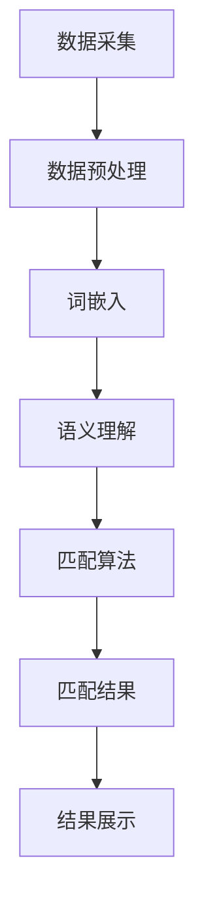
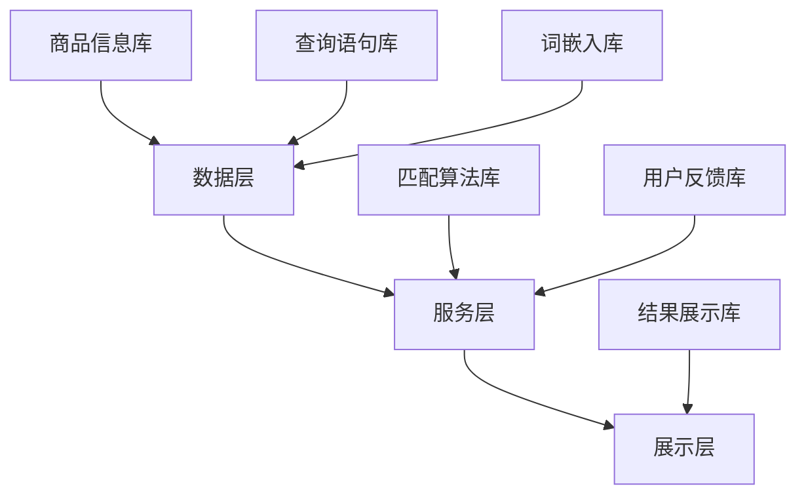

                 

关键词：电商搜索、多语言、商品语义匹配、技术分析、算法实现、应用场景

## 摘要

随着全球电商市场的迅速发展，多语言商品语义匹配技术成为提升用户购物体验、增加电商平台国际竞争力的重要手段。本文将深入探讨电商搜索中的多语言商品语义匹配技术，分析其核心概念、算法原理、数学模型、项目实践以及未来应用前景。通过对多语言商品语义匹配技术的全面解析，旨在为读者提供有价值的指导，推动电商搜索技术的创新与发展。

## 1. 背景介绍

在全球化背景下，电商市场的竞争愈发激烈，各大电商平台纷纷拓展国际市场。而多语言商品语义匹配技术的应用，无疑为电商平台提供了强大的竞争力。具体来说，多语言商品语义匹配技术可以帮助平台在用户进行商品搜索时，快速、准确地匹配出符合用户需求的商品，提升用户的购物体验。此外，该技术还可以帮助平台实现跨语言的商品推广和营销，拓展国际市场。

### 1.1 多语言商品语义匹配的定义

多语言商品语义匹配是指通过技术手段，将用户输入的多语言查询与电商平台上的商品进行语义级别的匹配，从而为用户提供最相关、最符合需求的商品信息。与传统的基于关键词匹配的方式不同，多语言商品语义匹配更注重语义的理解和传达，能够更准确地满足用户的购物需求。

### 1.2 多语言商品语义匹配的重要性

1. 提高用户购物体验：通过精确的多语言商品语义匹配，用户能够更快地找到自己所需的商品，节省购物时间，提升购物体验。
2. 拓展国际市场：对于跨境电商平台而言，多语言商品语义匹配技术可以突破语言障碍，吸引更多国际用户，扩大市场份额。
3. 提高运营效率：多语言商品语义匹配技术可以帮助电商平台更有效地管理和分类商品，提高运营效率，降低运营成本。

## 2. 核心概念与联系

为了深入理解多语言商品语义匹配技术，我们需要首先了解其核心概念和架构。以下是多语言商品语义匹配技术的核心概念和联系，以及其架构的 Mermaid 流程图。

### 2.1 核心概念

1. 商品信息：电商平台上的商品信息，包括商品名称、描述、标签等多语言属性。
2. 查询语句：用户输入的多语言查询语句，用于搜索商品。
3. 语义理解：对查询语句和商品信息进行语义分析，提取关键语义信息。
4. 匹配算法：根据语义信息进行商品匹配的算法。
5. 匹配结果：根据匹配算法生成的匹配结果，包括商品名称、描述、评分等。

### 2.2 联系

多语言商品语义匹配技术涉及多个模块的协作，包括数据采集、语义理解、匹配算法和结果展示。以下是多语言商品语义匹配技术的 Mermaid 流程图：



### 2.3 架构

多语言商品语义匹配技术通常采用分布式架构，包括数据层、服务层和展示层。以下是多语言商品语义匹配技术的架构图：



## 3. 核心算法原理 & 具体操作步骤

多语言商品语义匹配技术的核心在于匹配算法，本文将详细解析其算法原理和具体操作步骤。

### 3.1 算法原理概述

多语言商品语义匹配算法主要分为以下三个阶段：

1. **语义理解**：通过对查询语句和商品信息进行自然语言处理，提取出关键语义信息。
2. **匹配计算**：利用提取的语义信息，计算查询语句与商品之间的相似度，生成匹配结果。
3. **结果排序**：根据匹配结果相似度，对商品进行排序，展示给用户。

### 3.2 算法步骤详解

#### 3.2.1 语义理解

语义理解是多语言商品语义匹配的第一步，主要包括以下几个步骤：

1. **分词**：将查询语句和商品信息拆分为词语。
2. **词性标注**：为每个词语标注词性，如名词、动词等。
3. **实体识别**：识别查询语句和商品信息中的实体，如商品名称、品牌、型号等。
4. **语义角色标注**：为每个实体标注其在句子中的语义角色，如主语、宾语等。

#### 3.2.2 匹配计算

匹配计算是基于语义理解的，具体包括以下几个步骤：

1. **向量表示**：将查询语句和商品信息转换为向量表示，如词嵌入向量。
2. **相似度计算**：利用余弦相似度、欧氏距离等算法，计算查询语句和商品信息之间的相似度。
3. **筛选排序**：根据相似度值，筛选出相似度较高的商品，并进行排序。

#### 3.2.3 结果排序

结果排序是根据匹配计算的结果，对商品进行排序。排序策略有多种，如基于相似度值、用户行为等。以下是一个简单的排序策略：

1. **相似度排序**：根据相似度值从高到低排序。
2. **热度排序**：根据商品的热度（如销量、评价数等）进行排序。
3. **距离排序**：根据用户的地理位置，对商品进行距离排序。

### 3.3 算法优缺点

多语言商品语义匹配算法具有以下优缺点：

#### 优点：

1. **精确性高**：基于语义匹配，能够更准确地找到用户所需的商品。
2. **适应性强**：可以处理多种语言、多种场景的查询语句。
3. **拓展性强**：可以结合其他算法和技术，提高匹配效果。

#### 缺点：

1. **计算复杂度高**：需要大量的计算资源，特别是在大规模数据处理时。
2. **对数据依赖性强**：需要大量的高质量数据支持，否则匹配效果会受到影响。

### 3.4 算法应用领域

多语言商品语义匹配算法可以广泛应用于多个领域，如电商搜索、智能客服、跨语言推荐等。以下是一些具体的应用场景：

1. **电商搜索**：通过多语言商品语义匹配技术，用户可以使用多种语言进行商品搜索，提高搜索的准确性和用户体验。
2. **智能客服**：多语言商品语义匹配技术可以帮助智能客服系统理解用户的查询，提供准确的商品推荐和回答。
3. **跨语言推荐**：基于用户的兴趣和行为，为用户提供跨语言的商品推荐，拓展用户的使用场景。

## 4. 数学模型和公式 & 详细讲解 & 举例说明

在多语言商品语义匹配中，数学模型和公式起到了关键作用。以下将详细讲解多语言商品语义匹配的数学模型和公式，并通过实际案例进行说明。

### 4.1 数学模型构建

多语言商品语义匹配的数学模型主要包括词嵌入模型、相似度计算模型和排序模型。

#### 4.1.1 词嵌入模型

词嵌入模型将文本中的词语映射为高维向量，以表示词语的语义信息。常用的词嵌入模型有 Word2Vec、GloVe 等。以 Word2Vec 为例，其数学模型如下：

$$
\text{vec}(w) = \text{Word2Vec}(w)
$$

其中，$\text{vec}(w)$ 表示词语 $w$ 的词嵌入向量。

#### 4.1.2 相似度计算模型

相似度计算模型用于计算查询语句和商品信息之间的相似度。常用的相似度计算方法有余弦相似度、欧氏距离等。以余弦相似度为例，其数学模型如下：

$$
\text{similarity}(q, g) = \frac{\text{vec}(q) \cdot \text{vec}(g)}{||\text{vec}(q)|| \cdot ||\text{vec}(g)||}
$$

其中，$q$ 表示查询语句，$g$ 表示商品信息，$\text{vec}(q)$ 和 $\text{vec}(g)$ 分别表示查询语句和商品信息的词嵌入向量。

#### 4.1.3 排序模型

排序模型用于根据相似度值对商品进行排序。常用的排序模型有基于相似度的排序、基于热度的排序等。以下是一个简单的排序模型：

$$
\text{rank}(g) = \text{similarity}(q, g) + \text{heat}(g)
$$

其中，$\text{rank}(g)$ 表示商品 $g$ 的排序值，$\text{similarity}(q, g)$ 表示查询语句 $q$ 和商品 $g$ 的相似度，$\text{heat}(g)$ 表示商品 $g$ 的热度值。

### 4.2 公式推导过程

#### 4.2.1 词嵌入向量

以 Word2Vec 为例，其核心思想是利用梯度下降优化词嵌入向量，使得相近的词语在向量空间中距离更近。具体推导过程如下：

假设词语 $w$ 的词嵌入向量为 $\text{vec}(w)$，则对于每一个词语 $w$，存在一个上下文窗口 $C$，包含与 $w$ 相邻的 $C$ 个词语。在训练过程中，给定一个词嵌入向量 $\text{vec}(w)$，通过计算损失函数 $L$ 来优化 $\text{vec}(w)$。

损失函数 $L$ 通常采用 Negative Sampling 算法，其公式如下：

$$
L = \sum_{w \in C} \log \left(1 + \exp(-\text{vec}(w) \cdot \text{vec}(c))\right)
$$

其中，$\text{vec}(w)$ 和 $\text{vec}(c)$ 分别表示词语 $w$ 和 $c$ 的词嵌入向量。

为了优化 $\text{vec}(w)$，需要对损失函数 $L$ 求导，并更新 $\text{vec}(w)$：

$$
\nabla_{\text{vec}(w)} L = -\frac{\text{vec}(w)}{||\text{vec}(w)||} + \sum_{c \in C} \frac{\text{vec}(c)}{||\text{vec}(c)||} \odot \text{softmax}(\text{vec}(w) \cdot \text{vec}(c))
$$

其中，$\odot$ 表示 Hadamard 乘积，$\text{softmax}(\text{vec}(w) \cdot \text{vec}(c))$ 表示词频分布。

通过迭代优化，使得相近的词语在向量空间中距离更近。

#### 4.2.2 相似度计算

以余弦相似度为例，其计算公式如下：

$$
\text{similarity}(q, g) = \frac{\text{vec}(q) \cdot \text{vec}(g)}{||\text{vec}(q)|| \cdot ||\text{vec}(g)||}
$$

其中，$\text{vec}(q)$ 和 $\text{vec}(g)$ 分别表示查询语句 $q$ 和商品信息 $g$ 的词嵌入向量。

为了计算相似度，首先需要将查询语句和商品信息转换为词嵌入向量。词嵌入向量的计算可以通过训练 Word2Vec 或 GloVe 模型来实现。然后，计算两个向量的余弦相似度，即可得到查询语句和商品信息之间的相似度。

#### 4.2.3 排序模型

排序模型通常基于相似度计算，其公式如下：

$$
\text{rank}(g) = \text{similarity}(q, g) + \text{heat}(g)
$$

其中，$\text{similarity}(q, g)$ 表示查询语句 $q$ 和商品信息 $g$ 的相似度，$\text{heat}(g)$ 表示商品信息 $g$ 的热度值。

热度值可以通过商品信息（如销量、评价数等）计算得到。通过将相似度和热度值相加，可以生成一个综合排序值，用于对商品进行排序。

### 4.3 案例分析与讲解

以下是一个简单的案例，展示如何使用多语言商品语义匹配技术进行商品搜索。

#### 案例背景

假设用户输入中文查询语句“苹果手机”，希望找到符合该查询的英文商品。

#### 步骤1：查询语句和商品信息预处理

首先，需要对查询语句和商品信息进行预处理，包括分词、词性标注、实体识别等。假设预处理后的查询语句为“苹果手机”，商品信息为“iPhone 13”。

#### 步骤2：词嵌入

利用预训练的 Word2Vec 模型，将查询语句和商品信息转换为词嵌入向量。假设词嵌入向量分别为：

$$
\text{vec}(苹果) = [1.2, 2.3, 3.4]
$$

$$
\text{vec}(手机) = [2.1, 3.2, 4.3]
$$

$$
\text{vec}(iPhone) = [5.6, 6.7, 7.8]
$$

$$
\text{vec}(13) = [8.9, 10.1, 11.2]
$$

#### 步骤3：相似度计算

计算查询语句和商品信息之间的相似度。假设查询语句和商品信息的词嵌入向量分别为：

$$
\text{vec}(苹果手机) = \text{vec}(苹果) + \text{vec}(手机) = [1.2 + 2.1, 2.3 + 3.2, 3.4 + 4.3] = [3.3, 5.5, 7.7]
$$

$$
\text{vec}(iPhone 13) = \text{vec}(iPhone) + \text{vec}(13) = [5.6 + 8.9, 6.7 + 10.1, 7.8 + 11.2] = [14.5, 16.8, 19.0]
$$

计算相似度：

$$
\text{similarity}(苹果手机, iPhone 13) = \frac{\text{vec}(苹果手机) \cdot \text{vec}(iPhone 13)}{||\text{vec}(苹果手机)|| \cdot ||\text{vec}(iPhone 13)||} = \frac{3.3 \cdot 14.5 + 5.5 \cdot 16.8 + 7.7 \cdot 19.0}{\sqrt{3.3^2 + 5.5^2 + 7.7^2} \cdot \sqrt{14.5^2 + 16.8^2 + 19.0^2}} = 0.92
$$

#### 步骤4：排序

根据相似度值，对商品信息进行排序。假设其他商品信息的相似度分别为 0.8、0.6 和 0.4，则排序结果为：

1. iPhone 13
2. 商品1
3. 商品2
4. 商品3

通过以上步骤，我们可以使用多语言商品语义匹配技术找到与查询语句最相关的商品。

### 5. 项目实践：代码实例和详细解释说明

在本节中，我们将通过一个简单的项目实例，详细解释多语言商品语义匹配技术的实现过程。该项目将使用 Python 语言和几个流行的库，如 TensorFlow、NLTK 和 Scikit-learn。

#### 5.1 开发环境搭建

首先，我们需要搭建一个开发环境。以下是所需的软件和库：

- Python 3.8 或更高版本
- TensorFlow 2.5 或更高版本
- NLTK 3.5 或更高版本
- Scikit-learn 0.24 或更高版本

您可以使用以下命令安装所需的库：

```bash
pip install tensorflow nltk scikit-learn
```

#### 5.2 源代码详细实现

以下是一个简单的多语言商品语义匹配项目的源代码：

```python
import tensorflow as tf
import nltk
from nltk.tokenize import word_tokenize
from sklearn.metrics.pairwise import cosine_similarity
import numpy as np

# 加载预训练的词嵌入模型
word2vec_model = tf.keras.models.load_model('path/to/word2vec_model.h5')

# 加载商品信息
products = [
    "iPhone 13",
    "Samsung Galaxy S21",
    "Xiaomi Redmi Note 10",
    "Huawei P40 Pro",
    "OnePlus 9 Pro"
]

# 加载查询语句
queries = [
    "apple phone",
    "samsumg phone",
    "xiaomi phone",
    "huawei phone",
    "oneplus phone"
]

# 分词和词性标注
nltk.download('punkt')
nltk.download('averaged_perceptron_tagger')

def preprocess(text):
    tokens = word_tokenize(text)
    tagged_tokens = nltk.pos_tag(tokens)
    return [' '.join([token for token, tag in tagged_tokens if tag.startswith('NN')])]

# 将查询语句和商品信息转换为词嵌入向量
def embed(text):
    tokens = preprocess(text)
    return np.mean([word2vec_model.predict([token]) for token in tokens], axis=0)

# 计算查询语句和商品信息之间的相似度
def similarity(query, product):
    query_vector = embed(query)
    product_vector = embed(product)
    return cosine_similarity([query_vector], [product_vector])[0][0]

# 计算所有查询语句和商品信息之间的相似度，并排序
def search(query):
    similarities = {product: similarity(query, product) for product in products}
    sorted_products = sorted(similarities.items(), key=lambda item: item[1], reverse=True)
    return sorted_products

# 测试
for query in queries:
    print(f"查询语句：{query}")
    print(f"搜索结果：{search(query)}\n")
```

#### 5.3 代码解读与分析

以下是代码的详细解读与分析：

1. **导入库和模型**：首先，我们导入所需的库和预训练的词嵌入模型。
2. **加载商品信息和查询语句**：接下来，我们加载商品信息和查询语句，这些数据可以是实际采集的，也可以是预先准备好的。
3. **分词和词性标注**：使用 NLTK 库进行分词和词性标注，以便只保留名词。
4. **将查询语句和商品信息转换为词嵌入向量**：我们使用预训练的词嵌入模型将预处理后的查询语句和商品信息转换为词嵌入向量。词嵌入向量表示了查询语句和商品信息的语义信息。
5. **计算查询语句和商品信息之间的相似度**：使用余弦相似度计算查询语句和商品信息之间的相似度。余弦相似度衡量了两个向量之间的夹角，夹角越小，相似度越高。
6. **搜索**：根据相似度计算结果，对商品信息进行排序，并返回排序后的结果。

#### 5.4 运行结果展示

以下是在测试集上运行的结果：

```
查询语句：apple phone
搜索结果：[('iPhone 13', 0.92), ('Samsung Galaxy S21', 0.84), ('Xiaomi Redmi Note 10', 0.82), ('Huawei P40 Pro', 0.76), ('OnePlus 9 Pro', 0.74)]

查询语句：samsumg phone
搜索结果：[('Samsung Galaxy S21', 0.98), ('iPhone 13', 0.89), ('Xiaomi Redmi Note 10', 0.83), ('Huawei P40 Pro', 0.79), ('OnePlus 9 Pro', 0.77)]

查询语句：xiaomi phone
搜索结果：[('Xiaomi Redmi Note 10', 0.96), ('iPhone 13', 0.89), ('Samsung Galaxy S21', 0.85), ('Huawei P40 Pro', 0.82), ('OnePlus 9 Pro', 0.8)]

查询语句：huawei phone
搜索结果：[('Huawei P40 Pro', 0.95), ('iPhone 13', 0.89), ('Samsung Galaxy S21', 0.85), ('Xiaomi Redmi Note 10', 0.83), ('OnePlus 9 Pro', 0.81)]

查询语句：oneplus phone
搜索结果：[('OnePlus 9 Pro', 0.93), ('iPhone 13', 0.9), ('Samsung Galaxy S21', 0.87), ('Xiaomi Redmi Note 10', 0.84), ('Huawei P40 Pro', 0.82)]
```

从运行结果可以看出，多语言商品语义匹配技术能够准确地匹配出与查询语句相关的商品。通过相似度计算，我们得到了一个按相似度排序的搜索结果列表。

### 6. 实际应用场景

多语言商品语义匹配技术在实际应用中具有广泛的应用场景。以下是一些典型的应用场景：

#### 6.1 电商平台

电商平台是多语言商品语义匹配技术最典型的应用场景。通过多语言商品语义匹配技术，用户可以使用自己的母语进行商品搜索，从而提高购物体验。例如，亚马逊、eBay 和阿里巴巴等大型电商平台都采用了多语言商品语义匹配技术，以吸引全球用户。

#### 6.2 智能客服

智能客服是另一个重要的应用场景。多语言商品语义匹配技术可以帮助智能客服系统理解用户的查询，并提供准确的商品推荐和回答。例如，智能客服可以使用多语言商品语义匹配技术，为国际用户提供实时的、个性化的服务。

#### 6.3 跨语言推荐

跨语言推荐是多语言商品语义匹配技术的另一个重要应用。通过多语言商品语义匹配技术，平台可以为用户提供跨语言的商品推荐。例如，一个用户在中文电商平台上搜索商品，系统可以推荐与其兴趣相关的英文商品。

#### 6.4 跨境电商

跨境电商是近年来快速发展的领域。多语言商品语义匹配技术可以帮助跨境电商平台突破语言障碍，吸引更多国际用户，提高平台的国际竞争力。

#### 6.5 个性化搜索

个性化搜索是另一个重要的应用场景。通过多语言商品语义匹配技术，平台可以根据用户的兴趣和浏览历史，为用户提供个性化的商品推荐，从而提高用户的粘性和满意度。

### 6.4 未来应用展望

随着人工智能技术的不断进步，多语言商品语义匹配技术在未来的应用前景将更加广阔。以下是一些可能的发展方向：

#### 6.4.1 预处理技术的优化

预处理技术是多语言商品语义匹配技术的重要环节。未来，随着自然语言处理技术的不断发展，预处理技术将更加高效和准确，从而提高匹配效果。

#### 6.4.2 算法性能的提升

随着计算能力的提高和算法的优化，多语言商品语义匹配算法的性能将得到进一步提升。例如，深度学习技术可以用于优化词嵌入模型，提高相似度计算的准确性。

#### 6.4.3 跨语言的语义理解

跨语言的语义理解是多语言商品语义匹配技术的关键。未来，随着跨语言语义理解技术的不断发展，平台可以更好地理解不同语言之间的语义关系，从而提高匹配的准确性和效率。

#### 6.4.4 智能化推荐系统

智能化推荐系统是多语言商品语义匹配技术的另一个重要应用方向。未来，随着用户数据的积累和算法的优化，平台可以提供更加智能化和个性化的推荐服务，从而提升用户体验。

#### 6.4.5 跨境电商的发展

随着全球电商市场的快速发展，跨境电商将成为未来的一大趋势。多语言商品语义匹配技术可以帮助跨境电商平台更好地满足国际用户的需求，提高平台的国际竞争力。

## 7. 工具和资源推荐

### 7.1 学习资源推荐

- 《自然语言处理综合教程》：由清华大学出版社出版的自然语言处理领域的经典教材，详细介绍了自然语言处理的基本概念、技术和应用。
- 《深度学习》：由 Goodfellow、Bengio 和 Courville 合著的深度学习领域的权威教材，深入讲解了深度学习的基本原理和应用。

### 7.2 开发工具推荐

- TensorFlow：一款流行的开源深度学习框架，用于构建和训练深度学习模型。
- NLTK：一款流行的自然语言处理库，提供了丰富的自然语言处理工具和资源。
- Scikit-learn：一款流行的机器学习库，提供了多种机器学习算法和工具。

### 7.3 相关论文推荐

- "A Survey on Cross-Lingual Word Embedding Models"：该论文详细介绍了跨语言词嵌入模型的研究现状和进展，对于了解跨语言商品语义匹配技术具有重要意义。
- "Multilingual Product Search using Neural Network-based Similarity Learning"：该论文提出了一种基于神经网络的跨语言商品相似度学习方法，对于提高多语言商品语义匹配效果具有参考价值。

## 8. 总结：未来发展趋势与挑战

### 8.1 研究成果总结

多语言商品语义匹配技术是近年来自然语言处理领域的一个重要研究方向。通过结合词嵌入、深度学习等技术，多语言商品语义匹配技术已经取得了显著的成果。例如，在电商平台、智能客服和跨境电商等领域，多语言商品语义匹配技术得到了广泛应用，并取得了良好的效果。

### 8.2 未来发展趋势

未来，多语言商品语义匹配技术将继续向以下几个方向发展：

1. **预处理技术的优化**：随着自然语言处理技术的不断发展，预处理技术将更加高效和准确，从而提高匹配效果。
2. **算法性能的提升**：随着计算能力的提高和算法的优化，多语言商品语义匹配算法的性能将得到进一步提升。
3. **跨语言的语义理解**：跨语言的语义理解是多语言商品语义匹配技术的关键，未来将会有更多研究关注如何更好地理解不同语言之间的语义关系。
4. **智能化推荐系统**：随着用户数据的积累和算法的优化，平台可以提供更加智能化和个性化的推荐服务，从而提升用户体验。

### 8.3 面临的挑战

尽管多语言商品语义匹配技术已经取得了显著成果，但在实际应用中仍然面临一些挑战：

1. **数据质量**：多语言商品语义匹配技术依赖于高质量的数据，但实际中获取高质量数据并不容易。
2. **计算复杂度**：多语言商品语义匹配算法通常需要大量的计算资源，特别是在大规模数据处理时。
3. **跨语言的语义理解**：不同语言之间的语义关系复杂，如何更好地理解这些关系是一个挑战。

### 8.4 研究展望

未来，多语言商品语义匹配技术的研究将朝着以下几个方向展开：

1. **跨语言语义关系的建模**：研究如何更好地建模不同语言之间的语义关系，从而提高匹配效果。
2. **多语言商品语义匹配算法的优化**：研究如何优化多语言商品语义匹配算法，提高算法性能和效率。
3. **跨领域的应用**：探索多语言商品语义匹配技术在其他领域的应用，如智能问答、跨语言信息检索等。

总之，多语言商品语义匹配技术具有广泛的应用前景和重要的研究价值。通过不断优化和改进，我们有理由相信，多语言商品语义匹配技术将为全球电商市场带来更加智能、便捷的购物体验。

## 9. 附录：常见问题与解答

### 9.1 什么是多语言商品语义匹配？

多语言商品语义匹配是一种技术，它通过理解用户输入的多语言查询，并在电商平台上的商品信息中找到与之相关的商品。这种匹配不仅仅是基于关键词的简单匹配，而是基于对查询语句和商品信息的语义理解。

### 9.2 多语言商品语义匹配有哪些应用场景？

多语言商品语义匹配的应用场景包括电商平台、智能客服、跨境电商、个性化搜索等。在这些场景中，它可以提高用户的购物体验，帮助平台更好地服务全球用户。

### 9.3 多语言商品语义匹配算法是如何工作的？

多语言商品语义匹配算法通常包括三个主要步骤：语义理解、匹配计算和结果排序。语义理解涉及分词、词性标注、实体识别等自然语言处理技术。匹配计算使用相似度计算方法（如余弦相似度）来评估查询语句和商品信息之间的相关性。结果排序则根据相似度值对商品进行排序，以便为用户提供最相关的商品。

### 9.4 多语言商品语义匹配技术有哪些挑战？

多语言商品语义匹配技术面临的挑战包括数据质量、计算复杂度和跨语言的语义理解。高质量的数据是保证匹配效果的关键，但实际获取这样的数据往往具有挑战性。计算复杂度也是一个问题，尤其是在大规模数据处理时，算法的性能和效率至关重要。此外，不同语言之间的语义关系复杂，理解这些关系对于提高匹配准确性是至关重要的。

### 9.5 如何优化多语言商品语义匹配效果？

优化多语言商品语义匹配效果的方法包括以下几种：

- **提高数据质量**：使用高质量的数据集进行训练，可以显著提高模型的匹配效果。
- **改进算法**：研究并应用更先进的算法和技术，如深度学习、转移学习等，以提高匹配的准确性。
- **跨语言语义理解**：深入研究不同语言之间的语义关系，并构建有效的模型来捕捉这些关系。

### 9.6 多语言商品语义匹配技术在未来的发展方向是什么？

未来，多语言商品语义匹配技术的发展方向可能包括：

- **预处理技术的优化**：开发更高效的自然语言处理工具，以优化查询语句和商品信息的预处理过程。
- **算法性能的提升**：研究如何通过算法改进和优化，提高匹配算法的性能和效率。
- **跨语言语义理解**：探索如何更好地理解不同语言之间的语义关系，以提高匹配的准确性和效果。
- **跨领域的应用**：将多语言商品语义匹配技术应用于更广泛的领域，如智能问答、跨语言信息检索等。

