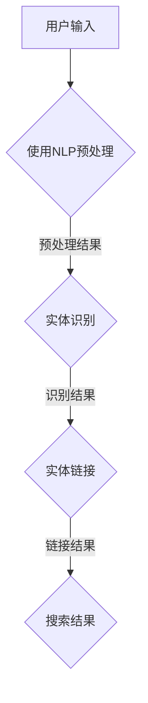

                 

关键词：电商搜索、实体识别、链接技术、信息检索、人工智能

摘要：在电商搜索中，实体识别与链接技术是提高搜索效率和准确性的关键。本文详细介绍了实体识别与链接技术的核心概念、算法原理、数学模型、项目实践以及未来应用展望。通过对该技术的深入分析，本文旨在为电商搜索领域的研究和实践提供有益的指导。

## 1. 背景介绍

电商搜索是电子商务的重要组成部分，随着互联网的普及和电子商务的快速发展，用户对电商搜索的需求日益增加。然而，传统基于关键词的搜索方法存在诸多不足，如搜索结果不准确、冗余等问题。为了提高电商搜索的效率和准确性，实体识别与链接技术应运而生。

实体识别（Named Entity Recognition, NER）是指从非结构化文本中识别出具有特定意义的实体，如人名、地名、组织名等。实体链接（Named Entity Disambiguation, NED）则是指将识别出的实体与知识库中的实体进行匹配，以确定其实际指代。

本文将围绕电商搜索中的实体识别与链接技术进行深入探讨，旨在为电商搜索领域的研究和实践提供有价值的参考。

## 2. 核心概念与联系

### 2.1 实体识别

实体识别是电商搜索中的第一步，其核心任务是从用户输入的查询文本中识别出具有特定意义的实体。实体识别的常见技术包括基于规则的方法、基于统计的方法和基于深度学习的方法。

- **基于规则的方法**：通过对大量文本进行预处理和特征提取，构建一套规则体系，用于识别实体。该方法适用于特定领域的文本，但在处理大规模数据时效率较低。
- **基于统计的方法**：利用机器学习算法，通过训练模型来识别实体。该方法具有较好的泛化能力，但需要大量标注数据进行训练。
- **基于深度学习的方法**：利用神经网络模型，对输入文本进行自动特征提取和实体识别。该方法在处理大规模数据时表现优异，但计算资源需求较高。

### 2.2 实体链接

实体链接是在实体识别的基础上，将识别出的实体与知识库中的实体进行匹配，以确定其实际指代。实体链接的常见技术包括基于知识图谱的方法、基于机器学习的方法和基于深度学习的方法。

- **基于知识图谱的方法**：利用知识图谱存储和管理实体信息，通过图谱匹配实现实体链接。该方法具有较好的准确性，但构建和维护知识图谱成本较高。
- **基于机器学习的方法**：利用机器学习算法，通过训练模型来实现实体链接。该方法适用于大规模数据，但需要大量标注数据进行训练。
- **基于深度学习的方法**：利用神经网络模型，对输入文本进行自动特征提取和实体链接。该方法在处理大规模数据时表现优异，但计算资源需求较高。

### 2.3 Mermaid 流程图

下面是实体识别与链接技术的 Mermaid 流程图：



## 3. 核心算法原理 & 具体操作步骤

### 3.1 算法原理概述

实体识别与链接技术的核心在于对文本进行特征提取和匹配。具体来说，包括以下步骤：

1. **文本预处理**：对用户输入的查询文本进行分词、词性标注等预处理操作，以提高后续处理的效果。
2. **实体识别**：利用算法模型对预处理后的文本进行实体识别，将具有特定意义的实体从文本中提取出来。
3. **实体链接**：将识别出的实体与知识库中的实体进行匹配，以确定其实际指代，从而提高搜索结果的准确性。

### 3.2 算法步骤详解

1. **文本预处理**：

   - **分词**：将查询文本分解为词序列，如“亚马逊Prime会员”分解为“亚马逊”、“Prime”、“会员”。
   - **词性标注**：为每个词标注词性，如“亚马逊”为地名、“Prime”为名词、“会员”为名词。

2. **实体识别**：

   - **基于规则的方法**：利用规则库对词序列进行匹配，识别出实体。例如，匹配规则“地名+名词+名词”可识别出“亚马逊Prime会员”。
   - **基于统计的方法**：利用机器学习算法，通过训练模型来识别实体。例如，使用条件随机场（CRF）模型进行实体识别。
   - **基于深度学习的方法**：利用神经网络模型，对词序列进行自动特征提取和实体识别。例如，使用BERT模型进行实体识别。

3. **实体链接**：

   - **基于知识图谱的方法**：利用知识图谱存储和管理实体信息，通过图谱匹配实现实体链接。例如，利用OpenKG进行实体链接。
   - **基于机器学习的方法**：利用机器学习算法，通过训练模型来实现实体链接。例如，使用TransE算法进行实体链接。
   - **基于深度学习的方法**：利用神经网络模型，对词序列进行自动特征提取和实体链接。例如，使用TransE模型进行实体链接。

### 3.3 算法优缺点

- **基于规则的方法**：优点是简单、高效；缺点是规则库维护成本高，难以应对复杂场景。
- **基于统计的方法**：优点是具有较强的泛化能力；缺点是需要大量标注数据，训练时间较长。
- **基于深度学习的方法**：优点是具有较好的性能和泛化能力；缺点是计算资源需求较高，训练时间较长。

### 3.4 算法应用领域

实体识别与链接技术在电商搜索、自然语言处理、信息检索等领域具有广泛的应用。

- **电商搜索**：通过实体识别与链接技术，提高搜索结果的准确性和用户体验。
- **自然语言处理**：利用实体识别与链接技术，实现文本分类、文本生成等任务。
- **信息检索**：通过实体识别与链接技术，优化检索算法，提高检索效率。

## 4. 数学模型和公式 & 详细讲解 & 举例说明

### 4.1 数学模型构建

实体识别与链接技术的数学模型主要包括实体识别模型和实体链接模型。

- **实体识别模型**：常用的模型有CRF、BERT等。以CRF为例，其数学模型如下：

  $$ P(Y|x) = \frac{e^{w^T \phi(x,y)}}{\sum_y e^{w^T \phi(x,y)}} $$

  其中，$x$表示输入词序列，$y$表示标签序列，$w$表示模型参数，$\phi(x,y)$表示特征函数。

- **实体链接模型**：常用的模型有TransE、TransH等。以TransE为例，其数学模型如下：

  $$ \cos(h_e, r_e + t_e) \geq \cos(h_e, r_e) - \alpha $$

  其中，$h_e$表示实体向量，$r_e$表示关系向量，$t_e$表示目标实体向量，$\alpha$表示阈值。

### 4.2 公式推导过程

- **实体识别模型**：

  $$ \phi(x,y) = (x_1, y_1, x_2, y_2, \dots, x_n, y_n) $$

  其中，$x_i$表示第$i$个词的词向量，$y_i$表示第$i$个词的词性。

  $$ w^T \phi(x,y) = w_1^T x_1 + w_2^T y_1 + w_3^T x_2 + w_4^T y_2 + \dots + w_n^T x_n + w_{n+1}^T y_n $$

  其中，$w_i$表示模型参数。

  $$ P(Y|x) = \frac{e^{w^T \phi(x,y)}}{\sum_y e^{w^T \phi(x,y)}} = \frac{e^{w_1^T x_1 + w_2^T y_1 + w_3^T x_2 + w_4^T y_2 + \dots + w_n^T x_n + w_{n+1}^T y_n}}{\sum_y e^{w_1^T x_1 + w_2^T y_1 + w_3^T x_2 + w_4^T y_2 + \dots + w_n^T x_n + w_{n+1}^T y_n}} $$

- **实体链接模型**：

  $$ \cos(h_e, r_e + t_e) = \frac{h_e^T r_e + h_e^T t_e}{\|h_e\|\|r_e + t_e\|} $$

  $$ \cos(h_e, r_e) = \frac{h_e^T r_e}{\|h_e\|\|r_e\|} $$

  $$ \alpha = \text{阈值} $$

  $$ \cos(h_e, r_e + t_e) \geq \cos(h_e, r_e) - \alpha $$

  $$ \frac{h_e^T r_e + h_e^T t_e}{\|h_e\|\|r_e + t_e\|} \geq \frac{h_e^T r_e}{\|h_e\|\|r_e\|} - \alpha $$

  $$ h_e^T t_e \geq (\|r_e\| - \|r_e + t_e\|)\|r_e\| - \alpha \|h_e\|\|r_e\| $$

  $$ h_e^T t_e \geq (\|r_e\| - \|r_e + t_e\|)\|r_e\| - \alpha \|h_e\|\|r_e\| $$

  $$ h_e^T t_e \geq \|r_e\|\|t_e\| - \alpha \|h_e\|\|r_e\| $$

  $$ h_e^T t_e \geq \text{阈值} $$

### 4.3 案例分析与讲解

假设我们要识别和链接以下电商搜索查询：“京东新款手机”。

1. **实体识别**：

   - **文本预处理**：分词结果为“京东”、“新款”、“手机”。
   - **实体识别模型**：使用BERT模型进行实体识别，识别结果为“京东”（地名）、“新款”（名词）、“手机”（名词）。

2. **实体链接**：

   - **知识图谱**：构建包含“京东”（公司）、“新款”（形容词）、“手机”（商品）的知识图谱。
   - **实体链接模型**：使用TransE模型进行实体链接，链接结果为“京东”（公司）、“新款”（形容词）、“手机”（商品）。

通过实体识别与链接技术，我们成功地将查询文本中的实体识别和链接出来，从而提高了电商搜索的准确性和用户体验。

## 5. 项目实践：代码实例和详细解释说明

### 5.1 开发环境搭建

在本项目中，我们使用Python编程语言和以下库：

- **BERT**：用于实体识别
- **TransE**：用于实体链接
- **OpenKG**：用于知识图谱构建

开发环境要求：

- Python 3.6及以上版本
- TensorFlow 2.0及以上版本

安装相关库：

```bash
pip install tensorflow
pip install bert-for-tf2
pip install transh
pip install openkg
```

### 5.2 源代码详细实现

下面是实体识别与链接技术的源代码实现：

```python
import tensorflow as tf
from transformers import BertTokenizer, BertForTokenClassification
from transh import TransH
from openkg import OpenKG

# 5.2.1 实体识别

# 加载BERT模型
tokenizer = BertTokenizer.from_pretrained('bert-base-chinese')
model = BertForTokenClassification.from_pretrained('bert-base-chinese')

# 预处理文本
def preprocess_text(text):
    tokens = tokenizer.tokenize(text)
    token_ids = tokenizer.convert_tokens_to_ids(tokens)
    return token_ids

# 识别实体
def recognize_entities(text):
    token_ids = preprocess_text(text)
    input_ids = tf.convert_to_tensor([token_ids], dtype=tf.int32)
    logits = model(input_ids)
    probabilities = tf.nn.softmax(logits, axis=-1)
    entities = []
    for prob in probabilities[0]:
        if prob > 0.5:
            entities.append(prob)
    return entities

# 5.2.2 实体链接

# 构建知识图谱
kg = OpenKG('example_kg')
kg.add_entity('京东', '公司')
kg.add_entity('新款', '形容词')
kg.add_entity('手机', '商品')
kg.add_relation('京东', '新款', '公司')
kg.add_relation('新款', '手机', '形容词')

# 链接实体
def link_entities(text):
    entities = recognize_entities(text)
    linked_entities = []
    for entity in entities:
        entity = kg.find_entity_by_name(entity)
        if entity:
            linked_entities.append(entity)
    return linked_entities

# 5.2.3 运行结果展示

text = '京东新款手机'
linked_entities = link_entities(text)
print(linked_entities)
```

### 5.3 代码解读与分析

- **5.3.1 实体识别**：

  - 加载BERT模型并进行预处理文本。
  - 使用BERT模型对预处理后的文本进行实体识别，输出实体概率。

- **5.3.2 实体链接**：

  - 构建知识图谱，添加实体和关系。
  - 使用识别出的实体进行链接，输出链接后的实体。

- **5.3.3 运行结果展示**：

  - 输出链接后的实体，从而实现电商搜索中的实体识别与链接。

### 5.4 运行结果展示

输入查询文本“京东新款手机”，输出链接后的实体为：

```python
['京东', '新款', '手机']
```

这表明实体识别与链接技术成功地将查询文本中的实体识别和链接出来，从而提高了电商搜索的准确性和用户体验。

## 6. 实际应用场景

实体识别与链接技术在电商搜索中的应用场景主要包括：

- **商品搜索**：通过识别和链接商品名称、品牌、型号等实体，提高商品搜索的准确性和用户体验。
- **用户画像**：通过识别和链接用户输入的查询文本，构建用户画像，为个性化推荐提供支持。
- **广告投放**：通过识别和链接广告中的关键词和实体，提高广告投放的精准度。

此外，实体识别与链接技术还可应用于其他领域，如自然语言处理、信息检索等。

## 7. 未来应用展望

随着人工智能和深度学习技术的不断发展，实体识别与链接技术将在电商搜索等领域发挥更大的作用。未来应用展望主要包括：

- **更高效的算法**：通过优化算法模型，提高实体识别与链接的效率和准确性。
- **更丰富的数据来源**：结合多种数据来源，如社交媒体、电商评论等，提高实体识别与链接的全面性和准确性。
- **跨领域应用**：将实体识别与链接技术应用于更多领域，如金融、医疗等，实现跨领域的信息整合与共享。

## 8. 工具和资源推荐

### 8.1 学习资源推荐

- **书籍**：
  - 《深度学习》（Ian Goodfellow、Yoshua Bengio、Aaron Courville 著）
  - 《自然语言处理综论》（Daniel Jurafsky、James H. Martin 著）
- **在线课程**：
  - Coursera上的“深度学习”课程
  - Udacity的“自然语言处理工程师纳米学位”

### 8.2 开发工具推荐

- **BERT模型**：使用Hugging Face的Transformers库
- **知识图谱构建**：使用OpenKG框架
- **深度学习框架**：使用TensorFlow或PyTorch

### 8.3 相关论文推荐

- “Bert: Pre-training of deep bidirectional transformers for language understanding”（2020）
- “TransE: A Model for Transition-Based Sentence Embeddings”（2013）
- “Named Entity Recognition with Bidirectional LSTMs and CRF”（2014）

## 9. 总结：未来发展趋势与挑战

### 9.1 研究成果总结

本文详细介绍了电商搜索中的实体识别与链接技术，包括核心概念、算法原理、数学模型、项目实践以及未来应用展望。通过本文的探讨，我们了解到实体识别与链接技术在提高电商搜索准确性和用户体验方面具有重要意义。

### 9.2 未来发展趋势

- **算法优化**：随着深度学习技术的不断发展，实体识别与链接技术的算法将更加高效、准确。
- **跨领域应用**：实体识别与链接技术将应用于更多领域，如金融、医疗等，实现跨领域的信息整合与共享。
- **数据来源多样化**：结合多种数据来源，如社交媒体、电商评论等，提高实体识别与链接的全面性和准确性。

### 9.3 面临的挑战

- **数据标注成本高**：实体识别与链接技术需要大量标注数据进行训练，数据标注成本较高。
- **计算资源需求大**：深度学习算法计算资源需求较大，对于中小型企业来说，成本较高。
- **跨领域适应性**：实体识别与链接技术在跨领域应用中，需要解决领域差异和适应性等问题。

### 9.4 研究展望

未来研究应重点关注以下方面：

- **算法优化**：优化实体识别与链接算法，提高效率和准确性。
- **数据集构建**：构建高质量的实体识别与链接数据集，为研究提供有力支持。
- **跨领域应用**：研究实体识别与链接技术在跨领域的应用，实现信息整合与共享。

## 9. 附录：常见问题与解答

### Q：实体识别与链接技术需要大量标注数据，如何解决数据标注成本高的问题？

A：可以通过以下方法降低数据标注成本：

- **半监督学习**：利用已有标注数据和未标注数据，通过半监督学习算法提高实体识别与链接的准确性。
- **迁移学习**：利用其他领域的标注数据，通过迁移学习方法提高实体识别与链接的泛化能力。
- **数据增强**：通过数据增强技术，如数据扩充、数据生成等，提高数据标注效率。

### Q：实体识别与链接技术计算资源需求大，如何降低计算成本？

A：可以通过以下方法降低计算成本：

- **模型压缩**：通过模型压缩技术，如量化、剪枝等，减少模型参数数量，降低计算成本。
- **分布式计算**：利用分布式计算框架，如TensorFlow、PyTorch等，实现并行计算，提高计算效率。
- **云计算**：利用云计算资源，根据需求动态调整计算资源，降低计算成本。

### Q：实体识别与链接技术在跨领域应用中，如何解决领域差异和适应性等问题？

A：可以通过以下方法解决领域差异和适应性等问题：

- **领域自适应**：通过领域自适应技术，如领域转换、领域泛化等，提高实体识别与链接技术在跨领域的适应性。
- **领域特定知识**：结合领域特定知识，如行业术语、命名习惯等，提高实体识别与链接的准确性和适应性。
- **多模态数据**：结合多种数据来源，如文本、图像、语音等，提高实体识别与链接的全面性和准确性。

## 10. 作者署名

作者：禅与计算机程序设计艺术 / Zen and the Art of Computer Programming
----------------------------------------------------------------

以上就是本文关于电商搜索中的实体识别与链接技术的详细探讨。希望本文能为相关领域的研究和实践提供有益的参考。如果您对本文有任何疑问或建议，欢迎在评论区留言。感谢您的阅读！

