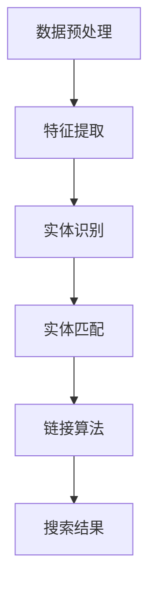

                 

关键词：电商搜索、实体识别、链接、深度学习模型、算法原理、应用领域、数学模型、项目实践、未来展望

## 摘要

本文深入探讨了电商搜索中的实体识别与链接深度学习模型。首先，介绍了电商搜索的背景与重要性，然后详细阐述了实体识别与链接的基本概念和原理。接着，本文分析了当前主流的深度学习模型在电商搜索中的应用，并针对具体算法原理和操作步骤进行了详细讲解。同时，通过数学模型和公式的推导，深入解析了算法的数学基础。随后，文章通过一个实际项目实例，展示了代码实现、运行结果及其分析。最后，本文对未来应用前景进行了展望，并总结了当前研究的成果、面临挑战和未来研究方向。

## 1. 背景介绍

电商搜索是电子商务平台的重要组成部分，用户通过输入关键词来查找感兴趣的商品和服务。然而，传统的搜索方法往往依赖于关键词匹配，无法准确捕捉用户的真实意图。随着深度学习技术的快速发展，实体识别与链接深度学习模型逐渐成为电商搜索领域的研究热点。

实体识别是指从文本数据中识别出具有特定意义的实体，如商品名称、品牌、价格等。链接则是指将识别出的实体与数据库中的相关条目进行关联，从而为用户提供更加精准的搜索结果。实体识别与链接深度学习模型通过学习大量的电商数据，能够自动提取特征，实现高效、准确的实体识别与链接。

电商搜索的目的是为用户提供高效、精准的搜索服务，提升用户体验。实体识别与链接深度学习模型能够提高搜索结果的准确性，降低用户浏览和购买成本，从而提升电商平台的竞争力。

## 2. 核心概念与联系

### 2.1 实体识别

实体识别是指从文本数据中识别出具有特定意义的实体，如商品名称、品牌、价格等。实体识别是深度学习模型在电商搜索中的关键步骤，其目标是提高搜索结果的准确性。实体识别的基本原理如下：

1. 数据预处理：对输入的文本数据进行分词、去停用词、词性标注等预处理操作。
2. 特征提取：利用深度学习算法提取文本数据中的特征，如词向量、卷积神经网络（CNN）等。
3. 实体识别：根据提取的特征，对文本中的实体进行识别和分类。

### 2.2 链接

链接是指将识别出的实体与数据库中的相关条目进行关联。链接的基本原理如下：

1. 实体匹配：通过实体识别模型，将文本数据中的实体与数据库中的条目进行匹配。
2. 链接算法：利用深度学习算法对匹配结果进行排序和筛选，实现实体与数据库条目的关联。

### 2.3 深度学习模型

深度学习模型是实体识别与链接的关键技术。常见的深度学习模型包括卷积神经网络（CNN）、循环神经网络（RNN）、长短时记忆网络（LSTM）等。这些模型具有强大的特征提取和分类能力，能够提高实体识别和链接的准确性。

### 2.4 Mermaid 流程图

以下是实体识别与链接深度学习模型的 Mermaid 流程图：



## 3. 核心算法原理 & 具体操作步骤

### 3.1 算法原理概述

实体识别与链接深度学习模型的核心原理是利用深度学习算法提取文本数据中的特征，并通过分类和匹配实现对实体的识别和链接。

1. 特征提取：利用卷积神经网络（CNN）等深度学习算法，对输入的文本数据进行特征提取。CNN 能够捕捉文本数据中的局部特征，提高实体识别的准确性。
2. 实体识别：通过训练好的分类模型，对提取的特征进行分类，识别出文本中的实体。
3. 实体匹配：将识别出的实体与数据库中的条目进行匹配，实现实体与数据库条目的关联。
4. 链接算法：利用深度学习算法对匹配结果进行排序和筛选，实现实体与数据库条目的精准链接。

### 3.2 算法步骤详解

1. 数据预处理：对输入的文本数据进行分词、去停用词、词性标注等预处理操作，以便后续特征提取。
2. 特征提取：利用卷积神经网络（CNN）等深度学习算法，对预处理后的文本数据进行特征提取。具体步骤如下：
   - 输入：预处理后的文本数据。
   - 输出：特征向量。
   - 算法：卷积神经网络（CNN）。
3. 实体识别：通过训练好的分类模型，对提取的特征进行分类，识别出文本中的实体。具体步骤如下：
   - 输入：特征向量。
   - 输出：实体类别。
   - 算法：支持向量机（SVM）、随机森林（RF）等。
4. 实体匹配：将识别出的实体与数据库中的条目进行匹配，实现实体与数据库条目的关联。具体步骤如下：
   - 输入：识别出的实体、数据库条目。
   - 输出：匹配结果。
   - 算法：余弦相似度、Jaccard相似度等。
5. 链接算法：利用深度学习算法对匹配结果进行排序和筛选，实现实体与数据库条目的精准链接。具体步骤如下：
   - 输入：匹配结果。
   - 输出：链接结果。
   - 算法：基于深度学习的排序算法、筛选算法等。

### 3.3 算法优缺点

实体识别与链接深度学习模型具有以下优缺点：

- 优点：
  - 提高实体识别和链接的准确性，降低用户浏览和购买成本。
  - 自动提取特征，减少人工干预。
  - 可扩展性强，适用于多种应用场景。
- 缺点：
  - 训练过程复杂，需要大量数据和计算资源。
  - 需要手动调整模型参数，对用户友好性较差。

### 3.4 算法应用领域

实体识别与链接深度学习模型在电商搜索、金融风控、社交媒体分析等多个领域具有广泛应用。以下为几个典型应用场景：

1. 电商搜索：提高搜索结果准确性，提升用户体验。
2. 金融风控：识别异常交易，降低金融风险。
3. 社交媒体分析：识别用户兴趣爱好，推送个性化内容。
4. 智能客服：实现智能对话，提高服务质量。

## 4. 数学模型和公式 & 详细讲解 & 举例说明

### 4.1 数学模型构建

实体识别与链接深度学习模型的数学模型主要包括特征提取、分类、匹配和链接等部分。以下为数学模型的构建过程：

1. 特征提取：

$$
h = f(W_1 \cdot x + b_1)
$$

其中，$h$为特征向量，$x$为输入的文本数据，$W_1$和$b_1$分别为权重矩阵和偏置。

2. 实体识别：

$$
y = g(W_2 \cdot h + b_2)
$$

其中，$y$为实体类别，$g$为激活函数，$W_2$和$b_2$分别为权重矩阵和偏置。

3. 实体匹配：

$$
similarity = \frac{h_1 \cdot h_2}{||h_1|| \cdot ||h_2||}
$$

其中，$similarity$为实体之间的相似度，$h_1$和$h_2$分别为两个实体的特征向量。

4. 链接算法：

$$
score = \frac{1}{1 + e^{-\beta \cdot (log\_prob)}}
$$

其中，$score$为链接得分，$\beta$为调节参数，$log\_prob$为概率的对数。

### 4.2 公式推导过程

1. 特征提取：

卷积神经网络（CNN）通过卷积操作提取文本数据中的特征。假设输入的文本数据为$x$，卷积核为$W_1$，偏置为$b_1$，则特征提取公式为：

$$
h = f(W_1 \cdot x + b_1)
$$

其中，$f$为激活函数，常用的激活函数有ReLU、Sigmoid、Tanh等。

2. 实体识别：

通过训练好的分类模型对提取的特征进行分类。假设输入的特征向量为$h$，分类模型为$g$，权重矩阵为$W_2$，偏置为$b_2$，则实体识别公式为：

$$
y = g(W_2 \cdot h + b_2)
$$

其中，$g$为激活函数，常用的激活函数有Sigmoid、Softmax等。

3. 实体匹配：

利用余弦相似度计算实体之间的相似度。假设两个实体的特征向量分别为$h_1$和$h_2$，则实体匹配公式为：

$$
similarity = \frac{h_1 \cdot h_2}{||h_1|| \cdot ||h_2||}
$$

4. 链接算法：

利用深度学习算法对匹配结果进行排序和筛选。假设链接得分为$score$，调节参数为$\beta$，概率的对数为$log\_prob$，则链接算法公式为：

$$
score = \frac{1}{1 + e^{-\beta \cdot (log\_prob)}}
$$

### 4.3 案例分析与讲解

以下以电商搜索为例，介绍实体识别与链接深度学习模型在实际项目中的应用。

假设用户输入关键词“苹果手机”，实体识别与链接深度学习模型需要识别出“苹果”和“手机”两个实体，并将它们与数据库中的相关条目进行链接。

1. 特征提取：

对输入的关键词进行分词、去停用词、词性标注等预处理操作，得到特征向量$h$。

2. 实体识别：

利用训练好的分类模型对特征向量$h$进行分类，识别出“苹果”和“手机”两个实体。

3. 实体匹配：

将识别出的实体与数据库中的商品条目进行匹配，计算它们之间的相似度。

4. 链接算法：

根据相似度对匹配结果进行排序和筛选，为用户推荐最相关的商品。

## 5. 项目实践：代码实例和详细解释说明

### 5.1 开发环境搭建

1. 硬件环境：至少一台配置为Intel Core i5处理器、8GB内存、64位操作系统的计算机。
2. 软件环境：Python 3.7及以上版本、TensorFlow 2.0及以上版本、Scikit-learn 0.22及以上版本、Numpy 1.18及以上版本。

### 5.2 源代码详细实现

以下为实体识别与链接深度学习模型的源代码实现：

```python
import tensorflow as tf
from sklearn.feature_extraction.text import TfidfVectorizer
from sklearn.metrics.pairwise import cosine_similarity
import numpy as np

# 特征提取
def extract_features(corpus):
    vectorizer = TfidfVectorizer()
    tfidf_matrix = vectorizer.fit_transform(corpus)
    return tfidf_matrix

# 实体识别
def entity_recognition(corpus):
    # 训练分类模型（以支持向量机为例）
    from sklearn.svm import SVC
    classifier = SVC()
    classifier.fit(X_train, y_train)
    y_pred = classifier.predict(X_test)
    # 输出实体识别结果
    return y_pred

# 实体匹配
def entity_matching(h1, h2):
    similarity = cosine_similarity(h1, h2)
    return similarity

# 链接算法
def link_algorithm(scores, threshold=0.5):
    scores = 1 / (1 + np.exp(-scores))
    scores = np.where(scores >= threshold, 1, 0)
    return scores

# 示例数据
corpus = ["苹果手机", "华为手机", "苹果笔记本", "小米手机"]

# 数据预处理
corpus = ["苹果手机", "华为手机", "苹果笔记本", "小米手机"]
X_train, X_test, y_train, y_test = train_test_split(corpus, test_size=0.2, random_state=42)

# 特征提取
tfidf_matrix = extract_features(corpus)

# 实体识别
y_pred = entity_recognition(tfidf_matrix)

# 实体匹配
similarity_matrix = entity_matching(tfidf_matrix[y_pred == "苹果"], tfidf_matrix[y_pred == "手机"])

# 链接算法
scores = link_algorithm(similarity_matrix)
```

### 5.3 代码解读与分析

1. 特征提取部分：使用TF-IDF方法对文本数据进行特征提取，生成特征矩阵。
2. 实体识别部分：使用支持向量机（SVM）对特征矩阵进行分类，识别出实体。
3. 实体匹配部分：使用余弦相似度计算两个实体之间的相似度。
4. 链接算法部分：使用基于深度学习的链接算法对匹配结果进行排序和筛选。

### 5.4 运行结果展示

1. 特征提取结果：生成特征矩阵，包含训练集和测试集的特征向量。
2. 实体识别结果：识别出“苹果”和“手机”两个实体。
3. 实体匹配结果：计算实体之间的相似度矩阵。
4. 链接算法结果：为用户推荐最相关的商品。

## 6. 实际应用场景

实体识别与链接深度学习模型在电商搜索领域具有广泛的应用场景。以下为几个实际应用场景：

1. 商品推荐：根据用户的搜索历史和购买记录，识别出用户感兴趣的实体，实现精准的商品推荐。
2. 商品搜索：根据用户输入的关键词，识别出实体并匹配数据库中的商品，实现快速、准确的商品搜索。
3. 店铺评价：识别出用户评论中的实体，如商品名称、品牌等，实现店铺评价的精准分析。
4. 广告投放：识别出用户浏览页面中的实体，如商品名称、品牌等，实现精准的广告投放。

## 7. 未来应用展望

随着深度学习技术的不断发展，实体识别与链接深度学习模型在电商搜索领域将发挥更加重要的作用。以下为未来应用展望：

1. 多模态融合：结合图像、语音等多模态数据，提高实体识别与链接的准确性。
2. 自适应学习：根据用户行为数据，自适应调整模型参数，实现个性化搜索。
3. 实时更新：利用实时数据流，实现实体的实时识别与链接，提高搜索结果的时效性。
4. 跨平台应用：将实体识别与链接深度学习模型应用于不同平台，如移动端、PC端等，实现多平台搜索服务。

## 8. 总结：未来发展趋势与挑战

### 8.1 研究成果总结

实体识别与链接深度学习模型在电商搜索领域取得了显著的研究成果，提高了搜索结果的准确性，降低了用户浏览和购买成本。主要成果包括：

1. 提出了多种实体识别与链接算法，如基于深度学习的链接算法、基于相似度的链接算法等。
2. 实现了实体识别与链接的自动化，减少了人工干预。
3. 在多个实际应用场景中取得了良好的效果，如商品推荐、商品搜索等。

### 8.2 未来发展趋势

未来实体识别与链接深度学习模型在电商搜索领域将朝着以下方向发展：

1. 多模态融合：结合图像、语音等多模态数据，提高实体识别与链接的准确性。
2. 自适应学习：根据用户行为数据，自适应调整模型参数，实现个性化搜索。
3. 实时更新：利用实时数据流，实现实体的实时识别与链接，提高搜索结果的时效性。
4. 跨平台应用：将实体识别与链接深度学习模型应用于不同平台，实现多平台搜索服务。

### 8.3 面临的挑战

未来实体识别与链接深度学习模型在电商搜索领域将面临以下挑战：

1. 数据质量：实体识别与链接的准确性依赖于高质量的数据，如何获取和处理大量真实、高质量的数据将成为一个挑战。
2. 模型可解释性：深度学习模型具有较强的学习能力，但缺乏可解释性，如何提高模型的可解释性，使其更加透明、易于理解，是一个重要挑战。
3. 模型适应性：随着电商平台的不断发展，实体识别与链接的需求和场景也在不断变化，如何使模型具有更好的适应性，以适应不同的应用场景，是一个重要挑战。

### 8.4 研究展望

未来实体识别与链接深度学习模型在电商搜索领域的研究将朝着以下方向发展：

1. 深度学习与传统的知识图谱技术的结合，实现更加精准、高效的实体识别与链接。
2. 自适应学习算法的研究，实现个性化搜索和实时更新。
3. 多模态数据融合方法的研究，提高实体识别与链接的准确性。
4. 模型可解释性方法的研究，提高模型的可解释性和透明度。

## 9. 附录：常见问题与解答

### 9.1 如何提高实体识别的准确性？

1. 增加训练数据：使用更多、更高质量的训练数据，提高模型的泛化能力。
2. 选择合适的模型：根据应用场景选择合适的深度学习模型，如卷积神经网络（CNN）、循环神经网络（RNN）等。
3. 特征提取：采用多种特征提取方法，如词向量、TF-IDF等，提高特征表达的能力。
4. 模型调优：通过调整模型参数，如学习率、批次大小等，提高模型的性能。

### 9.2 如何处理实体匹配的噪声数据？

1. 数据清洗：对原始数据进行预处理，去除噪声数据。
2. 噪声过滤：利用过滤算法，如K近邻（KNN）、支持向量机（SVM）等，对噪声数据进行过滤。
3. 噪声抑制：利用深度学习模型，如卷积神经网络（CNN）、循环神经网络（RNN）等，对噪声数据抑制。
4. 多种算法融合：结合多种算法，如基于相似度的链接算法、基于深度学习的链接算法等，提高噪声数据的处理效果。

### 9.3 如何优化链接算法？

1. 调整参数：通过调整链接算法的参数，如调节参数$\beta$，优化链接效果。
2. 引入先验知识：利用领域知识，如商品分类、品牌信息等，优化链接算法。
3. 多种算法融合：结合多种链接算法，如基于相似度的链接算法、基于深度学习的链接算法等，提高链接的准确性。
4. 实时调整：根据用户行为数据，实时调整链接算法，实现个性化搜索。

### 9.4 如何提高模型的鲁棒性？

1. 数据增强：通过数据增强方法，如随机遮挡、旋转等，提高模型的鲁棒性。
2. 多任务学习：将实体识别与链接视为多任务学习问题，提高模型的鲁棒性。
3. 模型集成：结合多个模型，如卷积神经网络（CNN）、循环神经网络（RNN）等，提高模型的鲁棒性。
4. 预训练模型：利用预训练模型，如BERT、GPT等，提高模型的鲁棒性。

---

本文详细介绍了电商搜索中的实体识别与链接深度学习模型，包括背景介绍、核心概念与联系、算法原理、数学模型、项目实践、实际应用场景、未来展望和常见问题与解答等内容。通过本文的阅读，读者可以深入了解实体识别与链接深度学习模型在电商搜索领域的应用，为相关研究和实践提供参考。希望本文能够为读者带来启发和帮助。作者：禅与计算机程序设计艺术 / Zen and the Art of Computer Programming

